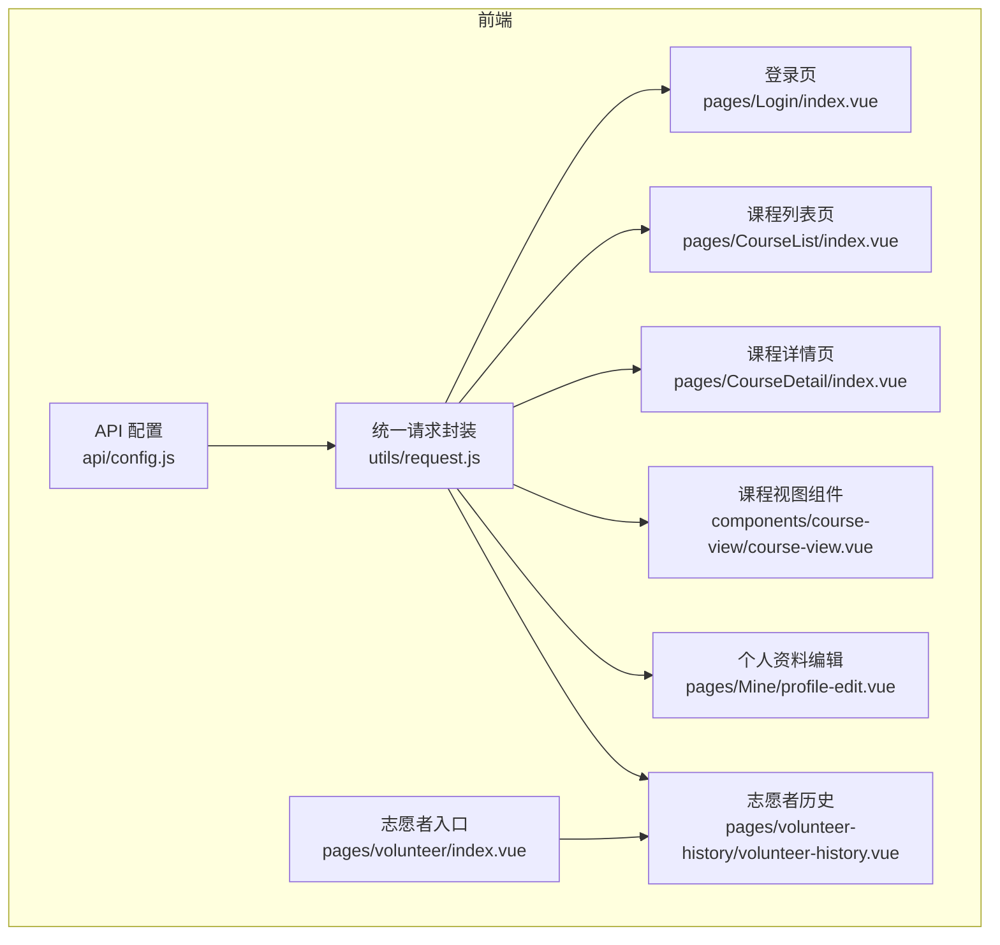
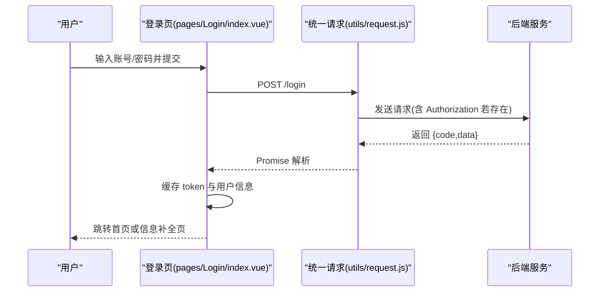
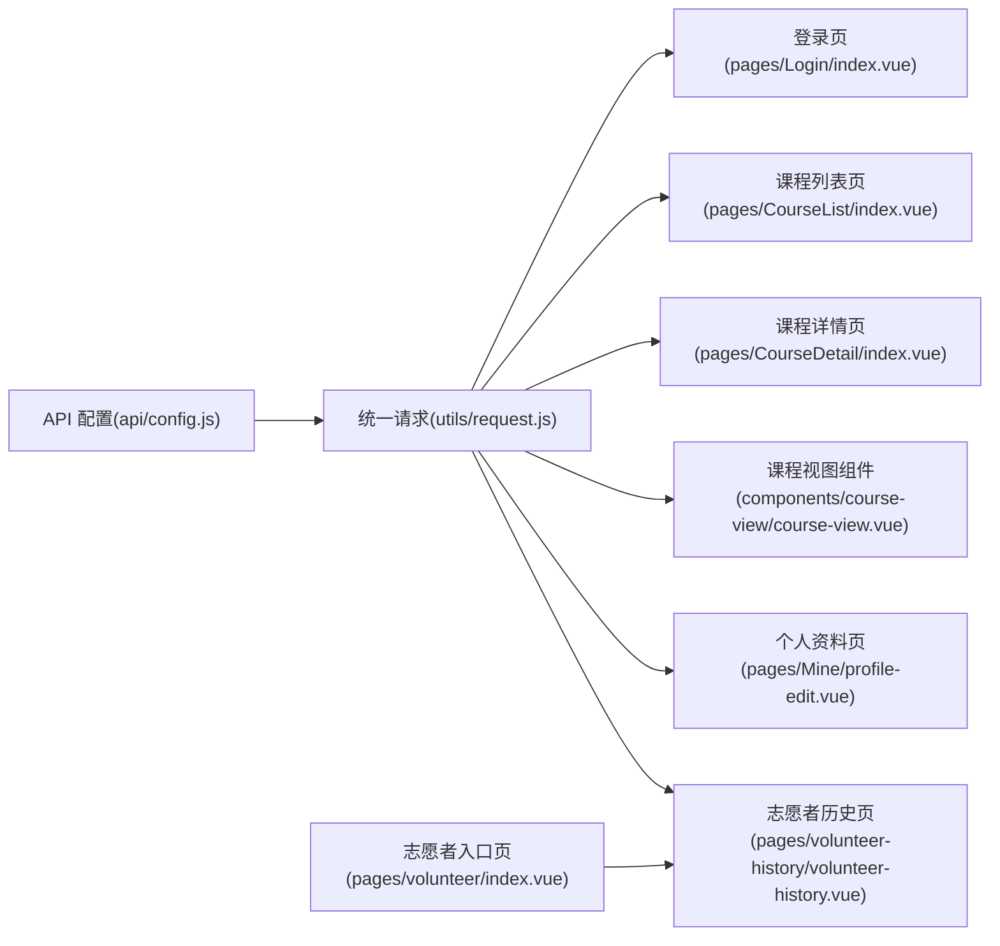

# API 接口文档

<cite>
**本文档引用的文件**
- [api/config.js](file://api/config.js)
- [utils/request.js](file://utils/request.js)
- [pages/Login/index.vue](file://pages/Login/index.vue)
- [pages/CourseList/index.vue](file://pages/CourseList/index.vue)
- [pages/CourseDetail/index.vue](file://pages/CourseDetail/index.vue)
- [components/course-view/course-view.vue](file://components/course-view/course-view.vue)
- [pages/Mine/profile-edit.vue](file://pages/Mine/profile-edit.vue)
- [pages/volunteer-history/volunteer-history.vue](file://pages/volunteer-history/volunteer-history.vue)
- [pages/volunteer/index.vue](file://pages/volunteer/index.vue)
</cite>

## 目录
1. [简介](#简介)
2. [项目结构](#项目结构)
3. [核心组件](#核心组件)
4. [架构总览](#架构总览)
5. [详细接口分析](#详细接口分析)
6. [依赖关系分析](#依赖关系分析)
7. [性能与安全](#性能与安全)
8. [故障排查指南](#故障排查指南)
9. [结论](#结论)

## 简介
本文件为“致良知教育”小程序前端项目的 API 接口文档，覆盖用户认证、课程管理、志愿者服务与文件上传等核心业务域。文档基于前端源码中的 API 配置与调用实现进行梳理，明确各接口的 HTTP 方法、URL 模式、请求参数、响应格式与错误处理策略，并给出常见使用场景与最佳实践。

## 项目结构
前端通过统一请求封装与 API 配置集中管理后端接口，页面组件按功能模块组织，课程、志愿者、我的等页面分别调用对应接口。

图表来源
- [api/config.js:15-56](file://api/config.js#L15-L56)
- [utils/request.js:7-95](file://utils/request.js#L7-L95)
- [pages/Login/index.vue:196-282](file://pages/Login/index.vue#L196-L282)
- [pages/CourseList/index.vue:205-237](file://pages/CourseList/index.vue#L205-L237)
- [pages/CourseDetail/index.vue:128-139](file://pages/CourseDetail/index.vue#L128-L139)
- [components/course-view/course-view.vue:172-193](file://components/course-view/course-view.vue#L172-L193)
- [pages/Mine/profile-edit.vue:213-226](file://pages/Mine/profile-edit.vue#L213-L226)
- [pages/volunteer-history/volunteer-history.vue:92-121](file://pages/volunteer-history/volunteer-history.vue#L92-L121)
- [pages/volunteer/index.vue:1-210](file://pages/volunteer/index.vue#L1-L210)

章节来源
- [api/config.js:15-56](file://api/config.js#L15-L56)
- [utils/request.js:7-95](file://utils/request.js#L7-L95)

## 核心组件
- API 配置中心：集中维护后端基础地址与各接口路径，支持动态拼接与占位符替换。
- 统一请求封装：自动注入 Authorization 头、处理 401 未授权、统一封装 GET/POST 快捷方法。
- 页面与组件：按功能模块调用统一请求或直接使用 uni.request/uni.uploadFile。

章节来源
- [api/config.js:8-56](file://api/config.js#L8-L56)
- [utils/request.js:7-95](file://utils/request.js#L7-L95)

## 架构总览
以下序列图展示登录流程与文件上传流程的关键交互。

图表来源
- [pages/Login/index.vue:196-282](file://pages/Login/index.vue#L196-L282)
- [utils/request.js:7-67](file://utils/request.js#L7-L67)

## 详细接口分析

### 用户认证接口
- 登录
  - 方法与路径
    - POST /login
  - 请求头
    - Content-Type: application/json
  - 请求体字段
    - username: 字符串，必填
    - password: 字符串，必填
  - 成功响应
    - code: 200
    - data.token: 字符串
    - data.userInfo: 对象
    - data.isComplete: 布尔值
  - 失败响应
    - 其他 code 或错误消息
  - 安全与鉴权
    - 成功后前端缓存 token；后续请求由统一封装自动注入 Authorization 头
  - 常见场景
    - 正常登录后根据 isComplete 决定跳转至首页或信息补全页
  - 最佳实践
    - 登录前校验协议勾选；对手机号密码长度进行前端提示

- 微信一键登录
  - 方法与路径
    - POST /wxLogin
  - 请求头
    - Content-Type: application/json
  - 请求体字段
    - code: 字符串，必填（微信登录凭证）
    - nickname: 字符串，必填
    - avatar: 字符串，必填
  - 成功响应
    - code: 200
    - data.token: 字符串
    - data.userInfo: 对象
  - 失败响应
    - 其他 code 或错误消息
  - 常见场景
    - 完成微信授权后提交 code 与用户头像/昵称
  - 最佳实践
    - 弹窗引导完善头像与昵称后再提交

- 获取用户信息
  - 方法与路径
    - GET /user/info
  - 请求头
    - Authorization: Bearer <token>
  - 查询参数
    - 无
  - 成功响应
    - code: 200
    - data: 用户信息对象
  - 失败响应
    - 401 时前端自动清除 token 并跳转登录

- 退出登录
  - 方法与路径
    - POST /user/logout
  - 请求头
    - Authorization: Bearer <token>
  - 查询参数
    - 无
  - 成功响应
    - code: 200
  - 失败响应
    - 其他 code 或错误消息

章节来源
- [api/config.js:18-22](file://api/config.js#L18-L22)
- [pages/Login/index.vue:196-282](file://pages/Login/index.vue#L196-L282)
- [pages/Login/index.vue:357-430](file://pages/Login/index.vue#L357-L430)
- [pages/Mine/profile-edit.vue:297-311](file://pages/Mine/profile-edit.vue#L297-L311)
- [utils/request.js:29-44](file://utils/request.js#L29-L44)

### 课程管理接口
- 获取热门课程
  - 方法与路径
    - GET /courses/hot
  - 请求头
    - Authorization: Bearer <token>（如需）
  - 查询参数
    - 无
  - 成功响应
    - code: 200
    - data: 热门课程列表

- 获取课程列表
  - 方法与路径
    - GET /courses/list
  - 请求头
    - Authorization: Bearer <token>（如需）
  - 查询参数
    - pageNum: 整数
    - pageSize: 整数
    - status: 整数（如 1 表示进行中）
  - 成功响应
    - code: 200
    - data.total: 总数
    - data.list: 课程数组
  - 常见场景
    - 列表分页加载与下拉刷新

- 获取课程详情
  - 方法与路径
    - GET /courses/detail
  - 请求头
    - Authorization: Bearer <token>（如需）
  - 查询参数
    - id: 课程 ID
  - 成功响应
    - code: 200
    - data: 课程详情对象

- 获取课程安排（占位符）
  - 方法与路径
    - GET /courses/{campId}/schedule
  - 请求头
    - Authorization: Bearer <token>（如需）
  - 路径参数
    - campId: 营期 ID
  - 成功响应
    - code: 200
    - data: 课程安排

- 获取今日课程（占位符）
  - 方法与路径
    - GET /courses/{campId}/today
  - 请求头
    - Authorization: Bearer <token>（如需）
  - 路径参数
    - campId: 营期 ID
  - 成功响应
    - code: 200
    - data: 今日课程

- 获取课程数据看板（占位符）
  - 方法与路径
    - GET /courses/{campId}/data
  - 请求头
    - Authorization: Bearer <token>（如需）
  - 路径参数
    - campId: 营期 ID
  - 成功响应
    - code: 200
    - data: 数据看板

- 课程信息查询（页面直连）
  - 方法与路径
    - GET /courses/{id}/info
  - 请求头
    - Authorization: Bearer <token>（如需）
  - 路径参数
    - id: 课程 ID
  - 成功响应
    - code: 200
    - data: 课程信息

- 课程报名身份核验
  - 方法与路径
    - GET /enrollment/check
  - 请求头
    - Authorization: Bearer <token>（如需）
  - 查询参数
    - campId: 营期 ID
  - 成功响应
    - code: 200
    - data: 布尔值（是否已报名）

- 课程报名
  - 方法与路径
    - POST /camp/enroll
  - 请求头
    - Authorization: Bearer <token>
  - 请求体字段
    - campId: 数字
  - 成功响应
    - code: 200
    - data: 报名结果

章节来源
- [api/config.js:26-31](file://api/config.js#L26-L31)
- [api/config.js:52-55](file://api/config.js#L52-L55)
- [pages/CourseList/index.vue:175-237](file://pages/CourseList/index.vue#L175-L237)
- [pages/CourseDetail/index.vue:128-139](file://pages/CourseDetail/index.vue#L128-L139)
- [components/course-view/course-view.vue:172-193](file://components/course-view/course-view.vue#L172-L193)

### 志愿者服务接口
- 获取志愿者管理范围
  - 方法与路径
    - GET /volunteer/scopes
  - 请求头
    - Authorization: Bearer <token>
  - 查询参数
    - 无
  - 成功响应
    - code: 200
    - data: 管理范围列表

- 获取志愿者成员列表
  - 方法与路径
    - GET /volunteer/manage/members
  - 请求头
    - Authorization: Bearer <token>
  - 查询参数
    - 无
  - 成功响应
    - code: 200
    - data: 成员列表

- 获取可分配岗位
  - 方法与路径
    - GET /volunteer/manage/duty-assignment
  - 请求头
    - Authorization: Bearer <token>
  - 查询参数
    - 无
  - 成功响应
    - code: 200
    - data: 岗位列表

- 搜索用户
  - 方法与路径
    - GET /user/search
  - 请求头
    - Authorization: Bearer <token>
  - 查询参数
    - 关键词
  - 成功响应
    - code: 200
    - data: 用户列表

- 分配岗位
  - 方法与路径
    - POST /volunteer/manage/assign-duty
  - 请求头
    - Authorization: Bearer <token>
  - 请求体字段
    - userId: 数字
    - dutyId: 数字
  - 成功响应
    - code: 200

- 移除岗位
  - 方法与路径
    - POST /volunteer/manage/remove-duty
  - 请求头
    - Authorization: Bearer <token>
  - 请求体字段
    - userId: 数字
    - dutyId: 数字
  - 成功响应
    - code: 200

- 获取班级/大组/小组列表
  - 方法与路径
    - GET /class/list
    - GET /bigGroup/list
    - GET /smallGroup/list
  - 请求头
    - Authorization: Bearer <token>
  - 查询参数
    - 无
  - 成功响应
    - code: 200
    - data: 列表

- 获取作业相关接口
  - 获取作业名单
    - GET /homework/list
  - 标记优秀作业
    - POST /camp/homework/mark
  - 优秀作业列表
    - GET /homework/excellent/list
  - 作业详情
    - GET /homework/detail
  - 作业统计数据
    - GET /homework/stats
  - 作业状态统计（未交/已交/迟交）
    - GET /homework/status/list

- 任务打卡
  - 方法与路径
    - POST /courses/plan/{planId}/task/complete
  - 请求头
    - Authorization: Bearer <token>
  - 路径参数
    - planId: 计划 ID
  - 成功响应
    - code: 200

- 获取志愿者历史
  - 方法与路径
    - GET /user/volunteer-history
  - 请求头
    - Authorization: Bearer <token>
  - 查询参数
    - 无
  - 成功响应
    - code: 200
    - data.volunteerHistory: 历史数组

- 退出担当
  - 方法与路径
    - POST /user/volunteer-quit
  - 请求头
    - Authorization: Bearer <token>
  - 查询参数
    - 无
  - 成功响应
    - code: 200

- 获取志愿者统计
  - 方法与路径
    - GET /user/volunteer-stats
  - 请求头
    - Authorization: Bearer <token>
  - 查询参数
    - 无
  - 成功响应
    - code: 200
    - data: 统计数据

章节来源
- [api/config.js:36-51](file://api/config.js#L36-L51)
- [pages/volunteer-history/volunteer-history.vue:92-121](file://pages/volunteer-history/volunteer-history.vue#L92-L121)

### 文件上传接口
- 通用上传
  - 方法与路径
    - POST /common/upload?type=avatar
  - 请求头
    - Authorization: Bearer <token>
  - 查询参数
    - type: avatar（头像）
  - 表单字段
    - file: 二进制文件
  - 成功响应
    - code: 200
    - data: 上传后的资源地址
  - 常见场景
    - 个人资料页更换头像
  - 最佳实践
    - 上传前选择图片并显示预览；上传完成后更新本地头像字段

章节来源
- [api/config.js:24](file://api/config.js#L24)
- [pages/Mine/profile-edit.vue:213-226](file://pages/Mine/profile-edit.vue#L213-L226)

## 依赖关系分析
- 统一请求封装依赖 API 配置中心，自动注入 Authorization 头并处理 401。
- 页面与组件通过 API 配置中心获取路径，再调用统一请求或 uni.request/uni.uploadFile。
- 志愿者入口页聚合多个子页面，子页面间通过事件通信触发刷新。

图表来源
- [api/config.js:15-56](file://api/config.js#L15-L56)
- [utils/request.js:7-95](file://utils/request.js#L7-L95)
- [pages/Login/index.vue:196-282](file://pages/Login/index.vue#L196-L282)
- [pages/CourseList/index.vue:205-237](file://pages/CourseList/index.vue#L205-L237)
- [pages/CourseDetail/index.vue:128-139](file://pages/CourseDetail/index.vue#L128-L139)
- [components/course-view/course-view.vue:172-193](file://components/course-view/course-view.vue#L172-L193)
- [pages/Mine/profile-edit.vue:213-226](file://pages/Mine/profile-edit.vue#L213-L226)
- [pages/volunteer-history/volunteer-history.vue:92-121](file://pages/volunteer-history/volunteer-history.vue#L92-L121)
- [pages/volunteer/index.vue:1-210](file://pages/volunteer/index.vue#L1-L210)

## 性能与安全
- 性能
  - 列表分页加载：课程列表页采用 pageNum/pageSize 控制分页，避免一次性加载过多数据。
  - 下拉刷新与上拉加载：结合 uni.stopPullDownRefresh 与 reachBottom 事件控制请求频率。
- 安全
  - 统一注入 Authorization 头，减少重复代码与遗漏风险。
  - 401 未授权时自动清理 token 并跳转登录，避免敏感信息泄露。
  - 上传接口建议配合后端文件类型与大小限制，前端可做预校验以提升体验。

[本节为通用指导，无需列出章节来源]

## 故障排查指南
- 登录失败
  - 确认用户名/密码格式与长度；检查协议勾选。
  - 查看返回的错误消息，必要时在前端弹窗提示。
- 401 未授权
  - 统一请求封装会自动清除 token 并跳转登录页；检查 token 是否过期或被篡改。
- 网络异常
  - 统一请求封装会提示“网络连接异常”，检查设备网络与后端服务可达性。
- 上传失败
  - 确认选择了有效文件且类型符合要求；检查 Authorization 头是否正确注入。

章节来源
- [utils/request.js:29-64](file://utils/request.js#L29-L64)
- [pages/Login/index.vue:268-281](file://pages/Login/index.vue#L268-L281)
- [pages/Mine/profile-edit.vue:213-226](file://pages/Mine/profile-edit.vue#L213-L226)

## 结论
本接口文档基于前端源码梳理了认证、课程、志愿者与上传等核心接口，明确了请求方式、参数与响应规范，并提供了常见场景与最佳实践。建议在联调阶段结合后端接口文档进一步完善契约与错误码定义，确保前后端一致性与稳定性。