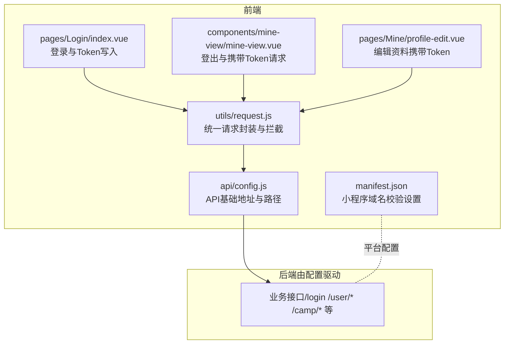
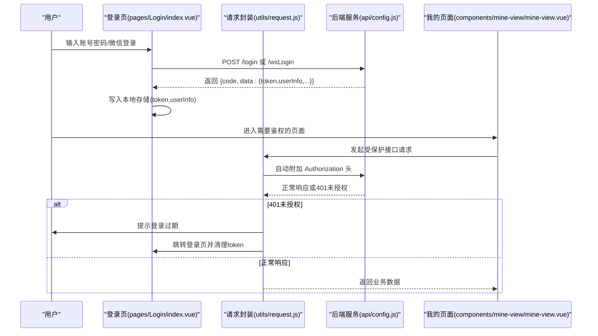
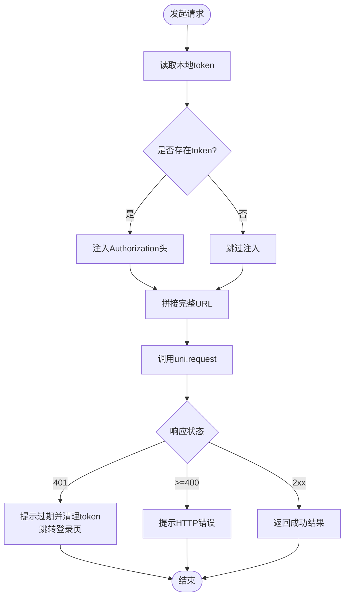
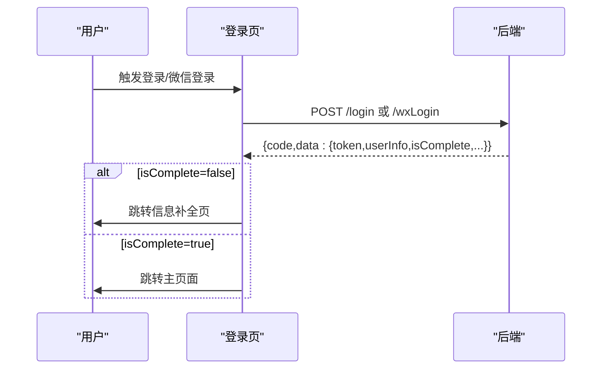
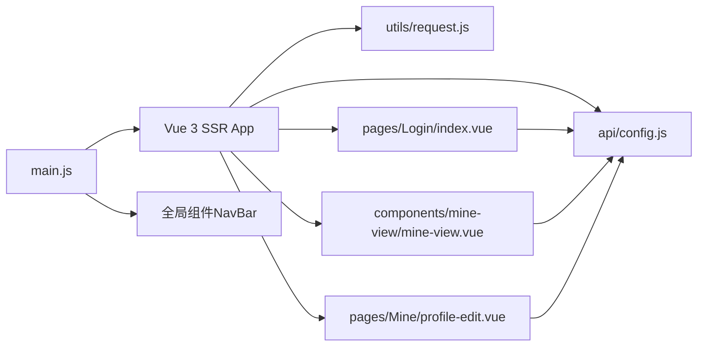

# API 认证与安全

<cite>
**本文引用的文件**   
- [utils/request.js](file://utils/request.js)
- [pages/Login/index.vue](file://pages/Login/index.vue)
- [api/config.js](file://api/config.js)
- [components/mine-view/mine-view.vue](file://components/mine-view/mine-view.vue)
- [pages/Mine/profile-edit.vue](file://pages/Mine/profile-edit.vue)
- [manifest.json](file://manifest.json)
- [package.json](file://package.json)
- [main.js](file://main.js)
- [doc/login-function-modification.md](file://doc/login-function-modification.md)
- [doc/课程报名400错误完整排查报告.md](file://doc/课程报名400错误完整排查报告.md)
</cite>

## 目录
1. [简介](#简介)
2. [项目结构](#项目结构)
3. [核心组件](#核心组件)
4. [架构总览](#架构总览)
5. [详细组件分析](#详细组件分析)
6. [依赖分析](#依赖分析)
7. [性能考虑](#性能考虑)
8. [故障排查指南](#故障排查指南)
9. [结论](#结论)
10. [附录](#附录)

## 简介
本文件聚焦于本项目的 API 认证与安全机制，覆盖 Token 认证流程、请求头设置、请求拦截与错误处理策略；并结合现有实现，给出安全最佳实践、CORS 与 HTTPS 要求、请求频率限制与防刷建议，以及开发与生产环境差异、调试与排障方法。需要特别说明的是：当前仓库未包含后端服务源码，因此本文以“前端视角”总结与提炼可落地的安全实践与现有实现要点。

## 项目结构
本项目采用 uni-app/Vue 3 结构，认证与安全相关的关键文件分布如下：
- 统一请求封装与拦截：utils/request.js
- 登录入口与 Token 写入：pages/Login/index.vue
- API 基础配置与路径：api/config.js
- 个人信息与登出使用 Token：components/mine-view/mine-view.vue、pages/Mine/profile-edit.vue
- 小程序平台配置（含域名校验开关）：manifest.json
- 依赖与运行入口：package.json、main.js

图表来源
- [utils/request.js:1-98](file://utils/request.js#L1-L98)
- [pages/Login/index.vue:138-454](file://pages/Login/index.vue#L138-L454)
- [api/config.js:1-60](file://api/config.js#L1-L60)
- [components/mine-view/mine-view.vue:345-374](file://components/mine-view/mine-view.vue#L345-L374)
- [pages/Mine/profile-edit.vue:190-200](file://pages/Mine/profile-edit.vue#L190-L200)
- [manifest.json:52-58](file://manifest.json#L52-L58)

章节来源
- [utils/request.js:1-98](file://utils/request.js#L1-L98)
- [pages/Login/index.vue:138-454](file://pages/Login/index.vue#L138-L454)
- [api/config.js:1-60](file://api/config.js#L1-L60)
- [components/mine-view/mine-view.vue:345-374](file://components/mine-view/mine-view.vue#L345-L374)
- [pages/Mine/profile-edit.vue:190-200](file://pages/Mine/profile-edit.vue#L190-L200)
- [manifest.json:52-58](file://manifest.json#L52-L58)

## 核心组件
- 统一请求封装与拦截：负责自动注入 Authorization 头、处理 401 未授权、网络异常提示与统一 Promise 化返回。
- 登录流程：发起登录请求，接收后端返回的 token 与用户信息，写入本地存储，并按返回状态进行页面跳转。
- API 配置：集中管理 baseUrl 与各业务路径，便于开发与生产环境切换。
- 个人信息与登出：在需要鉴权的接口中携带 Authorization 头，登出时清理本地存储并跳转登录页。

章节来源
- [utils/request.js:7-67](file://utils/request.js#L7-L67)
- [pages/Login/index.vue:196-282](file://pages/Login/index.vue#L196-L282)
- [api/config.js:8-57](file://api/config.js#L8-L57)
- [components/mine-view/mine-view.vue:345-374](file://components/mine-view/mine-view.vue#L345-L374)
- [pages/Mine/profile-edit.vue:190-200](file://pages/Mine/profile-edit.vue#L190-L200)

## 架构总览
下图展示从前端到后端的认证与安全关键路径：登录获取 Token → 请求自动注入 Token → 401 统一拦截 → 登出清理 Token。

图表来源
- [pages/Login/index.vue:196-282](file://pages/Login/index.vue#L196-L282)
- [utils/request.js:28-44](file://utils/request.js#L28-L44)
- [api/config.js:16-56](file://api/config.js#L16-L56)
- [components/mine-view/mine-view.vue:345-374](file://components/mine-view/mine-view.vue#L345-L374)

## 详细组件分析

### 统一请求封装与拦截（utils/request.js）
- 自动注入 Authorization 头：从本地存储读取 token 并拼接到请求头。
- URL 拼接：若 options.url 未以 http 开头，则与 API_CONFIG.baseUrl 拼接。
- 401 统一处理：当响应状态码为 401 时，提示“登录已过期”，清理 token 并跳转登录页。
- 网络异常处理：fail 回调统一提示“网络连接异常”。

图表来源
- [utils/request.js:7-67](file://utils/request.js#L7-L67)

章节来源
- [utils/request.js:7-67](file://utils/request.js#L7-L67)

### 登录流程与 Token 写入（pages/Login/index.vue）
- 登录请求：向 /login 或 /wxLogin 发起登录，成功后将 token 与 userInfo 写入本地存储。
- 条件跳转：根据后端返回的 isComplete 决定跳转至信息补全页或主页面。
- 微信登录：获取临时登录凭证 code，提交头像与昵称，成功后同样写入 token 与 userInfo。

图表来源
- [pages/Login/index.vue:196-282](file://pages/Login/index.vue#L196-L282)
- [pages/Login/index.vue:311-430](file://pages/Login/index.vue#L311-L430)

章节来源
- [pages/Login/index.vue:196-282](file://pages/Login/index.vue#L196-L282)
- [pages/Login/index.vue:311-430](file://pages/Login/index.vue#L311-L430)

### API 配置与路径（api/config.js）
- 环境区分：通过 NODE_ENV 判断开发环境，设置 baseUrl。
- 路径集中管理：login、wxLogin、user/info、camp/enroll 等路径集中在此，便于维护与切换。

章节来源
- [api/config.js:4-57](file://api/config.js#L4-L57)

### 个人信息与登出（components/mine-view/mine-view.vue、pages/Mine/profile-edit.vue）
- 个人信息页：在需要鉴权的接口中显式携带 Authorization 头。
- 登出流程：弹窗确认后，调用 /user/logout 接口，清理本地 token、userInfo、currentIdentity，并跳转登录页。

章节来源
- [components/mine-view/mine-view.vue:345-374](file://components/mine-view/mine-view.vue#L345-L374)
- [pages/Mine/profile-edit.vue:190-200](file://pages/Mine/profile-edit.vue#L190-L200)

### 请求头设置与 Token 格式
- 当前实现：直接将 token 写入 Authorization 头，未添加 “Bearer ” 前缀。
- 建议：遵循标准 Bearer 语法，如 “Authorization: Bearer <token>”。可在请求封装中统一处理，避免各处硬编码。

章节来源
- [utils/request.js:14-17](file://utils/request.js#L14-L17)
- [doc/login-function-modification.md:102-113](file://doc/login-function-modification.md#L102-L113)

### Token 刷新机制
- 现状：当前仓库未发现前端主动刷新 Token 的实现。
- 建议：后端返回短期 Access Token 与长期 Refresh Token；前端在 Access Token 即将过期时，使用 Refresh Token 向后端换取新 Token，并在请求拦截器中自动替换。此为通用最佳实践，需后端配合。

章节来源
- [utils/request.js:28-44](file://utils/request.js#L28-L44)

### 请求拦截器配置
- 现状：通过统一请求封装在 success/fail 回调中处理 401 与网络异常。
- 建议：抽象“请求拦截器”与“响应拦截器”，在请求前注入头、在响应后统一对 401/403/5xx 做处理，提升一致性与可维护性。

章节来源
- [utils/request.js:24-66](file://utils/request.js#L24-L66)

### 错误处理策略
- 401 未授权：统一提示“登录已过期”，清理 token 并跳转登录页。
- 其他 4xx/5xx：统一提示 HTTP 状态码并拒绝 Promise。
- 网络异常：统一提示“网络连接异常”。

章节来源
- [utils/request.js:28-64](file://utils/request.js#L28-L64)

## 依赖分析
- 运行时框架：Vue 3（SSR App 创建），全局注册 NavBar 组件。
- 平台能力：uni-app 提供跨端请求与本地存储能力。
- 小程序平台：manifest.json 中 mp-weixin 的 setting.urlCheck 默认关闭，便于开发阶段快速联调；生产环境建议开启。

图表来源
- [main.js:18-25](file://main.js#L18-L25)
- [utils/request.js:1-98](file://utils/request.js#L1-L98)
- [pages/Login/index.vue:138-454](file://pages/Login/index.vue#L138-L454)
- [api/config.js:1-60](file://api/config.js#L1-L60)
- [components/mine-view/mine-view.vue:135-376](file://components/mine-view/mine-view.vue#L135-L376)
- [pages/Mine/profile-edit.vue:117-200](file://pages/Mine/profile-edit.vue#L117-L200)

章节来源
- [main.js:18-25](file://main.js#L18-L25)
- [package.json:1-6](file://package.json#L1-L6)

## 性能考虑
- 请求合并与去抖：对高频接口（如查询类）进行去抖/节流，减少无效请求。
- 缓存策略：对只读数据（如课程列表）采用本地缓存与失效策略，降低网络压力。
- 图片与静态资源：使用 CDN 与懒加载，减少首屏阻塞。
- 401 统一拦截：避免重复登录态校验逻辑，减少分支判断成本。

## 故障排查指南
- 登录后仍提示 401
  - 检查请求头是否正确注入 Authorization（建议使用 “Bearer <token>”）。
  - 确认后端是否正确解析 Authorization 头。
  - 参考：[utils/request.js:14-17](file://utils/request.js#L14-L17)、[doc/login-function-modification.md:102-113](file://doc/login-function-modification.md#L102-L113)
- 登录成功但页面无数据
  - 检查 userInfo 是否写入本地存储，以及后续接口是否携带 Authorization。
  - 参考：[pages/Login/index.vue:214-222](file://pages/Login/index.vue#L214-L222)
- 微信登录失败
  - 检查 code 获取与提交流程，确认后端 /wxLogin 接口可用。
  - 参考：[pages/Login/index.vue:311-430](file://pages/Login/index.vue#L311-L430)
- 登出后仍可访问
  - 确认登出接口调用成功且本地 token 已清理。
  - 参考：[components/mine-view/mine-view.vue:345-374](file://components/mine-view/mine-view.vue#L345-L374)
- 生产环境无法访问接口
  - 检查 manifest.json 中 mp-weixin.setting.urlCheck 设置，必要时开启并配置合法域名。
  - 参考：[manifest.json:52-58](file://manifest.json#L52-L58)

章节来源
- [utils/request.js:14-17](file://utils/request.js#L14-L17)
- [pages/Login/index.vue:214-222](file://pages/Login/index.vue#L214-L222)
- [pages/Login/index.vue:311-430](file://pages/Login/index.vue#L311-L430)
- [components/mine-view/mine-view.vue:345-374](file://components/mine-view/mine-view.vue#L345-L374)
- [manifest.json:52-58](file://manifest.json#L52-L58)

## 结论
本项目已具备基础的 Token 认证与统一请求拦截能力：登录成功写入 token，请求自动注入 Authorization，401 统一处理并引导重新登录。为进一步强化安全，建议补充：
- 请求头标准化（Bearer 前缀）
- Token 刷新机制（前后端协同）
- 统一拦截器抽象
- CORS 与 HTTPS 要求
- 请求频率限制与防刷策略
- 生产环境域名校验与 HTTPS 强制

## 附录

### 安全最佳实践清单
- 请求头
  - 使用 “Authorization: Bearer <token>”
  - 避免在 URL 或请求体明文传输 token
- 传输安全
  - 强制 HTTPS，避免中间人攻击
  - 生产环境开启域名校验（manifest.json 中 mp-weixin.setting.urlCheck）
- 存储安全
  - 仅存放必要字段，避免敏感信息
  - 登出时清理 token、userInfo、currentIdentity
- 业务安全
  - 对关键操作（如报名）做前端二次校验（时间、状态）
  - 后端严格校验权限与参数
- 防刷与限流
  - 前端：防重复点击、节流/去抖
  - 后端：接口级限流、IP 黑名单、验证码

### 开发与生产环境差异
- 开发环境
  - API 基础地址指向本地服务（http）
  - 小程序域名校验可暂时关闭（便于联调）
- 生产环境
  - 切换为 https 与正式域名
  - 开启域名校验与 HTTPS 强制

章节来源
- [api/config.js:4-13](file://api/config.js#L4-L13)
- [manifest.json:52-58](file://manifest.json#L52-L58)