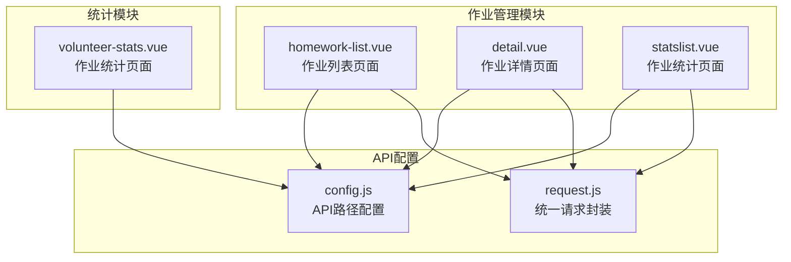
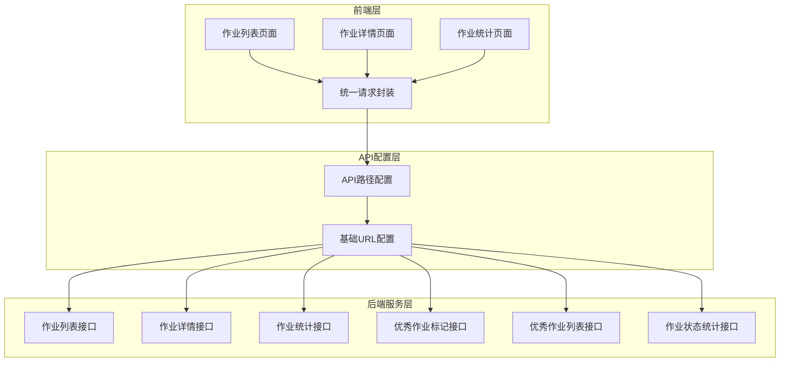
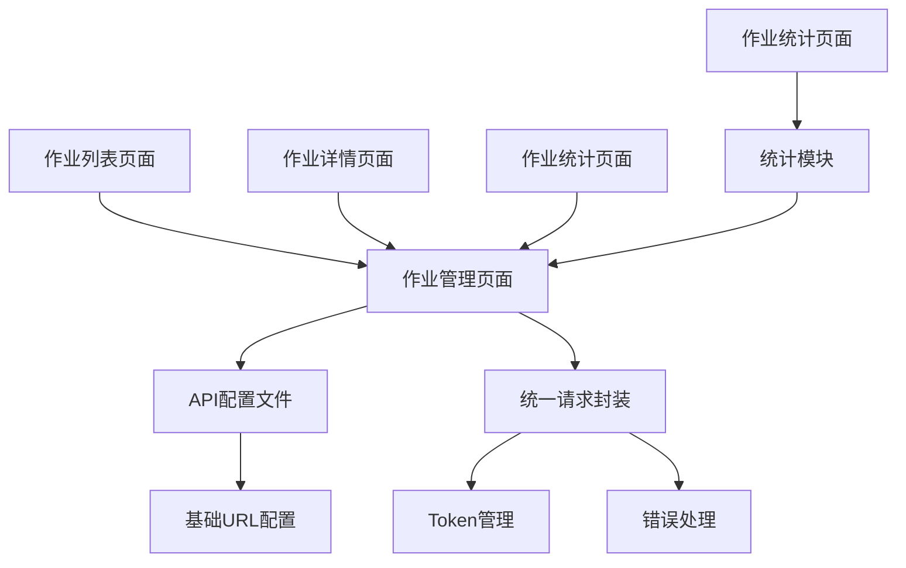

# 作业管理接口

<cite>
**本文档引用的文件**
- [homework-list.vue](file://pages/volunteer/homework/homework-list.vue)
- [detail.vue](file://pages/volunteer/homework/detail.vue)
- [statslist.vue](file://pages/volunteer/homework/statslist.vue)
- [config.js](file://api/config.js)
- [request.js](file://utils/request.js)
- [volunteer-stats.vue](file://components/volunteer/volunteer-stats.vue)
</cite>

## 目录
1. [简介](#简介)
2. [项目结构](#项目结构)
3. [核心组件](#核心组件)
4. [架构概览](#架构概览)
5. [详细组件分析](#详细组件分析)
6. [依赖关系分析](#依赖关系分析)
7. [性能考虑](#性能考虑)
8. [故障排除指南](#故障排除指南)
9. [结论](#结论)

## 简介

作业管理系统是致良知教育平台的重要组成部分，负责管理志愿者的作业提交、评审和统计分析。该系统提供了完整的作业管理流程，包括作业列表查看、作业详情展示、优秀作业标记、作业统计分析等功能。

系统采用前后端分离架构，前端使用Vue.js框架开发，通过API接口与后端服务进行数据交互。作业管理功能主要分布在志愿者管理模块中，为不同角色的用户提供相应的作业管理权限。

## 项目结构

作业管理模块在项目中的组织结构如下：



**图表来源**
- [homework-list.vue:112-184](file://pages/volunteer/homework/homework-list.vue#L112-L184)
- [detail.vue:99-175](file://pages/volunteer/homework/detail.vue#L99-L175)
- [statslist.vue:91-147](file://pages/volunteer/homework/statslist.vue#L91-L147)
- [config.js:16-56](file://api/config.js#L16-L56)

**章节来源**
- [homework-list.vue:1-615](file://pages/volunteer/homework/homework-list.vue#L1-L615)
- [detail.vue:1-505](file://pages/volunteer/homework/detail.vue#L1-L505)
- [statslist.vue:1-384](file://pages/volunteer/homework/statslist.vue#L1-L384)
- [config.js:1-60](file://api/config.js#L1-L60)

## 核心组件

作业管理模块由三个核心页面组成，每个页面负责不同的作业管理功能：

### 1. 作业列表页面 (homework-list.vue)
- **功能**：展示指定日期和范围内的作业列表
- **特性**：支持按日期筛选、优秀作业标记、作业详情跳转
- **权限控制**：基于角色的不同操作权限

### 2. 作业详情页面 (detail.vue)
- **功能**：展示单个作业的详细信息
- **特性**：完整的作业内容展示、优秀作业标记操作
- **权限控制**：严格的权限验证和操作限制

### 3. 作业统计页面 (statslist.vue)
- **功能**：展示作业提交状态的详细名单
- **特性**：按提交状态分类展示（已交、未交、迟交）
- **数据维度**：支持多层级组织结构的数据统计

**章节来源**
- [homework-list.vue:114-207](file://pages/volunteer/homework/homework-list.vue#L114-L207)
- [detail.vue:101-196](file://pages/volunteer/homework/detail.vue#L101-L196)
- [statslist.vue:93-184](file://pages/volunteer/homework/statslist.vue#L93-L184)

## 架构概览

作业管理系统的整体架构采用MVP模式，通过API接口实现前后端分离：



**图表来源**
- [config.js:8-56](file://api/config.js#L8-L56)
- [request.js:7-67](file://utils/request.js#L7-L67)

## 详细组件分析

### 作业列表接口 (/homework/list)

#### 接口定义
- **HTTP方法**：GET
- **URL**：`/homework/list`
- **功能**：获取指定日期和范围内的作业列表

#### 请求参数
| 参数名 | 类型 | 必填 | 描述 | 示例值 |
|--------|------|------|------|--------|
| type | string | 是 | 作业类型 | `small_group` |
| id | string | 是 | 组织ID | `小组ID` |
| status | string | 否 | 作业状态 | `excellent` |
| date | string | 否 | 作业日期 | `YYYY-MM-DD` |

#### 响应数据结构
```javascript
{
  "code": 200,
  "message": "success",
  "data": {
    "list": [
      {
        "homeworkId": "作业ID",
        "name": "提交人姓名",
        "submitTime": "提交时间",
        "organization": "所属组织",
        "isSmallGroupExcellent": 0, // 0或1
        "isBigGroupExcellent": 0    // 0或1
      }
    ]
  }
}
```

#### 权限控制
- **可操作小组优秀**：所有角色均可操作
- **可操作大组优秀**：需先标记为小组优秀

#### 错误处理
- 401未授权：自动跳转登录页
- 网络错误：显示网络异常提示
- 业务错误：显示具体错误信息

**章节来源**
- [homework-list.vue:162-207](file://pages/volunteer/homework/homework-list.vue#L162-L207)
- [config.js:45-45](file://api/config.js#L45-L45)

### 作业详情接口 (/homework/detail)

#### 接口定义
- **HTTP方法**：GET
- **URL**：`/homework/detail`
- **功能**：获取指定作业的详细信息

#### 请求参数
| 参数名 | 类型 | 必填 | 描述 | 示例值 |
|--------|------|------|------|--------|
| homeworkId | number | 是 | 作业ID | `12345` |

#### 响应数据结构
```javascript
{
  "code": 200,
  "message": "success",
  "data": {
    "studentName": "学员姓名",
    "organization": "所属组织",
    "submitTime": "提交时间",
    "content": "作业内容",
    "isSmallGroupExcellent": 0, // 0或1
    "isBigGroupExcellent": 0    // 0或1
  }
}
```

#### 权限控制
- **小组优秀标记**：所有角色均可操作
- **大组优秀标记**：需先标记为小组优秀

#### 错误处理
- 作业ID无效：跳转回上一页
- 未登录：跳转登录页
- 网络错误：显示网络异常提示

**章节来源**
- [detail.vue:172-196](file://pages/volunteer/homework/detail.vue#L172-L196)
- [config.js:48-48](file://api/config.js#L48-L48)

### 作业统计接口 (/homework/stats)

#### 接口定义
- **HTTP方法**：GET
- **URL**：`/homework/stats`
- **功能**：获取作业统计分析数据

#### 请求参数
| 参数名 | 类型 | 必填 | 描述 | 示例值 |
|--------|------|------|------|--------|
| type | string | 是 | 组织类型 | `class/big_group/small_group` |
| id | string | 是 | 组织ID | `组织ID` |
| date | string | 是 | 统计日期 | `YYYY-MM-DD` |

#### 响应数据结构
```javascript
{
  "code": 200,
  "message": "success",
  "data": {
    "total": 100,           // 总人数
    "completed": 85,        // 已完成
    "pending": 10,          // 未提交
    "late": 5,              // 迟交
    "completionRate": 85,   // 完成率
    "onTimeRate": 94        // 按时完成率
  }
}
```

#### 错误处理
- 参数缺失：显示参数不全提示
- 网络错误：显示网络错误提示

**章节来源**
- [volunteer-stats.vue:331-363](file://components/volunteer/volunteer-stats.vue#L331-L363)
- [config.js:50-50](file://api/config.js#L50-L50)

### 作业状态统计接口 (/homework/status/list)

#### 接口定义
- **HTTP方法**：GET
- **URL**：`/homework/status/list`
- **功能**：获取作业提交状态的详细名单

#### 请求参数
| 参数名 | 类型 | 必填 | 描述 | 示例值 |
|--------|------|------|------|--------|
| type | string | 是 | 组织类型 | `class/big_group/small_group` |
| id | string | 是 | 组织ID | `组织ID` |
| date | string | 是 | 统计日期 | `YYYY-MM-DD` |

#### 响应数据结构
```javascript
{
  "code": 200,
  "message": "success",
  "data": {
    "submittedList": [
      {
        "name": "姓名",
        "phone": "手机号"
      }
    ],
    "pendingList": [
      {
        "name": "姓名",
        "phone": "手机号"
      }
    ],
    "lateList": [
      {
        "name": "姓名",
        "phone": "手机号"
      }
    ]
  }
}
```

#### 错误处理
- 参数缺失：显示参数不全提示
- 网络错误：显示网络错误提示

**章节来源**
- [statslist.vue:146-182](file://pages/volunteer/homework/statslist.vue#L146-L182)
- [config.js:51-51](file://api/config.js#L51-L51)

### 优秀作业标记接口 (camp/homework/mark)

#### 接口定义
- **HTTP方法**：POST
- **URL**：`/camp/homework/mark`
- **功能**：标记或取消优秀作业

#### 请求参数
| 参数名 | 类型 | 必填 | 描述 | 示例值 |
|--------|------|------|------|--------|
| homeworkId | number | 是 | 作业ID | `12345` |
| isSmallGroupExcellent | number | 否 | 小组优秀标记 | `0或1` |
| isBigGroupExcellent | number | 否 | 大组优秀标记 | `0或1` |

#### 响应数据结构
```javascript
{
  "code": 200,
  "message": "success",
  "data": {
    "homeworkId": "作业ID",
    "isSmallGroupExcellent": 1,
    "isBigGroupExcellent": 0
  }
}
```

#### 权限控制
- **小组优秀**：所有角色均可操作
- **大组优秀**：需先标记为小组优秀且角色权限允许

#### 错误处理
- 权限不足：显示无权限操作提示
- 参数错误：显示操作失败提示
- 网络错误：显示网络异常提示

**章节来源**
- [homework-list.vue:228-321](file://pages/volunteer/homework/homework-list.vue#L228-L321)
- [detail.vue:198-286](file://pages/volunteer/homework/detail.vue#L198-L286)
- [config.js:46-46](file://api/config.js#L46-L46)

### 优秀作业列表接口 (/homework/excellent/list)

#### 接口定义
- **HTTP方法**：GET
- **URL**：`/homework/excellent/list`
- **功能**：获取优秀作业列表

#### 请求参数
| 参数名 | 类型 | 必填 | 描述 | 示例值 |
|--------|------|------|------|--------|
| type | string | 是 | 组织类型 | `class/big_group/small_group` |
| id | string | 是 | 组织ID | `组织ID` |
| date | string | 是 | 统计日期 | `YYYY-MM-DD` |

#### 响应数据结构
```javascript
{
  "code": 200,
  "message": "success",
  "data": {
    "excellentList": [
      {
        "homeworkId": "作业ID",
        "studentName": "学员姓名",
        "submitTime": "提交时间",
        "content": "作业内容摘要"
      }
    ]
  }
}
```

#### 错误处理
- 参数缺失：显示参数不全提示
- 网络错误：显示网络错误提示

**章节来源**
- [config.js:47-47](file://api/config.js#L47-L47)

## 依赖关系分析

作业管理模块的依赖关系如下：



**图表来源**
- [homework-list.vue:112-112](file://pages/volunteer/homework/homework-list.vue#L112-L112)
- [detail.vue:99-99](file://pages/volunteer/homework/detail.vue#L99-L99)
- [statslist.vue:91-91](file://pages/volunteer/homework/statslist.vue#L91-L91)
- [config.js:8-10](file://api/config.js#L8-L10)
- [request.js:7-17](file://utils/request.js#L7-L17)

### 组件耦合度分析

作业管理模块具有以下特点：
- **低耦合**：各页面相对独立，职责明确
- **高内聚**：每个页面专注于特定的作业管理功能
- **依赖清晰**：通过API配置文件统一管理接口地址

### 外部依赖

- **API配置**：集中管理所有API接口地址
- **请求封装**：统一处理Token注入和错误处理
- **路由导航**：页面间的数据传递和状态管理

**章节来源**
- [config.js:16-56](file://api/config.js#L16-L56)
- [request.js:7-67](file://utils/request.js#L7-L67)

## 性能考虑

### 1. 请求优化
- **缓存策略**：合理利用浏览器缓存减少重复请求
- **批量操作**：支持批量标记优秀作业提高效率
- **分页加载**：大数据量时采用分页加载避免内存溢出

### 2. 数据处理
- **懒加载**：按需加载统计数据，提升页面响应速度
- **虚拟滚动**：大量数据时使用虚拟滚动技术
- **数据压缩**：传输过程中进行必要的数据压缩

### 3. 用户体验
- **加载状态**：提供清晰的加载指示器
- **错误恢复**：网络异常时提供重试机制
- **离线支持**：部分数据支持离线查看

## 故障排除指南

### 常见问题及解决方案

#### 1. 登录状态异常
**问题**：401未授权错误
**原因**：Token过期或无效
**解决**：
- 自动清除过期Token
- 跳转到登录页面重新登录
- 重新发起被中断的操作

#### 2. 网络连接失败
**问题**：网络错误提示
**原因**：网络不稳定或服务器不可达
**解决**：
- 检查网络连接状态
- 重试请求操作
- 显示友好的错误提示

#### 3. 权限不足
**问题**：无法执行某些操作
**原因**：角色权限限制
**解决**：
- 检查当前用户角色
- 联系管理员获取相应权限
- 使用具备权限的账号登录

#### 4. 数据加载缓慢
**问题**：页面加载时间过长
**原因**：数据量过大或网络延迟
**解决**：
- 实施分页加载
- 优化数据查询条件
- 使用缓存机制

**章节来源**
- [request.js:29-64](file://utils/request.js#L29-L64)
- [homework-list.vue:164-206](file://pages/volunteer/homework/homework-list.vue#L164-L206)
- [detail.vue:124-134](file://pages/volunteer/homework/detail.vue#L124-L134)

## 结论

作业管理模块通过清晰的接口设计和完善的权限控制，为致良知教育平台提供了完整的作业管理解决方案。系统具有以下优势：

### 技术优势
- **接口标准化**：统一的API设计规范，便于维护和扩展
- **权限控制完善**：基于角色的细粒度权限管理
- **错误处理健全**：全面的错误处理和用户提示机制

### 功能完整性
- **作业管理全流程**：从作业提交到统计分析的完整覆盖
- **多层级组织支持**：支持班级、大组、小组等多层级管理
- **数据可视化**：直观的统计图表和状态展示

### 最佳实践建议

1. **接口调用规范**
   - 统一使用API配置文件管理接口地址
   - 在请求中正确设置Authorization头
   - 合理处理响应状态码

2. **权限管理**
   - 严格验证用户角色和权限
   - 提供清晰的权限提示
   - 支持权限变更后的状态更新

3. **用户体验**
   - 提供加载状态反馈
   - 实现错误恢复机制
   - 优化移动端交互体验

该作业管理模块为志愿者作业管理提供了可靠的技术支撑，通过合理的架构设计和完善的错误处理机制，确保了系统的稳定性和可用性。