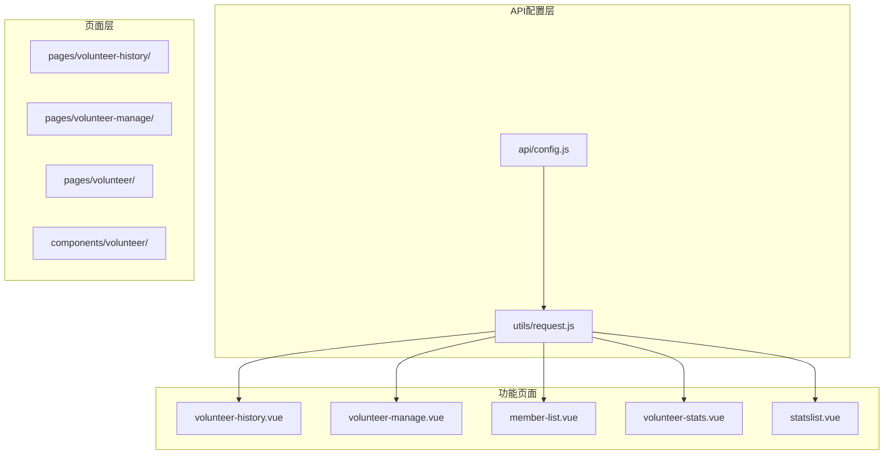
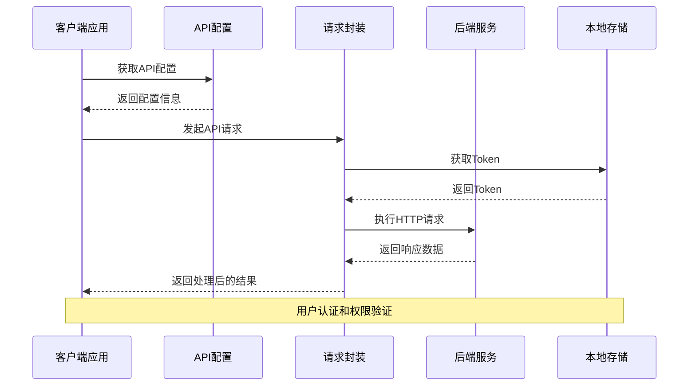
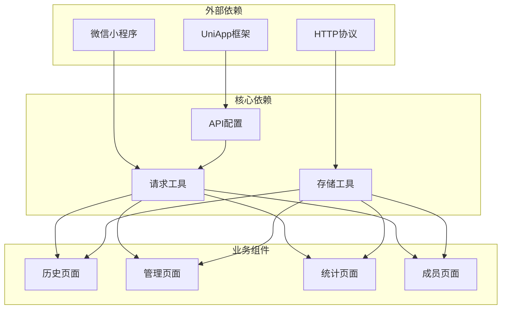

# 志愿者服务接口

<cite>
**本文档引用的文件**
- [api/config.js](file://api/config.js)
- [utils/request.js](file://utils/request.js)
- [pages/volunteer-history/volunteer-history.vue](file://pages/volunteer-history/volunteer-history.vue)
- [pages/volunteer-manage/volunteer-manage.vue](file://pages/volunteer-manage/volunteer-manage.vue)
- [pages/volunteer-manage/member-list.vue](file://pages/volunteer-manage/member-list.vue)
- [components/volunteer/volunteer-stats.vue](file://components/volunteer/volunteer-stats.vue)
- [pages/volunteer/homework/statslist.vue](file://pages/volunteer/homework/statslist.vue)
</cite>

## 目录
1. [简介](#简介)
2. [项目结构](#项目结构)
3. [核心组件](#核心组件)
4. [架构概览](#架构概览)
5. [详细组件分析](#详细组件分析)
6. [依赖关系分析](#依赖关系分析)
7. [性能考虑](#性能考虑)
8. [故障排除指南](#故障排除指南)
9. [结论](#结论)

## 简介

志愿者服务模块是日常中国传统文化项目中的重要组成部分，为用户提供完整的志愿者管理功能。该模块包含志愿者历史记录查询、退出志愿者服务、统计分析、管理范围设置以及岗位分配等核心功能。系统采用前后端分离架构，通过统一的API配置管理和请求封装机制实现各功能模块的协调工作。

## 项目结构

志愿者服务模块主要分布在以下目录结构中：



**图表来源**
- [api/config.js:1-60](file://api/config.js#L1-L60)
- [utils/request.js:1-98](file://utils/request.js#L1-L98)

**章节来源**
- [api/config.js:1-60](file://api/config.js#L1-L60)
- [utils/request.js:1-98](file://utils/request.js#L1-L98)

## 核心组件

志愿者服务模块由多个核心组件构成，每个组件负责特定的功能领域：

### API配置组件
- **API_CONFIG**: 集中管理所有API端点配置
- **统一请求封装**: 提供自动Token注入和错误处理机制

### 页面组件
- **志愿者历史页面**: 展示用户的志愿者服务历史记录
- **志愿者管理页面**: 提供志愿者管理功能的主界面
- **成员列表页面**: 显示特定范围内的志愿者成员信息
- **志愿者统计页面**: 提供层次化的统计分析功能
- **作业统计详情页面**: 展示详细的作业完成情况统计

**章节来源**
- [api/config.js:15-56](file://api/config.js#L15-L56)
- [utils/request.js:7-67](file://utils/request.js#L7-L67)

## 架构概览

系统采用分层架构设计，确保各组件间的松耦合和高内聚：



**图表来源**
- [api/config.js:8-56](file://api/config.js#L8-L56)
- [utils/request.js:7-67](file://utils/request.js#L7-L67)

## 详细组件分析

### 志愿者历史接口

#### 接口规范
- **URL**: `/user/volunteer-history`
- **方法**: GET
- **认证**: 需要Bearer Token
- **功能**: 获取用户的志愿者服务历史记录

#### 参数说明
- **请求头**:
  - Authorization: Bearer {token}
  - Content-Type: application/json

#### 响应格式
```json
{
  "code": 200,
  "message": "获取成功",
  "data": {
    "volunteerHistory": [
      {
        "assignmentId": "string",
        "responsible": "string",
        "duty": "string",
        "serviceTime": "string",
        "status": "string"
      }
    ]
  }
}
```

#### 错误处理
- **401 未授权**: 自动清除Token并跳转登录页
- **403 禁止访问**: 权限不足
- **500 服务器错误**: 服务器内部错误

**章节来源**
- [pages/volunteer-history/volunteer-history.vue:86-125](file://pages/volunteer-history/volunteer-history.vue#L86-L125)
- [api/config.js:33](file://api/config.js#L33)

### 退出志愿者接口

#### 接口规范
- **URL**: `/user/volunteer-quit`
- **方法**: POST
- **认证**: 需要Bearer Token
- **功能**: 用户退出志愿者服务

#### 请求参数
```json
{
  "assignmentId": "string"
}
```

#### 响应格式
```json
{
  "code": 200,
  "message": "退出成功",
  "data": {}
}
```

**章节来源**
- [api/config.js:34](file://api/config.js#L34)

### 志愿者统计接口

#### 接口规范
- **URL**: `/user/volunteer-stats`
- **方法**: GET
- **认证**: 需要Bearer Token
- **功能**: 获取志愿者统计数据

#### 查询参数
- **date**: 日期 (YYYY-MM-DD)
- **assignmentId**: 分配ID

#### 响应格式
```json
{
  "code": 200,
  "message": "获取成功",
  "data": {
    "totalVolunteers": 0,
    "completedTasks": 0,
    "pendingTasks": 0,
    "lateTasks": 0,
    "completionRate": 0
  }
}
```

**章节来源**
- [api/config.js:35](file://api/config.js#L35)

### 志愿者管理范围接口

#### 接口规范
- **URL**: `/volunteer/scopes`
- **方法**: GET
- **认证**: 需要Bearer Token
- **功能**: 获取用户可管理的志愿者范围

#### 响应格式
```json
{
  "code": 200,
  "message": "获取成功",
  "data": [
    {
      "assignmentId": "string",
      "dutyType": "string",
      "targetType": "string",
      "campName": "string",
      "className": "string",
      "bigGroupName": "string",
      "smallGroupName": "string"
    }
  ]
}
```

**章节来源**
- [api/config.js:36](file://api/config.js#L36)

### 志愿者成员管理接口

#### 接口规范
- **URL**: `/volunteer/manage/members`
- **方法**: GET
- **认证**: 需要Bearer Token
- **功能**: 获取管理范围内的志愿者成员列表

#### 查询参数
- **assignmentId**: 分配ID (必需)
- **smallGroupId**: 小组ID (可选)

#### 响应格式
```json
{
  "code": 200,
  "message": "获取成功",
  "data": {
    "smallGroupList": [
      {
        "smallGroupId": "string",
        "smallGroupName": "string",
        "members": [
          {
            "userId": "string",
            "account": "string",
            "nickname": "string",
            "status": "string"
          }
        ]
      }
    ]
  }
}
```

**章节来源**
- [api/config.js:37](file://api/config.js#L37)

### 岗位分配接口

#### 接口规范
- **URL**: `/volunteer/manage/duty-assignment`
- **方法**: GET
- **认证**: 需要Bearer Token
- **功能**: 获取可分配的岗位列表

#### 查询参数
- **assignmentId**: 分配ID (必需)

#### 响应格式
```json
{
  "code": 200,
  "message": "获取成功",
  "data": {
    "assignableDuties": [
      {
        "targetType": "string",
        "targetId": "string",
        "dutyType": "string",
        "dutyName": "string",
        "isVacant": true,
        "currentUsername": "string"
      }
    ]
  }
}
```

**章节来源**
- [api/config.js:38](file://api/config.js#L38)

### 分配岗位接口

#### 接口规范
- **URL**: `/volunteer/manage/assign-duty`
- **方法**: POST
- **认证**: 需要Bearer Token
- **功能**: 为用户分配志愿者岗位

#### 请求体
```json
{
  "assignmentId": "string",
  "targetUserId": "string",
  "targetType": "string",
  "targetId": "string",
  "dutyType": "string"
}
```

#### 响应格式
```json
{
  "code": 200,
  "message": "分配成功",
  "data": {}
}
```

**章节来源**
- [api/config.js:40](file://api/config.js#L40)

### 移除岗位接口

#### 接口规范
- **URL**: `/volunteer/manage/remove-duty`
- **方法**: POST
- **认证**: 需要Bearer Token
- **功能**: 移除用户的志愿者岗位

#### 请求体
```json
{
  "assignmentId": "string"
}
```

#### 响应格式
```json
{
  "code": 200,
  "message": "移除成功",
  "data": {}
}
```

**章节来源**
- [api/config.js:41](file://api/config.js#L41)

### 志愿者统计查询接口

#### 接口规范
- **URL**: `/homework/statistics/hierarchy`
- **方法**: GET
- **认证**: 需要Bearer Token
- **功能**: 获取层次化的作业统计信息

#### 查询参数
- **type**: 组织类型 (class/big_group/small_group)
- **id**: 组织ID
- **date**: 日期 (YYYY-MM-DD)

#### 响应格式
```json
{
  "code": 200,
  "message": "获取成功",
  "data": {
    "list": [
      {
        "id": "string",
        "name": "string",
        "type": "string",
        "hasHomework": true,
        "totalCount": 0,
        "completedCount": 0,
        "pendingCount": 0,
        "lateCount": 0,
        "completionRate": 0,
        "children": []
      }
    ]
  }
}
```

**章节来源**
- [components/volunteer/volunteer-stats.vue:325-364](file://components/volunteer/volunteer-stats.vue#L325-L364)

## 依赖关系分析

志愿者服务模块的依赖关系呈现清晰的分层结构：



**图表来源**
- [api/config.js:8-56](file://api/config.js#L8-L56)
- [utils/request.js:7-67](file://utils/request.js#L7-L67)

### 关键依赖特性

1. **API配置集中化**: 所有API端点统一在配置文件中管理
2. **请求封装统一化**: 自动处理Token注入和错误处理
3. **页面间通信**: 使用事件总线实现页面间数据传递
4. **权限控制**: 基于Token的认证机制

**章节来源**
- [pages/volunteer-manage/volunteer-manage.vue:86-95](file://pages/volunteer-manage/volunteer-manage.vue#L86-L95)
- [pages/volunteer/index.vue:85-104](file://pages/volunteer/index.vue#L85-L104)

## 性能考虑

### 缓存策略
- **Token缓存**: 使用本地存储缓存用户Token
- **数据缓存**: 页面切换时保持数据状态
- **请求去重**: 防抖处理用户输入搜索

### 网络优化
- **统一错误处理**: 集中处理HTTP错误和网络异常
- **超时控制**: 合理的请求超时设置
- **重试机制**: 关键操作的自动重试

### 用户体验优化
- **加载状态**: 显示加载指示器提升用户体验
- **空状态处理**: 友好的空数据提示
- **错误反馈**: 清晰的错误信息展示

## 故障排除指南

### 常见问题及解决方案

#### 认证相关问题
- **问题**: 401未授权错误
- **原因**: Token过期或无效
- **解决**: 自动跳转登录页并清除Token

#### 网络连接问题
- **问题**: 网络异常或请求超时
- **原因**: 网络不稳定或服务器不可达
- **解决**: 显示网络错误提示并建议重试

#### 数据格式问题
- **问题**: API响应格式不符合预期
- **原因**: 后端数据结构变更
- **解决**: 添加数据验证和兼容性处理

#### 权限控制问题
- **问题**: 无权访问某些功能
- **原因**: 用户角色权限不足
- **解决**: 根据用户角色动态显示功能

**章节来源**
- [utils/request.js:29-54](file://utils/request.js#L29-L54)
- [pages/volunteer-history/volunteer-history.vue:82-84](file://pages/volunteer-history/volunteer-history.vue#L82-L84)

## 结论

志愿者服务模块通过清晰的分层架构和统一的API管理机制，为用户提供了完整的志愿者管理功能。系统具备良好的扩展性和维护性，能够满足不同规模的志愿者组织需求。

### 主要优势
1. **模块化设计**: 功能模块独立，便于维护和扩展
2. **统一配置**: API配置集中管理，便于维护
3. **完善的错误处理**: 全面的错误处理和用户反馈机制
4. **权限控制**: 基于Token的认证和权限控制

### 改进建议
1. **增加单元测试**: 为关键功能添加自动化测试
2. **性能监控**: 添加API调用性能监控
3. **日志记录**: 增强错误日志和操作日志记录
4. **国际化支持**: 考虑多语言支持需求

该模块为志愿者服务提供了坚实的技术基础，能够有效支撑各类志愿者活动的组织和管理工作。