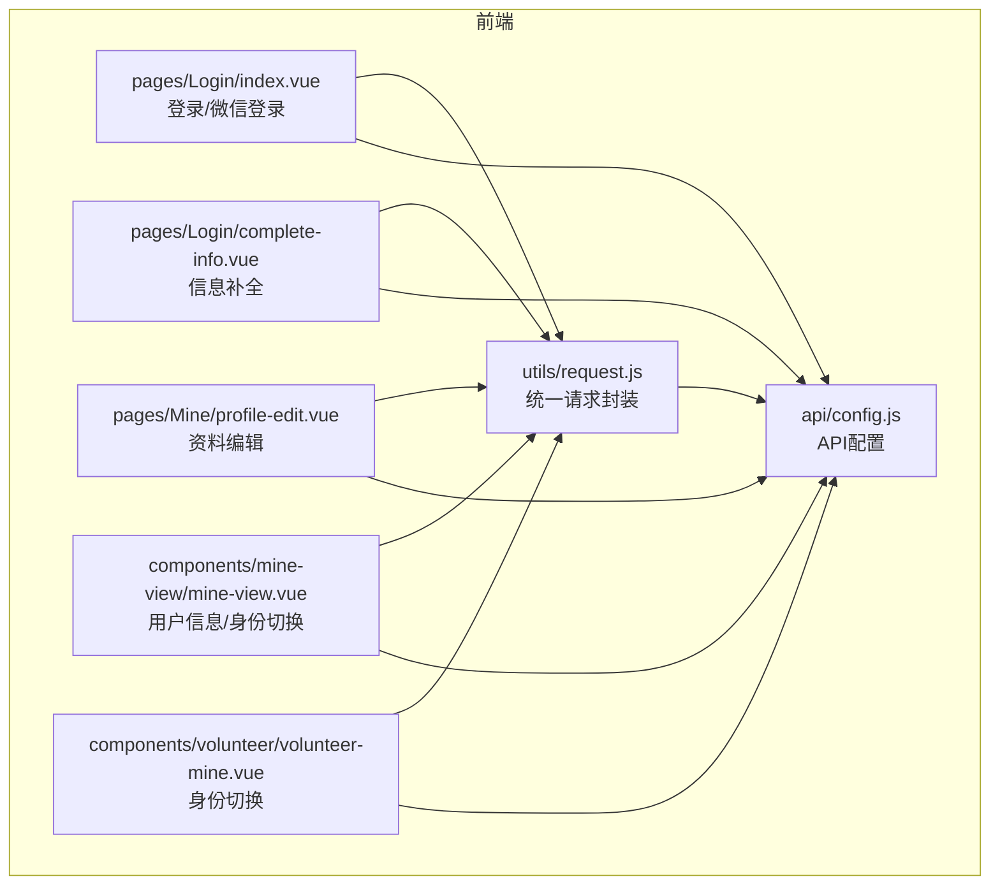
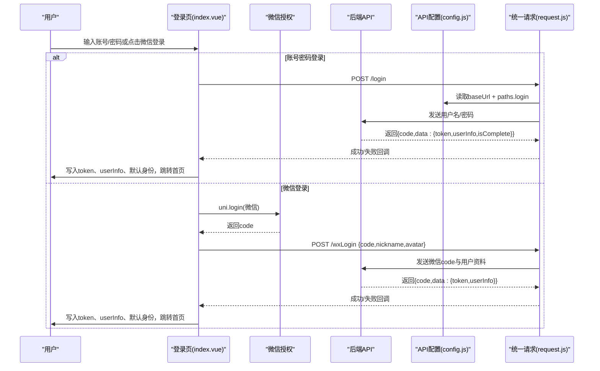
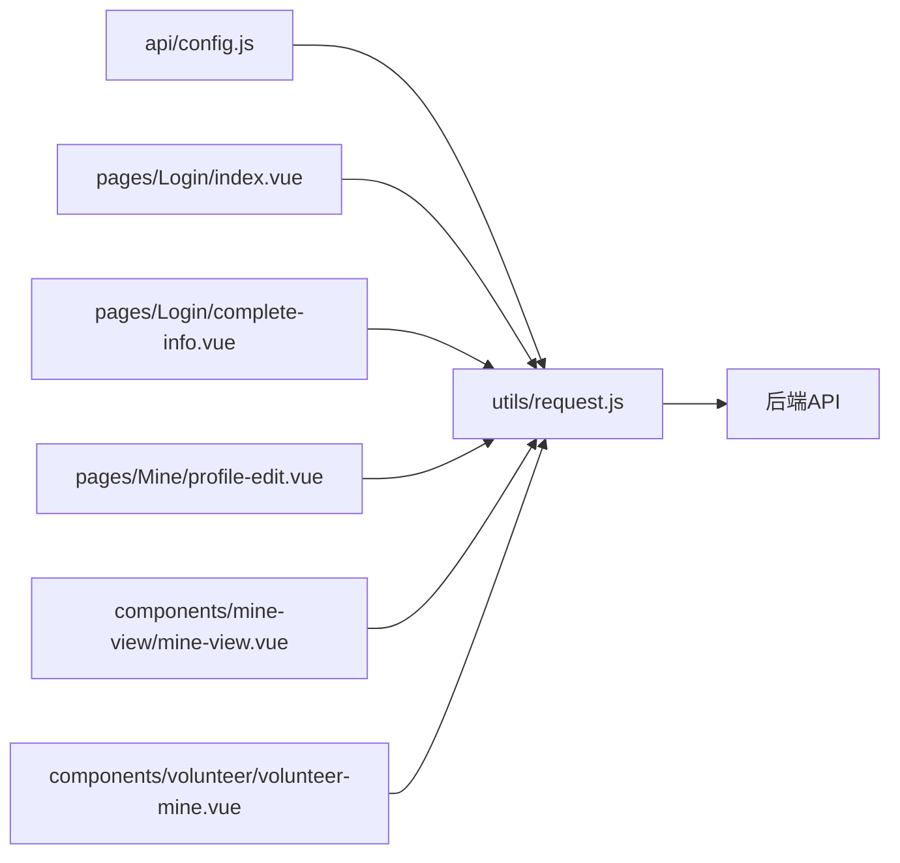

# 用户认证接口

<cite>
**本文档引用的文件**
- [api/config.js](file://api/config.js)
- [utils/request.js](file://utils/request.js)
- [pages/Login/index.vue](file://pages/Login/index.vue)
- [pages/Login/complete-info.vue](file://pages/Login/complete-info.vue)
- [components/mine-view/mine-view.vue](file://components/mine-view/mine-view.vue)
- [components/volunteer/volunteer-mine.vue](file://components/volunteer/volunteer-mine.vue)
- [pages/Mine/profile-edit.vue](file://pages/Mine/profile-edit.vue)
</cite>

## 目录
1. [简介](#简介)
2. [项目结构](#项目结构)
3. [核心组件](#核心组件)
4. [架构总览](#架构总览)
5. [详细组件分析](#详细组件分析)
6. [依赖关系分析](#依赖关系分析)
7. [性能考量](#性能考量)
8. [故障排除指南](#故障排除指南)
9. [结论](#结论)

## 简介
本文件面向前端开发者与测试人员，系统化梳理用户认证模块的接口规范与使用方式，覆盖以下核心接口：
- 用户登录接口：/login
- 微信授权登录接口：/wxLogin
- 用户信息获取接口：/user/info
- 身份切换接口：/user/switch-identity
- 用户登出接口：/user/logout

文档将给出每个接口的请求方法、URL模式、请求参数、响应格式、状态码说明、错误处理机制，并结合现有前端实现说明 Token 认证流程、请求头设置、常见认证场景示例及安全与最佳实践建议。

## 项目结构
认证相关的关键文件分布如下：
- API 配置：api/config.js
- 统一请求封装：utils/request.js
- 登录页与微信登录：pages/Login/index.vue
- 信息补全页：pages/Login/complete-info.vue
- 个人信息编辑页：pages/Mine/profile-edit.vue
- 个人中心与身份切换：components/mine-view/mine-view.vue、components/volunteer/volunteer-mine.vue

图表来源
- [api/config.js:1-36](file://api/config.js#L1-L36)
- [utils/request.js:1-98](file://utils/request.js#L1-L98)
- [pages/Login/index.vue:138-454](file://pages/Login/index.vue#L138-L454)
- [pages/Login/complete-info.vue:138-376](file://pages/Login/complete-info.vue#L138-L376)
- [pages/Mine/profile-edit.vue:117-314](file://pages/Mine/profile-edit.vue#L117-L314)
- [components/mine-view/mine-view.vue:225-293](file://components/mine-view/mine-view.vue#L225-L293)
- [components/volunteer/volunteer-mine.vue:525-557](file://components/volunteer/volunteer-mine.vue#L525-L557)

章节来源
- [api/config.js:1-36](file://api/config.js#L1-L36)
- [utils/request.js:1-98](file://utils/request.js#L1-L98)

## 核心组件
- API 配置模块：集中定义基础地址与各接口路径，便于统一维护与替换。
- 统一请求封装：自动注入 Authorization 头、处理 401 未授权、统一封装 GET/POST 快捷方法。
- 登录页：提供账号密码登录与微信一键登录两种入口；登录成功后写入 token、用户信息与默认身份。
- 信息补全页：在登录后若用户信息不完整，引导跳转至该页进行补齐。
- 个人中心与身份切换：提供用户信息拉取、身份切换、登出等能力。
- 资料编辑页：基于 Token 进行头像上传与信息更新。

章节来源
- [api/config.js:16-36](file://api/config.js#L16-L36)
- [utils/request.js:7-67](file://utils/request.js#L7-L67)
- [pages/Login/index.vue:177-301](file://pages/Login/index.vue#L177-L301)
- [pages/Login/complete-info.vue:296-347](file://pages/Login/complete-info.vue#L296-L347)
- [components/mine-view/mine-view.vue:225-293](file://components/mine-view/mine-view.vue#L225-L293)
- [pages/Mine/profile-edit.vue:198-311](file://pages/Mine/profile-edit.vue#L198-L311)

## 架构总览
下图展示了认证流程与关键交互点：

图表来源
- [pages/Login/index.vue:196-282](file://pages/Login/index.vue#L196-L282)
- [pages/Login/index.vue:357-430](file://pages/Login/index.vue#L357-L430)
- [api/config.js:16-36](file://api/config.js#L16-L36)
- [utils/request.js:24-67](file://utils/request.js#L24-L67)

## 详细组件分析

### 用户登录接口 /login
- HTTP 方法：POST
- URL 模式：baseUrl + "/login"
- 请求头：
  - Content-Type: application/json
- 请求体参数：
  - username: 字符串，必填，支持手机号/账号
  - password: 字符串，必填
- 响应格式（成功）：
  - code: 数字，200 表示成功
  - msg: 字符串，描述信息
  - data: 对象
    - token: 字符串，访问令牌
    - userInfo: 对象，用户基础信息
    - isComplete: 布尔值，是否需要补全信息
- 响应格式（失败）：
  - code 非 200 或 HTTP 状态码 ≥ 400
  - msg: 字符串，错误原因
- 状态码说明：
  - 200：登录成功
  - 400/401：参数错误/未授权（由后端决定），前端统一处理 401 清理 token 并跳转登录
  - 其他 4xx/5xx：网络或业务异常
- 错误处理机制：
  - 前端对 401 统一提示“登录已过期，请重新登录”，清理本地 token 并跳转登录页
  - 其他错误统一提示网络异常
- 请求示例（路径参考）：
  - [pages/Login/index.vue:196-282](file://pages/Login/index.vue#L196-L282)
- 响应示例（路径参考）：
  - [pages/Login/index.vue:205-268](file://pages/Login/index.vue#L205-L268)

章节来源
- [pages/Login/index.vue:196-282](file://pages/Login/index.vue#L196-L282)
- [pages/Login/index.vue:205-268](file://pages/Login/index.vue#L205-L268)
- [utils/request.js:29-54](file://utils/request.js#L29-L54)
- [api/config.js:18](file://api/config.js#L18)

### 微信授权登录接口 /wxLogin
- HTTP 方法：POST
- URL 模式：baseUrl + "/wxLogin"
- 请求头：
  - Content-Type: application/json
- 请求体参数：
  - code: 字符串，必填，来自 uni.login 的返回
  - nickname: 字符串，必填，用户昵称
  - avatar: 字符串，必填，用户头像URL
- 响应格式（成功）：
  - code: 200
  - msg: 字符串
  - data: 对象
    - token: 字符串
    - userInfo: 对象，用户基础信息
- 响应格式（失败）：
  - code 非 200 或 HTTP 状态码 ≥ 400
  - msg: 字符串
- 状态码说明：
  - 200：登录成功
  - 400/401：未授权/参数错误
  - 其他 4xx/5xx：网络或业务异常
- 错误处理机制：
  - 前端对 401 统一提示并清理 token
  - 其他错误统一提示网络异常
- 请求示例（路径参考）：
  - [pages/Login/index.vue:357-430](file://pages/Login/index.vue#L357-L430)
- 响应示例（路径参考）：
  - [pages/Login/index.vue:369-424](file://pages/Login/index.vue#L369-L424)

章节来源
- [pages/Login/index.vue:311-336](file://pages/Login/index.vue#L311-L336)
- [pages/Login/index.vue:357-430](file://pages/Login/index.vue#L357-L430)
- [pages/Login/index.vue:369-424](file://pages/Login/index.vue#L369-L424)
- [api/config.js:19](file://api/config.js#L19)

### 用户信息获取接口 /user/info
- HTTP 方法：GET
- URL 模式：baseUrl + "/user/info"
- 请求头：
  - Authorization: Bearer <token>
  - Content-Type: application/json
- 请求参数：无
- 响应格式（成功）：
  - code: 200
  - msg: 字符串
  - data: 对象
    - userId: 字符串/数字
    - openid: 字符串
    - account: 字符串
    - nickname: 字符串
    - avatar: 字符串
    - statsList: 可选数组
- 响应格式（失败）：
  - code 非 200 或 HTTP 状态码 ≥ 400
  - msg: 字符串
- 状态码说明：
  - 200：成功
  - 401：未授权（前端统一处理）
  - 其他 4xx/5xx：异常
- 错误处理机制：
  - 前端对 401 统一提示并清理 token
- 请求示例（路径参考）：
  - [components/mine-view/mine-view.vue:225-255](file://components/mine-view/mine-view.vue#L225-L255)
- 响应示例（路径参考）：
  - [components/mine-view/mine-view.vue:236-249](file://components/mine-view/mine-view.vue#L236-L249)

章节来源
- [components/mine-view/mine-view.vue:225-255](file://components/mine-view/mine-view.vue#L225-L255)
- [components/mine-view/mine-view.vue:236-249](file://components/mine-view/mine-view.vue#L236-L249)
- [api/config.js:20](file://api/config.js#L20)

### 身份切换接口 /user/switch-identity
- HTTP 方法：POST
- URL 模式：baseUrl + "/app/user/switch-identity"
- 请求头：
  - Authorization: Bearer <token>
  - Content-Type: application/json
- 请求体参数：
  - identity: 字符串，目标身份名称（如“学员端”、“志愿者端”）
- 响应格式（成功）：
  - code: 200
  - msg: 字符串
  - data: 对象（通常为空或包含切换结果）
- 响应格式（失败）：
  - code 非 200 或 HTTP 状态码 ≥ 400
  - msg: 字符串
- 状态码说明：
  - 200：成功
  - 401：未授权（前端统一处理）
  - 其他 4xx/5xx：异常
- 错误处理机制：
  - 前端对 401 统一提示并清理 token
- 请求示例（路径参考）：
  - [components/mine-view/mine-view.vue:270-293](file://components/mine-view/mine-view.vue#L270-L293)
  - [components/volunteer/volunteer-mine.vue:525-557](file://components/volunteer/volunteer-mine.vue#L525-L557)
- 响应示例（路径参考）：
  - [components/mine-view/mine-view.vue:292-293](file://components/mine-view/mine-view.vue#L292-L293)

章节来源
- [components/mine-view/mine-view.vue:270-293](file://components/mine-view/mine-view.vue#L270-L293)
- [components/mine-view/mine-view.vue:281-290](file://components/mine-view/mine-view.vue#L281-L290)
- [components/volunteer/volunteer-mine.vue:525-557](file://components/volunteer/volunteer-mine.vue#L525-L557)
- [components/volunteer/volunteer-mine.vue:538-548](file://components/volunteer/volunteer-mine.vue#L538-L548)

### 用户登出接口 /user/logout
- HTTP 方法：POST
- URL 模式：baseUrl + "/user/logout"
- 请求头：
  - Authorization: Bearer <token>
  - Content-Type: application/json
- 请求参数：无
- 响应格式（成功）：
  - code: 200
  - msg: 字符串
  - data: 对象（通常为空）
- 响应格式（失败）：
  - code 非 200 或 HTTP 状态码 ≥ 400
  - msg: 字符串
- 状态码说明：
  - 200：成功
  - 401：未授权（前端统一处理）
  - 其他 4xx/5xx：异常
- 错误处理机制：
  - 前端对 401 统一提示并清理 token
- 请求示例（路径参考）：
  - [components/mine-view/mine-view.vue:345-374](file://components/mine-view/mine-view.vue#L345-L374)
- 响应示例（路径参考）：
  - [components/mine-view/mine-view.vue:354-358](file://components/mine-view/mine-view.vue#L354-L358)

章节来源
- [components/mine-view/mine-view.vue:345-374](file://components/mine-view/mine-view.vue#L345-L374)
- [components/mine-view/mine-view.vue:354-358](file://components/mine-view/mine-view.vue#L354-L358)
- [api/config.js:32](file://api/config.js#L32)

## 依赖关系分析
- API 配置集中管理基础地址与路径，避免硬编码分散。
- 统一请求封装负责：
  - 自动从本地存储读取 token 并注入 Authorization 头
  - 统一处理 401 未授权（提示并清理 token、跳转登录）
  - 统一处理其他 4xx/5xx 错误
- 登录页与资料页通过 API 配置与统一请求封装发起认证相关请求。
- 个人中心与志愿者中心通过 Token 进行身份切换与登出操作。

图表来源
- [api/config.js:16-36](file://api/config.js#L16-L36)
- [utils/request.js:7-67](file://utils/request.js#L7-L67)
- [pages/Login/index.vue:196-282](file://pages/Login/index.vue#L196-L282)
- [pages/Login/complete-info.vue:312-347](file://pages/Login/complete-info.vue#L312-L347)
- [pages/Mine/profile-edit.vue:198-311](file://pages/Mine/profile-edit.vue#L198-L311)
- [components/mine-view/mine-view.vue:225-293](file://components/mine-view/mine-view.vue#L225-L293)
- [components/volunteer/volunteer-mine.vue:525-557](file://components/volunteer/volunteer-mine.vue#L525-L557)

章节来源
- [api/config.js:16-36](file://api/config.js#L16-L36)
- [utils/request.js:7-67](file://utils/request.js#L7-L67)

## 性能考量
- 统一请求封装减少重复代码，提升可维护性与一致性。
- 建议在高频调用的接口上增加本地缓存策略（如用户信息缓存），避免重复请求。
- 登录与身份切换涉及页面跳转，注意控制 loading 与提示时机，避免频繁弹窗影响体验。
- 大文件上传（头像）建议采用分片或进度反馈，提升用户体验。

## 故障排除指南
- 401 未授权：
  - 现象：出现“登录已过期，请重新登录”提示，自动清理 token 并跳转登录页
  - 处理：检查后端 token 过期策略与刷新机制；前端已内置清理与跳转逻辑
  - 参考路径：
    - [utils/request.js:29-44](file://utils/request.js#L29-L44)
- 网络异常：
  - 现象：提示“网络连接异常”
  - 处理：检查网络状态、后端服务可用性与跨域配置
  - 参考路径：
    - [utils/request.js:47-64](file://utils/request.js#L47-L64)
- 登录失败：
  - 现象：登录接口返回非 200 或 msg 提示
  - 处理：核对账号/密码格式与后端校验规则
  - 参考路径：
    - [pages/Login/index.vue:261-268](file://pages/Login/index.vue#L261-L268)
- 微信登录失败：
  - 现象：微信授权失败或返回数据异常
  - 处理：检查微信授权配置、code 是否过期、后端是否正确处理
  - 参考路径：
    - [pages/Login/index.vue:317-336](file://pages/Login/index.vue#L317-L336)
    - [pages/Login/index.vue:417-424](file://pages/Login/index.vue#L417-L424)

章节来源
- [utils/request.js:29-64](file://utils/request.js#L29-L64)
- [pages/Login/index.vue:261-268](file://pages/Login/index.vue#L261-L268)
- [pages/Login/index.vue:317-336](file://pages/Login/index.vue#L317-L336)
- [pages/Login/index.vue:417-424](file://pages/Login/index.vue#L417-L424)

## 结论
本认证模块通过集中配置与统一请求封装，实现了登录、微信登录、信息获取、身份切换与登出的标准化流程。前端已内置 401 自动清理与跳转、网络异常提示等机制，建议在后端完善 token 刷新策略与接口幂等设计，以进一步提升安全性与稳定性。