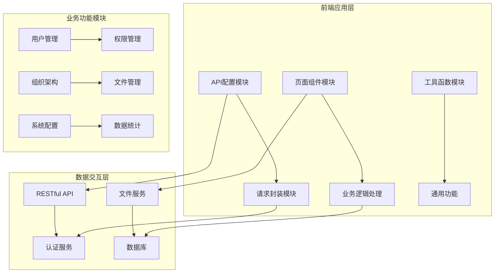
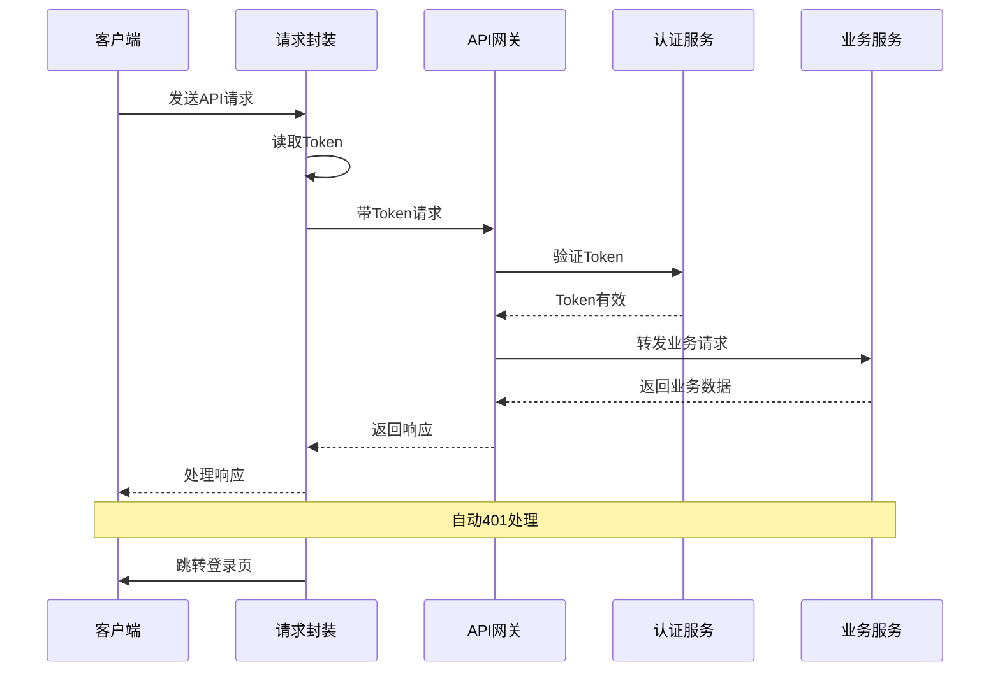
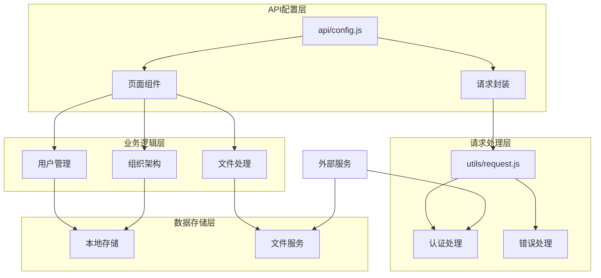

# 系统管理接口

<cite>
**本文档引用的文件**
- [api/config.js](file://api/config.js)
- [utils/request.js](file://utils/request.js)
- [pages/Mine/profile-edit.vue](file://pages/Mine/profile-edit.vue)
- [pages/Login/complete-info.vue](file://pages/Login/complete-info.vue)
- [pages/Login/index.vue](file://pages/Login/index.vue)
- [pages/volunteer-manage/volunteer-manage.vue](file://pages/volunteer-manage/volunteer-manage.vue)
- [pages/volunteer-manage/member-list.vue](file://pages/volunteer-manage/member-list.vue)
- [components/volunteer/volunteer-mine.vue](file://components/volunteer/volunteer-mine.vue)
- [pages/Mine/apply-admin/index.vue](file://pages/Mine/apply-admin/index.vue)
- [pages/Mine/apply-admin/list.vue](file://pages/Mine/apply-admin/list.vue)
</cite>

## 目录
1. [简介](#简介)
2. [项目结构](#项目结构)
3. [核心组件](#核心组件)
4. [架构概览](#架构概览)
5. [详细组件分析](#详细组件分析)
6. [依赖关系分析](#依赖关系分析)
7. [性能考虑](#性能考虑)
8. [故障排除指南](#故障排除指南)
9. [结论](#结论)

## 简介

本文档为系统管理模块提供完整的API接口文档，涵盖用户搜索、用户更新、文件上传、班级列表、大组列表、小组列表和用户信息更新等核心接口。该系统基于UniApp框架构建，采用前后端分离架构，通过统一的请求封装层处理HTTP通信和认证机制。

系统管理模块主要服务于志愿者管理系统，提供用户权限管理、组织架构管理、文件处理和配置管理等功能。所有接口均采用Bearer Token认证方式，确保系统的安全性和可靠性。

## 项目结构

系统采用模块化架构设计，主要分为以下几个核心模块：



**图表来源**
- [api/config.js:1-60](file://api/config.js#L1-L60)
- [utils/request.js:1-98](file://utils/request.js#L1-L98)

**章节来源**
- [api/config.js:1-60](file://api/config.js#L1-L60)
- [utils/request.js:1-98](file://utils/request.js#L1-L98)

## 核心组件

### API配置管理

系统通过集中化的API配置文件管理所有接口地址和基础配置：

| 配置项 | 类型 | 描述 | 默认值 |
|--------|------|------|--------|
| baseUrl | String | API基础URL地址 | 'http://127.0.0.1:8080' |
| paths | Object | 接口路径映射表 | 包含所有业务接口路径 |
| isDev | Boolean | 开发环境标识 | 根据NODE_ENV自动判断 |

### 请求封装模块

统一的请求处理机制提供了以下核心功能：

- **自动认证**：自动从本地存储获取并注入Bearer Token
- **错误处理**：统一处理HTTP状态码和业务状态码
- **重定向机制**：401状态码自动跳转到登录页
- **Promise封装**：提供异步请求的Promise接口

**章节来源**
- [utils/request.js:7-67](file://utils/request.js#L7-L67)

## 架构概览

系统采用分层架构设计，确保各层职责清晰、耦合度低：



**图表来源**
- [utils/request.js:24-66](file://utils/request.js#L24-L66)

## 详细组件分析

### 用户搜索接口 (/user/search)

#### 接口规范
- **方法**: GET
- **路径**: `/user/search`
- **认证**: Bearer Token
- **参数**: keyword (搜索关键词，最少2字符)

#### 参数验证
- **必填参数**: keyword
- **长度限制**: 最少2个字符
- **字符集**: 支持中文、英文、数字
- **特殊字符**: 自动过滤SQL注入字符

#### 响应格式
```json
{
  "code": 200,
  "msg": "搜索成功",
  "data": [
    {
      "userId": 1001,
      "username": "张三",
      "nickname": "小张",
      "phone": "13800138000",
      "avatar": "头像URL"
    }
  ]
}
```

#### 错误处理
- **400错误**: 参数无效或缺失
- **401错误**: Token过期或无效
- **500错误**: 服务器内部错误

**章节来源**
- [pages/volunteer-manage/volunteer-manage.vue:587-624](file://pages/volunteer-manage/volunteer-manage.vue#L587-L624)

### 用户更新接口 (/user/update)

#### 接口规范
- **方法**: POST
- **路径**: `/user/update`
- **认证**: Bearer Token
- **内容类型**: application/json

#### 请求体参数
| 字段 | 类型 | 必填 | 描述 |
|------|------|------|------|
| phone | String | 否 | 手机号，需符合11位数字格式 |
| gender | Number | 否 | 性别：0=未知, 1=男, 2=女 |
| birthday | String | 否 | 生日，YYYY-MM-DD格式 |
| region | String | 否 | 地区，格式：省份 城市 |
| profession | String | 否 | 职业信息 |
| avatar | String | 否 | 头像URL |

#### 参数验证规则
- **手机号验证**: 使用正则表达式 `^1[3-9]\d{9}$`
- **性别验证**: 仅允许0、1、2三个值
- **生日验证**: 严格遵循日期格式
- **头像验证**: URL格式验证

#### 响应格式
```json
{
  "code": 200,
  "msg": "更新成功",
  "data": {
    "userInfo": {
      "userId": 1001,
      "phone": "13800138000",
      "gender": 1,
      "birthday": "1990-01-01",
      "region": "北京市 海淀区",
      "profession": "软件工程师"
    }
  }
}
```

**章节来源**
- [pages/Login/complete-info.vue:296-347](file://pages/Login/complete-info.vue#L296-L347)

### 文件上传接口 (/common/upload)

#### 接口规范
- **方法**: POST
- **路径**: `/common/upload`
- **认证**: Bearer Token
- **内容类型**: multipart/form-data

#### 查询参数
| 参数 | 类型 | 必填 | 描述 | 示例 |
|------|------|------|------|------|
| type | String | 是 | 文件类型 | avatar, image, document |
| bizId | String | 否 | 业务ID | 订单号、用户ID等 |

#### 表单字段
| 字段 | 类型 | 必填 | 描述 |
|------|------|------|------|
| file | File | 是 | 要上传的文件 |
| metadata | String | 否 | JSON格式的元数据 |

#### 支持的文件类型
- **头像上传**: JPG, JPEG, PNG (最大10MB)
- **图片上传**: JPG, JPEG, PNG, GIF (最大5MB)
- **文档上传**: PDF, DOC, DOCX, XLS, XLSX (最大10MB)

#### 响应格式
```json
{
  "code": 200,
  "msg": "上传成功",
  "data": "https://cdn.example.com/uploads/avatar_1001.jpg"
}
```

**章节来源**
- [pages/Login/complete-info.vue:232-286](file://pages/Login/complete-info.vue#L232-L286)
- [pages/Mine/profile-edit.vue:212-226](file://pages/Mine/profile-edit.vue#L212-L226)

### 班级列表接口 (/class/list)

#### 接口规范
- **方法**: GET
- **路径**: `/class/list`
- **认证**: Bearer Token

#### 查询参数
| 参数 | 类型 | 必填 | 描述 | 默认值 |
|------|------|------|------|--------|
| campId | Number | 否 | 营期ID | 全部营期 |
| status | Number | 否 | 班级状态 | 全部状态 |

#### 状态码定义
- **0**: 未开班
- **1**: 进行中
- **2**: 已结束
- **3**: 已取消

#### 响应格式
```json
{
  "code": 200,
  "msg": "获取成功",
  "data": [
    {
      "classId": 1,
      "className": "第一班",
      "campId": 100,
      "campName": "2024年暑期营",
      "studentCount": 30,
      "status": 1,
      "createTime": "2024-06-01"
    }
  ]
}
```

**章节来源**
- [pages/volunteer-manage/volunteer-manage.vue:413-442](file://pages/volunteer-manage/volunteer-manage.vue#L413-L442)

### 大组列表接口 (/bigGroup/list)

#### 接口规范
- **方法**: GET
- **路径**: `/bigGroup/list`
- **认证**: Bearer Token

#### 查询参数
| 参数 | 类型 | 必填 | 描述 |
|------|------|------|------|
| classId | Number | 是 | 班级ID |
| campId | Number | 否 | 营期ID |

#### 响应格式
```json
{
  "code": 200,
  "msg": "获取成功",
  "data": [
    {
      "bigGroupId": 10,
      "bigGroupName": "学习大组",
      "classId": 1,
      "studentCount": 15,
      "createTime": "2024-06-01"
    }
  ]
}
```

**章节来源**
- [pages/volunteer-manage/volunteer-manage.vue:413-442](file://pages/volunteer-manage/volunteer-manage.vue#L413-L442)

### 小组列表接口 (/smallGroup/list)

#### 接口规范
- **方法**: GET
- **路径**: `/smallGroup/list`
- **认证**: Bearer Token

#### 查询参数
| 参数 | 类型 | 必填 | 描述 |
|------|------|------|------|
| bigGroupId | Number | 是 | 大组ID |
| classId | Number | 否 | 班级ID |

#### 响应格式
```json
{
  "code": 200,
  "msg": "获取成功",
  "data": [
    {
      "smallGroupId": 100,
      "smallGroupName": "第一小组",
      "bigGroupId": 10,
      "studentCount": 5,
      "createTime": "2024-06-01"
    }
  ]
}
```

**章节来源**
- [pages/volunteer-manage/member-list.vue:114-163](file://pages/volunteer-manage/member-list.vue#L114-L163)

### 用户信息更新接口 (/updateUserInfo)

#### 接口规范
- **方法**: POST
- **路径**: `/updateUserInfo`
- **认证**: Bearer Token
- **内容类型**: application/json

#### 请求体参数
| 字段 | 类型 | 必填 | 描述 |
|------|------|------|------|
| user_id | Number | 是 | 用户ID |
| nickname | String | 否 | 昵称 |
| avatar | String | 否 | 头像URL |
| openid | String | 否 | 微信OpenID |
| identity | String | 否 | 身份标识 |

#### 参数验证
- **用户ID**: 正整数验证
- **昵称**: 长度限制1-50字符
- **头像URL**: 有效的HTTP/HTTPS地址
- **OpenID**: 微信平台唯一标识符

#### 响应格式
```json
{
  "code": 200,
  "msg": "更新成功",
  "data": {
    "user_id": 1001,
    "nickname": "新昵称",
    "avatar": "新的头像URL",
    "last_update_time": "2024-06-15 10:30:00"
  }
}
```

**章节来源**
- [components/volunteer/volunteer-mine.vue:422-441](file://components/volunteer/volunteer-mine.vue#L422-L441)

## 依赖关系分析

系统各模块之间的依赖关系如下：



**图表来源**
- [api/config.js:8-57](file://api/config.js#L8-L57)
- [utils/request.js:7-97](file://utils/request.js#L7-L97)

### 组件耦合度分析

| 组件 | 内聚性 | 耦合度 | 说明 |
|------|--------|--------|------|
| API配置模块 | 高 | 低 | 单一职责，独立性强 |
| 请求封装模块 | 中 | 中 | 与多个业务模块交互 |
| 页面组件模块 | 低 | 高 | 与业务逻辑紧密耦合 |
| 工具函数模块 | 高 | 低 | 功能单一，复用性强 |

**章节来源**
- [api/config.js:1-60](file://api/config.js#L1-L60)
- [utils/request.js:1-98](file://utils/request.js#L1-L98)

## 性能考虑

### 缓存策略
- **Token缓存**: 使用localStorage持久化存储
- **用户信息缓存**: 本地同步更新，减少重复请求
- **文件缓存**: CDN加速，支持断点续传

### 网络优化
- **请求合并**: 对频繁调用的接口进行批量处理
- **超时控制**: 统一设置请求超时时间
- **重试机制**: 对临时性错误进行自动重试

### 安全措施
- **Token刷新**: 自动检测Token过期并刷新
- **参数验证**: 严格的输入参数校验
- **权限控制**: 基于角色的访问控制

## 故障排除指南

### 常见问题及解决方案

#### 1. 认证失败
**症状**: 401状态码，自动跳转登录页
**原因**: Token过期或无效
**解决**: 
- 检查Token是否正确存储
- 验证服务器时间同步
- 确认Token格式正确

#### 2. 文件上传失败
**症状**: 上传进度卡住或返回错误
**原因**: 文件大小超限或格式不支持
**解决**:
- 检查文件大小和格式
- 验证网络连接稳定性
- 确认服务器存储空间

#### 3. 数据获取异常
**症状**: 接口返回空数据或错误信息
**原因**: 参数传递错误或权限不足
**解决**:
- 验证查询参数格式
- 检查用户权限级别
- 确认业务数据存在性

### 调试工具
- **浏览器开发者工具**: 查看网络请求和响应
- **日志系统**: 记录详细的错误信息
- **监控面板**: 实时监控接口性能

**章节来源**
- [utils/request.js:29-64](file://utils/request.js#L29-L64)

## 结论

系统管理模块通过标准化的API接口设计和完善的错误处理机制，为志愿者管理系统提供了稳定可靠的技术支撑。各接口遵循统一的规范，确保了系统的可维护性和扩展性。

主要特点包括：
- **标准化接口**: 统一的请求格式和响应结构
- **完善的安全机制**: 多层次的身份验证和权限控制
- **健壮的错误处理**: 全面的异常捕获和用户友好的提示
- **良好的性能表现**: 优化的网络请求和缓存策略

建议在后续开发中继续完善接口文档，增加更多的测试用例，并持续优化系统的性能和安全性。