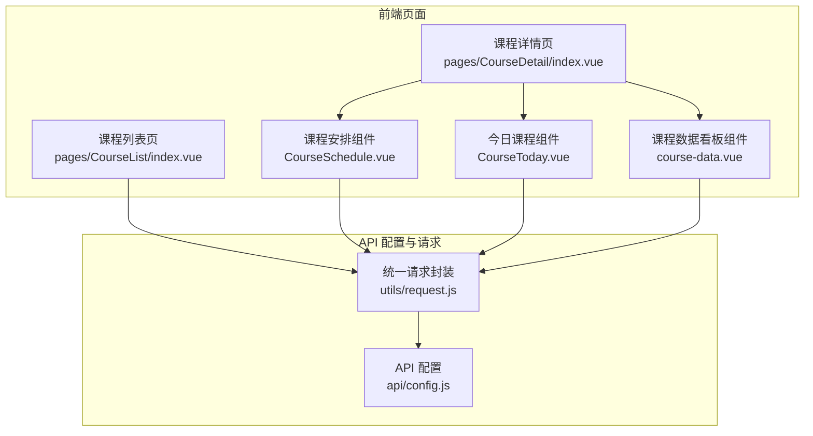
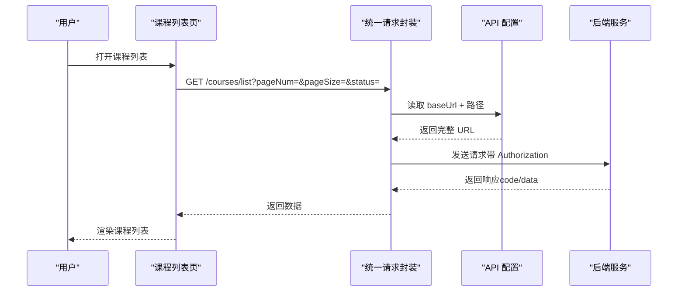
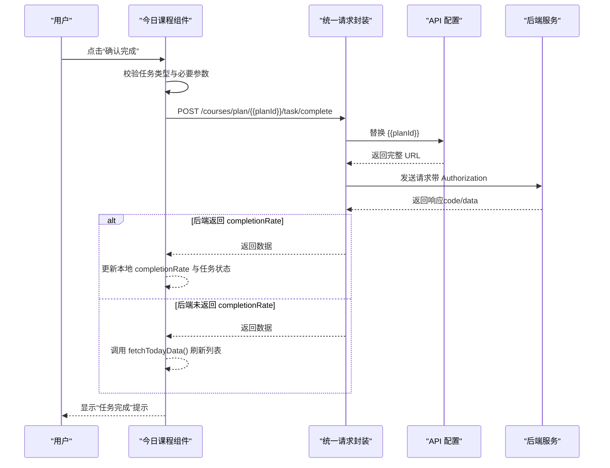
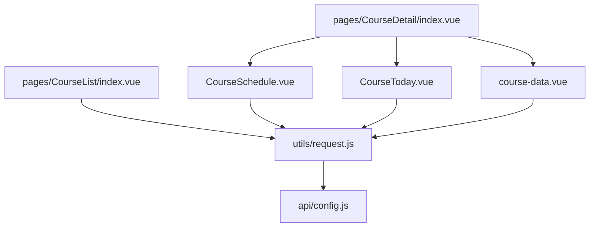

# 课程管理接口

<cite>
**本文引用的文件**
- [api/config.js](file://api/config.js)
- [utils/request.js](file://utils/request.js)
- [pages/CourseList/index.vue](file://pages/CourseList/index.vue)
- [pages/CourseDetail/index.vue](file://pages/CourseDetail/index.vue)
- [pages/CourseDetail/components/CourseSchedule.vue](file://pages/CourseDetail/components/CourseSchedule.vue)
- [pages/CourseDetail/components/CourseToday.vue](file://pages/CourseDetail/components/CourseToday.vue)
- [pages/CourseDetail/components/course-data.vue](file://pages/CourseDetail/components/course-data.vue)
- [doc/课程列表与打卡链路代码扫描报告.md](file://doc/课程列表与打卡链路代码扫描报告.md)
- [doc/课程安排模块代码扫描报告.md](file://doc/课程安排模块代码扫描报告.md)
- [doc/CourseToday打卡逻辑分析报告.md](file://doc/CourseToday打卡逻辑分析报告.md)
</cite>

## 目录
1. [简介](#简介)
2. [项目结构](#项目结构)
3. [核心组件](#核心组件)
4. [架构总览](#架构总览)
5. [详细组件分析](#详细组件分析)
6. [依赖分析](#依赖分析)
7. [性能考虑](#性能考虑)
8. [故障排除指南](#故障排除指南)
9. [结论](#结论)
10. [附录](#附录)

## 简介
本文件为“课程管理模块”的完整 API 接口文档，覆盖以下接口：
- 课程列表接口：/courses/list
- 课程详情接口：/courses/detail
- 热门课程接口：/courses/hot
- 课程安排接口：/courses/{{campId}}/schedule
- 今日课程接口：/courses/{{campId}}/today
- 课程数据看板接口：/courses/{{campId}}/data
- 任务打卡接口：/courses/plan/{{planId}}/task/complete

文档包含每个接口的 HTTP 方法、动态参数替换说明、请求参数、响应数据结构、分页处理、数据验证规则、错误码、课程状态管理、学习进度跟踪、打卡记录与课程统计的说明，并提供实际调用示例与常见使用场景。

## 项目结构
课程管理相关的核心文件与职责如下：
- API 配置：api/config.js 定义基础地址与各接口路径，包含动态参数占位符。
- 统一请求封装：utils/request.js 统一处理 Token 注入、错误处理与请求/响应封装。
- 课程列表页：pages/CourseList/index.vue 调用 /courses/list 获取课程列表，实现分页与状态展示。
- 课程详情页：pages/CourseDetail/index.vue 负责路由与子组件装载。
- 课程安排组件：pages/CourseDetail/components/CourseSchedule.vue 调用 /courses/{{campId}}/schedule 获取课程大纲。
- 今日课程组件：pages/CourseDetail/components/CourseToday.vue 调用 /courses/{{campId}}/today 获取当日任务，支持按 planId 查询指定天数据；提交打卡调用 /courses/plan/{{planId}}/task/complete。
- 课程数据看板组件：pages/CourseDetail/components/course-data.vue 调用 /courses/{{campId}}/data 获取学习趋势与成就等数据。
- 文档参考：doc/课程列表与打卡链路代码扫描报告.md、课程安排模块代码扫描报告.md、CourseToday打卡逻辑分析报告.md 提供接口调用与状态更新逻辑的补充说明。

图表来源
- [api/config.js:16-56](file://api/config.js#L16-L56)
- [utils/request.js:7-98](file://utils/request.js#L7-L98)
- [pages/CourseList/index.vue:198-237](file://pages/CourseList/index.vue#L198-L237)
- [pages/CourseDetail/components/CourseSchedule.vue:154-179](file://pages/CourseDetail/components/CourseSchedule.vue#L154-L179)
- [pages/CourseDetail/components/CourseToday.vue:216-242](file://pages/CourseDetail/components/CourseToday.vue#L216-L242)
- [pages/CourseDetail/components/course-data.vue:169-199](file://pages/CourseDetail/components/course-data.vue#L169-L199)

章节来源
- [api/config.js:16-56](file://api/config.js#L16-L56)
- [utils/request.js:7-98](file://utils/request.js#L7-L98)
- [pages/CourseList/index.vue:198-237](file://pages/CourseList/index.vue#L198-L237)
- [pages/CourseDetail/components/CourseSchedule.vue:154-179](file://pages/CourseDetail/components/CourseSchedule.vue#L154-L179)
- [pages/CourseDetail/components/CourseToday.vue:216-242](file://pages/CourseDetail/components/CourseToday.vue#L216-L242)
- [pages/CourseDetail/components/course-data.vue:169-199](file://pages/CourseDetail/components/course-data.vue#L169-L199)

## 核心组件
- API 配置模块：集中管理 baseUrl 与各接口路径，包含动态参数占位符（如 {{campId}}、{{planId}}），便于统一替换与调用。
- 统一请求封装：自动注入 Authorization Token，处理 401 未授权与通用错误提示，封装 GET/POST 快捷方法。
- 课程列表页：调用 /courses/list，实现分页加载、状态筛选与 UI 展示。
- 课程详情页：作为容器页，按标签切换加载课程安排、今日课程、课程数据等子组件。
- 课程安排组件：调用 /courses/{{campId}}/schedule 获取课程大纲，支持展开/折叠模块。
- 今日课程组件：调用 /courses/{{campId}}/today 获取当日任务，支持按 planId 查询指定天；提交打卡调用 /courses/plan/{{planId}}/task/complete。
- 课程数据看板组件：调用 /courses/{{campId}}/data 获取学习趋势、完成率与成就等数据。

章节来源
- [api/config.js:16-56](file://api/config.js#L16-L56)
- [utils/request.js:7-98](file://utils/request.js#L7-L98)
- [pages/CourseList/index.vue:198-237](file://pages/CourseList/index.vue#L198-L237)
- [pages/CourseDetail/components/CourseSchedule.vue:154-179](file://pages/CourseDetail/components/CourseSchedule.vue#L154-L179)
- [pages/CourseDetail/components/CourseToday.vue:216-242](file://pages/CourseDetail/components/CourseToday.vue#L216-L242)
- [pages/CourseDetail/components/course-data.vue:169-199](file://pages/CourseDetail/components/course-data.vue#L169-L199)

## 架构总览
课程管理模块的调用链路如下：
- 前端通过 utils/request.js 统一发起请求，自动注入 Token。
- api/config.js 提供接口路径与动态参数占位符，组件中按需替换。
- 课程列表页调用 /courses/list 获取课程列表；课程详情页按标签加载子组件。
- 课程安排组件调用 /courses/{{campId}}/schedule；今日课程组件调用 /courses/{{campId}}/today；任务打卡调用 /courses/plan/{{planId}}/task/complete；课程数据看板调用 /courses/{{campId}}/data。

图表来源
- [pages/CourseList/index.vue:206-210](file://pages/CourseList/index.vue#L206-L210)
- [utils/request.js:7-67](file://utils/request.js#L7-L67)
- [api/config.js:28](file://api/config.js#L28)

章节来源
- [pages/CourseList/index.vue:198-237](file://pages/CourseList/index.vue#L198-L237)
- [utils/request.js:7-67](file://utils/request.js#L7-L67)
- [api/config.js:28](file://api/config.js#L28)

## 详细组件分析

### 课程列表接口 /courses/list
- HTTP 方法：GET
- 动态参数：无
- 请求参数：
  - pageNum：页码（整数，从 1 开始）
  - pageSize：每页数量（整数）
  - status：状态筛选（整数，如 1 表示“进行中”）
- 响应数据结构（期望）：
  - code：状态码（200 表示成功）
  - data：包含 total（总数）与 list（课程数组）的对象
  - list 中的课程对象字段（示例）：id、title、description、startTime、endTime、participantCount、status 等
- 分页处理：前端维护 pageNum、pageSize、total、isFetching、isNoMore 等状态，支持下拉刷新与上拉加载更多。
- 数据验证规则：
  - pageNum、pageSize 必须为正整数
  - status 为枚举值（如 1/2/3）
- 错误码：
  - 401：未授权，前端清除 Token 并跳转登录
  - 400/其它：通用错误提示
- 调用示例（路径）：
  - GET /courses/list?pageNum=1&pageSize=10&status=1
- 常见使用场景：
  - 首次进入加载第一页
  - 下拉刷新重置 pageNum 并清空列表
  - 上拉加载：当未到达末尾时递增 pageNum

章节来源
- [pages/CourseList/index.vue:198-237](file://pages/CourseList/index.vue#L198-L237)
- [utils/request.js:29-54](file://utils/request.js#L29-L54)
- [doc/课程列表与打卡链路代码扫描报告.md:236-254](file://doc/课程列表与打卡链路代码扫描报告.md#L236-L254)

### 课程详情接口 /courses/detail
- HTTP 方法：GET
- 动态参数：无
- 请求参数：无（或由课程详情页按课程 id 拼接）
- 响应数据结构（期望）：
  - code：状态码（200 表示成功）
  - data：课程详情对象（包含标题、描述、参与人数、时间等）
- 数据验证规则：data 对象必须存在
- 错误码：401、400/其它
- 调用示例（路径）：
  - GET /courses/detail
- 常见使用场景：
  - 课程详情页加载课程信息

章节来源
- [pages/CourseDetail/index.vue:128-139](file://pages/CourseDetail/index.vue#L128-L139)
- [api/config.js:29](file://api/config.js#L29)
- [utils/request.js:29-54](file://utils/request.js#L29-L54)

### 热门课程接口 /courses/hot
- HTTP 方法：GET
- 动态参数：无
- 请求参数：无
- 响应数据结构（期望）：
  - code：状态码（200 表示成功）
  - data：热门课程列表
- 数据验证规则：data 为数组
- 错误码：401、400/其它
- 调用示例（路径）：
  - GET /courses/hot
- 常见使用场景：
  - 首页或推荐位展示热门课程

章节来源
- [api/config.js:26](file://api/config.js#L26)
- [utils/request.js:29-54](file://utils/request.js#L29-L54)

### 课程安排接口 /courses/{{campId}}/schedule
- HTTP 方法：GET
- 动态参数：campId（营期/班级 ID）
- 请求参数：无
- 响应数据结构（期望）：
  - code：状态码（200 表示成功）
  - data：数组，每个元素包含 moduleIndex、moduleName、plans（每日计划数组）
  - plans 中元素包含 planId、dayIndex、title、readingTitle、teacherName、videoDuration 等
- 数据验证规则：data 为数组；moduleIndex、dayIndex 为数字；plans 为数组
- 错误码：401、400/其它
- 调用示例（路径）：
  - GET /courses/101/schedule
- 常见使用场景：
  - 课程详情页“课程安排”标签加载课程大纲

章节来源
- [pages/CourseDetail/components/CourseSchedule.vue:154-179](file://pages/CourseDetail/components/CourseSchedule.vue#L154-L179)
- [api/config.js:52](file://api/config.js#L52)
- [doc/课程安排模块代码扫描报告.md:153-173](file://doc/课程安排模块代码扫描报告.md#L153-L173)

### 今日课程接口 /courses/{{campId}}/today
- HTTP 方法：GET
- 动态参数：campId（营期/班级 ID）
- 请求参数：
  - planId（可选）：指定某一天的计划 ID，若不传则返回“今天”的数据
- 响应数据结构（期望）：
  - code：状态码（200 表示成功）
  - data：包含 currentDate（日期）、completionRate（完成率）、tasks（任务数组）等
  - tasks 中元素包含 taskId、taskName、taskType、taskDesc、isDone、isRequired 等
- 数据验证规则：data 对象必须存在；completionRate 为数值；tasks 为数组
- 错误码：401、400/其它
- 调用示例（路径）：
  - GET /courses/101/today
  - GET /courses/101/today?planId=201
- 常见使用场景：
  - 课程详情页“今日课程”标签加载当日任务；支持按 planId 查看指定天

章节来源
- [pages/CourseDetail/components/CourseToday.vue:216-242](file://pages/CourseDetail/components/CourseToday.vue#L216-L242)
- [api/config.js:53](file://api/config.js#L53)

### 课程数据看板接口 /courses/{{campId}}/data
- HTTP 方法：GET
- 动态参数：campId（营期/班级 ID）
- 请求参数：无
- 响应数据结构（期望）：
  - code：状态码（200 表示成功）
  - data：包含 overallRate（总完成率）、totalDays（总天数）、completedDays（已完成）、trends（学习趋势数组）、achievements（成就列表）等
  - trends 中元素包含 dayIndex、dayStr、status（LOCKED/MISSED/COMPLETED/PARTIAL/MAKEUP）、rate 等
- 数据验证规则：data 对象必须存在；trends 为数组
- 错误码：401、400/其它
- 调用示例（路径）：
  - GET /courses/101/data
- 常见使用场景：
  - 课程详情页“课程数据”标签展示学习趋势与成就

章节来源
- [pages/CourseDetail/components/course-data.vue:169-199](file://pages/CourseDetail/components/course-data.vue#L169-L199)
- [api/config.js:55](file://api/config.js#L55)

### 任务打卡接口 /courses/plan/{{planId}}/task/complete
- HTTP 方法：POST
- 动态参数：planId（排课计划 ID）
- 请求参数：
  - taskId：任务 ID（必填）
- 响应数据结构（期望）：
  - code：状态码（200 表示成功）
  - data：包含 completionRate（新的完成率）等
- 数据验证规则：taskId 为数字；后端返回 completionRate 时前端直接更新本地状态
- 错误码：401、400/其它
- 调用示例（路径）：
  - POST /courses/plan/101/task/complete
- 常见使用场景：
  - 今日课程组件点击任务后提交打卡；成功后更新任务状态与完成率

图表来源
- [pages/CourseDetail/components/CourseToday.vue:291-352](file://pages/CourseDetail/components/CourseToday.vue#L291-L352)
- [api/config.js:54](file://api/config.js#L54)
- [utils/request.js:7-67](file://utils/request.js#L7-L67)
- [doc/CourseToday打卡逻辑分析报告.md:5-67](file://doc/CourseToday打卡逻辑分析报告.md#L5-L67)

章节来源
- [pages/CourseDetail/components/CourseToday.vue:291-352](file://pages/CourseDetail/components/CourseToday.vue#L291-L352)
- [api/config.js:54](file://api/config.js#L54)
- [utils/request.js:7-67](file://utils/request.js#L7-L67)
- [doc/CourseToday打卡逻辑分析报告.md:5-67](file://doc/CourseToday打卡逻辑分析报告.md#L5-L67)

## 依赖分析
- 组件耦合：
  - 课程详情页通过子组件装载课程安排、今日课程、课程数据看板，形成清晰的模块化结构。
  - 今日课程组件与课程安排组件分别依赖 API 配置中的路径，避免硬编码。
- 外部依赖：
  - 统一请求封装依赖 uni.request 与本地存储 token。
  - API 配置集中管理路径，便于替换 baseUrl 与动态参数。

图表来源
- [api/config.js:16-56](file://api/config.js#L16-L56)
- [utils/request.js:7-98](file://utils/request.js#L7-L98)
- [pages/CourseList/index.vue:198-237](file://pages/CourseList/index.vue#L198-L237)
- [pages/CourseDetail/components/CourseSchedule.vue:154-179](file://pages/CourseDetail/components/CourseSchedule.vue#L154-L179)
- [pages/CourseDetail/components/CourseToday.vue:216-242](file://pages/CourseDetail/components/CourseToday.vue#L216-L242)
- [pages/CourseDetail/components/course-data.vue:169-199](file://pages/CourseDetail/components/course-data.vue#L169-L199)

章节来源
- [api/config.js:16-56](file://api/config.js#L16-L56)
- [utils/request.js:7-98](file://utils/request.js#L7-L98)
- [pages/CourseList/index.vue:198-237](file://pages/CourseList/index.vue#L198-L237)
- [pages/CourseDetail/components/CourseSchedule.vue:154-179](file://pages/CourseDetail/components/CourseSchedule.vue#L154-L179)
- [pages/CourseDetail/components/CourseToday.vue:216-242](file://pages/CourseDetail/components/CourseToday.vue#L216-L242)
- [pages/CourseDetail/components/course-data.vue:169-199](file://pages/CourseDetail/components/course-data.vue#L169-L199)

## 性能考虑
- 分页加载：课程列表页使用 pageNum/pageSize 控制分页，避免一次性加载大量数据。
- 响应式更新：今日课程组件采用就地更新策略，减少不必要的接口请求。
- 图标与资源：组件中使用静态资源与图标，尽量避免重复请求。

## 故障排除指南
- 未授权（401）：
  - 统一请求封装会清除本地 Token 并跳转登录页。
  - 前端应提示“登录已过期，请重新登录”。
- 网络异常：
  - 统一请求封装捕获 fail 并提示“网络连接异常”。
- 接口返回非 200：
  - 统一请求封装对 400+ 状态码统一提示错误码。
- 课程安排渲染异常：
  - 若出现“第0周”或重复周标题，需检查后端返回的 moduleIndex 与 moduleName，确保 moduleIndex 从 1 开始且 moduleName 非空。
- 打卡后进度未刷新：
  - 若后端未返回 completionRate，组件会重新请求今日课程数据；若仍不刷新，需确认父组件是否正确监听 updateProgress 事件。

章节来源
- [utils/request.js:29-64](file://utils/request.js#L29-L64)
- [doc/课程安排模块代码扫描报告.md:177-249](file://doc/课程安排模块代码扫描报告.md#L177-L249)
- [doc/课程列表与打卡链路代码扫描报告.md:346-394](file://doc/课程列表与打卡链路代码扫描报告.md#L346-L394)

## 结论
本接口文档基于现有前端实现与相关文档，明确了课程管理模块各接口的调用方式、参数与响应结构。建议在后端实现时严格遵循本文档的响应结构与错误码约定，以便前端能够稳定地进行状态管理与 UI 更新。

## 附录
- 常用调用示例（路径）：
  - GET /courses/list?pageNum=1&pageSize=10&status=1
  - GET /courses/detail
  - GET /courses/hot
  - GET /courses/101/schedule
  - GET /courses/101/today
  - GET /courses/101/today?planId=201
  - GET /courses/101/data
  - POST /courses/plan/101/task/complete（body：{ taskId }）