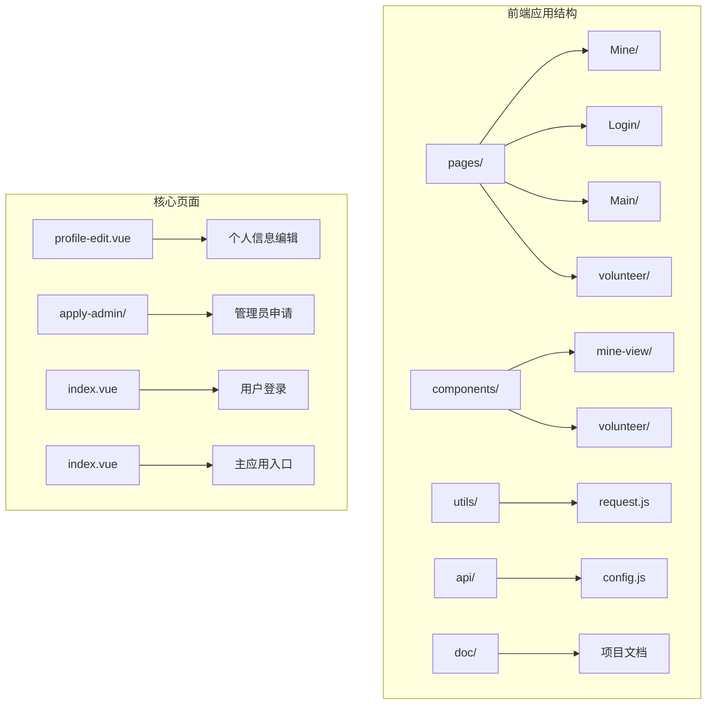
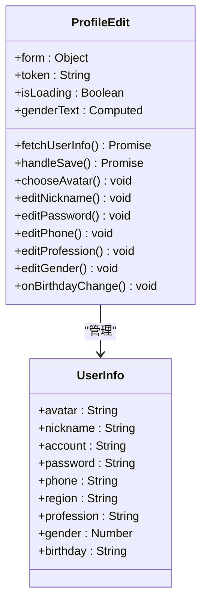
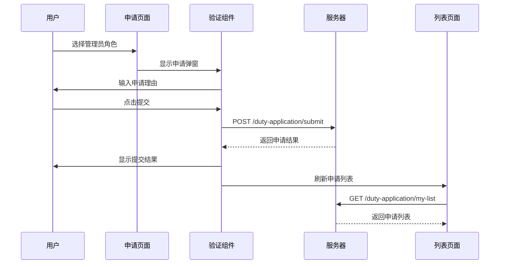
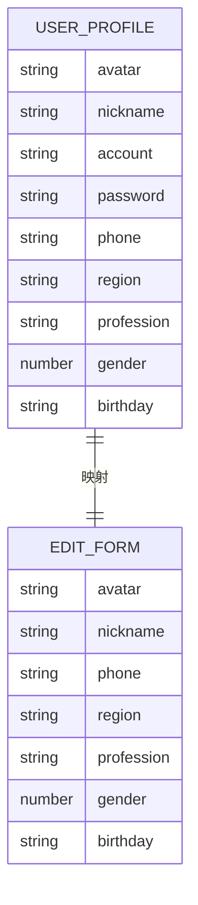
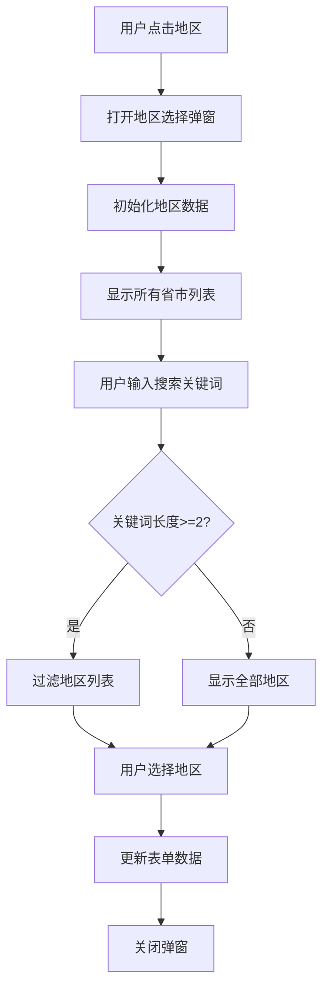
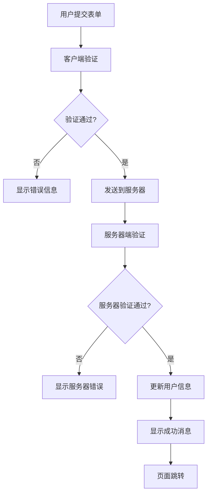
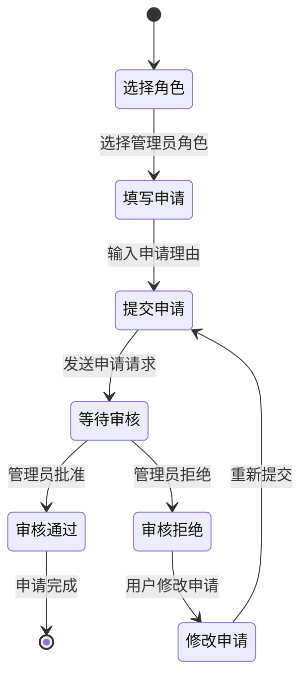
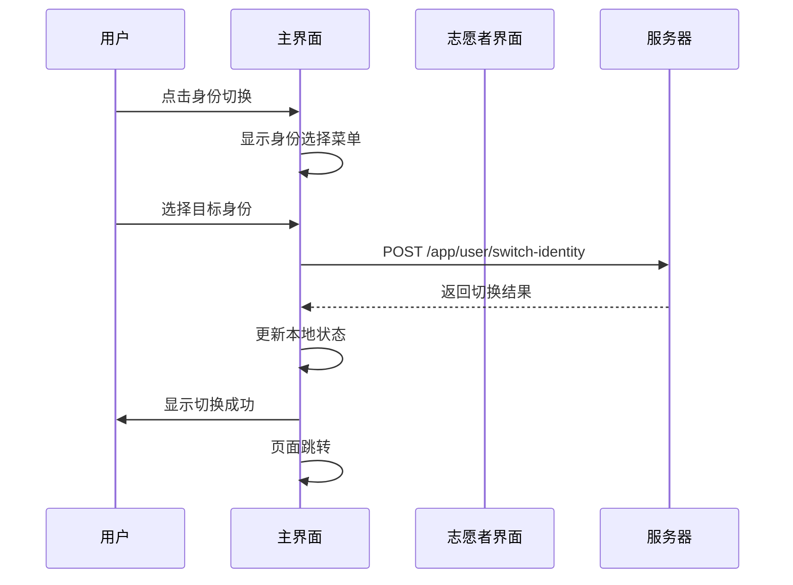
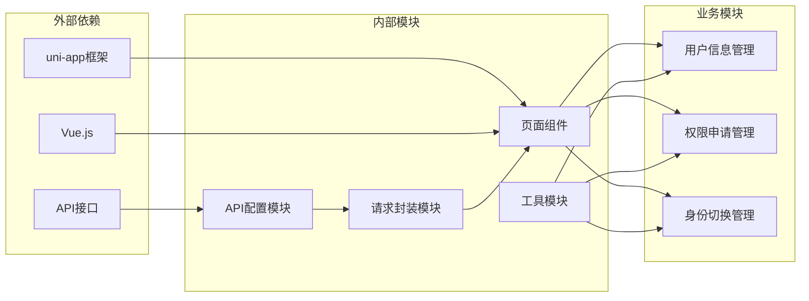

# 个人中心系统

<cite>
**本文档引用的文件**
- [profile-edit.vue](file://pages/Mine/profile-edit.vue)
- [apply-admin/index.vue](file://pages/Mine/apply-admin/index.vue)
- [apply-admin/list.vue](file://pages/Mine/apply-admin/list.vue)
- [mine-view.vue](file://components/mine-view/mine-view.vue)
- [index.vue](file://pages/Login/index.vue)
- [complete-info.vue](file://pages/Login/complete-info.vue)
- [config.js](file://api/config.js)
- [china-area.js](file://pages/Mine/china-area.js)
- [request.js](file://utils/request.js)
- [volunteer-mine.vue](file://components/volunteer/volunteer-mine.vue)
- [volunteer-manage.vue](file://pages/volunteer-manage/volunteer-manage.vue)
- [index.vue](file://pages/Main/index.vue)
</cite>

## 目录
1. [简介](#简介)
2. [项目结构](#项目结构)
3. [核心组件](#核心组件)
4. [架构概览](#架构概览)
5. [详细组件分析](#详细组件分析)
6. [依赖关系分析](#依赖关系分析)
7. [性能考虑](#性能考虑)
8. [故障排除指南](#故障排除指南)
9. [结论](#结论)

## 简介

致良知教育项目的个人中心系统是一个完整的用户信息管理平台，提供了用户个人信息展示、编辑和保存机制，管理员申请功能，以及用户设置选项的配置管理。该系统采用Vue.js框架构建，支持小程序平台，实现了完整的用户身份管理和权限控制功能。

系统主要包含三个核心功能模块：
- **个人信息管理**：用户信息展示、编辑和保存
- **管理员申请**：权限申请流程管理
- **身份切换**：学员端与志愿者端之间的无缝切换

## 项目结构

该项目采用模块化的文件组织结构，按照功能域进行划分：



**图表来源**
- [profile-edit.vue:1-346](file://pages/Mine/profile-edit.vue#L1-L346)
- [apply-admin/index.vue:1-515](file://pages/Mine/apply-admin/index.vue#L1-L515)
- [mine-view.vue:1-910](file://components/mine-view/mine-view.vue#L1-L910)

**章节来源**
- [profile-edit.vue:1-346](file://pages/Mine/profile-edit.vue#L1-L346)
- [apply-admin/index.vue:1-515](file://pages/Mine/apply-admin/index.vue#L1-L515)
- [mine-view.vue:1-910](file://components/mine-view/mine-view.vue#L1-L910)

## 核心组件

### 用户信息管理组件

用户信息管理是个人中心系统的核心功能，提供了完整的个人信息维护能力：



**图表来源**
- [profile-edit.vue:121-313](file://pages/Mine/profile-edit.vue#L121-L313)

### 管理员申请组件

管理员申请功能提供了完整的权限申请和管理流程：



**图表来源**
- [apply-admin/index.vue:132-190](file://pages/Mine/apply-admin/index.vue#L132-L190)
- [apply-admin/list.vue:94-132](file://pages/Mine/apply-admin/list.vue#L94-L132)

**章节来源**
- [profile-edit.vue:151-313](file://pages/Mine/profile-edit.vue#L151-L313)
- [apply-admin/index.vue:109-191](file://pages/Mine/apply-admin/index.vue#L109-L191)
- [apply-admin/list.vue:61-186](file://pages/Mine/apply-admin/list.vue#L61-L186)

## 架构概览

系统采用分层架构设计，实现了清晰的关注点分离：

```mermaid
graph TB
subgraph "表现层"
A[mine-view.vue] --> B[个人中心界面]
C[profile-edit.vue] --> D[信息编辑界面]
E[apply-admin/index.vue] --> F[权限申请界面]
G[apply-admin/list.vue] --> H[申请记录界面]
end
subgraph "业务逻辑层"
I[API配置] --> J[请求封装]
K[数据验证] --> L[状态管理]
end
subgraph "数据访问层"
M[用户信息API] --> N[/user/info]
O[更新信息API] --> P[/user/updateAll]
Q[申请API] --> R[/duty-application/*]
end
subgraph "存储层"
S[本地存储] --> T[token缓存]
U[用户信息缓存] --> V[userInfo]
W[身份状态] --> X[currentIdentity]
end
A --> I
C --> J
E --> K
G --> L
I --> M
J --> O
K --> Q
L --> S
```

**图表来源**
- [config.js:8-57](file://api/config.js#L8-L57)
- [request.js:7-67](file://utils/request.js#L7-L67)

**章节来源**
- [config.js:1-60](file://api/config.js#L1-L60)
- [request.js:1-98](file://utils/request.js#L1-L98)

## 详细组件分析

### 个人信息编辑组件

个人信息编辑组件提供了完整的用户信息维护功能，支持多种字段的编辑和验证：

#### 数据模型设计



**图表来源**
- [profile-edit.vue:124-127](file://pages/Mine/profile-edit.vue#L124-L127)

#### 地区选择功能

系统实现了完整的中国省市地区选择功能，支持搜索和筛选：



**图表来源**
- [profile-edit.vue:152-187](file://pages/Mine/profile-edit.vue#L152-L187)
- [china-area.js:1-43](file://pages/Mine/china-area.js#L1-L43)

#### 数据验证逻辑

系统实现了多层次的数据验证机制：



**图表来源**
- [profile-edit.vue:294-311](file://pages/Mine/profile-edit.vue#L294-L311)

**章节来源**
- [profile-edit.vue:117-313](file://pages/Mine/profile-edit.vue#L117-L313)
- [china-area.js:1-43](file://pages/Mine/china-area.js#L1-L43)

### 管理员申请系统

管理员申请系统提供了完整的权限申请和管理流程：

#### 申请流程设计



**图表来源**
- [apply-admin/index.vue:122-190](file://pages/Mine/apply-admin/index.vue#L122-L190)

#### 申请状态管理

系统支持多种申请状态的管理：

| 状态码 | 状态名称 | 描述 |
|--------|----------|------|
| 0 | 待审核 | 申请已提交，等待管理员审核 |
| 1 | 已通过 | 管理员已批准申请 |
| 2 | 已驳回 | 管理员已拒绝申请 |
| 3 | 已撤销 | 用户主动撤销申请 |

**章节来源**
- [apply-admin/index.vue:109-191](file://pages/Mine/apply-admin/index.vue#L109-L191)
- [apply-admin/list.vue:69-92](file://pages/Mine/apply-admin/list.vue#L69-L92)

### 身份切换系统

系统支持学员端和志愿者端之间的无缝身份切换：

#### 身份切换流程



**图表来源**
- [mine-view.vue:270-310](file://components/mine-view/mine-view.vue#L270-L310)
- [volunteer-mine.vue:525-574](file://components/volunteer/volunteer-mine.vue#L525-L574)

**章节来源**
- [mine-view.vue:204-376](file://components/mine-view/mine-view.vue#L204-L376)
- [volunteer-mine.vue:103-595](file://components/volunteer/volunteer-mine.vue#L103-L595)

## 依赖关系分析

系统采用了清晰的依赖关系设计，实现了良好的模块化：



**图表来源**
- [config.js:1-60](file://api/config.js#L1-L60)
- [request.js:1-98](file://utils/request.js#L1-L98)

**章节来源**
- [config.js:1-60](file://api/config.js#L1-L60)
- [request.js:1-98](file://utils/request.js#L1-L98)

## 性能考虑

系统在设计时充分考虑了性能优化：

### 缓存策略
- **Token缓存**：使用本地存储缓存用户认证信息
- **用户信息缓存**：缓存用户基本信息以减少重复请求
- **身份状态缓存**：缓存当前身份状态避免频繁切换

### 异步处理
- **并发请求限制**：防止重复提交和过度请求
- **加载状态管理**：提供用户友好的加载反馈
- **错误重试机制**：在网络异常时提供重试机会

### 内存管理
- **组件生命周期**：合理管理组件的创建和销毁
- **事件监听清理**：及时清理不再使用的事件监听器
- **资源释放**：及时释放图片等大资源

## 故障排除指南

### 常见问题及解决方案

#### 登录状态异常
**问题描述**：用户登录后仍然显示未登录状态
**解决方案**：
1. 检查Token是否正确存储
2. 验证API接口的认证头设置
3. 确认服务器返回的Token有效性

#### 数据加载失败
**问题描述**：个人信息或申请列表无法加载
**解决方案**：
1. 检查网络连接状态
2. 验证API接口URL配置
3. 查看服务器响应状态码

#### 文件上传失败
**问题描述**：头像上传或文件上传失败
**解决方案**：
1. 检查文件大小和格式限制
2. 验证上传接口的配置
3. 确认服务器存储权限

#### 身份切换失败
**问题描述**：学员端与志愿者端之间切换失败
**解决方案**：
1. 检查用户权限状态
2. 验证身份切换接口
3. 确认目标页面的访问权限

**章节来源**
- [request.js:24-67](file://utils/request.js#L24-L67)
- [profile-edit.vue:190-210](file://pages/Mine/profile-edit.vue#L190-L210)

## 结论

致良知教育项目的个人中心系统是一个功能完整、架构清晰的用户信息管理平台。系统通过模块化的设计实现了良好的可维护性和扩展性，提供了完整的用户信息管理、权限申请和身份切换功能。

系统的主要优势包括：
- **完整的功能覆盖**：涵盖了用户信息管理的所有核心需求
- **良好的用户体验**：提供了直观易用的操作界面和流畅的交互体验
- **完善的错误处理**：实现了多层次的错误处理和用户反馈机制
- **清晰的架构设计**：采用了合理的分层架构和模块化设计

未来可以考虑的改进方向：
- 增加更多的个性化设置选项
- 优化移动端的交互体验
- 增强数据安全和隐私保护机制
- 扩展更多的身份管理功能