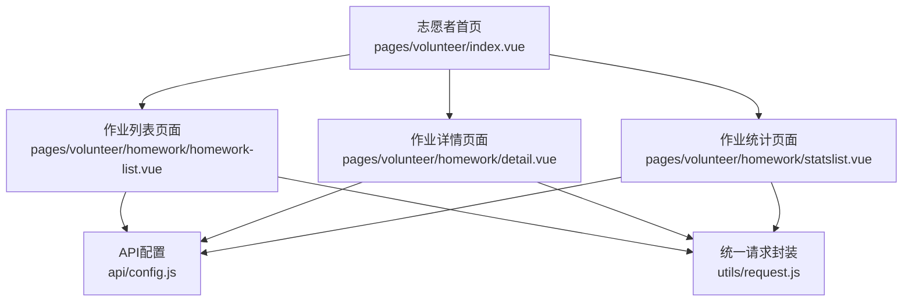
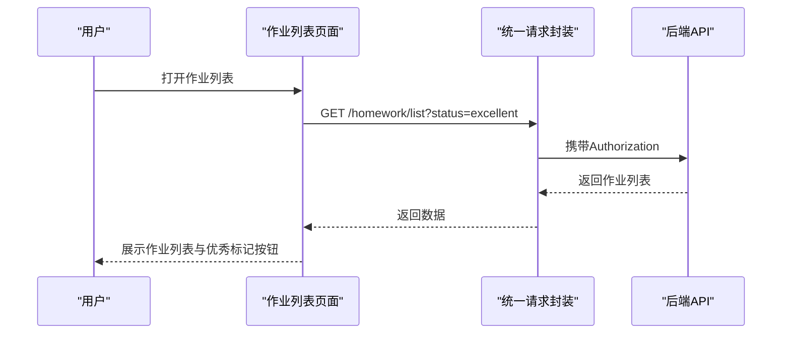
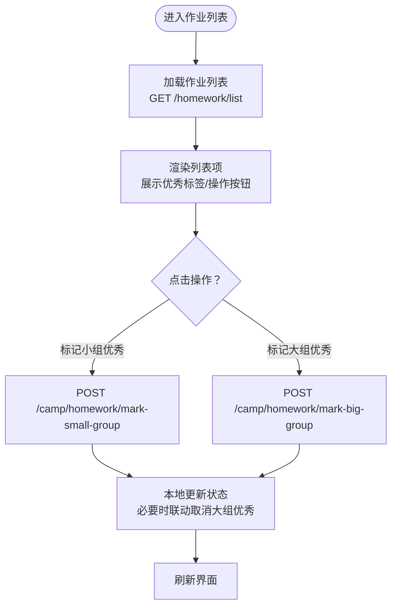
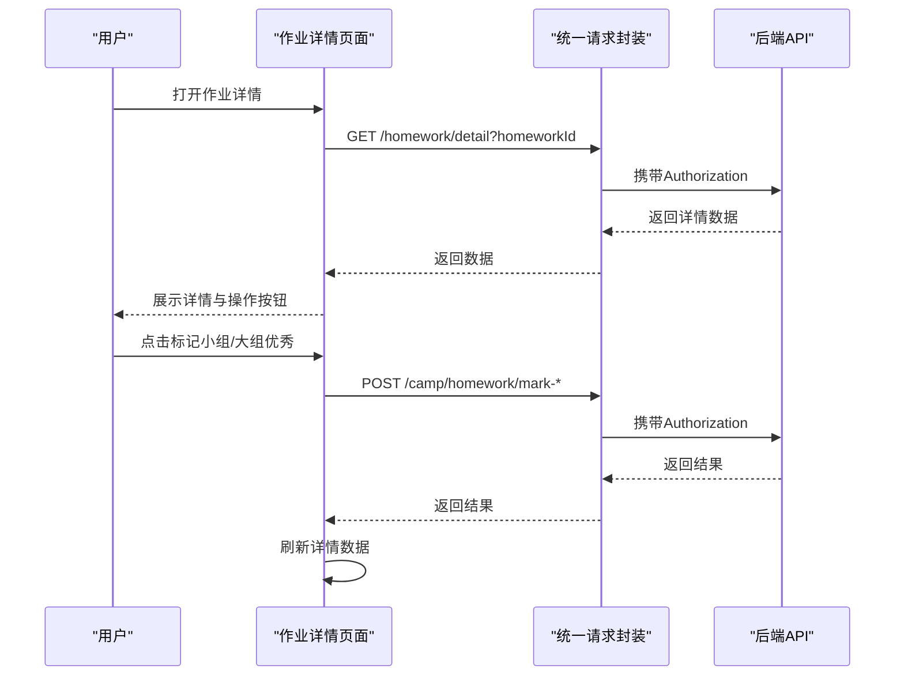
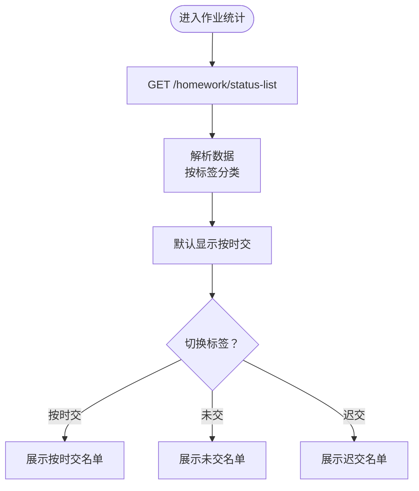
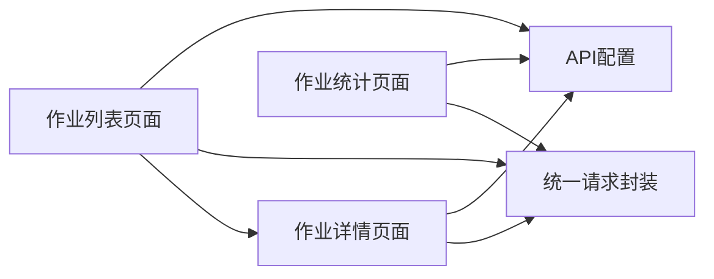
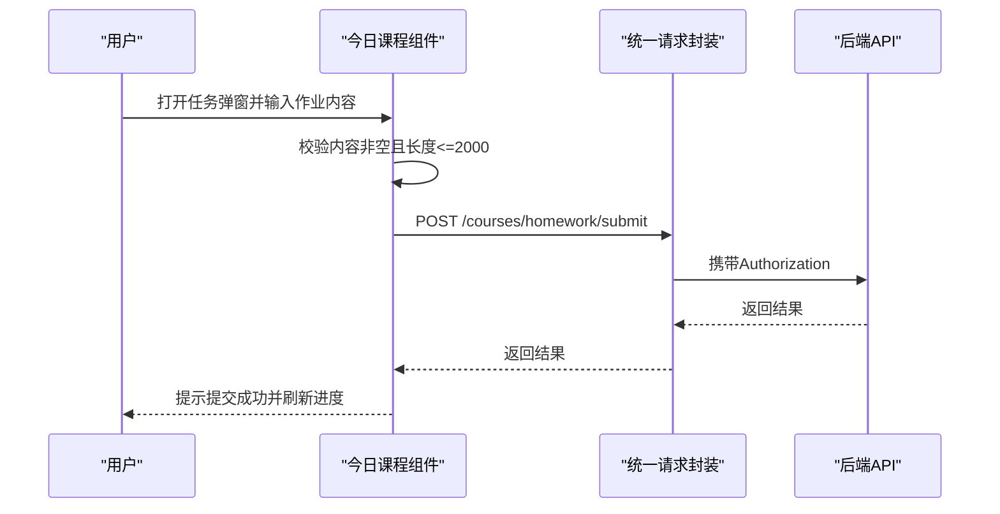
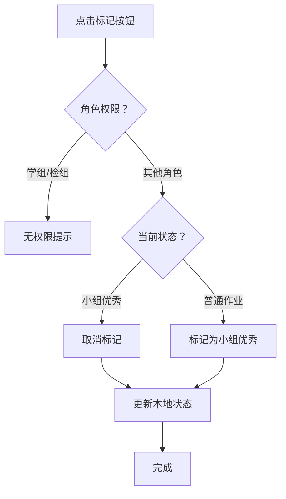

# 作业管理功能

<cite>
**本文引用的文件**
- [作业列表页面](file://pages/volunteer/homework/homework-list.vue)
- [作业详情页面](file://pages/volunteer/homework/detail.vue)
- [作业统计页面](file://pages/volunteer/homework/statslist.vue)
- [志愿者首页](file://pages/volunteer/index.vue)
- [API配置](file://api/config.js)
- [统一请求封装](file://utils/request.js)
- [今日课程组件](file://pages/CourseDetail/components/CourseToday.vue)
</cite>

## 目录
1. [简介](#简介)
2. [项目结构](#项目结构)
3. [核心组件](#核心组件)
4. [架构总览](#架构总览)
5. [详细组件分析](#详细组件分析)
6. [依赖关系分析](#依赖关系分析)
7. [性能考虑](#性能考虑)
8. [故障排除指南](#故障排除指南)
9. [结论](#结论)
10. [附录](#附录)

## 简介
本文件面向致良知教育项目的作业管理功能，系统性梳理作业列表、作业详情、作业统计与优秀作业评选等模块的前端实现与交互设计，并结合现有代码给出业务流程、用户体验优化建议以及安全与性能方面的注意事项。文档严格基于仓库中的实际源码进行分析，避免臆测。

## 项目结构
作业管理功能位于志愿者模块下，主要涉及三个页面：
- 作业列表页面：支持按日期筛选、标签切换（作业列表/优秀作业），并提供小组与大组优秀标记能力
- 作业详情页面：展示作业内容、提交状态与优秀标记状态，并支持权限控制的操作
- 作业统计页面：按“已交/未交/迟交”三类展示名单，支持切换查看

图表来源
- [志愿者首页:1-210](file://pages/volunteer/index.vue#L1-L210)
- [作业列表页面:1-615](file://pages/volunteer/homework/homework-list.vue#L1-L615)
- [作业详情页面:1-505](file://pages/volunteer/homework/detail.vue#L1-L505)
- [作业统计页面:1-384](file://pages/volunteer/homework/statslist.vue#L1-L384)
- [API配置:1-60](file://api/config.js#L1-L60)
- [统一请求封装:1-98](file://utils/request.js#L1-L98)

章节来源
- [志愿者首页:1-210](file://pages/volunteer/index.vue#L1-L210)
- [API配置:1-60](file://api/config.js#L1-L60)

## 核心组件
- 作业列表页面：负责展示作业列表、日期筛选、标签切换、优秀标记操作与权限校验
- 作业详情页面：负责展示作业详情、状态展示、优秀标记操作与权限校验
- 作业统计页面：负责展示作业状态名单（已交/未交/迟交），支持切换查看
- API配置：集中管理后端接口路径与基础地址
- 统一请求封装：统一封装请求头注入、错误处理与登录态失效处理

章节来源
- [作业列表页面:111-348](file://pages/volunteer/homework/homework-list.vue#L111-L348)
- [作业详情页面:98-288](file://pages/volunteer/homework/detail.vue#L98-L288)
- [作业统计页面:90-185](file://pages/volunteer/homework/statslist.vue#L90-L185)
- [API配置:8-57](file://api/config.js#L8-L57)
- [统一请求封装:7-67](file://utils/request.js#L7-L67)

## 架构总览
作业管理采用“页面-组件-工具-配置”的分层架构：
- 页面层：作业列表、作业详情、作业统计
- 组件层：通用导航栏、底部导航、弹窗等
- 工具层：统一请求封装，自动注入 Authorization
- 配置层：API 基础地址与接口路径

图表来源
- [作业列表页面:162-207](file://pages/volunteer/homework/homework-list.vue#L162-L207)
- [统一请求封装:7-67](file://utils/request.js#L7-L67)
- [API配置:45-47](file://api/config.js#L45-L47)

## 详细组件分析

### 作业列表页面（homework-list.vue）
- 设计要点
  - 顶部标题栏与标签切换（作业列表/优秀作业）
  - 日期选择器，支持按日期筛选
  - 列表项展示提交人员、提交时间、所属分组
  - 优秀作业标签（小组/大组）
  - 操作按钮：查看详情、标记/取消小组优秀、标记/取消大组优秀
- 权限控制
  - 小组优秀：学班/检班/学委/检委/学组/检组均可操作
  - 大组优秀：学组/检组不可操作；其余角色需先标记为小组优秀才可操作
- 数据流
  - 加载时根据 activeTab 与 selectedDate 构造查询参数
  - 成功后将 isSmallGroupExcellent/isBigGroupExcellent 数值转换为布尔
  - 操作后本地更新列表状态，必要时联动取消大组优秀
- 交互细节
  - 空数据提示
  - 按钮禁用态与激活态样式区分
  - 详情跳转携带参数（homeworkId、userId、name、date、dutyType）

图表来源
- [作业列表页面:162-321](file://pages/volunteer/homework/homework-list.vue#L162-L321)

章节来源
- [作业列表页面:111-348](file://pages/volunteer/homework/homework-list.vue#L111-L348)

### 作业详情页面（detail.vue）
- 设计要点
  - 展示学员姓名、组织、提交时间、作业状态（普通/小组优秀/大组优秀）
  - 作业内容展示区域
  - 优秀标记操作按钮（小组/大组）
- 权限控制
  - 小组优秀：学班/检班/学委/检委/学组/检组均可操作
  - 大组优秀：学组/检组不可操作；其余角色需先标记为小组优秀才可操作
- 数据流
  - 加载详情：GET /homework/detail?homeworkId
  - 操作后重新拉取详情以保持状态一致
- 交互细节
  - 状态文本与颜色区分（小组优秀/大组优秀）
  - 按钮禁用态与激活态样式区分
  - 参数校验与登录态校验

图表来源
- [作业详情页面:172-286](file://pages/volunteer/homework/detail.vue#L172-L286)
- [统一请求封装:7-67](file://utils/request.js#L7-L67)
- [API配置:46-47](file://api/config.js#L46-L47)

章节来源
- [作业详情页面:98-288](file://pages/volunteer/homework/detail.vue#L98-L288)

### 作业统计页面（statslist.vue）
- 设计要点
  - 标签切换：按时交/未交/迟交
  - 展示范围名称与日期
  - 名单列表：姓名、手机号、状态标签
- 数据流
  - GET /homework/status-list?type&id&date
  - 成功后按标签分类存储 submitted/pending/late
  - 默认显示“按时交”
- 交互细节
  - 空数据提示
  - 状态标签样式区分（按时交/未交/迟交）

图表来源
- [作业统计页面:140-183](file://pages/volunteer/homework/statslist.vue#L140-L183)

章节来源
- [作业统计页面:90-185](file://pages/volunteer/homework/statslist.vue#L90-L185)

### API配置与统一请求封装
- API配置
  - 基础地址与接口路径集中管理，便于维护与替换
  - 作业相关接口：/homework/list、/homework/detail、/homework/status-list、/camp/homework/mark-small-group、/camp/homework/mark-big-group
- 统一请求封装
  - 自动注入 Authorization（Token）
  - 统一处理 401 未授权（清除 Token 并跳转登录）
  - 统一处理网络异常与 HTTP 错误码

章节来源
- [API配置:8-57](file://api/config.js#L8-L57)
- [统一请求封装:7-67](file://utils/request.js#L7-L67)

### 作业提交与内容规范（来自课程模块）
- 作业提交入口位于“今日课程”弹窗中，作业类型为 HOMEWORK
- 提交前校验：作业内容不能为空
- 提交内容长度限制：最大 2000 字符
- 提交接口：/courses/homework/submit（由 API 配置中的 paths.submitHomework 或回退路径决定）

章节来源
- [今日课程组件:291-352](file://pages/CourseDetail/components/CourseToday.vue#L291-L352)

## 依赖关系分析
- 页面与配置
  - 作业列表/详情/统计均通过 API_CONFIG 引用后端接口路径
- 页面与工具
  - 三个页面均使用 utils/request.js 进行网络请求，统一注入 Authorization
- 页面与页面
  - 作业列表跳转至作业详情，传递 homeworkId、userId、name、date、dutyType
- 权限耦合
  - 优秀标记操作权限与 dutyType 强关联，页面内直接判断角色

图表来源
- [作业列表页面:112-125](file://pages/volunteer/homework/homework-list.vue#L112-L125)
- [作业详情页面:99-108](file://pages/volunteer/homework/detail.vue#L99-L108)
- [作业统计页面:91-108](file://pages/volunteer/homework/statslist.vue#L91-L108)
- [API配置:8-57](file://api/config.js#L8-L57)
- [统一请求封装:7-67](file://utils/request.js#L7-L67)

章节来源
- [作业列表页面:111-125](file://pages/volunteer/homework/homework-list.vue#L111-L125)
- [作业详情页面:98-108](file://pages/volunteer/homework/detail.vue#L98-L108)
- [作业统计页面:90-108](file://pages/volunteer/homework/statslist.vue#L90-L108)
- [API配置:8-57](file://api/config.js#L8-L57)
- [统一请求封装:7-67](file://utils/request.js#L7-L67)

## 性能考虑
- 列表渲染
  - 使用 v-for 渲染作业列表，建议在数据量较大时考虑虚拟滚动或分页
- 网络请求
  - 统一请求封装已内置错误处理与 401 自动跳转，减少重复逻辑
- 图片与资源
  - 页面中未发现图片资源引用，整体资源压力较小
- 交互反馈
  - 提交与切换标签时使用 Toast 与 Loading，提升用户感知

[本节为通用建议，无需特定文件来源]

## 故障排除指南
- 登录态失效
  - 现象：请求返回 401
  - 处理：统一请求封装会清除 Token 并跳转登录页
- 网络异常
  - 现象：网络错误提示
  - 处理：检查网络状态与后端服务可用性
- 参数无效
  - 现象：作业ID无效、参数不全
  - 处理：页面内已进行参数校验与提示
- 权限不足
  - 现象：无法标记大组优秀或无权限
  - 处理：根据 dutyType 与状态进行权限判断

章节来源
- [统一请求封装:28-44](file://utils/request.js#L28-L44)
- [作业列表页面:210-226](file://pages/volunteer/homework/homework-list.vue#L210-L226)
- [作业详情页面:158-170](file://pages/volunteer/homework/detail.vue#L158-L170)

## 结论
作业管理功能在当前版本中实现了作业列表展示、筛选与排序（按日期）、优秀作业标记与权限控制、作业详情展示与操作、作业统计名单展示等核心能力。页面间通过统一的 API 配置与请求封装实现解耦，权限控制集中在页面逻辑中，交互体验较为清晰。后续可在以下方面进一步优化：
- 优秀作业评选标准与展示机制：建议在页面中补充说明评选规则与展示位置
- 文件格式限制与大小控制：当前作业提交为文本内容，若扩展为文件提交，建议在前端增加格式与大小校验
- 用户体验优化：增加加载骨架屏、分页与搜索、空状态引导等

[本节为总结性内容，无需特定文件来源]

## 附录

### 作业提交流程（来自课程模块）

图表来源
- [今日课程组件:291-352](file://pages/CourseDetail/components/CourseToday.vue#L291-L352)
- [统一请求封装:7-67](file://utils/request.js#L7-L67)
- [API配置:50-51](file://api/config.js#L50-L51)

### 优秀作业标记流程（页面内权限控制）

图表来源
- [作业列表页面:210-226](file://pages/volunteer/homework/homework-list.vue#L210-L226)
- [作业详情页面:158-170](file://pages/volunteer/homework/detail.vue#L158-L170)