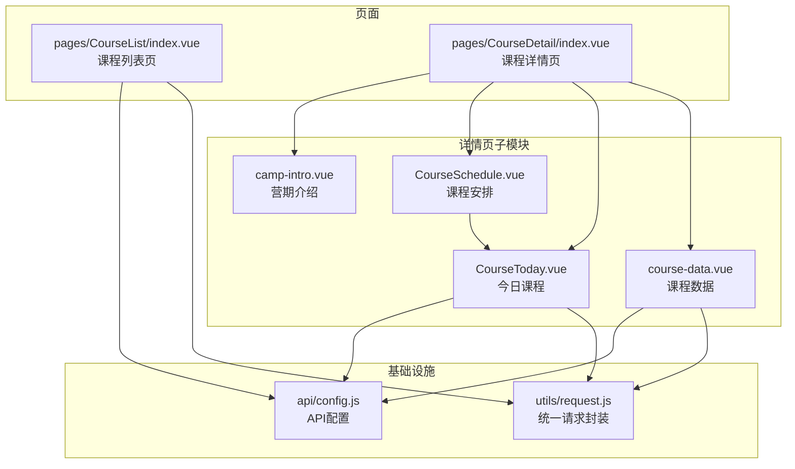
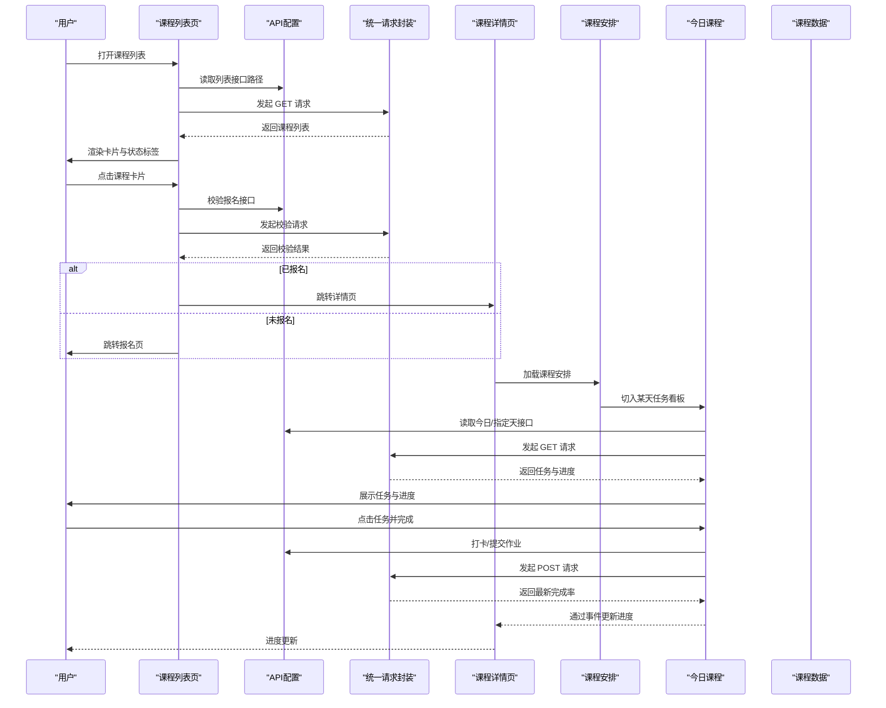
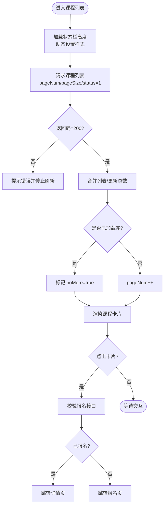
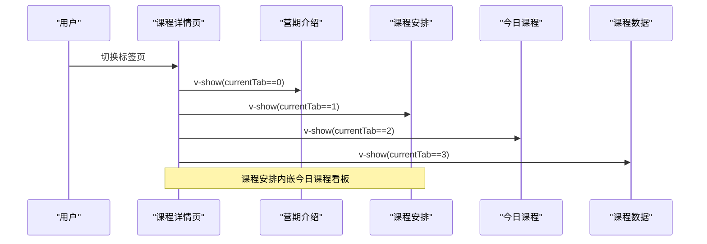
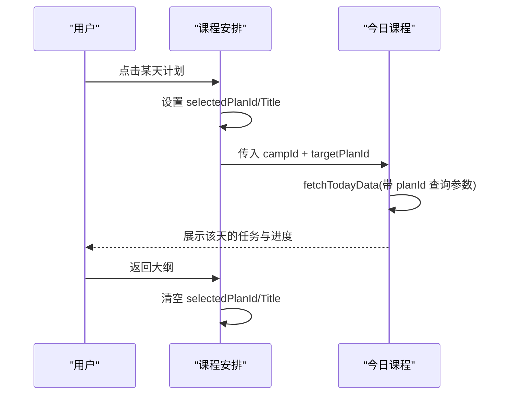
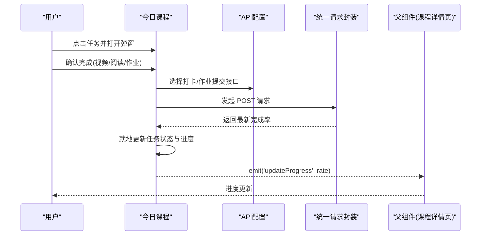
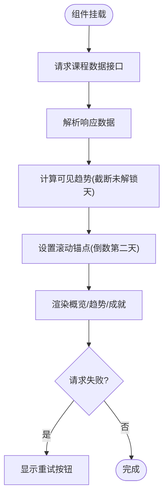
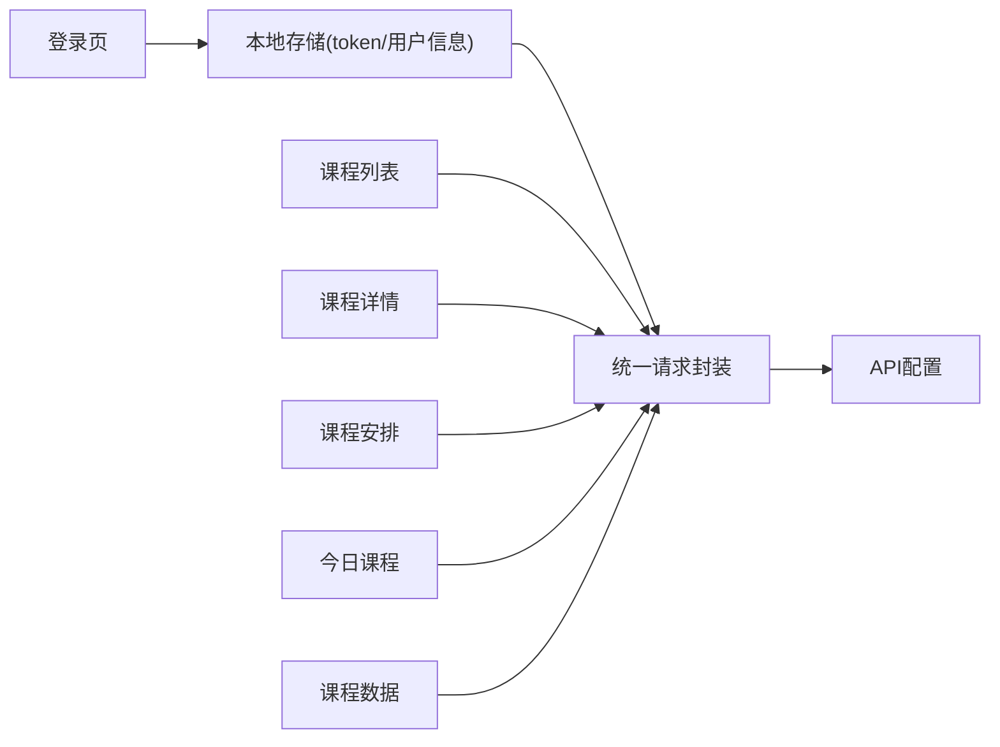

# 学习中心系统

<cite>
**本文引用的文件**
- [pages/CourseList/index.vue](file://pages/CourseList/index.vue)
- [pages/CourseDetail/index.vue](file://pages/CourseDetail/index.vue)
- [pages/CourseDetail/components/course-data.vue](file://pages/CourseDetail/components/course-data.vue)
- [pages/CourseDetail/components/CourseToday.vue](file://pages/CourseDetail/components/CourseToday.vue)
- [pages/CourseDetail/components/CourseSchedule.vue](file://pages/CourseDetail/components/CourseSchedule.vue)
- [pages/CourseDetail/components/camp-intro.vue](file://pages/CourseDetail/components/camp-intro.vue)
- [api/config.js](file://api/config.js)
- [utils/request.js](file://utils/request.js)
- [doc/CourseToday_Module_Analysis.md](file://doc/CourseToday_Module_Analysis.md)
- [doc/course-data组件分析报告.md](file://doc/course-data组件分析报告.md)
- [doc/CourseToday打卡逻辑分析报告.md](file://doc/CourseToday打卡逻辑分析报告.md)
- [pages/Login/index.vue](file://pages/Login/index.vue)
- [main.js](file://main.js)
</cite>

## 目录
1. [简介](#简介)
2. [项目结构](#项目结构)
3. [核心组件](#核心组件)
4. [架构总览](#架构总览)
5. [详细组件分析](#详细组件分析)
6. [依赖关系分析](#依赖关系分析)
7. [性能考量](#性能考量)
8. [故障排查指南](#故障排查指南)
9. [结论](#结论)
10. [附录](#附录)

## 简介
本文件面向“致良知教育”项目的学习中心系统，围绕课程列表页、课程详情页及其子模块进行系统化技术文档说明。内容涵盖：
- 课程列表页的筛选、排序与展示逻辑
- 课程详情页的模块化架构、数据绑定与交互流程
- 课程数据看板（学习趋势、完成率、成就）的设计与实现
- 今日课程任务的打卡机制、学习进度跟踪与状态管理
- 学习路径规划、进度计算算法与完成状态管理
- 用户认证系统集成与数据同步机制

## 项目结构
学习中心系统主要由页面与组件构成，采用基于页面的组织方式，课程详情页作为承载多个子模块的容器，子模块通过 props 与事件进行解耦协作。

**图表来源**
- [pages/CourseList/index.vue:1-433](file://pages/CourseList/index.vue#L1-L433)
- [pages/CourseDetail/index.vue:1-384](file://pages/CourseDetail/index.vue#L1-L384)
- [pages/CourseDetail/components/CourseSchedule.vue:1-605](file://pages/CourseDetail/components/CourseSchedule.vue#L1-L605)
- [pages/CourseDetail/components/CourseToday.vue:1-660](file://pages/CourseDetail/components/CourseToday.vue#L1-L660)
- [pages/CourseDetail/components/course-data.vue:1-573](file://pages/CourseDetail/components/course-data.vue#L1-L573)
- [api/config.js:1-60](file://api/config.js#L1-L60)
- [utils/request.js:1-98](file://utils/request.js#L1-L98)

**章节来源**
- [pages/CourseList/index.vue:1-433](file://pages/CourseList/index.vue#L1-L433)
- [pages/CourseDetail/index.vue:1-384](file://pages/CourseDetail/index.vue#L1-L384)
- [api/config.js:1-60](file://api/config.js#L1-L60)
- [utils/request.js:1-98](file://utils/request.js#L1-L98)

## 核心组件
- 课程列表页：负责课程卡片渲染、状态标签、分页加载与跳转逻辑
- 课程详情页：作为容器页，承载“营期介绍”“课程安排”“今日课程”“课程数据”四个模块
- 课程安排模块：提供大纲时间轴与日计划切换，内嵌今日课程看板
- 今日课程模块：任务列表、弹窗详情、打卡提交、进度更新
- 课程数据模块：完成率、天数统计、学习趋势柱状图、成就列表

**章节来源**
- [pages/CourseList/index.vue:80-254](file://pages/CourseList/index.vue#L80-L254)
- [pages/CourseDetail/index.vue:67-146](file://pages/CourseDetail/index.vue#L67-L146)
- [pages/CourseDetail/components/CourseSchedule.vue:124-212](file://pages/CourseDetail/components/CourseSchedule.vue#L124-L212)
- [pages/CourseDetail/components/CourseToday.vue:186-379](file://pages/CourseDetail/components/CourseToday.vue#L186-L379)
- [pages/CourseDetail/components/course-data.vue:102-214](file://pages/CourseDetail/components/course-data.vue#L102-L214)

## 架构总览
系统采用“页面 + 组件”分层架构，页面负责生命周期与路由，组件负责具体业务与数据绑定。统一请求封装负责鉴权与错误处理，API 配置集中管理后端接口。

**图表来源**
- [pages/CourseList/index.vue:175-196](file://pages/CourseList/index.vue#L175-L196)
- [pages/CourseDetail/index.vue:127-139](file://pages/CourseDetail/index.vue#L127-L139)
- [pages/CourseDetail/components/CourseSchedule.vue:181-202](file://pages/CourseDetail/components/CourseSchedule.vue#L181-L202)
- [pages/CourseDetail/components/CourseToday.vue:216-242](file://pages/CourseDetail/components/CourseToday.vue#L216-L242)
- [api/config.js:52-56](file://api/config.js#L52-L56)
- [utils/request.js:7-67](file://utils/request.js#L7-L67)

## 详细组件分析

### 课程列表页（课程筛选、排序与展示）
- 状态标签与按钮：根据课程状态、起止时间动态生成“未开营/已开营/已结营/看回放/去学习/去报名”
- 时间格式化：对字符串日期进行安全转换与格式化
- 分页加载：支持下拉刷新与上拉加载，控制 loading 与“已经到底啦”状态
- 路由与报名校验：点击卡片前先校验是否已报名，再决定跳转详情或报名页

**图表来源**
- [pages/CourseList/index.vue:242-252](file://pages/CourseList/index.vue#L242-L252)
- [pages/CourseList/index.vue:198-237](file://pages/CourseList/index.vue#L198-L237)
- [pages/CourseList/index.vue:147-169](file://pages/CourseList/index.vue#L147-L169)
- [pages/CourseList/index.vue:175-196](file://pages/CourseList/index.vue#L175-L196)

**章节来源**
- [pages/CourseList/index.vue:80-254](file://pages/CourseList/index.vue#L80-L254)

### 课程详情页（模块化架构与数据绑定）
- 标签页切换：通过 currentTab 控制“营期介绍/课程安排/今日课程/课程数据”的显示
- 视觉辅助：根据营期名称动态生成背景渐变与徽章样式
- 子模块渲染：按需渲染各子模块，避免不必要的初始化

**图表来源**
- [pages/CourseDetail/index.vue:33-57](file://pages/CourseDetail/index.vue#L33-L57)
- [pages/CourseDetail/index.vue:93-108](file://pages/CourseDetail/index.vue#L93-L108)

**章节来源**
- [pages/CourseDetail/index.vue:67-146](file://pages/CourseDetail/index.vue#L67-L146)

### 课程安排模块（学习路径规划与日计划切换）
- 大纲时间轴：模块手风琴展开，模块内日计划按天排列
- 日计划详情：点击某天切入“今日课程”看板，支持返回大纲
- 与今日课程联动：通过 props 传递 campId 与 targetPlanId，实现“查看任意一天”的能力

**图表来源**
- [pages/CourseDetail/components/CourseSchedule.vue:181-202](file://pages/CourseDetail/components/CourseSchedule.vue#L181-L202)
- [pages/CourseDetail/components/CourseToday.vue:224-227](file://pages/CourseDetail/components/CourseToday.vue#L224-L227)

**章节来源**
- [pages/CourseDetail/components/CourseSchedule.vue:124-212](file://pages/CourseDetail/components/CourseSchedule.vue#L124-L212)

### 今日课程模块（打卡机制、学习进度与任务弹窗）
- 任务列表：必修/选修、视频/阅读/作业/额外任务类型，支持查看详情弹窗
- 打卡流程：提交任务或作业，后端返回最新完成率，组件就地更新并向上游发出进度事件
- 通用化改造：支持传入 targetPlanId 查看任意一天的课程，兼容“今日”逻辑

**图表来源**
- [pages/CourseDetail/components/CourseToday.vue:291-352](file://pages/CourseDetail/components/CourseToday.vue#L291-L352)
- [doc/CourseToday打卡逻辑分析报告.md:5-67](file://doc/CourseToday打卡逻辑分析报告.md#L5-L67)
- [doc/CourseToday_Module_Analysis.md:260-335](file://doc/CourseToday_Module_Analysis.md#L260-L335)

**章节来源**
- [pages/CourseDetail/components/CourseToday.vue:186-379](file://pages/CourseDetail/components/CourseToday.vue#L186-L379)
- [doc/CourseToday打卡逻辑分析报告.md:1-175](file://doc/CourseToday打卡逻辑分析报告.md#L1-L175)
- [doc/CourseToday_Module_Analysis.md:1-345](file://doc/CourseToday_Module_Analysis.md#L1-L345)

### 课程数据模块（学习趋势、完成率与成就）
- 数据概览：总完成率、总天数、已完成天数
- 学习趋势：按天渲染柱状图，状态映射到不同样式（完成/漏打卡/未解锁）
- 成就列表：展示图标、标题与描述
- 优化策略：计算属性仅显示可见天数，避免未来未解锁天数影响滚动与布局

**图表来源**
- [pages/CourseDetail/components/course-data.vue:169-199](file://pages/CourseDetail/components/course-data.vue#L169-L199)
- [pages/CourseDetail/components/course-data.vue:123-143](file://pages/CourseDetail/components/course-data.vue#L123-L143)
- [doc/course-data组件分析报告.md:1-162](file://doc/course-data组件分析报告.md#L1-L162)

**章节来源**
- [pages/CourseDetail/components/course-data.vue:102-214](file://pages/CourseDetail/components/course-data.vue#L102-L214)
- [doc/course-data组件分析报告.md:1-162](file://doc/course-data组件分析报告.md#L1-L162)

### 营期介绍模块（文案与排版）
- 缘起与发心、修习次第、适合人群、圣贤寄语等模块化展示
- 与首页风格一致的卡片与装饰元素，提升阅读体验

**章节来源**
- [pages/CourseDetail/components/camp-intro.vue:1-281](file://pages/CourseDetail/components/camp-intro.vue#L1-L281)

## 依赖关系分析
- 统一请求封装：自动注入 Authorization 头，处理 401 与网络异常
- API 配置：集中管理 baseUrl 与各接口路径，便于替换与扩展
- 组件间通信：今日课程通过 emit 事件向上游传递进度，课程详情页聚合展示
- 认证集成：登录页负责存储 token 与用户信息，后续页面通过统一请求自动携带

**图表来源**
- [pages/Login/index.vue:214-222](file://pages/Login/index.vue#L214-L222)
- [utils/request.js:7-67](file://utils/request.js#L7-L67)
- [api/config.js:8-57](file://api/config.js#L8-L57)

**章节来源**
- [pages/Login/index.vue:138-453](file://pages/Login/index.vue#L138-L453)
- [utils/request.js:1-98](file://utils/request.js#L1-L98)
- [api/config.js:1-60](file://api/config.js#L1-L60)

## 性能考量
- 列表渲染：卡片使用动画入场与延迟，提升视觉流畅度
- 滚动优化：课程安排采用独立滚动容器，避免整体滚动阻塞
- 图表渲染：学习趋势通过计算属性截断未解锁天数，减少 DOM 渲染量
- 请求优化：统一请求封装处理 401 自动跳转与网络异常提示，减少重复错误处理

[本节为通用指导，不涉及具体文件分析]

## 故障排查指南
- 登录失效：统一请求封装检测 401 自动清除 token 并跳转登录页
- 网络异常：统一请求封装统一提示“网络连接异常”
- 今日课程无课：弹出空状态提示，引导用户休息或回顾
- 课程数据加载失败：提供重试按钮，点击后重新请求

**章节来源**
- [utils/request.js:24-67](file://utils/request.js#L24-L67)
- [pages/CourseDetail/components/CourseToday.vue:94-98](file://pages/CourseDetail/components/CourseToday.vue#L94-L98)
- [pages/CourseDetail/components/course-data.vue:94-98](file://pages/CourseDetail/components/course-data.vue#L94-L98)

## 结论
学习中心系统通过清晰的页面与组件边界、统一的请求与认证机制，实现了课程列表、课程详情、今日课程与课程数据的完整闭环。今日课程模块的通用化改造使其可查看任意一天的课程，课程数据模块提供了直观的学习趋势与完成率统计。整体架构具备良好的可扩展性与维护性，便于后续迭代与功能扩展。

[本节为总结性内容，不涉及具体文件分析]

## 附录
- 课程列表页：课程筛选、排序与展示逻辑
- 课程详情页：模块化架构与数据绑定
- 今日课程：打卡机制、学习进度跟踪与状态管理
- 课程数据：学习路径规划、进度计算算法与完成状态管理
- 用户认证：登录页与统一请求封装的集成与数据同步

[本节为概览性内容，不涉及具体文件分析]