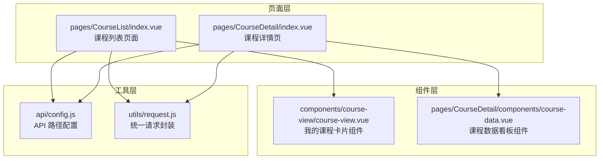
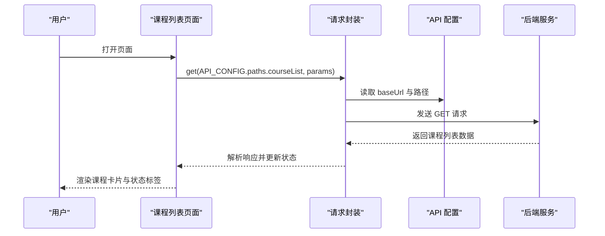
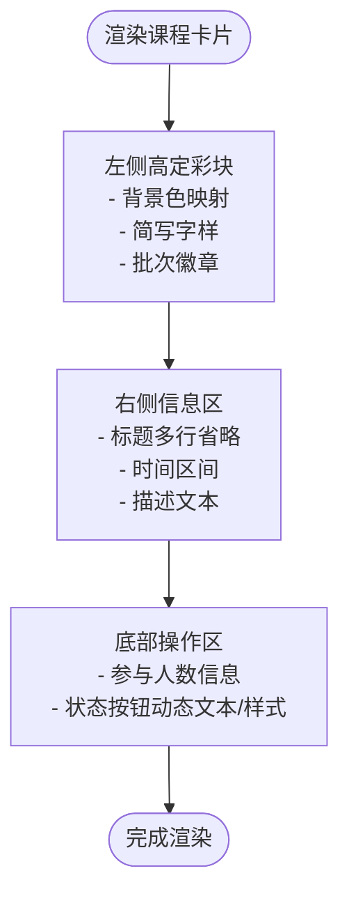
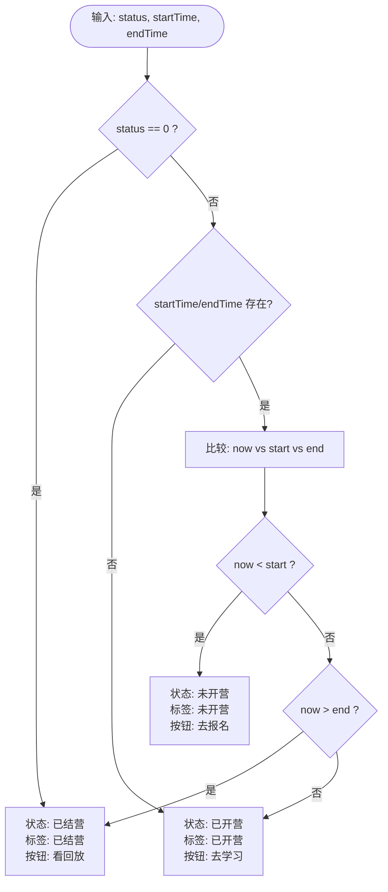
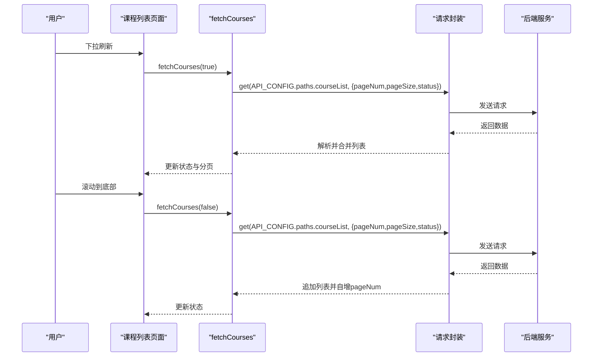
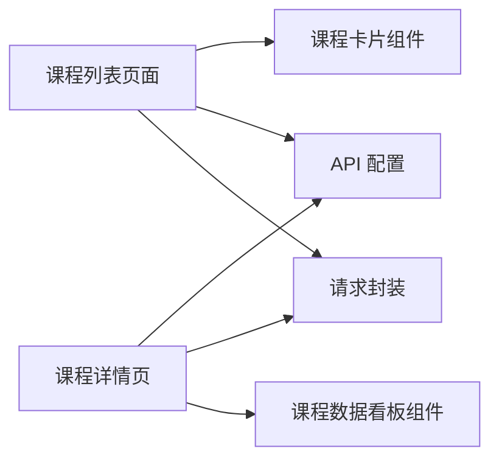

# 课程列表页面

<cite>
**本文引用的文件**
- [pages/CourseList/index.vue](file://pages/CourseList/index.vue)
- [components/course-view/course-view.vue](file://components/course-view/course-view.vue)
- [pages/CourseDetail/components/course-data.vue](file://pages/CourseDetail/components/course-data.vue)
- [api/config.js](file://api/config.js)
- [utils/request.js](file://utils/request.js)
- [pages/CourseDetail/index.vue](file://pages/CourseDetail/index.vue)
- [doc/课程列表与打卡链路代码扫描报告.md](file://doc/课程列表与打卡链路代码扫描报告.md)
- [doc/course-data组件分析报告.md](file://doc/course-data组件分析报告.md)
- [doc/课程报名功能代码扫描报告.md](file://doc/课程报名功能代码扫描报告.md)
</cite>

## 目录
1. [简介](#简介)
2. [项目结构](#项目结构)
3. [核心组件](#核心组件)
4. [架构总览](#架构总览)
5. [详细组件分析](#详细组件分析)
6. [依赖关系分析](#依赖关系分析)
7. [性能考量](#性能考量)
8. [故障排查指南](#故障排查指南)
9. [结论](#结论)
10. [附录](#附录)

## 简介
本文件面向致良知教育项目的“课程列表页面”，聚焦于课程卡片的设计实现、状态标签系统、布局结构、状态机业务逻辑、分页加载与刷新机制、筛选条件、数据格式化与错误处理策略，并提供性能优化与用户体验设计建议。文档基于仓库中的实际代码进行分析，确保内容可追溯至具体文件与行号。

## 项目结构
课程列表页面位于页面目录下，采用标准 UniApp 页面结构；课程卡片组件在组件目录中复用，课程详情页承载课程数据看板组件。API 配置与请求封装分别位于 api 与 utils 目录，便于统一管理与跨页面复用。

**图表来源**
- [pages/CourseList/index.vue:1-433](file://pages/CourseList/index.vue#L1-L433)
- [components/course-view/course-view.vue:1-496](file://components/course-view/course-view.vue#L1-L496)
- [pages/CourseDetail/components/course-data.vue:1-573](file://pages/CourseDetail/components/course-data.vue#L1-L573)
- [api/config.js:1-60](file://api/config.js#L1-L60)
- [utils/request.js:1-98](file://utils/request.js#L1-L98)

**章节来源**
- [pages/CourseList/index.vue:1-433](file://pages/CourseList/index.vue#L1-L433)
- [components/course-view/course-view.vue:1-496](file://components/course-view/course-view.vue#L1-L496)
- [pages/CourseDetail/components/course-data.vue:1-573](file://pages/CourseDetail/components/course-data.vue#L1-L573)
- [api/config.js:1-60](file://api/config.js#L1-L60)
- [utils/request.js:1-98](file://utils/request.js#L1-L98)

## 核心组件
- 课程列表页面（pages/CourseList/index.vue）：负责渲染课程卡片、状态标签、分页加载、下拉刷新与上拉加载、按钮文本动态生成等。
- 我的课程卡片组件（components/course-view/course-view.vue）：用于“我的课程”页面，展示学习进度、状态徽章与操作按钮。
- 课程数据看板组件（pages/CourseDetail/components/course-data.vue）：课程详情页中的学习趋势与成就展示，包含计算属性与滚动锚点逻辑。
- API 配置（api/config.js）：集中管理 API 基础地址与各接口路径。
- 请求封装（utils/request.js）：统一封装 GET/POST 请求、Token 注入与错误处理。

**章节来源**
- [pages/CourseList/index.vue:80-254](file://pages/CourseList/index.vue#L80-L254)
- [components/course-view/course-view.vue:93-224](file://components/course-view/course-view.vue#L93-L224)
- [pages/CourseDetail/components/course-data.vue:102-214](file://pages/CourseDetail/components/course-data.vue#L102-L214)
- [api/config.js:8-57](file://api/config.js#L8-L57)
- [utils/request.js:7-95](file://utils/request.js#L7-L95)

## 架构总览
课程列表页面采用“页面 + 组件 + 工具”的分层架构：
- 页面层：负责生命周期、状态管理、分页与刷新控制、导航跳转。
- 组件层：复用课程卡片与数据看板，降低重复逻辑。
- 工具层：统一 API 配置与请求封装，保证一致性与可维护性。

**图表来源**
- [pages/CourseList/index.vue:198-237](file://pages/CourseList/index.vue#L198-L237)
- [utils/request.js:7-95](file://utils/request.js#L7-L95)
- [api/config.js:16-28](file://api/config.js#L16-L28)

## 详细组件分析

### 课程卡片设计与布局结构
课程卡片采用“左侧高定彩块 + 右侧信息区域 + 底部操作按钮”的三段式布局：
- 左侧高定彩块：根据营期名称映射渐变背景色，展示简写字样与批次徽章，营造视觉焦点。
- 右侧信息区：标题、时间区间、描述文本，采用多行省略与 emoji 图标增强可读性。
- 底部操作区：参与人数信息与状态按钮，按钮文本与样式随状态动态变化。

**图表来源**
- [pages/CourseList/index.vue:21-61](file://pages/CourseList/index.vue#L21-L61)
- [pages/CourseList/index.vue:345-419](file://pages/CourseList/index.vue#L345-L419)

**章节来源**
- [pages/CourseList/index.vue:21-61](file://pages/CourseList/index.vue#L21-L61)
- [pages/CourseList/index.vue:345-419](file://pages/CourseList/index.vue#L345-L419)

### 状态标签系统与状态机逻辑
课程状态机根据课程的 status、startTime、endTime 与当前时间进行联合判断，输出状态标签与按钮文本：
- 已结营：当 status 为 0 或 endTime 小于当前时间。
- 未开营：startTime 大于当前时间。
- 已开营：其他情况（包含 startTime/endTime 缺失时也视为已开营）。

**图表来源**
- [pages/CourseList/index.vue:147-169](file://pages/CourseList/index.vue#L147-L169)

**章节来源**
- [pages/CourseList/index.vue:147-169](file://pages/CourseList/index.vue#L147-L169)

### 分页加载、下拉刷新与上拉加载
- 分页参数：pageNum、pageSize、total 控制分页与总数。
- 下拉刷新：onPullDownRefresh 触发 fetchCourses(true)，重置 pageNum 与 isNoMore。
- 上拉加载：onReachBottom 触发 fetchCourses(false)，追加数据并自增 pageNum。
- 状态控制：isFetching 防抖，isLoading 控制首次加载状态，isNoMore 控制“已经到底啦”。

**图表来源**
- [pages/CourseList/index.vue:198-237](file://pages/CourseList/index.vue#L198-L237)
- [utils/request.js:72-95](file://utils/request.js#L72-L95)
- [api/config.js:28](file://api/config.js#L28)

**章节来源**
- [pages/CourseList/index.vue:198-237](file://pages/CourseList/index.vue#L198-L237)
- [utils/request.js:72-95](file://utils/request.js#L72-L95)
- [api/config.js:28](file://api/config.js#L28)

### 课程筛选条件与数据格式化
- 筛选条件：status=1（仅展示“进行中”课程）。
- 数据格式化：时间格式化函数支持字符串与日期对象，缺失或非法时间返回“待定”。
- 营期名称提取：从包含“【】”的名称中剥离前缀，取前若干字符作为简写字样。
- 背景色映射：根据营期名称关键字映射到预设渐变色。

**章节来源**
- [pages/CourseList/index.vue:206-210](file://pages/CourseList/index.vue#L206-L210)
- [pages/CourseList/index.vue:129-142](file://pages/CourseList/index.vue#L129-L142)
- [pages/CourseList/index.vue:114-127](file://pages/CourseList/index.vue#L114-L127)
- [pages/CourseList/index.vue:101-108](file://pages/CourseList/index.vue#L101-L108)

### 错误处理策略
- 统一请求封装：自动注入 Token，处理 401 未授权、4xx 错误与网络异常，统一提示。
- 页面级错误：课程列表在请求失败时提示消息；空状态与加载状态分别渲染。
- 组件级错误：课程数据看板在数据加载失败时提供重试入口。

**章节来源**
- [utils/request.js:24-67](file://utils/request.js#L24-L67)
- [pages/CourseList/index.vue:226-236](file://pages/CourseList/index.vue#L226-L236)
- [pages/CourseDetail/components/course-data.vue:94-98](file://pages/CourseDetail/components/course-data.vue#L94-L98)

### 课程详情页联动与导航
- 课程列表点击卡片后，先调用报名核验接口，再根据结果跳转至课程详情或报名页面。
- 课程详情页包含“营期介绍、课程安排、今日课程、课程数据”四个模块，其中课程数据模块使用计算属性截断未来未解锁天数并设置滚动锚点。

**章节来源**
- [pages/CourseList/index.vue:175-196](file://pages/CourseList/index.vue#L175-L196)
- [pages/CourseDetail/index.vue:48-57](file://pages/CourseDetail/index.vue#L48-L57)
- [pages/CourseDetail/components/course-data.vue:123-166](file://pages/CourseDetail/components/course-data.vue#L123-L166)

## 依赖关系分析
- 页面依赖：课程列表页面依赖 API 配置与请求封装；课程详情页依赖课程数据看板组件。
- 组件复用：课程卡片组件在“我的课程”页面复用，减少重复逻辑。
- 数据流：页面通过请求封装获取数据，组件内部通过 props 与计算属性进行数据处理。

**图表来源**
- [pages/CourseList/index.vue:80-84](file://pages/CourseList/index.vue#L80-L84)
- [pages/CourseDetail/index.vue:70-75](file://pages/CourseDetail/index.vue#L70-L75)
- [api/config.js:16-56](file://api/config.js#L16-L56)
- [utils/request.js:7-95](file://utils/request.js#L7-L95)

**章节来源**
- [pages/CourseList/index.vue:80-84](file://pages/CourseList/index.vue#L80-L84)
- [pages/CourseDetail/index.vue:70-75](file://pages/CourseDetail/index.vue#L70-L75)
- [api/config.js:16-56](file://api/config.js#L16-L56)
- [utils/request.js:7-95](file://utils/request.js#L7-L95)

## 性能考量
- 列表渲染优化：使用 v-for 渲染，配合动画延迟 stagger，提升首屏体验。
- 状态控制：isFetching 防抖避免重复请求；isNoMore 控制“已经到底啦”提示，减少无效请求。
- 数据截断：课程数据看板使用计算属性截断未来未解锁天数，避免渲染过多节点。
- 滚动锚点：通过 nextTick 与 scroll-into-view 设置滚动锚点，减少 DOM 操作开销。
- 资源加载：图片与图标采用懒加载策略（如适用），避免阻塞主线程。

[本节为通用性能建议，不直接分析具体文件，故无章节来源]

## 故障排查指南
- 登录过期：统一请求封装检测 401，清除 Token 并跳转登录页。
- 网络异常：请求失败统一提示“网络连接异常”，检查网络与代理。
- 数据为空：课程列表空状态渲染“当前暂无开放营期”，检查后端返回与筛选条件。
- 课程详情数据失败：课程数据看板提供“点击重试”入口，重新拉取数据。
- 报名流程：报名页面对 Token、campId、重复报名进行前置校验，400 错误时建议后端返回具体原因。

**章节来源**
- [utils/request.js:29-43](file://utils/request.js#L29-L43)
- [pages/CourseList/index.vue:226-236](file://pages/CourseList/index.vue#L226-L236)
- [pages/CourseDetail/components/course-data.vue:94-98](file://pages/CourseDetail/components/course-data.vue#L94-L98)
- [doc/课程报名功能代码扫描报告.md:19-64](file://doc/课程报名功能代码扫描报告.md#L19-L64)

## 结论
课程列表页面通过清晰的状态机、稳定的分页与刷新机制、统一的请求封装与错误处理，实现了良好的用户体验。课程卡片的视觉设计与交互细节体现了致良知教育的品牌风格。建议在后续迭代中进一步完善课程列表与打卡链路的实时刷新机制，提升数据一致性与用户感知。

[本节为总结性内容，不直接分析具体文件，故无章节来源]

## 附录
- API 配置路径：课程列表、课程详情、报名核验、报名接口、课程数据等。
- 请求封装：GET/POST 快捷方法，自动注入 Token，统一错误处理。
- 课程数据看板：计算属性截断未来天数，滚动锚点优化体验。

**章节来源**
- [api/config.js:16-56](file://api/config.js#L16-L56)
- [utils/request.js:72-95](file://utils/request.js#L72-L95)
- [pages/CourseDetail/components/course-data.vue:123-166](file://pages/CourseDetail/components/course-data.vue#L123-L166)