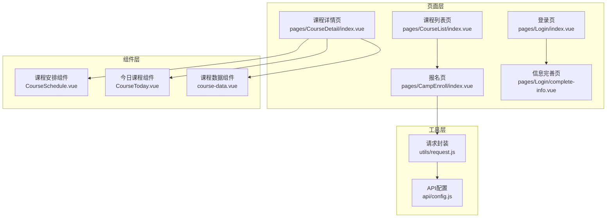
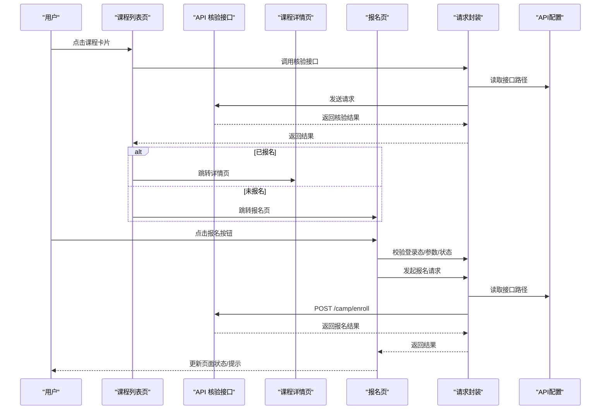
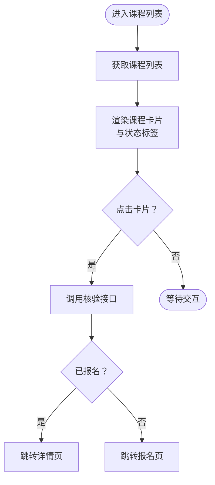
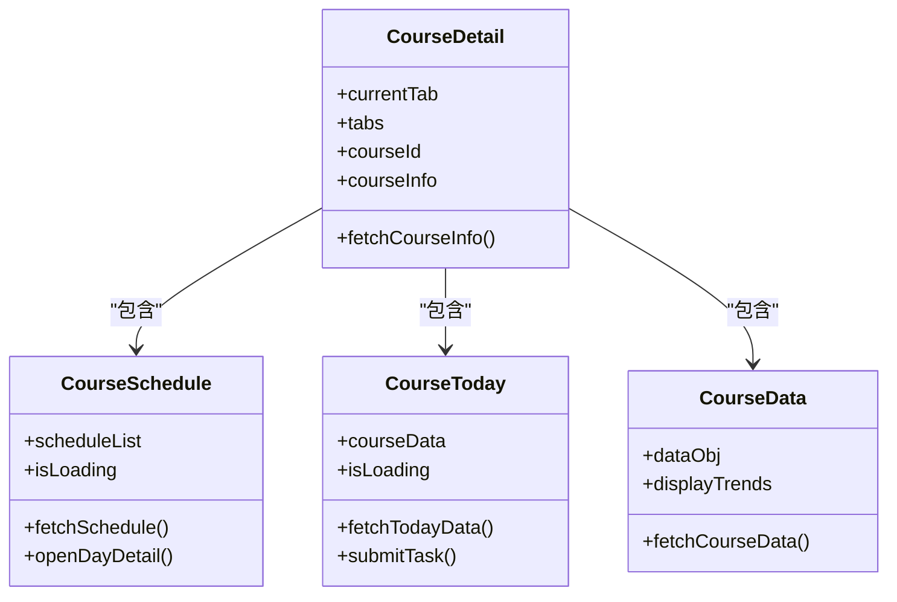
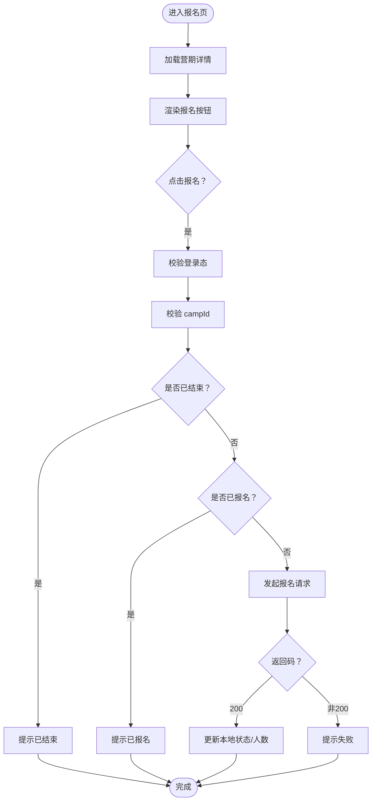
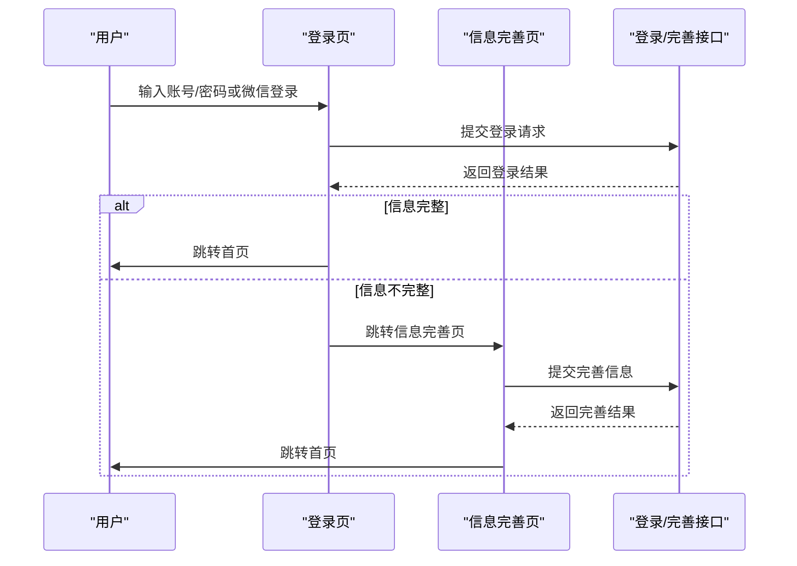
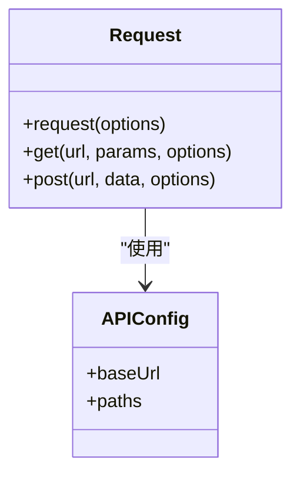
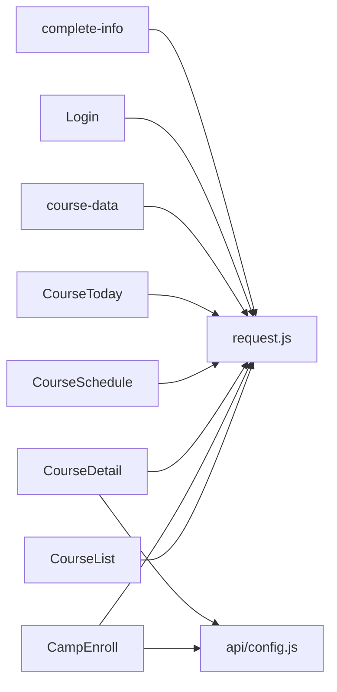

# 课程报名系统

<cite>
**本文档引用的文件**
- [pages/CourseList/index.vue](file://pages/CourseList/index.vue)
- [pages/CourseDetail/index.vue](file://pages/CourseDetail/index.vue)
- [pages/CourseDetail/components/CourseSchedule.vue](file://pages/CourseDetail/components/CourseSchedule.vue)
- [pages/CourseDetail/components/CourseToday.vue](file://pages/CourseDetail/components/CourseToday.vue)
- [pages/CourseDetail/components/course-data.vue](file://pages/CourseDetail/components/course-data.vue)
- [pages/CampEnroll/index.vue](file://pages/CampEnroll/index.vue)
- [pages/Login/index.vue](file://pages/Login/index.vue)
- [pages/Login/complete-info.vue](file://pages/Login/complete-info.vue)
- [utils/request.js](file://utils/request.js)
- [api/config.js](file://api/config.js)
- [doc/课程报名功能代码扫描报告.md](file://doc/课程报名功能代码扫描报告.md)
- [doc/课程报名页面最新代码扫描报告.md](file://doc/课程报名页面最新代码扫描报告.md)
- [doc/课程报名400错误完整排查报告.md](file://doc/课程报名400错误完整排查报告.md)
</cite>

## 目录
1. [简介](#简介)
2. [项目结构](#项目结构)
3. [核心组件](#核心组件)
4. [架构总览](#架构总览)
5. [详细组件分析](#详细组件分析)
6. [依赖关系分析](#依赖关系分析)
7. [性能考虑](#性能考虑)
8. [故障排查指南](#故障排查指南)
9. [结论](#结论)

## 简介
本项目为致良知教育的课程报名系统，围绕「课程列表」、「课程详情」、「报名页面」三大核心页面，构建了完整的报名流程闭环。系统采用 uni-app 框架，结合 Vue 3 Composition API，实现了从课程查询、报名资格验证、用户信息完善到报名确认的全流程体验，并提供了与课程列表页面的联动机制、安全防护与用户体验优化。

## 项目结构
项目采用按页面组织的结构，核心报名流程涉及以下关键页面与模块：
- 课程列表页：展示课程卡片、状态标识与报名入口
- 课程详情页：包含课程介绍、课程安排、今日课程、课程数据等模块
- 报名页：展示营期详情、报名按钮与状态控制
- 登录与信息完善：保障用户身份与必要信息的完整性
- 请求封装与 API 配置：统一封装网络请求与接口路径

图表来源
- [pages/CourseList/index.vue:1-433](file://pages/CourseList/index.vue#L1-L433)
- [pages/CourseDetail/index.vue:1-384](file://pages/CourseDetail/index.vue#L1-L384)
- [pages/CourseDetail/components/CourseSchedule.vue:1-605](file://pages/CourseDetail/components/CourseSchedule.vue#L1-L605)
- [pages/CourseDetail/components/CourseToday.vue:1-660](file://pages/CourseDetail/components/CourseToday.vue#L1-L660)
- [pages/CourseDetail/components/course-data.vue:1-573](file://pages/CourseDetail/components/course-data.vue#L1-L573)
- [pages/CampEnroll/index.vue:1-508](file://pages/CampEnroll/index.vue#L1-L508)
- [pages/Login/index.vue:1-900](file://pages/Login/index.vue#L1-L900)
- [pages/Login/complete-info.vue:1-694](file://pages/Login/complete-info.vue#L1-L694)
- [utils/request.js:1-98](file://utils/request.js#L1-L98)
- [api/config.js:1-60](file://api/config.js#L1-L60)

章节来源
- [pages/CourseList/index.vue:1-433](file://pages/CourseList/index.vue#L1-L433)
- [pages/CourseDetail/index.vue:1-384](file://pages/CourseDetail/index.vue#L1-L384)
- [pages/CampEnroll/index.vue:1-508](file://pages/CampEnroll/index.vue#L1-L508)
- [pages/Login/index.vue:1-900](file://pages/Login/index.vue#L1-L900)
- [pages/Login/complete-info.vue:1-694](file://pages/Login/complete-info.vue#L1-L694)
- [utils/request.js:1-98](file://utils/request.js#L1-L98)
- [api/config.js:1-60](file://api/config.js#L1-L60)

## 核心组件
- 课程列表页：负责展示课程卡片、状态判断与跳转控制，点击卡片后先进行报名身份核验，再决定跳转至课程详情或报名页。
- 课程详情页：承载课程介绍、课程安排、今日课程、课程数据等模块，为用户提供学习路径与进度可视化。
- 报名页：展示营期详情、报名按钮与状态控制，包含登录态校验、重复报名拦截与基于时间的结束判断。
- 登录与信息完善：保障用户身份有效性与必要信息完整性，避免报名流程中断。
- 请求封装与 API 配置：统一封装 Token 注入、错误处理与接口路径，降低耦合度。

章节来源
- [pages/CourseList/index.vue:147-196](file://pages/CourseList/index.vue#L147-L196)
- [pages/CourseDetail/index.vue:67-146](file://pages/CourseDetail/index.vue#L67-L146)
- [pages/CampEnroll/index.vue:144-292](file://pages/CampEnroll/index.vue#L144-L292)
- [pages/Login/index.vue:138-454](file://pages/Login/index.vue#L138-L454)
- [pages/Login/complete-info.vue:138-376](file://pages/Login/complete-info.vue#L138-L376)
- [utils/request.js:7-67](file://utils/request.js#L7-L67)
- [api/config.js:8-57](file://api/config.js#L8-L57)

## 架构总览
课程报名系统遵循「页面-组件-工具」三层架构，页面负责业务编排，组件负责功能复用，工具负责基础设施。整体流程如下：
- 用户在课程列表页点击课程卡片，系统先调用报名身份核验接口，根据返回状态决定跳转详情页或报名页。
- 报名页在加载时获取营期详情，渲染报名按钮与状态，用户点击后进行多层校验（登录态、campId、状态拦截、重复报名、防重复提交），通过后发起报名请求。
- 登录与信息完善页面确保用户具备有效身份与必要信息，避免后续流程阻塞。
- 请求封装统一处理 Token 注入与错误处理，API 配置集中管理接口路径。

图表来源
- [pages/CourseList/index.vue:175-196](file://pages/CourseList/index.vue#L175-L196)
- [pages/CampEnroll/index.vue:239-292](file://pages/CampEnroll/index.vue#L239-L292)
- [utils/request.js:7-67](file://utils/request.js#L7-L67)
- [api/config.js:28-31](file://api/config.js#L28-L31)

章节来源
- [pages/CourseList/index.vue:175-196](file://pages/CourseList/index.vue#L175-L196)
- [pages/CampEnroll/index.vue:239-292](file://pages/CampEnroll/index.vue#L239-L292)
- [utils/request.js:7-67](file://utils/request.js#L7-L67)
- [api/config.js:28-31](file://api/config.js#L28-L31)

## 详细组件分析

### 课程列表页（CourseList）
- 状态判断：根据课程状态与时间动态渲染「已结营」「未开营」「已开营」「去学习」「去报名」「看回放」等标签与按钮。
- 跳转逻辑：点击卡片先调用核验接口，若已报名则跳转详情页，否则跳转报名页。
- 分页与加载：支持下拉刷新与上拉加载，控制加载状态与「已经到底啦」提示。

图表来源
- [pages/CourseList/index.vue:175-196](file://pages/CourseList/index.vue#L175-L196)
- [pages/CourseList/index.vue:147-169](file://pages/CourseList/index.vue#L147-L169)

章节来源
- [pages/CourseList/index.vue:147-196](file://pages/CourseList/index.vue#L147-L196)

### 课程详情页（CourseDetail）
- 模块化设计：课程介绍、课程安排、今日课程、课程数据四大模块，通过标签页切换。
- 课程安排：支持展开/折叠模块，点击某天进入「今日课程」详情视图。
- 今日课程：展示当日任务、进度与完成状态，支持视频/阅读/作业等任务类型。
- 课程数据：展示学习趋势、完成率与成就等数据。

图表来源
- [pages/CourseDetail/index.vue:67-146](file://pages/CourseDetail/index.vue#L67-L146)
- [pages/CourseDetail/components/CourseSchedule.vue:124-212](file://pages/CourseDetail/components/CourseSchedule.vue#L124-L212)
- [pages/CourseDetail/components/CourseToday.vue:186-379](file://pages/CourseDetail/components/CourseToday.vue#L186-L379)
- [pages/CourseDetail/components/course-data.vue:102-214](file://pages/CourseDetail/components/course-data.vue#L102-L214)

章节来源
- [pages/CourseDetail/index.vue:67-146](file://pages/CourseDetail/index.vue#L67-L146)
- [pages/CourseDetail/components/CourseSchedule.vue:124-212](file://pages/CourseDetail/components/CourseSchedule.vue#L124-L212)
- [pages/CourseDetail/components/CourseToday.vue:186-379](file://pages/CourseDetail/components/CourseToday.vue#L186-L379)
- [pages/CourseDetail/components/course-data.vue:102-214](file://pages/CourseDetail/components/course-data.vue#L102-L214)

### 报名页（CampEnroll）
- 登录态校验：若未登录，提示并跳转登录页。
- 参数校验：campId 必填，重复报名拦截，防重复提交。
- 状态拦截：基于时间的结束判断（isCampEnded），避免过期营期报名。
- 报名请求：调用 /camp/enroll 接口，成功后更新本地状态与人数。
- UI 状态：按钮根据 isEnrolled 与 isCampEnded 动态禁用与文案切换。

图表来源
- [pages/CampEnroll/index.vue:239-292](file://pages/CampEnroll/index.vue#L239-L292)
- [pages/CampEnroll/index.vue:73-79](file://pages/CampEnroll/index.vue#L73-L79)

章节来源
- [pages/CampEnroll/index.vue:144-292](file://pages/CampEnroll/index.vue#L144-L292)

### 登录与信息完善（Login/complete-info）
- 登录页：支持账号密码与微信登录，同意协议后方可登录，登录成功后根据用户信息完整性决定跳转首页或信息完善页。
- 信息完善页：收集手机号、性别、生日、地域、职业等必要信息，完成后写入缓存并跳转首页。

图表来源
- [pages/Login/index.vue:138-454](file://pages/Login/index.vue#L138-L454)
- [pages/Login/complete-info.vue:138-376](file://pages/Login/complete-info.vue#L138-L376)

章节来源
- [pages/Login/index.vue:138-454](file://pages/Login/index.vue#L138-L454)
- [pages/Login/complete-info.vue:138-376](file://pages/Login/complete-info.vue#L138-L376)

### 请求封装与 API 配置（request/config）
- 统一请求封装：自动注入 Token，处理 401 未授权与网络异常，统一返回 Promise。
- API 配置：集中管理 baseUrl 与各接口路径，便于维护与替换。

图表来源
- [utils/request.js:7-98](file://utils/request.js#L7-L98)
- [api/config.js:8-57](file://api/config.js#L8-L57)

章节来源
- [utils/request.js:7-98](file://utils/request.js#L7-L98)
- [api/config.js:8-57](file://api/config.js#L8-L57)

## 依赖关系分析
- 页面依赖：课程列表页依赖核验接口与路由跳转；报名页依赖请求封装与 API 配置；课程详情页依赖多个子组件与请求封装。
- 组件依赖：课程详情页内的课程安排、今日课程、课程数据组件相互独立，通过 props 传递 campId 实现解耦。
- 工具依赖：请求封装依赖 API 配置，统一处理 Token 与错误；API 配置集中管理接口路径。

图表来源
- [pages/CourseList/index.vue:83-84](file://pages/CourseList/index.vue#L83-L84)
- [pages/CampEnroll/index.vue:147-148](file://pages/CampEnroll/index.vue#L147-L148)
- [pages/CourseDetail/index.vue:70-71](file://pages/CourseDetail/index.vue#L70-L71)
- [pages/CourseDetail/components/CourseSchedule.vue:126-129](file://pages/CourseDetail/components/CourseSchedule.vue#L126-L129)
- [pages/CourseDetail/components/CourseToday.vue:188-189](file://pages/CourseDetail/components/CourseToday.vue#L188-L189)
- [pages/CourseDetail/components/course-data.vue:104-105](file://pages/CourseDetail/components/course-data.vue#L104-L105)
- [pages/Login/index.vue:139](file://pages/Login/index.vue#L139)
- [pages/Login/complete-info.vue:139](file://pages/Login/complete-info.vue#L139)
- [utils/request.js:1-1](file://utils/request.js#L1-L1)
- [api/config.js:1-1](file://api/config.js#L1-L1)

章节来源
- [pages/CourseList/index.vue:83-84](file://pages/CourseList/index.vue#L83-L84)
- [pages/CampEnroll/index.vue:147-148](file://pages/CampEnroll/index.vue#L147-L148)
- [pages/CourseDetail/index.vue:70-71](file://pages/CourseDetail/index.vue#L70-L71)
- [pages/CourseDetail/components/CourseSchedule.vue:126-129](file://pages/CourseDetail/components/CourseSchedule.vue#L126-L129)
- [pages/CourseDetail/components/CourseToday.vue:188-189](file://pages/CourseDetail/components/CourseToday.vue#L188-L189)
- [pages/CourseDetail/components/course-data.vue:104-105](file://pages/CourseDetail/components/course-data.vue#L104-L105)
- [pages/Login/index.vue:139](file://pages/Login/index.vue#L139)
- [pages/Login/complete-info.vue:139](file://pages/Login/complete-info.vue#L139)
- [utils/request.js:1-1](file://utils/request.js#L1-L1)
- [api/config.js:1-1](file://api/config.js#L1-L1)

## 性能考虑
- 列表懒加载：课程列表支持分页加载，避免一次性渲染大量数据。
- 组件懒加载：课程详情页的模块组件按需加载，减少首屏压力。
- 防抖与节流：在频繁交互场景（如滚动、输入）中，合理使用节流/防抖提升流畅度。
- 缓存策略：登录态与用户信息通过本地存储缓存，减少重复请求。
- 图片与视频：对图片与视频资源进行压缩与懒加载，降低带宽占用。

## 故障排查指南
- 400 错误排查：根据文档分析，当前返回 400 的错误信息在后端代码中未直接出现，建议在后端仓库中搜索「当前营期不可报名」，并确认抛出位置、日志堆栈与数据库状态字段。
- 前端自查：确认 campId 来源、isCampEnded 计算逻辑、按钮状态渲染与请求路径无 api/ 前缀。
- 登录态问题：若出现 401 未授权，请求封装会自动清除 Token 并跳转登录页，需检查 Token 是否过期或被篡改。
- 网络异常：统一错误处理会提示网络连接异常，建议检查网络状态与代理设置。

章节来源
- [doc/课程报名400错误完整排查报告.md:1-372](file://doc/课程报名400错误完整排查报告.md#L1-L372)
- [utils/request.js:29-44](file://utils/request.js#L29-L44)

## 结论
课程报名系统通过清晰的页面与组件划分、完善的请求封装与 API 配置，构建了稳定可靠的报名流程。系统在状态判断、防重复提交、登录态校验与错误处理方面均有明确实现，并通过文档化的排查流程为后续维护与扩展提供了坚实基础。建议持续关注后端接口的错误信息细化与前端拦截策略的完善，以进一步提升用户体验与系统稳定性。