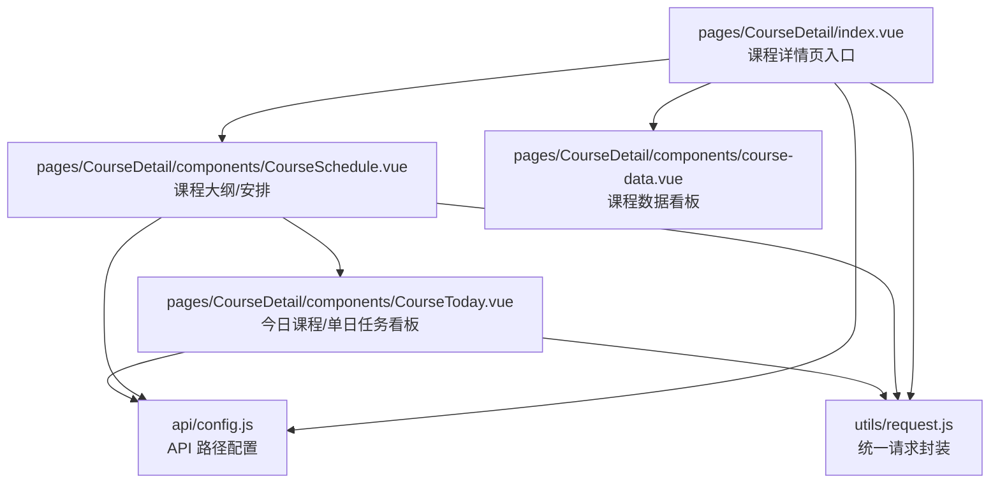
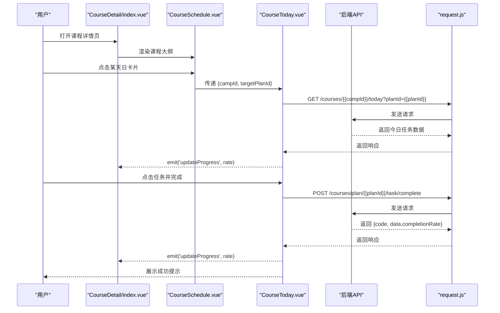
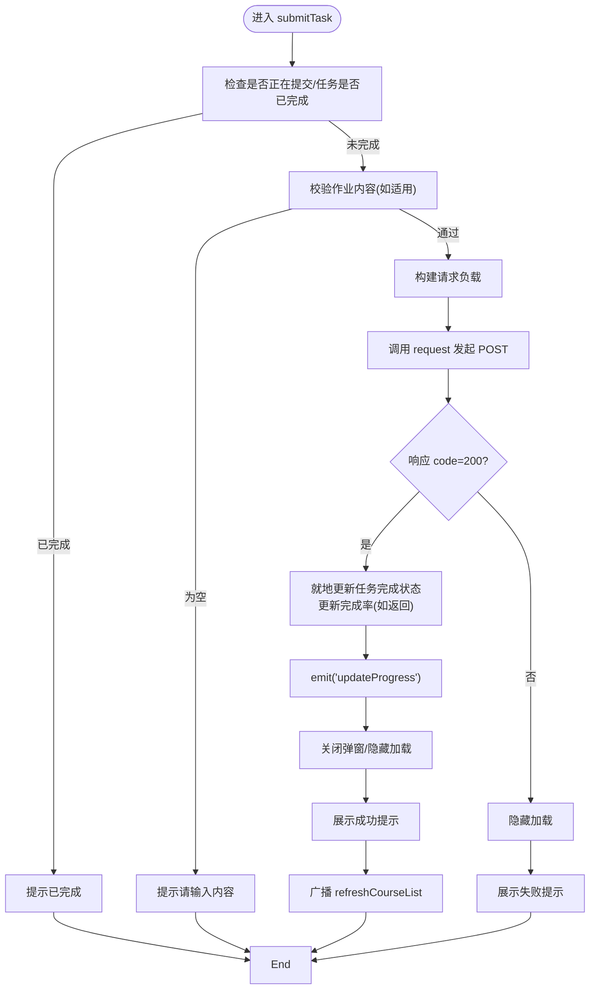
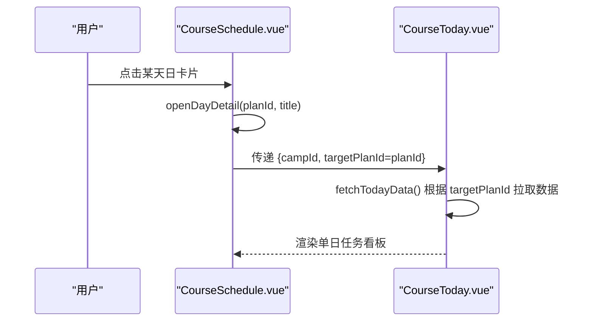
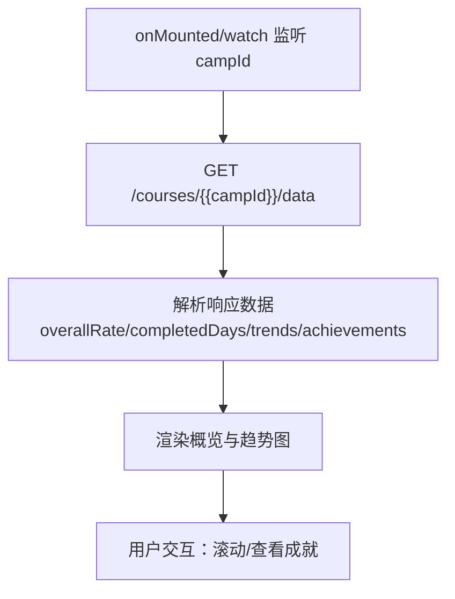
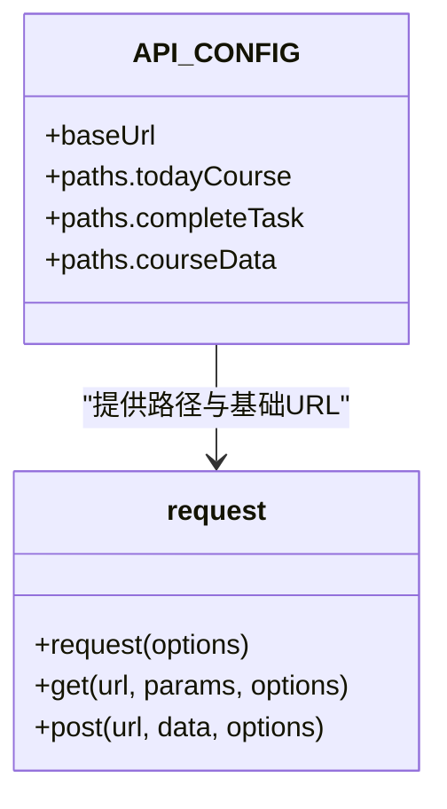
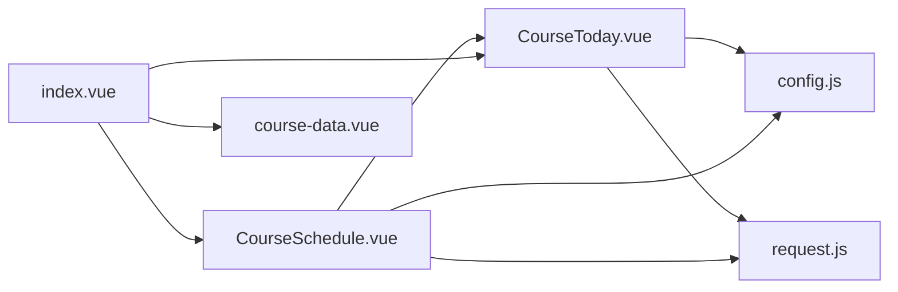

# 今日课程任务

<cite>
**本文档引用的文件**
- [CourseToday.vue](file://pages/CourseDetail/components/CourseToday.vue)
- [course-data.vue](file://pages/CourseDetail/components/course-data.vue)
- [CourseSchedule.vue](file://pages/CourseDetail/components/CourseSchedule.vue)
- [index.vue](file://pages/CourseDetail/index.vue)
- [config.js](file://api/config.js)
- [request.js](file://utils/request.js)
- [CourseToday打卡逻辑分析报告.md](file://doc/CourseToday打卡逻辑分析报告.md)
- [课程列表与打卡链路代码扫描报告.md](file://doc/课程列表与打卡链路代码扫描报告.md)
- [CourseToday_Module_Analysis.md](file://doc/CourseToday_Module_Analysis.md)
- [course-data组件分析报告.md](file://doc/course-data组件分析报告.md)
- [课程安排模块代码扫描报告.md](file://doc/课程安排模块代码扫描报告.md)
</cite>

## 目录
1. [简介](#简介)
2. [项目结构](#项目结构)
3. [核心组件](#核心组件)
4. [架构总览](#架构总览)
5. [详细组件分析](#详细组件分析)
6. [依赖关系分析](#依赖关系分析)
7. [性能考虑](#性能考虑)
8. [故障排除指南](#故障排除指南)
9. [结论](#结论)
10. [附录](#附录)

## 简介
本文件围绕“今日课程任务”功能进行全面技术文档化，重点覆盖以下方面：
- 打卡逻辑的实现机制：任务状态检查、时间限制验证、完成条件判断
- 任务进度跟踪系统：学习时长统计、完成状态更新、数据同步机制
- 用户交互设计：按钮状态变化、提示信息显示、错误处理策略
- 与后端 API 的数据交互流程：请求参数构建、响应数据处理、异常情况处理
- 任务重置机制与历史记录管理的实现细节

## 项目结构
“今日课程任务”位于课程详情页的“今日课程”标签中，由课程大纲组件（CourseSchedule）驱动，通过点击某一天的日卡片，进入“单日任务看板”（CourseToday）。课程数据看板（course-data）提供整体学习趋势与成就展示。

**图表来源**
- [index.vue:1-384](file://pages/CourseDetail/index.vue#L1-L384)
- [CourseSchedule.vue:1-605](file://pages/CourseDetail/components/CourseSchedule.vue#L1-L605)
- [CourseToday.vue:1-660](file://pages/CourseDetail/components/CourseToday.vue#L1-L660)
- [course-data.vue:1-573](file://pages/CourseDetail/components/course-data.vue#L1-L573)
- [config.js:1-60](file://api/config.js#L1-L60)
- [request.js:1-98](file://utils/request.js#L1-L98)

**章节来源**
- [index.vue:1-384](file://pages/CourseDetail/index.vue#L1-L384)
- [CourseSchedule.vue:1-605](file://pages/CourseDetail/components/CourseSchedule.vue#L1-L605)
- [CourseToday.vue:1-660](file://pages/CourseDetail/components/CourseToday.vue#L1-L660)
- [course-data.vue:1-573](file://pages/CourseDetail/components/course-data.vue#L1-L573)
- [config.js:1-60](file://api/config.js#L1-L60)
- [request.js:1-98](file://utils/request.js#L1-L98)

## 核心组件
- CourseToday：负责“今日课程/单日任务看板”的渲染与交互，包含任务列表、弹窗详情、打卡提交、进度更新与父组件通信。
- CourseSchedule：负责课程大纲的渲染与导航，点击某天后将该天的 planId 传递给 CourseToday，实现“查看任意一天”的能力。
- course-data：负责课程整体数据看板，展示总完成率、总天数、已完成天数、学习趋势与成就。
- API 配置与请求封装：统一管理 API 路径与请求头注入，处理 401 未授权等异常。

**章节来源**
- [CourseToday.vue:1-660](file://pages/CourseDetail/components/CourseToday.vue#L1-L660)
- [CourseSchedule.vue:1-605](file://pages/CourseDetail/components/CourseSchedule.vue#L1-L605)
- [course-data.vue:1-573](file://pages/CourseDetail/components/course-data.vue#L1-L573)
- [config.js:1-60](file://api/config.js#L1-L60)
- [request.js:1-98](file://utils/request.js#L1-L98)

## 架构总览
“今日课程任务”的控制流自上而下：课程详情页入口 -> 课程大纲 -> 单日任务看板 -> 后端 API；数据回流通过事件与重新拉取两种方式同步到父组件与课程列表。

**图表来源**
- [CourseSchedule.vue:180-202](file://pages/CourseDetail/components/CourseSchedule.vue#L180-L202)
- [CourseToday.vue:216-242](file://pages/CourseDetail/components/CourseToday.vue#L216-L242)
- [CourseToday.vue:291-352](file://pages/CourseDetail/components/CourseToday.vue#L291-L352)
- [config.js:52-56](file://api/config.js#L52-L56)
- [request.js:7-67](file://utils/request.js#L7-L67)

**章节来源**
- [CourseSchedule.vue:180-202](file://pages/CourseDetail/components/CourseSchedule.vue#L180-L202)
- [CourseToday.vue:216-242](file://pages/CourseDetail/components/CourseToday.vue#L216-L242)
- [CourseToday.vue:291-352](file://pages/CourseDetail/components/CourseToday.vue#L291-L352)
- [config.js:52-56](file://api/config.js#L52-L56)
- [request.js:7-67](file://utils/request.js#L7-L67)

## 详细组件分析

### CourseToday：今日课程与任务打卡
- 任务状态检查与完成条件
  - 通过任务对象的完成标志字段判断是否已完成，避免重复提交。
  - 对于作业类任务，提交前校验内容是否为空。
- 时间限制与完成条件
  - 通过父组件传入的 targetPlanId 决定请求“今日”还是“指定某天”的课程数据；若未传入则走“今日”逻辑。
- 打卡提交流程
  - 任务类型为作业时，提交内容与 taskId；其他类型直接提交 taskId。
  - 若后端返回最新完成率，则就地更新；否则重新拉取今日课程数据。
  - 成功后发出进度更新事件给父组件，并广播课程列表刷新信号。
- 用户交互与提示
  - 提交过程中显示加载提示；成功/失败分别展示成功与失败提示。
  - 弹窗关闭后清理当前任务与输入内容，避免状态残留。
- Watch 监听与数据刷新
  - 监听 campId 与 targetPlanId 变化，确保切换营期或切换天数时及时刷新数据。

**图表来源**
- [CourseToday.vue:291-352](file://pages/CourseDetail/components/CourseToday.vue#L291-L352)
- [CourseToday.vue:330-341](file://pages/CourseDetail/components/CourseToday.vue#L330-L341)

**章节来源**
- [CourseToday.vue:291-352](file://pages/CourseDetail/components/CourseToday.vue#L291-L352)
- [CourseToday.vue:354-378](file://pages/CourseDetail/components/CourseToday.vue#L354-L378)
- [CourseToday打卡逻辑分析报告.md:1-175](file://doc/CourseToday打卡逻辑分析报告.md#L1-L175)
- [课程列表与打卡链路代码扫描报告.md:346-394](file://doc/课程列表与打卡链路代码扫描报告.md#L346-L394)

### CourseSchedule：课程大纲与单日任务看板集成
- 大纲渲染与展开/收起
  - 模块级手风琴折叠，模块内按天渲染日卡片。
- 切屏到单日任务看板
  - 点击日卡片后，保存该天的 planId 与标题，进入 Detail 视图并嵌入 CourseToday。
- 生命周期与数据刷新
  - 监听 campId 变化，重新获取大纲；单日视图由父组件传入的 targetPlanId 驱动。

**图表来源**
- [CourseSchedule.vue:180-202](file://pages/CourseDetail/components/CourseSchedule.vue#L180-L202)
- [CourseSchedule.vue:114-118](file://pages/CourseDetail/components/CourseSchedule.vue#L114-L118)

**章节来源**
- [CourseSchedule.vue:180-202](file://pages/CourseDetail/components/CourseSchedule.vue#L180-L202)
- [CourseSchedule.vue:114-118](file://pages/CourseDetail/components/CourseSchedule.vue#L114-L118)
- [CourseToday_Module_Analysis.md:305-335](file://doc/CourseToday_Module_Analysis.md#L305-L335)

### course-data：课程数据看板与历史记录
- 数据结构与渲染
  - 展示总完成率、总天数、已完成天数；学习趋势以柱状图形式呈现，支持完成/漏打卡/未解锁三种状态。
- 状态映射与样式
  - 根据后端返回的状态值映射到 CSS 类，决定柱子颜色与数值显示。
- 历史记录与成就
  - 展示用户获得的成就徽章与描述，增强学习激励。

**图表来源**
- [course-data.vue:169-199](file://pages/CourseDetail/components/course-data.vue#L169-L199)
- [course-data组件分析报告.md:1-162](file://doc/course-data组件分析报告.md#L1-L162)

**章节来源**
- [course-data.vue:169-199](file://pages/CourseDetail/components/course-data.vue#L169-L199)
- [course-data组件分析报告.md:1-162](file://doc/course-data组件分析报告.md#L1-L162)

### API 配置与请求封装
- API 路径
  - 今日课程：/courses/{{campId}}/today
  - 任务打卡：/courses/plan/{{planId}}/task/complete
  - 课程数据看板：/courses/{{campId}}/data
- 请求封装
  - 自动注入 Authorization 头（Token）；处理 401 未授权跳转登录；统一错误提示与失败处理。

**图表来源**
- [config.js:8-57](file://api/config.js#L8-L57)
- [request.js:7-95](file://utils/request.js#L7-L95)

**章节来源**
- [config.js:8-57](file://api/config.js#L8-L57)
- [request.js:7-95](file://utils/request.js#L7-L95)

## 依赖关系分析
- 组件耦合
  - CourseSchedule 与 CourseToday 通过 props 传递 campId 与 targetPlanId，实现“查看任意一天”的能力。
  - CourseToday 通过 emit 与父组件通信，实现进度环更新。
- 外部依赖
  - API 配置集中管理，便于维护与扩展。
  - 请求封装统一处理 Token 注入与错误处理，降低重复代码。

**图表来源**
- [CourseSchedule.vue:1-605](file://pages/CourseDetail/components/CourseSchedule.vue#L1-L605)
- [CourseToday.vue:1-660](file://pages/CourseDetail/components/CourseToday.vue#L1-L660)
- [index.vue:1-384](file://pages/CourseDetail/index.vue#L1-L384)
- [course-data.vue:1-573](file://pages/CourseDetail/components/course-data.vue#L1-L573)
- [config.js:1-60](file://api/config.js#L1-L60)
- [request.js:1-98](file://utils/request.js#L1-L98)

**章节来源**
- [CourseSchedule.vue:1-605](file://pages/CourseDetail/components/CourseSchedule.vue#L1-L605)
- [CourseToday.vue:1-660](file://pages/CourseDetail/components/CourseToday.vue#L1-L660)
- [index.vue:1-384](file://pages/CourseDetail/index.vue#L1-L384)
- [course-data.vue:1-573](file://pages/CourseDetail/components/course-data.vue#L1-L573)
- [config.js:1-60](file://api/config.js#L1-L60)
- [request.js:1-98](file://utils/request.js#L1-L98)

## 性能考虑
- 就地更新策略：打卡成功后优先使用后端返回的完成率，避免重新拉取今日课程数据，减少网络请求与渲染成本。
- 响应式更新：Vue 3 的响应式系统使直接修改状态即可触发 UI 更新，减少不必要的列表刷新。
- 滚动与动画：课程数据看板的滚动与动画采用轻量实现，避免阻塞主线程。

[本节为通用指导，无需特定文件引用]

## 故障排除指南
- 登录过期
  - 现象：请求返回 401。
  - 处理：统一请求封装会清除 Token 并跳转登录页，同时提示“登录已过期，请重新登录”。
- 网络异常
  - 现象：请求 fail 或网络错误。
  - 处理：统一提示“网络连接异常”，并在 CourseToday 中隐藏加载、恢复按钮状态。
- 任务已完成仍可点击
  - 现象：重复提交。
  - 处理：组件内已做防抖与状态检查，若任务已完成则直接提示。
- 课程列表进度未刷新
  - 现象：打卡成功后“我的课程”列表的进度未更新。
  - 处理：当前链路仅通过 emit 更新父组件进度环；建议在 course-view 页面 onShow 时重新拉取课程列表，或引入事件总线广播。

**章节来源**
- [request.js:24-67](file://utils/request.js#L24-L67)
- [CourseToday.vue:291-352](file://pages/CourseDetail/components/CourseToday.vue#L291-L352)
- [课程列表与打卡链路代码扫描报告.md:397-427](file://doc/课程列表与打卡链路代码扫描报告.md#L397-L427)

## 结论
“今日课程任务”功能通过 CourseSchedule 与 CourseToday 的协同，实现了灵活的“查看任意一天”能力；通过就地更新与事件通信，提升了交互效率与用户体验。建议在课程列表页面补充 onShow 重新拉取或事件总线广播，以确保跨页面进度一致性。

[本节为总结性内容，无需特定文件引用]

## 附录

### API 一览与参数说明
- 获取今日/指定天课程
  - 方法：GET
  - 路径：/courses/{{campId}}/today?planId={{planId}}
  - 参数：campId（必填）、planId（可选）
- 任务打卡
  - 方法：POST
  - 路径：/courses/plan/{{planId}}/task/complete
  - 负载：{ taskId }
- 课程数据看板
  - 方法：GET
  - 路径：/courses/{{campId}}/data

**章节来源**
- [config.js:52-56](file://api/config.js#L52-L56)
- [CourseToday.vue:291-300](file://pages/CourseDetail/components/CourseToday.vue#L291-L300)
- [course-data.vue:169-199](file://pages/CourseDetail/components/course-data.vue#L169-L199)

### 任务重置与历史记录
- 任务重置
  - 当前实现未提供“撤销完成”或“重新开始”的接口与交互；如需支持，可在后端新增“取消完成”接口，并在前端增加相应按钮与状态回滚逻辑。
- 历史记录
  - 课程数据看板展示历史趋势与成就，便于用户回顾学习历程；若需更详细的打卡历史，可扩展后端接口返回更细粒度的历史记录。

**章节来源**
- [course-data.vue:1-573](file://pages/CourseDetail/components/course-data.vue#L1-L573)
- [course-data组件分析报告.md:1-162](file://doc/course-data组件分析报告.md#L1-L162)