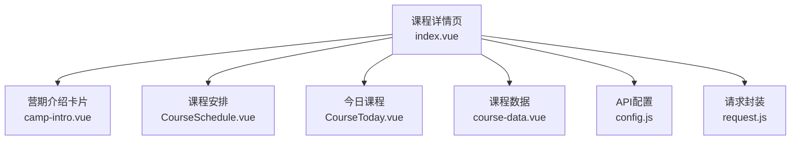
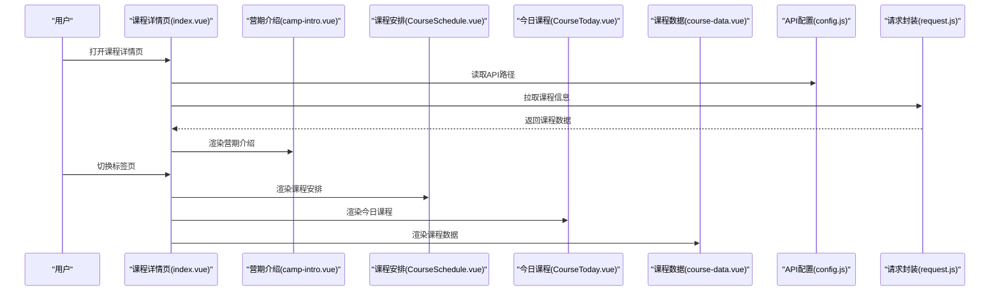
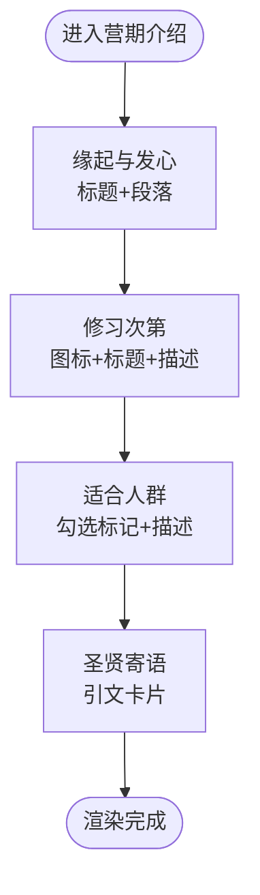
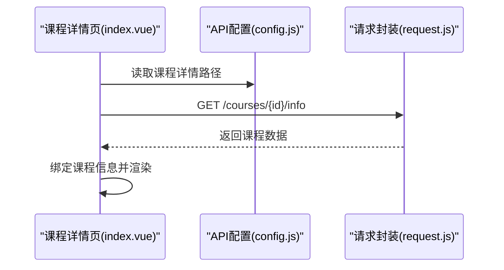
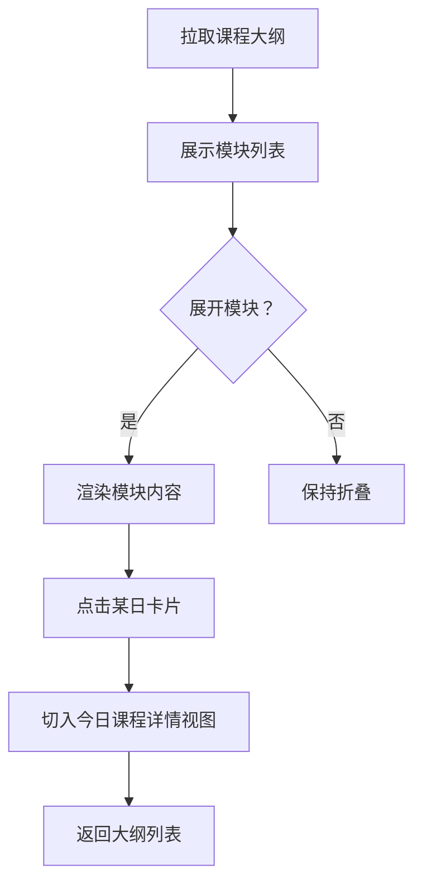
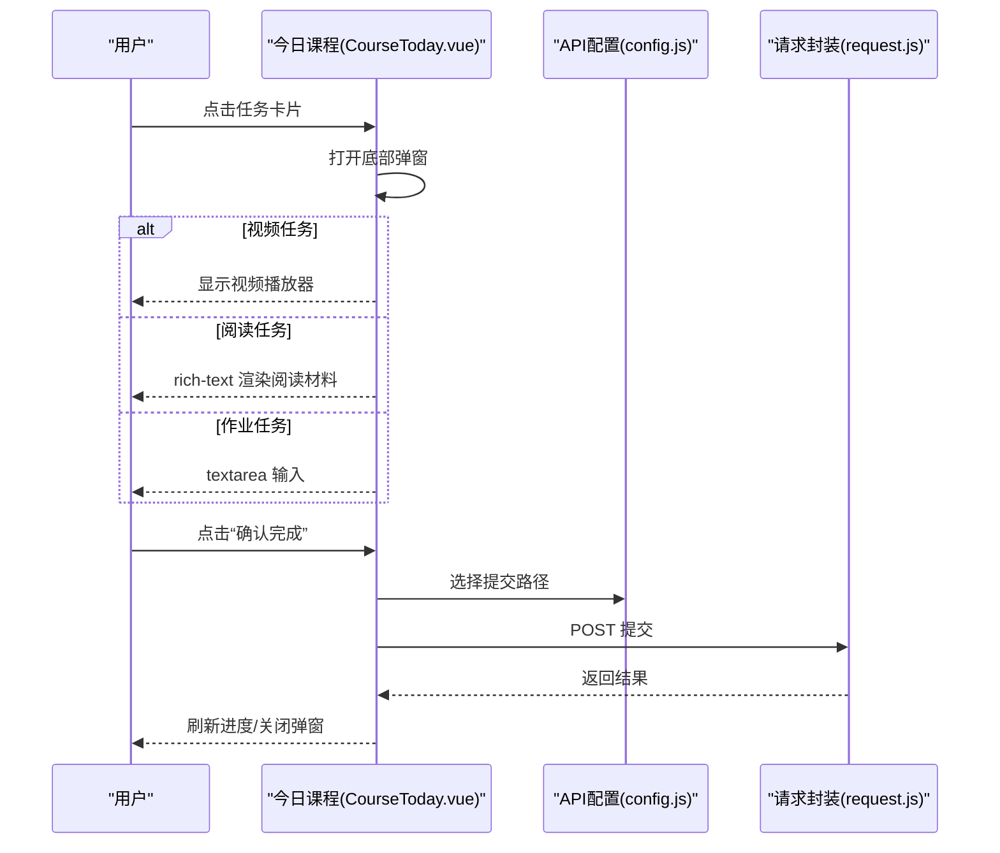
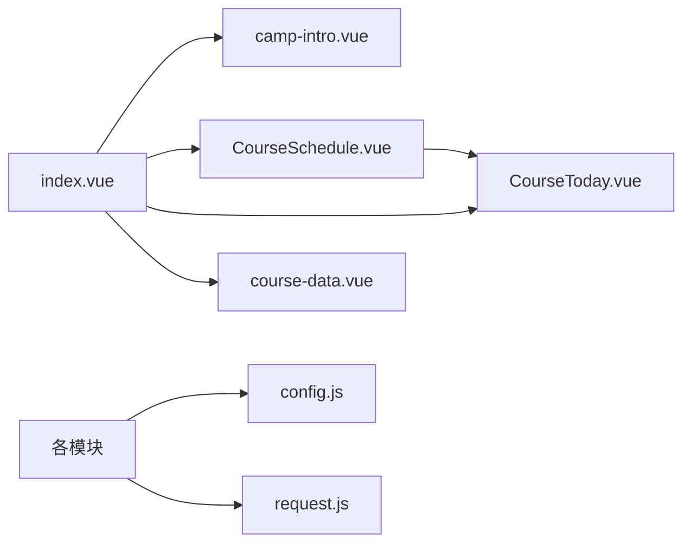

# 营期介绍内容

<cite>
**本文引用的文件**
- [camp-intro.vue](file://pages/CourseDetail/components/camp-intro.vue)
- [index.vue](file://pages/CourseDetail/index.vue)
- [CourseSchedule.vue](file://pages/CourseDetail/components/CourseSchedule.vue)
- [CourseToday.vue](file://pages/CourseDetail/components/CourseToday.vue)
- [course-data.vue](file://pages/CourseDetail/components/course-data.vue)
- [config.js](file://api/config.js)
- [request.js](file://utils/request.js)
- [pages.json](file://pages.json)
</cite>

## 目录
1. [简介](#简介)
2. [项目结构](#项目结构)
3. [核心组件](#核心组件)
4. [架构总览](#架构总览)
5. [详细组件分析](#详细组件分析)
6. [依赖关系分析](#依赖关系分析)
7. [性能考量](#性能考量)
8. [故障排查指南](#故障排查指南)
9. [结论](#结论)
10. [附录](#附录)

## 简介
本文件围绕“营期介绍内容组件”进行系统化技术文档梳理，聚焦以下目标：
- 营期信息的展示结构：标题设计、内容排版与多媒体整合方案
- 文本内容渲染机制：富文本支持、链接处理与图片展示
- 响应式布局与阅读体验：多尺寸适配策略
- 内容更新机制：动态加载、缓存与离线支持建议
- 内容安全与性能优化最佳实践

## 项目结构
该功能位于课程详情页的“营期介绍”模块，采用分页式布局与组件化组织：
- 页面容器负责头部、标签页与滚动区域
- 营期介绍卡片作为首个标签页内容
- 其他模块（课程安排、今日课程、课程数据）在同一页面内按需切换

图表来源
- [index.vue:1-65](file://pages/CourseDetail/index.vue#L1-L65)
- [camp-intro.vue:1-91](file://pages/CourseDetail/components/camp-intro.vue#L1-L91)
- [CourseSchedule.vue:1-122](file://pages/CourseDetail/components/CourseSchedule.vue#L1-L122)
- [CourseToday.vue:1-184](file://pages/CourseDetail/components/CourseToday.vue#L1-L184)
- [course-data.vue:1-100](file://pages/CourseDetail/components/course-data.vue#L1-L100)
- [config.js:1-60](file://api/config.js#L1-L60)
- [request.js:1-98](file://utils/request.js#L1-L98)

章节来源
- [index.vue:1-65](file://pages/CourseDetail/index.vue#L1-L65)
- [pages.json:50-56](file://pages.json#L50-L56)

## 核心组件
- 营期介绍卡片（camp-intro.vue）：承载缘起发心、修习次第、适合人群与圣贤寄语等静态结构化内容，采用卡片式布局与统一视觉语言。
- 课程详情页容器（index.vue）：负责页面骨架、头部装饰、标签页切换与滚动区域，作为各模块的统一入口。
- 课程安排（CourseSchedule.vue）：提供大纲时间轴与模块展开/收拢，支持跳转到具体日期的任务看板。
- 今日课程（CourseToday.vue）：展示当日任务与弹窗详情，支持视频、阅读、作业等多媒体任务类型。
- 课程数据（course-data.vue）：展示学习趋势、完成率与成就等数据可视化模块。

章节来源
- [camp-intro.vue:1-91](file://pages/CourseDetail/components/camp-intro.vue#L1-L91)
- [index.vue:1-65](file://pages/CourseDetail/index.vue#L1-L65)
- [CourseSchedule.vue:1-122](file://pages/CourseDetail/components/CourseSchedule.vue#L1-L122)
- [CourseToday.vue:1-184](file://pages/CourseDetail/components/CourseToday.vue#L1-L184)
- [course-data.vue:1-100](file://pages/CourseDetail/components/course-data.vue#L1-L100)

## 架构总览
课程详情页采用“容器 + 多模块标签页”的组合模式，通过 props 传递课程标识，模块内部通过统一的 API 配置与请求封装进行数据拉取与状态管理。

图表来源
- [index.vue:67-146](file://pages/CourseDetail/index.vue#L67-L146)
- [config.js:16-56](file://api/config.js#L16-L56)
- [request.js:7-67](file://utils/request.js#L7-L67)
- [CourseSchedule.vue:124-212](file://pages/CourseDetail/components/CourseSchedule.vue#L124-L212)
- [CourseToday.vue:186-379](file://pages/CourseDetail/components/CourseToday.vue#L186-L379)
- [course-data.vue:102-214](file://pages/CourseDetail/components/course-data.vue#L102-L214)

## 详细组件分析

### 营期介绍卡片（camp-intro.vue）
- 结构组成
  - 缘起与发心：标题 + 段落正文，支持首段强调与两端对齐
  - 修习次第：图标 + 标题 + 描述的列表项
  - 适合人群：勾选标记 + 描述列表
  - 圣贤寄语：带边框与斜体字体的引文卡片
- 设计要点
  - 卡片圆角、阴影与边框营造悬浮感
  - 阳明红主题色与首页一致的字号、行高与字距
  - 列表项采用图标 + 文本的对比布局，提升可读性
- 文本渲染
  - 使用原生文本组件进行排版，便于统一字号与行高
  - 未内置富文本解析，若需富文本可参考“今日课程”的 rich-text 方案

图表来源
- [camp-intro.vue:1-91](file://pages/CourseDetail/components/camp-intro.vue#L1-L91)

章节来源
- [camp-intro.vue:1-281](file://pages/CourseDetail/components/camp-intro.vue#L1-L281)

### 课程详情页容器（index.vue）
- 页面骨架
  - 固定顶部区域：英雄卡片（渐变背景、装饰圆环）、信息卡片（标题、参与人数）
  - 标签栏：四个模块切换（营期介绍、课程安排、今日课程、课程数据）
  - 滚动内容区：模块懒加载与显隐控制
- 动态数据
  - 通过 API 获取课程信息并绑定到页面状态
  - 支持根据营期名称映射背景色与提取营期简称
- 交互行为
  - 标签页切换与当前索引绑定
  - FAB 悬浮按钮（占位，后续接入聊天）

图表来源
- [index.vue:67-146](file://pages/CourseDetail/index.vue#L67-L146)
- [config.js:16-56](file://api/config.js#L16-L56)
- [request.js:7-67](file://utils/request.js#L7-L67)

章节来源
- [index.vue:1-384](file://pages/CourseDetail/index.vue#L1-L384)

### 课程安排（CourseSchedule.vue）
- 时间轴与模块展开
  - 外层主轴 + 模块节点 + 内层次轴 + 日卡片
  - 手风琴折叠，支持展开/收拢动画
- 详情视图
  - 切入“今日课程”模块，复用同一组件并传入目标计划 ID
- 数据流
  - 通过 watch 监听 campId 变化，拉取课程大纲

图表来源
- [CourseSchedule.vue:124-212](file://pages/CourseDetail/components/CourseSchedule.vue#L124-L212)

章节来源
- [CourseSchedule.vue:1-605](file://pages/CourseDetail/components/CourseSchedule.vue#L1-L605)

### 今日课程（CourseToday.vue）
- 任务弹窗详情
  - 视频：video 组件播放，无资源时显示占位
  - 阅读：rich-text 渲染，支持内嵌链接与富文本片段
  - 作业：textarea 输入，字数统计与禁用态
  - 其他：额外任务的占位与说明
- 提交流程
  - HOMEWORK：提交作业内容
  - 其他任务：调用完成接口并刷新进度
- 状态管理
  - loading、空状态、错误状态三态
  - 通过 props 接收 campId 与可选的 targetPlanId

图表来源
- [CourseToday.vue:100-184](file://pages/CourseDetail/components/CourseToday.vue#L100-L184)
- [config.js:16-56](file://api/config.js#L16-L56)
- [request.js:7-67](file://utils/request.js#L7-L67)

章节来源
- [CourseToday.vue:1-660](file://pages/CourseDetail/components/CourseToday.vue#L1-L660)

### 课程数据（course-data.vue）
- 数据概览：总完成率、总天数、已完成天数
- 学习趋势：横向滚动的柱状图，按状态着色（完成/漏打卡/未解锁/部分完成/补卡）
- 成就列表：图标 + 标题 + 描述
- 交互细节：截断未来未解锁天数、自动滚动到合适位置、隐藏滚动条

章节来源
- [course-data.vue:1-573](file://pages/CourseDetail/components/course-data.vue#L1-L573)

## 依赖关系分析
- 组件耦合
  - index.vue 作为容器，依赖多个子模块组件
  - CourseSchedule.vue 依赖 CourseToday.vue 实现“今日课程”详情视图
  - 所有模块共享 API 配置与请求封装
- 外部依赖
  - uni-icons 图标库
  - uni-popup 弹窗组件
  - uni.request/uni.showToast 等 uni 生态 API

图表来源
- [index.vue:72-75](file://pages/CourseDetail/index.vue#L72-L75)
- [CourseSchedule.vue:129-129](file://pages/CourseDetail/components/CourseSchedule.vue#L129-L129)
- [config.js:1-60](file://api/config.js#L1-L60)
- [request.js:1-98](file://utils/request.js#L1-L98)

章节来源
- [index.vue:72-75](file://pages/CourseDetail/index.vue#L72-L75)
- [CourseSchedule.vue:129-129](file://pages/CourseDetail/components/CourseSchedule.vue#L129-L129)

## 性能考量
- 渲染性能
  - 使用原生文本组件进行段落渲染，避免复杂富文本解析带来的开销
  - 课程数据模块通过计算属性截断未来天数，减少不必要的 DOM 渲染
- 网络性能
  - 统一请求封装，集中处理 401、网络异常等错误，减少重复逻辑
  - 课程安排模块通过 watch 监听 campId，避免重复请求
- 交互体验
  - 弹窗采用底部上拉样式，配合安全区域适配
  - 滚动区域使用横向滚动视图，隐藏滚动条以提升视觉一致性

章节来源
- [course-data.vue:123-143](file://pages/CourseDetail/components/course-data.vue#L123-L143)
- [request.js:24-67](file://utils/request.js#L24-L67)
- [CourseSchedule.vue:205-207](file://pages/CourseDetail/components/CourseSchedule.vue#L205-L207)

## 故障排查指南
- 登录过期
  - 请求封装检测 401，提示重新登录并清除本地 token
- 网络异常
  - 统一 toast 提示“网络连接异常”，建议检查设备网络与 API 地址
- 数据为空或加载失败
  - 课程数据模块提供“点击重试”入口
  - 课程安排模块提供空状态占位图与文案
- 任务提交失败
  - 今日课程模块对必填校验与错误提示，提交后刷新进度

章节来源
- [request.js:29-63](file://utils/request.js#L29-L63)
- [course-data.vue:94-98](file://pages/CourseDetail/components/course-data.vue#L94-L98)
- [CourseSchedule.vue:9-12](file://pages/CourseDetail/components/CourseSchedule.vue#L9-L12)
- [CourseToday.vue:291-352](file://pages/CourseDetail/components/CourseToday.vue#L291-L352)

## 结论
营期介绍内容组件以卡片化结构清晰呈现营期理念与学习路径，结合课程安排、今日课程与课程数据形成完整的课程详情页生态。通过统一的 API 配置与请求封装，实现了稳定的动态加载与良好的交互体验。建议在后续迭代中引入富文本渲染能力与离线缓存策略，进一步提升内容表现力与可用性。

## 附录

### 文本渲染与多媒体整合方案
- 富文本支持
  - 今日课程模块使用 rich-text 渲染阅读材料，支持内嵌链接与富文本片段
  - 若需在营期介绍中引入富文本，可在现有结构中扩展 rich-text 节点
- 链接处理
  - rich-text 内联链接可直接点击跳转，建议在业务侧校验 URL 合法性
- 图片展示
  - 今日课程中的视频使用 video 组件；阅读材料中的图片建议通过富文本节点渲染
  - 建议对图片资源进行压缩与懒加载优化

章节来源
- [CourseToday.vue:133-142](file://pages/CourseDetail/components/CourseToday.vue#L133-L142)

### 响应式布局与阅读体验
- 视口与安全区域
  - 页面通过 meta viewport 与 env(safe-area-inset-*) 适配刘海屏与底部胶囊按钮
- 字号与行高
  - 使用 rpx 单位统一字号与间距，保证在不同设备上的可读性
- 弹窗与滚动
  - 弹窗采用底部上拉样式，配合安全区域与滚动视图，提升阅读与输入体验

章节来源
- [index.vue:331-383](file://pages/CourseDetail/index.vue#L331-L383)
- [CourseToday.vue:486-490](file://pages/CourseDetail/components/CourseToday.vue#L486-L490)

### 内容更新机制与离线支持建议
- 动态内容加载
  - 通过 watch 监听 campId 或 props 变化，触发数据重新拉取
- 缓存策略
  - 建议在本地存储课程信息与课程安排，结合过期时间与版本号实现增量更新
- 离线支持
  - 对于静态内容（如营期介绍），可预缓存关键文案与图片，提供离线兜底
  - 对于动态数据（如今日课程），建议在无网时显示缓存数据并提示网络状态

章节来源
- [CourseSchedule.vue:205-207](file://pages/CourseDetail/components/CourseSchedule.vue#L205-L207)
- [CourseToday.vue:359-372](file://pages/CourseDetail/components/CourseToday.vue#L359-L372)

### 内容安全与性能优化最佳实践
- 安全过滤
  - 富文本节点应仅允许受控标签与属性，避免执行不受信任脚本
  - 链接跳转前进行白名单校验，防止打开恶意站点
- 性能优化
  - 控制富文本节点数量与层级，避免过度嵌套导致渲染卡顿
  - 对图片资源进行压缩与懒加载，减少首屏加载时间
  - 合理使用计算属性与 watch，避免不必要的重复渲染

章节来源
- [CourseToday.vue:133-142](file://pages/CourseDetail/components/CourseToday.vue#L133-L142)
- [course-data.vue:146-166](file://pages/CourseDetail/components/course-data.vue#L146-L166)