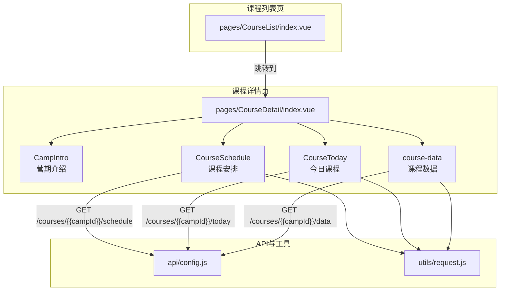
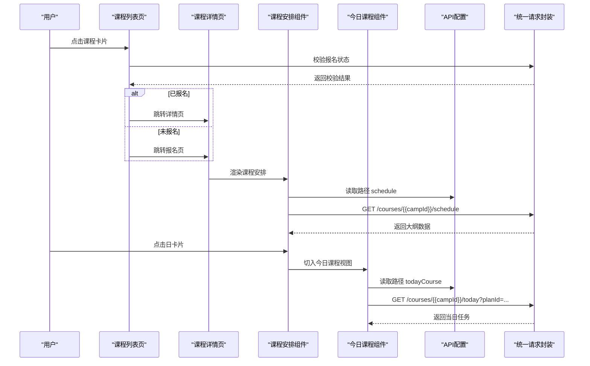
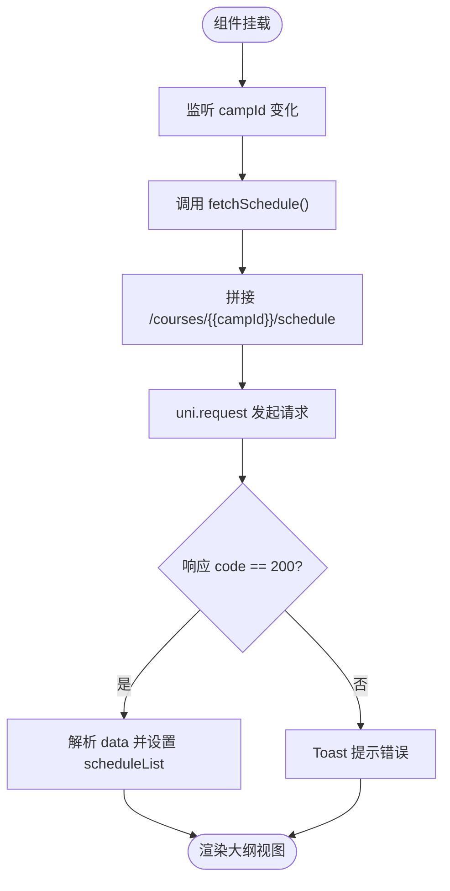
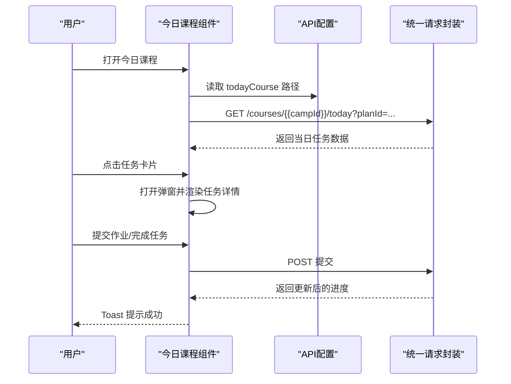
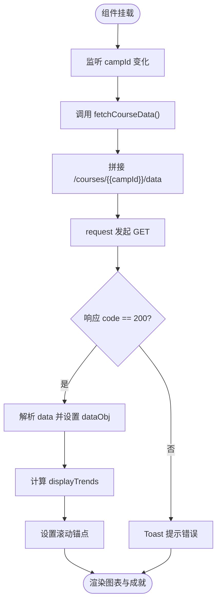
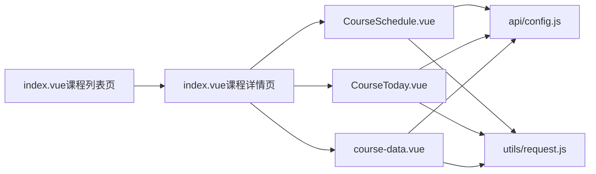

# 课程安排展示

<cite>
**本文引用的文件**
- [CourseSchedule.vue](file://pages/CourseDetail/components/CourseSchedule.vue)
- [CourseToday.vue](file://pages/CourseDetail/components/CourseToday.vue)
- [course-data.vue](file://pages/CourseDetail/components/course-data.vue)
- [index.vue（课程详情页）](file://pages/CourseDetail/index.vue)
- [index.vue（课程列表页）](file://pages/CourseList/index.vue)
- [config.js（API配置）](file://api/config.js)
- [request.js（统一请求封装）](file://utils/request.js)
- [课程安排模块代码扫描报告.md](file://doc/课程安排模块代码扫描报告.md)
- [course-data组件分析报告.md](file://doc/course-data组件分析报告.md)
- [camp-intro.vue](file://pages/CourseDetail/components/camp-intro.vue)
</cite>

## 目录
1. [简介](#简介)
2. [项目结构](#项目结构)
3. [核心组件](#核心组件)
4. [架构总览](#架构总览)
5. [详细组件分析](#详细组件分析)
6. [依赖关系分析](#依赖关系分析)
7. [性能考量](#性能考量)
8. [故障排查指南](#故障排查指南)
9. [结论](#结论)
10. [附录](#附录)

## 简介
本文件围绕“课程安排展示”主题，系统梳理课程时间表的组织结构、渲染机制、状态管理与用户交互，并给出动态加载与懒加载优化策略。重点覆盖：
- 课程时间表的日期分组、课程列表与时间轴展示设计模式
- 课程信息渲染（标题、描述、元信息、状态标识）
- 课程状态管理（可选/已选/不可选）的视觉区分
- 用户交互（课程选择、取消选择、批量操作）的实现逻辑
- 课程数据的动态加载与懒加载优化策略

## 项目结构
课程安排展示涉及课程详情页的多个子组件协同工作，课程列表页负责入口与筛选，课程详情页承载三大模块：营期介绍、课程安排、今日课程、课程数据。

**图表来源**
- [index.vue（课程详情页）:1-65](file://pages/CourseDetail/index.vue#L1-L65)
- [CourseSchedule.vue:124-212](file://pages/CourseDetail/components/CourseSchedule.vue#L124-L212)
- [CourseToday.vue:186-378](file://pages/CourseDetail/components/CourseToday.vue#L186-L378)
- [course-data.vue:102-214](file://pages/CourseDetail/components/course-data.vue#L102-L214)
- [config.js（API配置）:52-55](file://api/config.js#L52-L55)
- [request.js（统一请求封装）:7-67](file://utils/request.js#L7-L67)

**章节来源**
- [index.vue（课程详情页）:1-65](file://pages/CourseDetail/index.vue#L1-L65)
- [index.vue（课程列表页）:1-78](file://pages/CourseList/index.vue#L1-L78)
- [config.js（API配置）:1-60](file://api/config.js#L1-L60)

## 核心组件
- 课程安排（CourseSchedule）：以时间轴形式展示课程大纲，支持模块展开/折叠、日卡片点击进入“今日课程”视图。
- 今日课程（CourseToday）：按日呈现任务清单，支持任务完成、作业提交、视频/阅读预览与弹窗交互。
- 课程数据（course-data）：展示学习趋势、完成率与成就，支持按 campId 动态加载。
- 课程详情页（index.vue）：作为容器页，承载上述三个模块与导航。
- 课程列表页（index.vue）：提供课程入口与筛选，校验报名状态后跳转详情页。

**章节来源**
- [CourseSchedule.vue:1-122](file://pages/CourseDetail/components/CourseSchedule.vue#L1-L122)
- [CourseToday.vue:1-184](file://pages/CourseDetail/components/CourseToday.vue#L1-L184)
- [course-data.vue:1-100](file://pages/CourseDetail/components/course-data.vue#L1-L100)
- [index.vue（课程详情页）:1-65](file://pages/CourseDetail/index.vue#L1-L65)
- [index.vue（课程列表页）:1-78](file://pages/CourseList/index.vue#L1-L78)

## 架构总览
课程安排展示采用“容器页 + 多模块组件”的组合架构。容器页负责页面级状态与模块切换，各模块组件负责具体数据请求与渲染。统一请求封装负责鉴权与错误处理，API配置集中管理路径。

**图表来源**
- [index.vue（课程列表页）:175-196](file://pages/CourseList/index.vue#L175-L196)
- [index.vue（课程详情页）:48-57](file://pages/CourseDetail/index.vue#L48-L57)
- [CourseSchedule.vue:124-212](file://pages/CourseDetail/components/CourseSchedule.vue#L124-L212)
- [CourseToday.vue:186-378](file://pages/CourseDetail/components/CourseToday.vue#L186-L378)
- [config.js（API配置）:52-55](file://api/config.js#L52-L55)
- [request.js（统一请求封装）:7-67](file://utils/request.js#L7-L67)

## 详细组件分析

### 课程安排（CourseSchedule）组件
- 组织结构
  - 外层模块（周/阶段）列表，每个模块包含若干“日计划”
  - 模块支持手风琴展开/折叠
  - 日卡片包含标题、副标题（阅读材料）、元信息（教师、时长）
- 渲染机制
  - 使用双层 v-for：模块 -> 日计划
  - 通过 isExpanded 控制模块展开状态
  - 通过 selectedPlanId 实现“大纲视图”与“今日课程视图”的虚拟切屏
- 状态管理
  - isLoading：加载中状态
  - scheduleList：课程大纲数据
  - selectedPlanId/selectedPlanTitle：控制 Detail 视图
- 用户交互
  - 点击模块标题展开/折叠
  - 点击日卡片打开今日课程视图
- 数据加载
  - 监听 campId 变化，触发请求
  - 请求路径来自 API 配置：/courses/{{campId}}/schedule

**图表来源**
- [CourseSchedule.vue:124-212](file://pages/CourseDetail/components/CourseSchedule.vue#L124-L212)

**章节来源**
- [CourseSchedule.vue:1-122](file://pages/CourseDetail/components/CourseSchedule.vue#L1-L122)
- [CourseSchedule.vue:124-212](file://pages/CourseDetail/components/CourseSchedule.vue#L124-L212)
- [课程安排模块代码扫描报告.md:113-174](file://doc/课程安排模块代码扫描报告.md#L113-L174)

### 今日课程（CourseToday）组件
- 组织结构
  - 顶部日期与进度条
  - 任务列表：视频、阅读、作业、拓展任务
  - 任务详情弹窗：视频播放、阅读链接、作业输入与字数统计
- 渲染机制
  - 任务类型映射：READ/VIDEO/HOMEWORK/EXTRA
  - 任务状态映射：已完成/待完成
  - 任务必修/选修标签
- 状态管理
  - isLoading：加载中
  - courseData：当日任务数据
  - currentTask：当前弹窗任务
  - homeworkContent：作业内容
  - isSubmitting：提交中
- 用户交互
  - 点击任务卡片打开弹窗
  - 提交作业或完成任务
  - 支持 planId 参数查看任意一天
- 数据加载
  - 监听 campId 与 targetPlanId 变化
  - 请求路径：/courses/{{campId}}/today?planId=...

**图表来源**
- [CourseToday.vue:186-378](file://pages/CourseDetail/components/CourseToday.vue#L186-L378)
- [config.js（API配置）:53-55](file://api/config.js#L53-L55)
- [request.js（统一请求封装）:7-67](file://utils/request.js#L7-L67)

**章节来源**
- [CourseToday.vue:1-184](file://pages/CourseDetail/components/CourseToday.vue#L1-L184)
- [CourseToday.vue:186-378](file://pages/CourseDetail/components/CourseToday.vue#L186-L378)

### 课程数据（course-data）组件
- 组织结构
  - 总完成率卡片
  - 统计行（总天数/已完成）
  - 学习趋势柱状图（按天）
  - 成就列表
- 渲染机制
  - 使用计算属性 displayTrends 截断未来未解锁天数
  - 按状态（COMPLETED/MISSED/LOCKED/PARTIAL/MAKEUP）映射样式
  - 柱子高度与数值显示规则明确
- 状态管理
  - isLoading：加载中
  - dataObj：课程数据
  - currentScrollId：滚动锚点
- 用户交互
  - 点击“点击重试”重新加载
- 数据加载
  - 监听 campId 变化
  - 请求路径：/courses/{{campId}}/data

**图表来源**
- [course-data.vue:102-214](file://pages/CourseDetail/components/course-data.vue#L102-L214)
- [course-data组件分析报告.md:1-162](file://doc/course-data组件分析报告.md#L1-L162)

**章节来源**
- [course-data.vue:1-100](file://pages/CourseDetail/components/course-data.vue#L1-L100)
- [course-data.vue:102-214](file://pages/CourseDetail/components/course-data.vue#L102-L214)
- [course-data组件分析报告.md:1-162](file://doc/course-data组件分析报告.md#L1-L162)

### 课程列表（CourseList）与课程详情（CourseDetail）
- 课程列表页负责入口与筛选，校验报名状态后跳转详情页或报名页
- 课程详情页通过标签页切换承载多个模块，其中“课程安排”与“今日课程”紧密协作

**章节来源**
- [index.vue（课程列表页）:175-196](file://pages/CourseList/index.vue#L175-L196)
- [index.vue（课程详情页）:48-57](file://pages/CourseDetail/index.vue#L48-L57)

## 依赖关系分析
- 组件耦合
  - CourseSchedule 与 CourseToday 通过 selectedPlanId/targetPlanId 参数建立弱耦合的视图切换关系
  - 课程详情页作为容器，聚合多个模块组件
- 外部依赖
  - API配置集中管理路径，便于统一维护
  - 统一请求封装负责鉴权与错误处理，降低重复代码
- 潜在风险
  - 课程安排模块对后端字段（moduleIndex/moduleName）存在降级与兼容逻辑，需关注后端返回一致性
  - 课程数据组件对 MAKEUP 状态未定义样式，若后端新增需补充样式

**图表来源**
- [CourseSchedule.vue:124-212](file://pages/CourseDetail/components/CourseSchedule.vue#L124-L212)
- [CourseToday.vue:186-378](file://pages/CourseDetail/components/CourseToday.vue#L186-L378)
- [course-data.vue:102-214](file://pages/CourseDetail/components/course-data.vue#L102-L214)
- [config.js（API配置）:52-55](file://api/config.js#L52-L55)
- [request.js（统一请求封装）:7-67](file://utils/request.js#L7-L67)
- [index.vue（课程详情页）:48-57](file://pages/CourseDetail/index.vue#L48-L57)
- [index.vue（课程列表页）:175-196](file://pages/CourseList/index.vue#L175-L196)

**章节来源**
- [config.js（API配置）:1-60](file://api/config.js#L1-L60)
- [request.js（统一请求封装）:1-98](file://utils/request.js#L1-L98)
- [课程安排模块代码扫描报告.md:226-249](file://doc/课程安排模块代码扫描报告.md#L226-L249)

## 性能考量
- 渲染优化
  - 使用手风琴折叠减少一次性渲染量
  - 课程数据组件通过计算属性截断未来未解锁天数，避免无效渲染
- 请求优化
  - 统一请求封装自动注入 Authorization，减少重复逻辑
  - 课程列表页支持下拉刷新与上拉加载，避免一次性拉取过多数据
- 图形渲染
  - 课程数据柱状图采用动画入场与高度过渡，兼顾流畅与性能

**章节来源**
- [CourseSchedule.vue:396-416](file://pages/CourseDetail/components/CourseSchedule.vue#L396-L416)
- [course-data.vue:123-143](file://pages/CourseDetail/components/course-data.vue#L123-L143)
- [index.vue（课程列表页）:198-237](file://pages/CourseList/index.vue#L198-L237)

## 故障排查指南
- 课程安排显示异常
  - 检查后端返回的 moduleIndex 是否从 1 开始，否则前端会显示 M0
  - 检查 moduleIndex 与 moduleName 是否为空导致降级显示
  - 参考：[课程安排模块代码扫描报告.md:177-249](file://doc/课程安排模块代码扫描报告.md#L177-L249)
- 课程数据状态样式缺失
  - 若后端新增 MAKEUP 状态，需补充对应 CSS 样式
  - 参考：[course-data组件分析报告.md:122-150](file://doc/course-data组件分析报告.md#L122-L150)
- 登录失效与网络异常
  - 统一请求封装会处理 401 与网络异常，必要时引导重新登录
  - 参考：[request.js（统一请求封装）:24-67](file://utils/request.js#L24-L67)

**章节来源**
- [课程安排模块代码扫描报告.md:177-249](file://doc/课程安排模块代码扫描报告.md#L177-L249)
- [course-data组件分析报告.md:122-150](file://doc/course-data组件分析报告.md#L122-L150)
- [request.js（统一请求封装）:24-67](file://utils/request.js#L24-L67)

## 结论
课程安排展示组件通过清晰的时间轴与模块化设计，实现了从“大纲视图”到“日任务视图”的平滑切换。组件间通过 props 与事件建立松耦合关系，配合统一的 API 与请求封装，具备良好的可维护性与扩展性。建议在后续迭代中：
- 对齐后端字段命名与默认值，减少前端兼容逻辑
- 补充课程数据组件对新增状态的样式支持
- 在课程列表页进一步优化加载策略，提升首屏体验

## 附录
- 课程状态映射（课程列表页）
  - 未开营/已开营/已结营/待定：根据 startTime/endTime 与当前时间判定
  - 参考：[index.vue（课程列表页）:147-169](file://pages/CourseList/index.vue#L147-L169)
- 课程数据状态映射（课程数据组件）
  - COMPLETED/MISSED/LOCKED/PARTIAL/MAKEUP：按状态映射样式与数值显示
  - 参考：[course-data组件分析报告.md:62-118](file://doc/course-data组件分析报告.md#L62-L118)