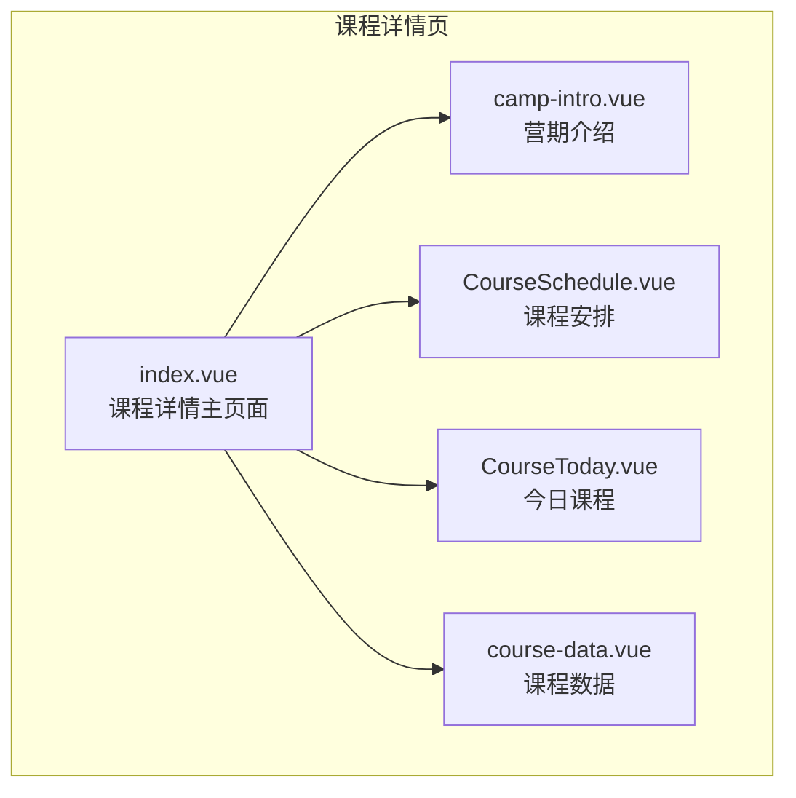
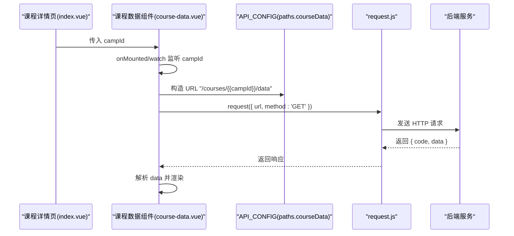
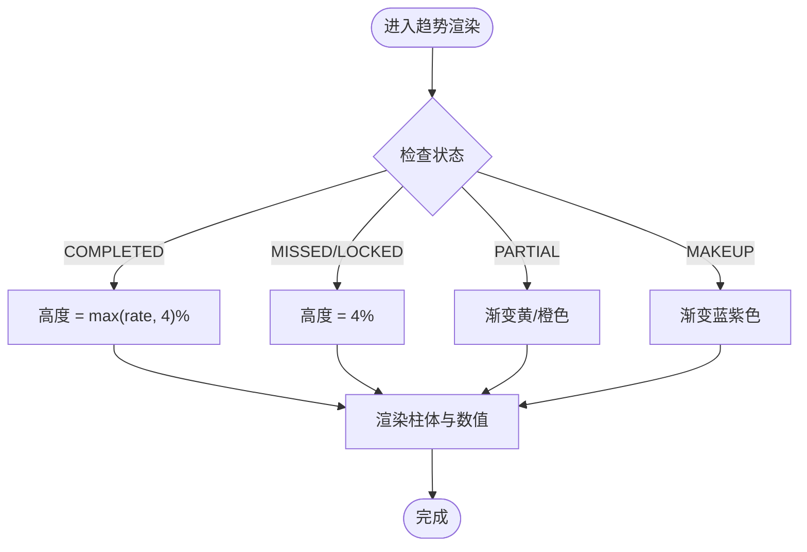
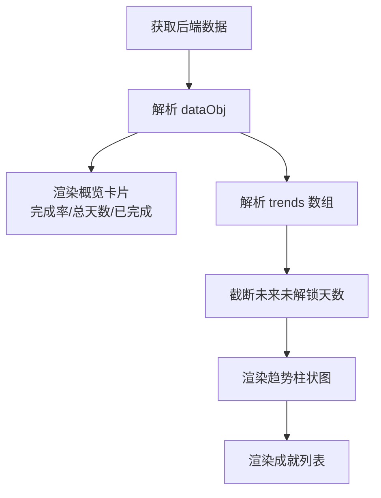
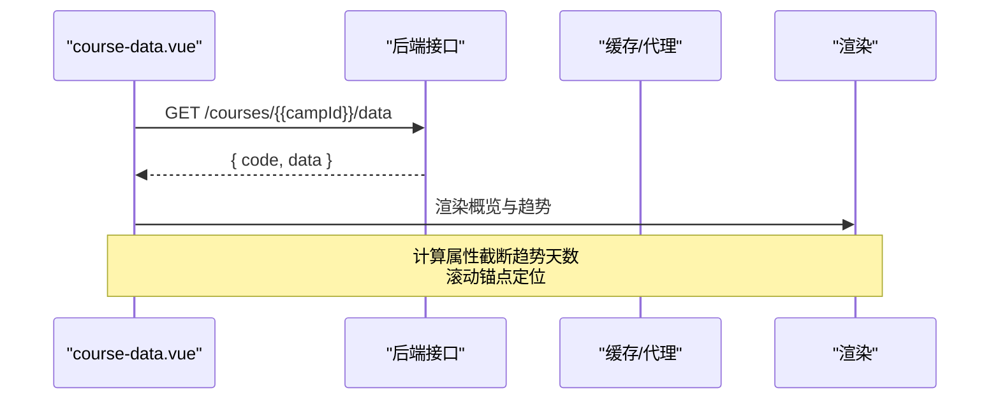
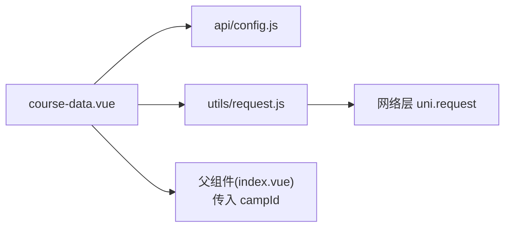

# 课程数据展示

<cite>
**本文引用的文件**
- [course-data.vue](file://pages/CourseDetail/components/course-data.vue)
- [CourseToday.vue](file://pages/CourseDetail/components/CourseToday.vue)
- [index.vue](file://pages/CourseDetail/index.vue)
- [config.js](file://api/config.js)
- [request.js](file://utils/request.js)
- [course-data组件分析报告.md](file://doc/course-data组件分析报告.md)
- [课程列表与打卡链路代码扫描报告.md](file://doc/课程列表与打卡链路代码扫描报告.md)
- [README.md](file://doc/README.md)
</cite>

## 目录
1. [简介](#简介)
2. [项目结构](#项目结构)
3. [核心组件](#核心组件)
4. [架构总览](#架构总览)
5. [组件详细分析](#组件详细分析)
6. [依赖关系分析](#依赖关系分析)
7. [性能考量](#性能考量)
8. [故障排查指南](#故障排查指南)
9. [结论](#结论)
10. [附录](#附录)

## 简介
本文件围绕“课程数据展示”组件进行系统化技术文档整理，重点覆盖以下方面：
- 数据可视化设计理念：图表类型选择、数据格式转换与视觉呈现
- 统计数据计算逻辑：参与人数、完成率、平均时长等指标的生成算法
- 数据更新机制：实时刷新策略、缓存管理与性能优化
- 用户交互功能：筛选、排序与导出的实现思路
- 图表定制化配置与响应式适配方案

该组件位于课程详情页的“课程数据”标签页，负责展示营期整体完成率、总天数、已完成天数、学习趋势（纯 CSS 柱状图）以及成就列表，并提供错误重试与加载状态。

## 项目结构
课程数据展示组件属于课程详情页模块的一部分，页面通过标签页切换承载多个子模块，课程数据模块作为其中之一，与其他模块（营期介绍、课程安排、今日课程）并列。

**图表来源**
- [index.vue:48-57](file://pages/CourseDetail/index.vue#L48-L57)

**章节来源**
- [index.vue:33-57](file://pages/CourseDetail/index.vue#L33-L57)
- [README.md:139-161](file://doc/README.md#L139-L161)

## 核心组件
课程数据展示组件由以下关键要素构成：
- 数据源：通过统一请求封装调用后端接口，获取课程数据看板
- 数据结构：包含总体完成率、总天数、已完成天数、学习趋势数组、成就列表
- 视觉呈现：金字塔布局的概览卡片、纯 CSS 柱状图（趋势）、成就列表
- 交互与状态：加载状态、错误状态、滚动锚点定位、响应式样式

**章节来源**
- [course-data.vue:102-214](file://pages/CourseDetail/components/course-data.vue#L102-L214)
- [course-data组件分析报告.md:26-61](file://doc/course-data组件分析报告.md#L26-L61)

## 架构总览
课程数据展示组件的调用链路如下：
- 页面组件接收 campId 参数
- 组件在挂载与 campId 变化时触发数据请求
- 请求通过统一封装的 request 方法发送，自动注入 Authorization 头
- 后端返回标准响应结构，组件解析并渲染

**图表来源**
- [course-data.vue:168-199](file://pages/CourseDetail/components/course-data.vue#L168-L199)
- [config.js](file://api/config.js#L55)
- [request.js:7-67](file://utils/request.js#L7-L67)

## 组件详细分析

### 数据可视化与图表设计
- 图表类型：学习趋势采用纯 CSS 柱状图，通过动态高度与渐变背景实现视觉层次
- 数据格式转换：trends 数组元素包含 dayIndex、dayStr、status、rate；组件对 status 进行小写映射到 CSS 类名
- 视觉呈现：
  - 完成（COMPLETED）：橙色渐变柱体，显示 rate 数值
  - 漏打卡（MISSED）：浅红柱体，显示 0
  - 未解锁（LOCKED）：灰白柱体，显示 “-”
  - 部分完成（PARTIAL）、补卡（MAKEUP）：当前样式未覆盖，存在兼容风险

**图表来源**
- [course-data.vue:146-154](file://pages/CourseDetail/components/course-data.vue#L146-L154)
- [course-data组件分析报告.md:82-118](file://doc/course-data组件分析报告.md#L82-L118)

**章节来源**
- [course-data.vue:123-154](file://pages/CourseDetail/components/course-data.vue#L123-L154)
- [course-data组件分析报告.md:62-118](file://doc/course-data组件分析报告.md#L62-L118)

### 统计数据计算逻辑
- 总完成率：来自后端返回的整体完成率百分比
- 总天数与已完成天数：来自后端返回的统计字段
- 学习趋势：后端返回的每日状态与完成率数组，组件通过计算属性截断未来未解锁天数，避免空白区域影响观感

**图表来源**
- [course-data.vue:123-143](file://pages/CourseDetail/components/course-data.vue#L123-L143)
- [course-data.vue:168-199](file://pages/CourseDetail/components/course-data.vue#L168-L199)

**章节来源**
- [course-data.vue:107-143](file://pages/CourseDetail/components/course-data.vue#L107-L143)
- [course-data组件分析报告.md:26-41](file://doc/course-data组件分析报告.md#L26-L41)

### 数据更新机制与性能优化
- 实时刷新策略：
  - 组件挂载与 campId 变化时触发数据请求
  - 今日课程模块在任务完成后优先尝试使用后端返回的完成率，否则回退到重新拉取当日数据
- 缓存管理：
  - 统一请求封装自动注入 Authorization 头，便于后端或代理层进行缓存控制
- 性能优化：
  - 使用计算属性 displayTrends 截断未来天数，减少 DOM 渲染量
  - 滚动锚点 setScrollPosition 在 nextTick 中执行，避免首屏闪烁
  - 柱体高度动画采用缓动曲线，兼顾流畅与性能

**图表来源**
- [course-data.vue:123-166](file://pages/CourseDetail/components/course-data.vue#L123-L166)
- [request.js:7-67](file://utils/request.js#L7-L67)

**章节来源**
- [course-data.vue:120-166](file://pages/CourseDetail/components/course-data.vue#L120-L166)
- [request.js:7-67](file://utils/request.js#L7-L67)
- [课程列表与打卡链路代码扫描报告.md:346-395](file://doc/课程列表与打卡链路代码扫描报告.md#L346-L395)

### 用户交互功能
- 数据筛选与排序：
  - 组件未内置筛选与排序逻辑；趋势数据来源于后端返回的 trends 数组
  - 若需前端筛选/排序，可在组件内扩展计算属性或方法
- 导出功能：
  - 组件未内置导出逻辑；若需导出，可在父组件或工具层实现（例如将 dataObj 导出为 JSON/CSV）

**章节来源**
- [course-data.vue:123-143](file://pages/CourseDetail/components/course-data.vue#L123-L143)

### 图表定制化与响应式适配
- 定制化配置：
  - 支持通过 props 传入 campId 控制数据源
  - 可扩展 props 以支持自定义时间范围、主题色等
- 响应式适配：
  - 使用 rpx 单位与弹性布局，适配不同屏幕密度
  - 横向滚动容器支持触摸滑动，避免纵向滚动冲突
  - 通过 CSS 动画与过渡实现轻量级反馈

**章节来源**
- [course-data.vue:216-573](file://pages/CourseDetail/components/course-data.vue#L216-L573)

## 依赖关系分析
课程数据组件的依赖关系如下：
- 依赖 API 配置：用于拼接接口 URL
- 依赖统一请求封装：自动注入 Authorization 头并处理错误
- 依赖父组件传参：campId 作为数据源标识
- 依赖运行时环境：uni-app 的生命周期与事件系统

**图表来源**
- [course-data.vue:104-105](file://pages/CourseDetail/components/course-data.vue#L104-L105)
- [config.js:16-56](file://api/config.js#L16-L56)
- [request.js:1-98](file://utils/request.js#L1-L98)
- [index.vue:50-53](file://pages/CourseDetail/index.vue#L50-L53)

**章节来源**
- [course-data.vue:104-105](file://pages/CourseDetail/components/course-data.vue#L104-L105)
- [config.js:16-56](file://api/config.js#L16-L56)
- [request.js:1-98](file://utils/request.js#L1-L98)
- [index.vue:50-53](file://pages/CourseDetail/index.vue#L50-L53)

## 性能考量
- 渲染优化：
  - 计算属性截断趋势数组，避免渲染未来未解锁天数
  - 柱体高度动画采用缓动曲线，兼顾流畅与性能
- 网络优化：
  - 统一请求封装集中处理 401、4xx 等错误，减少重复逻辑
  - 可在后端或代理层启用缓存策略，降低重复请求
- 交互优化：
  - 滚动锚点在 nextTick 中设置，避免首屏闪烁
  - 横向滚动容器隐藏 WebKit 滚动条，提升视觉一致性

[本节为通用性能建议，不直接分析具体文件]

## 故障排查指南
- 数据加载失败：
  - 检查网络请求封装是否正确注入 Authorization 头
  - 确认后端返回的响应结构与组件预期一致
- 状态样式缺失：
  - 若后端新增 MAKEUP 状态，需补充对应 CSS 样式
- 今日课程与课程数据联动：
  - 打卡成功后，课程数据页不会自动刷新；可通过返回页面重新拉取或在父组件中透传事件

**章节来源**
- [course-data组件分析报告.md:122-149](file://doc/course-data组件分析报告.md#L122-L149)
- [课程列表与打卡链路代码扫描报告.md:397-427](file://doc/课程列表与打卡链路代码扫描报告.md#L397-L427)

## 结论
课程数据展示组件通过简洁的纯 CSS 柱状图与清晰的统计卡片，有效传达了营期学习的整体状态。其设计强调：
- 明确的数据结构与状态映射
- 轻量的前端渲染与动画
- 可扩展的定制化与响应式适配

后续可考虑：
- 补充 MAKEUP 等状态的样式支持
- 在父组件中建立课程数据页的自动刷新机制
- 引入筛选/排序与导出能力，提升数据可读性与可用性

[本节为总结性内容，不直接分析具体文件]

## 附录
- API 配置与请求封装：见 [config.js:16-56](file://api/config.js#L16-L56)、[request.js:7-67](file://utils/request.js#L7-L67)
- 课程数据组件分析：见 [course-data.vue:102-214](file://pages/CourseDetail/components/course-data.vue#L102-L214)、[course-data组件分析报告.md:1-162](file://doc/course-data组件分析报告.md#L1-L162)
- 今日课程与刷新链路：见 [CourseToday.vue:186-379](file://pages/CourseDetail/components/CourseToday.vue#L186-L379)、[课程列表与打卡链路代码扫描报告.md:346-427](file://doc/课程列表与打卡链路代码扫描报告.md#L346-L427)