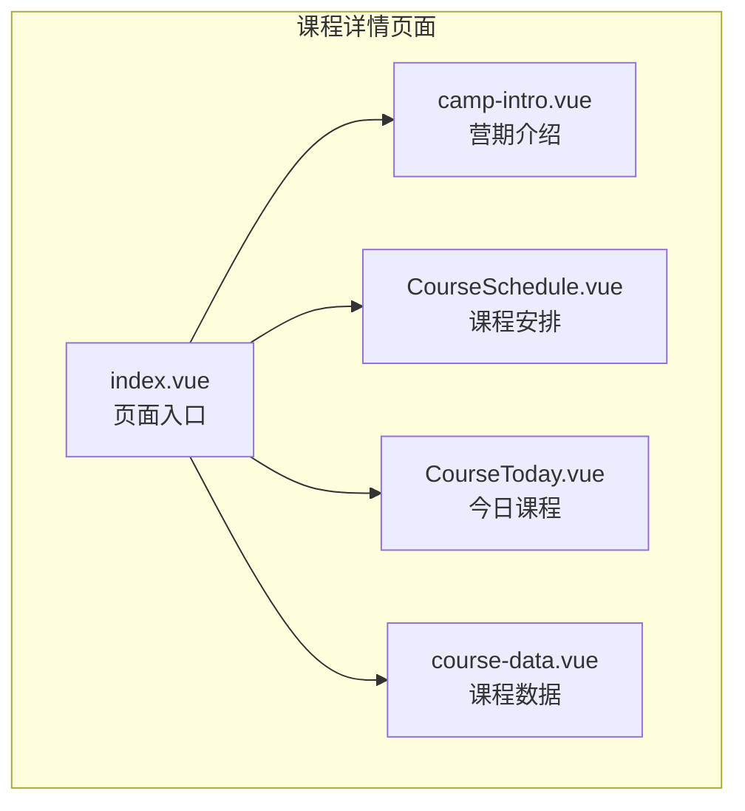
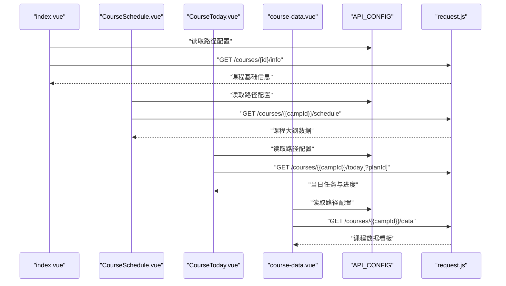
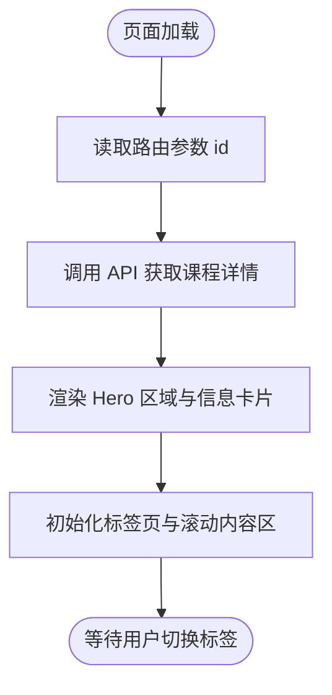
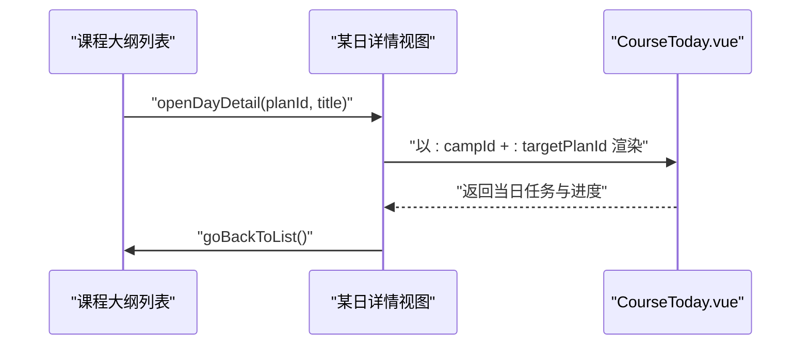
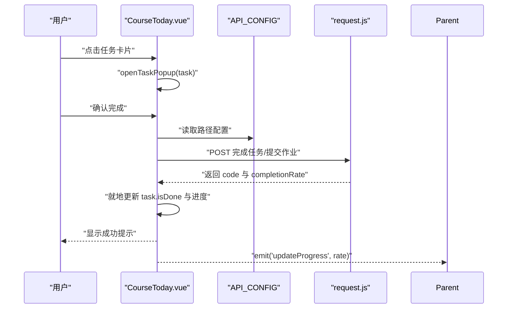
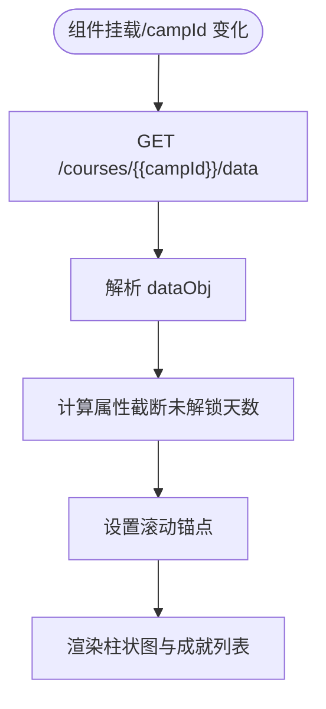
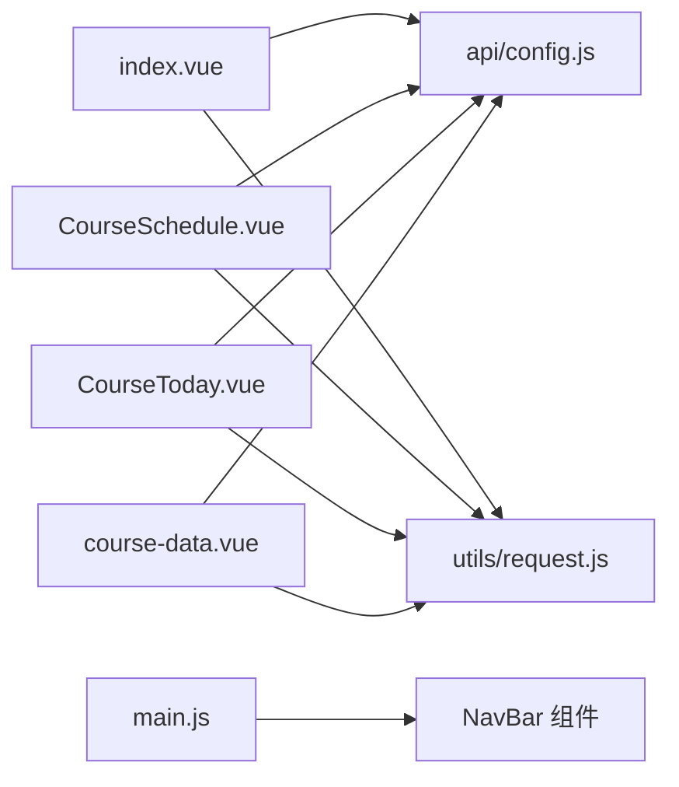

# 课程详情页面

<cite>
**本文引用的文件**
- [pages/CourseDetail/index.vue](file://pages/CourseDetail/index.vue)
- [pages/CourseDetail/components/CourseSchedule.vue](file://pages/CourseDetail/components/CourseSchedule.vue)
- [pages/CourseDetail/components/CourseToday.vue](file://pages/CourseDetail/components/CourseToday.vue)
- [pages/CourseDetail/components/course-data.vue](file://pages/CourseDetail/components/course-data.vue)
- [pages/CourseDetail/components/camp-intro.vue](file://pages/CourseDetail/components/camp-intro.vue)
- [api/config.js](file://api/config.js)
- [utils/request.js](file://utils/request.js)
- [pages.json](file://pages.json)
- [main.js](file://main.js)
- [doc/CourseToday打卡逻辑分析报告.md](file://doc/CourseToday打卡逻辑分析报告.md)
- [doc/course-data组件分析报告.md](file://doc/course-data组件分析报告.md)
- [doc/课程安排模块代码扫描报告.md](file://doc/课程安排模块代码扫描报告.md)
</cite>

## 目录
1. [简介](#简介)
2. [项目结构](#项目结构)
3. [核心组件](#核心组件)
4. [架构总览](#架构总览)
5. [详细组件分析](#详细组件分析)
6. [依赖分析](#依赖分析)
7. [性能考虑](#性能考虑)
8. [故障排查指南](#故障排查指南)
9. [结论](#结论)
10. [附录](#附录)

## 简介
本文件面向致良知教育项目的“课程详情页面”，系统化梳理页面整体架构、组件组织与数据流，深入解析“今日课程”打卡逻辑与任务状态管理、课程数据组件的设计模式与通信机制，并说明页面与用户认证系统的集成方式（权限验证与数据访问控制）。同时给出课程内容展示、学习进度计算与完成状态管理的实现细节，以及性能优化策略与用户体验提升方案。

## 项目结构
课程详情页面位于 pages/CourseDetail 目录，采用“页面 + 组件”的分层组织方式：
- 页面入口：pages/CourseDetail/index.vue
- 子组件：
  - 营期介绍：camp-intro.vue
  - 课程安排：CourseSchedule.vue
  - 今日课程：CourseToday.vue
  - 课程数据：course-data.vue

页面通过标签页切换承载各模块，使用统一的 NavBar 作为顶部导航，支持 FAB 悬浮按钮与安全区域适配。

**图表来源**
- [pages/CourseDetail/index.vue:1-65](file://pages/CourseDetail/index.vue#L1-L65)
- [pages/CourseDetail/components/camp-intro.vue:1-91](file://pages/CourseDetail/components/camp-intro.vue#L1-L91)
- [pages/CourseDetail/components/CourseSchedule.vue:1-122](file://pages/CourseDetail/components/CourseSchedule.vue#L1-L122)
- [pages/CourseDetail/components/CourseToday.vue:1-184](file://pages/CourseDetail/components/CourseToday.vue#L1-L184)
- [pages/CourseDetail/components/course-data.vue:1-100](file://pages/CourseDetail/components/course-data.vue#L1-L100)

**章节来源**
- [pages/CourseDetail/index.vue:1-146](file://pages/CourseDetail/index.vue#L1-L146)
- [pages.json:50-55](file://pages.json#L50-L55)

## 核心组件
- 页面容器与布局：index.vue 负责页面骨架、标签页切换、顶部 Hero 区域、FAB 悬浮按钮与滚动内容区。
- 营期介绍：camp-intro.vue 提供缘起、修习次第、同修契机与圣贤寄语等静态内容展示。
- 课程安排：CourseSchedule.vue 负责获取并渲染课程大纲（模块/周 -> 日），支持展开折叠与“某日详情”视图。
- 今日课程：CourseToday.vue 负责当日任务列表、进度条、任务弹窗与打卡提交流程。
- 课程数据：course-data.vue 负责总完成率、总天数、已完成天数、学习趋势柱状图与成就列表。

**章节来源**
- [pages/CourseDetail/index.vue:1-146](file://pages/CourseDetail/index.vue#L1-L146)
- [pages/CourseDetail/components/camp-intro.vue:1-91](file://pages/CourseDetail/components/camp-intro.vue#L1-L91)
- [pages/CourseDetail/components/CourseSchedule.vue:1-122](file://pages/CourseDetail/components/CourseSchedule.vue#L1-L122)
- [pages/CourseDetail/components/CourseToday.vue:1-184](file://pages/CourseDetail/components/CourseToday.vue#L1-L184)
- [pages/CourseDetail/components/course-data.vue:1-100](file://pages/CourseDetail/components/course-data.vue#L1-L100)

## 架构总览
页面采用“页面 + 多子组件”的组合架构，数据流自上而下：
- 页面 index.vue 通过 props 向子组件传递 campId，并在生命周期中拉取课程基础信息。
- CourseSchedule.vue 通过 API 获取课程大纲数据，支持切换到“某日详情”视图。
- CourseToday.vue 在“课程安排”详情视图中作为子组件嵌入，负责当日任务与打卡。
- course-data.vue 通过 API 获取课程数据看板，渲染总完成率与学习趋势。
- utils/request.js 统一封装请求，自动注入 Authorization 头，处理 401 与网络异常。

**图表来源**
- [pages/CourseDetail/index.vue:127-139](file://pages/CourseDetail/index.vue#L127-L139)
- [pages/CourseDetail/components/CourseSchedule.vue:154-179](file://pages/CourseDetail/components/CourseSchedule.vue#L154-L179)
- [pages/CourseDetail/components/CourseToday.vue:216-242](file://pages/CourseDetail/components/CourseToday.vue#L216-L242)
- [pages/CourseDetail/components/course-data.vue:169-199](file://pages/CourseDetail/components/course-data.vue#L169-L199)
- [api/config.js:52-56](file://api/config.js#L52-L56)
- [utils/request.js:7-67](file://utils/request.js#L7-L67)

## 详细组件分析

### 页面容器与布局（index.vue）
- 页面骨架：顶部 Hero 区域（徽章背景、批次标签）、信息卡片（标题、参与人数）、标签页栏（营期介绍、课程安排、今日课程、课程数据）。
- 滚动内容区：按当前标签页显示对应子组件。
- FAB 悬浮按钮：预留“进入小组交流”入口，当前为占位逻辑。
- 数据获取：onLoad 时读取路由参数 id，调用 API 获取课程详情信息并绑定到响应式变量。

**图表来源**
- [pages/CourseDetail/index.vue:142-145](file://pages/CourseDetail/index.vue#L142-L145)
- [pages/CourseDetail/index.vue:127-139](file://pages/CourseDetail/index.vue#L127-L139)

**章节来源**
- [pages/CourseDetail/index.vue:1-146](file://pages/CourseDetail/index.vue#L1-L146)

### 营期介绍（camp-intro.vue）
- 功能：展示缘起与发心、修习次第、同修契机与圣贤寄语。
- 设计：卡片式布局，统一圆角与阴影风格，与首页视觉保持一致。
- 数据：通过 props 接收 courseInfo，用于标题与徽章背景等展示。

**章节来源**
- [pages/CourseDetail/components/camp-intro.vue:1-91](file://pages/CourseDetail/components/camp-intro.vue#L1-L91)

### 课程安排（CourseSchedule.vue）
- 功能：渲染课程大纲（模块/周 -> 日），支持手风琴展开/折叠，点击日卡片进入“某日详情”视图。
- 数据流：通过 API 获取课程大纲，按模块与计划列表渲染；支持 selectedPlanId 控制“某日详情”视图。
- 交互：openDayDetail 切入 Detail 视图，goBackToList 返回大纲列表。
- 与今日课程组件的关系：在 Detail 视图中嵌入 CourseToday，支持按 planId 查询当日任务。

**图表来源**
- [pages/CourseDetail/components/CourseSchedule.vue:188-202](file://pages/CourseDetail/components/CourseSchedule.vue#L188-L202)
- [pages/CourseDetail/components/CourseSchedule.vue:114-117](file://pages/CourseDetail/components/CourseSchedule.vue#L114-L117)

**章节来源**
- [pages/CourseDetail/components/CourseSchedule.vue:1-212](file://pages/CourseDetail/components/CourseSchedule.vue#L1-L212)
- [doc/课程安排模块代码扫描报告.md:1-249](file://doc/课程安排模块代码扫描报告.md#L1-L249)

### 今日课程（CourseToday.vue）
- 功能：展示当日任务列表、学习进度条、任务弹窗与打卡提交。
- 任务类型与图标：根据 taskType 映射图标与颜色，区分必修/选修。
- 打卡流程：
  - 打开任务弹窗，根据任务类型渲染视频、阅读、作业或拓展任务。
  - 作业类型需输入内容，否则禁止提交。
  - 提交完成后，直接就地更新任务状态与进度，必要时重新拉取数据。
  - 通过 emit('updateProgress', rate) 通知父组件更新进度。
- 支持查看任意一天：targetPlanId 可选，若传入则按 planId 查询对应天的任务。

**图表来源**
- [pages/CourseDetail/components/CourseToday.vue:273-352](file://pages/CourseDetail/components/CourseToday.vue#L273-L352)
- [doc/CourseToday打卡逻辑分析报告.md:1-175](file://doc/CourseToday打卡逻辑分析报告.md#L1-L175)

**章节来源**
- [pages/CourseDetail/components/CourseToday.vue:1-379](file://pages/CourseDetail/components/CourseToday.vue#L1-L379)
- [doc/CourseToday打卡逻辑分析报告.md:1-175](file://doc/CourseToday打卡逻辑分析报告.md#L1-L175)

### 课程数据（course-data.vue）
- 功能：展示总完成率、总天数、已完成天数，渲染学习趋势柱状图与成就列表。
- 数据获取：通过 API 获取课程数据看板，按 campId 查询。
- 性能优化：使用计算属性 displayTrends 截断未来未解锁天数，避免渲染过多节点；滚动锚点设置到倒数第二天，提升可视体验。
- 状态映射：根据后端 status 值映射到 CSS 类（completed/missed/locked），柱子高度与数值显示按状态差异化呈现。
- 注意：当前样式未覆盖 MAKEUP（补卡）状态，如后端新增需补充对应样式。

**图表来源**
- [pages/CourseDetail/components/course-data.vue:123-143](file://pages/CourseDetail/components/course-data.vue#L123-L143)
- [pages/CourseDetail/components/course-data.vue:169-213](file://pages/CourseDetail/components/course-data.vue#L169-L213)
- [doc/course-data组件分析报告.md:1-162](file://doc/course-data组件分析报告.md#L1-L162)

**章节来源**
- [pages/CourseDetail/components/course-data.vue:1-573](file://pages/CourseDetail/components/course-data.vue#L1-L573)
- [doc/course-data组件分析报告.md:1-162](file://doc/course-data组件分析报告.md#L1-L162)

### 组件通信与事件
- CourseToday 通过 emit('updateProgress', rate) 通知父组件（CourseSchedule 或 index.vue）更新进度。
- CourseSchedule 在 Detail 视图中嵌入 CourseToday，通过 props 传递 campId 与 targetPlanId。
- 页面 index.vue 通过标签页切换承载各模块，便于统一管理与导航。

**章节来源**
- [pages/CourseDetail/components/CourseToday.vue:207-379](file://pages/CourseDetail/components/CourseToday.vue#L207-L379)
- [pages/CourseDetail/components/CourseSchedule.vue:114-117](file://pages/CourseDetail/components/CourseSchedule.vue#L114-L117)
- [pages/CourseDetail/index.vue:48-57](file://pages/CourseDetail/index.vue#L48-L57)

## 依赖分析
- API 配置：api/config.js 统一管理 API 基础地址与路径模板，支持 {{campId}}、{{planId}} 占位符替换。
- 请求封装：utils/request.js 统一注入 Authorization 头，处理 401 与网络异常，提供 get/post 快捷方法。
- 页面注册：main.js 在 Vue3 环境全局注册 NavBar 组件，便于页面复用。
- 页面路由：pages.json 配置课程详情页的导航样式与动画。

**图表来源**
- [api/config.js:8-57](file://api/config.js#L8-L57)
- [utils/request.js:1-98](file://utils/request.js#L1-L98)
- [main.js:18-25](file://main.js#L18-L25)
- [pages.json:50-55](file://pages.json#L50-L55)

**章节来源**
- [api/config.js:1-60](file://api/config.js#L1-L60)
- [utils/request.js:1-98](file://utils/request.js#L1-L98)
- [main.js:1-26](file://main.js#L1-L26)
- [pages.json:1-131](file://pages.json#L1-L131)

## 性能考虑
- 渲染优化
  - CourseSchedule：使用手风琴折叠减少一次性渲染节点数量。
  - course-data：计算属性 displayTrends 截断未解锁天数，避免渲染过多柱子；滚动锚点设置到倒数第二天，提升首屏可视性。
- 网络优化
  - request.js 统一处理 401 与网络异常，避免重复请求与无意义重试。
  - CourseToday 支持按 planId 查询当日任务，避免不必要的全量数据拉取。
- 交互优化
  - CourseToday 采用就地更新策略，直接修改任务状态与进度，减少二次请求。
  - FAB 悬浮按钮添加呼吸动画与点击反馈，提升交互感知。

[本节为通用性能建议，不直接分析具体文件]

## 故障排查指南
- 课程安排模块渲染异常
  - 现象：模块标题显示为“第0周: null”或重复“第x周:”前缀。
  - 原因：后端返回 moduleIndex 从 0 开始或 moduleName 为 null，或前后端字段不一致。
  - 建议：在 Network 面板检查 courses/{{campId}}/schedule 的响应，确认 moduleIndex 与 moduleName 的值。
- 今日课程打卡失败
  - 现象：提交后进度未更新或提示失败。
  - 原因：缺少 planId、参数缺失或后端返回非 200。
  - 建议：检查 CourseToday 的请求 URL 与 payload，确认 planId 与 taskId 是否正确传递。
- 课程数据看板样式缺失
  - 现象：补卡状态（MAKEUP）无对应样式。
  - 原因：CSS 未覆盖 MAKEUP 状态。
  - 建议：新增 makeup 状态的样式类，确保视觉一致性。

**章节来源**
- [doc/课程安排模块代码扫描报告.md:177-249](file://doc/课程安排模块代码扫描报告.md#L177-L249)
- [doc/CourseToday打卡逻辑分析报告.md:1-175](file://doc/CourseToday打卡逻辑分析报告.md#L1-L175)
- [doc/course-data组件分析报告.md:122-162](file://doc/course-data组件分析报告.md#L122-L162)

## 结论
课程详情页面通过清晰的页面容器与多子组件协作，实现了从课程信息展示到学习进度追踪的完整闭环。今日课程打卡采用就地更新策略，结合父组件事件通信，提升了交互效率与用户体验。课程数据组件通过计算属性与滚动锚点优化，兼顾了性能与可读性。后续可在补卡状态样式、模块标题渲染与跨端兼容性方面进一步完善。

[本节为总结性内容，不直接分析具体文件]

## 附录
- API 路径清单（来自 api/config.js）
  - 课程详情：/courses/{id}/info
  - 课程大纲：/courses/{{campId}}/schedule
  - 今日课程：/courses/{{campId}}/today[?planId]
  - 课程数据：/courses/{{campId}}/data
  - 任务打卡：/courses/plan/{{planId}}/task/complete
  - 提交作业：/courses/homework/submit（若后端提供）

**章节来源**
- [api/config.js:52-56](file://api/config.js#L52-L56)