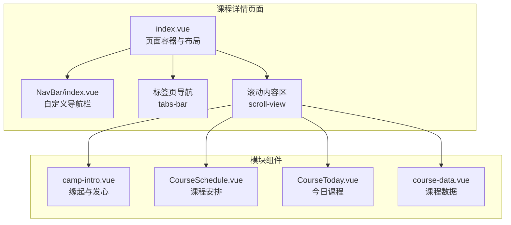
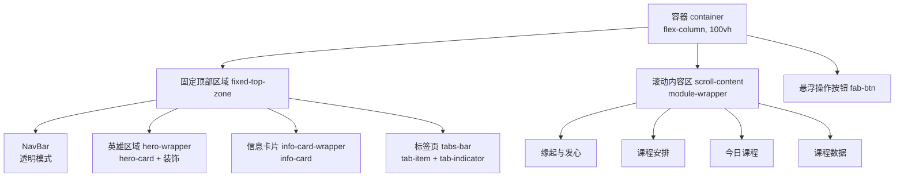
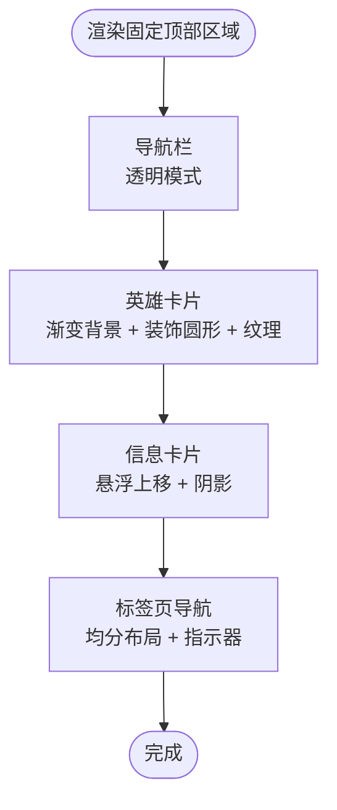
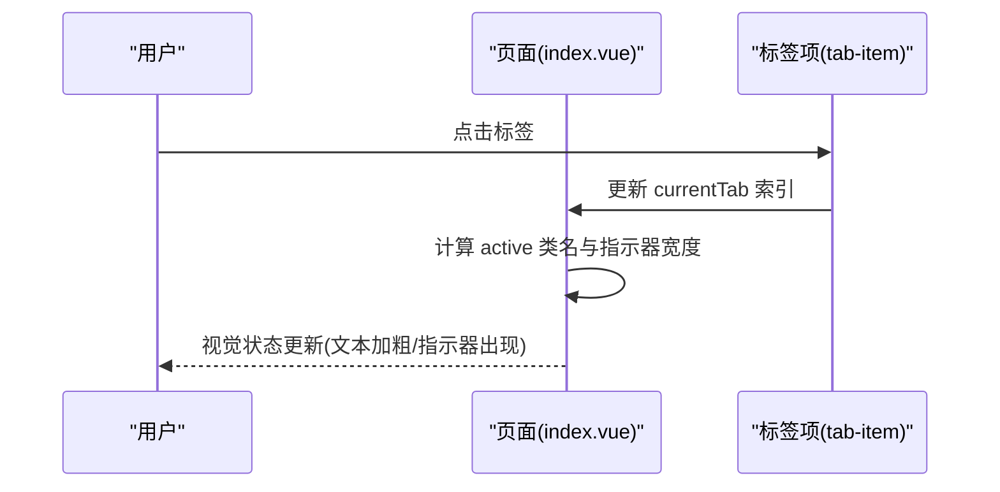
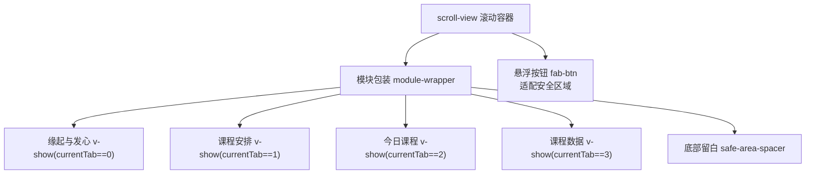
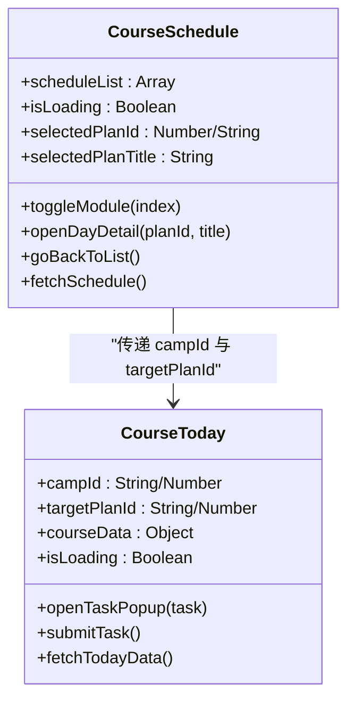
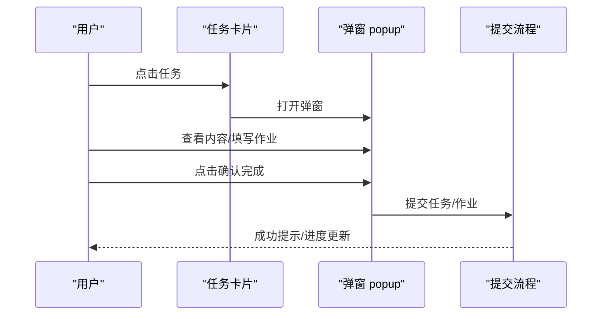
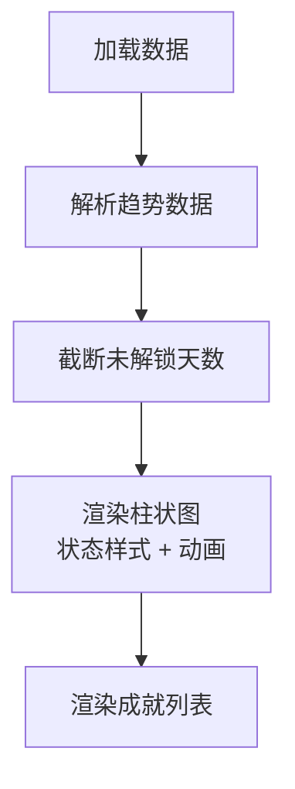
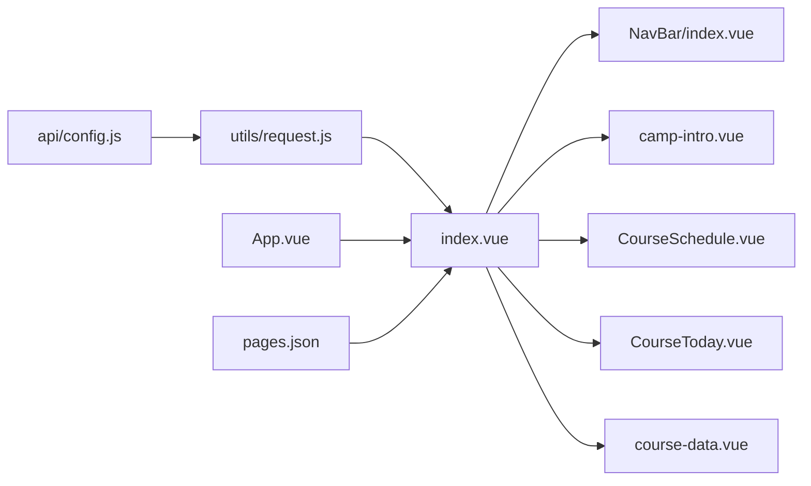

# 页面布局与架构

<cite>
**本文档引用的文件**
- [pages/CourseDetail/index.vue](file://pages/CourseDetail/index.vue)
- [pages/CourseDetail/components/course-data.vue](file://pages/CourseDetail/components/course-data.vue)
- [pages/CourseDetail/components/CourseToday.vue](file://pages/CourseDetail/components/CourseToday.vue)
- [pages/CourseDetail/components/CourseSchedule.vue](file://pages/CourseDetail/components/CourseSchedule.vue)
- [pages/CourseDetail/components/camp-intro.vue](file://pages/CourseDetail/components/camp-intro.vue)
- [components/NavBar/index.vue](file://components/NavBar/index.vue)
- [api/config.js](file://api/config.js)
- [utils/request.js](file://utils/request.js)
- [App.vue](file://App.vue)
- [pages.json](file://pages.json)
</cite>

## 目录
1. [引言](#引言)
2. [项目结构](#项目结构)
3. [核心组件](#核心组件)
4. [架构总览](#架构总览)
5. [详细组件分析](#详细组件分析)
6. [依赖关系分析](#依赖关系分析)
7. [性能考量](#性能考量)
8. [故障排除指南](#故障排除指南)
9. [结论](#结论)

## 引言
本文件面向课程详情页面的布局架构，系统性解析页面的整体布局设计、固定顶部区域的实现机制、标签页切换系统、滚动内容区域的布局策略以及组件层次结构与样式系统设计思路。目标是帮助开发者快速理解页面的组织方式，并为后续扩展与维护提供清晰的技术参考。

## 项目结构
课程详情页面位于 pages/CourseDetail 目录，采用“页面 + 组件”的分层组织：
- 页面层：index.vue 负责整体布局与状态管理
- 组件层：camp-intro、CourseSchedule、CourseToday、course-data 四个子组件分别承载不同模块内容
- 通用组件：NavBar 提供自定义导航栏
- 配置与工具：api/config.js 提供 API 配置，utils/request.js 提供统一请求封装

图表来源
- [pages/CourseDetail/index.vue:1-65](file://pages/CourseDetail/index.vue#L1-L65)
- [components/NavBar/index.vue:1-68](file://components/NavBar/index.vue#L1-L68)
- [pages/CourseDetail/components/camp-intro.vue:1-91](file://pages/CourseDetail/components/camp-intro.vue#L1-L91)
- [pages/CourseDetail/components/CourseSchedule.vue:1-122](file://pages/CourseDetail/components/CourseSchedule.vue#L1-L122)
- [pages/CourseDetail/components/CourseToday.vue:1-100](file://pages/CourseDetail/components/CourseToday.vue#L1-L100)
- [pages/CourseDetail/components/course-data.vue:1-100](file://pages/CourseDetail/components/course-data.vue#L1-L100)

章节来源
- [pages/CourseDetail/index.vue:1-65](file://pages/CourseDetail/index.vue#L1-L65)
- [pages.json:50-56](file://pages.json#L50-L56)

## 核心组件
- 页面容器与布局：index.vue 作为根容器，采用纵向 Flex 布局，固定顶部区域与滚动内容区分离，标签页导航位于固定区域，滚动内容区承载四个模块。
- 导航栏组件：NavBar 支持透明模式，用于覆盖在英雄区域上方，适配沉浸式视觉体验。
- 模块组件：
  - 缘起与发心：camp-intro.vue 提供结构化的介绍卡片与列表
  - 课程安排：CourseSchedule.vue 实现模块化时间轴与手风琴展开
  - 今日课程：CourseToday.vue 提供进度展示与任务列表，支持弹窗查看详情与提交
  - 课程数据：course-data.vue 提供完成率、趋势图与成就展示

章节来源
- [pages/CourseDetail/index.vue:1-65](file://pages/CourseDetail/index.vue#L1-L65)
- [components/NavBar/index.vue:1-68](file://components/NavBar/index.vue#L1-L68)
- [pages/CourseDetail/components/camp-intro.vue:1-91](file://pages/CourseDetail/components/camp-intro.vue#L1-L91)
- [pages/CourseDetail/components/CourseSchedule.vue:1-122](file://pages/CourseDetail/components/CourseSchedule.vue#L1-L122)
- [pages/CourseDetail/components/CourseToday.vue:1-100](file://pages/CourseDetail/components/CourseToday.vue#L1-L100)
- [pages/CourseDetail/components/course-data.vue:1-100](file://pages/CourseDetail/components/course-data.vue#L1-L100)

## 架构总览
页面采用“固定顶部 + 独立滚动区”的双区域布局：
- 固定顶部区域包含：导航栏、英雄区域、信息卡片、标签页导航
- 独立滚动区包含：四个模块内容，通过 v-show 控制显示与隐藏
- FAB 悬浮按钮位于右下角，适配安全区域

图表来源
- [pages/CourseDetail/index.vue:1-65](file://pages/CourseDetail/index.vue#L1-L65)
- [components/NavBar/index.vue:1-68](file://components/NavBar/index.vue#L1-L68)

## 详细组件分析

### 固定顶部区域设计
固定顶部区域通过相对定位与 z-index 管理层级，确保导航栏、英雄区域、信息卡片与标签页导航的正确堆叠顺序。英雄区域采用圆角矩形与径向渐变背景，结合装饰圆形与纹理层，营造沉浸式视觉体验。信息卡片通过负边距上移，形成“悬浮卡片”效果。

图表来源
- [pages/CourseDetail/index.vue:6-46](file://pages/CourseDetail/index.vue#L6-L46)
- [components/NavBar/index.vue:1-68](file://components/NavBar/index.vue#L1-L68)

章节来源
- [pages/CourseDetail/index.vue:6-46](file://pages/CourseDetail/index.vue#L6-L46)

### 标签页切换系统
标签页采用 v-for 动态生成，通过 currentTab 管理当前激活项，点击事件直接更新索引。活动状态通过类名 active 控制文本颜色、粗细与指示器宽度；指示器使用绝对定位与过渡动画，实现平滑的切换反馈。

图表来源
- [pages/CourseDetail/index.vue:33-44](file://pages/CourseDetail/index.vue#L33-L44)

章节来源
- [pages/CourseDetail/index.vue:77-81](file://pages/CourseDetail/index.vue#L77-L81)
- [pages/CourseDetail/index.vue:33-44](file://pages/CourseDetail/index.vue#L33-L44)

### 滚动内容区域布局策略
滚动内容区通过 scroll-view 实现独立滚动，模块内容通过 v-show 控制显示与隐藏，避免频繁销毁与重建。底部留白通过 safe-area-spacer 高度实现，防止内容被胶囊返回键遮挡。FAB 按钮使用固定定位与 env(safe-area-inset-bottom) 适配安全区域。

图表来源
- [pages/CourseDetail/index.vue:48-62](file://pages/CourseDetail/index.vue#L48-L62)

章节来源
- [pages/CourseDetail/index.vue:48-62](file://pages/CourseDetail/index.vue#L48-L62)

### 课程安排模块（CourseSchedule）
课程安排模块采用时间轴与手风琴折叠设计，支持模块展开/收起与日计划点击进入详情视图。详情视图通过粘性导航栏实现“贴顶”效果，使用毛玻璃背景与细边框增强层次感。

图表来源
- [pages/CourseDetail/components/CourseSchedule.vue:124-212](file://pages/CourseDetail/components/CourseSchedule.vue#L124-L212)
- [pages/CourseDetail/components/CourseToday.vue:186-379](file://pages/CourseDetail/components/CourseToday.vue#L186-L379)

章节来源
- [pages/CourseDetail/components/CourseSchedule.vue:124-212](file://pages/CourseDetail/components/CourseSchedule.vue#L124-L212)
- [pages/CourseDetail/components/CourseSchedule.vue:531-605](file://pages/CourseDetail/components/CourseSchedule.vue#L531-L605)

### 今日课程模块（CourseToday）
今日课程模块提供当日进度与任务列表，支持任务弹窗详情、视频/阅读/作业等多类型内容，以及任务完成提交流程。弹窗采用底部上拉样式，支持安全区域适配与输入计数。

图表来源
- [pages/CourseDetail/components/CourseToday.vue:273-352](file://pages/CourseDetail/components/CourseToday.vue#L273-L352)

章节来源
- [pages/CourseDetail/components/CourseToday.vue:186-379](file://pages/CourseDetail/components/CourseToday.vue#L186-L379)

### 课程数据模块（course-data）
课程数据模块提供完成率概览、学习趋势柱状图与成就列表。趋势图采用截断策略仅展示已解锁天数，支持横向滚动与动画入场。柱状图根据状态呈现不同样式与颜色。

图表来源
- [pages/CourseDetail/components/course-data.vue:123-143](file://pages/CourseDetail/components/course-data.vue#L123-L143)
- [pages/CourseDetail/components/course-data.vue:344-478](file://pages/CourseDetail/components/course-data.vue#L344-L478)

章节来源
- [pages/CourseDetail/components/course-data.vue:102-214](file://pages/CourseDetail/components/course-data.vue#L102-L214)

### 缘起与发心模块（camp-intro）
缘起与发心模块采用卡片化布局，提供结构化的内容展示，包括“缘起与发心”“修习次第”“同修契机”与“圣贤寄语”四大板块，统一使用首页风格的圆角与阴影。

章节来源
- [pages/CourseDetail/components/camp-intro.vue:1-91](file://pages/CourseDetail/components/camp-intro.vue#L1-L91)

## 依赖关系分析
- 页面与组件：index.vue 通过 import 引入各模块组件，并通过 v-show 控制显示
- 导航栏：NavBar 支持透明模式，用于覆盖在英雄区域上方
- API 与请求：api/config.js 提供路径配置，utils/request.js 统一处理请求与鉴权
- 全局样式：App.vue 定义品牌色与全局卡片样式，pages.json 设置页面样式与导航风格

图表来源
- [pages/CourseDetail/index.vue:72-75](file://pages/CourseDetail/index.vue#L72-L75)
- [api/config.js:8-57](file://api/config.js#L8-L57)
- [utils/request.js:1-98](file://utils/request.js#L1-L98)
- [App.vue:15-39](file://App.vue#L15-L39)
- [pages.json:50-56](file://pages.json#L50-L56)

章节来源
- [pages/CourseDetail/index.vue:72-75](file://pages/CourseDetail/index.vue#L72-L75)
- [api/config.js:8-57](file://api/config.js#L8-L57)
- [utils/request.js:1-98](file://utils/request.js#L1-L98)
- [App.vue:15-39](file://App.vue#L15-L39)
- [pages.json:50-56](file://pages.json#L50-L56)

## 性能考量
- 模块懒加载：通过 v-show 控制模块显示，避免重复渲染与资源浪费
- 计算属性优化：课程数据模块使用 computed 截断趋势数组，减少渲染量
- 动画与过渡：标签页指示器与柱状图动画采用 CSS 过渡，保持流畅体验
- 请求封装：统一请求处理与鉴权，减少重复逻辑与错误处理成本

## 故障排除指南
- 数据加载失败：检查 API 配置与网络状态，确认请求封装中的错误提示
- 登录过期：请求拦截器会自动处理 401，清除 token 并跳转登录页
- 页面样式异常：确认全局样式与页面样式配置，检查安全区域适配

章节来源
- [utils/request.js:24-67](file://utils/request.js#L24-L67)
- [pages.json:50-56](file://pages.json#L50-L56)

## 结论
课程详情页面通过“固定顶部 + 独立滚动区”的双区域布局，结合模块化组件与统一的视觉风格，实现了清晰的信息层次与良好的用户体验。标签页切换系统简洁直观，滚动内容区具备良好的可扩展性。建议在后续迭代中持续关注性能优化与跨设备兼容性，以进一步提升稳定性与一致性。