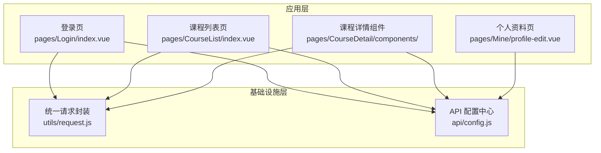
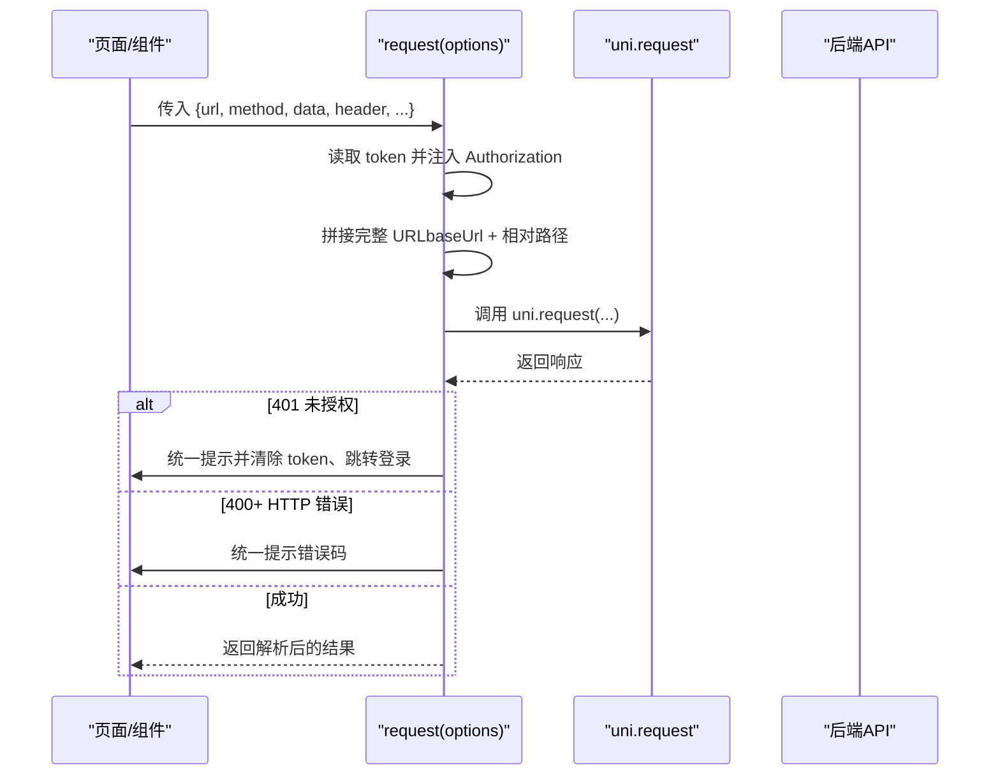
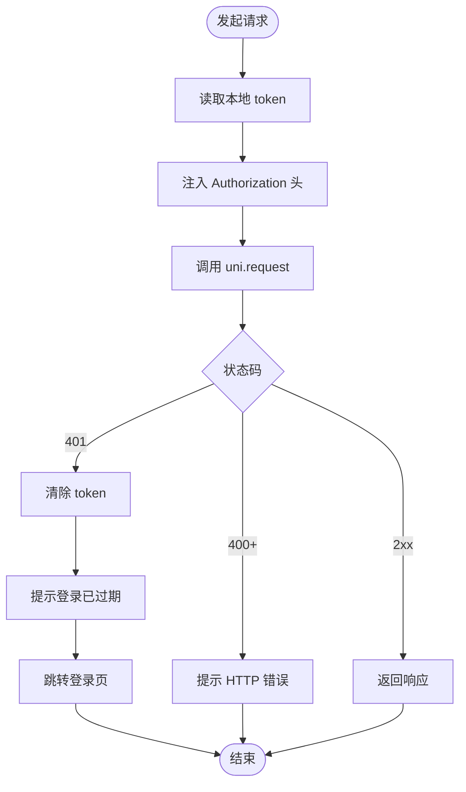
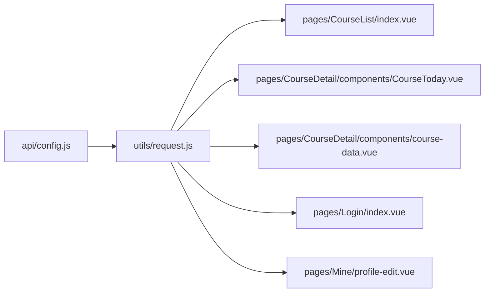

# API 使用规范

<cite>
**本文引用的文件**
- [utils/request.js](file://utils/request.js)
- [api/config.js](file://api/config.js)
- [pages/Login/index.vue](file://pages/Login/index.vue)
- [pages/CourseList/index.vue](file://pages/CourseList/index.vue)
- [pages/CourseDetail/components/CourseToday.vue](file://pages/CourseDetail/components/CourseToday.vue)
- [pages/CourseDetail/components/course-data.vue](file://pages/CourseDetail/components/course-data.vue)
- [pages/Mine/profile-edit.vue](file://pages/Mine/profile-edit.vue)
- [main.js](file://main.js)
</cite>

## 目录
1. [简介](#简介)
2. [项目结构](#项目结构)
3. [核心组件](#核心组件)
4. [架构总览](#架构总览)
5. [详细组件分析](#详细组件分析)
6. [依赖关系分析](#依赖关系分析)
7. [性能考量](#性能考量)
8. [故障排查指南](#故障排查指南)
9. [结论](#结论)
10. [附录](#附录)

## 简介
本规范面向致良知教育项目，系统性说明统一请求封装的使用方法、GET/POST 快捷方法、Token 管理机制、API 配置管理以及错误处理与用户体验优化最佳实践。目标是帮助开发者在不直接调用底层 uni.request 的前提下，安全、稳定地进行前后端交互。

## 项目结构
项目采用基于页面与组件的组织方式，API 相关能力集中在以下位置：
- 统一请求封装：utils/request.js
- API 配置中心：api/config.js
- 页面与组件中的具体调用示例：pages/* 与 components/*

图表来源
- [utils/request.js:1-98](file://utils/request.js#L1-L98)
- [api/config.js:1-60](file://api/config.js#L1-L60)
- [pages/Login/index.vue:138-454](file://pages/Login/index.vue#L138-L454)
- [pages/CourseList/index.vue:80-254](file://pages/CourseList/index.vue#L80-L254)
- [pages/CourseDetail/components/CourseToday.vue:186-379](file://pages/CourseDetail/components/CourseToday.vue#L186-L379)
- [pages/CourseDetail/components/course-data.vue:102-214](file://pages/CourseDetail/components/course-data.vue#L102-L214)
- [pages/Mine/profile-edit.vue:117-314](file://pages/Mine/profile-edit.vue#L117-L314)

章节来源
- [utils/request.js:1-98](file://utils/request.js#L1-L98)
- [api/config.js:1-60](file://api/config.js#L1-L60)
- [pages/Login/index.vue:138-454](file://pages/Login/index.vue#L138-L454)
- [pages/CourseList/index.vue:80-254](file://pages/CourseList/index.vue#L80-L254)
- [pages/CourseDetail/components/CourseToday.vue:186-379](file://pages/CourseDetail/components/CourseToday.vue#L186-L379)
- [pages/CourseDetail/components/course-data.vue:102-214](file://pages/CourseDetail/components/course-data.vue#L102-L214)
- [pages/Mine/profile-edit.vue:117-314](file://pages/Mine/profile-edit.vue#L117-L314)

## 核心组件
- 统一请求封装 request(options)
  - 自动从本地存储读取 Token，并注入到 Authorization 请求头
  - 自动拼接 API 基础地址与相对路径
  - 统一处理 401 未授权、400+ HTTP 错误与网络异常
  - 返回 Promise，便于在组件中使用 async/await
- GET/POST 快捷方法
  - get(url, params, options)：GET 请求，params 作为查询参数
  - post(url, data, options)：POST 请求，默认 content-type 为 application/json
- API 配置中心 API_CONFIG
  - baseUrl：后端服务基础地址
  - paths：接口路径常量集合，便于集中维护与跨页面复用

章节来源
- [utils/request.js:7-95](file://utils/request.js#L7-L95)
- [api/config.js:8-57](file://api/config.js#L8-L57)

## 架构总览
统一请求封装在各页面/组件中被调用，API 配置中心提供统一的路径与基础地址，形成“配置—封装—调用”的清晰分层。

图表来源
- [utils/request.js:7-67](file://utils/request.js#L7-L67)

## 详细组件分析

### 统一请求封装 request(options)
- 参数配置
  - options.url：支持绝对 URL 或相对路径；相对路径将与 API_CONFIG.baseUrl 拼接
  - options.method：GET/POST 等
  - options.data：请求体数据（POST）
  - options.header：自定义请求头；若未提供，将按需注入 Authorization
- 返回值处理
  - 成功：返回 uni.request 的响应对象
  - 401：统一提示“登录已过期”，清除本地 token，并延迟跳转至登录页
  - 400+：统一提示 HTTP 状态码
  - fail：统一提示“网络连接异常”
- 使用建议
  - 优先使用 get/post 快捷方法；仅在需要特殊 header 或复杂场景时直接调用 request
  - 在组件中通过 async/await 使用，配合 loading 与错误提示

章节来源
- [utils/request.js:7-67](file://utils/request.js#L7-L67)

### GET/POST 快捷方法
- get(url, params, options)
  - url：可使用 API_CONFIG.paths 中的常量
  - params：查询参数对象，将被序列化为查询字符串
  - options：可选扩展，将与默认配置合并
- post(url, data, options)
  - 默认 header 中 content-type 设为 application/json
  - data：请求体 JSON 对象
- 使用示例
  - 课程列表页使用 get(API_CONFIG.paths.courseList, {pageNum, pageSize, status})
  - 课程今日数据使用 request({ url, method: 'GET' }) 或 get
  - 任务完成提交使用 request({ url, method: 'POST', data })

章节来源
- [utils/request.js:72-95](file://utils/request.js#L72-L95)
- [pages/CourseList/index.vue:175-237](file://pages/CourseList/index.vue#L175-L237)
- [pages/CourseDetail/components/CourseToday.vue:216-352](file://pages/CourseDetail/components/CourseToday.vue#L216-L352)

### API 配置管理
- 基础地址与路径常量
  - API_CONFIG.baseUrl：统一后端基础地址
  - API_CONFIG.paths：集中定义接口路径常量，便于跨页面共享
- 环境切换
  - 代码中存在开发环境判断标记（isDev），可在构建阶段或运行时根据环境变量切换 baseUrl
- 最佳实践
  - 所有接口调用均通过 API_CONFIG.paths 引用，避免硬编码
  - 路径中含占位符（如 {{campId}}）时，在调用前替换，再传给 request

章节来源
- [api/config.js:8-57](file://api/config.js#L8-L57)
- [pages/CourseDetail/components/CourseToday.vue:224-227](file://pages/CourseDetail/components/CourseToday.vue#L224-L227)
- [pages/CourseDetail/components/course-data.vue:174-179](file://pages/CourseDetail/components/course-data.vue#L174-L179)

### Token 管理机制
- 自动注入
  - request 在每次请求前从本地存储读取 token，并注入到 Authorization 请求头
- 过期处理
  - 若后端返回 401，request 统一清除本地 token 并提示“登录已过期”，随后跳转登录页
- 重新登录流程
  - 登录页在成功登录后写入 token 与用户信息，随后跳转首页
  - 课程列表页在进入时会校验 token，若不存在则提示并跳转登录

图表来源
- [utils/request.js:8-44](file://utils/request.js#L8-L44)
- [pages/Login/index.vue:214-260](file://pages/Login/index.vue#L214-L260)
- [pages/CourseList/index.vue:190-196](file://pages/CourseList/index.vue#L190-L196)

章节来源
- [utils/request.js:8-44](file://utils/request.js#L8-L44)
- [pages/Login/index.vue:214-260](file://pages/Login/index.vue#L214-L260)
- [pages/CourseList/index.vue:190-196](file://pages/CourseList/index.vue#L190-L196)

### 错误处理策略与用户体验优化
- 统一错误提示
  - request 对 401、400+ 与网络异常进行统一 toast 提示
- 组件级容错
  - 课程列表页在获取数据失败时展示“网络请求失败”提示
  - 课程今日数据组件在获取失败时提供“点击重试”入口
- 用户体验
  - 在关键操作（登录、提交任务）前后使用 loading 与 toast
  - 对必填字段进行前端校验，减少无效请求

章节来源
- [utils/request.js:47-64](file://utils/request.js#L47-L64)
- [pages/CourseList/index.vue:227-231](file://pages/CourseList/index.vue#L227-L231)
- [pages/CourseDetail/components/CourseToday.vue:342-345](file://pages/CourseDetail/components/CourseToday.vue#L342-L345)

## 依赖关系分析
- 组件依赖 request 与 API_CONFIG
  - 课程列表页依赖 get 与 API_CONFIG.paths.courseList
  - 课程今日数据组件依赖 request 与 API_CONFIG.paths.todayCourse
  - 登录页直接使用 uni.request（不推荐），但可参考其 token 写入与跳转逻辑
- request 依赖 API_CONFIG
  - request 通过 API_CONFIG.baseUrl 与 paths 拼接最终 URL

图表来源
- [api/config.js:8-57](file://api/config.js#L8-L57)
- [utils/request.js:1-98](file://utils/request.js#L1-L98)
- [pages/CourseList/index.vue:83-84](file://pages/CourseList/index.vue#L83-L84)
- [pages/CourseDetail/components/CourseToday.vue:189-189](file://pages/CourseDetail/components/CourseToday.vue#L189-L189)
- [pages/CourseDetail/components/course-data.vue:105-105](file://pages/CourseDetail/components/course-data.vue#L105-L105)
- [pages/Login/index.vue:139-139](file://pages/Login/index.vue#L139-L139)
- [pages/Mine/profile-edit.vue:118-118](file://pages/Mine/profile-edit.vue#L118-L118)

章节来源
- [api/config.js:8-57](file://api/config.js#L8-L57)
- [utils/request.js:1-98](file://utils/request.js#L1-L98)
- [pages/CourseList/index.vue:83-84](file://pages/CourseList/index.vue#L83-L84)
- [pages/CourseDetail/components/CourseToday.vue:189-189](file://pages/CourseDetail/components/CourseToday.vue#L189-L189)
- [pages/CourseDetail/components/course-data.vue:105-105](file://pages/CourseDetail/components/course-data.vue#L105-L105)
- [pages/Login/index.vue:139-139](file://pages/Login/index.vue#L139-L139)
- [pages/Mine/profile-edit.vue:118-118](file://pages/Mine/profile-edit.vue#L118-L118)

## 性能考量
- 请求合并与节流
  - 在列表加载中使用分页参数（pageNum/pageSize）控制请求规模
- 缓存与本地存储
  - 合理利用本地 token 与用户信息，减少重复登录
- UI 交互
  - 在请求期间显示 loading，避免频繁点击导致重复请求
- 资源优化
  - 图片上传使用 uni.uploadFile，避免在请求体中传输大体积数据

章节来源
- [pages/CourseList/index.vue:206-236](file://pages/CourseList/index.vue#L206-L236)
- [pages/Mine/profile-edit.vue:215-226](file://pages/Mine/profile-edit.vue#L215-L226)

## 故障排查指南
- 401 未授权
  - 现象：提示“登录已过期”，自动清除 token 并跳转登录
  - 排查：确认本地 token 是否存在且有效；检查后端 token 过期策略
- 400+ HTTP 错误
  - 现象：提示具体 HTTP 状态码
  - 排查：核对请求路径、参数与权限；检查 API_CONFIG.paths 与 baseUrl
- 网络异常
  - 现象：提示“网络连接异常”
  - 排查：检查设备网络、域名与代理；确认 API_CONFIG.baseUrl 正确
- 登录后无法跳转
  - 现象：登录成功但未进入首页
  - 排查：确认登录页写入 token 与用户信息的逻辑；检查页面跳转方法

章节来源
- [utils/request.js:29-64](file://utils/request.js#L29-L64)
- [pages/Login/index.vue:214-260](file://pages/Login/index.vue#L214-L260)

## 结论
通过统一请求封装与 API 配置中心，项目实现了清晰的调用规范与一致的错误处理体验。建议在后续迭代中：
- 统一使用 request/get/post，避免直接调用 uni.request
- 在构建阶段完善环境变量与 baseUrl 切换逻辑
- 对关键接口增加重试与降级策略，提升稳定性

## 附录

### API 使用清单（示例）
- 获取课程列表
  - 使用 get(API_CONFIG.paths.courseList, {pageNum, pageSize, status})
- 获取今日课程
  - 使用 request({ url: API_CONFIG.paths.todayCourse.replace('{{campId}}', id), method: 'GET' })
- 提交任务完成
  - 使用 request({ url: API_CONFIG.paths.completeTask.replace('{{planId}}', planId), method: 'POST', data: { taskId } })

章节来源
- [pages/CourseList/index.vue:175-237](file://pages/CourseList/index.vue#L175-L237)
- [pages/CourseDetail/components/CourseToday.vue:216-352](file://pages/CourseDetail/components/CourseToday.vue#L216-L352)