# 代码规范标准

<cite>
**本文档引用的文件**
- [main.js](file://main.js)
- [App.vue](file://App.vue)
- [pages.json](file://pages.json)
- [utils/request.js](file://utils/request.js)
- [api/config.js](file://api/config.js)
- [components/NavBar/index.vue](file://components/NavBar/index.vue)
- [components/home-view/home-view.vue](file://components/home-view/home-view.vue)
- [pages/Login/index.vue](file://pages/Login/index.vue)
- [pages/Login/complete-info.vue](file://pages/Login/complete-info.vue)
- [pages/CourseDetail/index.vue](file://pages/CourseDetail/index.vue)
- [pages/Login/china-area.js](file://pages/Login/china-area.js)
</cite>

## 目录
1. [简介](#简介)
2. [项目结构](#项目结构)
3. [核心组件](#核心组件)
4. [架构概览](#架构概览)
5. [详细组件分析](#详细组件分析)
6. [依赖关系分析](#依赖关系分析)
7. [性能考虑](#性能考虑)
8. [故障排除指南](#故障排除指南)
9. [结论](#结论)

## 简介

致良知教育项目是一个基于 UniApp 框架开发的跨平台教育应用，采用 Vue.js 3.x + TypeScript 的现代化开发模式。该项目专注于传统文化教育，提供课程学习、志愿者管理、打卡签到等核心功能。本文档旨在建立统一的代码规范标准，确保代码质量、可维护性和团队协作效率。

## 项目结构

项目采用模块化的目录结构，遵循功能域划分原则：

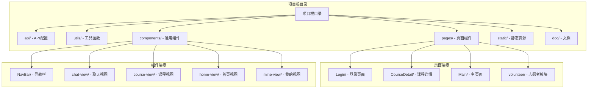

**图表来源**
- [main.js:1-26](file://main.js#L1-L26)
- [pages.json:1-131](file://pages.json#L1-L131)

**章节来源**
- [main.js:1-26](file://main.js#L1-L26)
- [pages.json:1-131](file://pages.json#L1-L131)

## 核心组件

### 应用入口与配置

项目采用双框架支持策略，兼容 Vue 2 和 Vue 3：

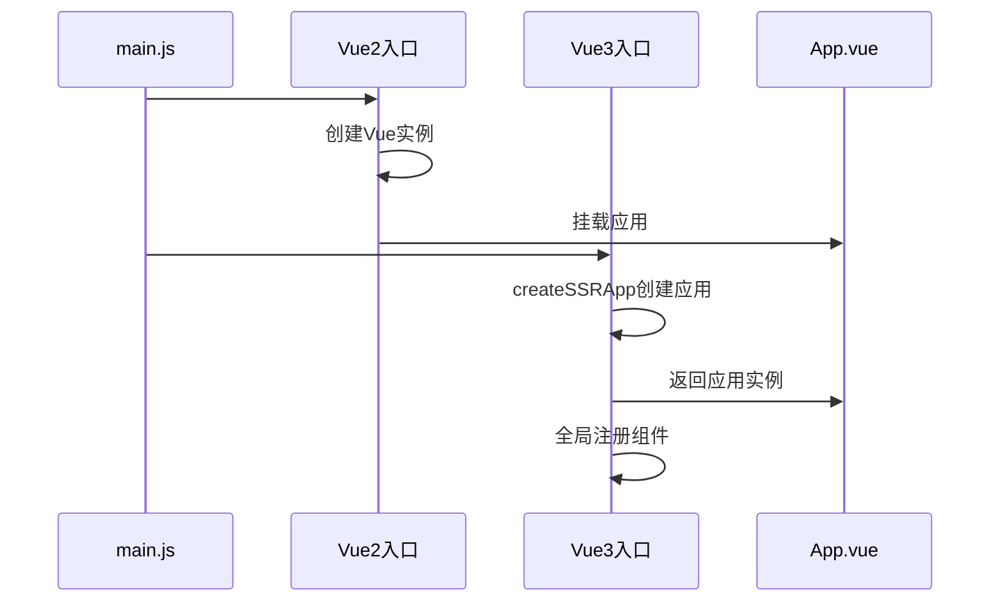

**图表来源**
- [main.js:1-26](file://main.js#L1-L26)

### API 配置管理

API 配置采用集中式管理，支持开发环境切换：

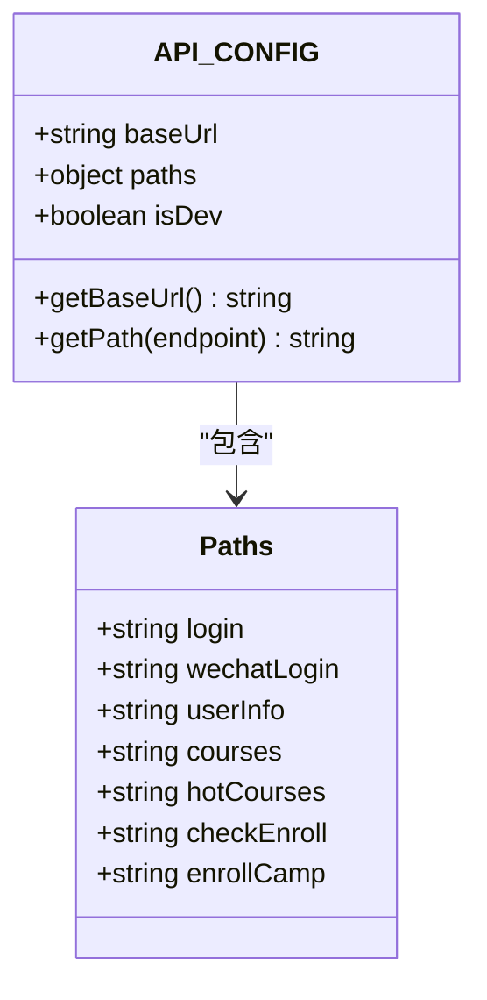

**图表来源**
- [api/config.js:1-60](file://api/config.js#L1-L60)

**章节来源**
- [main.js:1-26](file://main.js#L1-L26)
- [api/config.js:1-60](file://api/config.js#L1-L60)

## 架构概览

项目采用分层架构设计，各层职责清晰：

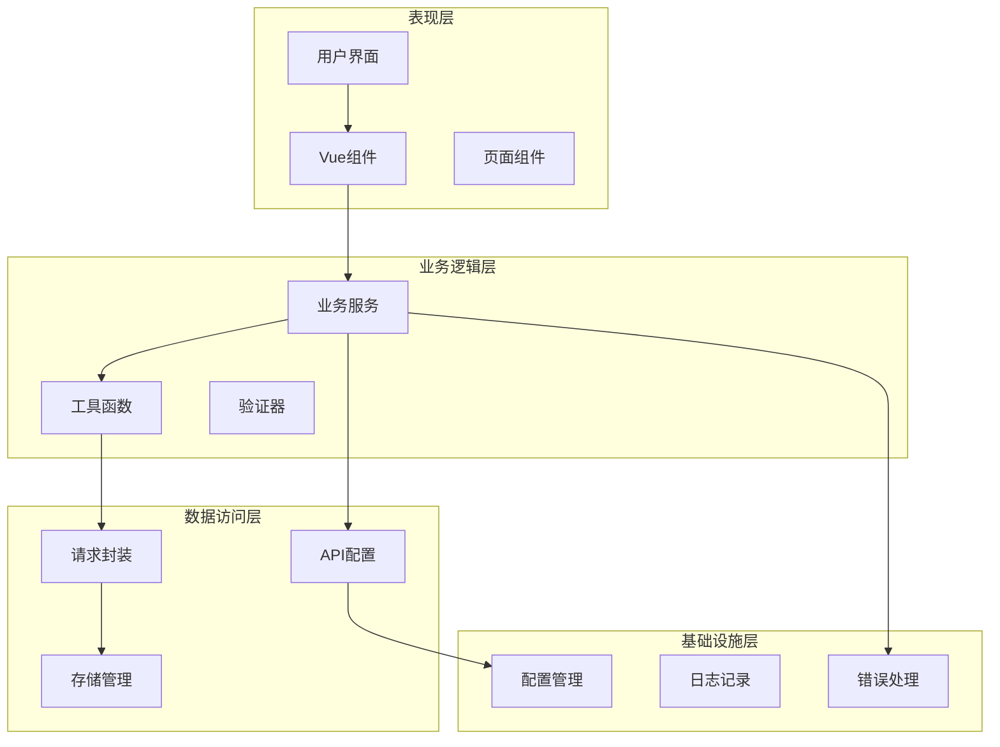

**图表来源**
- [utils/request.js:1-98](file://utils/request.js#L1-L98)
- [pages.json:1-131](file://pages.json#L1-L131)

## 详细组件分析

### 导航栏组件 (NavBar)

导航栏组件采用 Composition API 设计，支持多种显示模式：

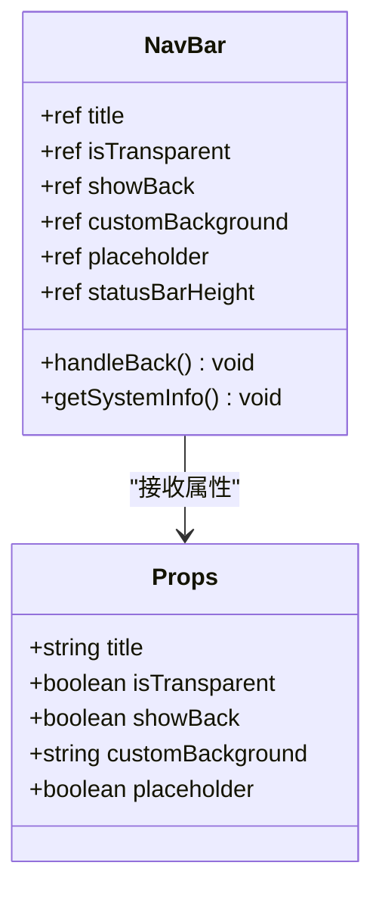

**图表来源**
- [components/NavBar/index.vue:23-49](file://components/NavBar/index.vue#L23-L49)

### 首页视图组件 (HomeView)

首页视图采用复杂的动画系统和响应式设计：

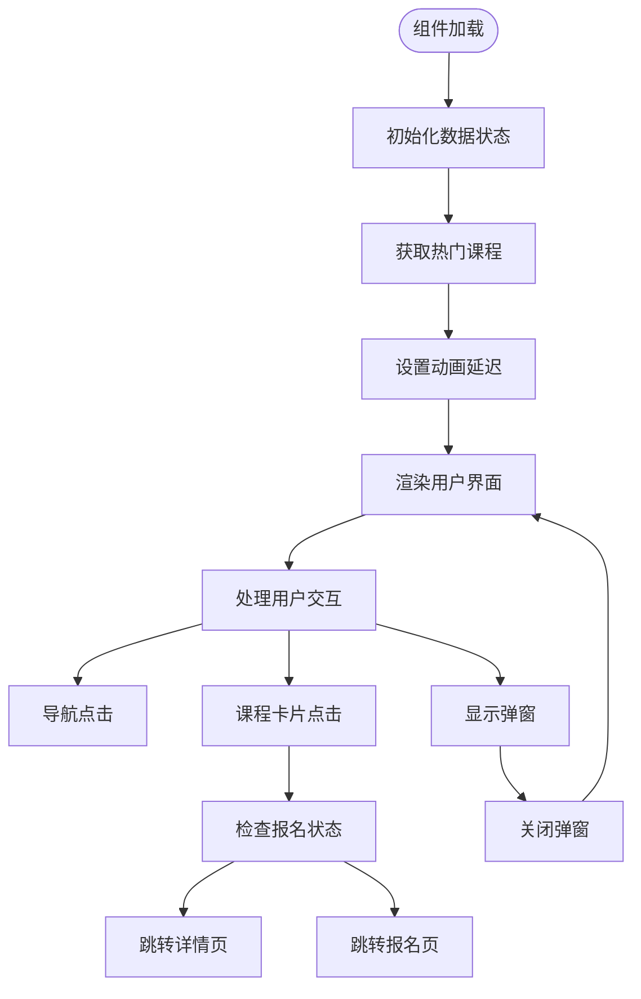

**图表来源**
- [components/home-view/home-view.vue:137-262](file://components/home-view/home-view.vue#L137-L262)

### 登录页面组件

登录页面采用渐进式增强的设计理念：

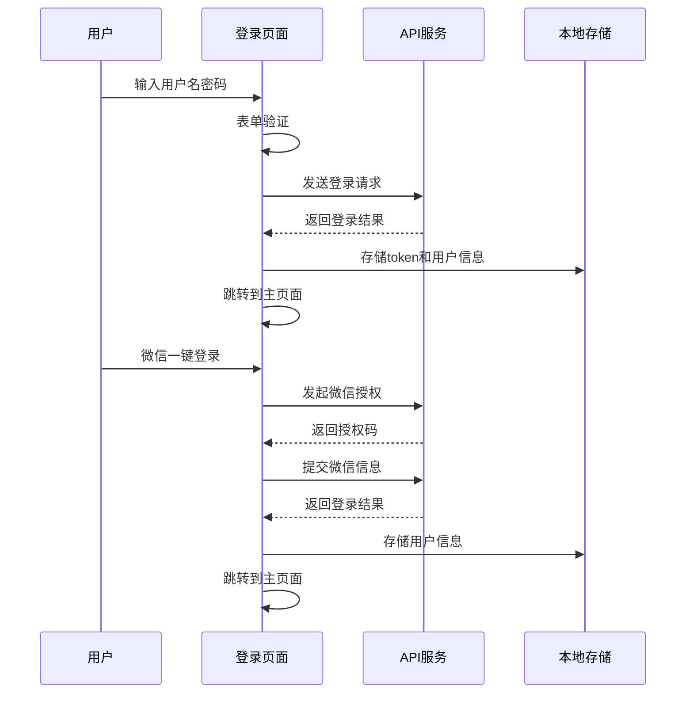

**图表来源**
- [pages/Login/index.vue:138-453](file://pages/Login/index.vue#L138-L453)

**章节来源**
- [components/NavBar/index.vue:1-68](file://components/NavBar/index.vue#L1-L68)
- [components/home-view/home-view.vue:1-772](file://components/home-view/home-view.vue#L1-L772)
- [pages/Login/index.vue:1-900](file://pages/Login/index.vue#L1-L900)

## 依赖关系分析

### 模块导入导出规范

项目中的模块导入导出遵循统一的规范：

```mermaid
graph LR
subgraph "导入规范"
A[相对路径导入] --> B['import from "./utils/request"']
C[绝对路径导入] --> D['import from "@/api/config"']
E[默认导入] --> F['import request from "@/utils/request"']
G[命名导入] --> H['import { API_CONFIG } from "@/api/config"']
I[混合导入] --> J['import { request, get, post } from "@/utils/request"']
end
subgraph "导出规范"
K[默认导出] --> L['export default API_CONFIG']
M[命名导出] --> N['export const API_CONFIG']
O[具名导出] --> P['export { request, get, post }']
end
```

**图表来源**
- [utils/request.js:1-98](file://utils/request.js#L1-L98)
- [api/config.js:1-60](file://api/config.js#L1-L60)

### 组件依赖关系

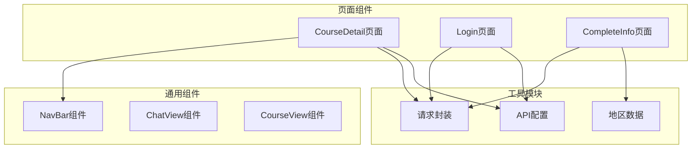

**图表来源**
- [pages/CourseDetail/index.vue:67-76](file://pages/CourseDetail/index.vue#L67-L76)
- [pages/Login/index.vue:139-139](file://pages/Login/index.vue#L139-L139)
- [pages/Login/complete-info.vue:139-141](file://pages/Login/complete-info.vue#L139-L141)

**章节来源**
- [utils/request.js:1-98](file://utils/request.js#L1-L98)
- [pages/CourseDetail/index.vue:67-76](file://pages/CourseDetail/index.vue#L67-L76)
- [pages/Login/complete-info.vue:139-141](file://pages/Login/complete-info.vue#L139-L141)

## 性能考虑

### 代码分割与懒加载

项目采用条件编译实现多框架支持，减少不必要的代码加载：

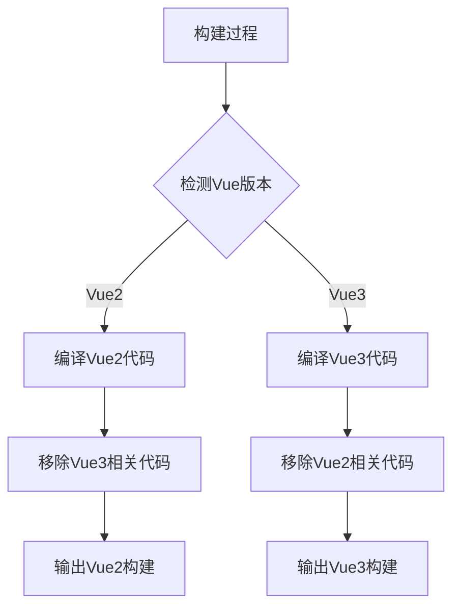

### 动画性能优化

首页视图采用了精心设计的动画系统，通过 CSS 动画替代 JavaScript 动画以提升性能：

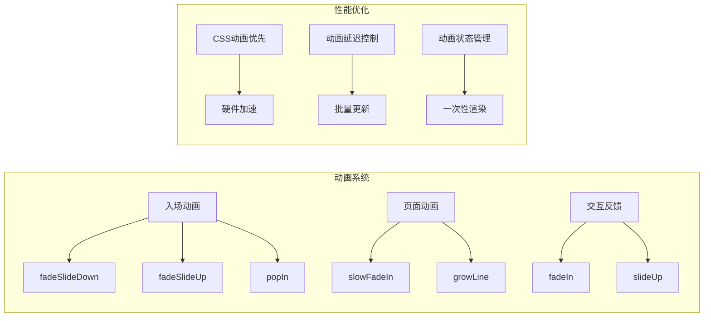

**图表来源**
- [components/home-view/home-view.vue:269-297](file://components/home-view/home-view.vue#L269-L297)

## 故障排除指南

### 常见问题诊断

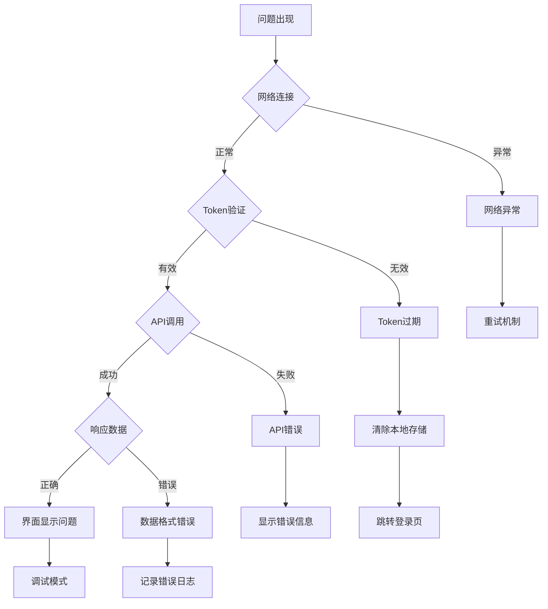

### 错误处理流程

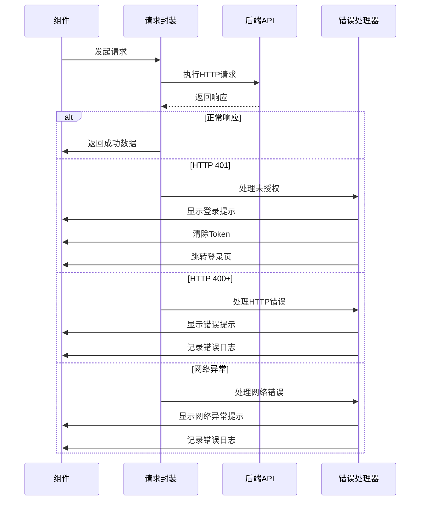

**图表来源**
- [utils/request.js:24-67](file://utils/request.js#L24-L67)

**章节来源**
- [utils/request.js:1-98](file://utils/request.js#L1-L98)

## 结论

致良知教育项目的代码规范标准体现了现代前端开发的最佳实践，通过统一的架构设计、严格的代码组织和完善的错误处理机制，确保了项目的高质量和高可维护性。建议团队在日常开发中严格遵守本文档的各项规范，持续改进代码质量和用户体验。