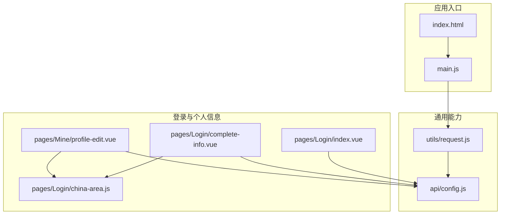
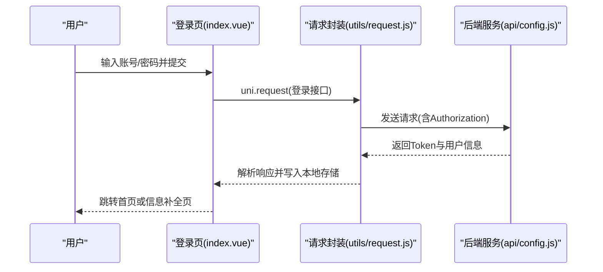
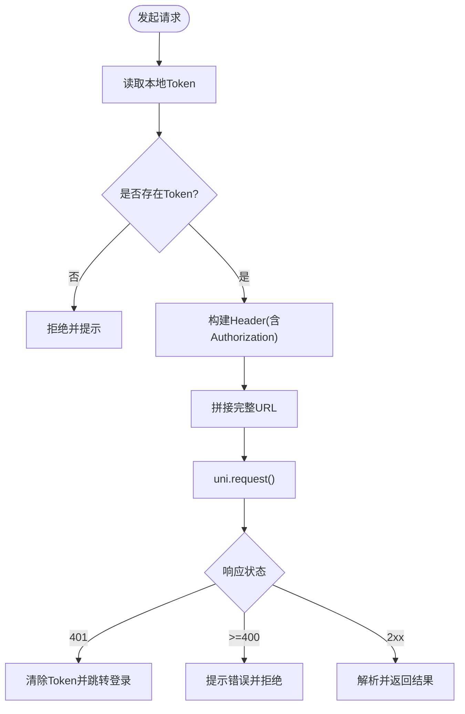
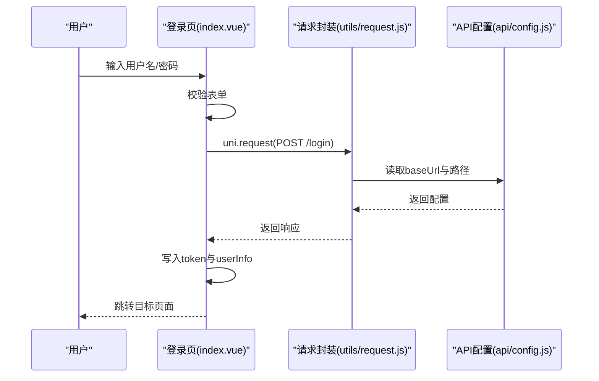
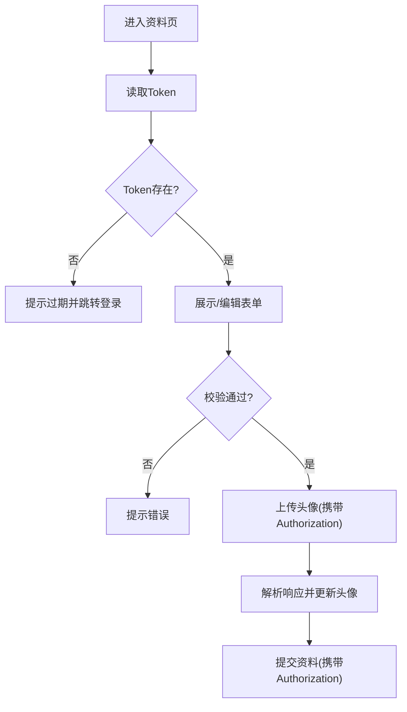
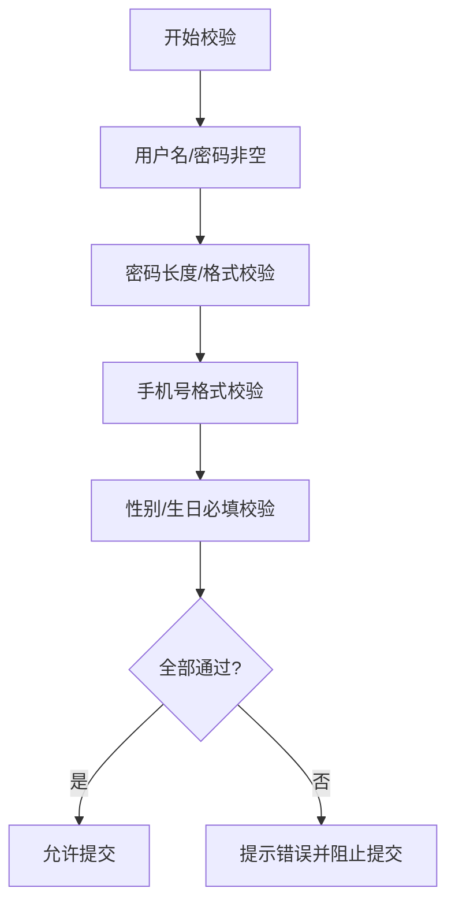
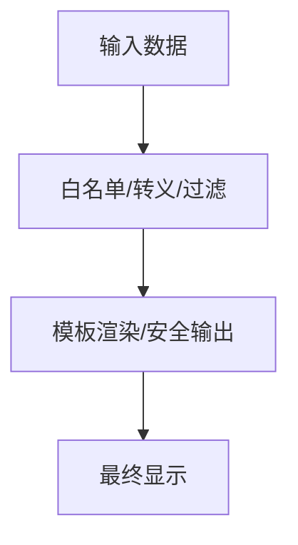
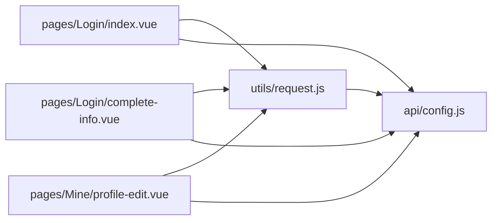

# 安全编码实践

<cite>
**本文引用的文件**
- [main.js](file://main.js)
- [utils/request.js](file://utils/request.js)
- [pages/Login/index.vue](file://pages/Login/index.vue)
- [pages/Login/complete-info.vue](file://pages/Login/complete-info.vue)
- [pages/Mine/profile-edit.vue](file://pages/Mine/profile-edit.vue)
- [api/config.js](file://api/config.js)
- [pages/Login/china-area.js](file://pages/Login/china-area.js)
- [index.html](file://index.html)
- [package.json](file://package.json)
</cite>

## 目录
1. [简介](#简介)
2. [项目结构](#项目结构)
3. [核心组件](#核心组件)
4. [架构总览](#架构总览)
5. [详细组件分析](#详细组件分析)
6. [依赖关系分析](#依赖关系分析)
7. [性能考量](#性能考量)
8. [故障排查指南](#故障排查指南)
9. [结论](#结论)
10. [附录](#附录)

## 简介
本指南面向“致良知教育”项目，聚焦前端侧安全编码最佳实践，围绕输入验证与数据过滤、Token 安全管理、XSS 防护、CSRF 防护、敏感信息保护、日志与审计等维度，结合现有代码实现进行系统性梳理，并提出可落地的改进建议，帮助团队建立可持续的安全基线。

## 项目结构
项目采用 uni-app/Vue 3 结构，主要由入口、通用请求封装、页面组件与 API 配置构成。整体以页面为中心组织功能模块，通过统一请求封装与 API 配置集中管理网络通信与鉴权。

**图表来源**
- [main.js:1-26](file://main.js#L1-L26)
- [utils/request.js:1-98](file://utils/request.js#L1-L98)
- [api/config.js:1-60](file://api/config.js#L1-L60)
- [pages/Login/index.vue:1-900](file://pages/Login/index.vue#L1-L900)
- [pages/Login/complete-info.vue:1-694](file://pages/Login/complete-info.vue#L1-L694)
- [pages/Mine/profile-edit.vue:1-346](file://pages/Mine/profile-edit.vue#L1-L346)
- [pages/Login/china-area.js:1-33](file://pages/Login/china-area.js#L1-L33)
- [index.html:1-20](file://index.html#L1-L20)

**章节来源**
- [main.js:1-26](file://main.js#L1-L26)
- [index.html:1-20](file://index.html#L1-L20)
- [utils/request.js:1-98](file://utils/request.js#L1-L98)
- [api/config.js:1-60](file://api/config.js#L1-L60)

## 核心组件
- 统一请求封装：负责自动注入 Token、统一错误处理、URL 拼接与响应处理。
- API 配置：集中管理基础地址与各接口路径，便于统一维护与替换。
- 登录与个人信息页面：包含表单输入、数据校验、上传与鉴权流程。
- 地区数据：用于表单选择类输入的数据支撑。

**章节来源**
- [utils/request.js:1-98](file://utils/request.js#L1-L98)
- [api/config.js:1-60](file://api/config.js#L1-L60)
- [pages/Login/index.vue:1-900](file://pages/Login/index.vue#L1-L900)
- [pages/Login/complete-info.vue:1-694](file://pages/Login/complete-info.vue#L1-L694)
- [pages/Mine/profile-edit.vue:1-346](file://pages/Mine/profile-edit.vue#L1-L346)
- [pages/Login/china-area.js:1-33](file://pages/Login/china-area.js#L1-L33)

## 架构总览
前端通过统一请求封装与 API 配置进行网络通信，登录成功后将 Token 写入本地存储；后续请求自动附加 Authorization 头。页面组件在提交数据前进行基础校验，上传文件时携带 Token，避免明文暴露。

**图表来源**
- [pages/Login/index.vue:196-282](file://pages/Login/index.vue#L196-L282)
- [utils/request.js:7-67](file://utils/request.js#L7-L67)
- [api/config.js:16-32](file://api/config.js#L16-L32)

## 详细组件分析

### 统一请求封装与 Token 管理
- 自动注入 Token：每次请求读取本地存储的 token 并注入 Authorization 头。
- 统一错误处理：对 401 未授权进行清理并跳转登录；对其他错误码提示并拒绝。
- URL 拼接：若传入绝对 URL 则直接使用，否则与 baseUrl 拼接。
- 便捷方法：提供 get/post 快捷方法，默认 content-type 为 application/json。

**图表来源**
- [utils/request.js:7-67](file://utils/request.js#L7-L67)

**章节来源**
- [utils/request.js:1-98](file://utils/request.js#L1-L98)

### 登录与 Token 生命周期
- 登录成功后将 token 与用户信息写入本地存储，并设置当前身份标识。
- 登录页对用户名/密码进行基础校验，满足规则后再发起请求。
- 微信登录流程包含授权、头像与昵称选择、提交登录等步骤，均携带 Token。

**图表来源**
- [pages/Login/index.vue:196-282](file://pages/Login/index.vue#L196-L282)
- [utils/request.js:7-67](file://utils/request.js#L7-L67)
- [api/config.js:16-32](file://api/config.js#L16-L32)

**章节来源**
- [pages/Login/index.vue:1-900](file://pages/Login/index.vue#L1-L900)

### 个人信息与上传流程
- 完善信息页与资料编辑页均在提交前进行基础校验（手机号格式、必填项等）。
- 上传头像时携带 Authorization 头，解析后端返回的 JSON 数据并更新本地头像。
- 地区选择通过弹窗与搜索实现，数据来源于 china-area.js。

**图表来源**
- [pages/Login/complete-info.vue:296-347](file://pages/Login/complete-info.vue#L296-L347)
- [pages/Mine/profile-edit.vue:294-311](file://pages/Mine/profile-edit.vue#L294-L311)
- [pages/Login/china-area.js:1-33](file://pages/Login/china-area.js#L1-L33)

**章节来源**
- [pages/Login/complete-info.vue:1-694](file://pages/Login/complete-info.vue#L1-L694)
- [pages/Mine/profile-edit.vue:1-346](file://pages/Mine/profile-edit.vue#L1-L346)
- [pages/Login/china-area.js:1-33](file://pages/Login/china-area.js#L1-L33)

### 输入验证与数据过滤
- 登录页：对用户名/密码进行非空与长度校验；手机号格式校验；密码长度约束。
- 完善信息页：对手机号进行正则校验；必填项校验；性别与生日必选。
- 资料编辑页：昵称、手机号、职业、性别、生日等字段的输入校验与弹窗编辑。
- 地区选择：通过预置省市区数据进行筛选与选择，避免外部输入污染。

**图表来源**
- [pages/Login/index.vue:284-301](file://pages/Login/index.vue#L284-L301)
- [pages/Login/complete-info.vue:349-369](file://pages/Login/complete-info.vue#L349-L369)
- [pages/Mine/profile-edit.vue:228-284](file://pages/Mine/profile-edit.vue#L228-L284)

**章节来源**
- [pages/Login/index.vue:1-900](file://pages/Login/index.vue#L1-L900)
- [pages/Login/complete-info.vue:1-694](file://pages/Login/complete-info.vue#L1-L694)
- [pages/Mine/profile-edit.vue:1-346](file://pages/Mine/profile-edit.vue#L1-L346)

### XSS 防护
- 输出编码：当前代码以模板渲染为主，未见直接将不受控数据插入 innerHTML 的场景。
- 内容安全策略：index.html 中未声明 CSP，建议在生产环境添加合适的 CSP 策略，限制脚本执行来源与内联脚本。
- 危险字符过滤：建议在提交前对富文本/HTML 类输入进行白名单过滤或使用安全的富文本库。

**图表来源**
- [index.html:1-20](file://index.html#L1-L20)

**章节来源**
- [index.html:1-20](file://index.html#L1-L20)

### CSRF 防护
- 当前请求通过 Authorization 头传递 Token，未使用传统 Cookie + CSRF Token 方案。
- 建议：若后端仍使用 Cookie 认证，应在前端启用 withCredentials 并配合后端的 CSRF Token 机制；或统一采用 Token 认证，避免跨站请求伪造风险。

**章节来源**
- [utils/request.js:14-17](file://utils/request.js#L14-L17)

### 敏感信息保护
- Token 存储：使用 uni.setStorageSync 存储 token 与 userInfo，建议在生产环境考虑更安全的存储方案（如加密存储或系统级安全存储）。
- 传输加密：当前 baseUrl 为 http://localhost，建议在生产环境切换为 HTTPS。
- 日志与审计：当前代码存在 console.error 等日志输出，建议在生产环境关闭或脱敏输出，避免敏感信息泄露。

**章节来源**
- [pages/Login/index.vue:214-222](file://pages/Login/index.vue#L214-L222)
- [utils/request.js:29-44](file://utils/request.js#L29-L44)
- [api/config.js:10](file://api/config.js#L10)

## 依赖关系分析
- 组件耦合：页面组件依赖 API 配置与统一请求封装，形成清晰的分层。
- 外部依赖：package.json 中仅包含 uni-ui，无额外安全相关依赖。
- 潜在风险：未发现显式的 CSP 配置与 CSRF Token 机制，建议补齐。

**图表来源**
- [pages/Login/index.vue:139](file://pages/Login/index.vue#L139)
- [pages/Login/complete-info.vue:139](file://pages/Login/complete-info.vue#L139)
- [pages/Mine/profile-edit.vue:118](file://pages/Mine/profile-edit.vue#L118)
- [utils/request.js:1](file://utils/request.js#L1)
- [api/config.js:8](file://api/config.js#L8)

**章节来源**
- [package.json:1-6](file://package.json#L1-L6)

## 性能考量
- 请求复用：统一请求封装减少重复代码，提升可维护性。
- 本地存储：Token 与用户信息本地缓存降低重复登录成本。
- 上传优化：上传接口按需携带 Token，避免不必要的头部。

[本节为通用指导，无需特定文件来源]

## 故障排查指南
- 401 未授权：统一请求封装会清除 Token 并跳转登录，检查后端签发与刷新策略。
- 网络异常：统一提示“网络连接异常”，建议在生产环境收集错误上下文并上报。
- 登录失败：登录页对表单进行基础校验，若后端返回错误，前端会提示具体消息。

**章节来源**
- [utils/request.js:29-54](file://utils/request.js#L29-L54)
- [pages/Login/index.vue:261-267](file://pages/Login/index.vue#L261-L267)

## 结论
项目在 Token 管理与统一请求封装方面具备良好基础，但仍需在 CSP、CSRF、敏感信息存储与传输加密等方面进一步加固。建议优先实施 HTTPS、CSP、Token 加密存储与错误日志脱敏，逐步引入 CSRF Token 机制，持续完善输入验证与数据过滤策略，确保系统在功能完备的同时具备更强的安全韧性。

## 附录
- 建议新增的安全配置清单
  - 生产环境强制 HTTPS
  - 添加 Content-Security-Policy
  - Token 加密存储或系统级安全存储
  - 错误日志脱敏与上报
  - CSRF Token 与同源策略校验
  - 输入白名单与富文本安全处理

[本节为通用指导，无需特定文件来源]