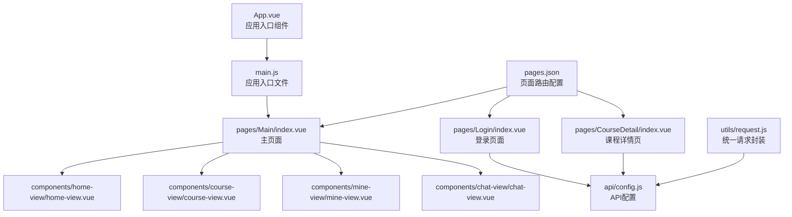
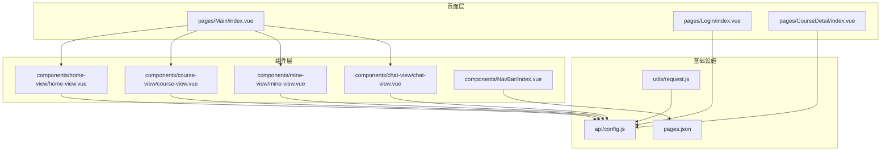
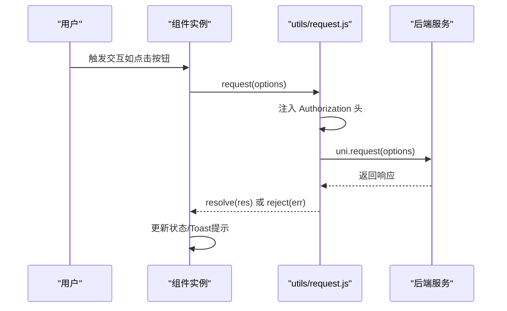
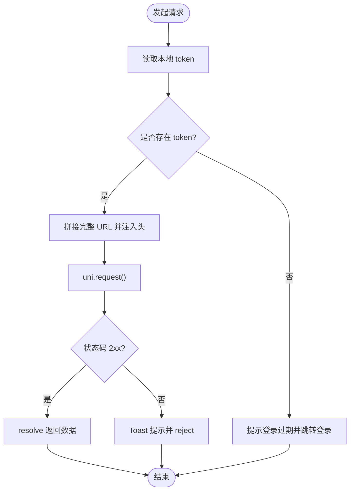
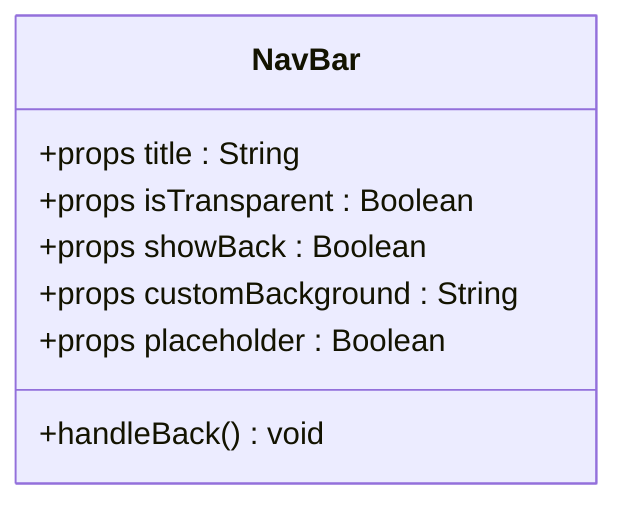
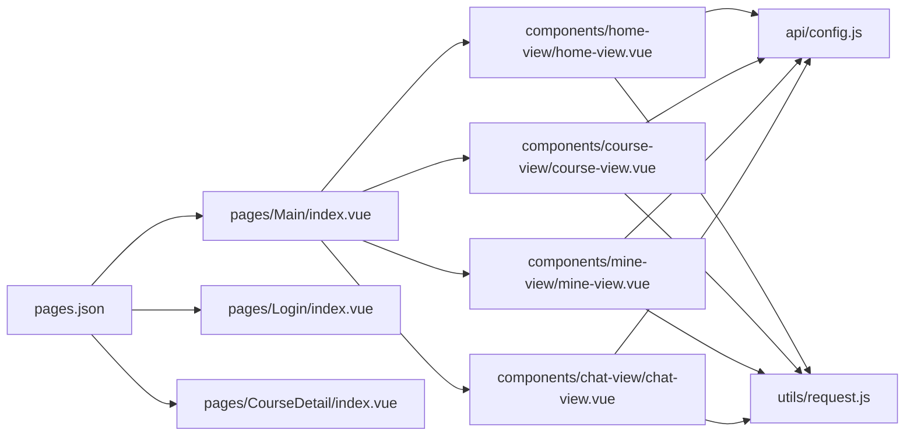

# 开发规范与最佳实践

<cite>
**本文引用的文件**
- [main.js](file://main.js)
- [App.vue](file://App.vue)
- [package.json](file://package.json)
- [pages.json](file://pages.json)
- [api/config.js](file://api/config.js)
- [utils/request.js](file://utils/request.js)
- [components/NavBar/index.vue](file://components/NavBar/index.vue)
- [components/home-view/home-view.vue](file://components/home-view/home-view.vue)
- [components/course-view/course-view.vue](file://components/course-view/course-view.vue)
- [components/mine-view/mine-view.vue](file://components/mine-view/mine-view.vue)
- [components/chat-view/chat-view.vue](file://components/chat-view/chat-view.vue)
- [pages/Login/index.vue](file://pages/Login/index.vue)
- [pages/Main/index.vue](file://pages/Main/index.vue)
- [pages/CourseDetail/index.vue](file://pages/CourseDetail/index.vue)
- [doc/README.md](file://doc/README.md)
- [doc/Uniapp_STRUCTURE.md](file://doc/Uniapp_STRUCTURE.md)
</cite>

## 目录
1. [简介](#简介)
2. [项目结构](#项目结构)
3. [核心组件](#核心组件)
4. [架构总览](#架构总览)
5. [详细组件分析](#详细组件分析)
6. [依赖关系分析](#依赖关系分析)
7. [性能考虑](#性能考虑)
8. [故障排查指南](#故障排查指南)
9. [结论](#结论)
10. [附录](#附录)

## 简介
本指南面向致良知教育项目团队，提供统一的开发规范与最佳实践，涵盖 JavaScript/Vue.js 编码风格、命名约定、注释规范；组件开发规范（设计原则、props 定义、事件处理）；API 使用规范（接口调用方式、错误处理、性能优化）；性能优化建议（代码分割、懒加载、缓存策略）；安全编码实践（数据验证、输入过滤）；以及调试技巧、测试策略与代码审查清单。目标是提升代码质量、可维护性与一致性，保障多端稳定运行。

## 项目结构
项目采用 uni-app + Vue.js 的多端一体化架构，页面与组件分离，API 配置集中管理，页面路由通过 pages.json 统一声明。整体结构清晰，便于团队协作与扩展。

**图表来源**
- [App.vue:1-40](file://App.vue#L1-L40)
- [main.js:1-26](file://main.js#L1-L26)
- [pages/Main/index.vue:1-224](file://pages/Main/index.vue#L1-L224)
- [pages/Login/index.vue:1-900](file://pages/Login/index.vue#L1-L900)
- [pages/CourseDetail/index.vue:1-384](file://pages/CourseDetail/index.vue#L1-L384)
- [api/config.js:1-60](file://api/config.js#L1-L60)
- [utils/request.js:1-98](file://utils/request.js#L1-L98)
- [pages.json:1-131](file://pages.json#L1-L131)

**章节来源**
- [doc/README.md:1-259](file://doc/README.md#L1-L259)
- [doc/Uniapp_STRUCTURE.md:1-387](file://doc/Uniapp_STRUCTURE.md#L1-L387)
- [pages.json:1-131](file://pages.json#L1-L131)

## 核心组件
- 应用入口与全局样式
  - App.vue 定义全局样式与品牌色系，统一页面背景与卡片样式。
  - main.js 支持 Vue 2/3 双栈，全局注册 NavBar 组件，便于复用。
- 页面与组件
  - 主页面 pages/Main/index.vue 作为底部导航容器，动态切换四个功能视图。
  - 登录页 pages/Login/index.vue 负责认证流程与协议同意。
  - 课程详情页 pages/CourseDetail/index.vue 展示课程信息与多模块内容。
  - 各功能组件（home-view、course-view、mine-view、chat-view）按职责拆分，提升复用性。
- API 与网络
  - api/config.js 统一管理接口路径与基础地址。
  - utils/request.js 封装统一请求、自动注入 Token、错误处理与 Toast 提示。

**章节来源**
- [App.vue:1-40](file://App.vue#L1-L40)
- [main.js:1-26](file://main.js#L1-L26)
- [pages/Main/index.vue:1-224](file://pages/Main/index.vue#L1-L224)
- [pages/Login/index.vue:1-900](file://pages/Login/index.vue#L1-L900)
- [pages/CourseDetail/index.vue:1-384](file://pages/CourseDetail/index.vue#L1-L384)
- [api/config.js:1-60](file://api/config.js#L1-L60)
- [utils/request.js:1-98](file://utils/request.js#L1-L98)

## 架构总览
项目采用“页面 + 组件 + API 配置 + 统一请求”的分层架构。页面负责路由与布局，组件负责功能与交互，API 配置集中管理接口，统一请求封装处理鉴权与错误。

**图表来源**
- [pages/Main/index.vue:1-224](file://pages/Main/index.vue#L1-L224)
- [pages/Login/index.vue:1-900](file://pages/Login/index.vue#L1-L900)
- [pages/CourseDetail/index.vue:1-384](file://pages/CourseDetail/index.vue#L1-L384)
- [components/home-view/home-view.vue:1-772](file://components/home-view/home-view.vue#L1-L772)
- [components/course-view/course-view.vue:1-496](file://components/course-view/course-view.vue#L1-L496)
- [components/mine-view/mine-view.vue:1-910](file://components/mine-view/mine-view.vue#L1-L910)
- [components/chat-view/chat-view.vue:1-156](file://components/chat-view/chat-view.vue#L1-L156)
- [components/NavBar/index.vue:1-68](file://components/NavBar/index.vue#L1-L68)
- [api/config.js:1-60](file://api/config.js#L1-L60)
- [utils/request.js:1-98](file://utils/request.js#L1-L98)
- [pages.json:1-131](file://pages.json#L1-L131)

## 详细组件分析

### 组件设计原则与命名规范
- 组件命名
  - 页面文件使用 kebab-case（如 index.vue），组件文件使用 PascalCase（如 HomeView.vue）。
  - 目录按功能模块划分，避免过度嵌套。
- 组件职责单一
  - 将复杂页面拆分为多个子组件，如课程详情页拆分为营期介绍、课程安排、今日课程、课程数据等模块。
- Props 与事件
  - 明确 props 类型与默认值，使用 defineProps（Composition API）或 props 选项。
  - 事件命名使用短横线分隔，回调参数尽量简洁。

**章节来源**
- [doc/Uniapp_STRUCTURE.md:202-227](file://doc/Uniapp_STRUCTURE.md#L202-L227)
- [components/NavBar/index.vue:26-48](file://components/NavBar/index.vue#L26-L48)
- [pages/CourseDetail/index.vue:70-76](file://pages/CourseDetail/index.vue#L70-L76)

### 组件开发规范（props、事件、生命周期）
- props 定义
  - 使用 defineProps 声明类型与默认值，避免使用 any。
  - 对布尔值、字符串、对象等明确类型约束。
- 事件处理
  - 使用 @click、@tap 等平台事件，避免直接操作 DOM。
  - 通过 emit 或回调传递数据，保持组件解耦。
- 生命周期
  - 在 onMounted 中发起网络请求或初始化状态。
  - 在 onUnmounted 中清理定时器、事件监听或全局订阅。

**图表来源**
- [utils/request.js:7-67](file://utils/request.js#L7-L67)
- [components/course-view/course-view.vue:160-193](file://components/course-view/course-view.vue#L160-L193)

**章节来源**
- [components/NavBar/index.vue:26-48](file://components/NavBar/index.vue#L26-L48)
- [components/course-view/course-view.vue:93-224](file://components/course-view/course-view.vue#L93-L224)
- [components/mine-view/mine-view.vue:135-377](file://components/mine-view/mine-view.vue#L135-L377)

### API 使用规范（调用方式、错误处理、性能优化）
- 统一请求封装
  - 自动从本地存储读取 token 并注入 Authorization 头。
  - 对 401 未授权进行统一处理（清除 token、跳转登录）。
  - 对非 2xx 状态码统一 Toast 提示。
- 接口路径管理
  - 所有接口路径集中于 api/config.js，便于维护与切换环境。
- 性能优化
  - 在组件挂载时再发起请求，避免首屏阻塞。
  - 使用 loading 与 finally 控制交互反馈。
  - 对重复请求进行去抖或缓存策略（建议）。

**图表来源**
- [utils/request.js:8-67](file://utils/request.js#L8-L67)
- [api/config.js:15-56](file://api/config.js#L15-L56)

**章节来源**
- [utils/request.js:1-98](file://utils/request.js#L1-L98)
- [api/config.js:1-60](file://api/config.js#L1-L60)

### 组件 A：NavBar（导航栏）
- 设计要点
  - 支持透明模式、返回按钮、自定义背景与占位。
  - 智能返回逻辑：多页返回，单页分享回首页。
- props 与事件
  - props：title、isTransparent、showBack、customBackground、placeholder。
  - 事件：handleBack（内部触发）。
- 样式与交互
  - 使用 scoped 样式，配合 rpx 响应式单位。
  - 使用 uni.getSystemInfoSync 获取状态栏高度。

**图表来源**
- [components/NavBar/index.vue:26-48](file://components/NavBar/index.vue#L26-L48)

**章节来源**
- [components/NavBar/index.vue:1-68](file://components/NavBar/index.vue#L1-L68)

### 组件 B：HomeView（首页）
- 功能概览
  - 首屏动画、网格导航、热门课程列表、弹窗展示。
  - 课程卡片点击前进行身份校验，再决定跳转详情或报名页。
- 数据与方法
  - data：isFirstLoad、navList、colorMap、courseList、showPopup、currentPopupTitle。
  - methods：handleNavClick、closePopup、goToAllCourses、fetchHotCourses、goToDetail。
- 性能与体验
  - 首次加载动画结束后关闭动画绑定，减少热切换延迟。
  - 使用 Toast 与 Loading 提升交互反馈。

**章节来源**
- [components/home-view/home-view.vue:137-263](file://components/home-view/home-view.vue#L137-L263)

### 组件 C：CourseView（课程列表）
- 功能概览
  - 顶部标签页切换（进行中/历史/已结业），课程卡片展示学习进度与状态徽章。
- 数据与方法
  - 使用 Composition API（ref、onMounted、onUnmounted）管理状态。
  - fetchCourseData 根据 tabType 拉取课程数据，支持刷新事件。
- 安全与健壮性
  - 无 token 直接提示登录并跳转。

**章节来源**
- [components/course-view/course-view.vue:93-224](file://components/course-view/course-view.vue#L93-L224)

### 组件 D：MineView（个人中心）
- 功能概览
  - 用户信息展示与编辑、身份切换（学员端/志愿者端）、常用服务入口、退出登录。
- 安全与一致性
  - 强制写入“学员端”，避免后端身份影响本地状态。
  - 退出登录时清理 token、用户信息与身份缓存，并跳转登录页。

**章节来源**
- [components/mine-view/mine-view.vue:135-377](file://components/mine-view/mine-view.vue#L135-L377)

### 组件 E：ChatView（群聊列表）
- 功能概览
  - 加载用户所在群聊列表，点击进入聊天详情。
- 安全与健壮性
  - 无 token 提示登录；请求失败统一 Toast。

**章节来源**
- [components/chat-view/chat-view.vue:39-95](file://components/chat-view/chat-view.vue#L39-L95)

### 页面 A：Login（登录）
- 功能概览
  - 账号密码登录、微信一键登录、协议同意、登录成功后跳转。
- 安全与健壮性
  - 表单校验、协议同意校验、登录状态持久化、异常捕获与 Toast。

**章节来源**
- [pages/Login/index.vue:138-454](file://pages/Login/index.vue#L138-L454)

### 页面 B：Main（主页面）
- 功能概览
  - 底部导航栏切换四个功能视图，支持 uni.$on/$off 事件通信。
- 性能与体验
  - 使用组件懒加载与动画过渡，适配安全区域。

**章节来源**
- [pages/Main/index.vue:52-116](file://pages/Main/index.vue#L52-L116)

### 页面 C：CourseDetail（课程详情）
- 功能概览
  - 课程信息展示、标签页切换（营期介绍/课程安排/今日课程/课程数据）。
- 组件化
  - 通过子组件模块化展示不同内容，便于维护与扩展。

**章节来源**
- [pages/CourseDetail/index.vue:67-146](file://pages/CourseDetail/index.vue#L67-L146)

## 依赖关系分析
- 组件依赖
  - pages/Main/index.vue 依赖四个功能组件与 NavBar。
  - 各功能组件依赖 api/config.js 与 utils/request.js。
- 外部依赖
  - @dcloudio/uni-ui 用于 UI 组件与样式。
- 路由与页面
  - pages.json 统一声明页面路径与样式，支持自定义导航栏与动画。

**图表来源**
- [pages/Main/index.vue:52-116](file://pages/Main/index.vue#L52-L116)
- [components/home-view/home-view.vue:137-263](file://components/home-view/home-view.vue#L137-L263)
- [components/course-view/course-view.vue:93-224](file://components/course-view/course-view.vue#L93-L224)
- [components/mine-view/mine-view.vue:135-377](file://components/mine-view/mine-view.vue#L135-L377)
- [components/chat-view/chat-view.vue:39-95](file://components/chat-view/chat-view.vue#L39-L95)
- [api/config.js:1-60](file://api/config.js#L1-L60)
- [utils/request.js:1-98](file://utils/request.js#L1-L98)
- [pages.json:1-131](file://pages.json#L1-L131)

**章节来源**
- [package.json:1-6](file://package.json#L1-L6)
- [pages.json:1-131](file://pages.json#L1-L131)

## 性能考虑
- 代码分割与懒加载
  - 主页面按需加载功能组件，减少首屏体积。
  - 页面内子组件按需引入，避免全局注册过多组件。
- 网络优化
  - 统一请求封装，避免重复注入头与重复请求。
  - 对高频接口采用缓存策略（建议：内存缓存 + 过期时间）。
- 交互反馈
  - 使用 Loading 与 Toast 提升用户感知，避免长时间无反馈。
- 动画与渲染
  - 首屏动画仅在首次加载生效，热切换后关闭动画绑定，降低重绘成本。

**章节来源**
- [pages/Main/index.vue:52-116](file://pages/Main/index.vue#L52-L116)
- [components/home-view/home-view.vue:183-190](file://components/home-view/home-view.vue#L183-L190)
- [components/course-view/course-view.vue:201-224](file://components/course-view/course-view.vue#L201-L224)
- [doc/Uniapp_STRUCTURE.md:317-328](file://doc/Uniapp_STRUCTURE.md#L317-L328)

## 故障排查指南
- 登录与鉴权
  - 若出现 401 未授权，统一逻辑会清除 token 并跳转登录页。检查本地存储与后端 token 有效期。
- 网络异常
  - 请求失败统一 Toast 提示。检查网络状态、接口可达性与跨域配置。
- 页面跳转
  - 登录成功后根据 isComplete 决定跳转至信息补全或首页。检查后端返回字段与路由配置。
- 身份切换
  - 个人中心强制写入“学员端”，避免后端身份影响。若出现异常，检查缓存写入与页面刷新逻辑。

**章节来源**
- [utils/request.js:24-67](file://utils/request.js#L24-L67)
- [pages/Login/index.vue:196-282](file://pages/Login/index.vue#L196-L282)
- [components/mine-view/mine-view.vue:220-255](file://components/mine-view/mine-view.vue#L220-L255)

## 结论
本指南总结了致良知教育项目的开发规范与最佳实践，涵盖组件设计、API 使用、性能优化与安全实践等方面。建议团队在日常开发中严格遵循命名与结构规范，统一使用统一请求封装与 API 配置，持续优化交互反馈与性能表现，确保项目长期可维护与高质量交付。

## 附录

### 附录 A：编码风格与命名约定
- 文件命名
  - Vue 组件：PascalCase（如 HomeView.vue）
  - 页面文件：kebab-case（如 course-detail.vue）
  - 工具函数：camelCase（如 formatTime）
- 目录结构
  - components/common、business、layout 分层组织
  - pages/module-name/components 存放页面专用组件
- 代码风格
  - 使用 ES6+ 语法与 Composition API
  - CSS 使用 SCSS 预处理器
  - 遵循 Vue 官方风格指南

**章节来源**
- [doc/Uniapp_STRUCTURE.md:202-227](file://doc/Uniapp_STRUCTURE.md#L202-L227)

### 附录 B：调试技巧与测试策略
- 调试技巧
  - 使用 uni.showToast 输出关键状态与错误信息
  - 在关键流程添加日志（console.log），便于定位问题
  - 使用微信开发者工具与 HBuilderX 多端调试
- 测试策略
  - 单元测试：工具函数与组件逻辑
  - 集成测试：页面流程与跨端兼容性
  - 用户验收测试：功能完整性与用户体验

**章节来源**
- [doc/Uniapp_STRUCTURE.md:247-263](file://doc/Uniapp_STRUCTURE.md#L247-L263)

### 附录 C：代码审查清单
- 规范性
  - 文件命名与目录结构是否符合规范
  - 组件 props 类型与默认值是否明确
  - 是否存在重复代码与硬编码
- 安全性
  - 是否对用户输入进行校验与过滤
  - 是否正确处理 token 与敏感信息
- 性能与兼容性
  - 是否使用懒加载与缓存
  - 是否适配多端与安全区域
- 文档与注释
  - 关键逻辑是否有注释说明
  - API 调用与错误处理是否清晰

**章节来源**
- [doc/Uniapp_STRUCTURE.md:355-387](file://doc/Uniapp_STRUCTURE.md#L355-L387)