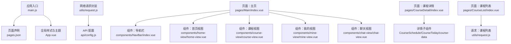
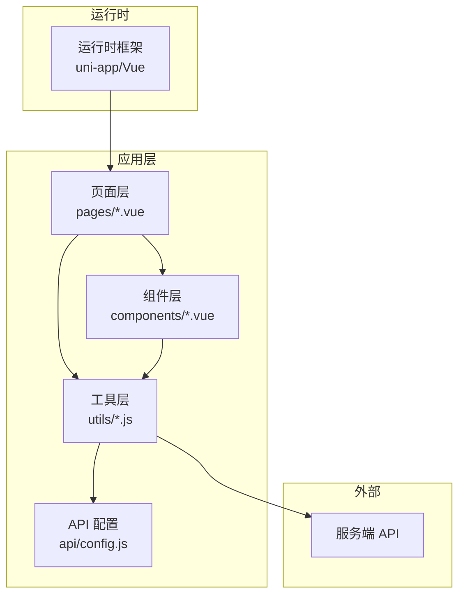
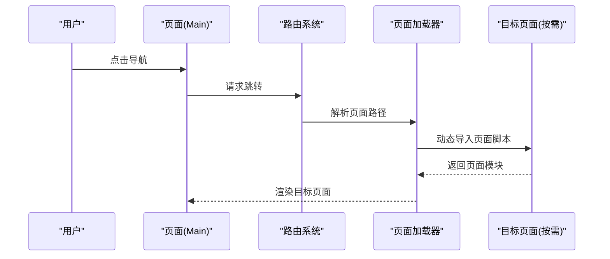
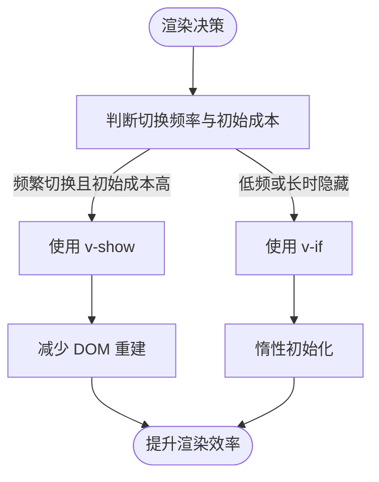
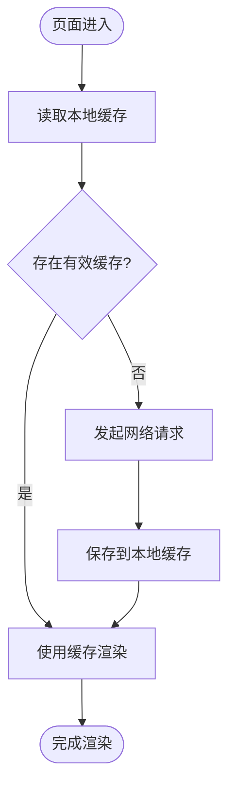
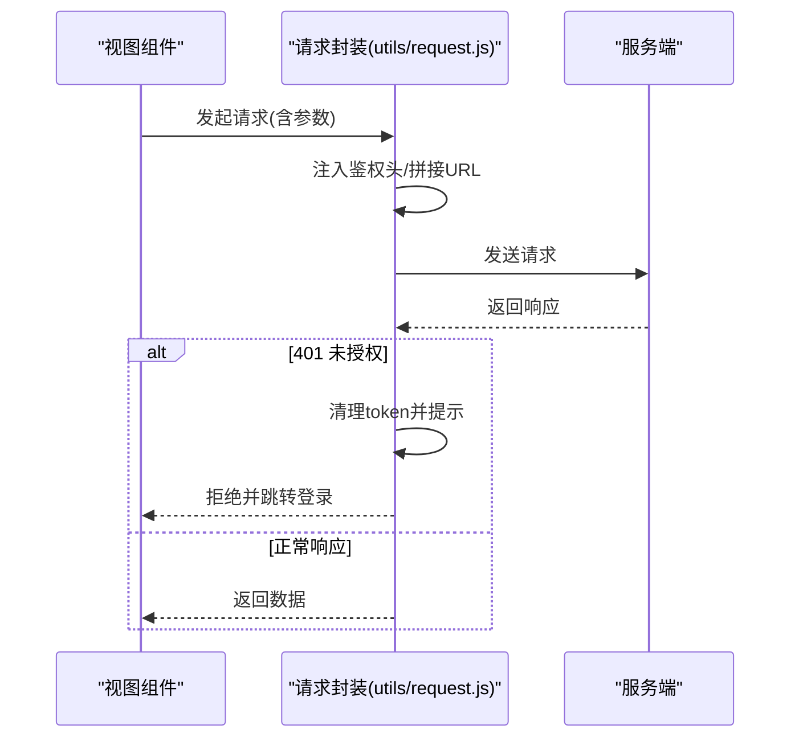
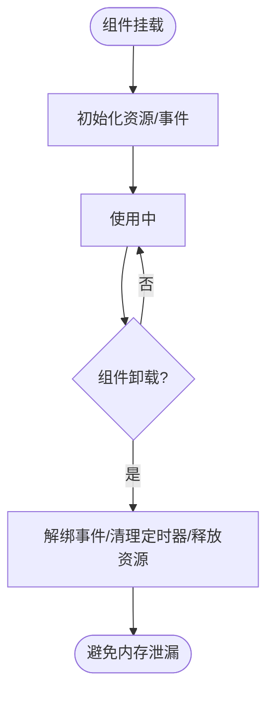
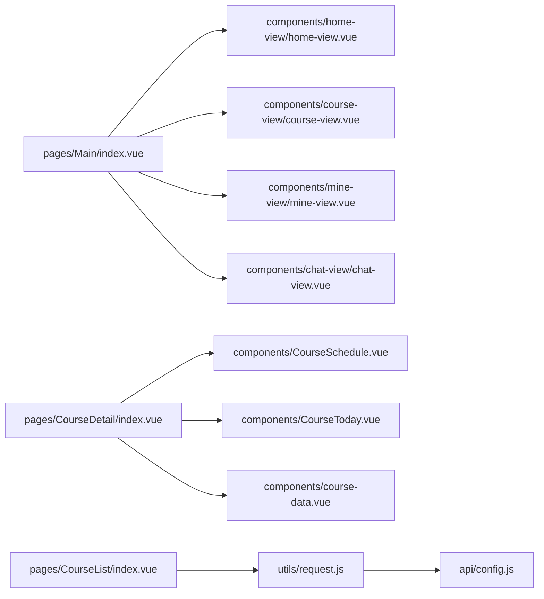

# 性能优化指南

<cite>
**本文引用的文件**
- [main.js](file://main.js)
- [pages.json](file://pages.json)
- [App.vue](file://App.vue)
- [package.json](file://package.json)
- [utils/request.js](file://utils/request.js)
- [api/config.js](file://api/config.js)
- [components/NavBar/index.vue](file://components/NavBar/index.vue)
- [pages/Main/index.vue](file://pages/Main/index.vue)
- [pages/CourseDetail/index.vue](file://pages/CourseDetail/index.vue)
- [pages/CourseList/index.vue](file://pages/CourseList/index.vue)
- [components/home-view/home-view.vue](file://components/home-view/home-view.vue)
- [components/course-view/course-view.vue](file://components/course-view/course-view.vue)
- [components/mine-view/mine-view.vue](file://components/mine-view/mine-view.vue)
- [components/chat-view/chat-view.vue](file://components/chat-view/chat-view.vue)
</cite>

## 目录
1. [简介](#简介)
2. [项目结构](#项目结构)
3. [核心组件](#核心组件)
4. [架构总览](#架构总览)
5. [详细组件分析](#详细组件分析)
6. [依赖关系分析](#依赖关系分析)
7. [性能考量](#性能考量)
8. [故障排查指南](#故障排查指南)
9. [结论](#结论)
10. [附录](#附录)

## 简介
本指南面向“致良知教育”项目，聚焦前端性能优化实践，围绕代码分割策略（按需加载、动态导入、路由懒加载）、组件渲染优化（v-show/v-if 选择、计算属性与监听器优化）、数据缓存策略（本地存储、预加载与失效机制）、网络请求优化（请求合并、防抖节流与超时控制）以及内存管理与资源释放进行系统性梳理，并结合项目现有实现给出可落地的改进建议。

## 项目结构
项目采用基于页面与组件的组织方式，页面通过 pages.json 声明路由，组件以功能域划分（如 NavBar、home-view、course-view 等），网络请求通过 utils/request.js 统一封装，API 地址与路径集中于 api/config.js。

图表来源
- [main.js:1-26](file://main.js#L1-L26)
- [pages.json:1-131](file://pages.json#L1-L131)
- [App.vue:1-40](file://App.vue#L1-L40)
- [utils/request.js:1-98](file://utils/request.js#L1-L98)
- [api/config.js:1-60](file://api/config.js#L1-L60)
- [pages/Main/index.vue:1-224](file://pages/Main/index.vue#L1-L224)
- [pages/CourseDetail/index.vue:1-384](file://pages/CourseDetail/index.vue#L1-L384)
- [pages/CourseList/index.vue:1-433](file://pages/CourseList/index.vue#L1-L433)
- [components/home-view/home-view.vue:1-772](file://components/home-view/home-view.vue#L1-L772)
- [components/course-view/course-view.vue:1-496](file://components/course-view/course-view.vue#L1-L496)
- [components/mine-view/mine-view.vue:1-910](file://components/mine-view/mine-view.vue#L1-L910)
- [components/chat-view/chat-view.vue:1-156](file://components/chat-view/chat-view.vue#L1-L156)

章节来源
- [main.js:1-26](file://main.js#L1-L26)
- [pages.json:1-131](file://pages.json#L1-L131)
- [App.vue:1-40](file://App.vue#L1-L40)
- [package.json:1-6](file://package.json#L1-L6)

## 核心组件
- 应用入口与全局注册：在入口文件中注册全局组件（如 NavBar），减少重复引入成本。
- 页面路由与导航：pages.json 声明页面路径与样式；NavBar 组件提供统一导航体验。
- 组件渲染：首页、课程、我的、聊天等视图组件承担不同业务场景的渲染职责。
- 网络请求：统一封装请求与鉴权头注入，便于集中治理与性能优化。

章节来源
- [main.js:18-25](file://main.js#L18-L25)
- [pages.json:8-120](file://pages.json#L8-L120)
- [components/NavBar/index.vue:1-68](file://components/NavBar/index.vue#L1-L68)

## 架构总览
整体采用“页面 + 组件 + 工具库”的分层架构，页面负责路由与布局，组件负责业务视图，工具库负责网络与通用能力。

图表来源
- [main.js:18-25](file://main.js#L18-L25)
- [utils/request.js:1-98](file://utils/request.js#L1-L98)
- [api/config.js:1-60](file://api/config.js#L1-L60)

## 详细组件分析

### 代码分割与按需加载策略
- 页面级懒加载：利用 uni-app 的动态 import 实现页面级按需加载，减少首屏包体与初始化时间。
- 组件级按需：在需要时再引入子组件或异步组件，避免一次性加载所有视图。
- 路由懒加载建议：将 pages.json 中的页面路径改为动态 import 形式，仅在访问时加载对应页面脚本。

图表来源
- [pages/Main/index.vue:111-114](file://pages/Main/index.vue#L111-L114)
- [pages/CourseDetail/index.vue:72-75](file://pages/CourseDetail/index.vue#L72-L75)

章节来源
- [pages/Main/index.vue:53-60](file://pages/Main/index.vue#L53-L60)
- [pages/CourseDetail/index.vue:68-75](file://pages/CourseDetail/index.vue#L68-L75)

### 组件渲染优化
- v-show vs v-if 选择：当前项目中大量使用 v-show 控制可见性，适合频繁切换且初始渲染成本高的场景；对于长期不展示的视图，建议评估 v-if 的惰性渲染收益。
- 计算属性与监听器：在数据稳定、派生逻辑复杂时使用计算属性；对昂贵的副作用使用防抖/节流监听器，避免高频触发。
- 列表渲染：课程列表与卡片采用 v-for 渲染，注意 key 的稳定性与唯一性，避免不必要的重排。

图表来源
- [pages/Main/index.vue:7-10](file://pages/Main/index.vue#L7-L10)
- [pages/CourseList/index.vue:19-75](file://pages/CourseList/index.vue#L19-L75)

章节来源
- [pages/Main/index.vue:7-10](file://pages/Main/index.vue#L7-L10)
- [pages/CourseList/index.vue:19-75](file://pages/CourseList/index.vue#L19-L75)

### 数据缓存策略
- 本地存储：登录态与用户信息通过 uni.setStorageSync 缓存，建议在组件挂载时优先读取本地缓存，再决定是否发起网络请求。
- 预加载：在页面进入前（如 onShow/onLoad）进行轻量数据预取，缩短首屏等待。
- 缓存失效：对易过期的数据（如 token）在请求失败时主动清理，并引导至登录流程。

图表来源
- [components/mine-view/mine-view.vue:205-223](file://components/mine-view/mine-view.vue#L205-L223)
- [pages/CourseList/index.vue:242-252](file://pages/CourseList/index.vue#L242-L252)

章节来源
- [components/mine-view/mine-view.vue:205-223](file://components/mine-view/mine-view.vue#L205-L223)
- [pages/CourseList/index.vue:242-252](file://pages/CourseList/index.vue#L242-L252)

### 网络请求优化
- 统一鉴权：在请求封装中自动注入 Authorization 头，避免各处重复处理。
- 错误处理：针对 401 未授权进行 token 清理与跳转，保障用户体验与安全性。
- 请求合并与节流：对高频查询（如搜索、筛选）采用防抖/节流，减少无效请求。
- 超时控制：为关键请求设置合理超时，避免长时间挂起影响交互。

图表来源
- [utils/request.js:7-67](file://utils/request.js#L7-L67)
- [api/config.js:16-56](file://api/config.js#L16-L56)

章节来源
- [utils/request.js:7-67](file://utils/request.js#L7-L67)
- [api/config.js:16-56](file://api/config.js#L16-L56)

### 内存管理与资源释放
- 组件生命周期：在 onUnmounted 中解绑事件与定时器，避免内存泄漏。
- 图片与滚动：对大图懒加载、滚动区域合理设置 show-scrollbar，减少重绘。
- 动画与过渡：谨慎使用复杂动画，必要时在切换时移除动画类，避免累积开销。

图表来源
- [components/course-view/course-view.vue:216-223](file://components/course-view/course-view.vue#L216-L223)
- [pages/Main/index.vue:107-109](file://pages/Main/index.vue#L107-L109)

章节来源
- [components/course-view/course-view.vue:216-223](file://components/course-view/course-view.vue#L216-L223)
- [pages/Main/index.vue:107-109](file://pages/Main/index.vue#L107-L109)

## 依赖关系分析
- 组件间依赖：页面 Main 引入多个视图组件；课程详情页引入多个子模块组件。
- 工具依赖：各页面与组件通过 utils/request.js 与 api/config.js 进行网络通信与配置管理。
- 运行时依赖：项目依赖 @dcloudio/uni-ui，用于基础 UI 组件支持。

图表来源
- [pages/Main/index.vue:53-60](file://pages/Main/index.vue#L53-L60)
- [pages/CourseDetail/index.vue:72-75](file://pages/CourseDetail/index.vue#L72-L75)
- [pages/CourseList/index.vue:82-84](file://pages/CourseList/index.vue#L82-L84)
- [utils/request.js:1-98](file://utils/request.js#L1-L98)
- [api/config.js:1-60](file://api/config.js#L1-L60)

章节来源
- [pages/Main/index.vue:53-60](file://pages/Main/index.vue#L53-L60)
- [pages/CourseDetail/index.vue:72-75](file://pages/CourseDetail/index.vue#L72-L75)
- [pages/CourseList/index.vue:82-84](file://pages/CourseList/index.vue#L82-L84)
- [utils/request.js:1-98](file://utils/request.js#L1-L98)
- [api/config.js:1-60](file://api/config.js#L1-L60)

## 性能考量
- 首屏优化：通过路由懒加载与组件按需加载降低首屏体积；对静态资源进行压缩与 CDN 加速。
- 渲染优化：减少不必要的 v-if/v-show 切换，使用虚拟列表渲染长列表，避免大对象深拷贝。
- 网络优化：启用请求合并、防抖/节流与超时控制；对图片与静态资源使用懒加载与合适的尺寸。
- 缓存策略：合理设置本地缓存有效期，区分强缓存与协商缓存；对敏感数据进行加密存储。
- 内存管理：及时清理事件监听、定时器与全局状态；避免闭包持有大对象导致 GC 困难。

## 故障排查指南
- 登录态异常：当接口返回 401 时，清除本地 token 并跳转登录页。若仍失败，检查本地存储键名与服务端签名算法。
- 请求失败：捕获 fail 回调并提示用户，同时记录错误日志以便定位问题。
- 页面跳转异常：在跳转失败回调中兜底处理，避免页面卡死。

章节来源
- [utils/request.js:28-66](file://utils/request.js#L28-L66)
- [components/mine-view/mine-view.vue:340-374](file://components/mine-view/mine-view.vue#L340-L374)

## 结论
通过实施路由懒加载、组件按需加载、计算属性与监听器优化、本地缓存与预加载、请求合并与超时控制以及规范的内存管理，致良知教育项目可在保证功能完整性的同时显著提升运行时性能与用户体验。建议在迭代过程中持续监控关键指标（首屏时延、交互流畅度、内存占用），并结合业务场景逐步完善上述策略。

## 附录
- 开发依赖：项目依赖 @dcloudio/uni-ui，用于基础 UI 组件支持。
- 主题与样式：全局样式在 App.vue 中定义，页面样式采用 scoped 限定作用域，避免样式冲突。

章节来源
- [package.json:2-4](file://package.json#L2-L4)
- [App.vue:15-39](file://App.vue#L15-L39)