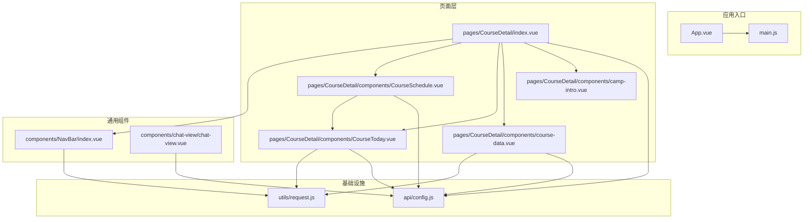
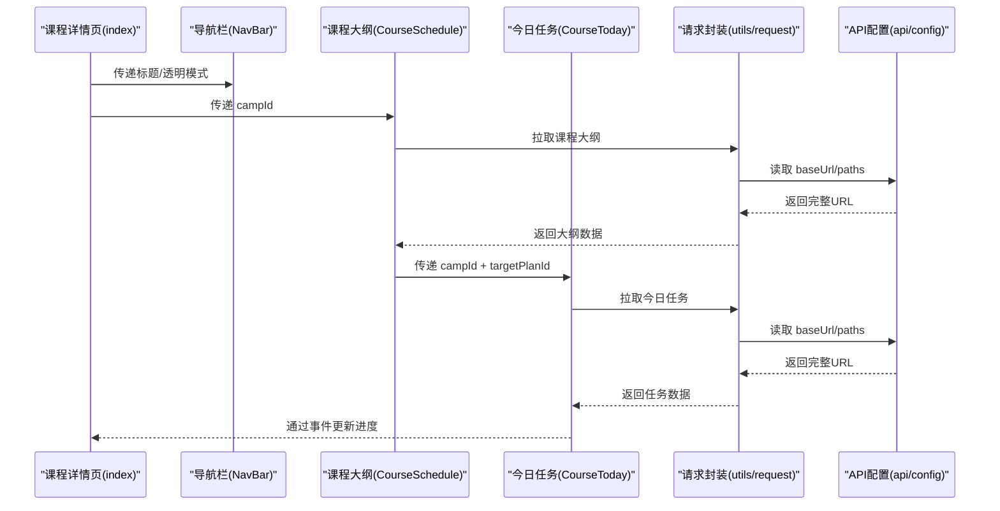
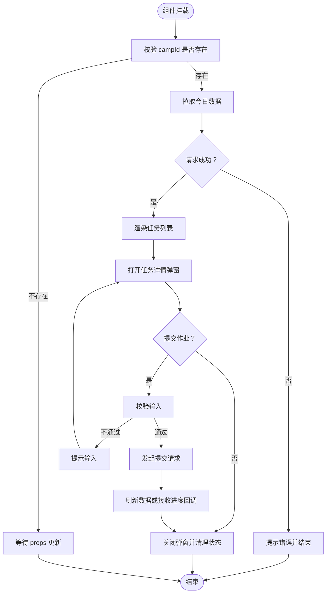
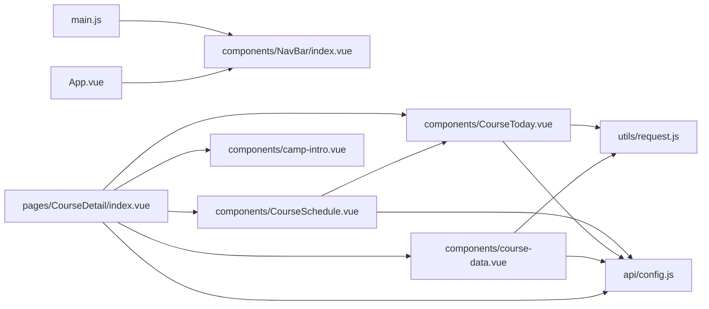

# 组件开发规范

<cite>
**本文引用的文件**
- [App.vue](file://App.vue)
- [main.js](file://main.js)
- [components/NavBar/index.vue](file://components/NavBar/index.vue)
- [pages/CourseDetail/components/course-data.vue](file://pages/CourseDetail/components/course-data.vue)
- [pages/CourseDetail/components/CourseToday.vue](file://pages/CourseDetail/components/CourseToday.vue)
- [pages/CourseDetail/components/CourseSchedule.vue](file://pages/CourseDetail/components/CourseSchedule.vue)
- [pages/CourseDetail/components/camp-intro.vue](file://pages/CourseDetail/components/camp-intro.vue)
- [pages/CourseDetail/index.vue](file://pages/CourseDetail/index.vue)
- [api/config.js](file://api/config.js)
- [utils/request.js](file://utils/request.js)
- [components/chat-view/chat-view.vue](file://components/chat-view/chat-view.vue)
- [package.json](file://package.json)
</cite>

## 目录
1. [引言](#引言)
2. [项目结构](#项目结构)
3. [核心组件](#核心组件)
4. [架构总览](#架构总览)
5. [详细组件分析](#详细组件分析)
6. [依赖关系分析](#依赖关系分析)
7. [性能考量](#性能考量)
8. [故障排查指南](#故障排查指南)
9. [结论](#结论)
10. [附录](#附录)

## 引言
本规范面向致良知教育项目中的 Vue.js 组件开发，目标是建立一套统一的设计原则与实现标准，确保组件具备：
- 单一职责：每个组件聚焦一个明确的功能域
- 高复用性：通过清晰的 props、事件与插槽提升可组合性
- 易维护性：统一的生命周期管理、状态组织与错误处理
- 一致性：视觉与交互风格遵循项目主题与品牌调性
- 可扩展性：支持在现有模式上进行演进与增强

## 项目结构
项目采用按页面/模块分层的目录组织方式，核心页面位于 pages 目录，通用组件位于 components 目录，API 配置与请求封装位于 api 与 utils 目录。课程详情页作为典型示例，展示了多组件协作与数据流的组织方式。

图表来源
- [pages/CourseDetail/index.vue:1-65](file://pages/CourseDetail/index.vue#L1-L65)
- [pages/CourseDetail/components/CourseSchedule.vue:1-122](file://pages/CourseDetail/components/CourseSchedule.vue#L1-L122)
- [pages/CourseDetail/components/CourseToday.vue:1-184](file://pages/CourseDetail/components/CourseToday.vue#L1-L184)
- [pages/CourseDetail/components/course-data.vue:1-100](file://pages/CourseDetail/components/course-data.vue#L1-L100)
- [pages/CourseDetail/components/camp-intro.vue:1-91](file://pages/CourseDetail/components/camp-intro.vue#L1-L91)
- [components/NavBar/index.vue:1-68](file://components/NavBar/index.vue#L1-L68)
- [components/chat-view/chat-view.vue:1-37](file://components/chat-view/chat-view.vue#L1-L37)
- [utils/request.js:1-98](file://utils/request.js#L1-L98)
- [api/config.js:1-60](file://api/config.js#L1-L60)

章节来源
- [pages/CourseDetail/index.vue:1-65](file://pages/CourseDetail/index.vue#L1-L65)
- [main.js:1-26](file://main.js#L1-L26)

## 核心组件
本节梳理项目中具有代表性的组件及其职责边界，便于制定统一的开发规范。

- 导航栏组件（NavBar）
  - 职责：提供统一的导航与返回逻辑，支持透明模式与占位渲染
  - 关键点：props 定义、系统信息适配、智能返回策略
- 课程今日任务组件（CourseToday）
  - 职责：展示当日任务、弹窗详情、作业提交与进度更新
  - 关键点：props 输入、事件发射、弹窗状态管理、任务类型分支
- 课程数据看板组件（course-data）
  - 职责：展示学习趋势、完成率与成就
  - 关键点：计算属性截断、滚动锚点、状态样式映射
- 课程大纲组件（CourseSchedule）
  - 职责：展示模块与日计划，支持跳转到具体某天的任务看板
  - 关键点：手风琴展开、路由式视图切换、数据联动
- 课程介绍组件（camp-intro）
  - 职责：展示缘起、修习次第与适合人群
  - 关键点：结构化文案与卡片化展示
- 课程详情页（CourseDetail/index）
  - 职责：聚合多个模块，组织页面布局与导航
  - 关键点：标签页切换、全局导航栏、模块间通信
- 请求封装（utils/request）
  - 职责：统一注入 Token、错误处理与 HTTP 状态码处理
  - 关键点：401 登录态失效处理、网络异常提示
- API 配置（api/config）
  - 职责：集中管理 API 基础地址与路径
  - 关键点：路径占位符替换、开发/生产环境切换

章节来源
- [components/NavBar/index.vue:1-68](file://components/NavBar/index.vue#L1-L68)
- [pages/CourseDetail/components/CourseToday.vue:1-184](file://pages/CourseDetail/components/CourseToday.vue#L1-L184)
- [pages/CourseDetail/components/course-data.vue:1-100](file://pages/CourseDetail/components/course-data.vue#L1-L100)
- [pages/CourseDetail/components/CourseSchedule.vue:1-122](file://pages/CourseDetail/components/CourseSchedule.vue#L1-L122)
- [pages/CourseDetail/components/camp-intro.vue:1-91](file://pages/CourseDetail/components/camp-intro.vue#L1-L91)
- [pages/CourseDetail/index.vue:1-65](file://pages/CourseDetail/index.vue#L1-L65)
- [utils/request.js:1-98](file://utils/request.js#L1-L98)
- [api/config.js:1-60](file://api/config.js#L1-L60)

## 架构总览
组件开发遵循“页面聚合 + 功能拆分 + 依赖注入”的模式：
- 页面负责布局与状态编排，子组件专注各自领域
- 通过 props 传递数据，通过事件向上反馈
- 通过统一的请求封装与 API 配置，降低耦合度
- 使用生命周期钩子进行数据初始化与资源清理

图表来源
- [pages/CourseDetail/index.vue:1-65](file://pages/CourseDetail/index.vue#L1-L65)
- [pages/CourseDetail/components/CourseSchedule.vue:124-212](file://pages/CourseDetail/components/CourseSchedule.vue#L124-L212)
- [pages/CourseDetail/components/CourseToday.vue:186-379](file://pages/CourseDetail/components/CourseToday.vue#L186-L379)
- [utils/request.js:1-98](file://utils/request.js#L1-L98)
- [api/config.js:1-60](file://api/config.js#L1-L60)

## 详细组件分析

### 导航栏组件（NavBar）设计规范
- 单一职责
  - 仅负责导航与返回，不承担业务数据加载
- Props 规范
  - title: 字符串，默认空字符串
  - isTransparent: 布尔值，默认 false
  - showBack: 布尔值，默认 true
  - customBackground: 字符串，默认空字符串
  - placeholder: 布尔值，默认 true
- 事件与交互
  - 内部处理返回逻辑，避免外部重复判断
  - 支持透明模式与占位渲染，保持页面布局一致性
- 样式与动画
  - 使用固定定位与毛玻璃效果，过渡动画平滑
- 生命周期
  - 在组件挂载时读取系统信息，避免在模板中直接访问

章节来源
- [components/NavBar/index.vue:23-48](file://components/NavBar/index.vue#L23-L48)

### 课程今日任务组件（CourseToday）设计规范
- 单一职责
  - 负责当日任务展示、弹窗详情、作业提交与进度更新
- Props 规范
  - campId: 必填，Number/String
  - targetPlanId: 可选，Number/String，默认 null
- 事件规范
  - updateProgress: 在任务完成后向上游广播进度更新
- 数据流与状态
  - 使用响应式状态管理数据加载、弹窗状态与提交流程
  - 通过 watch 监听 props 变化，确保跨天切换时数据刷新
- 交互与动画
  - 弹窗采用底部弹出，支持安全区域与圆角
  - 任务卡片点击反馈与完成态样式
- 错误处理
  - 统一 toast 提示与加载状态管理

图表来源
- [pages/CourseDetail/components/CourseToday.vue:186-379](file://pages/CourseDetail/components/CourseToday.vue#L186-L379)

章节来源
- [pages/CourseDetail/components/CourseToday.vue:186-379](file://pages/CourseDetail/components/CourseToday.vue#L186-L379)

### 课程数据看板组件（course-data）设计规范
- 单一职责
  - 负责学习趋势、完成率与成就展示
- Props 规范
  - campId: 必填，Number/String
- 性能与复杂逻辑
  - 使用计算属性截断未来未解锁天数，避免渲染冗余
  - 通过 nextTick 设置滚动锚点，保证可视区域稳定
- 样式与动画
  - 柱状图使用渐变与阴影，状态样式区分明确
  - 横向滚动条隐藏，适配不同平台

章节来源
- [pages/CourseDetail/components/course-data.vue:102-214](file://pages/CourseDetail/components/course-data.vue#L102-L214)

### 课程大纲组件（CourseSchedule）设计规范
- 单一职责
  - 负责模块与日计划展示，支持跳转到具体某天的任务看板
- Props 规范
  - campId: 必填，String
- 视图切换
  - 通过 selectedPlanId 控制“大纲列表”与“详情视图”
  - 详情视图内复用 CourseToday 组件
- 交互与动画
  - 手风琴展开收起，过渡动画自然
  - 详情导航采用毛玻璃效果，贴顶展示

章节来源
- [pages/CourseDetail/components/CourseSchedule.vue:124-212](file://pages/CourseDetail/components/CourseSchedule.vue#L124-L212)

### 课程介绍组件（camp-intro）设计规范
- 单一职责
  - 展示缘起、修习次第与适合人群
- Props 规范
  - courseInfo: 对象，默认空对象
- 设计一致性
  - 使用项目统一的卡片样式与颜色体系

章节来源
- [pages/CourseDetail/components/camp-intro.vue:93-102](file://pages/CourseDetail/components/camp-intro.vue#L93-L102)

### 课程详情页（CourseDetail/index）设计规范
- 单一职责
  - 聚合多个模块，组织页面布局与标签页切换
- 依赖注入
  - 全局引入 NavBar、各模块组件
- 事件与状态
  - 通过 emit 与子组件通信，保持页面状态简洁

章节来源
- [pages/CourseDetail/index.vue:67-146](file://pages/CourseDetail/index.vue#L67-L146)

### 请求封装与 API 配置
- 请求封装（utils/request）
  - 自动注入 Authorization Token
  - 统一处理 401 未授权、HTTP 错误与网络异常
  - 提供 get/post 快捷方法
- API 配置（api/config）
  - 集中管理 baseUrl 与 paths
  - 支持路径占位符替换

章节来源
- [utils/request.js:1-98](file://utils/request.js#L1-L98)
- [api/config.js:1-60](file://api/config.js#L1-L60)

## 依赖关系分析
- 组件间依赖
  - CourseDetail/index 聚合多个子组件
  - CourseSchedule 内部复用 CourseToday
  - 所有数据组件均依赖 utils/request 与 api/config
- 入口与全局注册
  - main.js 在 Vue3 环境下全局注册 NavBar 组件
  - App.vue 提供全局样式与主题变量

图表来源
- [main.js:14-25](file://main.js#L14-L25)
- [App.vue:1-40](file://App.vue#L1-L40)
- [pages/CourseDetail/index.vue:67-76](file://pages/CourseDetail/index.vue#L67-L76)
- [pages/CourseDetail/components/CourseSchedule.vue:124-129](file://pages/CourseDetail/components/CourseSchedule.vue#L124-L129)
- [pages/CourseDetail/components/CourseToday.vue:186-189](file://pages/CourseDetail/components/CourseToday.vue#L186-L189)
- [pages/CourseDetail/components/course-data.vue:102-105](file://pages/CourseDetail/components/course-data.vue#L102-L105)
- [utils/request.js:1-98](file://utils/request.js#L1-L98)
- [api/config.js:1-60](file://api/config.js#L1-L60)

章节来源
- [main.js:14-25](file://main.js#L14-L25)
- [pages/CourseDetail/index.vue:67-76](file://pages/CourseDetail/index.vue#L67-L76)

## 性能考量
- 计算属性与懒加载
  - 使用 computed 截断未来未解锁天数，减少渲染与动画开销
  - 使用 nextTick 设置滚动锚点，避免不必要的重排
- 状态收敛与最小化响应式
  - 将临时状态（如弹窗开关、表单输入）收敛在组件内部
  - 仅在必要时暴露 props 与 emit
- 请求与缓存
  - 统一注入 Token，减少重复鉴权
  - 在页面 onShow 时刷新列表，保证数据新鲜度
- 动画与滚动
  - 控制动画数量与时长，避免过度动画影响性能
  - 横向滚动容器使用合适的尺寸与过渡，避免溢出与重绘

## 故障排查指南
- 登录态失效
  - 401 时清除本地 Token 并跳转登录页，避免重复请求
- 网络异常
  - 统一 toast 提示，避免抛出未捕获异常
- 数据为空或加载失败
  - 提供空状态与重试入口，引导用户重新拉取
- 事件冒泡与交互冲突
  - 在弹窗场景中，注意阻止事件穿透与键盘收起
- 样式覆盖与兼容
  - 使用 scoped 与深度选择器时，确保样式隔离与平台差异处理

章节来源
- [utils/request.js:24-67](file://utils/request.js#L24-L67)
- [pages/CourseDetail/components/CourseToday.vue:216-242](file://pages/CourseDetail/components/CourseToday.vue#L216-L242)
- [pages/CourseDetail/components/course-data.vue:168-199](file://pages/CourseDetail/components/course-data.vue#L168-L199)

## 结论
通过以上规范与实践案例，致良知教育项目的组件开发可以在保证一致性的同时提升可维护性与扩展性。建议在后续迭代中持续遵循以下原则：
- 严格遵守单一职责与 props/emit 约定
- 使用计算属性与生命周期钩子优化性能
- 统一错误处理与交互反馈
- 保持样式与交互风格的一致性

## 附录

### 组件开发规范清单
- 设计原则
  - 单一职责：每个组件只负责一个功能域
  - 可复用性：通过清晰的 props、事件与插槽提升组合能力
  - 可维护性：统一的生命周期、状态组织与错误处理
- Props 定义规范
  - 类型检查：明确类型与默认值
  - 必填字段：使用 required 标注
  - 验证规则：在组件内部进行简单校验并给出友好提示
- 事件处理规范
  - 自定义事件命名：使用小驼峰，语义明确
  - 参数传递：尽量传递最小必要数据
  - 事件冒泡控制：在组件内部决定是否继续冒泡
- 生命周期管理最佳实践
  - 数据初始化：在 onMounted 中发起首次请求
  - 状态管理：使用响应式状态收敛组件内部状态
  - 资源清理：在组件卸载前清理定时器、订阅与事件监听
- 样式与交互
  - 使用项目主题色与圆角规范
  - 动画时长与缓动曲线保持一致
  - 交互反馈及时且可预期