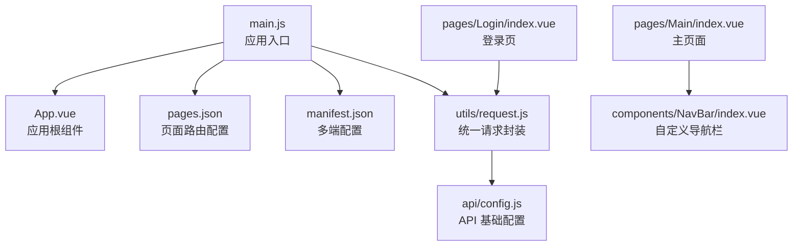
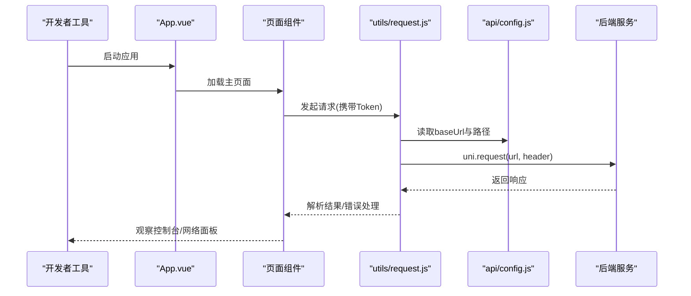
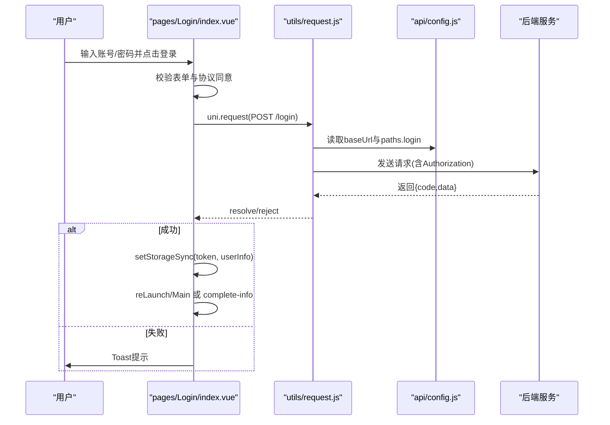
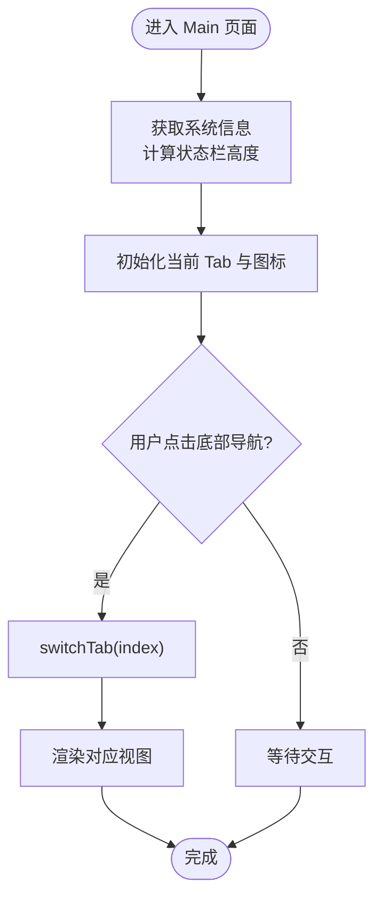
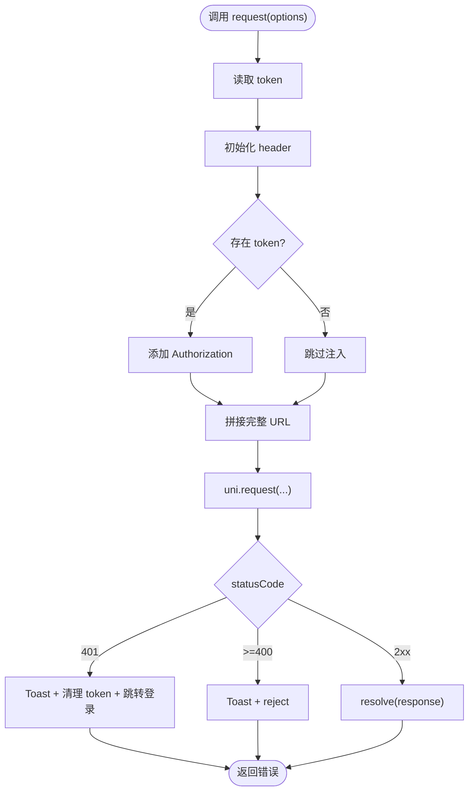
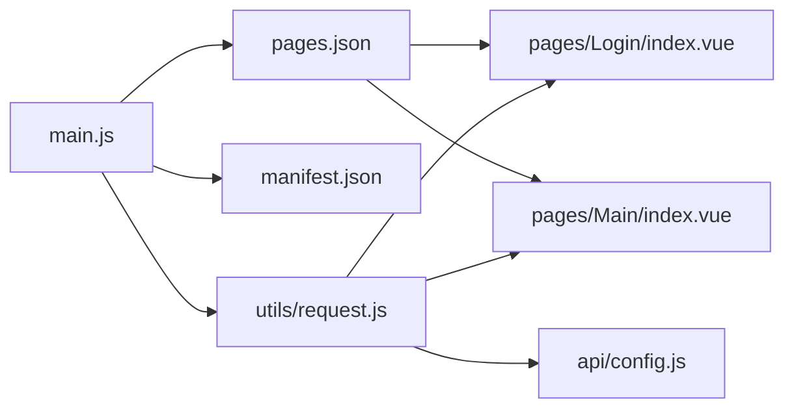

# 调试与测试指南

<cite>
**本文引用的文件**
- [main.js](file://main.js)
- [App.vue](file://App.vue)
- [pages.json](file://pages.json)
- [manifest.json](file://manifest.json)
- [package.json](file://package.json)
- [utils/request.js](file://utils/request.js)
- [api/config.js](file://api/config.js)
- [components/NavBar/index.vue](file://components/NavBar/index.vue)
- [pages/Login/index.vue](file://pages/Login/index.vue)
- [pages/Main/index.vue](file://pages/Main/index.vue)
- [doc/README.md](file://doc/README.md)
- [doc/Uniapp_STRUCTURE.md](file://doc/Uniapp_STRUCTURE.md)
</cite>

## 目录
1. [简介](#简介)
2. [项目结构](#项目结构)
3. [核心组件](#核心组件)
4. [架构总览](#架构总览)
5. [详细组件分析](#详细组件分析)
6. [依赖分析](#依赖分析)
7. [性能考虑](#性能考虑)
8. [故障排查指南](#故障排查指南)
9. [结论](#结论)
10. [附录](#附录)

## 简介
本指南面向致良知教育项目的开发与测试团队，提供从开发环境调试到端到端测试的完整实践方案。内容覆盖：
- 浏览器与多端开发者工具使用、断点调试与网络监控
- uni-app 特有的真机调试、模拟器测试与多端兼容性检查
- 单元测试与集成测试策略，包括页面导航、API 接口与用户流程测试
- 代码审查清单、质量检查标准与持续集成配置建议

## 项目结构
项目采用 uni-app + Vue 3 的多端一体化架构，页面与组件分离清晰，API 配置集中管理，便于统一调试与测试。

图表来源
- [main.js:1-26](file://main.js#L1-L26)
- [App.vue:1-40](file://App.vue#L1-L40)
- [pages.json:1-131](file://pages.json#L1-L131)
- [manifest.json:1-73](file://manifest.json#L1-L73)
- [utils/request.js:1-98](file://utils/request.js#L1-L98)
- [api/config.js:1-60](file://api/config.js#L1-L60)
- [pages/Login/index.vue:1-900](file://pages/Login/index.vue#L1-L900)
- [pages/Main/index.vue:1-224](file://pages/Main/index.vue#L1-L224)
- [components/NavBar/index.vue:1-68](file://components/NavBar/index.vue#L1-L68)

章节来源
- [doc/README.md:1-259](file://doc/README.md#L1-L259)
- [doc/Uniapp_STRUCTURE.md:1-387](file://doc/Uniapp_STRUCTURE.md#L1-L387)

## 核心组件
- 应用入口与多端适配：在入口文件中区分 Vue 2/3 的创建方式，并全局注册自定义组件，便于统一调试与测试。
- 统一请求封装：集中处理 Token 注入、URL 拼接、错误处理与 Toast 提示，便于网络层断点与日志定位。
- 页面路由与多端配置：通过 pages.json 与 manifest.json 控制页面样式、导航栏与多端权限，保障多端一致性。
- 自定义导航栏：提供智能返回逻辑与状态栏适配，便于页面导航测试与兼容性验证。

章节来源
- [main.js:1-26](file://main.js#L1-L26)
- [utils/request.js:1-98](file://utils/request.js#L1-L98)
- [pages.json:1-131](file://pages.json#L1-L131)
- [manifest.json:1-73](file://manifest.json#L1-L73)
- [components/NavBar/index.vue:1-68](file://components/NavBar/index.vue#L1-L68)

## 架构总览
下图展示了从前端入口到 API 层的关键交互路径，以及 uni-app 多端适配与页面路由的关系。

图表来源
- [App.vue:1-40](file://App.vue#L1-L40)
- [pages/Main/index.vue:1-224](file://pages/Main/index.vue#L1-L224)
- [utils/request.js:1-98](file://utils/request.js#L1-L98)
- [api/config.js:1-60](file://api/config.js#L1-L60)

## 详细组件分析

### 登录流程与调试要点
- 登录页负责表单校验、微信授权与本地存储，适合断点与网络监控演练。
- 关键调试点：
  - 表单字段变更与校验逻辑
  - uni.request 的请求参数与响应结构
  - Token 写入与页面跳转时机
  - 微信授权失败与异常分支

图表来源
- [pages/Login/index.vue:177-452](file://pages/Login/index.vue#L177-L452)
- [utils/request.js:7-67](file://utils/request.js#L7-L67)
- [api/config.js:16-56](file://api/config.js#L16-L56)

章节来源
- [pages/Login/index.vue:177-452](file://pages/Login/index.vue#L177-L452)
- [utils/request.js:7-67](file://utils/request.js#L7-L67)
- [api/config.js:16-56](file://api/config.js#L16-L56)

### 主页面与导航栏调试要点
- 主页面通过底部导航切换四个视图，适合验证页面切换、事件传递与状态栏适配。
- 导航栏组件提供智能返回逻辑，便于测试单页分享场景下的回退行为。

图表来源
- [pages/Main/index.vue:99-114](file://pages/Main/index.vue#L99-L114)
- [components/NavBar/index.vue:39-48](file://components/NavBar/index.vue#L39-L48)

章节来源
- [pages/Main/index.vue:99-114](file://pages/Main/index.vue#L99-L114)
- [components/NavBar/index.vue:39-48](file://components/NavBar/index.vue#L39-L48)

### 统一请求封装与错误处理
- 统一注入 Authorization 头，自动拼接完整 URL，集中处理 401 与 HTTP 错误码，并通过 Toast 提示。
- 调试建议：
  - 在 request.js 中设置断点，观察 header 与 URL
  - 监控 uni.request 的 success/fail 分支
  - 验证 Token 缓存与清除逻辑

图表来源
- [utils/request.js:7-67](file://utils/request.js#L7-L67)

章节来源
- [utils/request.js:7-67](file://utils/request.js#L7-L67)

## 依赖分析
- uni-app 与 Vue 3：入口文件区分 VUE3/VUE2 的创建方式，manifest.json 指定 vueVersion。
- UI 组件：通过 pages.json 的 easycom 自动扫描与 uni-ui 包集成。
- API 配置：api/config.js 提供 baseUrl 与 paths，被页面与请求封装共同使用。

图表来源
- [main.js:1-26](file://main.js#L1-L26)
- [pages.json:1-131](file://pages.json#L1-L131)
- [manifest.json:1-73](file://manifest.json#L1-L73)
- [utils/request.js:1-98](file://utils/request.js#L1-L98)
- [api/config.js:1-60](file://api/config.js#L1-L60)
- [pages/Login/index.vue:1-900](file://pages/Login/index.vue#L1-L900)
- [pages/Main/index.vue:1-224](file://pages/Main/index.vue#L1-L224)

章节来源
- [package.json:1-6](file://package.json#L1-L6)
- [pages.json:2-7](file://pages.json#L2-L7)

## 性能考虑
- 组件懒加载与按需渲染：主页面通过 v-show 切换视图，减少重复挂载成本。
- 网络请求优化：统一请求封装减少重复逻辑，避免重复鉴权与 URL 拼接。
- 样式与动画：合理使用 CSS 动画与 backdrop-filter，注意低端设备性能差异。
- 多端适配：使用 rpx、安全区域适配与条件编译，降低重排与重绘。

## 故障排查指南
- 登录失败与网络异常
  - 检查 API 基础地址与路径配置，确认 baseUrl 与 paths 正确。
  - 在登录页断点观察 uni.request 的请求与响应，关注 Toast 提示。
  - 核对 Token 写入与清理逻辑，确认页面跳转时机。
- 401 未授权
  - 在请求封装中设置断点，确认 Authorization 头是否正确注入。
  - 观察 401 分支的 Toast、token 清理与跳转逻辑。
- 页面导航异常
  - 在主页面与导航栏组件中验证状态栏高度与切换逻辑。
  - 检查 pages.json 的 navigationStyle 与页面栈行为。
- 多端兼容性
  - 使用微信开发者工具与 HBuilderX 预览，对比不同平台表现。
  - 关注 manifest.json 中的权限与平台配置。

章节来源
- [api/config.js:8-56](file://api/config.js#L8-L56)
- [utils/request.js:24-67](file://utils/request.js#L24-L67)
- [pages/Login/index.vue:196-282](file://pages/Login/index.vue#L196-L282)
- [pages/Main/index.vue:99-114](file://pages/Main/index.vue#L99-L114)
- [components/NavBar/index.vue:34-48](file://components/NavBar/index.vue#L34-L48)
- [pages.json:121-129](file://pages.json#L121-L129)
- [manifest.json:52-58](file://manifest.json#L52-L58)

## 结论
本指南提供了从开发环境到多端调试、从单元测试到集成测试的系统化方法。建议团队在日常开发中：
- 将断点与网络监控作为常规调试手段
- 以页面导航与 API 接口为核心测试对象
- 建立代码审查与质量检查标准
- 结合多端工具与 CI 流程保障交付质量

## 附录

### uni-app 调试与测试清单
- 浏览器与多端工具
  - 使用微信开发者工具进行小程序端调试，开启“不校验合法域名”等必要设置
  - 使用 HBuilderX 预览与真机调试，观察页面栈与导航行为
  - 使用浏览器开发者工具监控网络请求与控制台输出
- 断点与日志
  - 在登录页与请求封装中设置断点，观察请求参数、响应结构与错误分支
  - 在主页面与导航栏组件中验证状态栏高度与切换逻辑
- 网络监控
  - 关注 401 与 400+ 错误的处理与提示
  - 核对 Authorization 头与 URL 拼接
- 多端兼容性
  - 在 pages.json 中检查 navigationStyle 与页面样式
  - 在 manifest.json 中核对平台权限与配置

章节来源
- [pages/Login/index.vue:196-282](file://pages/Login/index.vue#L196-L282)
- [utils/request.js:24-67](file://utils/request.js#L24-L67)
- [pages/Main/index.vue:99-114](file://pages/Main/index.vue#L99-L114)
- [components/NavBar/index.vue:34-48](file://components/NavBar/index.vue#L34-L48)
- [pages.json:121-129](file://pages.json#L121-L129)
- [manifest.json:52-58](file://manifest.json#L52-L58)

### 单元测试与集成测试策略
- 单元测试
  - 测试工具函数：如表单校验、URL 拼接、Token 注入
  - 测试组件逻辑：导航栏返回逻辑、状态栏高度计算
- 集成测试
  - 页面导航测试：主页面底部导航切换、返回逻辑
  - API 接口测试：登录、微信登录、课程列表、志愿者相关接口
  - 用户流程测试：登录→信息补全→首页→课程详情→志愿者页面
- Mock 数据
  - 使用 api/config.js 的 baseUrl 与 paths，结合本地或云端 Mock 服务
  - 在测试中模拟 200/401/400+ 等不同响应，验证错误处理

章节来源
- [api/config.js:8-56](file://api/config.js#L8-L56)
- [utils/request.js:7-67](file://utils/request.js#L7-L67)
- [pages/Login/index.vue:177-452](file://pages/Login/index.vue#L177-L452)
- [pages/Main/index.vue:99-114](file://pages/Main/index.vue#L99-L114)
- [components/NavBar/index.vue:34-48](file://components/NavBar/index.vue#L34-L48)

### 代码审查清单与质量检查标准
- 代码规范
  - 组件命名与目录结构符合规范
  - 使用 Composition API 与 SCSS 预处理器
- 安全与健壮性
  - 统一请求封装中的错误处理与 Toast 提示
  - Token 管理与页面跳转逻辑
- 兼容性与性能
  - 多端配置与权限声明
  - rpx 适配与动画性能评估
- 文档与可维护性
  - 关键流程与配置的文档说明
  - 测试用例与回归测试计划

章节来源
- [doc/Uniapp_STRUCTURE.md:202-262](file://doc/Uniapp_STRUCTURE.md#L202-L262)
- [doc/README.md:64-95](file://doc/README.md#L64-L95)

### 持续集成配置建议
- 构建与测试
  - 在 CI 中安装依赖并执行构建命令
  - 运行单元测试与集成测试脚本
- 多端打包
  - 配置小程序、App 与 H5 的打包步骤
  - 使用 manifest.json 中的平台配置进行签名与权限设置
- 质量门禁
  - 代码覆盖率与静态检查
  - 多端兼容性自动化验证

章节来源
- [manifest.json:52-58](file://manifest.json#L52-L58)
- [doc/Uniapp_STRUCTURE.md:264-301](file://doc/Uniapp_STRUCTURE.md#L264-L301)