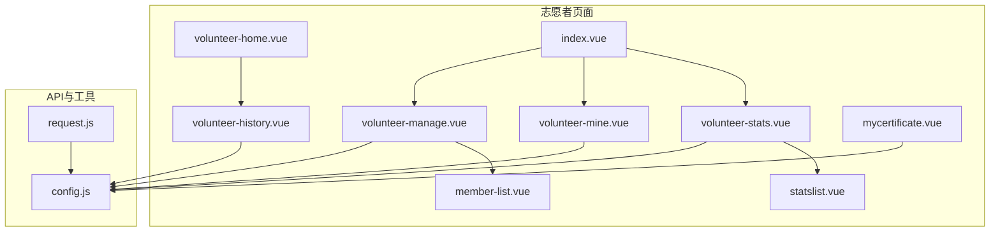
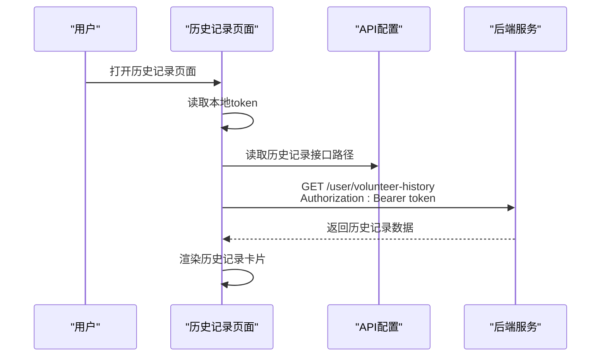
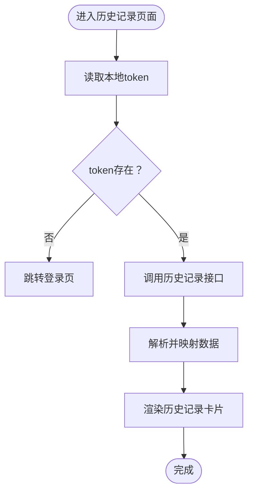
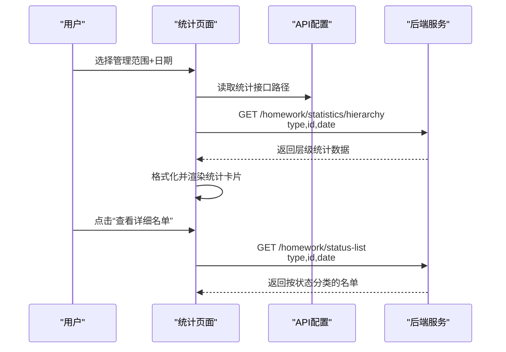
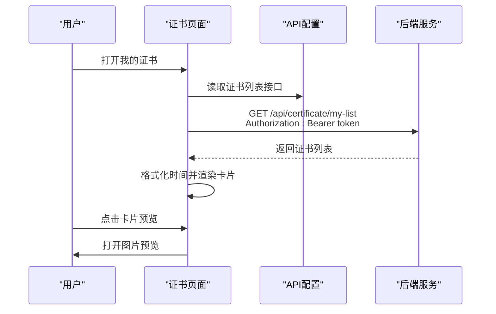
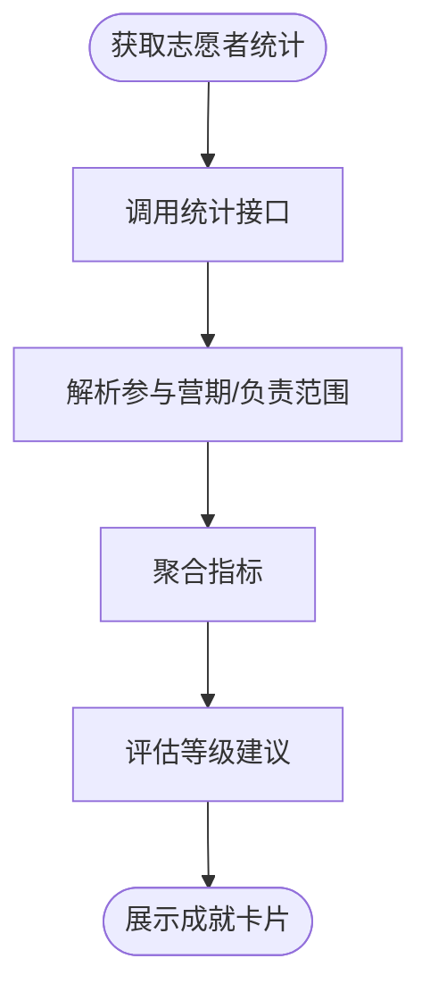
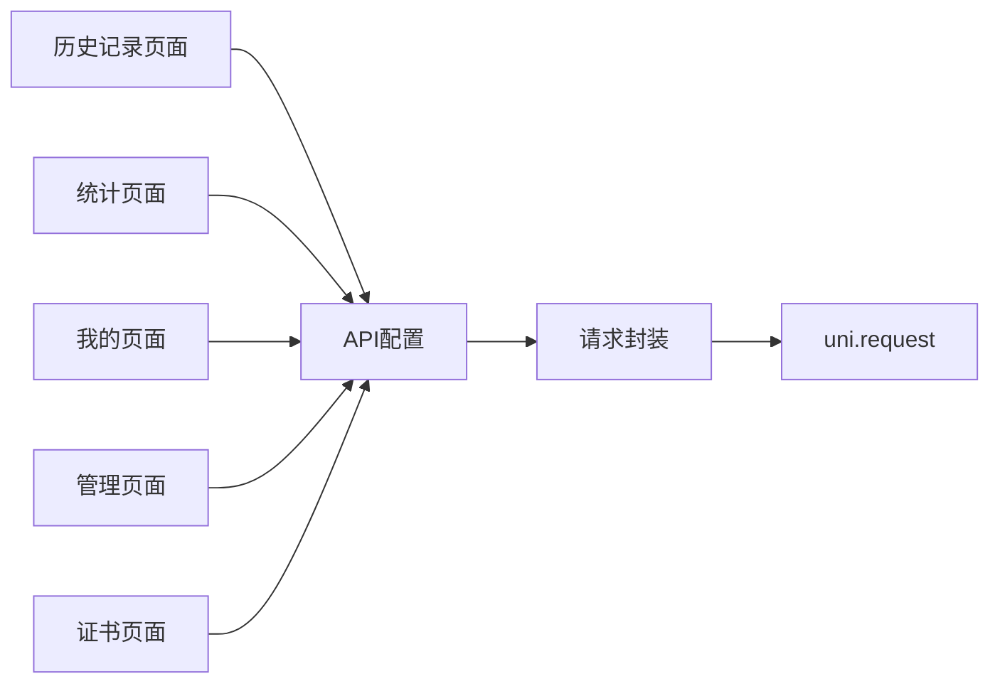

# 志愿者历史记录

<cite>
**本文引用的文件**
- [volunteer-history.vue](file://pages/volunteer-history/volunteer-history.vue)
- [volunteer-home.vue](file://components/volunteer/volunteer-home.vue)
- [volunteer-stats.vue](file://components/volunteer/volunteer-stats.vue)
- [volunteer-mine.vue](file://components/volunteer/volunteer-mine.vue)
- [mycertificate.vue](file://pages/certificate/mycertificate.vue)
- [config.js](file://api/config.js)
- [request.js](file://utils/request.js)
- [volunteer-manage.vue](file://pages/volunteer-manage/volunteer-manage.vue)
- [member-list.vue](file://pages/volunteer-manage/member-list.vue)
- [statslist.vue](file://pages/volunteer/homework/statslist.vue)
- [index.vue](file://pages/volunteer/index.vue)
</cite>

## 目录
1. [简介](#简介)
2. [项目结构](#项目结构)
3. [核心组件](#核心组件)
4. [架构总览](#架构总览)
5. [详细组件分析](#详细组件分析)
6. [依赖关系分析](#依赖关系分析)
7. [性能考量](#性能考量)
8. [故障排查指南](#故障排查指南)
9. [结论](#结论)
10. [附录](#附录)

## 简介
本文件围绕致良知教育项目的“志愿者历史记录”功能进行系统化技术文档整理，重点覆盖以下方面：
- 历史记录查询：时间范围筛选、状态过滤、数据分页与展示
- 服务统计分析：数据聚合算法、层级统计与可视化呈现
- 证书管理：证书列表获取与电子证书展示
- 成就展示：基于服务统计的积分与等级评估机制
- 数据存储与迁移：前端本地存储策略、备份与迁移建议
- 导出与分析：历史记录导出与数据分析工具建议

## 项目结构
项目采用小程序框架（uni-app）组织，志愿者相关页面集中在 pages/volunteer 与 components/volunteer 下，并通过 API 配置集中管理后端接口地址与路径。

图表来源
- [volunteer-home.vue:68-96](file://components/volunteer/volunteer-home.vue#L68-L96)
- [index.vue:44-57](file://pages/volunteer/index.vue#L44-L57)
- [volunteer-stats.vue:209-239](file://components/volunteer/volunteer-stats.vue#L209-L239)
- [volunteer-mine.vue:103-108](file://components/volunteer/volunteer-mine.vue#L103-L108)
- [volunteer-manage.vue:238-241](file://pages/volunteer-manage/volunteer-manage.vue#L238-L241)
- [member-list.vue:62-73](file://pages/volunteer-manage/member-list.vue#L62-L73)
- [statslist.vue:90-95](file://pages/volunteer/homework/statslist.vue#L90-L95)
- [volunteer-history.vue:60-78](file://pages/volunteer-history/volunteer-history.vue#L60-L78)
- [mycertificate.vue:51-62](file://pages/certificate/mycertificate.vue#L51-L62)
- [config.js:8-57](file://api/config.js#L8-L57)
- [request.js:1-98](file://utils/request.js#L1-L98)

章节来源
- [volunteer-home.vue:68-96](file://components/volunteer/volunteer-home.vue#L68-L96)
- [index.vue:44-57](file://pages/volunteer/index.vue#L44-L57)
- [config.js:8-57](file://api/config.js#L8-L57)

## 核心组件
- 历史记录页面：负责展示志愿者的历史担当记录，包含负责人、职责、时间区间与状态标签。
- 统计分析页面：提供按管理范围与日期的层级统计，展示按时完成率等指标。
- 证书页面：展示用户拥有的电子证书列表，支持预览。
- 管理页面：提供成员管理、岗位分配与层级浏览能力。
- API 配置：集中管理后端基础地址与各接口路径。
- 请求封装：统一封装请求流程，自动注入 Authorization 头与错误处理。

章节来源
- [volunteer-history.vue:60-127](file://pages/volunteer-history/volunteer-history.vue#L60-L127)
- [volunteer-stats.vue:209-399](file://components/volunteer/volunteer-stats.vue#L209-L399)
- [mycertificate.vue:51-129](file://pages/certificate/mycertificate.vue#L51-L129)
- [volunteer-manage.vue:238-732](file://pages/volunteer-manage/volunteer-manage.vue#L238-L732)
- [config.js:8-57](file://api/config.js#L8-L57)
- [request.js:7-67](file://utils/request.js#L7-L67)

## 架构总览
前端通过 API 配置文件统一管理后端接口，使用 uni.request 发起请求；在需要鉴权的场景下，自动从本地缓存读取 token 并注入到 Authorization 头。历史记录、统计分析、证书与管理页面均遵循这一统一的请求与鉴权模式。

图表来源
- [volunteer-history.vue:86-125](file://pages/volunteer-history/volunteer-history.vue#L86-L125)
- [config.js:33](file://api/config.js#L33)
- [request.js:24-66](file://utils/request.js#L24-L66)

## 详细组件分析

### 历史记录查询与展示
- 登录态校验：页面加载时读取本地 token，若缺失则跳转登录。
- 接口调用：通过 API 配置中的路径拼接完整 URL，发起 GET 请求并携带 Authorization 头。
- 数据映射：对后端返回的字段进行映射与格式化，如时间区间拆分、状态转换、责任描述等。
- 展示逻辑：使用循环渲染历史记录卡片，为空时显示提示文案。

图表来源
- [volunteer-history.vue:70-125](file://pages/volunteer-history/volunteer-history.vue#L70-L125)

章节来源
- [volunteer-history.vue:60-127](file://pages/volunteer-history/volunteer-history.vue#L60-L127)
- [config.js:33](file://api/config.js#L33)

### 服务统计分析与可视化
- 管理范围选择：通过获取管理范围接口，动态展示可选范围列表，支持按 assignmentId 选择。
- 日期筛选：提供日期选择器，默认选择当天，变更日期后重新请求统计。
- 层级统计：后端返回层级化的统计结构，前端进行格式化与展开/折叠控制。
- 指标展示：包含总人数、按时完成数、未交数、迟交数与按时完成率等关键指标。
- 详情跳转：点击“查看详细名单”跳转至按状态分类的名单页。

图表来源
- [volunteer-stats.vue:251-363](file://components/volunteer/volunteer-stats.vue#L251-L363)
- [statslist.vue:140-183](file://pages/volunteer/homework/statslist.vue#L140-L183)

章节来源
- [volunteer-stats.vue:209-399](file://components/volunteer/volunteer-stats.vue#L209-L399)
- [statslist.vue:90-185](file://pages/volunteer/homework/statslist.vue#L90-L185)

### 证书管理与电子证书展示
- 列表获取：通过 GET 请求获取当前用户的证书列表，接口路径在 API 配置中定义。
- 时间格式化：将后端时间戳格式化为本地可读格式。
- 预览功能：点击卡片打开图片预览，支持菜单操作。

图表来源
- [mycertificate.vue:76-128](file://pages/certificate/mycertificate.vue#L76-L128)
- [config.js:89](file://api/config.js#L89)

章节来源
- [mycertificate.vue:51-129](file://pages/certificate/mycertificate.vue#L51-L129)
- [config.js:89](file://api/config.js#L89)

### 成就展示与积分/等级机制
- 服务统计：通过“我的”页面的志愿者统计接口，获取参与营期、负责班级、大组、小组的数量。
- 指标聚合：将上述数量作为基础指标，用于衡量志愿者的服务广度与深度。
- 等级评估：建议以“累计服务时长/次数”、“按时完成率”、“负责范围”等维度综合评估等级，具体规则可在业务侧扩展。

图表来源
- [volunteer-mine.vue:241-296](file://components/volunteer/volunteer-mine.vue#L241-L296)

章节来源
- [volunteer-mine.vue:103-296](file://components/volunteer/volunteer-mine.vue#L103-L296)

### 历史数据存储策略、备份与迁移
- 本地存储：前端使用 uni.getStorageSync/uni.setStorageSync 读写 token、用户信息与身份标识。
- 备份建议：建议在本地持久化关键统计结果与证书列表，便于离线查看与减少重复请求。
- 迁移建议：在版本升级或用户更换设备时，可通过后端接口同步用户数据，避免丢失。

章节来源
- [volunteer-history.vue:70-77](file://pages/volunteer-history/volunteer-history.vue#L70-L77)
- [volunteer-mine.vue:160-179](file://components/volunteer/volunteer-mine.vue#L160-L179)

### 导出功能与数据分析工具
- 导出建议：在历史记录与统计页面增加“导出为Excel/CSV”的入口，将当前筛选条件下的数据导出。
- 数据分析：结合统计页面的按时完成率、未交/迟交分布，生成趋势图与报表，辅助管理决策。

章节来源
- [volunteer-stats.vue:325-363](file://components/volunteer/volunteer-stats.vue#L325-L363)
- [volunteer-history.vue:86-125](file://pages/volunteer-history/volunteer-history.vue#L86-L125)

## 依赖关系分析
- 组件耦合：历史记录、统计分析、证书与管理页面均依赖 API 配置与请求封装，保持统一的鉴权与错误处理。
- 外部依赖：使用 uni.request 发起 HTTP 请求，使用 uni.showToast 提示错误与状态。
- 可能的循环依赖：当前结构清晰，未发现明显循环依赖。

图表来源
- [volunteer-history.vue:60-61](file://pages/volunteer-history/volunteer-history.vue#L60-L61)
- [volunteer-stats.vue:209](file://components/volunteer/volunteer-stats.vue#L209)
- [volunteer-mine.vue:104](file://components/volunteer/volunteer-mine.vue#L104)
- [volunteer-manage.vue:239](file://pages/volunteer-manage/volunteer-manage.vue#L239)
- [mycertificate.vue:52](file://pages/certificate/mycertificate.vue#L52)
- [config.js:8](file://api/config.js#L8)
- [request.js:24-66](file://utils/request.js#L24-L66)

章节来源
- [config.js:8-57](file://api/config.js#L8-L57)
- [request.js:7-67](file://utils/request.js#L7-L67)

## 性能考量
- 请求合并：在统计页面，建议将“管理范围列表”与“层级统计”请求合并，减少不必要的二次请求。
- 数据缓存：对历史记录与证书列表进行本地缓存，降低重复请求带来的延迟。
- 图片优化：证书预览使用压缩后的图片，避免大图导致的卡顿。
- 分页策略：若历史记录数据量较大，建议引入分页或虚拟滚动提升渲染性能。

## 故障排查指南
- 401 未授权：统一请求封装会检测 401 并清除 token，提示重新登录。
- 网络异常：捕获 fail 回调并提示网络错误，建议重试或检查网络。
- 参数缺失：在统计与名单页面，若缺少 type/id/date 等参数，需提示用户重新选择范围或日期。

章节来源
- [request.js:29-44](file://utils/request.js#L29-L44)
- [volunteer-stats.vue:325-363](file://components/volunteer/volunteer-stats.vue#L325-L363)
- [statslist.vue:140-183](file://pages/volunteer/homework/statslist.vue#L140-L183)

## 结论
本项目在志愿者历史记录、统计分析、证书管理与成就展示方面具备清晰的前端实现与良好的扩展性。通过统一的 API 配置与请求封装，保证了跨页面的一致性与可维护性。建议后续在导出与数据分析、分页与缓存优化等方面进一步完善，以提升用户体验与系统性能。

## 附录
- API 配置路径参考：[config.js:16-56](file://api/config.js#L16-L56)
- 请求封装参考：[request.js:7-67](file://utils/request.js#L7-L67)
- 历史记录页面参考：[volunteer-history.vue:60-127](file://pages/volunteer-history/volunteer-history.vue#L60-L127)
- 统计页面参考：[volunteer-stats.vue:209-399](file://components/volunteer/volunteer-stats.vue#L209-L399)
- 证书页面参考：[mycertificate.vue:51-129](file://pages/certificate/mycertificate.vue#L51-L129)
- 管理页面参考：[volunteer-manage.vue:238-732](file://pages/volunteer-manage/volunteer-manage.vue#L238-L732)
- 名单详情页面参考：[statslist.vue:90-185](file://pages/volunteer/homework/statslist.vue#L90-L185)