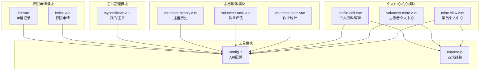
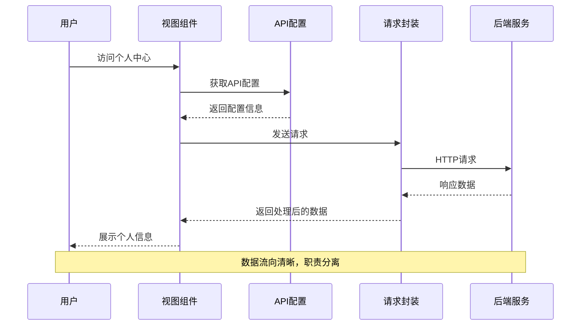
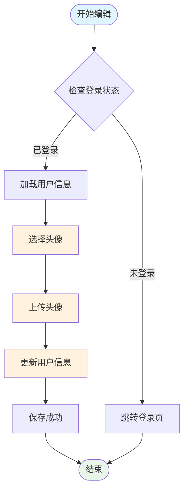
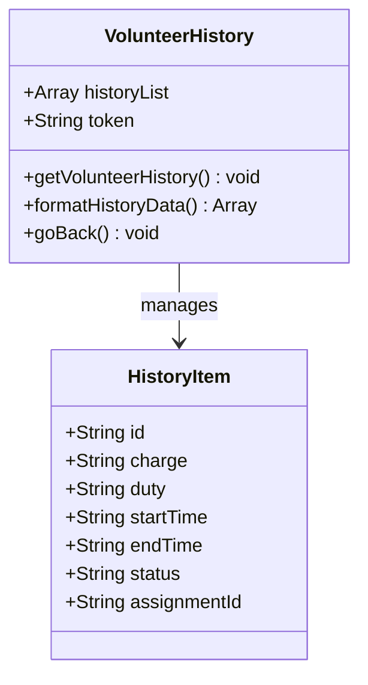
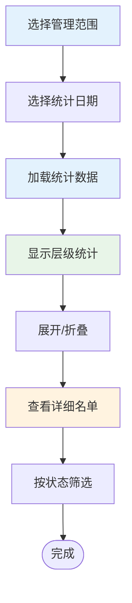
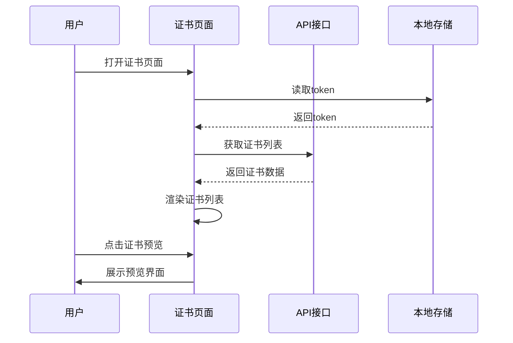
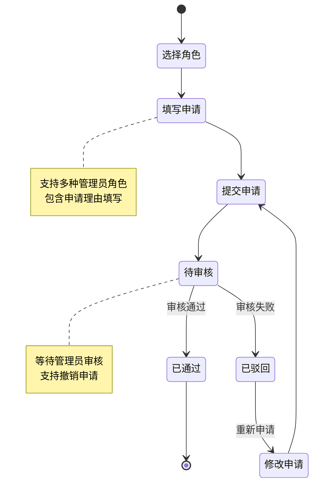
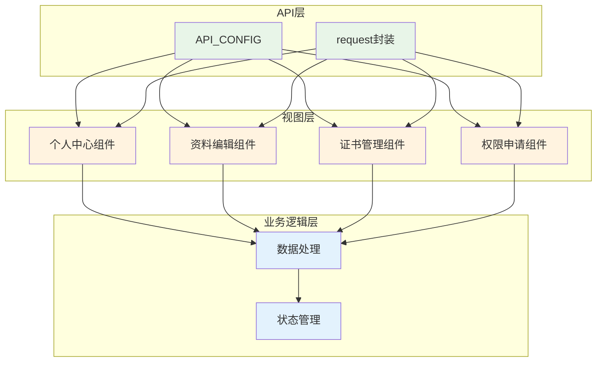

# 个人中心

<cite>
**本文档引用的文件**
- [profile-edit.vue](file://pages/Mine/profile-edit.vue)
- [mine-view.vue](file://components/mine-view/mine-view.vue)
- [volunteer-mine.vue](file://components/volunteer/volunteer-mine.vue)
- [volunteer-history.vue](file://pages/volunteer-history/volunteer-history.vue)
- [mycertificate.vue](file://pages/certificate/mycertificate.vue)
- [volunteer-stats.vue](file://components/volunteer/volunteer-stats.vue)
- [volunteer-task.vue](file://components/volunteer/volunteer-task.vue)
- [config.js](file://api/config.js)
- [request.js](file://utils/request.js)
- [list.vue](file://pages/Mine/apply-admin/list.vue)
- [index.vue](file://pages/Mine/apply-admin/index.vue)
- [homework-list.vue](file://pages/volunteer/homework/homework-list.vue)
- [statslist.vue](file://pages/volunteer/homework/statslist.vue)
</cite>

## 目录
1. [简介](#简介)
2. [项目结构](#项目结构)
3. [核心组件](#核心组件)
4. [架构概览](#架构概览)
5. [详细组件分析](#详细组件分析)
6. [依赖关系分析](#依赖关系分析)
7. [性能考虑](#性能考虑)
8. [故障排除指南](#故障排除指南)
9. [结论](#结论)

## 简介

个人中心是致良知教育小程序的核心功能模块，为用户提供完整的个人信息管理和志愿服务记录管理能力。该模块包含个人资料管理、志愿服务记录展示、证书管理、作业统计等多个子功能，为志愿者和学员提供一站式的个人信息服务。

## 项目结构

个人中心功能主要分布在以下目录结构中：

**图表来源**
- [mine-view.vue:1-133](file://components/mine-view/mine-view.vue#L1-L133)
- [volunteer-mine.vue:1-101](file://components/volunteer/volunteer-mine.vue#L1-L101)
- [profile-edit.vue:1-115](file://pages/Mine/profile-edit.vue#L1-L115)

**章节来源**
- [mine-view.vue:1-133](file://components/mine-view/mine-view.vue#L1-L133)
- [volunteer-mine.vue:1-101](file://components/volunteer/volunteer-mine.vue#L1-L101)
- [profile-edit.vue:1-115](file://pages/Mine/profile-edit.vue#L1-L115)

## 核心组件

个人中心由多个相互协作的组件构成，每个组件都有明确的职责分工：

### 个人资料管理组件
- **profile-edit.vue**: 提供完整的个人资料编辑功能，支持头像上传、基本信息修改、联系方式更新等
- **mine-view.vue**: 学员端个人中心，展示用户基本信息和快捷服务入口
- **volunteer-mine.vue**: 志愿者端个人中心，提供志愿者专属功能和统计信息

### 服务记录管理组件
- **volunteer-history.vue**: 展示志愿者服务历史记录，包括参与的活动、服务时间等
- **volunteer-stats.vue**: 提供作业统计功能，支持按层级查看作业完成情况
- **volunteer-task.vue**: 作业评优管理，支持标记优秀作业和查看详细名单

### 证书管理组件
- **mycertificate.vue**: 展示用户的证书列表，支持证书预览和管理

### 权限申请组件
- **index.vue**: 权限申请界面，支持申请不同级别的管理员权限
- **list.vue**: 申请记录管理，展示历史申请状态和处理结果

**章节来源**
- [profile-edit.vue:117-314](file://pages/Mine/profile-edit.vue#L117-L314)
- [mine-view.vue:135-377](file://components/mine-view/mine-view.vue#L135-L377)
- [volunteer-mine.vue:103-595](file://components/volunteer/volunteer-mine.vue#L103-L595)

## 架构概览

个人中心采用模块化的架构设计，通过API配置和请求封装实现统一的数据访问层：

**图表来源**
- [config.js:8-57](file://api/config.js#L8-L57)
- [request.js:7-67](file://utils/request.js#L7-L67)

### 数据流架构

个人中心的数据流遵循标准的MVVM模式：

1. **视图层**: Vue组件负责用户交互和界面展示
2. **业务逻辑层**: 组件方法处理用户操作和数据转换
3. **数据访问层**: API配置和请求封装提供统一的数据接口
4. **后端服务**: 提供RESTful API接口

**章节来源**
- [config.js:1-60](file://api/config.js#L1-L60)
- [request.js:1-98](file://utils/request.js#L1-L98)

## 详细组件分析

### 个人资料管理功能

#### 头像管理系统
个人资料编辑组件提供了完整的头像管理功能：

**图表来源**
- [profile-edit.vue:212-226](file://pages/Mine/profile-edit.vue#L212-L226)

#### 个人信息编辑流程
个人信息编辑支持多种字段的修改：
- **头像**: 支持微信头像和自定义图片上传
- **昵称**: 支持文本编辑和验证
- **手机号**: 支持手机号码验证和更新
- **地区**: 支持省市区选择和搜索
- **职业**: 支持职业信息编辑
- **性别**: 支持性别选择
- **生日**: 支持日期选择器

**章节来源**
- [profile-edit.vue:117-314](file://pages/Mine/profile-edit.vue#L117-L314)

### 志愿服务记录展示

#### 服务历史查询
志愿者历史记录页面提供了完整的服务历史展示：

**图表来源**
- [volunteer-history.vue:61-127](file://pages/volunteer-history/volunteer-history.vue#L61-L127)

#### 作业统计功能
作业统计组件提供了多层次的统计分析：

**图表来源**
- [volunteer-stats.vue:208-399](file://components/volunteer/volunteer-stats.vue#L208-L399)

**章节来源**
- [volunteer-history.vue:61-127](file://pages/volunteer-history/volunteer-history.vue#L61-L127)
- [volunteer-stats.vue:208-399](file://components/volunteer/volunteer-stats.vue#L208-L399)

### 证书管理系统

#### 证书列表展示
证书管理页面提供了直观的证书列表展示：

**图表来源**
- [mycertificate.vue:51-129](file://pages/certificate/mycertificate.vue#L51-L129)

**章节来源**
- [mycertificate.vue:51-129](file://pages/certificate/mycertificate.vue#L51-L129)

### 权限申请系统

#### 申请流程管理
权限申请系统提供了完整的申请和管理流程：

**图表来源**
- [index.vue:109-191](file://pages/Mine/apply-admin/index.vue#L109-L191)
- [list.vue:61-186](file://pages/Mine/apply-admin/list.vue#L61-L186)

**章节来源**
- [index.vue:109-191](file://pages/Mine/apply-admin/index.vue#L109-L191)
- [list.vue:61-186](file://pages/Mine/apply-admin/list.vue#L61-L186)

## 依赖关系分析

个人中心模块之间的依赖关系如下：

**图表来源**
- [config.js:8-57](file://api/config.js#L8-L57)
- [request.js:7-67](file://utils/request.js#L7-L67)

### 关键依赖点

1. **API配置集中管理**: 所有组件通过API_CONFIG统一访问后端接口
2. **请求封装统一处理**: request.js提供统一的请求处理和错误处理
3. **状态管理本地化**: 使用uni.getStorageSync进行本地状态管理
4. **权限控制统一**: 通过token进行统一的权限验证

**章节来源**
- [config.js:1-60](file://api/config.js#L1-L60)
- [request.js:1-98](file://utils/request.js#L1-L98)

## 性能考虑

### 数据加载优化
- **懒加载策略**: 非关键数据采用懒加载方式，提升首屏加载速度
- **缓存机制**: 重要数据使用本地缓存减少重复请求
- **分页加载**: 大量数据采用分页加载避免内存压力

### 网络请求优化
- **请求合并**: 相关请求进行合并减少网络往返
- **超时处理**: 设置合理的请求超时时间避免长时间等待
- **错误重试**: 对临时性错误提供自动重试机制

### 用户体验优化
- **加载指示**: 所有异步操作提供明确的加载状态反馈
- **离线支持**: 关键功能支持离线查看和基本操作
- **响应式设计**: 适配不同屏幕尺寸和设备类型

## 故障排除指南

### 常见问题及解决方案

#### 登录状态异常
**问题描述**: 用户登录状态丢失或token失效
**解决步骤**:
1. 检查本地token存储状态
2. 实施自动登录机制
3. 提供手动重新登录选项

#### 网络请求失败
**问题描述**: API请求频繁失败或超时
**解决步骤**:
1. 检查网络连接状态
2. 实施请求重试机制
3. 提供离线模式支持

#### 数据加载缓慢
**问题描述**: 页面数据加载时间过长
**解决步骤**:
1. 实施数据缓存策略
2. 优化数据请求结构
3. 提供分页加载功能

**章节来源**
- [request.js:24-67](file://utils/request.js#L24-L67)

### 调试技巧

1. **日志记录**: 在关键节点添加console.log输出
2. **状态监控**: 使用浏览器开发者工具监控网络请求
3. **错误捕获**: 实施try-catch机制捕获异常
4. **性能分析**: 使用性能分析工具识别瓶颈

## 结论

个人中心模块通过模块化的设计和清晰的职责分工，为用户提供了完整的个人信息管理和志愿服务记录管理功能。系统采用统一的API配置和请求封装，确保了数据访问的一致性和可靠性。

### 主要优势
- **功能完整性**: 涵盖个人资料管理、服务记录展示、证书管理等核心功能
- **用户体验良好**: 界面简洁直观，操作流程顺畅
- **扩展性强**: 模块化设计便于功能扩展和维护
- **性能稳定**: 采用多种优化策略确保系统性能

### 改进建议
1. **个性化定制**: 增加更多个性化设置选项
2. **数据导出**: 提供数据导出功能满足用户需求
3. **通知提醒**: 增强系统通知和提醒功能
4. **数据分析**: 提供更丰富的数据分析和统计功能

该个人中心模块为致良知教育小程序提供了坚实的用户基础，为后续功能扩展奠定了良好的技术基础。