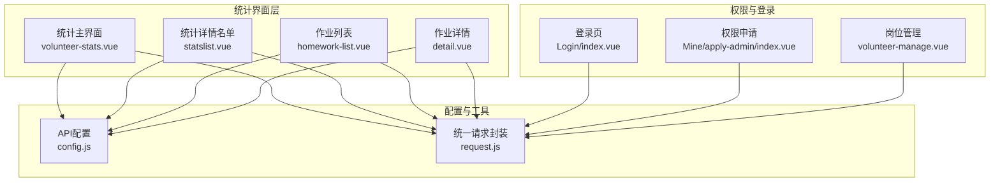
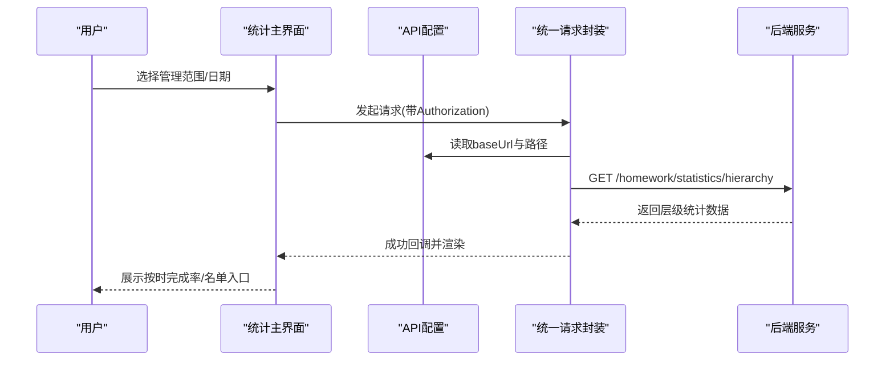
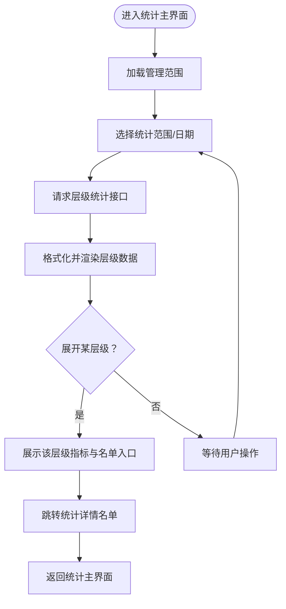
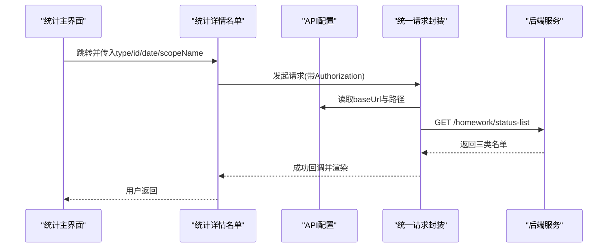
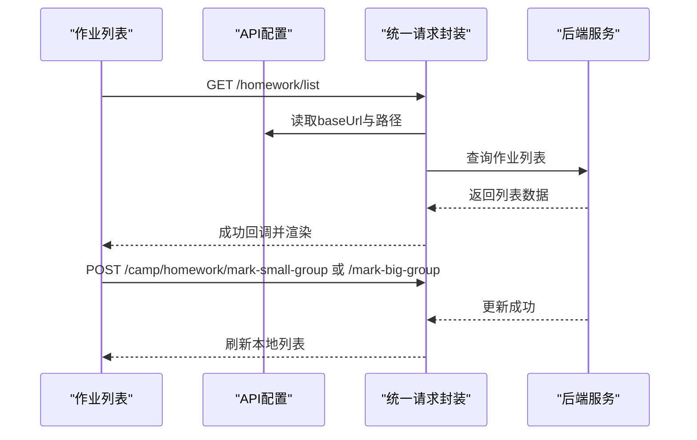
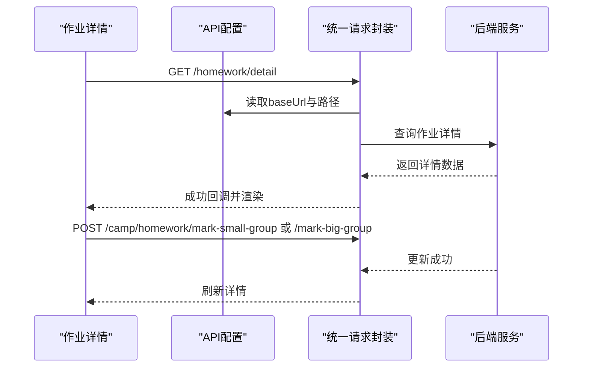
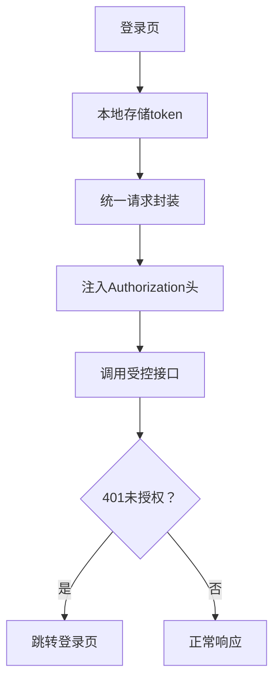
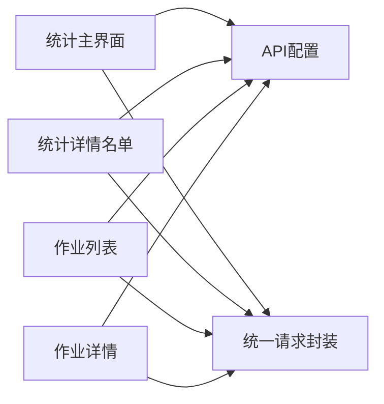

# 作业统计

<cite>
**本文引用的文件**
- [volunteer-stats.vue](file://components/volunteer/volunteer-stats.vue)
- [statslist.vue](file://pages/volunteer/homework/statslist.vue)
- [homework-list.vue](file://pages/volunteer/homework/homework-list.vue)
- [detail.vue](file://pages/volunteer/homework/detail.vue)
- [config.js](file://api/config.js)
- [request.js](file://utils/request.js)
- [index.vue](file://pages/Login/index.vue)
- [index.vue](file://pages/Mine/apply-admin/index.vue)
- [index.vue](file://pages/volunteer-manage/volunteer-manage.vue)
</cite>

## 目录
1. [简介](#简介)
2. [项目结构](#项目结构)
3. [核心组件](#核心组件)
4. [架构总览](#架构总览)
5. [详细组件分析](#详细组件分析)
6. [依赖关系分析](#依赖关系分析)
7. [性能考量](#性能考量)
8. [故障排除指南](#故障排除指南)
9. [结论](#结论)
10. [附录](#附录)

## 简介
本模块围绕“作业统计”展开，覆盖从统计报表设计、数据可视化到统计指标计算、权限控制与数据安全、以及导出与自定义查询等能力。当前前端实现以层级化统计为主，提供按班级/大组/小组的作业完成情况汇总，并支持查看各层级下的“已交/未交/迟交”名单明细；同时包含作业列表、优秀作业标记、作业详情等功能，便于管理者进行作业质量把控与数据溯源。

## 项目结构
作业统计相关的核心文件分布如下：
- 统计主界面：components/volunteer/volunteer-stats.vue
- 统计详情名单：pages/volunteer/homework/statslist.vue
- 作业列表与标记：pages/volunteer/homework/homework-list.vue
- 作业详情与标记：pages/volunteer/homework/detail.vue
- API 配置：api/config.js
- 统一请求封装：utils/request.js
- 登录与权限入口：pages/Login/index.vue、pages/Mine/apply-admin/index.vue
- 管理员岗位分配：pages/volunteer-manage/volunteer-manage.vue

**图表来源**
- [volunteer-stats.vue:1-400](file://components/volunteer/volunteer-stats.vue#L1-L400)
- [statslist.vue:1-200](file://pages/volunteer/homework/statslist.vue#L1-L200)
- [homework-list.vue:1-200](file://pages/volunteer/homework/homework-list.vue#L1-L200)
- [detail.vue:1-200](file://pages/volunteer/homework/detail.vue#L1-L200)
- [config.js:1-60](file://api/config.js#L1-L60)
- [request.js:1-50](file://utils/request.js#L1-L50)
- [index.vue:1-300](file://pages/Login/index.vue#L1-L300)
- [index.vue:1-200](file://pages/Mine/apply-admin/index.vue#L1-L200)
- [index.vue:180-260](file://pages/volunteer-manage/volunteer-manage.vue#L180-L260)

**章节来源**
- [volunteer-stats.vue:1-400](file://components/volunteer/volunteer-stats.vue#L1-L400)
- [statslist.vue:1-200](file://pages/volunteer/homework/statslist.vue#L1-L200)
- [homework-list.vue:1-200](file://pages/volunteer/homework/homework-list.vue#L1-L200)
- [detail.vue:1-200](file://pages/volunteer/homework/detail.vue#L1-L200)
- [config.js:1-60](file://api/config.js#L1-L60)
- [request.js:1-50](file://utils/request.js#L1-L50)

## 核心组件
- 统计主界面：提供管理范围选择、日期选择、层级化统计展示（班级/大组/小组），并支持展开查看各层级的“总人数、按时完成率、已交/未交/迟交”等关键指标。
- 统计详情名单：按“已交/未交/迟交”三类标签展示具体人员名单，支持返回上级统计界面。
- 作业列表：支持按日期筛选、切换“作业列表/优秀作业”标签，提供“小组优秀/大组优秀”标记能力。
- 作业详情：展示作业内容与提交信息，支持“小组优秀/大组优秀”标记与取消，并对不同角色进行权限校验。
- API 配置：集中管理后端接口地址与路径，便于扩展与维护。
- 统一请求封装：自动注入 Authorization 头，处理 401 未授权跳转登录等通用逻辑。
- 权限与登录：登录页负责认证与本地存储；权限申请页支持申请管理员角色；岗位管理页支持分配/移除岗位。

**章节来源**
- [volunteer-stats.vue:1-400](file://components/volunteer/volunteer-stats.vue#L1-L400)
- [statslist.vue:1-200](file://pages/volunteer/homework/statslist.vue#L1-L200)
- [homework-list.vue:1-200](file://pages/volunteer/homework/homework-list.vue#L1-L200)
- [detail.vue:1-200](file://pages/volunteer/homework/detail.vue#L1-L200)
- [config.js:1-60](file://api/config.js#L1-L60)
- [request.js:1-50](file://utils/request.js#L1-L50)
- [index.vue:1-300](file://pages/Login/index.vue#L1-L300)
- [index.vue:1-200](file://pages/Mine/apply-admin/index.vue#L1-L200)
- [index.vue:180-260](file://pages/volunteer-manage/volunteer-manage.vue#L180-L260)

## 架构总览
作业统计模块采用“界面层-配置层-工具层-权限层”的分层架构：
- 界面层：统计主界面、统计详情、作业列表、作业详情等页面组件。
- 配置层：API 配置集中管理后端接口路径，便于扩展新接口。
- 工具层：统一请求封装，自动注入 Authorization 头，处理 401 未授权跳转登录。
- 权限层：登录认证、管理员角色申请、岗位分配与移除，保障数据访问与操作的安全性。

**图表来源**
- [volunteer-stats.vue:325-364](file://components/volunteer/volunteer-stats.vue#L325-L364)
- [config.js:50-56](file://api/config.js#L50-L56)
- [request.js:1-50](file://utils/request.js#L1-L50)

**章节来源**
- [volunteer-stats.vue:325-364](file://components/volunteer/volunteer-stats.vue#L325-L364)
- [config.js:50-56](file://api/config.js#L50-L56)
- [request.js:1-50](file://utils/request.js#L1-L50)

## 详细组件分析

### 统计主界面（层级化统计）
- 功能要点
  - 管理范围选择：支持按班级/大组/小组选择统计范围。
  - 日期选择：支持按日筛选统计。
  - 展示层级：根层级（如班级）、子层级（如大组）、孙层级（如小组）逐层展开。
  - 关键指标：总人数、按时完成率、已交/未交/迟交数量。
  - 交互：点击“查看详细名单”跳转至统计详情名单页。
- 数据流
  - 通过 getHierarchyStatistics 发起请求，后端返回层级化数据，前端格式化后渲染。
  - 支持切换日期与范围后重新拉取数据。
- 权限与安全
  - 统一通过 Authorization 头传递 token，未登录或 token 失效会触发 401 处理与跳转登录。

**图表来源**
- [volunteer-stats.vue:251-398](file://components/volunteer/volunteer-stats.vue#L251-L398)

**章节来源**
- [volunteer-stats.vue:251-398](file://components/volunteer/volunteer-stats.vue#L251-L398)

### 统计详情名单（按状态分类）
- 功能要点
  - 三标签切换：“已交/未交/迟交”，对应不同的人员列表。
  - 展示字段：姓名、手机号等基本信息。
  - 交互：返回上级统计界面。
- 数据流
  - 通过 getDetailLists 发起请求，后端返回三类人员列表，前端按标签切换显示。

**图表来源**
- [statslist.vue:140-183](file://pages/volunteer/homework/statslist.vue#L140-L183)
- [config.js:50-51](file://api/config.js#L50-L51)
- [request.js:1-50](file://utils/request.js#L1-L50)

**章节来源**
- [statslist.vue:140-183](file://pages/volunteer/homework/statslist.vue#L140-L183)

### 作业列表与标记（优秀作业）
- 功能要点
  - 日期选择与标签切换（作业列表/优秀作业）。
  - 展示提交人员、提交时间、所属分组。
  - “小组优秀/大组优秀”标记与取消，支持角色权限校验。
- 数据流
  - 通过 getHomeworkList 获取作业列表，后端返回作业数据并转换布尔值。
  - 标记操作通过 POST 接口更新状态，前端即时刷新本地列表。

**图表来源**
- [homework-list.vue:162-207](file://pages/volunteer/homework/homework-list.vue#L162-L207)
- [homework-list.vue:228-321](file://pages/volunteer/homework/homework-list.vue#L228-L321)
- [config.js:45-47](file://api/config.js#L45-L47)

**章节来源**
- [homework-list.vue:162-207](file://pages/volunteer/homework/homework-list.vue#L162-L207)
- [homework-list.vue:228-321](file://pages/volunteer/homework/homework-list.vue#L228-L321)

### 作业详情与标记
- 功能要点
  - 展示学员姓名、组织、提交时间、作业状态（普通/小组优秀/大组优秀）。
  - 支持“小组优秀/大组优秀”标记与取消，角色权限校验。
- 数据流
  - 通过 getHomeworkDetail 获取详情，后端返回作业数据并转换布尔值。
  - 标记操作通过 POST 接口更新状态，前端刷新详情。

**图表来源**
- [detail.vue:172-196](file://pages/volunteer/homework/detail.vue#L172-L196)
- [detail.vue:198-286](file://pages/volunteer/homework/detail.vue#L198-L286)
- [config.js:48-49](file://api/config.js#L48-L49)

**章节来源**
- [detail.vue:172-196](file://pages/volunteer/homework/detail.vue#L172-L196)
- [detail.vue:198-286](file://pages/volunteer/homework/detail.vue#L198-L286)

### 统计指标与算法
- 按时完成率
  - 计算公式：按时完成率 = 按时完成人数 / 总人数 × 100%
  - 在统计主界面中直接展示该指标，来源于后端返回的 onTimeRate 或 completionRate 字段。
- 优秀率
  - 当前前端未直接计算优秀率，但可通过“小组优秀/大组优秀”标记数据进行二次统计（例如：小组优秀人数 / 总人数 × 100%）。
- 参与度
  - 可由“按时完成率”近似反映参与度水平，也可结合“未交/迟交”人数进行综合评估。
- 平均分
  - 当前前端未展示平均分字段，若后端提供分数字段，可在详情页或列表中补充展示。

说明：以上指标计算逻辑基于当前前端展示字段与交互行为总结，具体数值来源以后端接口返回为准。

**章节来源**
- [volunteer-stats.vue:93-96](file://components/volunteer/volunteer-stats.vue#L93-L96)
- [homework-list.vue:228-321](file://pages/volunteer/homework/homework-list.vue#L228-L321)
- [detail.vue:198-286](file://pages/volunteer/homework/detail.vue#L198-L286)

### 数据聚合与分析机制
- 时间维度分析
  - 支持按日筛选统计，便于观察每日完成情况变化。
- 用户维度统计
  - 统计主界面按班级/大组/小组层级聚合，支持下钻查看具体人员名单。
- 课程维度对比
  - 通过管理范围选择（班级/大组/小组）实现跨层级对比。
- 趋势预测
  - 当前前端未提供趋势预测功能，建议后续在统计主界面增加时间序列展示（如柱状图/折线图）以辅助趋势分析。

**章节来源**
- [volunteer-stats.vue:40-49](file://components/volunteer/volunteer-stats.vue#L40-L49)
- [volunteer-stats.vue:251-398](file://components/volunteer/volunteer-stats.vue#L251-L398)

### 权限控制与数据安全
- 登录与认证
  - 登录页负责用户名/密码与微信登录，成功后将 token 写入本地存储。
  - 统一请求封装自动注入 Authorization 头，处理 401 未授权跳转登录。
- 管理员角色与岗位
  - 权限申请页支持申请课程管理员、档案管理员、超级管理员等角色。
  - 岗位管理页支持分配/移除岗位，保障统计与作业管理的权限边界。
- 数据脱敏与访问日志
  - 前端未实现数据脱敏与访问日志功能，建议在后端层面实现敏感字段脱敏与审计日志记录。

**图表来源**
- [index.vue:205-267](file://pages/Login/index.vue#L205-L267)
- [request.js:1-50](file://utils/request.js#L1-L50)

**章节来源**
- [index.vue:205-267](file://pages/Login/index.vue#L205-L267)
- [request.js:1-50](file://utils/request.js#L1-L50)
- [index.vue:132-190](file://pages/Mine/apply-admin/index.vue#L132-L190)
- [index.vue:654-676](file://pages/volunteer-manage/volunteer-manage.vue#L654-L676)

### 导出功能与自定义查询条件
- 导出功能
  - 当前前端未提供报表导出能力，建议在统计主界面增加“导出为Excel/PDF”按钮，并在后端提供相应接口。
- 自定义查询条件
  - 支持按日期与管理范围筛选；建议扩展支持按“作业状态”、“提交时间段”、“组织类型”等条件组合查询。

**章节来源**
- [volunteer-stats.vue:40-49](file://components/volunteer/volunteer-stats.vue#L40-L49)
- [homework-list.vue:162-207](file://pages/volunteer/homework/homework-list.vue#L162-L207)

## 依赖关系分析
- 组件耦合
  - 统计主界面与详情名单之间通过路由参数传递 type/id/date/scopeName，耦合度低，便于独立演进。
  - 作业列表与详情之间通过 homeworkId 跳转，职责清晰。
- 外部依赖
  - API 配置集中管理，便于替换后端地址与扩展新接口。
  - 统一请求封装集中处理认证与错误，降低重复代码。

**图表来源**
- [volunteer-stats.vue:1-400](file://components/volunteer/volunteer-stats.vue#L1-L400)
- [statslist.vue:1-200](file://pages/volunteer/homework/statslist.vue#L1-L200)
- [homework-list.vue:1-200](file://pages/volunteer/homework/homework-list.vue#L1-L200)
- [detail.vue:1-200](file://pages/volunteer/homework/detail.vue#L1-L200)
- [config.js:1-60](file://api/config.js#L1-L60)
- [request.js:1-50](file://utils/request.js#L1-L50)

**章节来源**
- [volunteer-stats.vue:1-400](file://components/volunteer/volunteer-stats.vue#L1-L400)
- [statslist.vue:1-200](file://pages/volunteer/homework/statslist.vue#L1-L200)
- [homework-list.vue:1-200](file://pages/volunteer/homework/homework-list.vue#L1-L200)
- [detail.vue:1-200](file://pages/volunteer/homework/detail.vue#L1-L200)
- [config.js:1-60](file://api/config.js#L1-L60)
- [request.js:1-50](file://utils/request.js#L1-L50)

## 性能考量
- 请求合并与节流
  - 建议在日期与范围切换时增加防抖/节流，避免频繁请求。
- 数据缓存
  - 对于静态范围数据（如管理范围列表）可做本地缓存，减少重复请求。
- 图表渲染
  - 若后续引入柱状图/折线图，建议采用虚拟滚动与懒加载，避免大数据量时的渲染阻塞。

[本节为通用指导，无需特定文件引用]

## 故障排除指南
- 登录失效/401未授权
  - 现象：接口返回 401，前端自动跳转登录页。
  - 处理：检查本地 token 是否存在且未过期；重新登录后重试。
- 网络错误
  - 现象：请求失败，提示网络错误。
  - 处理：检查网络连通性与后端服务状态；确认 API 地址与路径正确。
- 参数缺失
  - 现象：跳转统计详情时提示参数不全。
  - 处理：确保 type/id/date/scopeName 均已传入。

**章节来源**
- [request.js:24-50](file://utils/request.js#L24-L50)
- [volunteer-stats.vue:355-362](file://components/volunteer/volunteer-stats.vue#L355-L362)
- [statslist.vue:140-144](file://pages/volunteer/homework/statslist.vue#L140-L144)

## 结论
作业统计模块以层级化统计为核心，结合作业列表与详情，实现了从宏观到微观的数据洞察。当前已具备管理范围选择、日期筛选、按时完成率展示与名单下钻等关键能力；在权限控制方面，通过登录认证与岗位管理形成基本的安全边界。建议后续增强趋势预测、导出功能与自定义查询条件，并在后端完善数据脱敏与访问日志，以进一步提升统计分析的完整性与安全性。

[本节为总结性内容，无需特定文件引用]

## 附录
- API 路径参考
  - 统计主界面：/homework/statistics/hierarchy
  - 统计详情名单：/homework/status-list
  - 作业列表：/homework/list
  - 作业详情：/homework/detail
  - 优秀作业标记：/camp/homework/mark-small-group、/camp/homework/mark-big-group

**章节来源**
- [config.js:50-49](file://api/config.js#L50-L49)