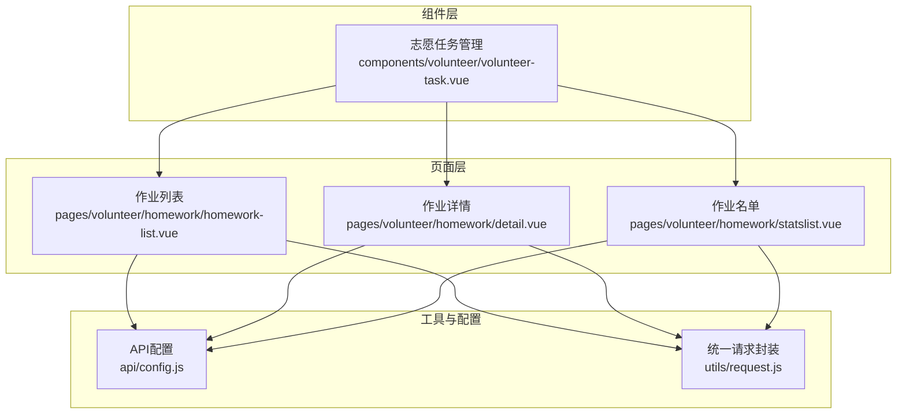
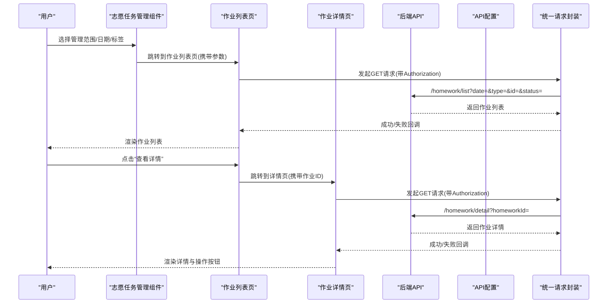
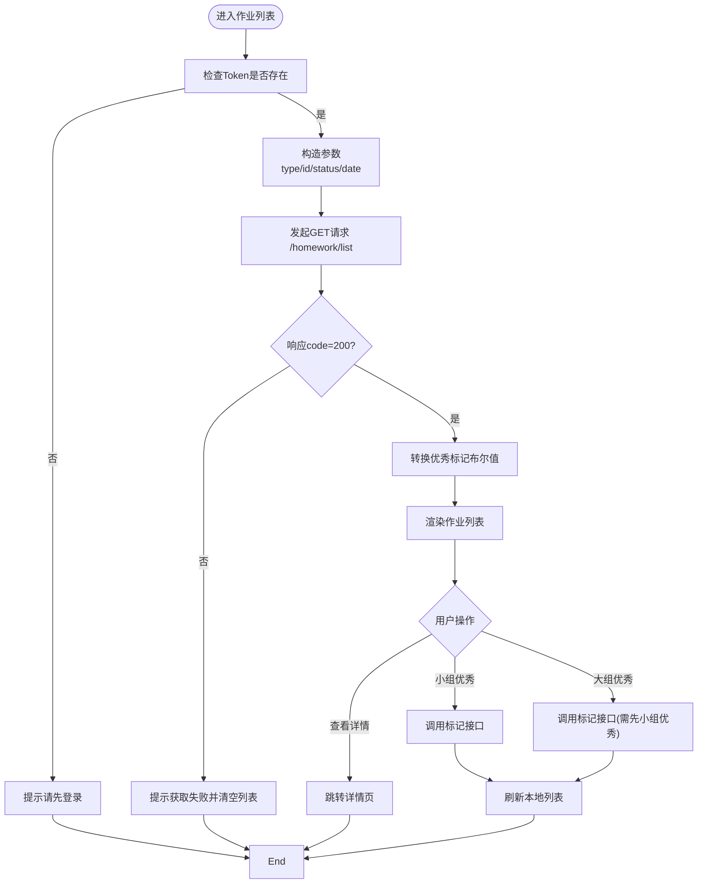
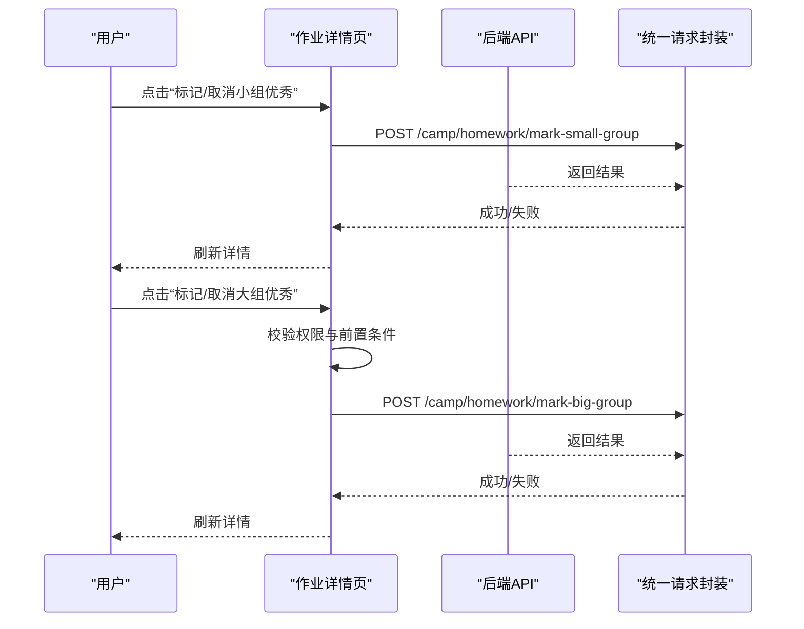
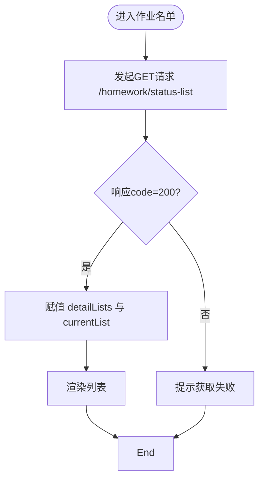
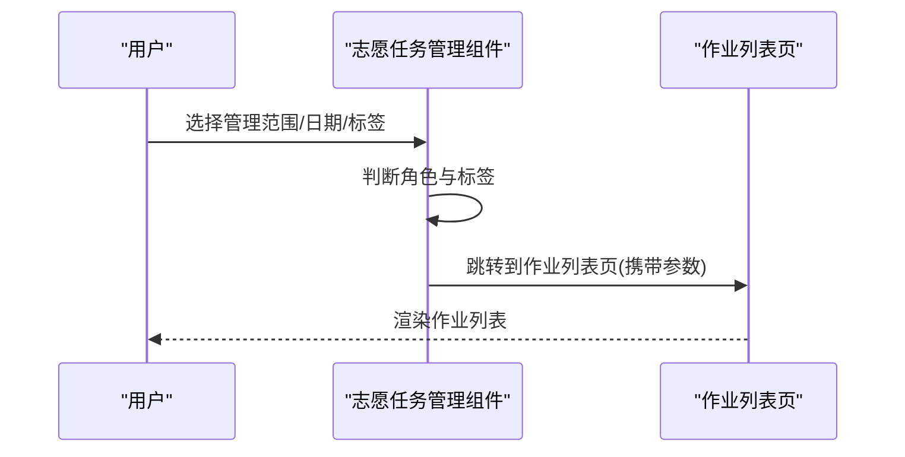
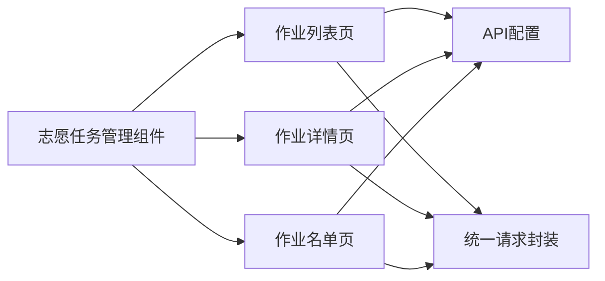

# 作业列表管理

<cite>
**本文档引用的文件**
- [homework-list.vue](file://pages/volunteer/homework/homework-list.vue)
- [detail.vue](file://pages/volunteer/homework/detail.vue)
- [statslist.vue](file://pages/volunteer/homework/statslist.vue)
- [volunteer-task.vue](file://components/volunteer/volunteer-task.vue)
- [config.js](file://api/config.js)
- [request.js](file://utils/request.js)
</cite>

## 目录
1. [简介](#简介)
2. [项目结构](#项目结构)
3. [核心组件](#核心组件)
4. [架构总览](#架构总览)
5. [详细组件分析](#详细组件分析)
6. [依赖关系分析](#依赖关系分析)
7. [性能考虑](#性能考虑)
8. [故障排除指南](#故障排除指南)
9. [结论](#结论)

## 简介
本文件面向“作业列表管理”功能，系统性梳理作业展示、过滤、状态标识、交互操作、数据加载与分页、权限控制与数据安全等关键能力。重点覆盖以下方面：
- 按班级、大组、小组维度的数据过滤与展示机制
- 作业状态标识系统（小组优秀、大组优秀、普通作业）
- 交互功能（查看详情、批量操作、状态切换）
- 数据加载与分页机制（懒加载、缓存策略与性能优化）
- 权限控制与数据安全保护

## 项目结构
作业列表管理相关的核心文件位于 pages/volunteer/homework 与 components/volunteer 下，配合 api/config.js 的接口配置与 utils/request.js 的统一请求封装。

图表来源
- [homework-list.vue:1-615](file://pages/volunteer/homework/homework-list.vue#L1-L615)
- [detail.vue:1-505](file://pages/volunteer/homework/detail.vue#L1-L505)
- [statslist.vue:1-384](file://pages/volunteer/homework/statslist.vue#L1-L384)
- [volunteer-task.vue:1-984](file://components/volunteer/volunteer-task.vue#L1-L984)
- [config.js:1-60](file://api/config.js#L1-L60)
- [request.js:1-98](file://utils/request.js#L1-L98)

章节来源
- [homework-list.vue:1-615](file://pages/volunteer/homework/homework-list.vue#L1-L615)
- [detail.vue:1-505](file://pages/volunteer/homework/detail.vue#L1-L505)
- [statslist.vue:1-384](file://pages/volunteer/homework/statslist.vue#L1-L384)
- [volunteer-task.vue:1-984](file://components/volunteer/volunteer-task.vue#L1-L984)
- [config.js:1-60](file://api/config.js#L1-L60)
- [request.js:1-98](file://utils/request.js#L1-L98)

## 核心组件
- 作业列表页：提供按日期筛选、标签切换（作业列表/优秀作业）、小组/大组优秀标记、查看详情等能力
- 作业详情页：展示作业详情、状态标识、单条作业的优秀标记操作
- 作业名单页：按“已交/未交/迟交”三类状态展示人员清单
- 志愿任务管理组件：作为入口，支持按班级/大组/小组层级导航至作业列表，并统一处理权限与数据加载

章节来源
- [homework-list.vue:114-207](file://pages/volunteer/homework/homework-list.vue#L114-L207)
- [detail.vue:101-196](file://pages/volunteer/homework/detail.vue#L101-L196)
- [statslist.vue:93-184](file://pages/volunteer/homework/statslist.vue#L93-L184)
- [volunteer-task.vue:175-479](file://components/volunteer/volunteer-task.vue#L175-L479)

## 架构总览
作业列表管理采用“页面+组件+配置+工具”的分层架构：
- 页面层：负责UI渲染与用户交互
- 组件层：提供通用的作业管理能力（层级导航、权限判断、数据加载）
- 配置层：集中管理API基础地址与接口路径
- 工具层：统一封装请求、自动注入Token、处理401等

图表来源
- [volunteer-task.vue:403-420](file://components/volunteer/volunteer-task.vue#L403-L420)
- [homework-list.vue:163-207](file://pages/volunteer/homework/homework-list.vue#L163-L207)
- [detail.vue:173-196](file://pages/volunteer/homework/detail.vue#L173-L196)
- [config.js:45-51](file://api/config.js#L45-L51)
- [request.js:7-67](file://utils/request.js#L7-L67)

## 详细组件分析

### 作业列表页（按班级/大组/小组维度）
- 数据过滤与展示
  - 支持按日期筛选与标签切换（作业列表/优秀作业）
  - 当标签为“优秀作业”时，向后端传递 status=excellent
  - 当标签为“作业列表”时，status 参数省略
- 维度参数构造
  - type 与 id 根据当前角色（学班/检班/学委/检委/学组/检组）与对应目标ID动态拼装
  - 例如：学班/检班使用 class；学委/检委使用 big_group；学组/检组使用 small_group
- 交互功能
  - 查看详情：跳转至详情页并传递作业ID、用户ID、姓名、日期、角色
  - 小组优秀/大组优秀标记：通过弹窗确认后调用对应接口
  - 权限控制：小组优秀对所有角色开放；大组优秀需先标记小组优秀且角色非学组/检组
- 状态标识
  - 本地将 isSmallGroupExcellent/isBigGroupExcellent 由数值转换为布尔值，用于UI状态切换

图表来源
- [homework-list.vue:163-207](file://pages/volunteer/homework/homework-list.vue#L163-L207)
- [homework-list.vue:229-321](file://pages/volunteer/homework/homework-list.vue#L229-L321)
- [homework-list.vue:324-346](file://pages/volunteer/homework/homework-list.vue#L324-L346)

章节来源
- [homework-list.vue:114-207](file://pages/volunteer/homework/homework-list.vue#L114-L207)
- [homework-list.vue:229-321](file://pages/volunteer/homework/homework-list.vue#L229-L321)
- [homework-list.vue:324-346](file://pages/volunteer/homework/homework-list.vue#L324-L346)

### 作业详情页（状态标识与操作）
- 状态标识
  - 依据 isBigGroupExcellent 与 isSmallGroupExcellent 决定显示“大组优秀/小组优秀/普通作业”
  - 对应的UI样式区分（颜色与加粗）
- 操作权限
  - 小组优秀：所有角色均可操作
  - 大组优秀：角色非学组/检组且需先为小组优秀
- 交互流程
  - 点击按钮弹窗确认后调用对应标记接口，成功后刷新详情

图表来源
- [detail.vue:198-286](file://pages/volunteer/homework/detail.vue#L198-L286)
- [config.js:46-46](file://api/config.js#L46-L46)

章节来源
- [detail.vue:101-196](file://pages/volunteer/homework/detail.vue#L101-L196)
- [detail.vue:198-286](file://pages/volunteer/homework/detail.vue#L198-L286)

### 作业名单页（按状态分类）
- 功能概述
  - 按“已交/未交/迟交”三类状态展示人员清单
  - 顶部标签切换，底部滚动容器展示列表
- 数据加载
  - GET /homework/status-list，携带 type、id、date
  - 成功后将返回的 submittedList/pendingList/lateList 分别赋给 detailLists 并设置默认显示已交

图表来源
- [statslist.vue:140-184](file://pages/volunteer/homework/statslist.vue#L140-L184)
- [config.js:51-51](file://api/config.js#L51-L51)

章节来源
- [statslist.vue:93-184](file://pages/volunteer/homework/statslist.vue#L93-L184)

### 志愿任务管理组件（入口与层级导航）
- 管理范围选择
  - 选择“学班/检班/学委/检委/学组/检组”对应的管理范围
- 层级导航
  - 在“作业列表”且角色为学班/检班/学委/检委时，展示层级列表（班级→大组→小组），点击小组箭头跳转到作业列表页
- 数据加载策略
  - 根据标签与角色决定调用层级列表或直接作业列表接口
  - 日期变化时，若已选择范围则触发相应列表加载

图表来源
- [volunteer-task.vue:403-420](file://components/volunteer/volunteer-task.vue#L403-L420)
- [volunteer-task.vue:339-479](file://components/volunteer/volunteer-task.vue#L339-L479)

章节来源
- [volunteer-task.vue:175-479](file://components/volunteer/volunteer-task.vue#L175-L479)

## 依赖关系分析
- 组件间依赖
  - 作业列表页与详情页均依赖 API 配置与统一请求封装
  - 志愿任务管理组件作为入口，向下调用作业列表页与详情页
- 外部依赖
  - API配置集中于 config.js，包含作业相关接口路径
  - 统一请求封装自动注入 Authorization，处理401跳转登录

图表来源
- [volunteer-task.vue:175-479](file://components/volunteer/volunteer-task.vue#L175-L479)
- [homework-list.vue:112-112](file://pages/volunteer/homework/homework-list.vue#L112-L112)
- [detail.vue:99-99](file://pages/volunteer/homework/detail.vue#L99-L99)
- [statslist.vue:91-91](file://pages/volunteer/homework/statslist.vue#L91-L91)
- [config.js:16-56](file://api/config.js#L16-L56)
- [request.js:7-67](file://utils/request.js#L7-L67)

章节来源
- [config.js:16-56](file://api/config.js#L16-L56)
- [request.js:7-67](file://utils/request.js#L7-L67)

## 性能考虑
- 懒加载与分页
  - 作业列表页未实现虚拟滚动或分页加载，建议在大量数据场景下引入分页参数（如 page/size）以减少一次性渲染压力
- 缓存策略
  - 本地未实现持久化缓存；可在组件卸载或路由离开时记录当前日期与筛选条件，避免重复请求
- 请求优化
  - 统一请求封装已处理401跳转，建议在高频请求场景下增加防抖与去重（如同一请求未完成不再重复发送）

[本节为通用性能建议，不直接分析具体文件]

## 故障排除指南
- 登录态失效
  - 统一请求封装检测到401时会清除Token并跳转登录页，需引导用户重新登录
- 网络错误
  - 所有请求失败统一提示“网络错误”，建议在详情页与列表页分别给出更明确的错误文案
- 参数校验
  - 作业列表页与详情页均对作业ID进行校验，无效ID将提示并阻止跳转
- 权限不足
  - 大组优秀标记需满足角色与前置条件（先小组优秀），否则提示无权限

章节来源
- [request.js:29-44](file://utils/request.js#L29-L44)
- [homework-list.vue:324-328](file://pages/volunteer/homework/homework-list.vue#L324-L328)
- [detail.vue:113-117](file://pages/volunteer/homework/detail.vue#L113-L117)
- [homework-list.vue:274-277](file://pages/volunteer/homework/homework-list.vue#L274-L277)

## 结论
作业列表管理功能围绕“按角色与维度筛选、状态标识、交互操作、权限控制与数据安全”构建，具备清晰的页面与组件边界。建议后续在大数据量场景下引入分页与缓存策略，在权限与错误处理层面进一步细化提示与回退逻辑，以提升用户体验与系统稳定性。