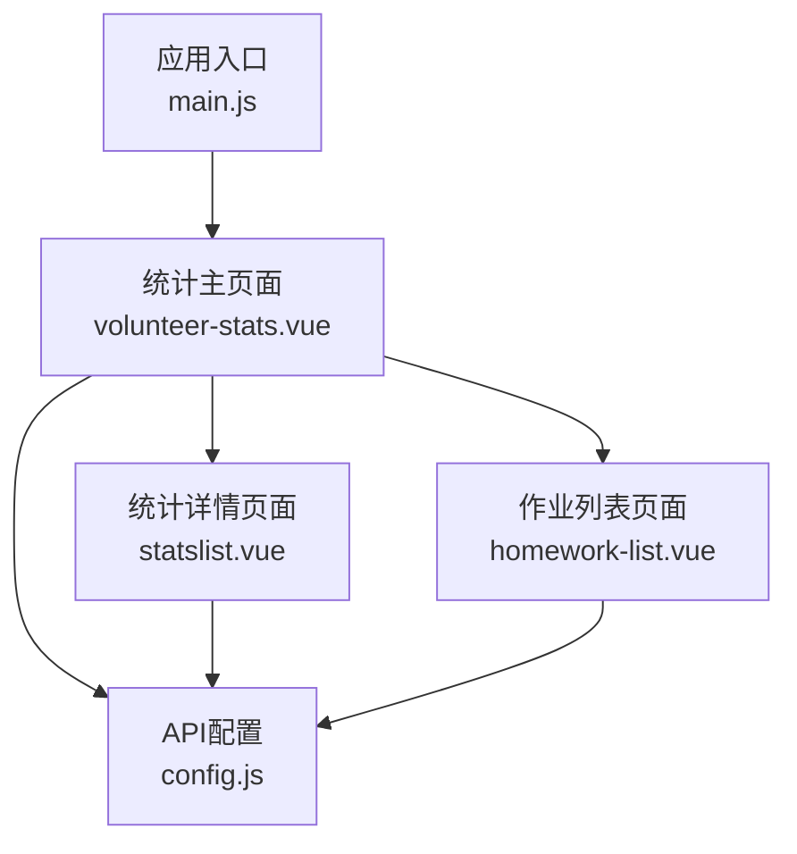
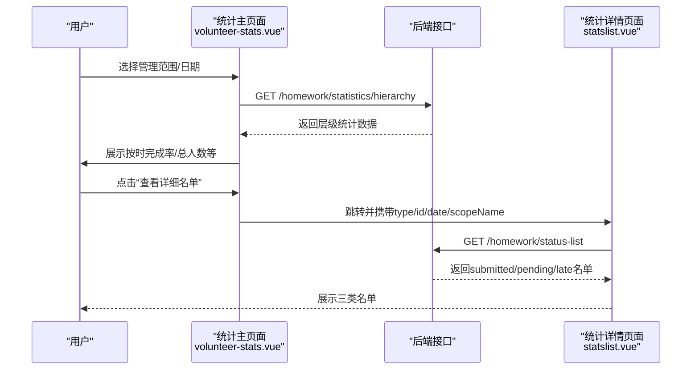
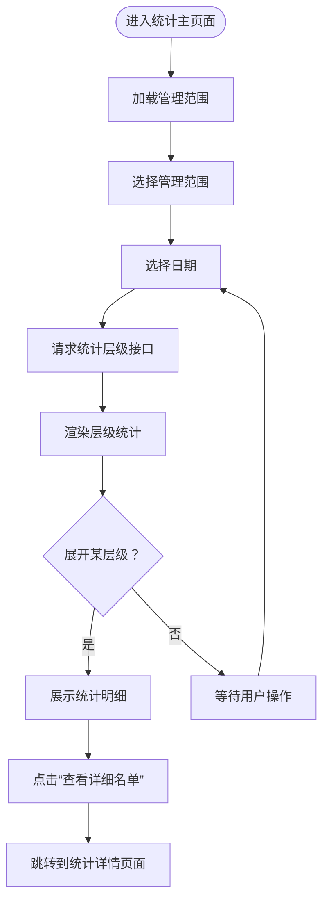
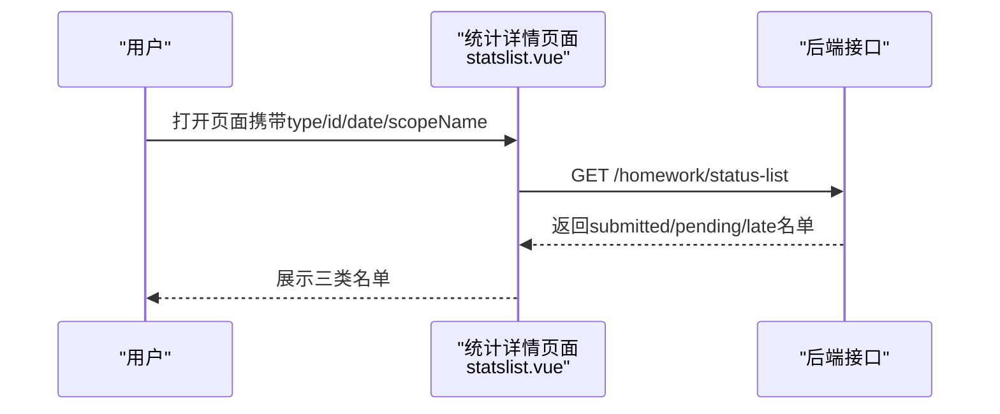
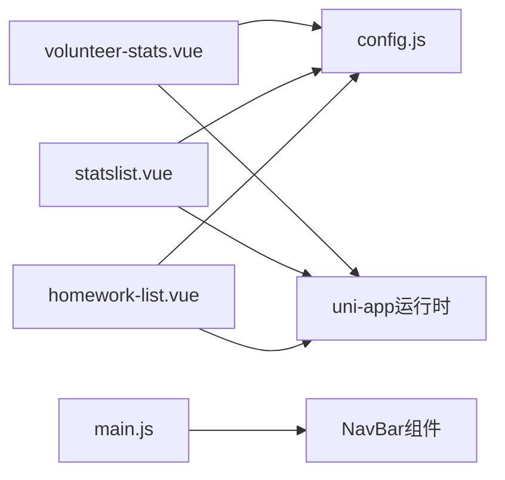

# 作业统计分析

<cite>
**本文档引用的文件**
- [volunteer-stats.vue](file://components/volunteer/volunteer-stats.vue)
- [statslist.vue](file://pages/volunteer/homework/statslist.vue)
- [config.js](file://api/config.js)
- [homework-list.vue](file://pages/volunteer/homework/homework-list.vue)
- [main.js](file://main.js)
</cite>

## 目录
1. [简介](#简介)
2. [项目结构](#项目结构)
3. [核心组件](#核心组件)
4. [架构总览](#架构总览)
5. [详细组件分析](#详细组件分析)
6. [依赖关系分析](#依赖关系分析)
7. [性能考虑](#性能考虑)
8. [故障排除指南](#故障排除指南)
9. [结论](#结论)
10. [附录](#附录)

## 简介
本文件面向“作业统计分析”功能，围绕作业统计页面的数据可视化设计、统计数据计算逻辑、统计维度选择机制、统计报表导出能力以及实时更新与缓存策略进行系统化说明。当前前端实现聚焦于作业统计页面的层次化展示、按时完成率等关键指标呈现，并通过接口获取作业名单与统计层级数据；关于质量分布图、趋势分析图以及Excel/PDF导出能力，前端层面尚未实现，后续可在现有接口基础上扩展。

## 项目结构
作业统计分析功能主要由以下文件构成：
- 统计主页面：components/volunteer/volunteer-stats.vue
- 统计详情页面：pages/volunteer/homework/statslist.vue
- 作业列表页面：pages/volunteer/homework/homework-list.vue
- API配置：api/config.js
- 应用入口：main.js

**图表来源**
- [main.js:1-26](file://main.js#L1-L26)
- [volunteer-stats.vue:1-713](file://components/volunteer/volunteer-stats.vue#L1-L713)
- [statslist.vue:1-384](file://pages/volunteer/homework/statslist.vue#L1-L384)
- [homework-list.vue:1-615](file://pages/volunteer/homework/homework-list.vue#L1-L615)
- [config.js:1-60](file://api/config.js#L1-L60)

**章节来源**
- [volunteer-stats.vue:1-713](file://components/volunteer/volunteer-stats.vue#L1-L713)
- [statslist.vue:1-384](file://pages/volunteer/homework/statslist.vue#L1-L384)
- [homework-list.vue:1-615](file://pages/volunteer/homework/homework-list.vue#L1-L615)
- [config.js:1-60](file://api/config.js#L1-L60)
- [main.js:1-26](file://main.js#L1-L26)

## 核心组件
- 统计主页面（volunteer-stats.vue）
  - 负责管理范围选择、日期选择、统计层级数据渲染、按时完成率展示与跳转至详情名单。
- 统计详情页面（statslist.vue）
  - 负责按“已交/未交/迟交”三类展示具体人员名单，支持日期与范围筛选。
- 作业列表页面（homework-list.vue）
  - 负责作业列表与优秀作业标记，便于理解作业状态与统计口径。
- API配置（config.js）
  - 统一管理后端接口地址与路径，包含作业统计相关接口。

**章节来源**
- [volunteer-stats.vue:210-399](file://components/volunteer/volunteer-stats.vue#L210-L399)
- [statslist.vue:90-185](file://pages/volunteer/homework/statslist.vue#L90-L185)
- [homework-list.vue:111-348](file://pages/volunteer/homework/homework-list.vue#L111-L348)
- [config.js:16-56](file://api/config.js#L16-L56)

## 架构总览
作业统计分析从前端到后端的数据流如下：
- 用户在统计主页面选择管理范围与日期，前端调用统计层级接口获取数据并渲染。
- 点击“查看详细名单”进入统计详情页面，前端调用作业状态列表接口获取三类名单。
- 作业列表页面用于查看与标记优秀作业，辅助理解统计口径。

**图表来源**
- [volunteer-stats.vue:325-364](file://components/volunteer/volunteer-stats.vue#L325-L364)
- [statslist.vue:140-183](file://pages/volunteer/homework/statslist.vue#L140-L183)
- [config.js:45-51](file://api/config.js#L45-L51)

## 详细组件分析

### 统计主页面（volunteer-stats.vue）
- 管理范围选择
  - 通过获取志愿者管理范围接口，格式化为“班级/大组/小组”的可选范围，并默认选中第一个。
- 日期选择
  - 使用日期选择器，默认选择当天，支持回退到历史日期。
- 层级统计渲染
  - 支持三级层级（根/子/孙），展开时展示“总人数、准时、未交、迟交、按时完成率”，并支持点击“查看详细名单”。
- 实时交互
  - 切换范围或日期时，重新请求统计层级数据；支持全局刷新事件监听。

**图表来源**
- [volunteer-stats.vue:251-364](file://components/volunteer/volunteer-stats.vue#L251-L364)
- [volunteer-stats.vue:384-398](file://components/volunteer/volunteer-stats.vue#L384-L398)

**章节来源**
- [volunteer-stats.vue:210-399](file://components/volunteer/volunteer-stats.vue#L210-L399)

### 统计详情页面（statslist.vue）
- 参数接收
  - 从上一页接收type、id、date、scopeName等参数。
- 三类名单展示
  - 通过切换标签展示“已交/未交/迟交”名单，支持空数据提示。
- 数据来源
  - 调用作业状态列表接口，返回三类名单集合。

**图表来源**
- [statslist.vue:140-183](file://pages/volunteer/homework/statslist.vue#L140-L183)
- [config.js:50-51](file://api/config.js#L50-L51)

**章节来源**
- [statslist.vue:90-185](file://pages/volunteer/homework/statslist.vue#L90-L185)

### 作业列表页面（homework-list.vue）
- 作业列表与优秀作业标记
  - 支持切换“作业列表/优秀作业”标签，展示提交人员、提交时间、所属分组等信息，并提供标记/取消“小组优秀/大组优秀”的操作。
- 权限控制
  - 不同职责角色对“大组优秀”标记存在前置条件（需先标记为“小组优秀”）。

**章节来源**
- [homework-list.vue:111-348](file://pages/volunteer/homework/homework-list.vue#L111-L348)

### API配置（config.js）
- 统一管理后端接口地址与路径，包含作业统计相关接口：
  - 统计层级接口：/homework/statistics/hierarchy
  - 作业状态列表接口：/homework/status-list
  - 作业列表接口：/homework/list
  - 优秀作业标记接口：/camp/homework/mark-small-group、/camp/homework/mark-big-group

**章节来源**
- [config.js:16-56](file://api/config.js#L16-L56)

## 依赖关系分析
- 组件间依赖
  - 统计主页面依赖API配置与全局事件刷新机制。
  - 统计详情页面依赖统计主页面传参与API配置。
  - 作业列表页面独立于统计页面，但与优秀作业标记相关。
- 外部依赖
  - uni-app运行时（uni.request、uni.showToast、uni.navigateTo等）。
  - 全局组件注册（main.js中注册NavBar）。

**图表来源**
- [volunteer-stats.vue:91](file://components/volunteer/volunteer-stats.vue#L91)
- [statslist.vue:91](file://pages/volunteer/homework/statslist.vue#L91)
- [homework-list.vue:112](file://pages/volunteer/homework/homework-list.vue#L112)
- [config.js:8-56](file://api/config.js#L8-L56)
- [main.js:18-25](file://main.js#L18-L25)

**章节来源**
- [volunteer-stats.vue:90-185](file://components/volunteer/volunteer-stats.vue#L90-L185)
- [statslist.vue:90-185](file://pages/volunteer/homework/statslist.vue#L90-L185)
- [homework-list.vue:111-348](file://pages/volunteer/homework/homework-list.vue#L111-L348)
- [config.js:1-60](file://api/config.js#L1-L60)
- [main.js:1-26](file://main.js#L1-L26)

## 性能考虑
- 网络请求优化
  - 在切换管理范围或日期时才发起统计层级请求，避免不必要的重复请求。
  - 统计详情页面仅在进入时请求作业状态列表，减少资源消耗。
- 视图渲染优化
  - 使用懒加载与滚动容器，避免一次性渲染大量节点导致卡顿。
- 缓存策略建议
  - 当前前端未实现本地缓存；可在统计主页面对“最近一次请求结果”进行短期缓存（例如1分钟内有效），并在切换日期或范围时清空缓存。
  - 对于详情页面，可按“type/id/date”组合作为缓存键，避免重复请求相同数据。
- 实时更新机制
  - 统计主页面支持全局刷新事件监听，便于在其他页面操作后触发刷新。
  - 作业列表页面的优秀作业标记成功后，可触发统计主页面刷新事件，实现联动更新。

[本节为通用性能建议，不直接分析具体文件，故无章节来源]

## 故障排除指南
- 登录状态缺失
  - 若token为空，统计主页面会提示“请先登录”，详情页面会提示“参数不全”。请检查登录流程与token存储。
- 网络错误
  - 请求失败时会提示“网络错误，请稍后重试”。请检查网络连通性与后端接口可用性。
- 数据为空
  - 当无统计数据或无作业时，页面会显示“暂无统计数据/暂无作业/暂无相关人员”。请确认管理范围、日期与作业是否存在。
- 刷新问题
  - 若需要强制刷新，可在统计主页面触发全局刷新事件，或手动切换日期/范围。

**章节来源**
- [volunteer-stats.vue:251-282](file://components/volunteer/volunteer-stats.vue#L251-L282)
- [volunteer-stats.vue:355-363](file://components/volunteer/volunteer-stats.vue#L355-L363)
- [statslist.vue:140-183](file://pages/volunteer/homework/statslist.vue#L140-L183)

## 结论
作业统计分析功能在前端已实现统计主页面与统计详情页面的协同工作，能够按管理范围与日期聚合作业数据，并以层级化方式展示按时完成率等关键指标。当前未实现质量分布图、趋势分析图与报表导出功能，后续可在现有接口基础上扩展。建议引入短期缓存与事件驱动的刷新机制，以提升用户体验与性能表现。

[本节为总结性内容，不直接分析具体文件，故无章节来源]

## 附录

### 统计数据计算逻辑（基于现有实现）
- 按时完成率
  - 统计主页面展示“按时完成率”，字段名为onTimeRate或completionRate，来源于后端返回的层级统计数据。
- 未交/已交/迟交
  - 统计详情页面通过作业状态列表接口返回三类名单，分别对应“已交/未交/迟交”。

**章节来源**
- [volunteer-stats.vue:93-96](file://components/volunteer/volunteer-stats.vue#L93-L96)
- [statslist.vue:160-167](file://pages/volunteer/homework/statslist.vue#L160-L167)

### 统计维度选择机制
- 管理范围
  - 支持按“班级/大组/小组”三个层级选择，前端将后端返回的类型转换为统一格式并展示。
- 时间维度
  - 支持按日期选择，仅展示有作业的层级数据。

**章节来源**
- [volunteer-stats.vue:284-318](file://components/volunteer/volunteer-stats.vue#L284-L318)
- [volunteer-stats.vue:325-364](file://components/volunteer/volunteer-stats.vue#L325-L364)

### 报表导出能力
- 当前实现
  - 前端未实现Excel/PDF导出功能。
- 建议方案
  - 在统计详情页面增加“导出”按钮，调用后端导出接口或前端生成CSV/Excel/PDF文件。
  - 导出内容可包含：姓名、手机号、提交状态、提交时间、所属分组等。

[本节为建议性内容，不直接分析具体文件，故无章节来源]

### 实时更新与缓存策略
- 实时更新
  - 通过全局事件监听实现跨页面刷新；作业列表页面标记优秀作业后可触发刷新。
- 缓存策略
  - 建议对统计主页面的层级数据按“范围+日期”进行短期缓存，避免频繁请求；详情页面按“type/id/date”组合缓存。

[本节为通用建议，不直接分析具体文件，故无章节来源]