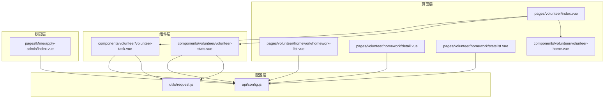
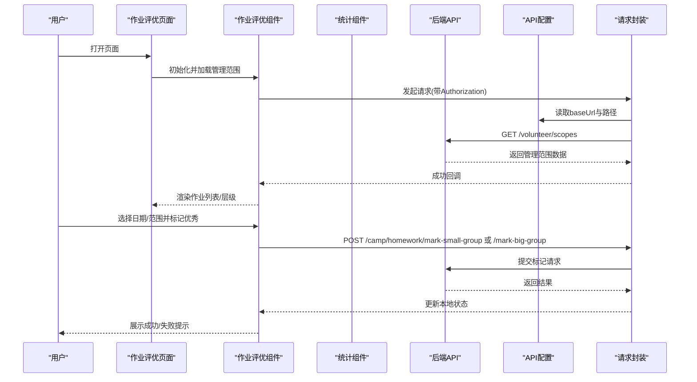
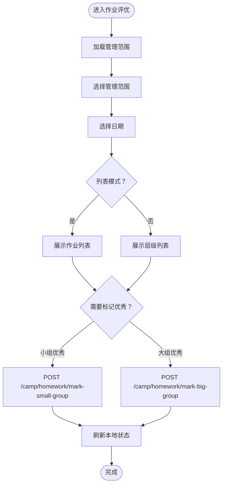
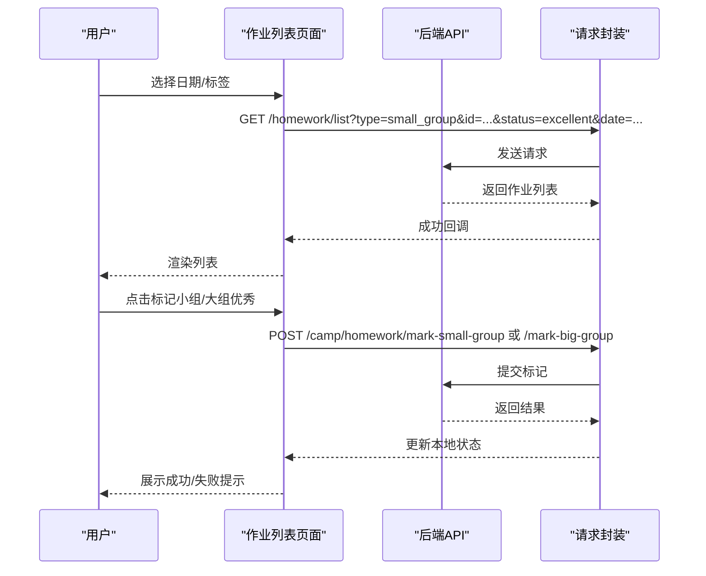
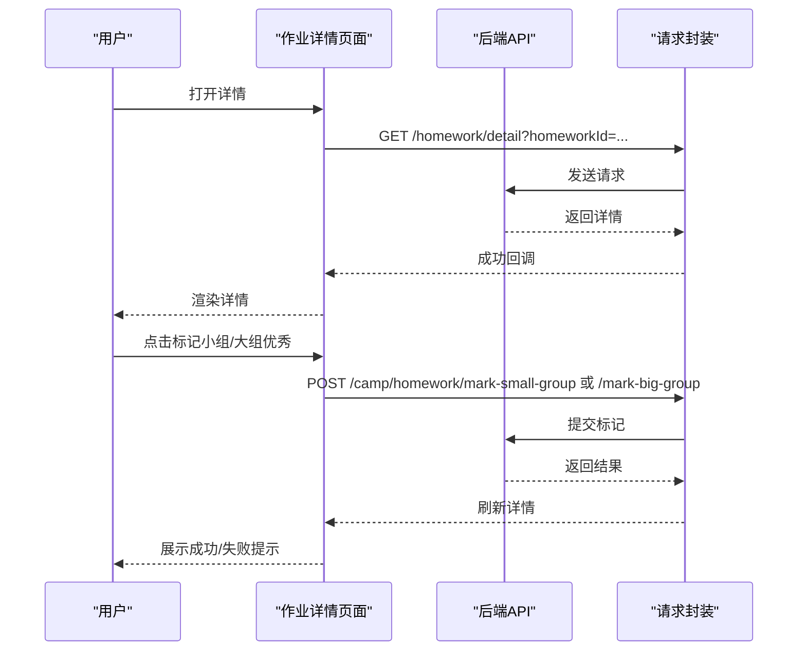
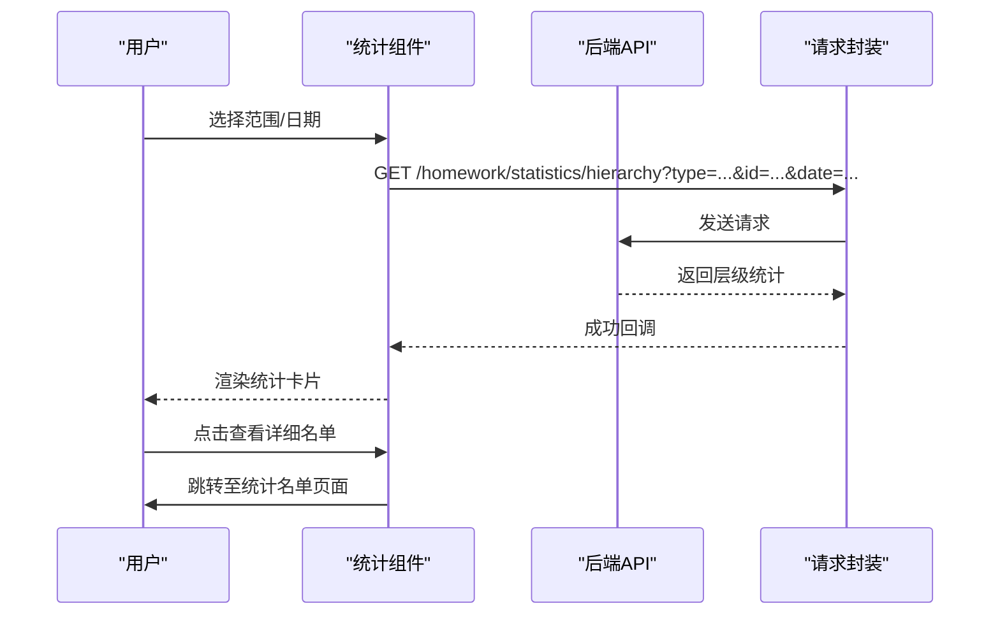
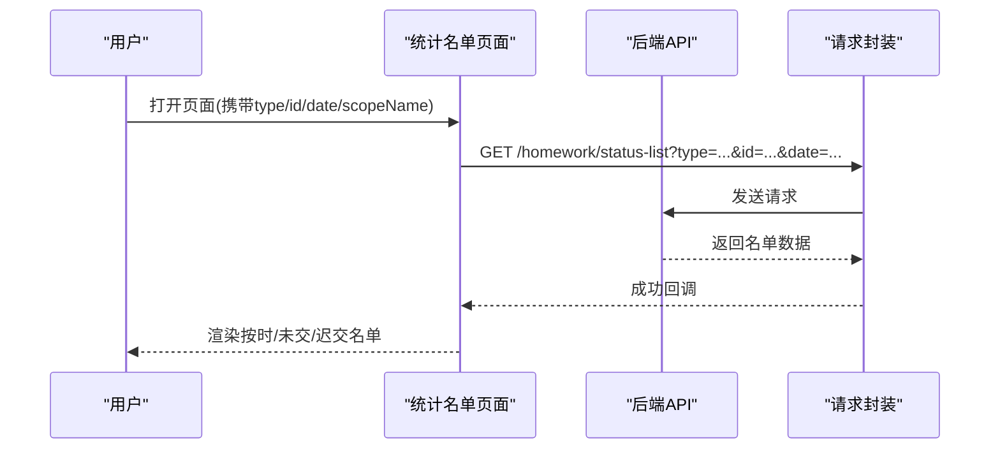
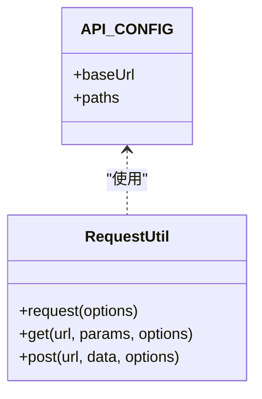
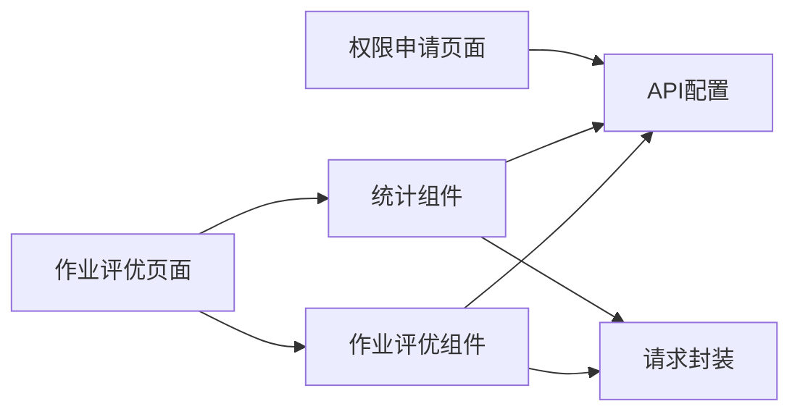

# 作业评优系统

<cite>
**本文档引用的文件**
- [pages/volunteer/index.vue](file://pages/volunteer/index.vue)
- [components/volunteer/volunteer-home.vue](file://components/volunteer/volunteer-home.vue)
- [components/volunteer/volunteer-task.vue](file://components/volunteer/volunteer-task.vue)
- [components/volunteer/volunteer-stats.vue](file://components/volunteer/volunteer-stats.vue)
- [pages/volunteer/homework/homework-list.vue](file://pages/volunteer/homework/homework-list.vue)
- [pages/volunteer/homework/detail.vue](file://pages/volunteer/homework/detail.vue)
- [pages/volunteer/homework/statslist.vue](file://pages/volunteer/homework/statslist.vue)
- [api/config.js](file://api/config.js)
- [utils/request.js](file://utils/request.js)
- [pages/Mine/apply-admin/index.vue](file://pages/Mine/apply-admin/index.vue)
</cite>

## 目录
1. [简介](#简介)
2. [项目结构](#项目结构)
3. [核心组件](#核心组件)
4. [架构总览](#架构总览)
5. [详细组件分析](#详细组件分析)
6. [依赖关系分析](#依赖关系分析)
7. [性能考虑](#性能考虑)
8. [故障排除指南](#故障排除指南)
9. [结论](#结论)
10. [附录](#附录)

## 简介
本系统围绕“作业评优”业务场景构建，覆盖作业发布、接收与完成、评优打分、统计分析与权限控制等关键环节。前端基于小程序框架实现，通过统一的 API 配置与请求封装，对接后端作业管理接口，提供作业列表、详情、评优标记、统计报表等功能，并支持按管理范围（营期/班级/大组/小组）进行权限隔离与数据安全保护。

## 项目结构
系统采用模块化页面与组件分离的组织方式：
- 页面层：作业评优入口、作业列表、作业详情、统计名单、首页等
- 组件层：作业评优主控组件、统计组件、首页组件等
- 配置层：API 基础地址与路径配置、统一请求封装
- 权限层：管理员角色申请与管理范围授权

**图表来源**
- [pages/volunteer/index.vue:1-210](file://pages/volunteer/index.vue#L1-L210)
- [components/volunteer/volunteer-task.vue:1-984](file://components/volunteer/volunteer-task.vue#L1-L984)
- [components/volunteer/volunteer-stats.vue:1-713](file://components/volunteer/volunteer-stats.vue#L1-L713)
- [pages/volunteer/homework/homework-list.vue:1-615](file://pages/volunteer/homework/homework-list.vue#L1-L615)
- [pages/volunteer/homework/detail.vue:1-505](file://pages/volunteer/homework/detail.vue#L1-L505)
- [pages/volunteer/homework/statslist.vue:1-384](file://pages/volunteer/homework/statslist.vue#L1-L384)
- [api/config.js:1-60](file://api/config.js#L1-L60)
- [utils/request.js:1-98](file://utils/request.js#L1-L98)
- [pages/Mine/apply-admin/index.vue:1-34](file://pages/Mine/apply-admin/index.vue#L1-L34)

**章节来源**
- [pages/volunteer/index.vue:1-210](file://pages/volunteer/index.vue#L1-L210)
- [components/volunteer/volunteer-task.vue:1-984](file://components/volunteer/volunteer-task.vue#L1-L984)
- [components/volunteer/volunteer-stats.vue:1-713](file://components/volunteer/volunteer-stats.vue#L1-L713)
- [pages/volunteer/homework/homework-list.vue:1-615](file://pages/volunteer/homework/homework-list.vue#L1-L615)
- [pages/volunteer/homework/detail.vue:1-505](file://pages/volunteer/homework/detail.vue#L1-L505)
- [pages/volunteer/homework/statslist.vue:1-384](file://pages/volunteer/homework/statslist.vue#L1-L384)
- [api/config.js:1-60](file://api/config.js#L1-L60)
- [utils/request.js:1-98](file://utils/request.js#L1-L98)
- [pages/Mine/apply-admin/index.vue:1-34](file://pages/Mine/apply-admin/index.vue#L1-L34)

## 核心组件
- 作业评优主控组件：提供管理范围选择、日期筛选、作业列表/层级列表切换、优秀作业标记等能力
- 作业统计组件：按层级展示完成率、按时完成率、未交/迟交统计，并支持查看详细名单
- 作业列表/详情页面：展示作业列表、作业详情、优秀标记操作
- 统计名单页面：按“已交/未交/迟交”三类展示人员名单
- API 配置与请求封装：集中管理后端地址与接口路径，统一注入 Authorization 头与错误处理

**章节来源**
- [components/volunteer/volunteer-task.vue:1-984](file://components/volunteer/volunteer-task.vue#L1-L984)
- [components/volunteer/volunteer-stats.vue:1-713](file://components/volunteer/volunteer-stats.vue#L1-L713)
- [pages/volunteer/homework/homework-list.vue:1-615](file://pages/volunteer/homework/homework-list.vue#L1-L615)
- [pages/volunteer/homework/detail.vue:1-505](file://pages/volunteer/homework/detail.vue#L1-L505)
- [pages/volunteer/homework/statslist.vue:1-384](file://pages/volunteer/homework/statslist.vue#L1-L384)
- [api/config.js:1-60](file://api/config.js#L1-L60)
- [utils/request.js:1-98](file://utils/request.js#L1-L98)

## 架构总览
系统采用“页面-组件-配置-请求”的分层架构：
- 页面负责导航与生命周期事件派发
- 组件负责业务逻辑与数据交互
- 配置集中管理 API 地址与路径
- 请求封装统一处理鉴权与错误

**图表来源**
- [components/volunteer/volunteer-task.vue:233-596](file://components/volunteer/volunteer-task.vue#L233-L596)
- [api/config.js:16-56](file://api/config.js#L16-L56)
- [utils/request.js:7-67](file://utils/request.js#L7-L67)

## 详细组件分析

### 作业评优主控组件（volunteer-task）
- 功能要点
  - 管理范围选择：支持按营期/班级/大组/小组维度选择
  - 日期筛选：支持按日筛选作业
  - 列表模式：支持作业列表与层级列表两种展示
  - 优秀标记：支持小组优秀与大组优秀两级标记，具备权限校验
  - 详情跳转：支持跳转至作业详情页
- 权限控制
  - 小组优秀：所有角色均可操作
  - 大组优秀：学组/检组无权限；其余角色需先标记小组优秀
- 数据流
  - 获取管理范围 -> 选择范围/日期 -> 加载作业列表/层级 -> 标记优秀 -> 刷新本地状态

**图表来源**
- [components/volunteer/volunteer-task.vue:233-596](file://components/volunteer/volunteer-task.vue#L233-L596)

**章节来源**
- [components/volunteer/volunteer-task.vue:1-984](file://components/volunteer/volunteer-task.vue#L1-L984)

### 作业列表页面（homework-list）
- 功能要点
  - 日期选择器：支持按日筛选
  - 标签切换：作业列表/优秀作业
  - 优秀标记：支持小组/大组标记，权限校验与前置条件检查
  - 详情跳转：支持跳转至作业详情页
- 数据流
  - 选择日期/标签 -> GET /homework/list -> 渲染列表 -> 标记优秀 -> 刷新本地状态

**图表来源**
- [pages/volunteer/homework/homework-list.vue:162-321](file://pages/volunteer/homework/homework-list.vue#L162-L321)
- [api/config.js:45-47](file://api/config.js#L45-L47)
- [utils/request.js:7-67](file://utils/request.js#L7-L67)

**章节来源**
- [pages/volunteer/homework/homework-list.vue:1-615](file://pages/volunteer/homework/homework-list.vue#L1-L615)

### 作业详情页面（detail）
- 功能要点
  - 展示作业基础信息、内容、状态
  - 支持小组/大组优秀标记，权限校验与前置条件检查
- 数据流
  - 加载详情 -> 渲染页面 -> 标记优秀 -> 刷新详情

**图表来源**
- [pages/volunteer/homework/detail.vue:172-286](file://pages/volunteer/homework/detail.vue#L172-L286)
- [api/config.js:48-49](file://api/config.js#L48-L49)
- [utils/request.js:7-67](file://utils/request.js#L7-L67)

**章节来源**
- [pages/volunteer/homework/detail.vue:1-505](file://pages/volunteer/homework/detail.vue#L1-L505)

### 作业统计组件（volunteer-stats）
- 功能要点
  - 管理范围选择：按营期/班级/大组/小组维度
  - 日期筛选：按日筛选
  - 层级统计：展示总人数、按时/未交/迟交数量与按时完成率
  - 查看详细名单：支持跳转至统计名单页面
- 数据流
  - 选择范围/日期 -> GET /homework/statistics/hierarchy -> 渲染统计 -> 查看名单

**图表来源**
- [components/volunteer/volunteer-stats.vue:325-397](file://components/volunteer/volunteer-stats.vue#L325-L397)
- [api/config.js:50-51](file://api/config.js#L50-L51)
- [utils/request.js:7-67](file://utils/request.js#L7-L67)

**章节来源**
- [components/volunteer/volunteer-stats.vue:1-713](file://components/volunteer/volunteer-stats.vue#L1-L713)

### 统计名单页面（statslist）
- 功能要点
  - 标签切换：按时/未交/迟交
  - 展示人员基本信息与状态标签
- 数据流
  - 传入范围/日期 -> GET /homework/status-list -> 渲染名单

**图表来源**
- [pages/volunteer/homework/statslist.vue:140-182](file://pages/volunteer/homework/statslist.vue#L140-L182)
- [api/config.js:51](file://api/config.js#L51)
- [utils/request.js:7-67](file://utils/request.js#L7-L67)

**章节来源**
- [pages/volunteer/homework/statslist.vue:1-384](file://pages/volunteer/homework/statslist.vue#L1-L384)

### API 配置与请求封装
- API 配置
  - 统一管理 baseUrl 与各接口路径，便于维护与切换环境
- 请求封装
  - 自动注入 Authorization 头
  - 统一处理 401 未授权、网络异常等错误
  - 提供 get/post 快捷方法

**图表来源**
- [api/config.js:8-56](file://api/config.js#L8-L56)
- [utils/request.js:7-95](file://utils/request.js#L7-L95)

**章节来源**
- [api/config.js:1-60](file://api/config.js#L1-L60)
- [utils/request.js:1-98](file://utils/request.js#L1-L98)

## 依赖关系分析
- 页面与组件
  - 作业评优页面聚合多个子组件，负责底部导航与事件派发
  - 作业评优组件与统计组件均依赖 API 配置与请求封装
- 组件与配置
  - 组件通过 API 配置拼接完整 URL
  - 统一请求封装负责鉴权与错误处理
- 权限与数据安全
  - 管理范围权限决定可操作范围
  - 优秀标记权限与前置条件限制，避免越权操作

**图表来源**
- [pages/volunteer/index.vue:44-106](file://pages/volunteer/index.vue#L44-L106)
- [components/volunteer/volunteer-task.vue:173-174](file://components/volunteer/volunteer-task.vue#L173-L174)
- [components/volunteer/volunteer-stats.vue:209-210](file://components/volunteer/volunteer-stats.vue#L209-L210)
- [api/config.js:8-56](file://api/config.js#L8-L56)
- [utils/request.js:7-67](file://utils/request.js#L7-L67)
- [pages/Mine/apply-admin/index.vue:1-34](file://pages/Mine/apply-admin/index.vue#L1-L34)

**章节来源**
- [pages/volunteer/index.vue:1-210](file://pages/volunteer/index.vue#L1-L210)
- [components/volunteer/volunteer-task.vue:1-984](file://components/volunteer/volunteer-task.vue#L1-L984)
- [components/volunteer/volunteer-stats.vue:1-713](file://components/volunteer/volunteer-stats.vue#L1-L713)
- [api/config.js:1-60](file://api/config.js#L1-L60)
- [utils/request.js:1-98](file://utils/request.js#L1-L98)
- [pages/Mine/apply-admin/index.vue:1-34](file://pages/Mine/apply-admin/index.vue#L1-L34)

## 性能考虑
- 列表渲染优化
  - 使用虚拟滚动与懒加载减少 DOM 数量
  - 本地状态更新优先，避免重复请求
- 网络请求优化
  - 统一请求封装减少重复代码
  - 401 自动跳转登录，避免无效重试
- 交互体验
  - Modal 确认减少误操作
  - 加载提示与成功/失败提示提升反馈

## 故障排除指南
- 登录过期
  - 现象：401 未授权
  - 处理：清除本地 token 并跳转登录页
- 网络异常
  - 现象：网络连接异常提示
  - 处理：检查网络状态与后端服务可用性
- 参数缺失
  - 现象：参数不全导致请求失败
  - 处理：确保传入 type/id/date/scopeName 等必要参数
- 权限不足
  - 现象：无法标记大组优秀或无权限操作
  - 处理：确认角色与管理范围，满足前置条件（先标记小组优秀）

**章节来源**
- [utils/request.js:28-67](file://utils/request.js#L28-L67)
- [pages/volunteer/homework/statslist.vue:140-182](file://pages/volunteer/homework/statslist.vue#L140-L182)
- [components/volunteer/volunteer-task.vue:491-499](file://components/volunteer/volunteer-task.vue#L491-L499)
- [pages/volunteer/homework/homework-list.vue:271-284](file://pages/volunteer/homework/homework-list.vue#L271-L284)

## 结论
本系统通过清晰的页面-组件-配置-请求分层设计，实现了作业发布、接收与完成、评优打分、统计分析与权限控制的完整闭环。统一的 API 配置与请求封装提升了可维护性与安全性，权限校验与前置条件保障了数据一致性与合规性。建议后续在接口层面补充作业发布与内容编辑能力，并完善评分规则与奖励机制的后端支持。

## 附录
- 业务术语
  - 管理范围：营期/班级/大组/小组
  - 优秀标记：小组优秀/大组优秀
  - 统计维度：按时/未交/迟交
- 常见问题
  - 如何申请管理员角色？请前往“我的”->“权限申请”页面进行申请
  - 如何查看某范围的统计明细？在统计组件中点击“查看详细名单”