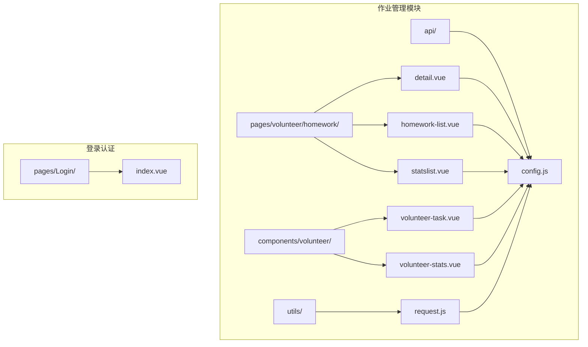
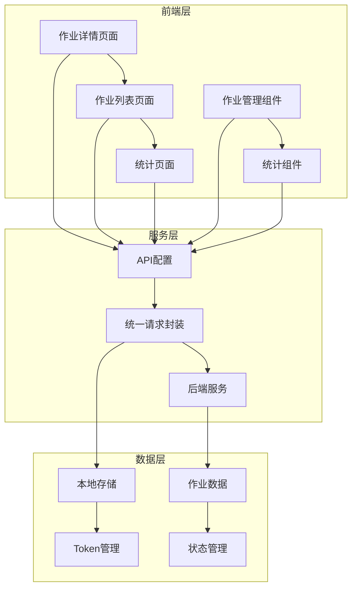
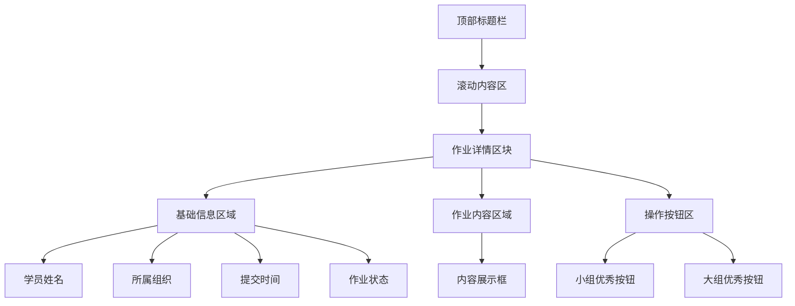
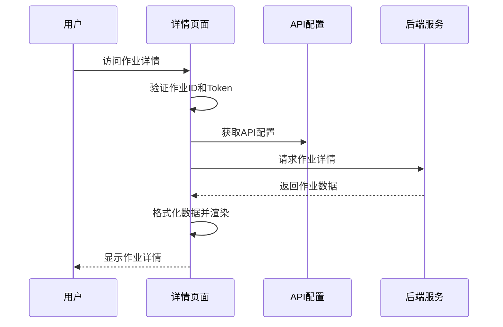
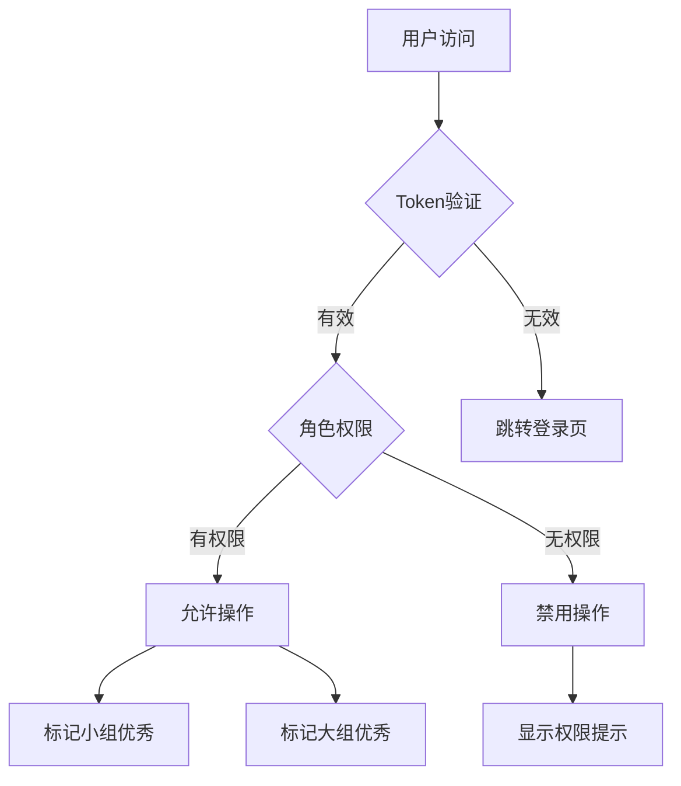
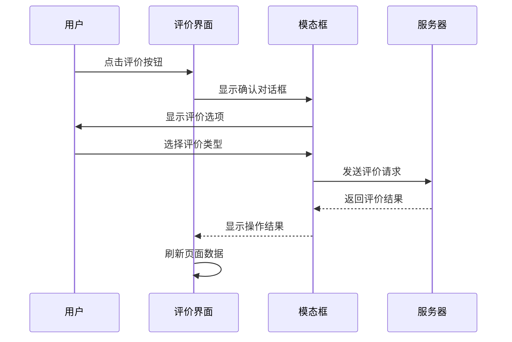
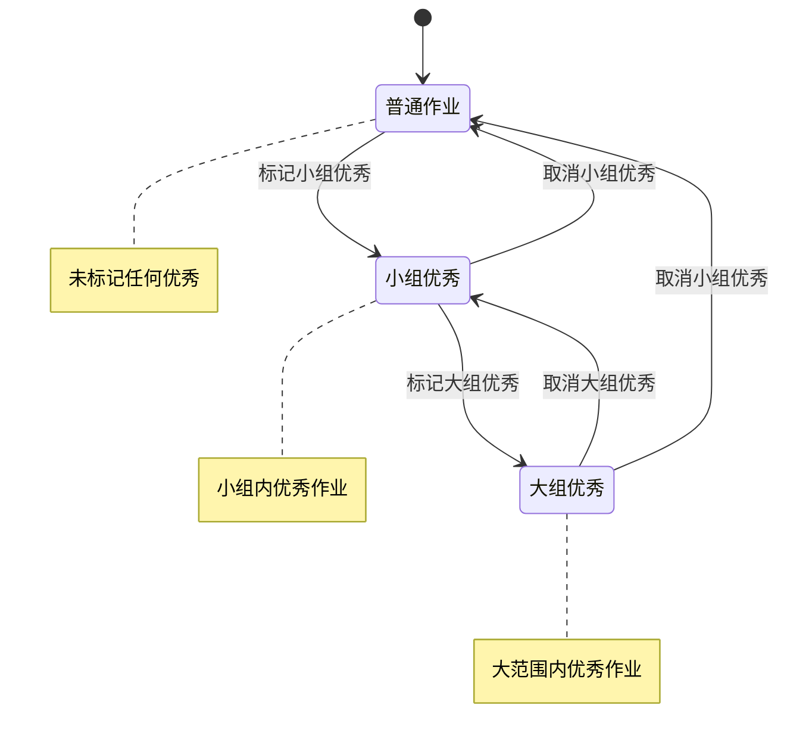
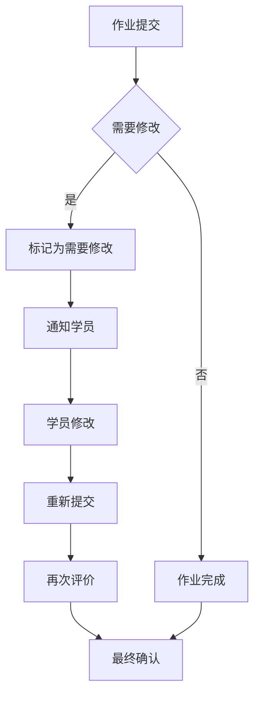
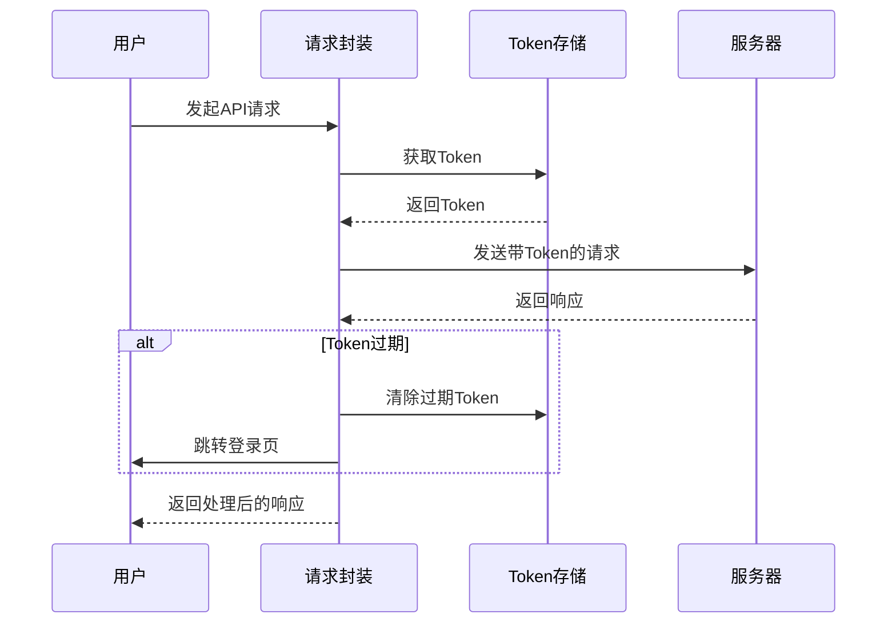
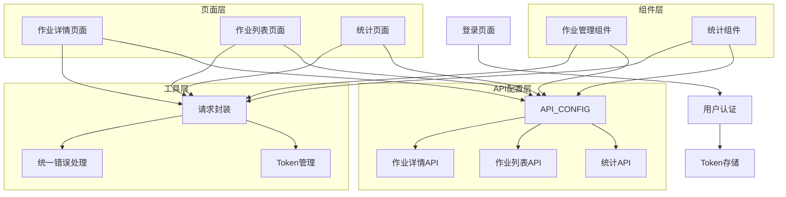

# 作业详情查看

<cite>
**本文档引用的文件**
- [pages/volunteer/homework/detail.vue](file://pages/volunteer/homework/detail.vue)
- [pages/volunteer/homework/homework-list.vue](file://pages/volunteer/homework/homework-list.vue)
- [pages/volunteer/homework/statslist.vue](file://pages/volunteer/homework/statslist.vue)
- [components/volunteer/volunteer-task.vue](file://components/volunteer/volunteer-task.vue)
- [components/volunteer/volunteer-stats.vue](file://components/volunteer/volunteer-stats.vue)
- [api/config.js](file://api/config.js)
- [utils/request.js](file://utils/request.js)
- [pages/Login/index.vue](file://pages/Login/index.vue)
</cite>

## 目录
1. [简介](#简介)
2. [项目结构](#项目结构)
3. [核心组件](#核心组件)
4. [架构概览](#架构概览)
5. [详细组件分析](#详细组件分析)
6. [依赖关系分析](#依赖关系分析)
7. [性能考虑](#性能考虑)
8. [故障排除指南](#故障排除指南)
9. [结论](#结论)

## 简介

作业详情查看功能是致良知教育小程序的重要组成部分，为志愿者提供了一个完整的作业管理界面。该功能涵盖了作业详情展示、作业评价、状态管理和权限控制等核心业务场景。

本系统采用Vue.js框架构建，通过统一的API配置和请求封装，实现了作业状态的实时更新和权限验证。系统支持多种角色的作业管理权限，包括学班、检班、学委、检委、学组、检组等不同职责级别的用户。

## 项目结构

作业详情查看功能主要分布在以下目录结构中：

**图表来源**
- [pages/volunteer/homework/detail.vue:1-505](file://pages/volunteer/homework/detail.vue#L1-L505)
- [components/volunteer/volunteer-task.vue:1-984](file://components/volunteer/volunteer-task.vue#L1-L984)
- [api/config.js:1-60](file://api/config.js#L1-L60)

**章节来源**
- [pages/volunteer/homework/detail.vue:1-505](file://pages/volunteer/homework/detail.vue#L1-L505)
- [components/volunteer/volunteer-task.vue:1-984](file://components/volunteer/volunteer-task.vue#L1-L984)
- [api/config.js:1-60](file://api/config.js#L1-L60)

## 核心组件

### 作业详情页面 (detail.vue)

作业详情页面是整个作业管理系统的入口点，提供了完整的作业信息展示和操作功能：

- **基本信息展示**：学员姓名、所属组织、提交时间、作业状态
- **作业内容预览**：完整的作业内容展示区域
- **操作按钮**：小组优秀和大组优秀的标记/取消功能
- **状态指示**：基于作业状态的颜色编码显示

### 作业列表页面 (homework-list.vue)

作业列表页面提供了批量作业管理功能：

- **标签切换**：作业列表和优秀作业列表的切换
- **日期筛选**：按日期选择作业记录
- **批量操作**：支持对多个作业进行标记操作
- **状态显示**：清晰的状态标签展示

### 统计页面 (statslist.vue)

统计页面专注于作业完成情况的统计分析：

- **多维度统计**：按时完成、未交、迟交的统计
- **标签切换**：三种不同状态的名单查看
- **详细名单**：支持查看具体人员名单

**章节来源**
- [pages/volunteer/homework/detail.vue:28-85](file://pages/volunteer/homework/detail.vue#L28-L85)
- [pages/volunteer/homework/homework-list.vue:16-32](file://pages/volunteer/homework/homework-list.vue#L16-L32)
- [pages/volunteer/homework/statslist.vue:15-37](file://pages/volunteer/homework/statslist.vue#L15-L37)

## 架构概览

系统采用分层架构设计，各组件职责明确：

**图表来源**
- [api/config.js:8-57](file://api/config.js#L8-L57)
- [utils/request.js:7-67](file://utils/request.js#L7-L67)

系统的核心特点：
- **统一API配置**：集中管理所有API端点
- **权限验证**：基于角色的访问控制
- **状态管理**：实时的作业状态更新
- **数据保护**：Token自动注入和过期处理

## 详细组件分析

### 作业详情页面详细分析

作业详情页面是系统的核心交互界面，具有以下关键特性：

#### 页面布局设计

**图表来源**
- [pages/volunteer/homework/detail.vue:28-85](file://pages/volunteer/homework/detail.vue#L28-L85)

#### 数据流处理

作业详情页面的数据流遵循以下模式：

**图表来源**
- [pages/volunteer/homework/detail.vue:111-135](file://pages/volunteer/homework/detail.vue#L111-L135)
- [pages/volunteer/homework/detail.vue:173-196](file://pages/volunteer/homework/detail.vue#L173-L196)

#### 权限验证机制

系统实现了多层次的权限验证：

**图表来源**
- [pages/volunteer/homework/detail.vue:157-170](file://pages/volunteer/homework/detail.vue#L157-L170)
- [pages/volunteer/homework/detail.vue:240-286](file://pages/volunteer/homework/detail.vue#L240-L286)

**章节来源**
- [pages/volunteer/homework/detail.vue:1-505](file://pages/volunteer/homework/detail.vue#L1-L505)

### 作业评价界面分析

作业评价功能提供了完整的评分和评语输入流程：

#### 评分输入机制

系统支持两种评价等级：
- **小组优秀**：绿色标识，适用于小组内的优秀作业
- **大组优秀**：蓝色标识，适用于更大范围的优秀作业

评价权限控制：
- 所有角色都可以标记小组优秀
- 大组优秀需要先标记为小组优秀
- 学组/检组角色无大组优秀操作权限

#### 评语填写和提交流程

**图表来源**
- [pages/volunteer/homework/detail.vue:198-286](file://pages/volunteer/homework/detail.vue#L198-L286)

**章节来源**
- [pages/volunteer/homework/detail.vue:198-286](file://pages/volunteer/homework/detail.vue#L198-L286)

### 作业状态流转机制

系统实现了完整的作业状态管理：

#### 状态定义

| 状态 | 描述 | 颜色标识 |
|------|------|----------|
| 普通作业 | 未标记任何优秀 | 默认颜色 |
| 小组优秀 | 小组内优秀作业 | 绿色 |
| 大组优秀 | 大范围内优秀作业 | 蓝色 |

#### 状态变更逻辑

**图表来源**
- [pages/volunteer/homework/detail.vue:44-54](file://pages/volunteer/homework/detail.vue#L44-L54)

**章节来源**
- [pages/volunteer/homework/detail.vue:44-54](file://pages/volunteer/homework/detail.vue#L44-L54)

### 作业反馈功能

系统提供了完整的作业反馈机制：

#### 教师评语支持

虽然当前版本主要关注作业标记功能，但系统架构支持未来扩展教师评语功能：
- 作业详情页面预留了评语展示区域
- 支持多级反馈机制
- 可扩展的评论系统

#### 修改建议和二次提交

**图表来源**
- [pages/volunteer/homework/detail.vue:198-286](file://pages/volunteer/homework/detail.vue#L198-L286)

### 权限验证和数据保护

#### 登录状态管理

系统通过统一的请求封装实现自动化的权限管理：

**图表来源**
- [utils/request.js:7-67](file://utils/request.js#L7-L67)

#### 角色权限控制

系统支持六种不同的角色权限：

| 角色 | 权限范围 | 大组优秀权限 |
|------|----------|-------------|
| 学班 | 班级管理 | ✅ |
| 检班 | 班级检查 | ✅ |
| 学委 | 班级委员会 | ✅ |
| 检委 | 班级检查委员会 | ✅ |
| 学组 | 小组管理 | ❌ |
| 检组 | 小组检查 | ❌ |

**章节来源**
- [utils/request.js:7-67](file://utils/request.js#L7-L67)
- [pages/volunteer/homework/detail.vue:157-170](file://pages/volunteer/homework/detail.vue#L157-L170)

## 依赖关系分析

系统采用模块化设计，各组件之间的依赖关系清晰：

**图表来源**
- [api/config.js:8-57](file://api/config.js#L8-L57)
- [utils/request.js:7-67](file://utils/request.js#L7-L67)

**章节来源**
- [api/config.js:1-60](file://api/config.js#L1-L60)
- [utils/request.js:1-98](file://utils/request.js#L1-L98)

## 性能考虑

### 数据加载优化

系统采用了多种性能优化策略：

1. **懒加载机制**：页面按需加载，减少初始加载时间
2. **缓存策略**：Token和用户信息本地缓存
3. **请求去重**：避免重复的API调用
4. **错误重试**：网络异常时的自动重试机制

### 内存管理

- 合理的组件生命周期管理
- 及时清理事件监听器
- 避免内存泄漏

## 故障排除指南

### 常见问题及解决方案

#### 登录状态异常

**问题症状**：页面显示登录状态异常或频繁跳转登录页

**解决步骤**：
1. 检查Token是否正确存储
2. 验证Token是否过期
3. 确认网络连接正常
4. 重新登录系统

#### 权限不足

**问题症状**：无法看到某些作业或执行特定操作

**解决步骤**：
1. 确认当前用户的角色权限
2. 检查管理范围设置
3. 联系管理员获取相应权限

#### 数据加载失败

**问题症状**：页面空白或显示加载错误

**解决步骤**：
1. 检查网络连接状态
2. 刷新页面重试
3. 清除浏览器缓存
4. 联系技术支持

**章节来源**
- [utils/request.js:29-66](file://utils/request.js#L29-L66)

## 结论

作业详情查看功能通过精心设计的架构和完善的权限控制，为致良知教育小程序提供了强大的作业管理能力。系统的主要优势包括：

1. **完整的功能覆盖**：从作业详情展示到评价管理的全流程支持
2. **灵活的权限控制**：基于角色的精细化权限管理
3. **良好的用户体验**：直观的操作界面和流畅的交互体验
4. **可靠的系统架构**：模块化设计和统一的API管理
5. **完善的安全机制**：Token管理和数据保护措施

该系统为未来的功能扩展奠定了坚实的基础，可以轻松支持更多的作业管理需求和反馈机制。通过持续的优化和改进，该系统将成为致良知教育平台的重要组成部分。