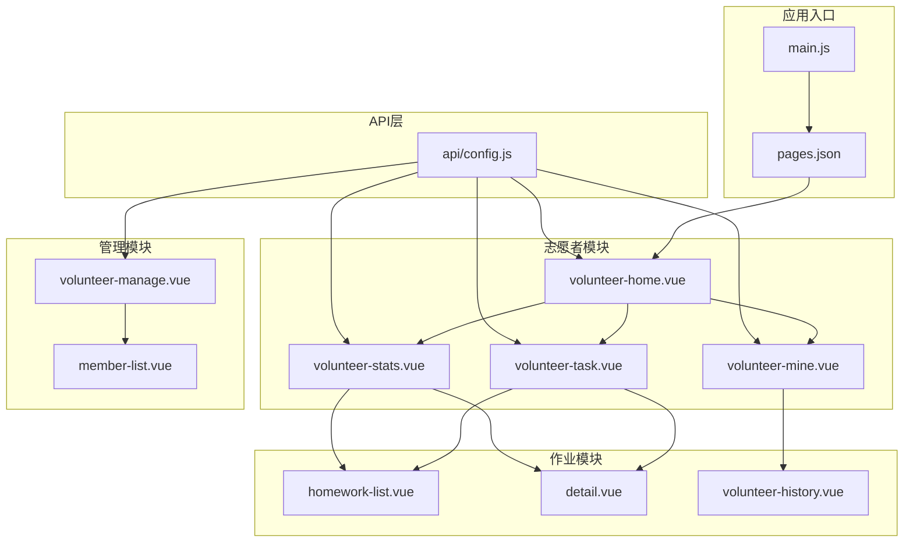
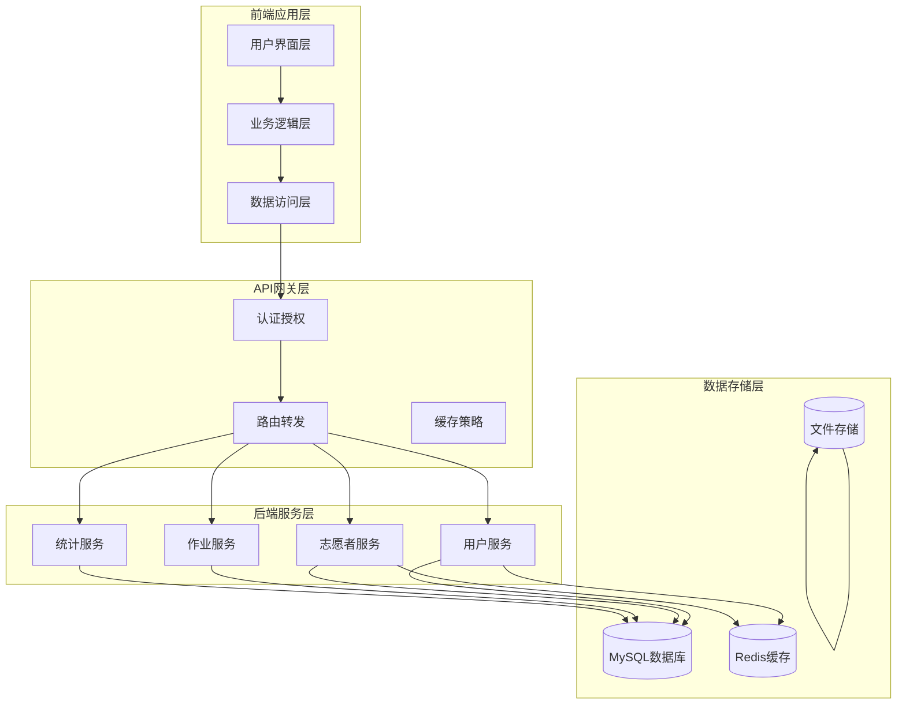
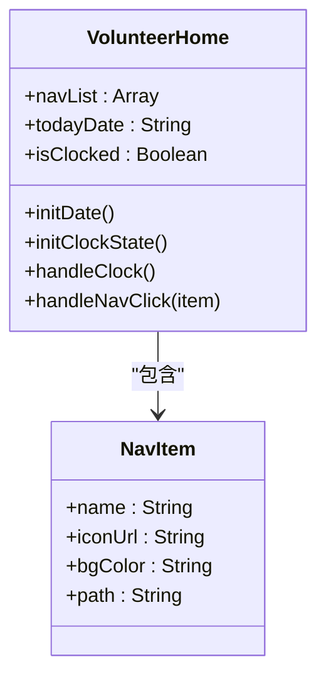
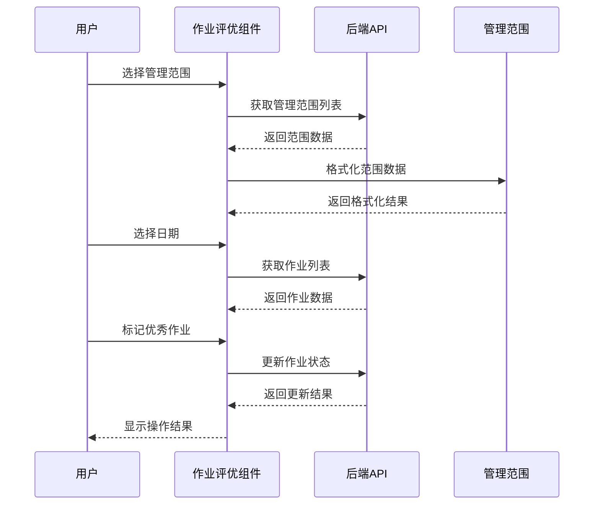
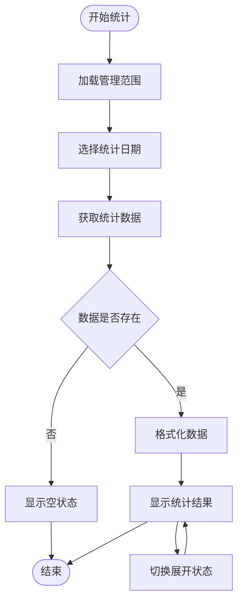
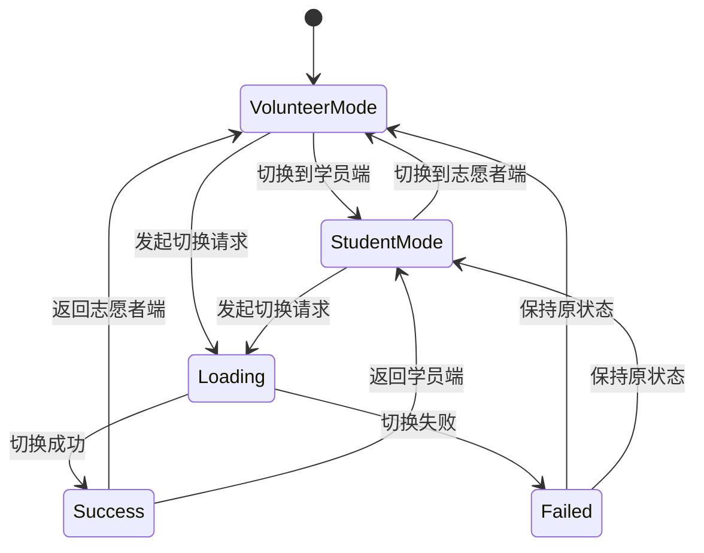
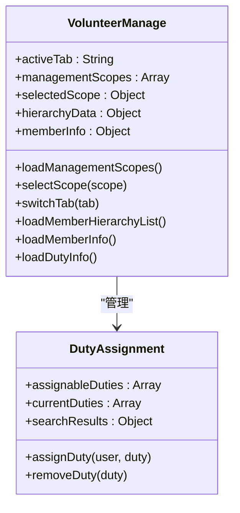
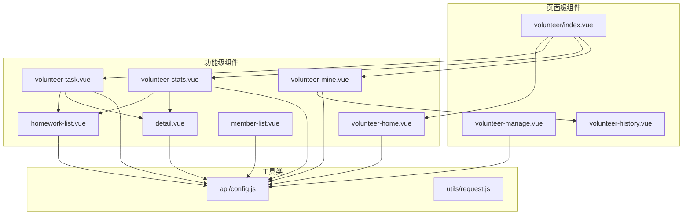

# 志愿者服务系统

<cite>
**本文档引用的文件**
- [pages/volunteer/index.vue](file://pages/volunteer/index.vue)
- [components/volunteer/volunteer-home.vue](file://components/volunteer/volunteer-home.vue)
- [components/volunteer/volunteer-task.vue](file://components/volunteer/volunteer-task.vue)
- [components/volunteer/volunteer-mine.vue](file://components/volunteer/volunteer-mine.vue)
- [components/volunteer/volunteer-stats.vue](file://components/volunteer/volunteer-stats.vue)
- [pages/volunteer-manage/volunteer-manage.vue](file://pages/volunteer-manage/volunteer-manage.vue)
- [pages/volunteer-manage/member-list.vue](file://pages/volunteer-manage/member-list.vue)
- [pages/volunteer/homework/homework-list.vue](file://pages/volunteer/homework/homework-list.vue)
- [pages/volunteer/homework/detail.vue](file://pages/volunteer/homework/detail.vue)
- [pages/volunteer-history/volunteer-history.vue](file://pages/volunteer-history/volunteer-history.vue)
- [api/config.js](file://api/config.js)
- [main.js](file://main.js)
- [pages.json](file://pages.json)
</cite>

## 目录
1. [简介](#简介)
2. [项目结构](#项目结构)
3. [核心组件](#核心组件)
4. [架构概览](#架构概览)
5. [详细组件分析](#详细组件分析)
6. [依赖关系分析](#依赖关系分析)
7. [性能考虑](#性能考虑)
8. [故障排除指南](#故障排除指南)
9. [结论](#结论)
10. [附录](#附录)

## 简介

致良知教育志愿者服务系统是一个基于UniApp框架开发的移动应用，专注于为志愿者提供完整的任务管理、统计分析和个人中心功能。系统围绕"知行合一"的理念，通过数字化手段提升志愿者的服务效率和体验。

该系统主要包含以下核心功能模块：
- 志愿者首页：展示功能导航、知行打卡和公益初心墙
- 作业评优管理：支持作业列表查看、优秀作业标记和层级管理
- 统计报表：提供多层级的作业完成情况统计分析
- 个人中心：管理个人信息、身份切换和历史记录
- 管理功能：支持志愿者管理、岗位分配和成员管理

## 项目结构

项目采用模块化的目录结构，按照功能域进行组织：

**图表来源**
- [main.js:1-26](file://main.js#L1-L26)
- [pages.json:1-131](file://pages.json#L1-L131)
- [api/config.js:1-60](file://api/config.js#L1-L60)

**章节来源**
- [main.js:1-26](file://main.js#L1-L26)
- [pages.json:1-131](file://pages.json#L1-L131)

## 核心组件

### 志愿者首页组件

志愿者首页作为系统的入口界面，提供了完整的功能导航和用户体验设计：

- **设计理念**：采用"致良知教育"的品牌色彩，使用深红色渐变背景营造庄重感
- **功能模块**：
  - 功能导航网格：包含担当过往、管理成员、志愿证书、群聊四个核心功能
  - 知行打卡专区：每日经典语录和打卡功能
  - 公益初心墙：展示志愿服务理念和价值观

### 作业评优管理系统

该系统实现了完整的作业评优工作流，支持多层级的组织架构管理：

- **管理范围**：支持学班、检班、学委、检委、学组、检组等不同层级
- **权限控制**：根据角色类型限制操作权限
- **数据展示**：支持作业列表和优秀作业两种视图模式
- **交互功能**：支持小组优秀和大组优秀的标记与取消

### 统计分析模块

提供多层次的作业完成情况统计分析：

- **层级统计**：支持从班级到小组的三级统计
- **指标展示**：包含总人数、按时完成数、未交数、迟交数等关键指标
- **完成率计算**：自动计算按时完成率和整体完成率
- **详细名单**：支持查看每个层级的详细人员名单

### 个人中心模块

集成了完整的个人信息管理和身份切换功能：

- **身份管理**：支持志愿者端和学员端的身份切换
- **信息维护**：支持头像上传、昵称修改等功能
- **统计展示**：展示参与营期、负责班级、大组、小组的数量
- **历史记录**：查看志愿者服务历史

**章节来源**
- [components/volunteer/volunteer-home.vue:1-404](file://components/volunteer/volunteer-home.vue#L1-L404)
- [components/volunteer/volunteer-task.vue:1-800](file://components/volunteer/volunteer-task.vue#L1-L800)
- [components/volunteer/volunteer-stats.vue:1-713](file://components/volunteer/volunteer-stats.vue#L1-L713)
- [components/volunteer/volunteer-mine.vue:1-811](file://components/volunteer/volunteer-mine.vue#L1-L811)

## 架构概览

系统采用前后端分离的架构设计，前端使用UniApp框架，后端提供RESTful API接口：

**图表来源**
- [api/config.js:8-57](file://api/config.js#L8-L57)
- [components/volunteer/volunteer-task.vue:233-254](file://components/volunteer/volunteer-task.vue#L233-L254)

系统的核心特点：
- **统一认证**：使用Bearer Token进行身份验证
- **模块化设计**：各功能模块相对独立，便于维护和扩展
- **响应式设计**：适配不同尺寸的移动设备屏幕
- **离线支持**：部分数据支持本地缓存

## 详细组件分析

### 志愿者首页组件分析

#### 设计理念与视觉效果

首页采用了"致良知教育"的品牌视觉体系：

**图表来源**
- [components/volunteer/volunteer-home.vue:64-148](file://components/volunteer/volunteer-home.vue#L64-L148)

#### 知行打卡功能实现

系统集成了"知行打卡"功能，鼓励志愿者每日坚持：

- **打卡状态管理**：使用localStorage存储当日打卡记录
- **经典语录展示**：每日展示王阳明的经典语录
- **状态反馈**：提供Toast提示和UI状态变化

**章节来源**
- [components/volunteer/volunteer-home.vue:64-148](file://components/volunteer/volunteer-home.vue#L64-L148)

### 作业评优管理系统分析

#### 管理范围与权限控制

系统支持多层级的组织架构管理：

**图表来源**
- [components/volunteer/volunteer-task.vue:233-254](file://components/volunteer/volunteer-task.vue#L233-L254)
- [components/volunteer/volunteer-task.vue:422-479](file://components/volunteer/volunteer-task.vue#L422-L479)

#### 权限控制机制

系统实现了严格的权限控制：

- **角色类型**：学班、检班、学委、检委、学组、检组
- **操作权限**：不同角色具有不同的操作权限
- **状态约束**：大组优秀标记需要先标记小组优秀

**章节来源**
- [components/volunteer/volunteer-task.vue:481-499](file://components/volunteer/volunteer-task.vue#L481-L499)
- [components/volunteer/volunteer-task.vue:544-596](file://components/volunteer/volunteer-task.vue#L544-L596)

### 统计分析模块分析

#### 多层级统计实现

统计模块支持从班级到小组的三级统计：

**图表来源**
- [components/volunteer/volunteer-stats.vue:251-282](file://components/volunteer/volunteer-stats.vue#L251-L282)
- [components/volunteer/volunteer-stats.vue:325-364](file://components/volunteer/volunteer-stats.vue#L325-L364)

#### 统计指标计算

系统自动计算关键统计指标：

- **总人数**：该层级下的总参与人数
- **按时完成数**：按时提交作业的人数
- **未交数**：未提交作业的人数
- **迟交数**：延迟提交作业的人数
- **完成率**：按时完成数/总人数 × 100%

**章节来源**
- [components/volunteer/volunteer-stats.vue:71-101](file://components/volunteer/volunteer-stats.vue#L71-L101)
- [components/volunteer/volunteer-stats.vue:158-187](file://components/volunteer/volunteer-stats.vue#L158-L187)

### 个人中心模块分析

#### 身份切换功能

个人中心实现了灵活的身份切换机制：

**图表来源**
- [components/volunteer/volunteer-mine.vue:525-574](file://components/volunteer/volunteer-mine.vue#L525-L574)

#### 个人信息管理

系统提供了完整的个人信息管理功能：

- **头像管理**：支持微信头像选择和自定义图片上传
- **昵称编辑**：支持微信昵称获取和手动编辑
- **身份切换**：实时切换志愿者端和学员端
- **历史记录**：查看志愿者服务历史

**章节来源**
- [components/volunteer/volunteer-mine.vue:298-452](file://components/volunteer/volunteer-mine.vue#L298-L452)
- [pages/volunteer-history/volunteer-history.vue:86-125](file://pages/volunteer-history/volunteer-history.vue#L86-L125)

### 管理功能模块分析

#### 志愿者管理界面

管理模块提供了完整的志愿者管理功能：

**图表来源**
- [pages/volunteer-manage/volunteer-manage.vue:241-732](file://pages/volunteer-manage/volunteer-manage.vue#L241-L732)

#### 岗位分配机制

系统实现了智能的岗位分配功能：

- **搜索功能**：支持按账户、昵称、手机号搜索用户
- **权限控制**：根据管理范围限制可分配岗位
- **状态管理**：实时显示岗位分配状态
- **操作反馈**：提供分配和移除操作的成功/失败反馈

**章节来源**
- [pages/volunteer-manage/volunteer-manage.vue:577-730](file://pages/volunteer-manage/volunteer-manage.vue#L577-L730)

## 依赖关系分析

### 组件间依赖关系

**图表来源**
- [pages/volunteer/index.vue:44-48](file://pages/volunteer/index.vue#L44-L48)
- [api/config.js:15-56](file://api/config.js#L15-L56)

### API接口依赖

系统依赖的主要API接口：

| 接口名称 | 方法 | 描述 | 权限 |
|---------|------|------|------|
| /volunteer/scopes | GET | 获取志愿者管理范围 | 需要登录 |
| /homework/list | GET | 获取作业列表 | 需要登录 |
| /homework/detail | GET | 获取作业详情 | 需要登录 |
| /camp/homework/mark-small-group | POST | 标记小组优秀 | 需要登录 |
| /camp/homework/mark-big-group | POST | 标记大组优秀 | 需要登录 |
| /user/volunteer-stats | GET | 获取志愿者统计 | 需要登录 |
| /user/volunteer-history | GET | 获取志愿者历史 | 需要登录 |
| /volunteer/manage/members | GET | 获取成员列表 | 需要登录 |
| /volunteer/manage/assign-duty | POST | 分配岗位 | 需要登录 |

**章节来源**
- [api/config.js:36-47](file://api/config.js#L36-L47)

## 性能考虑

### 数据缓存策略

系统采用了多层次的数据缓存机制：

1. **本地存储**：使用localStorage缓存用户信息和打卡状态
2. **组件缓存**：在组件生命周期内缓存API请求结果
3. **状态管理**：使用Vuex进行全局状态管理

### 网络优化

- **请求合并**：对频繁的API请求进行合并处理
- **防抖机制**：对搜索和筛选操作添加防抖处理
- **错误重试**：对网络异常提供自动重试机制

### UI性能优化

- **虚拟滚动**：对长列表使用虚拟滚动技术
- **懒加载**：对图片和组件进行懒加载
- **动画优化**：使用CSS3硬件加速优化动画效果

## 故障排除指南

### 常见问题及解决方案

#### 登录相关问题

**问题**：用户无法登录系统
**原因**：Token过期或服务器异常
**解决方案**：
1. 检查网络连接状态
2. 清除本地缓存重新登录
3. 检查服务器状态

#### 数据加载失败

**问题**：作业列表或统计信息无法加载
**原因**：API接口异常或权限不足
**解决方案**：
1. 检查API配置是否正确
2. 验证用户权限是否足够
3. 查看网络请求日志

#### 页面跳转异常

**问题**：功能页面无法正常跳转
**原因**：页面路径配置错误或页面不存在
**解决方案**：
1. 检查pages.json中的页面配置
2. 验证页面路径是否正确
3. 确认目标页面是否存在

**章节来源**
- [components/volunteer/volunteer-home.vue:127-146](file://components/volunteer/volunteer-home.vue#L127-L146)
- [components/volunteer/volunteer-mine.vue:500-506](file://components/volunteer/volunteer-mine.vue#L500-L506)

## 结论

致良知教育志愿者服务系统是一个功能完整、设计合理的移动应用。系统通过模块化的架构设计，实现了志愿者服务的全流程管理。

### 主要优势

1. **设计理念先进**：体现了"知行合一"的教育理念
2. **功能覆盖全面**：涵盖了志愿者服务的各个方面
3. **权限控制严格**：确保了数据安全和操作规范
4. **用户体验良好**：界面设计符合移动端使用习惯
5. **扩展性强**：模块化设计便于后续功能扩展

### 改进建议

1. **增加离线功能**：在网络不稳定时提供基本功能
2. **优化性能表现**：对大数据量场景进行性能优化
3. **增强数据可视化**：提供更丰富的图表和报表
4. **完善通知机制**：增加消息推送和提醒功能

## 附录

### API接口文档

系统主要使用的API接口包括：

- **认证相关**：登录、退出、身份切换
- **志愿者管理**：管理范围、成员管理、岗位分配
- **作业管理**：作业列表、作业详情、优秀作业标记
- **统计分析**：层级统计、完成率计算
- **个人中心**：信息管理、历史记录

### 开发环境配置

- **开发工具**：HBuilderX
- **运行平台**：微信小程序、Android、iOS
- **开发语言**：JavaScript/Vue.js
- **构建工具**：Webpack
- **版本控制**：Git

### 部署指南

1. 安装Node.js和npm
2. 安装HBuilderX开发工具
3. 配置后端API地址
4. 进行本地开发和测试
5. 构建发布包并部署