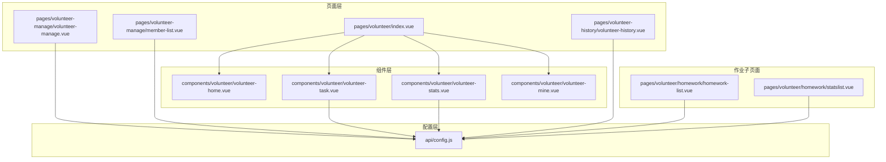
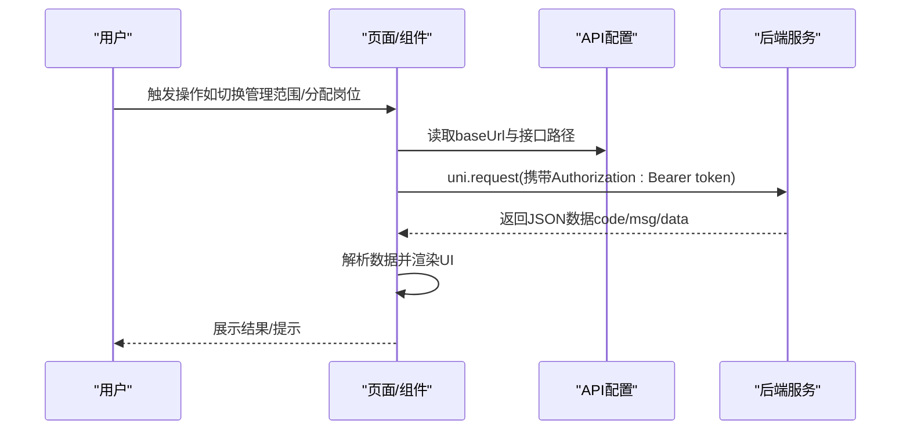
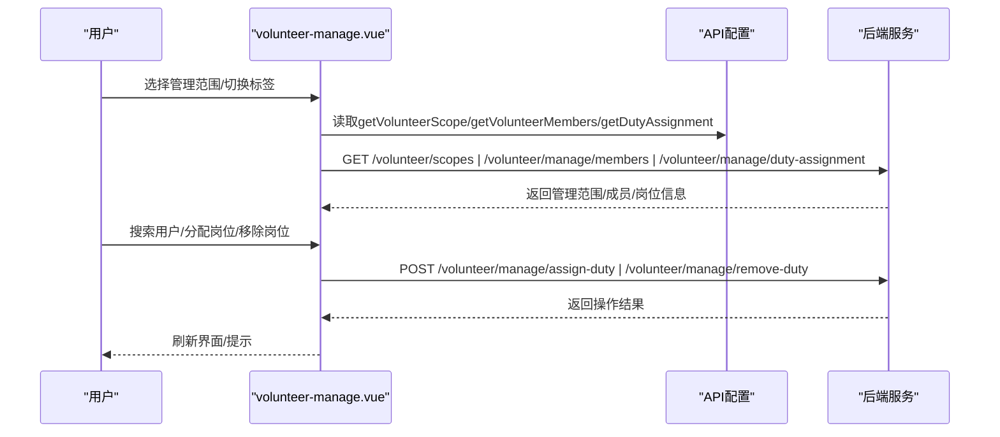
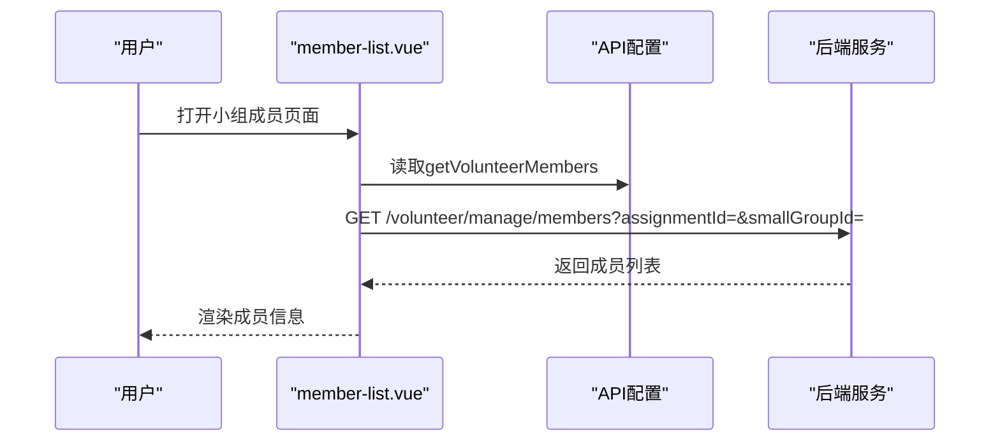
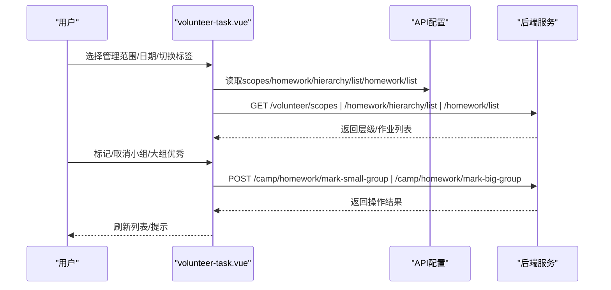
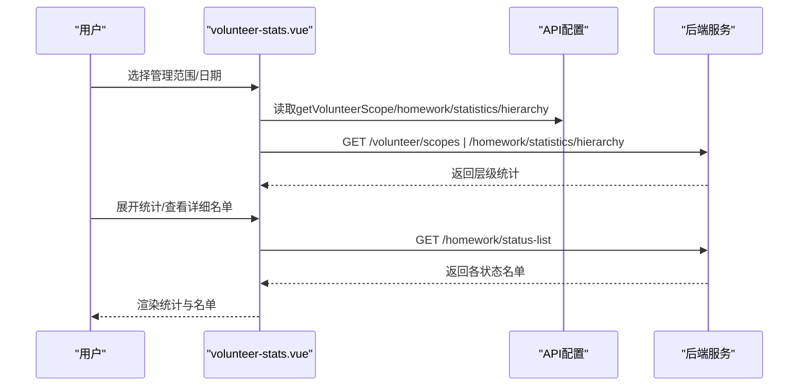
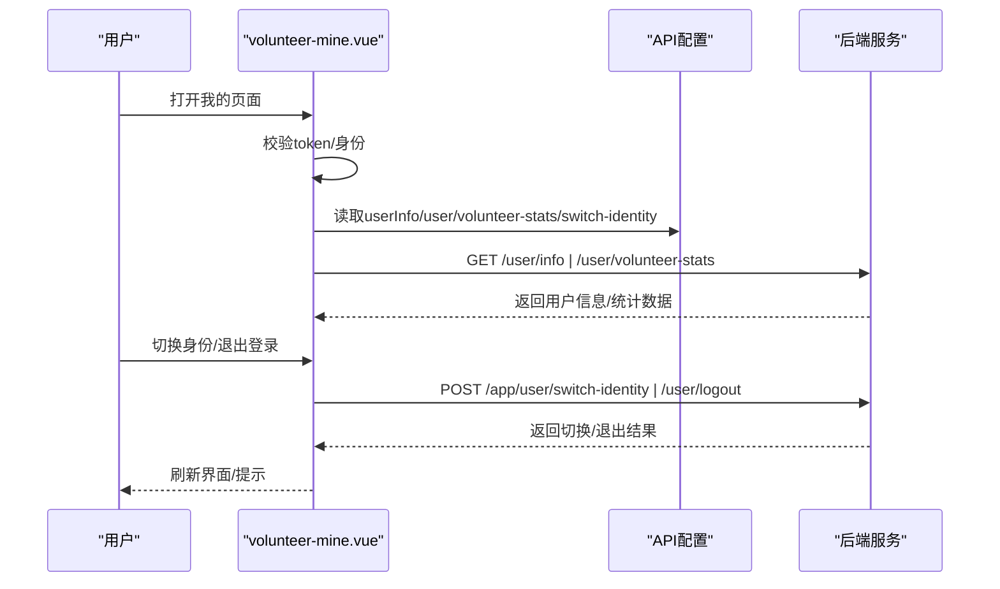
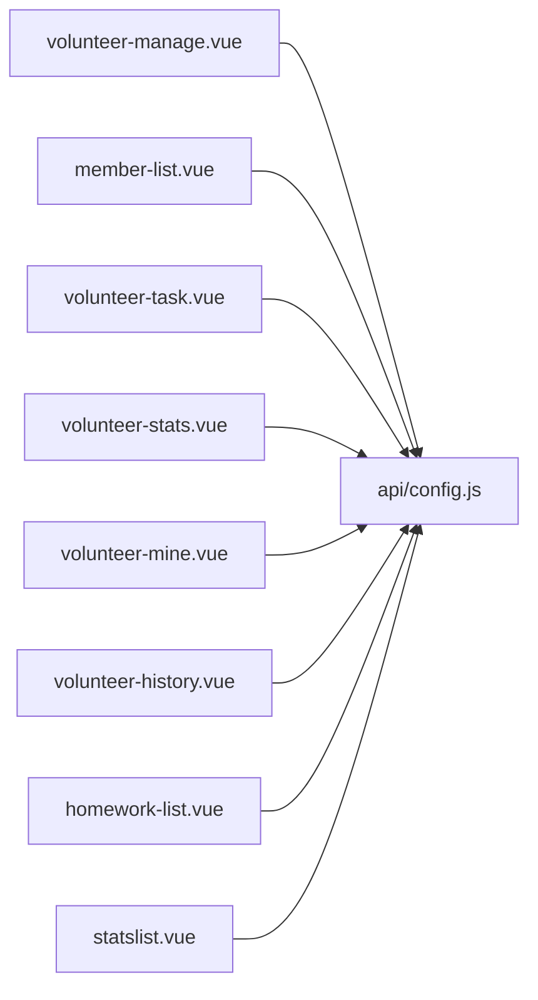

# 志愿者管理

<cite>
**本文引用的文件**
- [volunteer-manage.vue](file://pages/volunteer-manage/volunteer-manage.vue)
- [member-list.vue](file://pages/volunteer-manage/member-list.vue)
- [volunteer-home.vue](file://components/volunteer/volunteer-home.vue)
- [volunteer-stats.vue](file://components/volunteer/volunteer-stats.vue)
- [volunteer-task.vue](file://components/volunteer/volunteer-task.vue)
- [volunteer-mine.vue](file://components/volunteer/volunteer-mine.vue)
- [config.js](file://api/config.js)
- [volunteer-index.vue](file://pages/volunteer/index.vue)
- [homework-list.vue](file://pages/volunteer/homework/homework-list.vue)
- [statslist.vue](file://pages/volunteer/homework/statslist.vue)
- [volunteer-history.vue](file://pages/volunteer-history/volunteer-history.vue)
</cite>

## 目录
1. [简介](#简介)
2. [项目结构](#项目结构)
3. [核心组件](#核心组件)
4. [架构总览](#架构总览)
5. [详细组件分析](#详细组件分析)
6. [依赖分析](#依赖分析)
7. [性能考虑](#性能考虑)
8. [故障排除指南](#故障排除指南)
9. [结论](#结论)
10. [附录](#附录)

## 简介
本文件面向志愿者管理模块，围绕“管理员权限体系与角色管理”“成员管理功能”“岗位分配与组织架构”“统计与监控”“安全与审计”等主题进行系统化说明。通过梳理前端页面与组件的交互流程、API 接口映射以及数据流转，帮助开发者与运营人员快速理解并高效使用该模块。

## 项目结构
志愿者管理模块主要由以下层次构成：
- 页面层：管理入口页面、成员列表页面、作业统计与作业列表页面、历史记录页面
- 组件层：志愿者首页、作业评优、作业统计、我的页面等
- 配置层：API 基础地址与接口路径配置
- 数据流：基于 uni-app 的页面与组件间通信，结合本地存储 token 实现鉴权

图表来源
- [volunteer-manage.vue:1-1160](file://pages/volunteer-manage/volunteer-manage.vue#L1-L1160)
- [member-list.vue:1-318](file://pages/volunteer-manage/member-list.vue#L1-L318)
- [volunteer-home.vue:1-404](file://components/volunteer/volunteer-home.vue#L1-L404)
- [volunteer-task.vue:1-984](file://components/volunteer/volunteer-task.vue#L1-L984)
- [volunteer-stats.vue:1-713](file://components/volunteer/volunteer-stats.vue#L1-L713)
- [volunteer-mine.vue:1-811](file://components/volunteer/volunteer-mine.vue#L1-L811)
- [config.js:1-60](file://api/config.js#L1-L60)
- [volunteer-index.vue:1-210](file://pages/volunteer/index.vue#L1-L210)
- [homework-list.vue:1-615](file://pages/volunteer/homework/homework-list.vue#L1-L615)
- [statslist.vue:1-384](file://pages/volunteer/homework/statslist.vue#L1-L384)
- [volunteer-history.vue:1-266](file://pages/volunteer-history/volunteer-history.vue#L1-L266)

章节来源
- [volunteer-manage.vue:1-1160](file://pages/volunteer-manage/volunteer-manage.vue#L1-L1160)
- [volunteer-home.vue:1-404](file://components/volunteer/volunteer-home.vue#L1-L404)
- [volunteer-task.vue:1-984](file://components/volunteer/volunteer-task.vue#L1-L984)
- [volunteer-stats.vue:1-713](file://components/volunteer/volunteer-stats.vue#L1-L713)
- [volunteer-mine.vue:1-811](file://components/volunteer/volunteer-mine.vue#L1-L811)
- [config.js:1-60](file://api/config.js#L1-L60)
- [volunteer-index.vue:1-210](file://pages/volunteer/index.vue#L1-L210)
- [homework-list.vue:1-615](file://pages/volunteer/homework/homework-list.vue#L1-L615)
- [statslist.vue:1-384](file://pages/volunteer/homework/statslist.vue#L1-L384)
- [volunteer-history.vue:1-266](file://pages/volunteer-history/volunteer-history.vue#L1-L266)

## 核心组件
- 志愿者管理主页面：提供“管理成员”“分配岗位”两大功能，支持按管理范围（营期/班级/大组/小组）切换，支持层级列表与成员列表两种视图模式，并提供岗位搜索与分配、移除能力。
- 成员列表页面：针对小组维度展示成员信息，包含基础资料与状态标签。
- 作业评优页面：支持按日期与管理范围筛选，提供层级视图与作业列表视图，支持“小组优秀”“大组优秀”标记与取消。
- 作业统计页面：按层级统计按时完成率、未交/迟交情况，支持查看详细名单。
- 我的页面：展示志愿者身份下的统计数据与身份切换、退出登录等能力。
- 历史记录页面：展示志愿者担当过往，含职责、时间与状态。

章节来源
- [volunteer-manage.vue:1-1160](file://pages/volunteer-manage/volunteer-manage.vue#L1-L1160)
- [member-list.vue:1-318](file://pages/volunteer-manage/member-list.vue#L1-L318)
- [volunteer-task.vue:1-984](file://components/volunteer/volunteer-task.vue#L1-L984)
- [volunteer-stats.vue:1-713](file://components/volunteer/volunteer-stats.vue#L1-L713)
- [volunteer-mine.vue:1-811](file://components/volunteer/volunteer-mine.vue#L1-L811)
- [volunteer-history.vue:1-266](file://pages/volunteer-history/volunteer-history.vue#L1-L266)

## 架构总览
志愿者管理模块采用“页面+组件+配置”的分层架构，页面负责业务编排，组件负责具体功能实现，配置集中管理 API 地址与路径。页面间通过 uni.$emit/$on 进行轻量通信，组件内部通过 uni.request 发起 HTTP 请求，统一携带 Authorization 头与 Bearer Token。

图表来源
- [volunteer-manage.vue:285-327](file://pages/volunteer-manage/volunteer-manage.vue#L285-L327)
- [volunteer-task.vue:233-254](file://components/volunteer/volunteer-task.vue#L233-L254)
- [volunteer-stats.vue:251-282](file://components/volunteer/volunteer-stats.vue#L251-L282)
- [config.js:8-57](file://api/config.js#L8-L57)

## 详细组件分析

### 志愿者管理主页面（管理成员/分配岗位）
- 功能要点
  - 管理范围选择：支持“营期/班级/大组/小组”等多层级范围，动态计算显示名称。
  - 成员视图：根据目标类型切换“层级列表”或“小组成员列表”，支持展开/折叠与跳转。
  - 岗位分配：支持按岗位搜索用户、分配/移除岗位，防抖搜索与错误处理。
  - 安全控制：未登录自动跳转登录；接口统一携带 Authorization 头。
- 关键流程
  - 初始化：读取 token，加载管理范围列表，设置默认选中范围并加载对应数据。
  - 成员列表：根据目标类型（class/big_group/small_group）构造参数，调用成员接口。
  - 岗位信息：根据 assignmentId 查询可分配岗位与当前任职人，支持搜索与分配。
  - 操作审计：分配/移除岗位后刷新数据，提示成功/失败。

图表来源
- [volunteer-manage.vue:285-327](file://pages/volunteer-manage/volunteer-manage.vue#L285-L327)
- [volunteer-manage.vue:478-516](file://pages/volunteer-manage/volunteer-manage.vue#L478-L516)
- [volunteer-manage.vue:519-556](file://pages/volunteer-manage/volunteer-manage.vue#L519-L556)
- [volunteer-manage.vue:587-624](file://pages/volunteer-manage/volunteer-manage.vue#L587-L624)
- [volunteer-manage.vue:626-676](file://pages/volunteer-manage/volunteer-manage.vue#L626-L676)
- [volunteer-manage.vue:678-730](file://pages/volunteer-manage/volunteer-manage.vue#L678-L730)
- [config.js:36-41](file://api/config.js#L36-L41)

章节来源
- [volunteer-manage.vue:1-1160](file://pages/volunteer-manage/volunteer-manage.vue#L1-L1160)
- [config.js:1-60](file://api/config.js#L1-L60)

### 成员列表页面（小组成员）
- 功能要点
  - 展示小组成员基本信息与状态标签。
  - 支持通过 assignmentId 与 smallGroupId 双参数加载数据。
  - 未登录自动提示并跳转登录。
- 关键流程
  - onLoad 读取参数，调用成员接口，解析返回数据并渲染列表。

图表来源
- [member-list.vue:114-163](file://pages/volunteer-manage/member-list.vue#L114-L163)
- [config.js:37-37](file://api/config.js#L37-L37)

章节来源
- [member-list.vue:1-318](file://pages/volunteer-manage/member-list.vue#L1-L318)
- [config.js:1-60](file://api/config.js#L1-L60)

### 作业评优页面（作业列表/优秀作业）
- 功能要点
  - 管理范围选择与日期选择联动。
  - 层级视图与作业列表视图切换，支持小组作业详情跳转。
  - “小组优秀”“大组优秀”标记与取消，权限校验（学组/检组不可操作大组优秀）。
- 关键流程
  - 获取管理范围 -> 选择范围/日期 -> 加载层级或作业列表 -> 标记/取消优秀 -> 刷新本地列表。

图表来源
- [volunteer-task.vue:233-254](file://components/volunteer/volunteer-task.vue#L233-L254)
- [volunteer-task.vue:339-377](file://components/volunteer/volunteer-task.vue#L339-L377)
- [volunteer-task.vue:422-479](file://components/volunteer/volunteer-task.vue#L422-L479)
- [volunteer-task.vue:502-542](file://components/volunteer/volunteer-task.vue#L502-L542)
- [volunteer-task.vue:544-596](file://components/volunteer/volunteer-task.vue#L544-L596)
- [config.js:36-51](file://api/config.js#L36-L51)

章节来源
- [volunteer-task.vue:1-984](file://components/volunteer/volunteer-task.vue#L1-L984)
- [config.js:1-60](file://api/config.js#L1-L60)

### 作业统计页面（层级统计/详细名单）
- 功能要点
  - 选择管理范围与日期，按层级统计按时完成率与未交/迟交情况。
  - 支持展开/收起统计详情，跳转查看详细名单（按状态分类）。
- 关键流程
  - 获取管理范围 -> 选择日期 -> 加载层级统计 -> 查看详细名单。

图表来源
- [volunteer-stats.vue:251-282](file://components/volunteer/volunteer-stats.vue#L251-L282)
- [volunteer-stats.vue:325-364](file://components/volunteer/volunteer-stats.vue#L325-L364)
- [volunteer-stats.vue:389-397](file://components/volunteer/volunteer-stats.vue#L389-L397)
- [config.js:36-51](file://api/config.js#L36-L51)

章节来源
- [volunteer-stats.vue:1-713](file://components/volunteer/volunteer-stats.vue#L1-L713)
- [config.js:1-60](file://api/config.js#L1-L60)

### 我的页面（身份切换/退出登录/统计数据）
- 功能要点
  - 展示志愿者身份下的统计数据（参与营期、负责班级/大组/小组）。
  - 身份切换（志愿者端/学员端），同步后端身份标识。
  - 退出登录，清理本地缓存并跳转登录页。
- 关键流程
  - 登录态校验 -> 获取用户信息 -> 获取志愿者统计数据 -> 身份切换/退出登录。

图表来源
- [volunteer-mine.vue:160-179](file://components/volunteer/volunteer-mine.vue#L160-L179)
- [volunteer-mine.vue:241-296](file://components/volunteer/volunteer-mine.vue#L241-L296)
- [volunteer-mine.vue:525-574](file://components/volunteer/volunteer-mine.vue#L525-L574)
- [volunteer-mine.vue:457-496](file://components/volunteer/volunteer-mine.vue#L457-L496)
- [config.js:18-35](file://api/config.js#L18-L35)
- [config.js:36-36](file://api/config.js#L36-L36)
- [config.js:53-53](file://api/config.js#L53-L53)

章节来源
- [volunteer-mine.vue:1-811](file://components/volunteer/volunteer-mine.vue#L1-L811)
- [config.js:1-60](file://api/config.js#L1-L60)

### 历史记录页面（担当过往）
- 功能要点
  - 展示志愿者的职责、时间与状态（正在进行/已结束）。
  - 未登录自动跳转登录。
- 关键流程
  - 校验 token -> 调用历史接口 -> 渲染列表。

章节来源
- [volunteer-history.vue:1-266](file://pages/volunteer-history/volunteer-history.vue#L1-L266)
- [config.js:33-35](file://api/config.js#L33-L35)

## 依赖分析
- 组件耦合
  - 页面与组件：index.vue 作为入口，聚合多个志愿者相关组件；管理页面与作业页面相互独立但共享 API 配置。
  - 组件与配置：所有页面/组件均通过 API_CONFIG 引用统一的 baseUrl 与路径。
- 外部依赖
  - uni.request：统一发起 HTTP 请求，携带 Authorization 头。
  - uni.$emit/$on：页面间轻量通信（如刷新统计）。
- 潜在风险
  - token 缺失或过期：多数接口会触发登录跳转或提示。
  - 防抖搜索：搜索关键词长度小于2时不发起请求，避免无效请求。

图表来源
- [volunteer-manage.vue:239-239](file://pages/volunteer-manage/volunteer-manage.vue#L239-L239)
- [member-list.vue:63-63](file://pages/volunteer-manage/member-list.vue#L63-L63)
- [volunteer-task.vue:173-173](file://components/volunteer/volunteer-task.vue#L173-L173)
- [volunteer-stats.vue:209-209](file://components/volunteer/volunteer-stats.vue#L209-L209)
- [volunteer-mine.vue:104-104](file://components/volunteer/volunteer-mine.vue#L104-L104)
- [volunteer-history.vue:61-61](file://pages/volunteer-history/volunteer-history.vue#L61-L61)
- [homework-list.vue:112-112](file://pages/volunteer/homework/homework-list.vue#L112-L112)
- [statslist.vue:91-91](file://pages/volunteer/homework/statslist.vue#L91-L91)
- [config.js:8-57](file://api/config.js#L8-L57)

章节来源
- [config.js:1-60](file://api/config.js#L1-L60)

## 性能考虑
- 防抖搜索：输入关键词后延时 500ms 再发起请求，减少频繁网络请求。
- 展开/折叠：层级列表初始展开状态初始化为 false，避免一次性渲染过多节点。
- 分页与懒加载：当前页面未见分页实现，建议在成员/作业列表较多场景引入分页或虚拟滚动。
- 缓存策略：利用本地存储 token 与用户信息，减少重复请求与登录态判断成本。

章节来源
- [volunteer-manage.vue:577-585](file://pages/volunteer-manage/volunteer-manage.vue#L577-L585)
- [volunteer-task.vue:379-388](file://components/volunteer/volunteer-task.vue#L379-L388)

## 故障排除指南
- 登录态缺失
  - 现象：页面提示“请先登录”，并跳转登录页。
  - 处理：确保本地存在 token；若无，引导重新登录。
- 网络异常
  - 现象：接口返回非 200 或 fail 回调触发。
  - 处理：检查网络状态，重试请求；对搜索/分配/移除等关键操作增加二次确认。
- 参数不全
  - 现象：作业统计/作业列表/作业详情等页面提示参数不全。
  - 处理：确保传入 type/id/date/scopeName 等必要参数。
- 权限不足
  - 现象：学组/检组角色尝试操作大组优秀时被拒绝。
  - 处理：先标记为小组优秀再操作大组优秀，或提示无权限。

章节来源
- [volunteer-manage.vue:267-270](file://pages/volunteer-manage/volunteer-manage.vue#L267-L270)
- [volunteer-stats.vue:356-362](file://components/volunteer/volunteer-stats.vue#L356-L362)
- [volunteer-task.vue:549-559](file://components/volunteer/volunteer-task.vue#L549-L559)
- [volunteer-history.vue:72-84](file://pages/volunteer-history/volunteer-history.vue#L72-L84)

## 结论
志愿者管理模块通过清晰的页面与组件分层、统一的 API 配置与鉴权机制，实现了从“管理成员”“分配岗位”到“作业评优/统计”的完整闭环。权限控制与身份切换增强了系统的安全性与灵活性，建议后续在大数据量场景下引入分页与缓存优化，并完善操作审计与违规记录功能以满足更严格的管理需求。

## 附录
- API 路径概览（节选）
  - 获取管理范围：/volunteer/scopes
  - 获取成员列表：/volunteer/manage/members
  - 获取岗位信息：/volunteer/manage/duty-assignment
  - 搜索用户：/user/search
  - 分配岗位：/volunteer/manage/assign-duty
  - 移除岗位：/volunteer/manage/remove-duty
  - 作业统计：/homework/statistics/hierarchy
  - 作业状态名单：/homework/status-list
  - 用户信息：/user/info
  - 志愿者统计：/user/volunteer-stats
  - 切换身份：/app/user/switch-identity
  - 退出登录：/user/logout

章节来源
- [config.js:16-57](file://api/config.js#L16-L57)