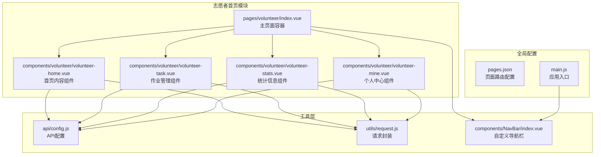
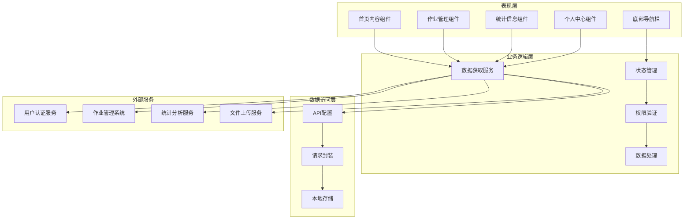
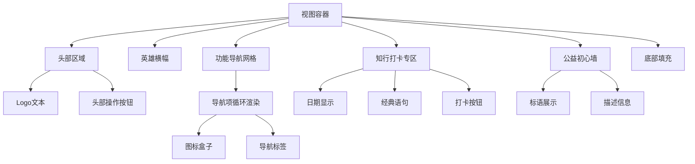
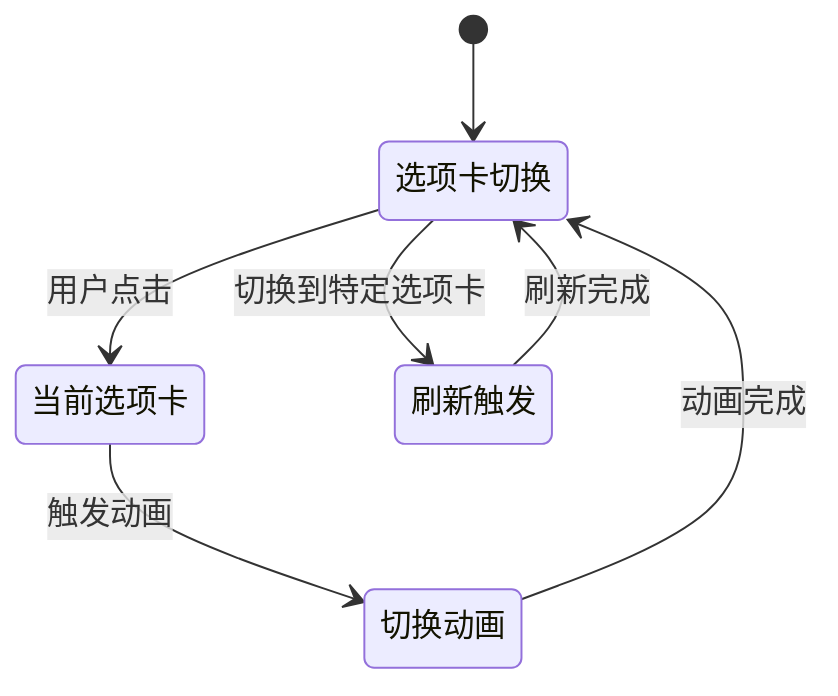
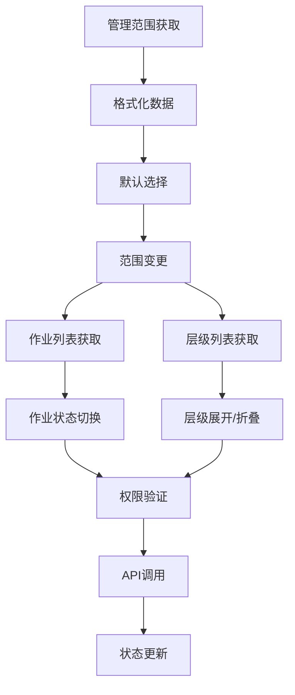
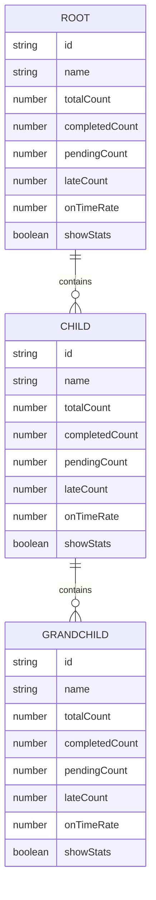
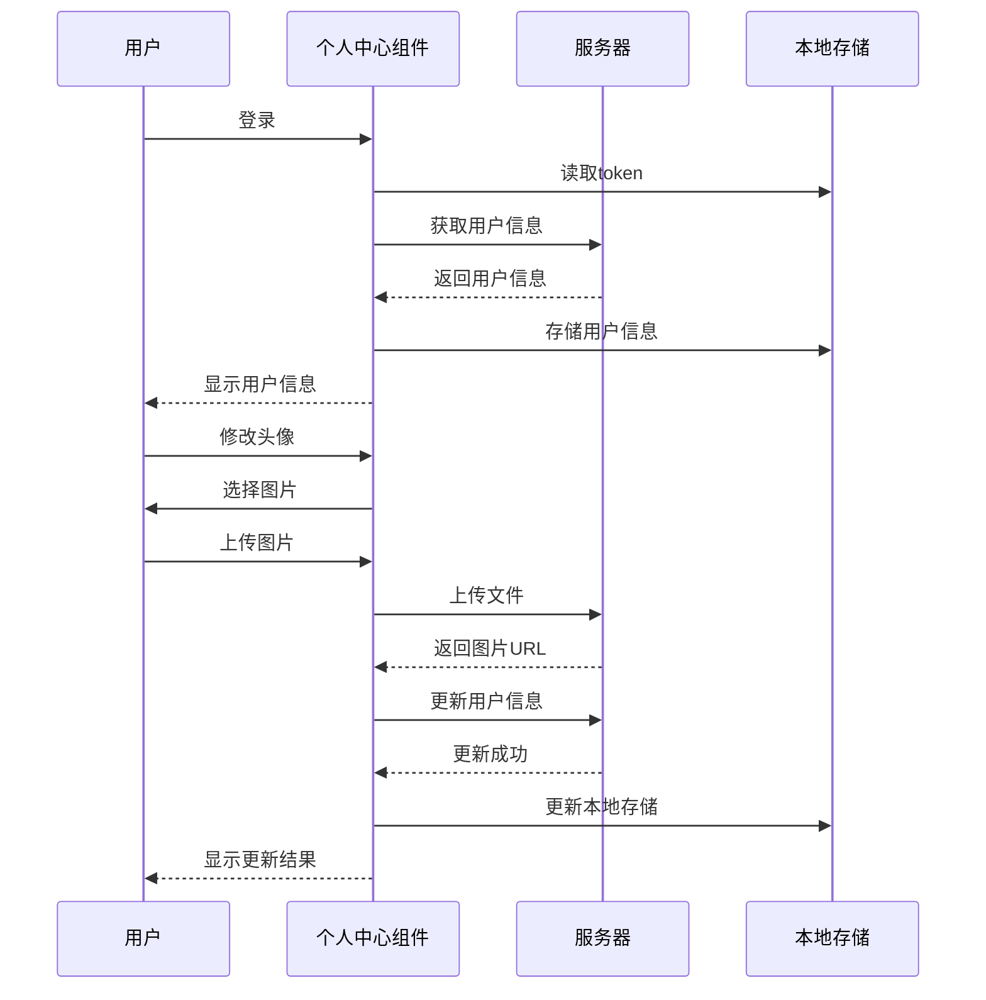
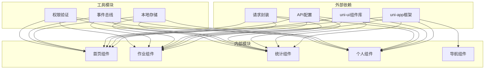

# 志愿者首页

<cite>
**本文档引用的文件**
- [volunteer-home.vue](file://components/volunteer/volunteer-home.vue)
- [index.vue](file://pages/volunteer/index.vue)
- [volunteer-task.vue](file://components/volunteer/volunteer-task.vue)
- [volunteer-stats.vue](file://components/volunteer/volunteer-stats.vue)
- [volunteer-mine.vue](file://components/volunteer/volunteer-mine.vue)
- [config.js](file://api/config.js)
- [request.js](file://utils/request.js)
- [pages.json](file://pages.json)
- [main.js](file://main.js)
- [index.vue](file://components/NavBar/index.vue)
</cite>

## 目录
1. [简介](#简介)
2. [项目结构](#项目结构)
3. [核心组件](#核心组件)
4. [架构概览](#架构概览)
5. [详细组件分析](#详细组件分析)
6. [依赖关系分析](#依赖关系分析)
7. [性能考虑](#性能考虑)
8. [故障排除指南](#故障排除指南)
9. [结论](#结论)

## 简介

志愿者首页模块是致良知教育小程序的重要组成部分，为志愿者用户提供了一个功能丰富、界面友好的主页面。该模块采用模块化设计，集成了导航栏、功能导航、打卡系统、统计信息展示等多个核心功能，为志愿者提供了完整的操作入口和信息展示平台。

## 项目结构

志愿者首页模块位于小程序项目的components目录下，采用组件化的架构设计。整个模块由多个相互协作的组件组成，形成了一个完整的志愿者工作台。

**图表来源**
- [index.vue:1-210](file://pages/volunteer/index.vue#L1-L210)
- [volunteer-home.vue:1-404](file://components/volunteer/volunteer-home.vue#L1-L404)
- [volunteer-task.vue:1-800](file://components/volunteer/volunteer-task.vue#L1-L800)
- [volunteer-stats.vue:1-713](file://components/volunteer/volunteer-stats.vue#L1-L713)
- [volunteer-mine.vue:1-811](file://components/volunteer/volunteer-mine.vue#L1-L811)

**章节来源**
- [index.vue:1-210](file://pages/volunteer/index.vue#L1-L210)
- [pages.json:1-131](file://pages.json#L1-L131)

## 核心组件

### 主页面容器组件

主页面容器组件作为整个志愿者首页的根组件，负责管理底部导航栏、页面切换逻辑以及与其他子组件的通信协调。

### 首页内容组件

首页内容组件是志愿者首页的核心展示区域，包含顶部导航栏、英雄横幅、功能导航网格、知行打卡专区和公益初心墙等主要功能模块。

### 作业管理组件

作业管理组件提供志愿者作业管理功能，包括作业列表查看、优秀作业标记、层级管理等功能，支持多种管理范围的作业统计和管理。

### 统计信息组件

统计信息组件专注于展示志愿者相关的统计数据，提供层级化的统计视图，支持按不同管理范围和日期进行数据筛选。

### 个人中心组件

个人中心组件提供用户个人信息管理、身份切换、统计信息展示等功能，是志愿者个人操作的主要入口。

**章节来源**
- [volunteer-home.vue:64-148](file://components/volunteer/volunteer-home.vue#L64-L148)
- [index.vue:50-106](file://pages/volunteer/index.vue#L50-L106)

## 架构概览

志愿者首页模块采用了清晰的分层架构设计，实现了关注点分离和模块化管理。

**图表来源**
- [volunteer-home.vue:1-404](file://components/volunteer/volunteer-home.vue#L1-L404)
- [volunteer-task.vue:172-614](file://components/volunteer/volunteer-task.vue#L172-L614)
- [volunteer-stats.vue:208-399](file://components/volunteer/volunteer-stats.vue#L208-L399)
- [volunteer-mine.vue:103-595](file://components/volunteer/volunteer-mine.vue#L103-L595)

## 详细组件分析

### 首页内容组件分析

首页内容组件是志愿者首页的核心展示区域，采用了现代化的设计理念和丰富的交互效果。

#### 布局结构设计

首页采用垂直布局设计，通过flexbox实现内容的自适应排列。整体布局分为三个主要部分：顶部导航区域、主要内容区域和底部填充区域。

**图表来源**
- [volunteer-home.vue:1-61](file://components/volunteer/volunteer-home.vue#L1-L61)

#### 数据加载机制

首页内容组件实现了完整的数据加载和状态管理机制：

1. **初始化流程**：组件挂载时自动执行日期初始化和打卡状态初始化
2. **本地存储管理**：使用uni.getStorageSync进行数据持久化存储
3. **状态同步**：通过computed属性实现数据的实时更新

#### 交互设计实现

组件实现了丰富的交互效果，包括：

- **导航点击处理**：统一的导航点击处理函数，支持页面跳转和错误处理
- **动画效果**：使用CSS3动画实现流畅的过渡效果
- **响应式设计**：适配不同屏幕尺寸的设备

**章节来源**
- [volunteer-home.vue:64-148](file://components/volunteer/volunteer-home.vue#L64-L148)

### 底部导航栏组件分析

底部导航栏组件提供了统一的页面导航体验，支持标签切换和视觉反馈。

#### 导航状态管理

底部导航栏实现了完整的状态管理机制：

**图表来源**
- [index.vue:97-104](file://pages/volunteer/index.vue#L97-L104)

#### 动画效果设计

导航栏实现了多层次的动画效果：

- **标签切换动画**：使用bounce动画效果增强交互体验
- **发光效果**：当前激活标签的发光动画
- **渐变过渡**：标签文字的颜色渐变效果

**章节来源**
- [index.vue:11-40](file://pages/volunteer/index.vue#L11-L40)

### 作业管理组件分析

作业管理组件提供了完整的作业管理功能，支持多种管理范围和权限级别。

#### 管理范围选择机制

组件实现了灵活的管理范围选择机制：

**图表来源**
- [volunteer-task.vue:232-479](file://components/volunteer/volunteer-task.vue#L232-L479)

#### 权限验证机制

作业管理组件实现了严格的权限验证机制：

- **角色权限检查**：根据不同的职责类型提供相应的操作权限
- **状态权限验证**：确保操作的合法性和数据的完整性
- **实时权限更新**：通过事件机制实现权限状态的实时同步

**章节来源**
- [volunteer-task.vue:481-596](file://components/volunteer/volunteer-task.vue#L481-L596)

### 统计信息组件分析

统计信息组件提供了层级化的统计视图，支持复杂的统计数据分析。

#### 数据结构设计

统计信息组件采用了层级化的数据结构设计：

**图表来源**
- [volunteer-stats.vue:366-382](file://components/volunteer/volunteer-stats.vue#L366-L382)

#### 统计计算逻辑

组件实现了完整的统计计算逻辑：

- **完成率计算**：基于完成数量和总数量计算按时完成率
- **状态分类**：区分准时、未交、迟交等不同状态
- **层级聚合**：支持多层级的数据聚合和统计

**章节来源**
- [volunteer-stats.vue:325-364](file://components/volunteer/volunteer-stats.vue#L325-L364)

### 个人中心组件分析

个人中心组件提供了完整的用户信息管理和身份切换功能。

#### 用户信息管理

个人中心组件实现了完善的用户信息管理机制：

**图表来源**
- [volunteer-mine.vue:301-452](file://components/volunteer/volunteer-mine.vue#L301-L452)

#### 身份切换机制

个人中心组件实现了灵活的身份切换机制：

- **身份验证**：支持志愿者端和学员端的双向切换
- **权限同步**：切换身份时同步更新权限状态
- **页面跳转**：根据身份切换自动跳转到相应页面

**章节来源**
- [volunteer-mine.vue:525-574](file://components/volunteer/volunteer-mine.vue#L525-L574)

## 依赖关系分析

志愿者首页模块的依赖关系体现了清晰的模块化设计原则。

**图表来源**
- [config.js:8-57](file://api/config.js#L8-L57)
- [request.js:7-67](file://utils/request.js#L7-L67)

### 组件间通信机制

模块内部实现了多种组件间通信机制：

1. **事件总线通信**：使用uni.$on和uni.$emit实现组件间的松耦合通信
2. **数据传递**：通过props和events实现父子组件的数据传递
3. **状态共享**：通过本地存储实现跨组件的状态共享

**章节来源**
- [index.vue:85-95](file://pages/volunteer/index.vue#L85-L95)
- [volunteer-task.vue:205-212](file://components/volunteer/volunteer-task.vue#L205-L212)
- [volunteer-stats.vue:229-236](file://components/volunteer/volunteer-stats.vue#L229-L236)

## 性能考虑

志愿者首页模块在设计时充分考虑了性能优化，采用了多种优化策略来提升用户体验。

### 数据加载优化

1. **懒加载策略**：非首页组件采用懒加载方式，减少初始加载时间
2. **缓存机制**：合理使用本地存储缓存常用数据
3. **请求合并**：对相似的请求进行合并处理

### 渲染性能优化

1. **虚拟滚动**：对于大量数据的列表采用虚拟滚动技术
2. **防抖节流**：对频繁触发的操作进行防抖节流处理
3. **组件复用**：通过组件复用减少DOM节点数量

### 网络请求优化

1. **请求缓存**：对静态数据进行请求缓存
2. **并发控制**：限制同时进行的网络请求数量
3. **错误重试**：实现智能的错误重试机制

## 故障排除指南

### 常见问题及解决方案

#### 登录状态异常

**问题描述**：用户登录后无法正常访问功能页面

**解决方案**：
1. 检查token的有效性
2. 验证用户身份状态
3. 清除本地缓存后重新登录

#### 数据加载失败

**问题描述**：页面数据无法正常加载

**解决方案**：
1. 检查网络连接状态
2. 验证API接口可用性
3. 查看控制台错误信息

#### 权限验证失败

**问题描述**：用户权限验证不通过

**解决方案**：
1. 检查用户角色状态
2. 验证管理范围权限
3. 重新获取权限信息

**章节来源**
- [request.js:29-54](file://utils/request.js#L29-L54)
- [volunteer-mine.vue:241-296](file://components/volunteer/volunteer-mine.vue#L241-L296)

## 结论

志愿者首页模块是一个设计精良、功能完备的移动端应用模块。通过采用模块化设计、清晰的架构层次和完善的交互机制，为志愿者用户提供了优质的使用体验。

模块的主要优势包括：

1. **模块化设计**：各组件职责明确，便于维护和扩展
2. **用户体验优化**：丰富的动画效果和流畅的交互体验
3. **权限管理完善**：严格的权限验证和身份切换机制
4. **数据处理能力强**：支持复杂的数据统计和分析功能
5. **性能优化到位**：采用多种优化策略提升应用性能

未来可以进一步优化的方向包括：

1. **代码重构**：对重复代码进行抽象和重构
2. **测试覆盖**：增加单元测试和集成测试
3. **监控完善**：添加应用性能监控和错误追踪
4. **文档完善**：补充详细的开发文档和技术规范