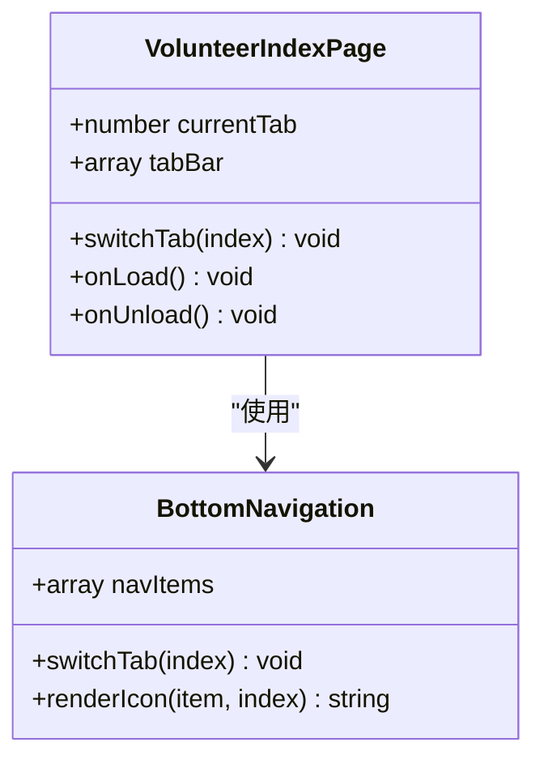
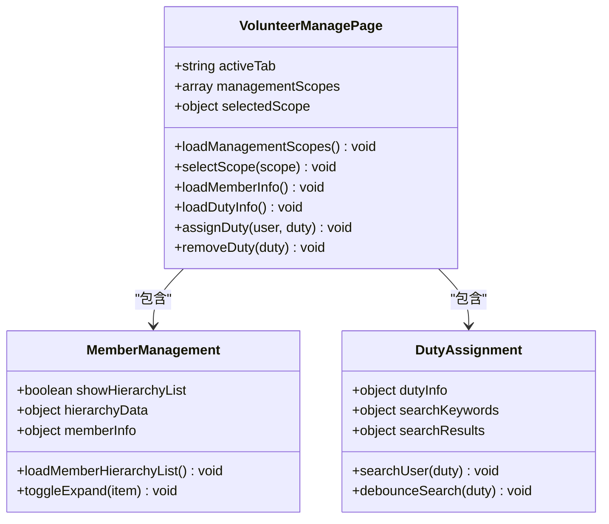
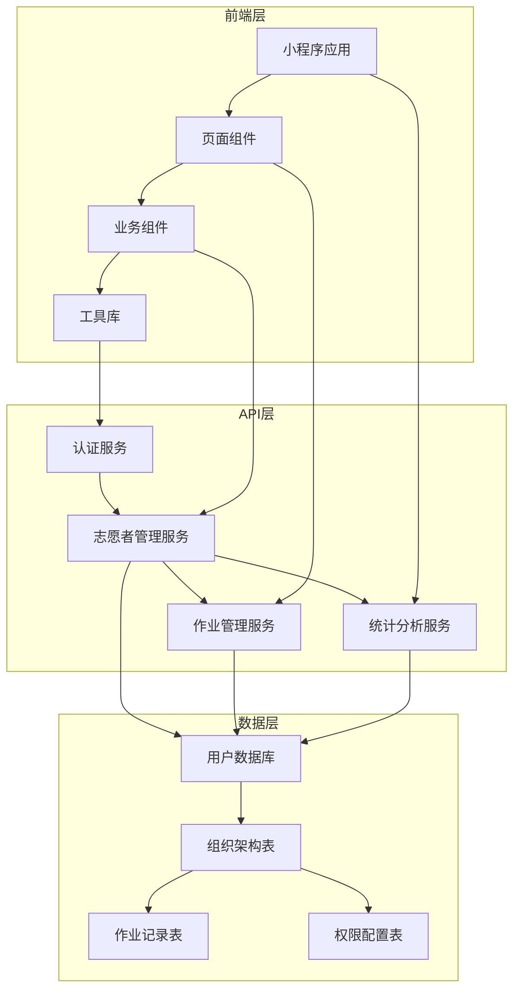
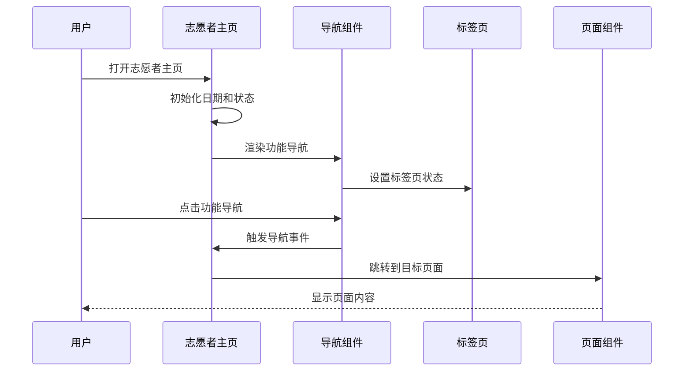
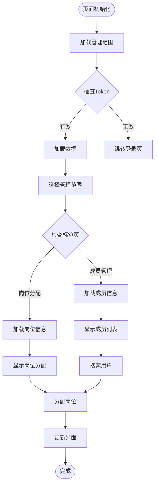
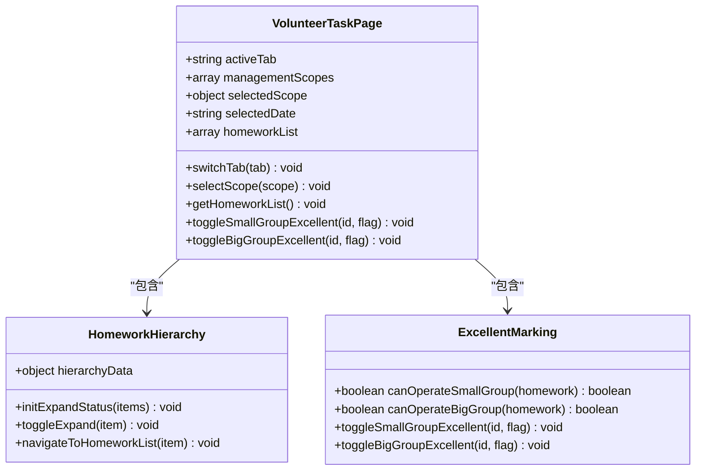
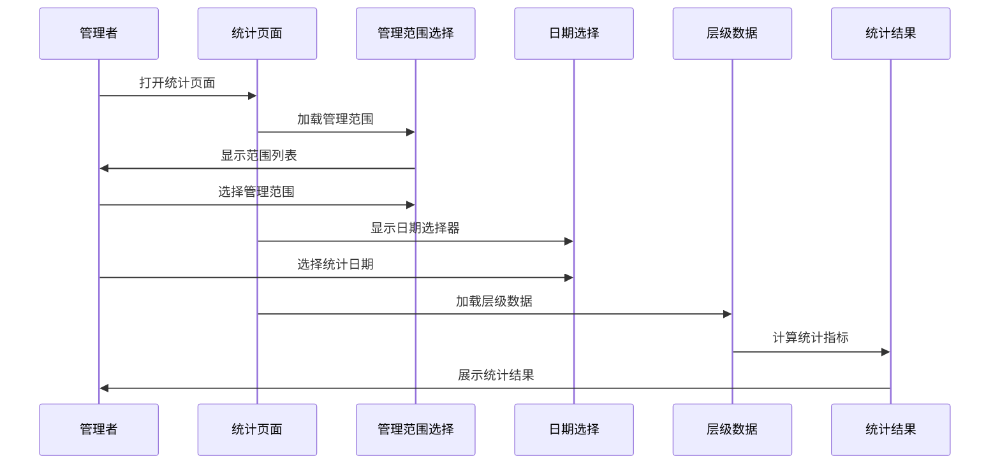
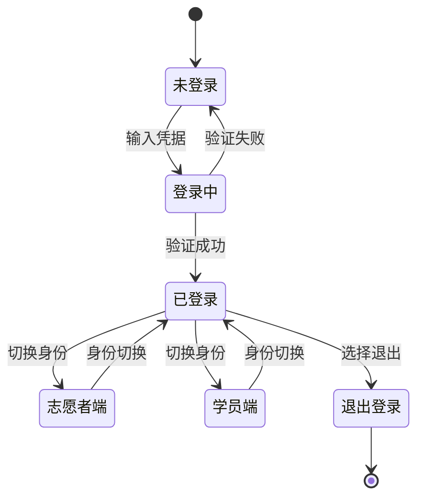
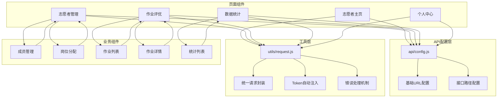

# 志愿者管理功能

<cite>
**本文引用的文件**
- [pages/volunteer/index.vue](file://pages/volunteer/index.vue)
- [pages/volunteer-manage/volunteer-manage.vue](file://pages/volunteer-manage/volunteer-manage.vue)
- [pages/volunteer-manage/member-list.vue](file://pages/volunteer-manage/member-list.vue)
- [components/volunteer/volunteer-home.vue](file://components/volunteer/volunteer-home.vue)
- [components/volunteer/volunteer-mine.vue](file://components/volunteer/volunteer-mine.vue)
- [components/volunteer/volunteer-stats.vue](file://components/volunteer/volunteer-stats.vue)
- [components/volunteer/volunteer-task.vue](file://components/volunteer/volunteer-task.vue)
- [pages/volunteer/homework/homework-list.vue](file://pages/volunteer/homework/homework-list.vue)
- [pages/volunteer/homework/detail.vue](file://pages/volunteer/homework/detail.vue)
- [pages/volunteer/homework/statslist.vue](file://pages/volunteer/homework/statslist.vue)
- [pages/volunteer-history/volunteer-history.vue](file://pages/volunteer-history/volunteer-history.vue)
- [api/config.js](file://api/config.js)
- [utils/request.js](file://utils/request.js)
</cite>

## 目录
1. [简介](#简介)
2. [项目结构](#项目结构)
3. [核心组件](#核心组件)
4. [架构概览](#架构概览)
5. [详细组件分析](#详细组件分析)
6. [依赖关系分析](#依赖关系分析)
7. [性能考虑](#性能考虑)
8. [故障排除指南](#故障排除指南)
9. [结论](#结论)
10. [附录](#附录)

## 简介

致良知教育项目的志愿者管理系统是一个基于小程序框架构建的综合性志愿者管理平台。该系统围绕"知行合一"的理念，为志愿者提供了一个完整的管理、协作和成长平台。系统不仅实现了传统的志愿者信息管理功能，还融入了致良知教育的核心价值观，通过"知行打卡"、"公益初心墙"等特色功能，强化志愿者的内在修养和实践能力。

该系统主要服务于以下目标：
- **志愿者信息管理**：提供完整的志愿者档案管理、状态跟踪和权限控制
- **组织架构管理**：支持多层次的组织架构，包括营期、班级、大组、小组等层级
- **作业评优体系**：建立科学的作业评价和激励机制
- **数据统计分析**：提供多维度的数据统计和可视化展示
- **权限分级控制**：基于角色的精细化权限管理

## 项目结构

项目采用模块化的目录结构，按照功能域进行划分，形成了清晰的功能边界和职责分离：

```mermaid
graph TB
subgraph "页面层"
A[pages/volunteer/] -- 志愿者主页面
B[pages/volunteer-manage/] -- 志愿者管理页面
C[pages/volunteer-history/] -- 担当历史页面
D[pages/volunteer/homework/] -- 作业管理页面
end
subgraph "组件层"
E[components/volunteer/] -- 志愿者功能组件
F[components/NavBar/] -- 导航组件
end
subgraph "工具层"
G[api/config.js] -- API配置
H[utils/request.js] -- 请求封装
end
subgraph "静态资源"
I[static/icons/] -- 图标资源
J[小程序模板样式/] -- 样式模板
end
A --> E
B --> E
D --> E
A --> G
B --> G
E --> G
E --> H
```

**图表来源**
- [pages/volunteer/index.vue:1-210](file://pages/volunteer/index.vue#L1-L210)
- [pages/volunteer-manage/volunteer-manage.vue:1-800](file://pages/volunteer-manage/volunteer-manage.vue#L1-L800)
- [api/config.js:1-60](file://api/config.js#L1-L60)

**章节来源**
- [pages/volunteer/index.vue:1-210](file://pages/volunteer/index.vue#L1-L210)
- [pages/volunteer-manage/volunteer-manage.vue:1-800](file://pages/volunteer-manage/volunteer-manage.vue#L1-L800)
- [api/config.js:1-60](file://api/config.js#L1-L60)

## 核心组件

### 志愿者主页面组件

志愿者主页面是整个系统的入口，提供了统一的功能导航和状态展示。该组件采用了响应式设计，支持多种屏幕尺寸，并集成了致良知教育的品牌元素。



**图表来源**
- [pages/volunteer/index.vue:44-106](file://pages/volunteer/index.vue#L44-L106)

### 志愿者管理组件

志愿者管理组件是系统的核心功能模块，提供了完整的志愿者管理能力。该组件支持多种管理场景，包括成员管理、岗位分配、权限控制等。



**图表来源**
- [pages/volunteer-manage/volunteer-manage.vue:238-732](file://pages/volunteer-manage/volunteer-manage.vue#L238-L732)

**章节来源**
- [pages/volunteer/index.vue:44-106](file://pages/volunteer/index.vue#L44-L106)
- [pages/volunteer-manage/volunteer-manage.vue:238-732](file://pages/volunteer-manage/volunteer-manage.vue#L238-L732)

## 架构概览

系统采用前后端分离的架构设计，前端使用小程序框架，后端提供RESTful API服务。整体架构体现了高内聚、低耦合的设计原则。



**图表来源**
- [api/config.js:8-57](file://api/config.js#L8-L57)
- [utils/request.js:7-67](file://utils/request.js#L7-L67)

系统的核心设计理念体现在以下几个方面：

1. **权限分级管理**：基于角色的精细化权限控制，确保不同角色只能访问相应的功能模块
2. **组织架构扁平化**：支持多层次的组织架构，便于志愿者的层级管理和任务分配
3. **数据驱动决策**：通过丰富的数据统计和分析功能，为管理决策提供支持
4. **用户体验优化**：注重界面设计和交互体验，提升志愿者的工作效率

**章节来源**
- [api/config.js:8-57](file://api/config.js#L8-L57)
- [utils/request.js:7-67](file://utils/request.js#L7-L67)

## 详细组件分析

### 志愿者主页组件分析

志愿者主页组件是整个系统的门户，承担着品牌展示和功能导航的重要作用。该组件充分体现了致良知教育的文化特色，通过视觉设计传达核心价值理念。



**图表来源**
- [components/volunteer/volunteer-home.vue:64-148](file://components/volunteer/volunteer-home.vue#L64-L148)

该组件的主要特点包括：

- **品牌文化融合**：通过"良知"印章、红色主题等设计元素，体现致良知教育的品牌特色
- **功能导航清晰**：提供"担当过往"、"管理成员"、"志愿证书"、"群聊"等功能入口
- **互动体验丰富**：包含知行打卡功能，鼓励志愿者进行日常实践和反思

**章节来源**
- [components/volunteer/volunteer-home.vue:64-148](file://components/volunteer/volunteer-home.vue#L64-L148)

### 志愿者管理页面分析

志愿者管理页面是系统的核心功能模块，提供了完整的志愿者管理能力。该页面采用双标签页设计，分别处理成员管理和岗位分配两大核心功能。



**图表来源**
- [pages/volunteer-manage/volunteer-manage.vue:284-732](file://pages/volunteer-manage/volunteer-manage.vue#L284-L732)

该组件的关键功能包括：

1. **管理范围选择**：支持按营期、班级、大组、小组等不同层级进行管理范围的选择
2. **成员信息展示**：提供层级化的成员信息展示，支持展开/折叠操作
3. **岗位分配管理**：支持岗位的搜索、分配和移除操作
4. **权限控制机制**：基于角色的权限控制，确保操作的安全性

**章节来源**
- [pages/volunteer-manage/volunteer-manage.vue:284-732](file://pages/volunteer-manage/volunteer-manage.vue#L284-L732)

### 作业评优组件分析

作业评优组件是志愿者管理系统的重要组成部分，建立了完善的作业评价和激励机制。该组件支持多层次的作业管理，从小组到大组，形成完整的评价体系。



**图表来源**
- [components/volunteer/volunteer-task.vue:175-613](file://components/volunteer/volunteer-task.vue#L175-L613)

该组件的特色功能包括：

- **多层次评价体系**：支持小组优秀和大组优秀的双重评价机制
- **权限分级控制**：不同角色具有不同的操作权限，确保评价的公正性
- **实时状态更新**：操作完成后能够实时更新界面状态
- **详细的操作记录**：提供完整的作业提交和评价记录

**章节来源**
- [components/volunteer/volunteer-task.vue:175-613](file://components/volunteer/volunteer-task.vue#L175-L613)

### 数据统计组件分析

数据统计组件为管理者提供了全面的数据分析和可视化展示功能。该组件支持按不同层级和时间段进行数据统计，帮助管理者更好地了解志愿者的工作情况。



**图表来源**
- [components/volunteer/volunteer-stats.vue:209-399](file://components/volunteer/volunteer-stats.vue#L209-L399)

该组件的核心功能包括：

- **多层级统计**：支持从营期到小组的多层级数据统计
- **动态筛选**：支持按日期、层级等条件进行动态筛选
- **可视化展示**：提供直观的统计图表和数据展示
- **详细名单**：支持查看每个层级的详细人员名单

**章节来源**
- [components/volunteer/volunteer-stats.vue:209-399](file://components/volunteer/volunteer-stats.vue#L209-L399)

### 个人中心组件分析

个人中心组件为志愿者提供了个人信息管理和身份切换功能。该组件体现了致良知教育"知行合一"的理念，通过个人反思和成长记录，促进志愿者的自我提升。



**图表来源**
- [components/volunteer/volunteer-mine.vue:106-594](file://components/volunteer/volunteer-mine.vue#L106-L594)

该组件的主要功能包括：

- **身份管理**：支持志愿者端和学员端的身份切换
- **个人信息维护**：提供头像、昵称等个人信息的编辑功能
- **统计信息展示**：展示志愿者参与的各项统计信息
- **系统设置**：提供系统设置和退出登录功能

**章节来源**
- [components/volunteer/volunteer-mine.vue:106-594](file://components/volunteer/volunteer-mine.vue#L106-L594)

## 依赖关系分析

系统各组件之间的依赖关系体现了清晰的层次结构和职责分工。前端组件通过API配置文件统一管理后端接口，通过请求封装工具实现统一的网络请求处理。



**图表来源**
- [api/config.js:8-57](file://api/config.js#L8-L57)
- [utils/request.js:7-67](file://utils/request.js#L7-L67)

### 关键依赖特性

1. **集中式API配置**：所有后端接口通过统一的配置文件管理，便于维护和扩展
2. **统一请求处理**：通过请求封装工具实现统一的网络请求处理，包括Token管理、错误处理等
3. **组件间通信**：通过事件总线实现组件间的解耦通信，支持跨组件的数据传递
4. **权限控制集成**：权限验证逻辑集成在请求封装中，确保所有API调用都经过权限验证

**章节来源**
- [api/config.js:8-57](file://api/config.js#L8-L57)
- [utils/request.js:7-67](file://utils/request.js#L7-L67)

## 性能考虑

系统在设计时充分考虑了性能优化，采用了多种策略来提升用户体验和系统稳定性：

### 数据加载优化

- **懒加载机制**：页面组件采用懒加载策略，只有在需要时才加载相关数据
- **缓存策略**：对常用数据进行本地缓存，减少重复请求
- **分页加载**：对于大量数据的列表，采用分页加载方式，避免一次性加载过多数据

### 网络请求优化

- **请求合并**：对频繁的相似请求进行合并处理
- **防抖机制**：对搜索等高频操作采用防抖机制，减少不必要的请求
- **超时处理**：设置合理的请求超时时间，避免长时间等待

### 内存管理

- **组件销毁**：及时清理事件监听器和定时器，防止内存泄漏
- **数据清理**：在页面切换时清理不需要的数据，释放内存空间

## 故障排除指南

### 常见问题及解决方案

#### 登录相关问题

**问题**：用户登录后无法访问某些功能
**原因**：Token过期或权限不足
**解决方案**：
1. 检查Token的有效期
2. 验证用户的权限级别
3. 重新登录获取新的Token

#### 数据加载失败

**问题**：页面数据无法正常加载
**原因**：网络连接异常或API接口错误
**解决方案**：
1. 检查网络连接状态
2. 验证API接口的可用性
3. 查看控制台错误信息

#### 权限控制问题

**问题**：用户无法执行某些操作
**原因**：角色权限不足或权限配置错误
**解决方案**：
1. 检查用户的角色配置
2. 验证操作的权限要求
3. 更新权限配置

**章节来源**
- [utils/request.js:24-67](file://utils/request.js#L24-L67)

### 调试技巧

1. **控制台调试**：利用浏览器开发者工具查看网络请求和JavaScript错误
2. **日志记录**：在关键节点添加日志输出，便于问题定位
3. **状态监控**：监控组件的状态变化，及时发现异常情况

## 结论

致良知教育志愿者管理系统是一个设计精良、功能完备的综合性管理平台。系统不仅满足了志愿者管理的基本需求，更重要的是融入了致良知教育的核心理念，通过技术手段传承和发扬传统文化。

### 主要优势

1. **设计理念先进**：系统体现了"知行合一"的理念，将理论与实践相结合
2. **功能完整性**：涵盖了志愿者管理的各个方面，从信息管理到数据分析
3. **用户体验优秀**：界面设计美观，操作流程简洁，符合用户习惯
4. **技术架构合理**：采用模块化设计，便于维护和扩展

### 改进建议

1. **增强移动端适配**：进一步优化移动端的交互体验
2. **完善通知机制**：增加消息推送和提醒功能
3. **扩展统计维度**：增加更多维度的数据分析功能
4. **优化性能表现**：针对大数据量场景进行性能优化

该系统为致良知教育项目的志愿者管理工作提供了强有力的技术支撑，有助于提升志愿者管理的效率和质量，推动项目的可持续发展。

## 附录

### API接口规范

系统通过统一的API配置文件管理所有后端接口，确保前后端的一致性和可维护性。

### 开发规范

- **代码风格**：遵循Vue.js的最佳实践和编码规范
- **命名约定**：采用语义化的变量和函数命名
- **注释规范**：为复杂逻辑添加详细的注释说明
- **错误处理**：统一的错误处理机制和用户提示

### 部署指南

系统支持多种部署方式，包括本地开发环境、测试环境和生产环境。部署时需要注意环境变量的配置和API地址的正确设置。