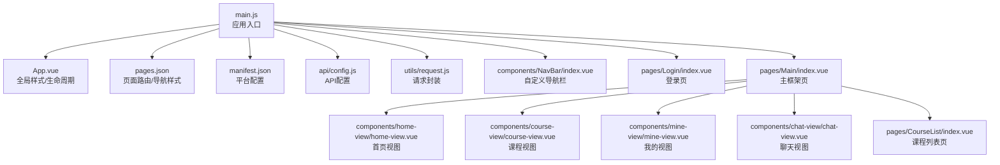
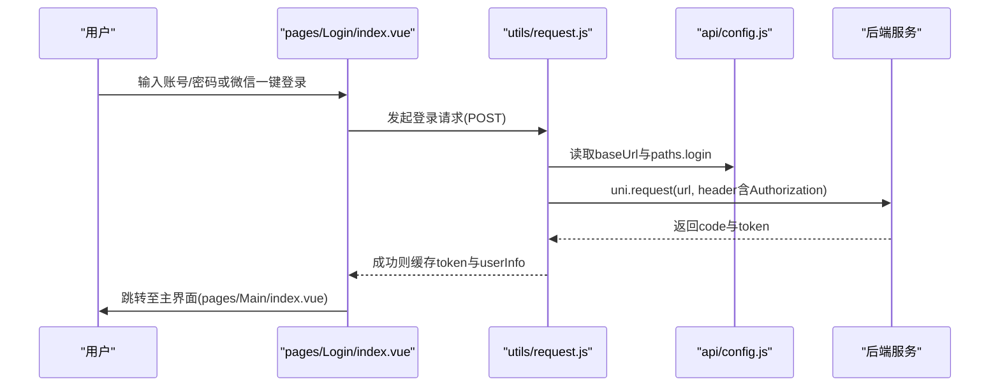
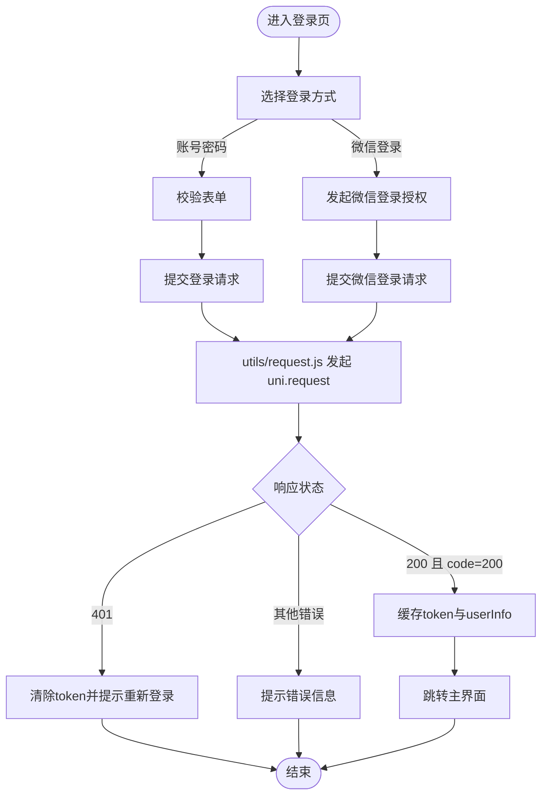
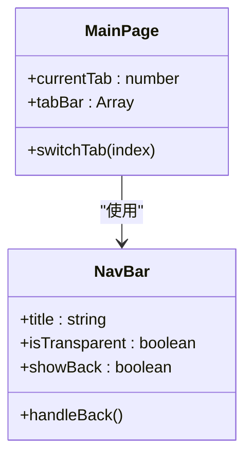
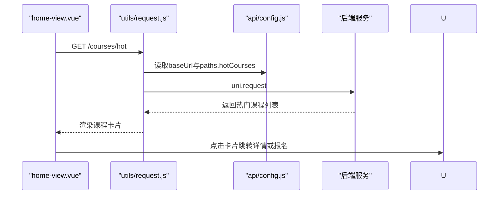
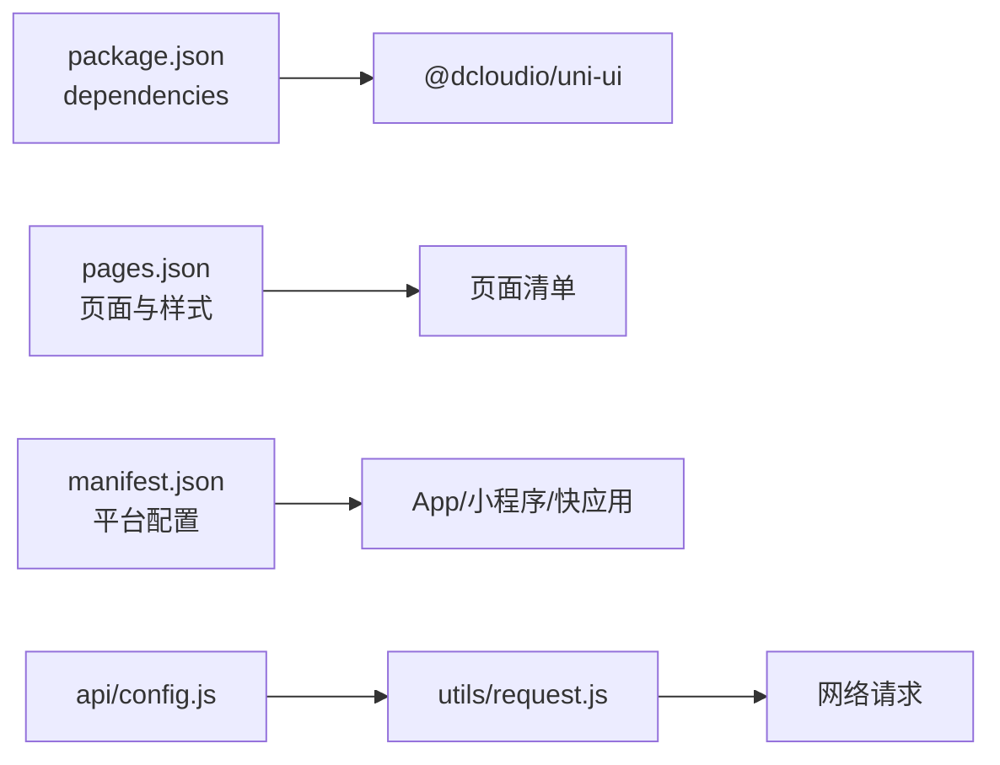

# 快速开始

<cite>
**本文引用的文件**
- [package.json](file://package.json)
- [manifest.json](file://manifest.json)
- [main.js](file://main.js)
- [pages.json](file://pages.json)
- [App.vue](file://App.vue)
- [api/config.js](file://api/config.js)
- [utils/request.js](file://utils/request.js)
- [components/NavBar/index.vue](file://components/NavBar/index.vue)
- [components/home-view/home-view.vue](file://components/home-view/home-view.vue)
- [components/course-view/course-view.vue](file://components/course-view/course-view.vue)
- [components/mine-view/mine-view.vue](file://components/mine-view/mine-view.vue)
- [components/chat-view/chat-view.vue](file://components/chat-view/chat-view.vue)
- [pages/Login/index.vue](file://pages/Login/index.vue)
- [pages/Main/index.vue](file://pages/Main/index.vue)
- [pages/CourseList/index.vue](file://pages/CourseList/index.vue)
</cite>

## 目录
1. [简介](#简介)
2. [项目结构](#项目结构)
3. [核心组件](#核心组件)
4. [架构总览](#架构总览)
5. [详细组件分析](#详细组件分析)
6. [依赖关系分析](#依赖关系分析)
7. [性能考虑](#性能考虑)
8. [故障排除指南](#故障排除指南)
9. [结论](#结论)
10. [附录](#附录)

## 简介
本指南面向首次接触致良知教育项目的开发者，帮助你在最短时间内完成开发环境准备、依赖安装、本地调试与首次运行验证。项目基于 uni-app/Vue 3 技术栈，支持多端运行（H5、小程序、App），并提供统一的 API 配置与请求封装。

## 项目结构
项目采用 uni-app 标准目录组织，关键目录与文件如下：
- 根目录：入口与配置
  - main.js：应用入口与全局组件注册
  - App.vue：全局样式与生命周期
  - pages.json：页面路由与导航样式
  - manifest.json：应用与平台配置
  - package.json：依赖声明
- 页面与组件
  - pages：页面级组件（如 Login、Main、CourseList 等）
  - components：可复用组件（如 NavBar、home-view、course-view、mine-view、chat-view）
- 工具与配置
  - api/config.js：API 基础地址与接口路径
  - utils/request.js：统一请求封装与鉴权

图表来源
- [main.js:1-26](file://main.js#L1-L26)
- [App.vue:1-40](file://App.vue#L1-L40)
- [pages.json:1-131](file://pages.json#L1-L131)
- [manifest.json:1-73](file://manifest.json#L1-L73)
- [api/config.js:1-60](file://api/config.js#L1-L60)
- [utils/request.js:1-98](file://utils/request.js#L1-L98)
- [components/NavBar/index.vue:1-68](file://components/NavBar/index.vue#L1-L68)
- [pages/Login/index.vue:1-900](file://pages/Login/index.vue#L1-L900)
- [pages/Main/index.vue:1-224](file://pages/Main/index.vue#L1-L224)
- [components/home-view/home-view.vue:1-772](file://components/home-view/home-view.vue#L1-L772)
- [components/course-view/course-view.vue:1-496](file://components/course-view/course-view.vue#L1-L496)
- [components/mine-view/mine-view.vue:1-910](file://components/mine-view/mine-view.vue#L1-L910)
- [components/chat-view/chat-view.vue:1-156](file://components/chat-view/chat-view.vue#L1-L156)
- [pages/CourseList/index.vue:1-433](file://pages/CourseList/index.vue#L1-L433)

章节来源
- [main.js:1-26](file://main.js#L1-L26)
- [App.vue:1-40](file://App.vue#L1-L40)
- [pages.json:1-131](file://pages.json#L1-L131)
- [manifest.json:1-73](file://manifest.json#L1-L73)
- [package.json:1-6](file://package.json#L1-L6)

## 核心组件
- 应用入口与全局注册
  - main.js 中注册全局组件 NavBar，并按 Vue 版本条件导出 createApp
- 全局样式与主题
  - App.vue 定义品牌色与全局卡片样式，统一页面背景
- 页面路由与导航
  - pages.json 配置页面列表、导航样式与全局样式
- API 配置与请求封装
  - api/config.js 提供 baseUrl 与接口路径
  - utils/request.js 统一注入 Authorization、处理 401 与网络异常

章节来源
- [main.js:14-26](file://main.js#L14-L26)
- [App.vue:15-40](file://App.vue#L15-L40)
- [pages.json:1-131](file://pages.json#L1-L131)
- [api/config.js:1-60](file://api/config.js#L1-L60)
- [utils/request.js:1-98](file://utils/request.js#L1-L98)

## 架构总览
下图展示从登录到主界面的典型交互流程，以及 API 请求与鉴权的关键节点。

图表来源
- [pages/Login/index.vue:196-282](file://pages/Login/index.vue#L196-L282)
- [utils/request.js:7-67](file://utils/request.js#L7-L67)
- [api/config.js:8-56](file://api/config.js#L8-L56)

## 详细组件分析

### 登录与认证流程
- 登录页
  - 支持账号密码登录与微信一键登录
  - 登录成功后缓存 token 与用户信息，跳转主界面
- 请求封装
  - 自动从本地存储读取 token 并注入 Authorization
  - 统一处理 401 未授权与 HTTP 错误码
- API 配置
  - 开发环境默认指向本地后端地址，可按需切换云端 Mock

图表来源
- [pages/Login/index.vue:177-282](file://pages/Login/index.vue#L177-L282)
- [utils/request.js:7-67](file://utils/request.js#L7-L67)
- [api/config.js:8-56](file://api/config.js#L8-L56)

章节来源
- [pages/Login/index.vue:177-452](file://pages/Login/index.vue#L177-L452)
- [utils/request.js:1-98](file://utils/request.js#L1-L98)
- [api/config.js:1-60](file://api/config.js#L1-L60)

### 主界面与底部导航
- 主界面负责承载首页、课程、我的、聊天四个视图，并通过底部导航切换
- 底部导航组件 NavBar 提供统一的返回与标题样式

图表来源
- [pages/Main/index.vue:52-115](file://pages/Main/index.vue#L52-L115)
- [components/NavBar/index.vue:23-48](file://components/NavBar/index.vue#L23-L48)

章节来源
- [pages/Main/index.vue:1-224](file://pages/Main/index.vue#L1-L224)
- [components/NavBar/index.vue:1-68](file://components/NavBar/index.vue#L1-L68)

### 首页与课程列表
- 首页视图加载热门课程并支持跳转详情或报名
- 课程列表页支持分页加载与状态判断（未开营/进行中/已结营）

图表来源
- [components/home-view/home-view.vue:218-261](file://components/home-view/home-view.vue#L218-L261)
- [utils/request.js:72-79](file://utils/request.js#L72-L79)
- [api/config.js:26-27](file://api/config.js#L26-L27)

章节来源
- [components/home-view/home-view.vue:1-772](file://components/home-view/home-view.vue#L1-L772)
- [pages/CourseList/index.vue:198-252](file://pages/CourseList/index.vue#L198-L252)

### 我的视图与身份切换
- 读取本地用户信息与 token，支持身份切换（学员端/志愿者端）
- 退出登录时清理缓存并跳转登录页

章节来源
- [components/mine-view/mine-view.vue:135-376](file://components/mine-view/mine-view.vue#L135-L376)

### 聊天视图
- 加载用户加入的群聊列表，点击进入聊天详情

章节来源
- [components/chat-view/chat-view.vue:39-94](file://components/chat-view/chat-view.vue#L39-L94)

## 依赖关系分析
- 运行时依赖
  - @dcloudio/uni-ui：UI 组件库
- 平台配置
  - manifest.json 配置各平台（App、小程序、快应用）特性与权限
- 页面注册
  - pages.json 声明页面路径与样式，支持 easycom 自动扫描

图表来源
- [package.json:1-6](file://package.json#L1-L6)
- [pages.json:1-131](file://pages.json#L1-L131)
- [manifest.json:1-73](file://manifest.json#L1-L73)
- [api/config.js:1-60](file://api/config.js#L1-L60)
- [utils/request.js:1-98](file://utils/request.js#L1-L98)

章节来源
- [package.json:1-6](file://package.json#L1-L6)
- [pages.json:1-131](file://pages.json#L1-L131)
- [manifest.json:1-73](file://manifest.json#L1-L73)

## 性能考虑
- 首屏渲染
  - 首页与课程列表使用分页加载与空状态占位，避免长列表一次性渲染
- 动画与交互
  - 视图组件使用轻量动画，首次加载后关闭入场动画以提升切换流畅度
- 网络请求
  - 统一注入 Authorization，减少重复头设置；对 401 做即时跳转，避免无效重试

## 故障排除指南
- 端口冲突
  - 现象：本地无法访问后端服务
  - 排查：确认 api/config.js 中 baseUrl 与后端监听地址一致；若冲突请调整后端端口
- 依赖安装失败
  - 现象：npm install/yarn/pnpm 报错
  - 排查：检查网络与镜像源；确保 Node.js 版本满足 uni-app 要求；删除 node_modules 与缓存后重装
- 登录后无法跳转
  - 现象：登录成功但停留在登录页
  - 排查：确认 utils/request.js 已缓存 token 与 userInfo；检查 pages/Login/index.vue 的跳转逻辑
- 401 未授权频繁
  - 现象：接口返回 401
  - 排查：utils/request.js 会自动清除 token 并跳转登录；检查后端签发与前端缓存一致性
- 微信登录失败
  - 现象：微信授权或登录异常
  - 排查：确认 manifest.json 中小程序 appid 与后端配置一致；检查 pages/Login/index.vue 的微信登录流程

章节来源
- [api/config.js:4-10](file://api/config.js#L4-L10)
- [utils/request.js:24-67](file://utils/request.js#L24-L67)
- [pages/Login/index.vue:311-430](file://pages/Login/index.vue#L311-L430)
- [manifest.json:52-58](file://manifest.json#L52-L58)

## 结论
通过本指南，你可以在本地快速完成环境准备与项目启动，理解登录、请求与页面导航的核心流程，并具备常见问题的排查能力。建议在本地先完成登录与课程列表的基本验证，再逐步接入更多页面与功能。

## 附录

### 开发环境要求
- Node.js：满足 uni-app 运行与构建要求
- HBuilderX：推荐使用 HBuilderX 进行项目编辑与真机调试
- 平台工具：根据目标平台安装对应开发者工具（如微信开发者工具）

### 依赖安装步骤
- 在项目根目录执行依赖安装命令（如 npm install 或 yarn）
- 若使用 HBuilderX，可在 IDE 内执行安装或通过终端执行

章节来源
- [package.json:1-6](file://package.json#L1-L6)

### 本地开发环境搭建
- 配置后端服务
  - 修改 api/config.js 中 baseUrl 为本地后端地址
- 启动后端服务
  - 确保后端监听端口与 baseUrl 一致
- 运行项目
  - 在 HBuilderX 中选择目标平台（如微信小程序/App/H5）并运行
  - 如需调试，可在浏览器或设备上打开开发者工具

章节来源
- [api/config.js:8-10](file://api/config.js#L8-L10)
- [manifest.json:52-58](file://manifest.json#L52-L58)

### 项目启动流程
- 命令行
  - 安装依赖后，使用 HBuilderX 运行或通过 uni-app CLI 启动
- 配置文件
  - pages.json：确认页面路径与全局样式
  - manifest.json：配置平台 appid 与权限
- 调试方法
  - 使用 HBuilderX 的真机调试或浏览器预览
  - 在 utils/request.js 中断点观察请求头与响应

章节来源
- [pages.json:1-131](file://pages.json#L1-L131)
- [manifest.json:1-73](file://manifest.json#L1-L73)
- [utils/request.js:1-98](file://utils/request.js#L1-L98)

### 首次运行验证
- 登录验证
  - 使用账号密码登录，确认跳转主界面
- 课程列表
  - 进入课程列表页，确认分页加载与状态标签正确
- 身份切换
  - 在“我的”页尝试切换身份，确认跳转目标页正确
- 退出登录
  - 退出后应回到登录页并清理缓存

章节来源
- [pages/Login/index.vue:177-282](file://pages/Login/index.vue#L177-L282)
- [pages/CourseList/index.vue:198-252](file://pages/CourseList/index.vue#L198-L252)
- [components/mine-view/mine-view.vue:270-310](file://components/mine-view/mine-view.vue#L270-L310)