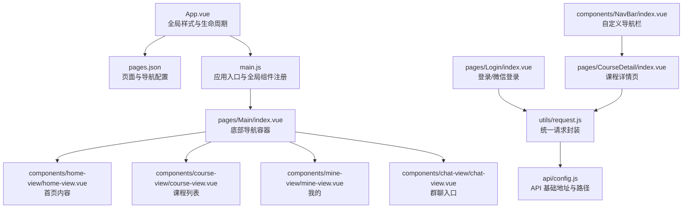
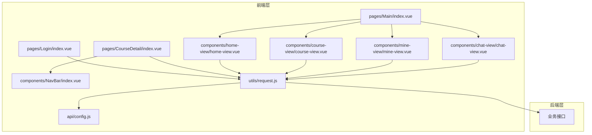
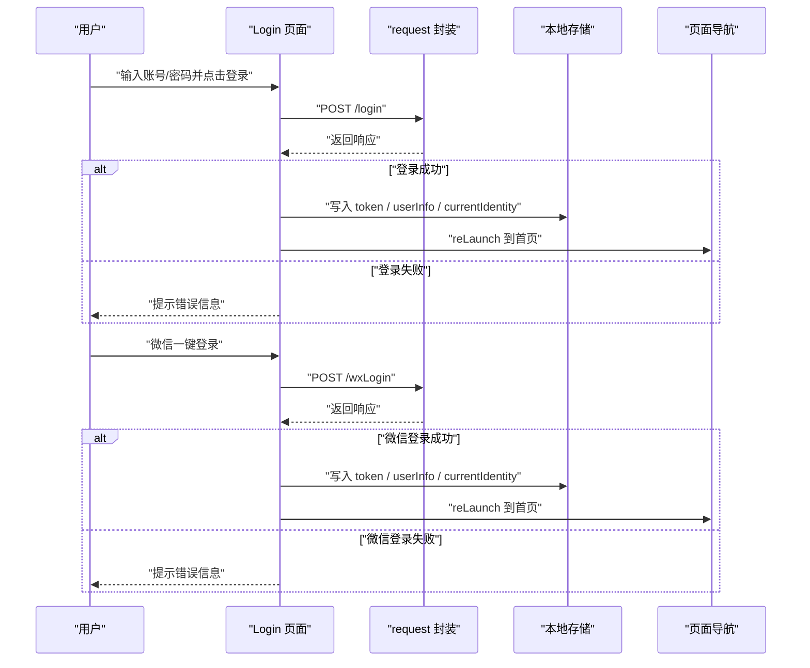
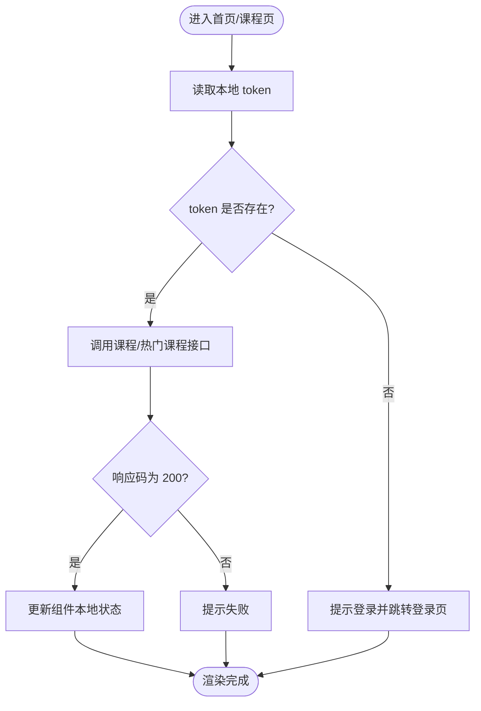
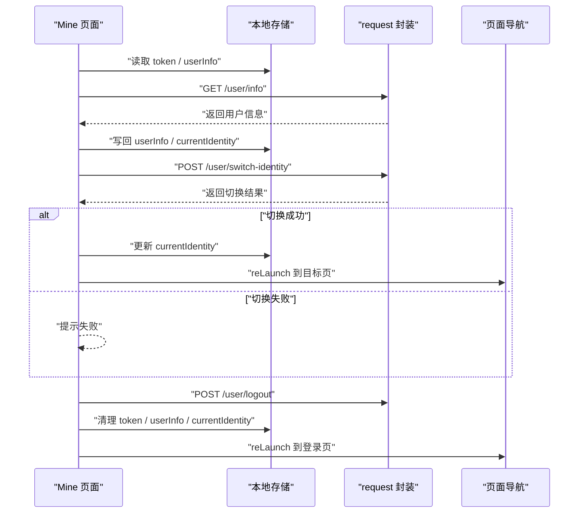
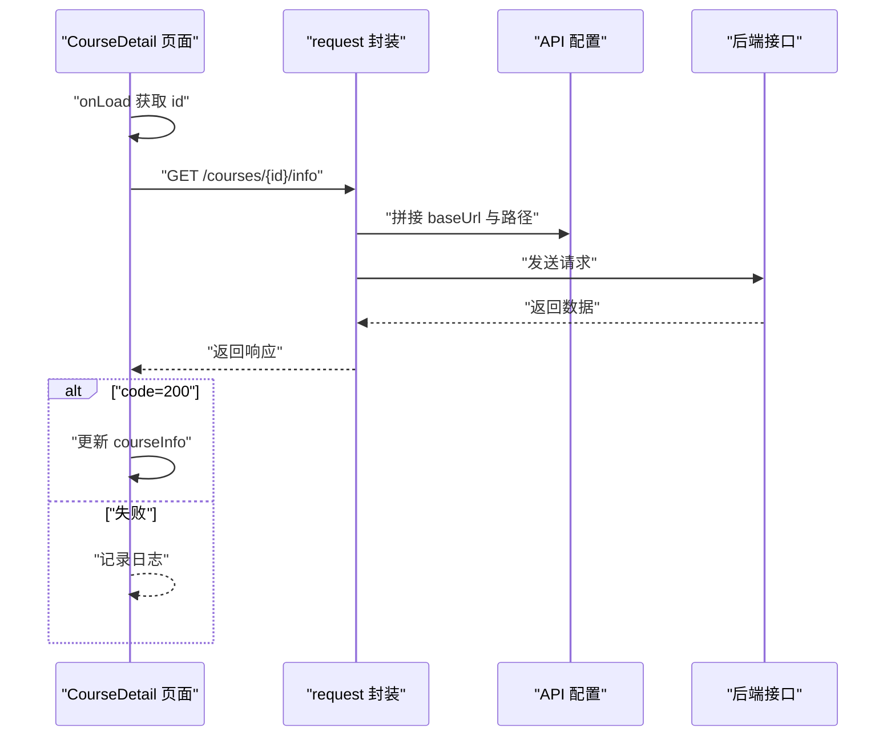
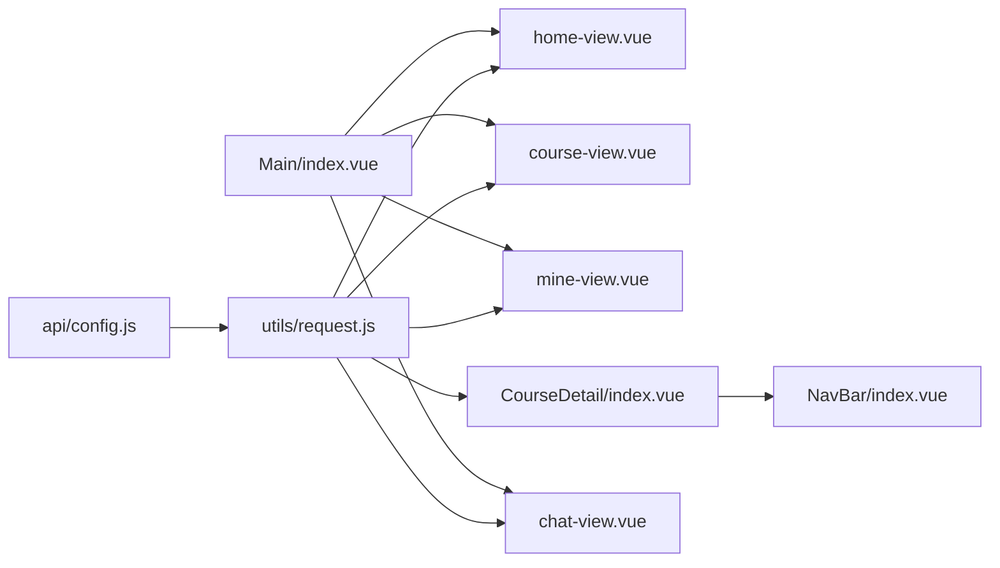

# 数据流设计

<cite>
**本文引用的文件**
- [main.js](file://main.js)
- [App.vue](file://App.vue)
- [pages.json](file://pages.json)
- [manifest.json](file://manifest.json)
- [api/config.js](file://api/config.js)
- [utils/request.js](file://utils/request.js)
- [pages/Login/index.vue](file://pages/Login/index.vue)
- [pages/Main/index.vue](file://pages/Main/index.vue)
- [components/NavBar/index.vue](file://components/NavBar/index.vue)
- [components/home-view/home-view.vue](file://components/home-view/home-view.vue)
- [components/course-view/course-view.vue](file://components/course-view/course-view.vue)
- [components/mine-view/mine-view.vue](file://components/mine-view/mine-view.vue)
- [pages/CourseDetail/index.vue](file://pages/CourseDetail/index.vue)
- [components/chat-view/chat-view.vue](file://components/chat-view/chat-view.vue)
</cite>

## 目录
1. [简介](#简介)
2. [项目结构](#项目结构)
3. [核心组件](#核心组件)
4. [架构总览](#架构总览)
5. [详细组件分析](#详细组件分析)
6. [依赖关系分析](#依赖关系分析)
7. [性能考虑](#性能考虑)
8. [故障排查指南](#故障排查指南)
9. [结论](#结论)
10. [附录](#附录)

## 简介
本文件面向“致良知教育”项目，系统性梳理应用的数据流与状态管理模式，覆盖以下方面：
- 数据流向与状态管理：本地状态、全局状态、异步数据处理
- 网络请求统一处理：请求封装、API 配置、错误处理
- 缓存与持久化：Token、用户信息、身份标识的存储与读取
- 组件间通信：事件总线、路由跳转、参数传递
- 数据同步与刷新：生命周期与事件驱动的刷新机制
- 性能优化与监控建议：首屏渲染、懒加载、请求节流与日志埋点

## 项目结构
项目采用基于页面/组件的组织方式，结合 uni-app 生态，通过 pages.json 声明页面与导航样式，全局样式在 App.vue 中集中定义，API 配置与网络请求封装分别位于 api 与 utils 目录。

图表来源
- [App.vue:1-40](file://App.vue#L1-L40)
- [pages.json:1-131](file://pages.json#L1-L131)
- [main.js:1-26](file://main.js#L1-L26)
- [pages/Main/index.vue:1-224](file://pages/Main/index.vue#L1-L224)
- [components/home-view/home-view.vue:1-772](file://components/home-view/home-view.vue#L1-L772)
- [components/course-view/course-view.vue:1-496](file://components/course-view/course-view.vue#L1-L496)
- [components/mine-view/mine-view.vue:1-910](file://components/mine-view/mine-view.vue#L1-L910)
- [components/chat-view/chat-view.vue:1-156](file://components/chat-view/chat-view.vue#L1-L156)
- [pages/Login/index.vue:1-900](file://pages/Login/index.vue#L1-L900)
- [utils/request.js:1-98](file://utils/request.js#L1-L98)
- [api/config.js:1-60](file://api/config.js#L1-L60)
- [pages/CourseDetail/index.vue:1-384](file://pages/CourseDetail/index.vue#L1-L384)
- [components/NavBar/index.vue:1-68](file://components/NavBar/index.vue#L1-L68)

章节来源
- [pages.json:1-131](file://pages.json#L1-L131)
- [main.js:1-26](file://main.js#L1-L26)
- [App.vue:1-40](file://App.vue#L1-L40)

## 核心组件
- 应用入口与全局注册
  - main.js 负责创建应用实例、全局注册 NavBar 组件，并按平台区分导出 createApp。
- 页面与导航
  - pages.json 声明页面路径、导航样式与全局样式；App.vue 定义品牌色与全局样式。
- 统一请求与 API 配置
  - api/config.js 提供 baseUrl 与各接口路径；utils/request.js 封装请求、自动注入 Authorization、处理 401 与网络异常。
- 业务页面
  - Login：账号/微信登录、信息补全、跳转逻辑
  - Main：底部导航容器，承载 home/course/mine/chat 四个视图
  - Home：热门课程、导航、跳转
  - Course：课程列表、标签切换、刷新事件
  - Mine：用户信息、身份切换、退出登录
  - CourseDetail：课程详情、模块化子组件
  - Chat：群聊列表、进入聊天

章节来源
- [main.js:18-25](file://main.js#L18-L25)
- [pages.json:8-129](file://pages.json#L8-L129)
- [App.vue:15-39](file://App.vue#L15-L39)
- [api/config.js:8-57](file://api/config.js#L8-L57)
- [utils/request.js:7-67](file://utils/request.js#L7-L67)

## 架构总览
应用采用“页面容器 + 组件模块”的分层结构，数据通过统一请求层访问后端，状态在组件本地与全局事件之间流转，页面间通过 uni.navigateTo/uni.reLaunch/uni.switchTab 进行跳转。

图表来源
- [pages/Login/index.vue:139-453](file://pages/Login/index.vue#L139-L453)
- [pages/Main/index.vue:52-115](file://pages/Main/index.vue#L52-L115)
- [pages/CourseDetail/index.vue:67-146](file://pages/CourseDetail/index.vue#L67-L146)
- [components/home-view/home-view.vue:137-262](file://components/home-view/home-view.vue#L137-L262)
- [components/course-view/course-view.vue:93-224](file://components/course-view/course-view.vue#L93-L224)
- [components/mine-view/mine-view.vue:135-377](file://components/mine-view/mine-view.vue#L135-L377)
- [components/chat-view/chat-view.vue:39-95](file://components/chat-view/chat-view.vue#L39-L95)
- [components/NavBar/index.vue:23-48](file://components/NavBar/index.vue#L23-L48)
- [utils/request.js:1-98](file://utils/request.js#L1-L98)
- [api/config.js:1-60](file://api/config.js#L1-L60)

## 详细组件分析

### 登录流程与状态管理
- 登录方式
  - 账号密码登录：调用登录接口，成功后写入 token、userInfo、currentIdentity，并根据 isComplete 决定跳转至信息补全或首页。
  - 微信一键登录：先获取临时 code，再提交 code、昵称、头像，成功后同样写入缓存并跳转首页。
- 状态与持久化
  - 使用 uni.setStorageSync 将 token、userInfo、currentIdentity 写入本地存储；组件加载时优先从缓存读取。
- 错误处理
  - 登录失败、网络异常、表单校验失败均通过 uni.showToast 提示；401 由统一请求层拦截并清除 token、跳转登录。

图表来源
- [pages/Login/index.vue:196-282](file://pages/Login/index.vue#L196-L282)
- [pages/Login/index.vue:311-430](file://pages/Login/index.vue#L311-L430)
- [utils/request.js:7-67](file://utils/request.js#L7-L67)

章节来源
- [pages/Login/index.vue:139-453](file://pages/Login/index.vue#L139-L453)
- [utils/request.js:7-67](file://utils/request.js#L7-L67)

### 主页与课程列表数据流
- 首页热门课程
  - 首次进入时调用热门课程接口，成功后更新本地列表；卡片点击前先调用报名核验接口，再决定跳转详情或报名页。
- 课程列表
  - 支持三个标签页（正在学习/历史课程/已结业），切换时通过事件触发刷新；组件挂载时默认加载“正在学习”。

图表来源
- [components/home-view/home-view.vue:218-261](file://components/home-view/home-view.vue#L218-L261)
- [components/course-view/course-view.vue:160-193](file://components/course-view/course-view.vue#L160-L193)

章节来源
- [components/home-view/home-view.vue:137-262](file://components/home-view/home-view.vue#L137-L262)
- [components/course-view/course-view.vue:93-224](file://components/course-view/course-view.vue#L93-L224)

### 我的页面与身份切换
- 用户信息
  - 从本地缓存读取 token 与 userInfo；若存在则发起用户信息接口，成功后合并并写回缓存；强制将 currentIdentity 设为“学员端”。
- 身份切换
  - 调用切换身份接口，成功后写入缓存并根据目标身份跳转对应首页。
- 退出登录
  - 发起退出登录接口，清理本地存储并跳转登录页。

图表来源
- [components/mine-view/mine-view.vue:204-377](file://components/mine-view/mine-view.vue#L204-L377)
- [utils/request.js:7-67](file://utils/request.js#L7-L67)

章节来源
- [components/mine-view/mine-view.vue:135-377](file://components/mine-view/mine-view.vue#L135-L377)

### 课程详情页与模块化数据
- 课程详情页
  - 通过 onLoad 获取课程 id，调用详情接口填充课程信息；提供四个模块页签（营期介绍/课程安排/今日课程/课程数据）。
- 统一请求
  - 详情页使用 utils/request.js 的 request 方法进行 GET 请求，自动注入 Authorization。

图表来源
- [pages/CourseDetail/index.vue:67-146](file://pages/CourseDetail/index.vue#L67-L146)
- [utils/request.js:1-98](file://utils/request.js#L1-L98)
- [api/config.js:16-56](file://api/config.js#L16-L56)

章节来源
- [pages/CourseDetail/index.vue:1-384](file://pages/CourseDetail/index.vue#L1-L384)

### 群聊列表与导航栏
- 群聊列表
  - 组件加载与显示时从本地读取 token，调用群聊列表接口，成功后渲染列表项并支持跳转详情。
- 自定义导航栏
  - NavBar 组件根据页面栈数量智能返回，单页场景降级到首页。

章节来源
- [components/chat-view/chat-view.vue:39-95](file://components/chat-view/chat-view.vue#L39-L95)
- [components/NavBar/index.vue:23-48](file://components/NavBar/index.vue#L23-L48)

## 依赖关系分析
- 组件耦合
  - 主页与课程页依赖 utils/request.js 与 api/config.js；Mine 依赖 utils/request.js；CourseDetail 依赖 utils/request.js 与 api/config.js。
- 事件与路由
  - Main 通过 uni.$on/$off 监听 refreshCourseList 事件；Mine 通过 uni.$emit 触发 switchTab；页面间通过 uni.navigateTo/uni.reLaunch/uni.switchTab 跳转。
- 全局样式与主题
  - App.vue 定义品牌色与全局卡片样式，pages.json 控制导航栏样式与全局背景。

图表来源
- [api/config.js:1-60](file://api/config.js#L1-L60)
- [utils/request.js:1-98](file://utils/request.js#L1-L98)
- [components/home-view/home-view.vue:137-262](file://components/home-view/home-view.vue#L137-L262)
- [components/course-view/course-view.vue:93-224](file://components/course-view/course-view.vue#L93-L224)
- [components/mine-view/mine-view.vue:135-377](file://components/mine-view/mine-view.vue#L135-L377)
- [pages/CourseDetail/index.vue:67-146](file://pages/CourseDetail/index.vue#L67-L146)
- [components/chat-view/chat-view.vue:39-95](file://components/chat-view/chat-view.vue#L39-L95)
- [pages/Main/index.vue:52-115](file://pages/Main/index.vue#L52-L115)
- [components/NavBar/index.vue:23-48](file://components/NavBar/index.vue#L23-L48)

章节来源
- [pages/Main/index.vue:52-115](file://pages/Main/index.vue#L52-L115)
- [pages/CourseDetail/index.vue:67-146](file://pages/CourseDetail/index.vue#L67-L146)

## 性能考虑
- 首屏与动画
  - 首页与课程页通过 isFirstLoad 控制入场动画，首次渲染后移除动画以减少重绘。
- 请求优化
  - 统一请求封装自动注入 Authorization，避免重复拼接；对 401 进行统一拦截并跳转登录，减少重复判断。
- 列表渲染
  - 课程列表使用分页参数 limit/offset，避免一次性加载过多数据；卡片点击前先做报名核验，减少无效跳转。
- 缓存策略
  - 用户信息与 token 写入本地存储，组件挂载时优先读取，降低重复请求次数。
- 监控建议
  - 在 utils/request.js 中增加请求耗时统计与错误上报；在关键页面 onLoad/onShow 埋点记录停留时长与交互行为。

## 故障排查指南
- 登录失败
  - 检查账号密码是否为空、长度是否满足要求；确认网络状态；查看返回 msg 字段定位问题。
- 401 未授权
  - 统一请求层会清除 token 并提示登录；检查后端是否正确颁发 token，以及请求头 Authorization 是否正确。
- 网络异常
  - 统一请求层捕获 fail 并提示；检查设备网络、域名配置与跨域设置。
- 身份切换失败
  - 检查 token 是否存在；确认切换接口返回码与消息；必要时清理缓存后重试。
- 页面跳转异常
  - 检查 reLaunch/redirectTo/navigateTo 的目标路径是否存在；在失败回调中打印错误信息以便定位。

章节来源
- [utils/request.js:24-67](file://utils/request.js#L24-L67)
- [pages/Login/index.vue:268-282](file://pages/Login/index.vue#L268-L282)
- [components/mine-view/mine-view.vue:270-310](file://components/mine-view/mine-view.vue#L270-L310)

## 结论
本项目采用清晰的页面/组件分层与统一请求封装，结合本地存储实现基本的状态持久化与身份管理。通过事件总线与路由跳转实现组件间通信，整体数据流简洁可控。建议后续在请求监控、缓存一致性与页面性能指标埋点方面进一步完善，以提升用户体验与可维护性。

## 附录
- API 配置与路径
  - 基础地址与各接口路径集中管理，便于替换与联调。
- 页面清单与导航
  - pages.json 统一声明页面与导航样式，全局样式在 App.vue 中集中定义。

章节来源
- [api/config.js:8-57](file://api/config.js#L8-L57)
- [pages.json:8-129](file://pages.json#L8-L129)
- [App.vue:15-39](file://App.vue#L15-L39)