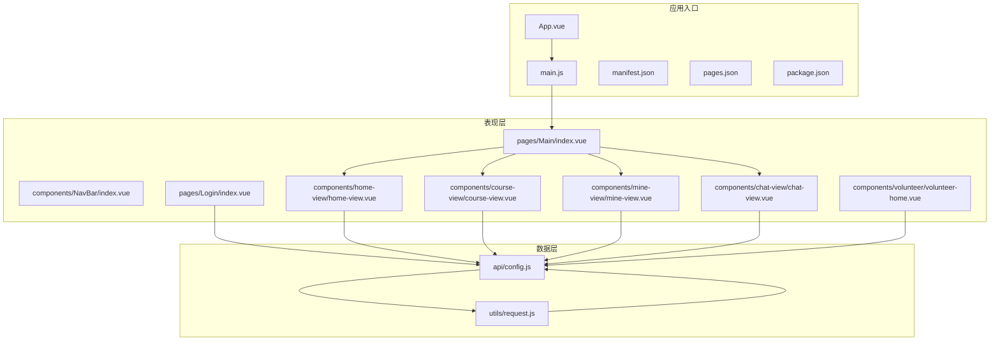
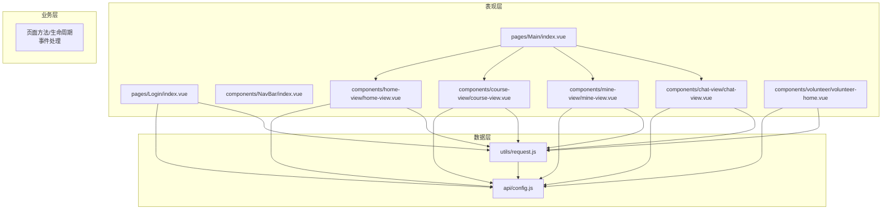
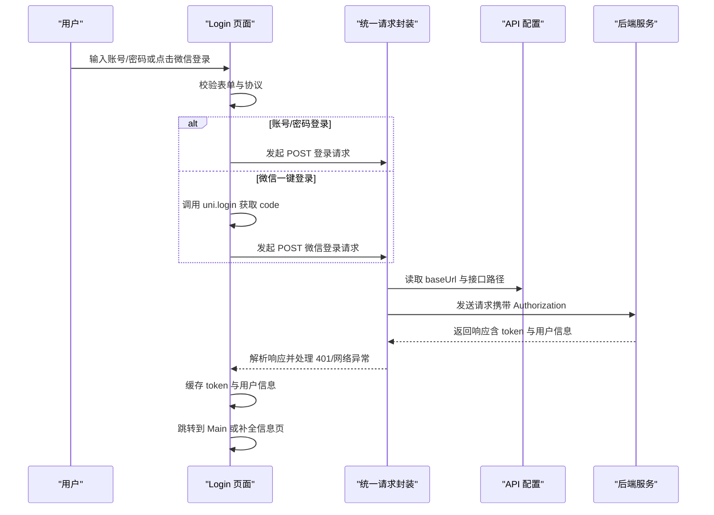
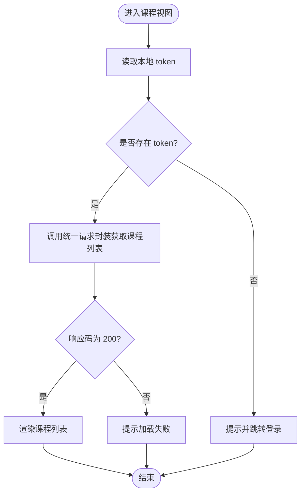
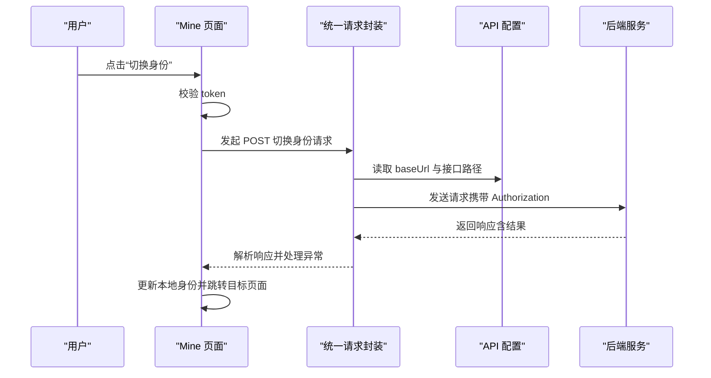
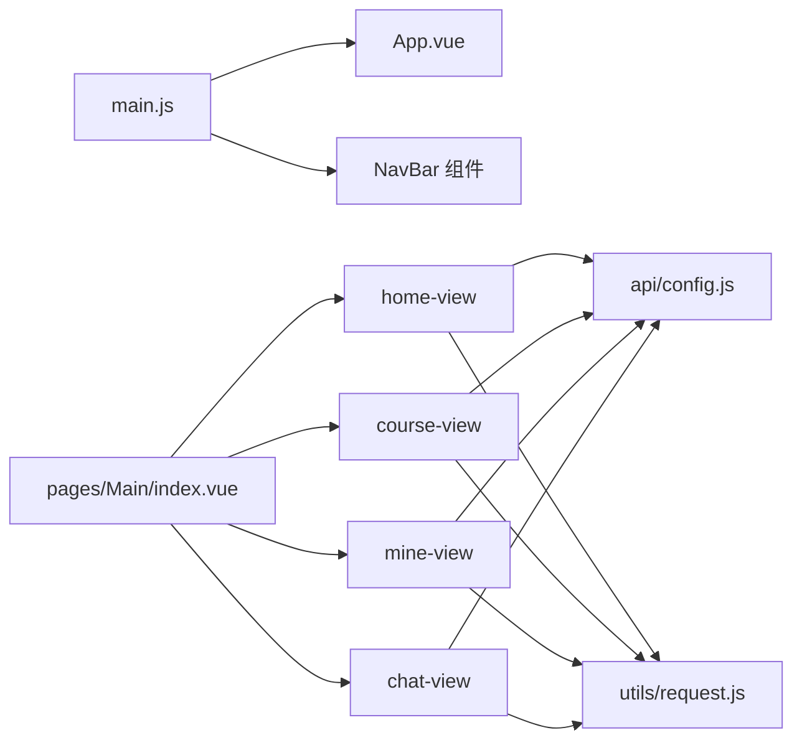

# 整体架构设计

<cite>
**本文引用的文件**
- [App.vue](file://App.vue)
- [main.js](file://main.js)
- [manifest.json](file://manifest.json)
- [pages.json](file://pages.json)
- [package.json](file://package.json)
- [api/config.js](file://api/config.js)
- [utils/request.js](file://utils/request.js)
- [components/NavBar/index.vue](file://components/NavBar/index.vue)
- [pages/Main/index.vue](file://pages/Main/index.vue)
- [pages/Login/index.vue](file://pages/Login/index.vue)
- [components/home-view/home-view.vue](file://components/home-view/home-view.vue)
- [components/course-view/course-view.vue](file://components/course-view/course-view.vue)
- [components/mine-view/mine-view.vue](file://components/mine-view/mine-view.vue)
- [components/chat-view/chat-view.vue](file://components/chat-view/chat-view.vue)
- [components/volunteer/volunteer-home.vue](file://components/volunteer/volunteer-home.vue)
</cite>

## 目录
1. [引言](#引言)
2. [项目结构](#项目结构)
3. [核心组件](#核心组件)
4. [架构总览](#架构总览)
5. [详细组件分析](#详细组件分析)
6. [依赖关系分析](#依赖关系分析)
7. [性能考量](#性能考量)
8. [故障排查指南](#故障排查指南)
9. [结论](#结论)
10. [附录](#附录)

## 引言
本项目为“致良知教育”跨平台应用，采用 uni-app 框架构建，目标是在微信小程序、H5、App 等多端统一开发与运行。项目遵循 MVVM 架构思想，通过 Vue.js 的响应式数据与组件化体系组织表现层；业务层由页面组件与工具模块协同完成；数据层通过统一请求封装对接后端 API。同时，项目采用编译时多端适配与运行时组件化架构，结合全局配置与生命周期管理，形成清晰的三层架构：表现层（页面组件）、业务层（逻辑处理）、数据层（API 接口）。

## 项目结构
项目采用按功能域划分的目录组织方式，核心目录与职责如下：
- api：集中存放 API 基础配置与接口路径常量
- utils：封装统一请求与工具方法
- components：可复用组件（如 NavBar、各视图组件）
- pages：页面级路由与入口，包含业务页面与子页面
- static：静态资源（图标等）
- doc：项目文档与技术分析报告
- 根目录：应用入口、清单与构建配置

图表来源
- [App.vue:1-40](file://App.vue#L1-L40)
- [main.js:1-26](file://main.js#L1-L26)
- [manifest.json:1-73](file://manifest.json#L1-L73)
- [pages.json:1-131](file://pages.json#L1-L131)
- [package.json:1-6](file://package.json#L1-L6)
- [api/config.js:1-60](file://api/config.js#L1-L60)
- [utils/request.js:1-98](file://utils/request.js#L1-L98)
- [components/NavBar/index.vue:1-68](file://components/NavBar/index.vue#L1-L68)
- [pages/Main/index.vue:1-224](file://pages/Main/index.vue#L1-L224)
- [pages/Login/index.vue:1-900](file://pages/Login/index.vue#L1-L900)
- [components/home-view/home-view.vue:1-772](file://components/home-view/home-view.vue#L1-L772)
- [components/course-view/course-view.vue:1-496](file://components/course-view/course-view.vue#L1-L496)
- [components/mine-view/mine-view.vue:1-910](file://components/mine-view/mine-view.vue#L1-L910)
- [components/chat-view/chat-view.vue:1-156](file://components/chat-view/chat-view.vue#L1-L156)
- [components/volunteer/volunteer-home.vue:1-404](file://components/volunteer/volunteer-home.vue#L1-L404)

章节来源
- [App.vue:1-40](file://App.vue#L1-L40)
- [main.js:1-26](file://main.js#L1-L26)
- [manifest.json:1-73](file://manifest.json#L1-L73)
- [pages.json:1-131](file://pages.json#L1-L131)
- [package.json:1-6](file://package.json#L1-L6)

## 核心组件
- 应用入口与生命周期：App.vue 提供应用生命周期钩子（启动、显示、隐藏），main.js 负责应用实例创建与组件注册（含 Vue2/Vue3 双栈兼容）。
- 全局导航栏：NavBar 组件提供统一的导航栏 UI 与智能返回逻辑，支持透明/非透明模式与占位布局。
- 主页容器：Main 页面作为底部导航容器，聚合多个视图组件，负责状态栏高度计算与标签页切换。
- 登录页：Login 页面负责用户认证（账号/密码与微信一键登录），并进行登录结果处理与页面跳转。
- 视图组件：home-view（首页）、course-view（课程）、mine-view（我的）、chat-view（群聊）、volunteer-home（志愿中心）分别承载具体业务场景。
- 数据访问：api/config.js 统一管理 API 基础地址与接口路径；utils/request.js 封装统一请求、自动注入 Token、处理 401 与网络异常。

章节来源
- [App.vue:1-40](file://App.vue#L1-L40)
- [main.js:1-26](file://main.js#L1-L26)
- [components/NavBar/index.vue:1-68](file://components/NavBar/index.vue#L1-L68)
- [pages/Main/index.vue:1-224](file://pages/Main/index.vue#L1-L224)
- [pages/Login/index.vue:1-900](file://pages/Login/index.vue#L1-L900)
- [components/home-view/home-view.vue:1-772](file://components/home-view/home-view.vue#L1-L772)
- [components/course-view/course-view.vue:1-496](file://components/course-view/course-view.vue#L1-L496)
- [components/mine-view/mine-view.vue:1-910](file://components/mine-view/mine-view.vue#L1-L910)
- [components/chat-view/chat-view.vue:1-156](file://components/chat-view/chat-view.vue#L1-L156)
- [components/volunteer/volunteer-home.vue:1-404](file://components/volunteer/volunteer-home.vue#L1-L404)
- [api/config.js:1-60](file://api/config.js#L1-L60)
- [utils/request.js:1-98](file://utils/request.js#L1-L98)

## 架构总览
本项目采用 MVVM 架构与三层分层设计：
- 表现层（页面组件）：由 pages 与 components 下的 Vue 组件构成，负责 UI 呈现与交互事件。
- 业务层（逻辑处理）：页面组件内 methods/computed/onLoad/onShow 等生命周期与事件处理承担业务逻辑，部分逻辑下沉至工具模块。
- 数据层（API 接口）：通过 utils/request.js 统一发起请求，api/config.js 统一管理接口地址与路径。

uni-app 编译时多端适配与运行时组件化：
- 编译时：pages.json 声明页面路由与全局样式，manifest.json 配置多端能力与权限；package.json 管理依赖（如 uni-ui）。
- 运行时：main.js 注册全局组件（如 NavBar），组件间通过 props/emit 通信，页面通过 uni.xxx API 与 uni-ui 组件协作。

图表来源
- [pages/Login/index.vue:1-900](file://pages/Login/index.vue#L1-L900)
- [pages/Main/index.vue:1-224](file://pages/Main/index.vue#L1-L224)
- [components/NavBar/index.vue:1-68](file://components/NavBar/index.vue#L1-L68)
- [components/home-view/home-view.vue:1-772](file://components/home-view/home-view.vue#L1-L772)
- [components/course-view/course-view.vue:1-496](file://components/course-view/course-view.vue#L1-L496)
- [components/mine-view/mine-view.vue:1-910](file://components/mine-view/mine-view.vue#L1-L910)
- [components/chat-view/chat-view.vue:1-156](file://components/chat-view/chat-view.vue#L1-L156)
- [components/volunteer/volunteer-home.vue:1-404](file://components/volunteer/volunteer-home.vue#L1-L404)
- [utils/request.js:1-98](file://utils/request.js#L1-L98)
- [api/config.js:1-60](file://api/config.js#L1-L60)

## 详细组件分析

### MVVM 设计模式在 Vue.js 中的实现
- Model（模型）：由 API 配置与请求封装提供数据源，页面组件通过响应式数据承载业务状态。
- View（视图）：各页面与组件模板负责渲染 UI，使用指令绑定数据与事件。
- ViewModel（视图模型）：页面组件的 data/computed/methods/lifecycle 承担视图与模型之间的协调，实现数据驱动与事件处理。

示例路径
- [pages/Login/index.vue:138-454](file://pages/Login/index.vue#L138-L454) 登录页的数据与方法
- [components/home-view/home-view.vue:137-263](file://components/home-view/home-view.vue#L137-L263) 首页视图的数据与方法
- [components/course-view/course-view.vue:93-224](file://components/course-view/course-view.vue#L93-L224) 课程视图的组合式 API 与生命周期
- [components/mine-view/mine-view.vue:135-377](file://components/mine-view/mine-view.vue#L135-L377) 我的视图的数据与方法

章节来源
- [pages/Login/index.vue:138-454](file://pages/Login/index.vue#L138-L454)
- [components/home-view/home-view.vue:137-263](file://components/home-view/home-view.vue#L137-L263)
- [components/course-view/course-view.vue:93-224](file://components/course-view/course-view.vue#L93-L224)
- [components/mine-view/mine-view.vue:135-377](file://components/mine-view/mine-view.vue#L135-L377)

### 三层架构分层
- 表现层（页面组件）
  - Main 作为容器页聚合多个视图组件，并处理底部导航与状态栏占位。
  - 各视图组件负责自身业务场景的 UI 与交互。
- 业务层（逻辑处理）
  - 页面组件内处理登录、课程列表、用户信息、群聊列表等业务逻辑。
  - 通过 uni.$emit/$off 实现组件间通信（如首页切换）。
- 数据层（API 接口）
  - API 配置集中管理基础地址与接口路径。
  - 统一请求封装自动注入 Token、处理 401 与网络异常。

示例路径
- [pages/Main/index.vue:52-116](file://pages/Main/index.vue#L52-L116) 容器页逻辑
- [pages/Login/index.vue:167-454](file://pages/Login/index.vue#L167-L454) 登录与跳转逻辑
- [components/mine-view/mine-view.vue:204-377](file://components/mine-view/mine-view.vue#L204-L377) 用户信息与身份切换逻辑
- [components/chat-view/chat-view.vue:42-95](file://components/chat-view/chat-view.vue#L42-L95) 群聊列表加载逻辑
- [api/config.js:8-57](file://api/config.js#L8-L57) API 配置
- [utils/request.js:7-67](file://utils/request.js#L7-L67) 统一请求封装

章节来源
- [pages/Main/index.vue:52-116](file://pages/Main/index.vue#L52-L116)
- [pages/Login/index.vue:167-454](file://pages/Login/index.vue#L167-L454)
- [components/mine-view/mine-view.vue:204-377](file://components/mine-view/mine-view.vue#L204-L377)
- [components/chat-view/chat-view.vue:42-95](file://components/chat-view/chat-view.vue#L42-L95)
- [api/config.js:8-57](file://api/config.js#L8-L57)
- [utils/request.js:7-67](file://utils/request.js#L7-L67)

### uni-app 的编译时多端适配与运行时组件化
- 编译时多端适配
  - pages.json 声明页面路由与全局样式，支持不同页面的导航栏样式与动画配置。
  - manifest.json 配置多端能力（如 usingComponents、权限声明）与版本信息。
  - package.json 管理依赖（如 uni-ui），提升组件生态复用。
- 运行时组件化
  - main.js 注册全局组件（如 NavBar），并在 Vue3 环境通过 createApp 返回应用实例。
  - 组件通过 props/emit 与父组件通信，页面通过 uni.xxx API 与 uni-ui 组件协作。

示例路径
- [pages.json:1-131](file://pages.json#L1-L131) 页面与全局样式配置
- [manifest.json:1-73](file://manifest.json#L1-L73) 多端能力与权限配置
- [package.json:1-6](file://package.json#L1-L6) 依赖管理
- [main.js:14-26](file://main.js#L14-L26) Vue3 环境全局组件注册
- [components/NavBar/index.vue:1-68](file://components/NavBar/index.vue#L1-L68) 全局导航栏组件

章节来源
- [pages.json:1-131](file://pages.json#L1-L131)
- [manifest.json:1-73](file://manifest.json#L1-L73)
- [package.json:1-6](file://package.json#L1-L6)
- [main.js:14-26](file://main.js#L14-L26)
- [components/NavBar/index.vue:1-68](file://components/NavBar/index.vue#L1-L68)

### 项目初始化流程、全局配置与生命周期管理
- 初始化流程
  - main.js 创建应用实例，注册全局组件（如 NavBar），并挂载 App。
  - App.vue 提供应用生命周期钩子（启动、显示、隐藏）。
- 全局配置
  - pages.json 声明页面路由与全局样式（如导航栏样式、背景色）。
  - manifest.json 配置多端能力与权限，启用 usingComponents。
  - package.json 管理依赖（如 uni-ui）。
- 生命周期管理
  - 页面组件使用 onLoad/onShow/onUnload 等生命周期处理数据加载与清理。
  - 组件使用 mounted/unmounted 等生命周期处理初始化与事件解绑。

示例路径
- [main.js:1-26](file://main.js#L1-L26) 应用实例创建与组件注册
- [App.vue:1-12](file://App.vue#L1-L12) 应用生命周期钩子
- [pages.json:1-131](file://pages.json#L1-L131) 页面与全局样式配置
- [manifest.json:1-73](file://manifest.json#L1-L73) 多端能力与权限配置
- [package.json:1-6](file://package.json#L1-L6) 依赖管理
- [pages/Main/index.vue:99-115](file://pages/Main/index.vue#L99-L115) 页面生命周期与事件监听
- [components/course-view/course-view.vue:201-224](file://components/course-view/course-view.vue#L201-L224) 组合式生命周期

章节来源
- [main.js:1-26](file://main.js#L1-L26)
- [App.vue:1-12](file://App.vue#L1-L12)
- [pages.json:1-131](file://pages.json#L1-L131)
- [manifest.json:1-73](file://manifest.json#L1-L73)
- [package.json:1-6](file://package.json#L1-L6)
- [pages/Main/index.vue:99-115](file://pages/Main/index.vue#L99-L115)
- [components/course-view/course-view.vue:201-224](file://components/course-view/course-view.vue#L201-L224)

### 登录与认证流程（序列图）

图表来源
- [pages/Login/index.vue:167-454](file://pages/Login/index.vue#L167-L454)
- [utils/request.js:7-67](file://utils/request.js#L7-L67)
- [api/config.js:8-57](file://api/config.js#L8-L57)

章节来源
- [pages/Login/index.vue:167-454](file://pages/Login/index.vue#L167-L454)
- [utils/request.js:7-67](file://utils/request.js#L7-L67)
- [api/config.js:8-57](file://api/config.js#L8-L57)

### 课程列表加载与身份核验（流程图）

图表来源
- [components/course-view/course-view.vue:160-193](file://components/course-view/course-view.vue#L160-L193)

章节来源
- [components/course-view/course-view.vue:160-193](file://components/course-view/course-view.vue#L160-L193)

### 我的页面身份切换（序列图）

图表来源
- [components/mine-view/mine-view.vue:270-310](file://components/mine-view/mine-view.vue#L270-L310)
- [utils/request.js:7-67](file://utils/request.js#L7-L67)
- [api/config.js:8-57](file://api/config.js#L8-L57)

章节来源
- [components/mine-view/mine-view.vue:270-310](file://components/mine-view/mine-view.vue#L270-L310)
- [utils/request.js:7-67](file://utils/request.js#L7-L67)
- [api/config.js:8-57](file://api/config.js#L8-L57)

## 依赖关系分析
- 组件耦合
  - Main 作为容器页聚合多个视图组件，视图组件之间低耦合，通过页面跳转与事件通信协作。
  - NavBar 作为全局组件被多处使用，提供统一导航体验。
- 外部依赖
  - uni-ui：通过 pages.json 的 easycom 自动扫描与按需引入，减少手动导入成本。
  - uni.xxx API：用于系统信息获取、页面跳转、存储等运行时能力。
- 数据依赖
  - API 配置集中管理，统一请求封装负责鉴权与错误处理，降低重复代码与风险。

图表来源
- [main.js:1-26](file://main.js#L1-L26)
- [App.vue:1-40](file://App.vue#L1-L40)
- [pages/Main/index.vue:52-116](file://pages/Main/index.vue#L52-L116)
- [components/home-view/home-view.vue:137-263](file://components/home-view/home-view.vue#L137-L263)
- [components/course-view/course-view.vue:93-224](file://components/course-view/course-view.vue#L93-L224)
- [components/mine-view/mine-view.vue:135-377](file://components/mine-view/mine-view.vue#L135-L377)
- [components/chat-view/chat-view.vue:39-95](file://components/chat-view/chat-view.vue#L39-L95)
- [api/config.js:1-60](file://api/config.js#L1-L60)
- [utils/request.js:1-98](file://utils/request.js#L1-L98)

章节来源
- [main.js:1-26](file://main.js#L1-L26)
- [pages/Main/index.vue:52-116](file://pages/Main/index.vue#L52-L116)
- [api/config.js:1-60](file://api/config.js#L1-L60)
- [utils/request.js:1-98](file://utils/request.js#L1-L98)

## 性能考量
- 首屏与动画
  - 首屏加载采用 stagger 动画与延迟策略，避免一次性渲染造成卡顿；首次加载完成后移除动画绑定，保证后续切换零延迟。
- 网络请求
  - 统一请求封装集中处理 401 与网络异常，减少重复逻辑；合理使用 loading 与 toast 提升用户体验。
- 组件复用
  - 全局组件（如 NavBar）与公共样式（如全局卡片样式类）减少重复样式与逻辑，提高维护性与一致性。
- 多端适配
  - 通过 manifest.json 与 pages.json 的配置，确保不同端的 UI 与行为一致性，降低调试成本。

## 故障排查指南
- 登录失败
  - 检查账号/密码格式与协议勾选；确认网络状态与后端接口可用；查看 401 处理逻辑与 token 缓存。
  - 参考路径：[pages/Login/index.vue:167-454](file://pages/Login/index.vue#L167-L454)，[utils/request.js:7-67](file://utils/request.js#L7-L67)
- 课程列表为空
  - 校验 token 是否存在与有效；确认接口返回码与数据结构；检查统一请求封装的错误处理。
  - 参考路径：[components/course-view/course-view.vue:160-193](file://components/course-view/course-view.vue#L160-L193)，[utils/request.js:7-67](file://utils/request.js#L7-L67)
- 页面跳转异常
  - 检查 pages.json 中页面路径与页面声明；确认 uni.navigateTo/redirectTo/reLaunch 的参数与目标页面存在。
  - 参考路径：[pages.json:1-131](file://pages.json#L1-L131)
- 身份切换失败
  - 校验 token 与后端接口；查看响应码与消息；确认本地身份缓存更新与页面跳转。
  - 参考路径：[components/mine-view/mine-view.vue:270-310](file://components/mine-view/mine-view.vue#L270-L310)

章节来源
- [pages/Login/index.vue:167-454](file://pages/Login/index.vue#L167-L454)
- [components/course-view/course-view.vue:160-193](file://components/course-view/course-view.vue#L160-L193)
- [pages.json:1-131](file://pages.json#L1-L131)
- [components/mine-view/mine-view.vue:270-310](file://components/mine-view/mine-view.vue#L270-L310)
- [utils/request.js:7-67](file://utils/request.js#L7-L67)

## 结论
本项目以 uni-app 为基础，采用 MVVM 与三层架构，结合编译时多端适配与运行时组件化，实现了跨平台的一致体验与良好的可维护性。通过统一 API 配置与请求封装，降低了数据层复杂度；通过全局组件与公共样式，提升了表现层的一致性与复用性。建议在后续迭代中持续优化首屏性能、完善错误监控与埋点，并加强接口契约与单元测试，以进一步提升稳定性与可扩展性。

## 附录
- 架构决策说明与设计权衡
  - 选择 Vue3 与双栈兼容（Vue2/Vue3）：兼顾现有代码与未来迁移，降低升级成本。
  - 统一请求封装：集中处理鉴权与错误，减少重复代码，提升安全性与一致性。
  - 全局组件与 easycom：提升组件复用效率与开发体验，降低维护成本。
  - 多端配置分离：通过 manifest.json 与 pages.json 精细控制多端差异，确保体验一致。