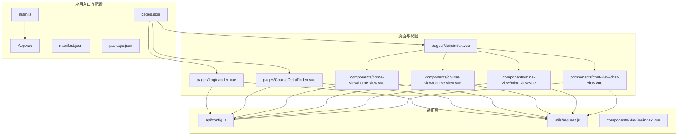
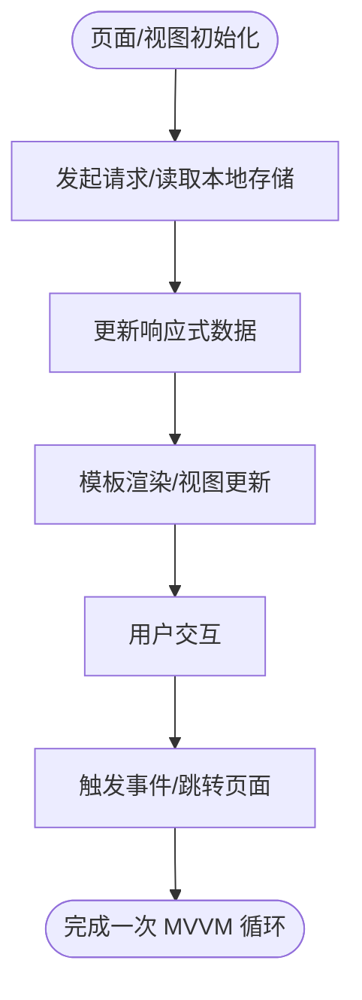
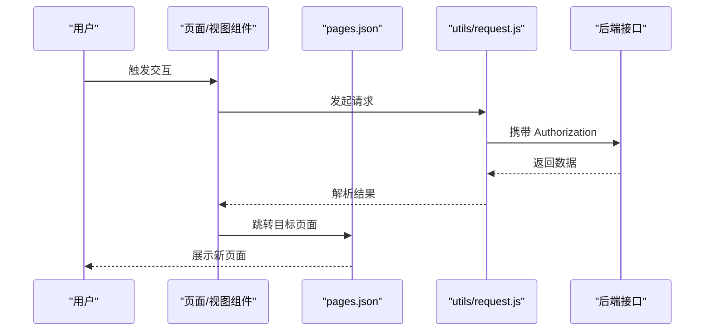
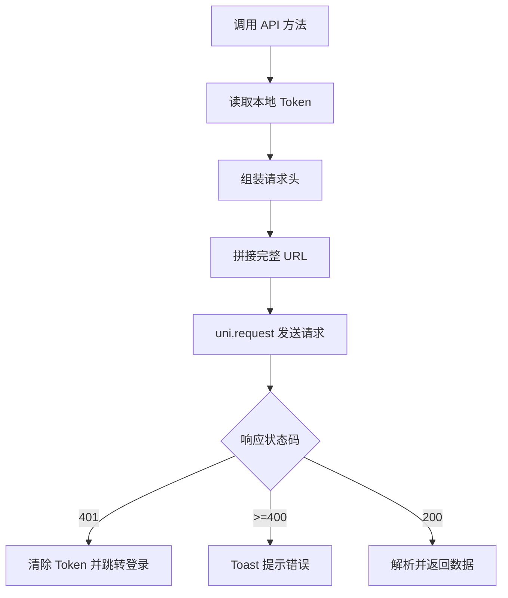
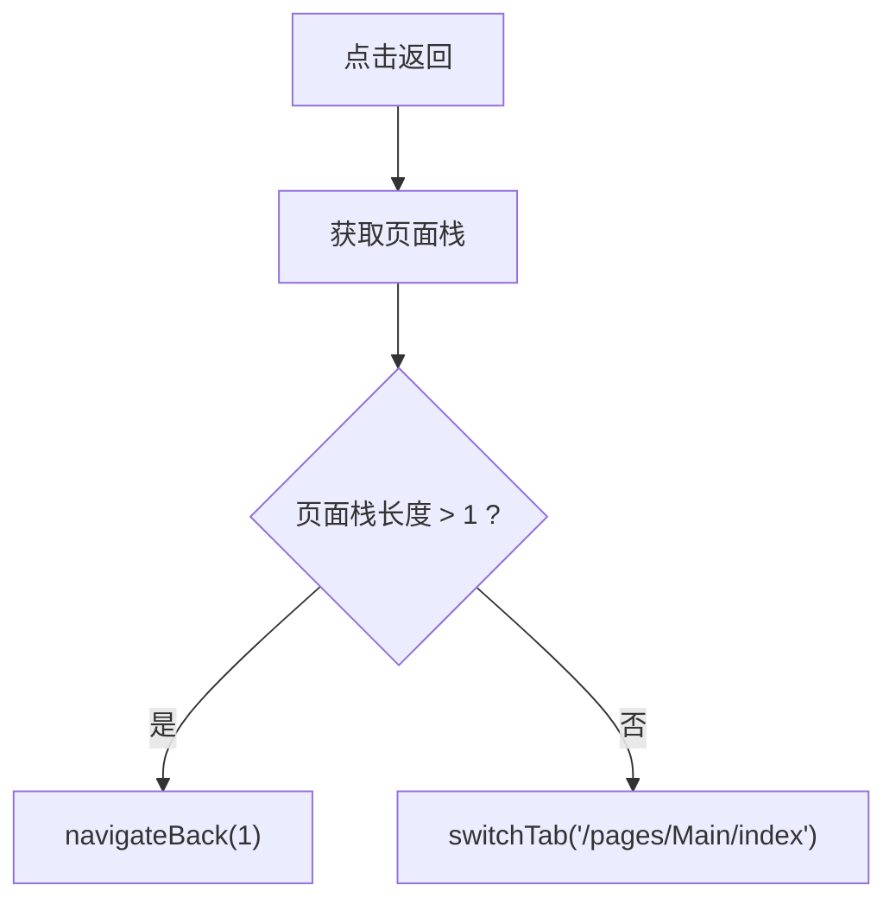
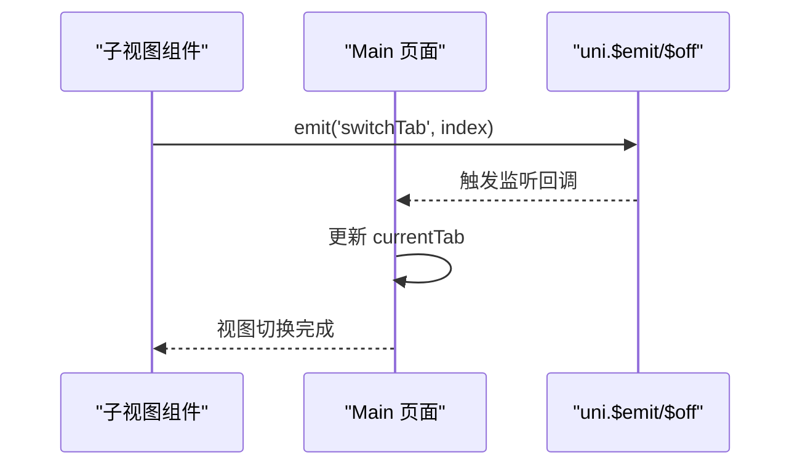
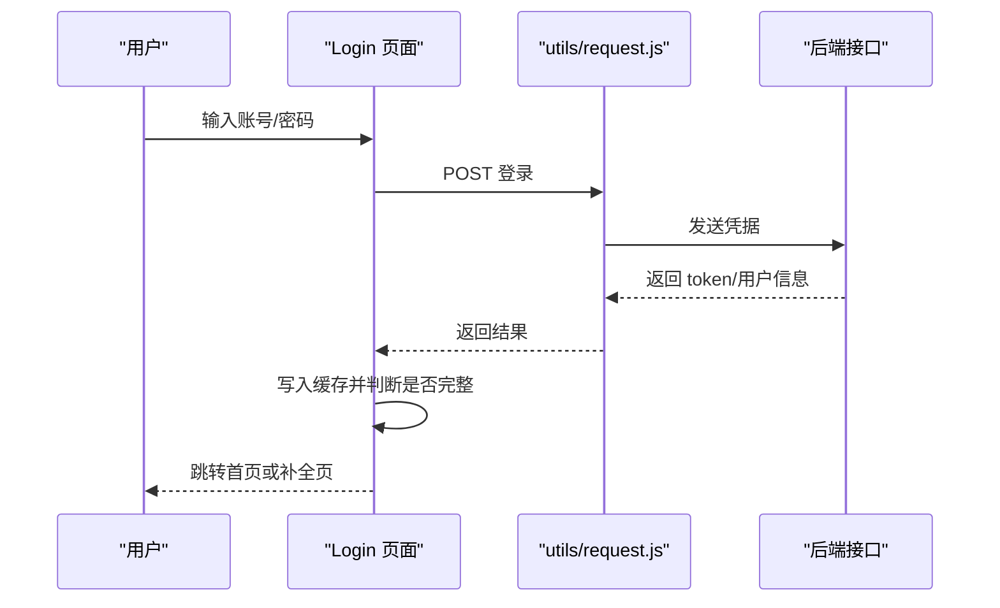
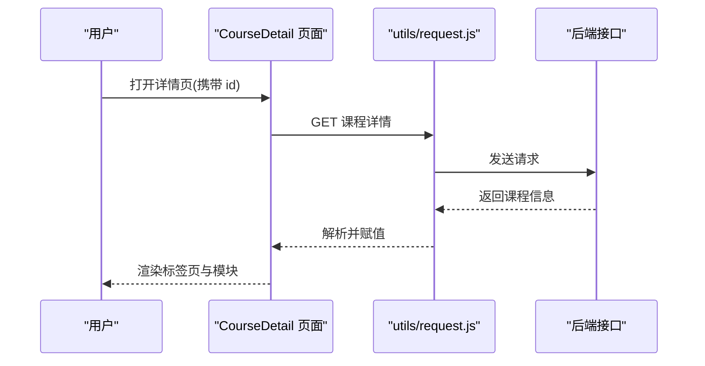
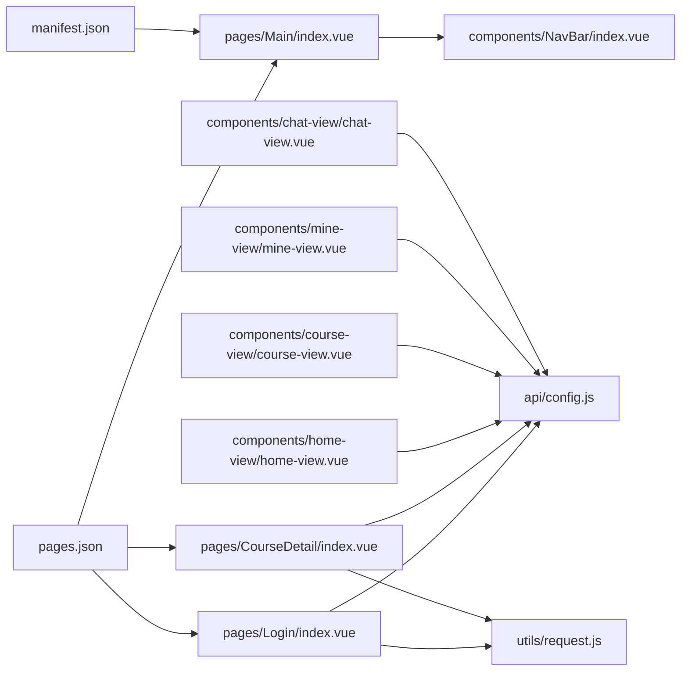

# 架构设计

<cite>
**本文引用的文件**   
- [App.vue](file://App.vue)
- [main.js](file://main.js)
- [pages.json](file://pages.json)
- [manifest.json](file://manifest.json)
- [package.json](file://package.json)
- [api/config.js](file://api/config.js)
- [utils/request.js](file://utils/request.js)
- [components/NavBar/index.vue](file://components/NavBar/index.vue)
- [pages/Main/index.vue](file://pages/Main/index.vue)
- [pages/Login/index.vue](file://pages/Login/index.vue)
- [components/home-view/home-view.vue](file://components/home-view/home-view.vue)
- [components/course-view/course-view.vue](file://components/course-view/course-view.vue)
- [components/mine-view/mine-view.vue](file://components/mine-view/mine-view.vue)
- [components/chat-view/chat-view.vue](file://components/chat-view/chat-view.vue)
- [pages/CourseDetail/index.vue](file://pages/CourseDetail/index.vue)
</cite>

## 目录
1. [引言](#引言)
2. [项目结构](#项目结构)
3. [核心组件](#核心组件)
4. [架构总览](#架构总览)
5. [详细组件分析](#详细组件分析)
6. [依赖分析](#依赖分析)
7. [性能考量](#性能考量)
8. [故障排查指南](#故障排查指南)
9. [结论](#结论)
10. [附录](#附录)

## 引言
本项目为“致良知教育”小程序/多端应用，采用 uni-app 框架构建，前端以 Vue.js 为基础，遵循 MVVM 设计模式，通过组件化与模块化组织页面与业务逻辑，结合统一的 API 配置与请求封装，形成可扩展、可维护的前端架构。本文档旨在系统梳理整体架构、目录结构、路由与状态管理、数据流设计，并给出可视化图示与实践建议。

## 项目结构
项目采用“按页面/组件分层 + 模块化 API”的组织方式：
- 应用入口与平台配置：App.vue、main.js、manifest.json、pages.json、package.json
- 统一 API 配置：api/config.js
- 网络请求封装：utils/request.js
- 通用组件：components/NavBar
- 页面与视图：pages/Main、pages/Login、pages/CourseDetail 等；视图组件：components/home-view、components/course-view、components/mine-view、components/chat-view
- 全局样式与主题：App.vue 中 SCSS 变量与页面级样式



**图表来源** 
- [main.js:1-26](file://main.js#L1-L26)
- [pages.json:1-131](file://pages.json#L1-L131)
- [api/config.js:1-60](file://api/config.js#L1-L60)
- [utils/request.js:1-98](file://utils/request.js#L1-L98)
- [components/NavBar/index.vue:1-68](file://components/NavBar/index.vue#L1-L68)
- [pages/Main/index.vue:1-224](file://pages/Main/index.vue#L1-L224)
- [pages/Login/index.vue:1-900](file://pages/Login/index.vue#L1-L900)
- [pages/CourseDetail/index.vue:1-384](file://pages/CourseDetail/index.vue#L1-L384)
- [components/home-view/home-view.vue:1-772](file://components/home-view/home-view.vue#L1-L772)
- [components/course-view/course-view.vue:1-496](file://components/course-view/course-view.vue#L1-L496)
- [components/mine-view/mine-view.vue:1-910](file://components/mine-view/mine-view.vue#L1-L910)
- [components/chat-view/chat-view.vue:1-156](file://components/chat-view/chat-view.vue#L1-L156)

**章节来源**
- [main.js:1-26](file://main.js#L1-L26)
- [pages.json:1-131](file://pages.json#L1-L131)
- [manifest.json:1-73](file://manifest.json#L1-L73)
- [package.json:1-6](file://package.json#L1-L6)

## 核心组件
- 应用入口与生命周期：App.vue 提供全局样式与生命周期钩子
- 应用启动与全局注册：main.js 在 Vue3 环境下全局注册 NavBar 组件
- 页面路由与导航：pages.json 声明页面与导航样式，支持自定义导航栏与动画
- 统一 API 配置：api/config.js 集中管理基础地址与接口路径
- 请求封装：utils/request.js 统一注入 Token、处理 401 与错误提示
- 通用导航栏：components/NavBar/index.vue 提供智能返回与透明模式
- 主页视图：pages/Main/index.vue 负责底部 Tab 切换与子视图渲染
- 登录页：pages/Login/index.vue 实现账号/微信登录、信息补全与跳转
- 课程详情页：pages/CourseDetail/index.vue 展示课程信息与模块化子组件
- 业务视图：components/home-view、components/course-view、components/mine-view、components/chat-view

**章节来源**
- [App.vue:1-40](file://App.vue#L1-L40)
- [main.js:14-26](file://main.js#L14-L26)
- [pages.json:1-131](file://pages.json#L1-L131)
- [api/config.js:8-60](file://api/config.js#L8-L60)
- [utils/request.js:7-98](file://utils/request.js#L7-L98)
- [components/NavBar/index.vue:23-49](file://components/NavBar/index.vue#L23-L49)
- [pages/Main/index.vue:52-116](file://pages/Main/index.vue#L52-L116)
- [pages/Login/index.vue:138-454](file://pages/Login/index.vue#L138-L454)
- [pages/CourseDetail/index.vue:67-146](file://pages/CourseDetail/index.vue#L67-L146)

## 架构总览
本项目采用“页面 + 视图组件 + 通用组件 + 通用服务”的分层架构：
- 页面层：pages/* 定义页面路由与展示容器
- 视图层：components/* 下的业务视图负责具体业务渲染与交互
- 通用层：api/config.js、utils/request.js、components/NavBar 提供跨页面能力
- 数据与状态：页面与视图通过 uni.request 与本地存储进行数据交互；通过 uni.$emit/$off 进行轻量事件通信

```mermaid
graph TB
UI["页面/视图组件<br/>pages/*, components/*"] --> Net["网络层<br/>utils/request.js"]
UI --> Storage["本地存储<br/>uni.storage"]
UI --> Events["事件通信<br/>uni.$emit/$off"]
Net --> API["API 配置<br/>api/config.js"]
UI --> Global["通用组件<br/>components/NavBar"]
PagesCfg["路由配置<br/>pages.json"] --> UI
Manifest["平台配置<br/>manifest.json"] --> UI
```



**图表来源** 
- [pages.json:1-131](file://pages.json#L1-L131)
- [manifest.json:1-73](file://manifest.json#L1-L73)
- [utils/request.js:1-98](file://utils/request.js#L1-L98)
- [api/config.js:1-60](file://api/config.js#L1-L60)
- [components/NavBar/index.vue:1-68](file://components/NavBar/index.vue#L1-L68)

## 详细组件分析

### MVVM 设计模式在 Vue.js 中的应用
- Model：页面与视图的数据模型（data/computed/ref），以及通过 utils/request.js 发起的后端数据
- View：模板层（template）负责渲染与用户交互
- ViewModel：页面与视图的 methods、生命周期钩子与响应式状态，协调 Model 与 View 的更新



[本图为概念流程，无需图表来源]

**章节来源**
- [pages/Main/index.vue:52-116](file://pages/Main/index.vue#L52-L116)
- [components/course-view/course-view.vue:93-224](file://components/course-view/course-view.vue#L93-L224)
- [components/mine-view/mine-view.vue:135-377](file://components/mine-view/mine-view.vue#L135-L377)

### 页面路由与导航机制
- 路由声明：pages.json 中集中声明页面路径、导航样式与全局样式
- 自定义导航：pages/Login、pages/CourseDetail 等页面通过自定义导航栏提升一致性
- 页面跳转：页面内通过 uni.navigateTo/reLaunch/redirectTo 等 API 实现页面流转
- 底部导航：pages/Main/index.vue 通过底部 Tab 切换不同视图组件



**图表来源** 
- [pages.json:1-131](file://pages.json#L1-L131)
- [utils/request.js:7-98](file://utils/request.js#L7-L98)
- [pages/Login/index.vue:196-282](file://pages/Login/index.vue#L196-L282)
- [pages/CourseDetail/index.vue:128-146](file://pages/CourseDetail/index.vue#L128-L146)

**章节来源**
- [pages.json:1-131](file://pages.json#L1-L131)
- [pages/Main/index.vue:52-116](file://pages/Main/index.vue#L52-L116)
- [pages/Login/index.vue:138-454](file://pages/Login/index.vue#L138-L454)

### 统一 API 配置与请求封装
- API 配置：api/config.js 统一管理 baseUrl 与接口路径，便于切换开发/生产环境
- 请求封装：utils/request.js 自动注入 Token、处理 401 与通用错误提示，提供 get/post 快捷方法
- 使用方式：页面与视图通过 API_CONFIG 与 request/get/post 调用接口



**图表来源** 
- [utils/request.js:7-98](file://utils/request.js#L7-L98)
- [api/config.js:8-60](file://api/config.js#L8-L60)

**章节来源**
- [api/config.js:8-60](file://api/config.js#L8-L60)
- [utils/request.js:7-98](file://utils/request.js#L7-L98)

### 通用导航栏组件（NavBar）
- 能力：支持透明模式、返回逻辑、占位与样式定制
- 智能返回：根据页面栈长度决定 navigateBack 或 switchTab



**图表来源** 
- [components/NavBar/index.vue:39-48](file://components/NavBar/index.vue#L39-L48)

**章节来源**
- [components/NavBar/index.vue:23-49](file://components/NavBar/index.vue#L23-L49)

### 主页与底部导航（Main）
- 结构：顶部状态栏占位 + 多视图容器 + 底部 Tab 导航
- 交互：通过 uni.$on/$off 接收跨组件事件，实现 Tab 切换



**图表来源** 
- [pages/Main/index.vue:105-114](file://pages/Main/index.vue#L105-L114)

**章节来源**
- [pages/Main/index.vue:52-116](file://pages/Main/index.vue#L52-L116)

### 登录流程（Login）
- 支持账号密码登录与微信一键登录
- 登录成功后写入 token、用户信息与身份标识，按用户信息完整性跳转至首页或信息补全页
- 微信登录流程包含头像/昵称选择弹窗



**图表来源** 
- [pages/Login/index.vue:196-282](file://pages/Login/index.vue#L196-L282)
- [utils/request.js:7-98](file://utils/request.js#L7-L98)

**章节来源**
- [pages/Login/index.vue:138-454](file://pages/Login/index.vue#L138-L454)

### 课程详情页（CourseDetail）
- 结构：顶部英雄区 + 信息卡片 + 标签页 + 模块化子组件
- 数据：通过 API 获取课程信息，按 campId 加载课程安排、今日课程、课程数据等模块



**图表来源** 
- [pages/CourseDetail/index.vue:128-146](file://pages/CourseDetail/index.vue#L128-L146)
- [utils/request.js:7-98](file://utils/request.js#L7-L98)

**章节来源**
- [pages/CourseDetail/index.vue:67-146](file://pages/CourseDetail/index.vue#L67-L146)

### 业务视图组件（Home/Course/Mine/Chat）
- Home：热门课程列表、导航入口、弹窗交互
- Course：课程列表、进度与状态展示、Tab 切换与刷新事件
- Mine：个人信息、身份切换、常用服务、退出登录
- Chat：群聊列表加载与跳转

```mermaid
classDiagram
class HomeView {
+fetchHotCourses()
+goToDetail(id)
+handleNavClick(item,index)
}
class CourseView {
+fetchCourseData(tabType)
+switchTopTab(index)
}
class MineView {
+fetchUserInfo()
+switchIdentity(role)
+handleLogout()
}
class ChatView {
+loadGroupList()
+goToChat(group)
}
HomeView --> API_Config["使用 API 配置"]
CourseView --> API_Config
MineView --> API_Config
ChatView --> API_Config
```

**图表来源** 
- [components/home-view/home-view.vue:195-262](file://components/home-view/home-view.vue#L195-L262)
- [components/course-view/course-view.vue:160-224](file://components/course-view/course-view.vue#L160-L224)
- [components/mine-view/mine-view.vue:225-377](file://components/mine-view/mine-view.vue#L225-L377)
- [components/chat-view/chat-view.vue:57-95](file://components/chat-view/chat-view.vue#L57-L95)

**章节来源**
- [components/home-view/home-view.vue:137-262](file://components/home-view/home-view.vue#L137-L262)
- [components/course-view/course-view.vue:93-224](file://components/course-view/course-view.vue#L93-L224)
- [components/mine-view/mine-view.vue:135-377](file://components/mine-view/mine-view.vue#L135-L377)
- [components/chat-view/chat-view.vue:39-95](file://components/chat-view/chat-view.vue#L39-L95)

## 依赖分析
- 组件耦合：页面与视图组件通过 API 配置与请求封装解耦；通用组件（NavBar）被多页面复用
- 外部依赖：@dcloudio/uni-ui 在 pages.json 中启用 easycom 自动扫描
- 平台配置：manifest.json 指定 Vue 版本、编译器版本与平台特性



**图表来源** 
- [pages.json:1-131](file://pages.json#L1-L131)
- [manifest.json:1-73](file://manifest.json#L1-L73)
- [api/config.js:1-60](file://api/config.js#L1-L60)
- [utils/request.js:1-98](file://utils/request.js#L1-L98)
- [components/NavBar/index.vue:1-68](file://components/NavBar/index.vue#L1-L68)

**章节来源**
- [pages.json:1-131](file://pages.json#L1-L131)
- [manifest.json:1-73](file://manifest.json#L1-L73)
- [package.json:1-6](file://package.json#L1-L6)

## 性能考量
- 首屏与动画：视图组件通过首屏加载标识减少重复动画开销，提升切换流畅度
- 网络请求：统一注入 Token 与错误处理，避免重复鉴权与错误提示
- 页面栈管理：智能返回逻辑减少不必要的页面跳转
- 资源体积：按需引入第三方 UI 组件，合理拆分页面与组件，降低首屏压力

[本节为通用指导，无需章节来源]

## 故障排查指南
- 登录 401：utils/request.js 会自动清除 Token 并跳转登录页，检查后端鉴权与 Token 缓存
- 网络异常：请求封装统一 Toast 提示，检查网络状态与 API 地址
- 页面跳转失败：检查 pages.json 中页面路径与参数传递
- 身份切换异常：确认后端接口与本地缓存一致性

**章节来源**
- [utils/request.js:24-67](file://utils/request.js#L24-L67)
- [pages/Login/index.vue:224-261](file://pages/Login/index.vue#L224-L261)
- [pages.json:1-131](file://pages.json#L1-L131)

## 结论
本项目以 uni-app 为框架，结合 MVVM 模式与组件化思想，通过统一 API 配置与请求封装，实现了清晰的页面路由、可复用的通用组件与稳定的业务视图。整体架构具备良好的扩展性与可维护性，适合在多端场景下持续演进。

## 附录
- 技术决策说明
  - 使用 Vue3 SSR App 创建器与全局组件注册，提升开发体验与组件复用
  - 采用 pages.json 统一路由与导航样式，保证多端一致性
  - 通过 easycom 自动扫描 uni-ui 组件，降低手动引入成本
- 架构权衡
  - 统一请求封装简化了鉴权与错误处理，但需注意与后端协议一致
  - 本地存储用于身份与 Token 管理，需关注安全性与过期策略
- 扩展性设计
  - API 配置集中化，便于环境切换与接口迁移
  - 事件通信（uni.$emit/$off）用于弱耦合页面间协作
  - 视图组件模块化，便于功能迭代与测试

[本节为总结性内容，无需章节来源]