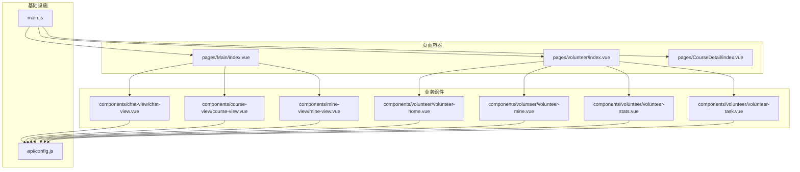
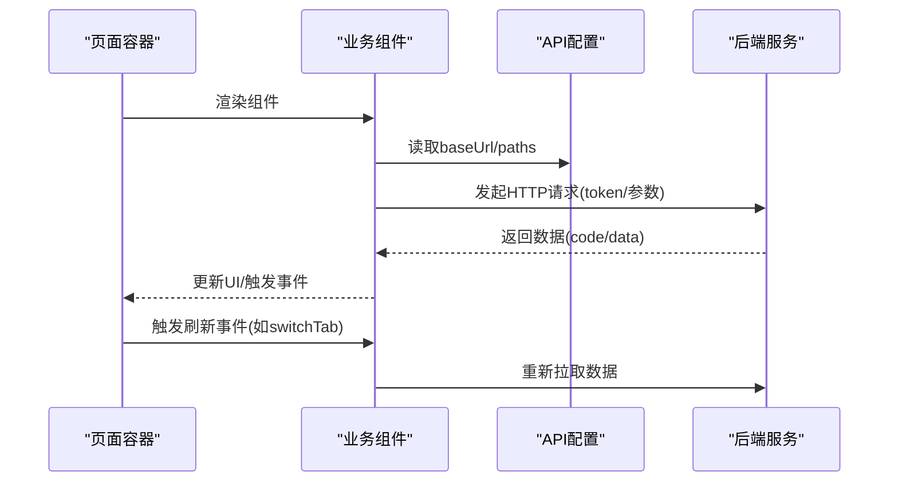
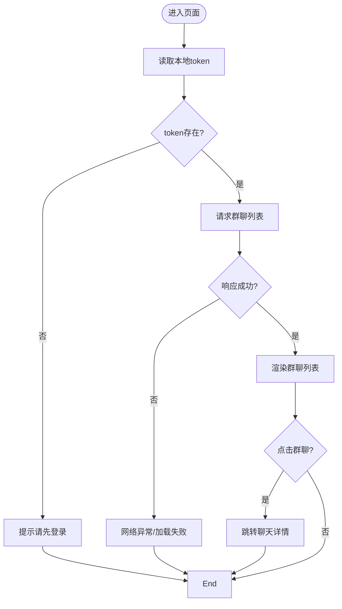
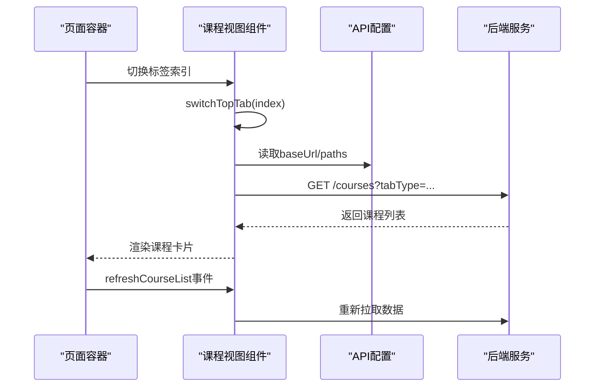
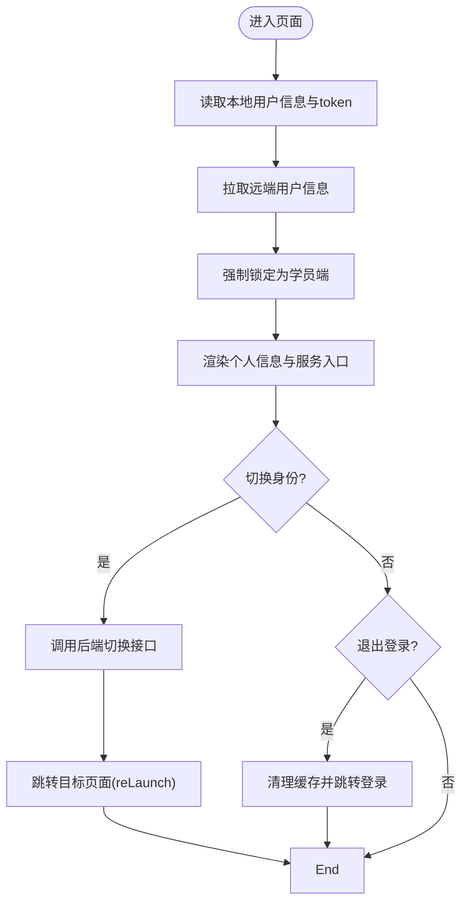
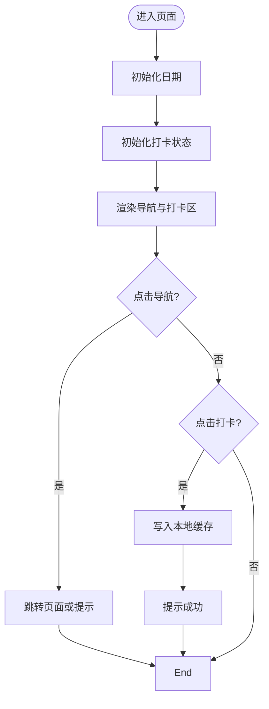
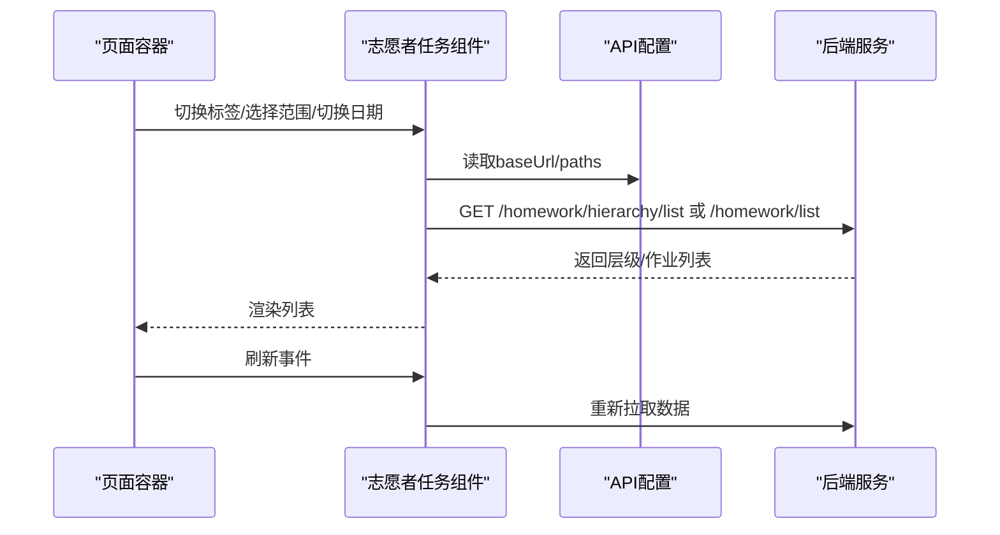
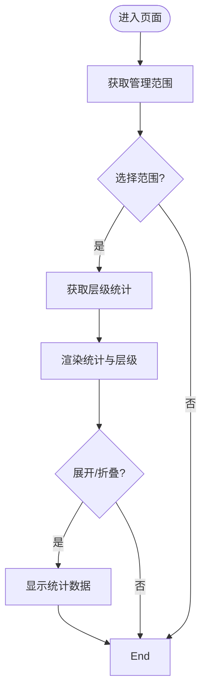
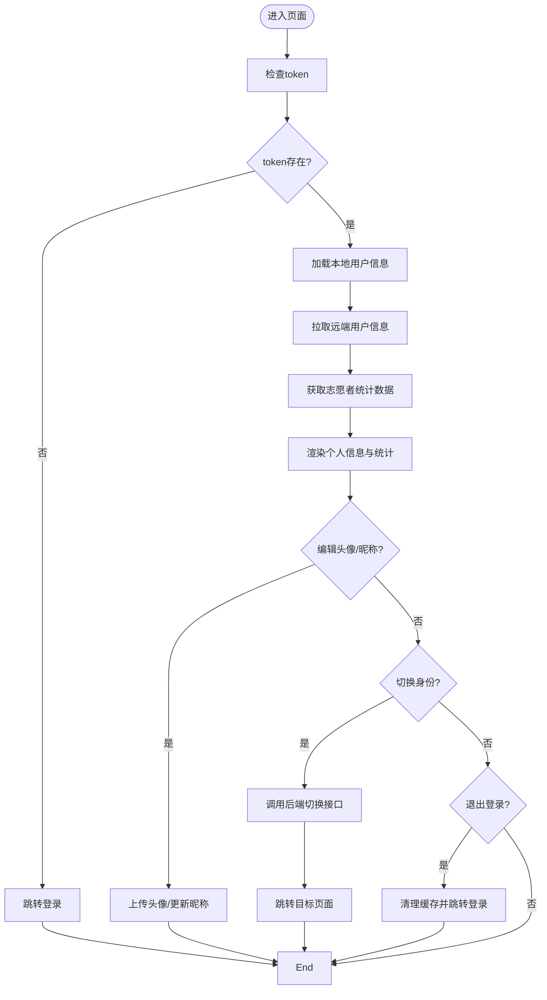
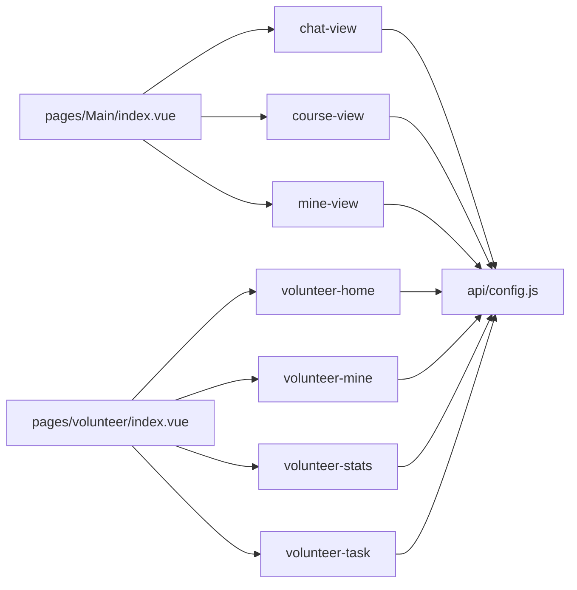

# 业务组件

<cite>
**本文引用的文件**
- [chat-view.vue](file://components/chat-view/chat-view.vue)
- [course-view.vue](file://components/course-view/course-view.vue)
- [mine-view.vue](file://components/mine-view/mine-view.vue)
- [volunteer-home.vue](file://components/volunteer/volunteer-home.vue)
- [volunteer-mine.vue](file://components/volunteer/volunteer-mine.vue)
- [volunteer-stats.vue](file://components/volunteer/volunteer-stats.vue)
- [volunteer-task.vue](file://components/volunteer/volunteer-task.vue)
- [config.js](file://api/config.js)
- [main.js](file://main.js)
- [index.vue](file://pages/Main/index.vue)
- [index.vue](file://pages/volunteer/index.vue)
- [index.vue](file://pages/CourseDetail/index.vue)
</cite>

## 目录
1. [简介](#简介)
2. [项目结构](#项目结构)
3. [核心组件](#核心组件)
4. [架构总览](#架构总览)
5. [详细组件分析](#详细组件分析)
6. [依赖分析](#依赖分析)
7. [性能考量](#性能考量)
8. [故障排查指南](#故障排查指南)
9. [结论](#结论)
10. [附录](#附录)

## 简介
本文件面向致良知教育项目，系统梳理并深入分析业务组件的设计模式与实现策略，覆盖聊天视图、课程视图、个人中心以及志愿者相关组件。文档从职责边界、数据绑定、事件处理、状态管理、组件协作与数据流、可复用性与扩展性、配置与使用场景等方面进行阐述，并提供可视化图示与集成指引，帮助开发者快速理解与高效扩展。

## 项目结构
项目采用基于目录的模块化组织方式：
- components：业务组件库，包含聊天、课程、个人中心及志愿者相关组件
- pages：页面容器，负责路由与底部导航，承载业务组件
- api：统一的 API 配置与请求封装
- utils：通用工具（如请求封装）
- static、小程序模板样式等：静态资源与模板参考

图表来源
- [index.vue:1-124](file://pages/Main/index.vue#L1-L124)
- [index.vue:1-106](file://pages/volunteer/index.vue#L1-L106)
- [index.vue:1-146](file://pages/CourseDetail/index.vue#L1-L146)
- [chat-view.vue:1-156](file://components/chat-view/chat-view.vue#L1-L156)
- [course-view.vue:1-224](file://components/course-view/course-view.vue#L1-L224)
- [mine-view.vue:1-377](file://components/mine-view/mine-view.vue#L1-L377)
- [volunteer-home.vue:1-149](file://components/volunteer/volunteer-home.vue#L1-L149)
- [volunteer-mine.vue:1-595](file://components/volunteer/volunteer-mine.vue#L1-L595)
- [volunteer-stats.vue:1-400](file://components/volunteer/volunteer-stats.vue#L1-L400)
- [volunteer-task.vue:1-614](file://components/volunteer/volunteer-task.vue#L1-L614)
- [config.js:1-60](file://api/config.js#L1-L60)
- [main.js:1-26](file://main.js#L1-L26)

章节来源
- [index.vue:1-124](file://pages/Main/index.vue#L1-L124)
- [index.vue:1-106](file://pages/volunteer/index.vue#L1-L106)
- [index.vue:1-146](file://pages/CourseDetail/index.vue#L1-L146)
- [config.js:1-60](file://api/config.js#L1-L60)
- [main.js:1-26](file://main.js#L1-L26)

## 核心组件
- 聊天视图组件：负责展示用户加入的群聊列表，支持跳转至聊天详情页；通过本地缓存读取 token 并发起请求获取群聊列表。
- 课程视图组件：展示学员的课程列表，支持按“正在学习/历史课程/已结业”三类筛选；内置动画与懒加载优化；支持外部刷新事件。
- 个人中心组件：展示用户信息、身份切换、常用服务入口与退出登录；内置身份锁定逻辑与多端身份管理。
- 志愿者首页组件：提供志愿者端的导航、知行打卡与公益墙展示。
- 志愿者任务组件：作业评优管理，支持层级展开与优秀作业标记，权限控制严谨。
- 志愿者统计组件：作业层级统计，支持管理范围与日期筛选，提供详细名单跳转。
- 志愿者我的组件：志愿者端个人中心，支持头像/昵称编辑、身份切换、退出登录与统计数据展示。

章节来源
- [chat-view.vue:1-156](file://components/chat-view/chat-view.vue#L1-L156)
- [course-view.vue:1-224](file://components/course-view/course-view.vue#L1-L224)
- [mine-view.vue:1-377](file://components/mine-view/mine-view.vue#L1-L377)
- [volunteer-home.vue:1-149](file://components/volunteer/volunteer-home.vue#L1-L149)
- [volunteer-task.vue:1-614](file://components/volunteer/volunteer-task.vue#L1-L614)
- [volunteer-stats.vue:1-400](file://components/volunteer/volunteer-stats.vue#L1-L400)
- [volunteer-mine.vue:1-595](file://components/volunteer/volunteer-mine.vue#L1-L595)

## 架构总览
组件间通过页面容器进行组合与路由，页面容器通过全局事件实现跨组件通信与刷新。API 配置集中管理，组件通过统一配置访问后端接口。

图表来源
- [index.vue:105-114](file://pages/Main/index.vue#L105-L114)
- [index.vue:86-104](file://pages/volunteer/index.vue#L86-L104)
- [config.js:8-57](file://api/config.js#L8-L57)
- [course-view.vue:160-193](file://components/course-view/course-view.vue#L160-L193)
- [volunteer-task.vue:200-212](file://components/volunteer/volunteer-task.vue#L200-L212)

## 详细组件分析

### 聊天视图组件（chat-view）
- 职责与功能
  - 展示用户加入的群聊列表，空状态提示
  - 点击群聊跳转至聊天详情页
  - 登录态校验与网络异常处理
- 数据绑定与状态
  - 本地状态：token、groupList
  - 生命周期：mounted/onShow 时加载群聊列表
- 事件处理
  - 点击群聊项：导航到聊天详情
- 状态管理
  - 通过本地缓存读取 token，避免重复请求
- 可复用性与扩展
  - 可抽取为通用列表组件，支持更多群聊类型
  - 可增加下拉刷新、分页加载
- 集成方法
  - 在页面容器中引入并渲染
  - 通过页面容器的全局事件触发刷新

图表来源
- [chat-view.vue:42-93](file://components/chat-view/chat-view.vue#L42-L93)

章节来源
- [chat-view.vue:1-156](file://components/chat-view/chat-view.vue#L1-L156)

### 课程视图组件（course-view）
- 职责与功能
  - 三段式筛选：正在学习/历史课程/已结业
  - 课程卡片展示：封面、进度、状态徽章、操作按钮
  - 首次加载动画与懒切换优化
  - 支持外部刷新事件
- 数据绑定与状态
  - 响应式状态：currentTopTab、displayList、isFirstLoad、statusBarHeight
  - 颜色映射与状态文本映射
- 事件处理
  - 切换标签：fetchCourseData(tabType)
  - 点击课程卡片：导航到课程详情
- 状态管理
  - 生命周期内自动拉取数据；支持外部事件刷新
- 可复用性与扩展
  - 可抽取为通用卡片列表组件
  - 可扩展更多筛选维度（如按营期/班级）
- 集成方法
  - 在页面容器中引入并渲染
  - 通过页面容器的全局事件触发刷新

图表来源
- [course-view.vue:195-219](file://components/course-view/course-view.vue#L195-L219)
- [config.js:26-28](file://api/config.js#L26-L28)

章节来源
- [course-view.vue:1-224](file://components/course-view/course-view.vue#L1-L224)

### 个人中心组件（mine-view）
- 职责与功能
  - 用户信息展示与编辑入口
  - 多端身份管理：学员端/志愿者端
  - 常用服务与快捷入口
  - 退出登录流程
- 数据绑定与状态
  - 用户信息、token、身份开关状态、统计数据
- 事件处理
  - 身份切换：调用后端接口并跳转目标页面
  - 菜单点击：根据路径跳转或提示
  - 退出登录：清理本地缓存并跳转登录页
- 状态管理
  - 首次加载动画标识；本地缓存与后端数据同步
- 可复用性与扩展
  - 可抽取为通用个人中心模板
  - 可扩展更多身份与服务入口
- 集成方法
  - 在页面容器中引入并渲染
  - 通过页面容器的全局事件触发刷新

图表来源
- [mine-view.vue:189-375](file://components/mine-view/mine-view.vue#L189-L375)

章节来源
- [mine-view.vue:1-377](file://components/mine-view/mine-view.vue#L1-L377)

### 志愿者首页组件（volunteer-home）
- 职责与功能
  - 志愿者端首页导航与功能入口
  - 知行打卡：每日一次，本地缓存记录
  - 公益初心墙展示
- 数据绑定与状态
  - 导航列表、今日日期、打卡状态
- 事件处理
  - 导航点击：跳转对应页面或提示
  - 点击打卡：写入本地缓存并提示
- 状态管理
  - 本地存储为主，避免频繁请求
- 可复用性与扩展
  - 可抽取为通用首页模板
  - 可扩展更多功能入口与文案
- 集成方法
  - 在志愿者页面容器中引入并渲染

图表来源
- [volunteer-home.vue:98-147](file://components/volunteer/volunteer-home.vue#L98-L147)

章节来源
- [volunteer-home.vue:1-149](file://components/volunteer/volunteer-home.vue#L1-L149)

### 志愿者任务组件（volunteer-task）
- 职责与功能
  - 作业评优管理：作业列表与层级展开
  - 优秀作业标记：小组/大组两级标记，权限控制
  - 管理范围与日期筛选
- 数据绑定与状态
  - 管理范围列表、选中范围、日期、标签页、层级数据、作业列表
- 事件处理
  - 切换标签：根据范围与标签决定展示层级或作业列表
  - 展开/折叠：控制层级展开状态
  - 标记优秀：弹窗确认后调用后端接口，更新本地列表
- 状态管理
  - 本地存储 token；根据 dutyType 与标签页动态切换展示
- 可复用性与扩展
  - 可抽取为通用作业管理模板
  - 可扩展更多标记类型与筛选条件
- 集成方法
  - 在志愿者页面容器中引入并渲染
  - 通过页面容器的全局事件触发刷新

图表来源
- [volunteer-task.vue:320-337](file://components/volunteer/volunteer-task.vue#L320-L337)
- [config.js:45-47](file://api/config.js#L45-L47)

章节来源
- [volunteer-task.vue:1-614](file://components/volunteer/volunteer-task.vue#L1-L614)

### 志愿者统计组件（volunteer-stats）
- 职责与功能
  - 作业层级统计：按营期/班级/大组/小组统计
  - 管理范围与日期筛选
  - 查看详细名单跳转
- 数据绑定与状态
  - 管理范围列表、选中范围、日期、层级数据、加载状态
- 事件处理
  - 选择范围：获取层级统计
  - 切换日期：重新获取统计
  - 展开/折叠：切换统计数据可见
  - 查看详细：跳转到详细名单页
- 状态管理
  - 本地存储 token；加载状态与空数据提示
- 可复用性与扩展
  - 可抽取为通用统计模板
  - 可扩展更多统计维度
- 集成方法
  - 在志愿者页面容器中引入并渲染
  - 通过页面容器的全局事件触发刷新

图表来源
- [volunteer-stats.vue:225-398](file://components/volunteer/volunteer-stats.vue#L225-L398)

章节来源
- [volunteer-stats.vue:1-400](file://components/volunteer/volunteer-stats.vue#L1-L400)

### 志愿者我的组件（volunteer-mine）
- 职责与功能
  - 志愿者端个人中心：头像/昵称编辑、身份切换、退出登录
  - 统计数据展示：参与营期/负责班级/大组/小组
- 数据绑定与状态
  - 用户信息、token、身份开关状态、统计数据
- 事件处理
  - 头像/昵称编辑：本地选择或上传头像
  - 身份切换：调用后端接口并跳转目标页面
  - 退出登录：清理本地缓存并跳转登录页
- 状态管理
  - 本地缓存与后端数据同步；首次加载与 onShow 刷新
- 可复用性与扩展
  - 可抽取为通用个人中心模板
  - 可扩展更多编辑项与统计数据
- 集成方法
  - 在志愿者页面容器中引入并渲染

图表来源
- [volunteer-mine.vue:160-595](file://components/volunteer/volunteer-mine.vue#L160-L595)

章节来源
- [volunteer-mine.vue:1-595](file://components/volunteer/volunteer-mine.vue#L1-L595)

## 依赖分析
- 页面容器与组件
  - 主页容器引入 chat-view、course-view、mine-view
  - 志愿者容器引入 volunteer-home、volunteer-task、volunteer-stats、volunteer-mine
- 组件与 API 配置
  - 所有业务组件均通过 API 配置访问后端接口
- 全局事件
  - 页面容器通过 uni.$on/$emit 实现跨组件通信与刷新

图表来源
- [index.vue:53-60](file://pages/Main/index.vue#L53-L60)
- [index.vue:44-57](file://pages/volunteer/index.vue#L44-L57)
- [config.js:8-57](file://api/config.js#L8-L57)

章节来源
- [index.vue:53-60](file://pages/Main/index.vue#L53-L60)
- [index.vue:44-57](file://pages/volunteer/index.vue#L44-L57)
- [config.js:8-57](file://api/config.js#L8-L57)

## 性能考量
- 首屏与懒加载
  - 课程视图组件在首次加载时执行动画，后续切换无延迟
- 请求与缓存
  - 聊天视图与个人中心组件优先读取本地缓存 token，减少无效请求
- 滚动与渲染
  - 课程视图与志愿者组件使用 scroll-view 优化滚动体验
- 网络异常处理
  - 统一的 toast 提示与错误回退，避免页面崩溃

[本节为通用指导，不直接分析具体文件]

## 故障排查指南
- 登录态问题
  - 若出现“请先登录”，检查本地 token 是否存在；必要时引导重新登录
- 网络异常
  - 组件统一使用 toast 提示网络异常；建议检查 API 配置与网络连通性
- 身份切换异常
  - 志愿者与学员端身份切换需调用后端接口；若失败，检查接口返回与 token
- 列表为空
  - 课程/作业/统计列表为空时，检查筛选条件与后端数据

章节来源
- [chat-view.vue:63-85](file://components/chat-view/chat-view.vue#L63-L85)
- [course-view.vue:160-193](file://components/course-view/course-view.vue#L160-L193)
- [volunteer-task.vue:502-596](file://components/volunteer/volunteer-task.vue#L502-L596)
- [volunteer-stats.vue:325-364](file://components/volunteer/volunteer-stats.vue#L325-L364)

## 结论
本项目通过页面容器与业务组件的清晰分离，实现了高内聚低耦合的架构。组件普遍具备良好的数据绑定、事件处理与状态管理能力，并通过统一 API 配置与全局事件实现跨组件协作。建议在后续迭代中进一步抽取通用模板、增强权限控制与埋点上报，以提升可维护性与可观测性。

[本节为总结性内容，不直接分析具体文件]

## 附录
- 配置选项与使用场景
  - API 配置：集中管理 baseUrl 与各接口路径，便于切换开发/生产环境
  - 页面容器：通过底部导航与全局事件实现组件切换与刷新
  - 组件复用：建议将通用 UI 与交互抽取为可复用模板
- 集成方法
  - 在页面容器中引入目标组件并渲染
  - 通过 uni.$on/$emit 实现跨组件通信与刷新
  - 统一通过 API 配置访问后端接口

章节来源
- [config.js:8-57](file://api/config.js#L8-L57)
- [index.vue:105-114](file://pages/Main/index.vue#L105-L114)
- [index.vue:86-104](file://pages/volunteer/index.vue#L86-L104)