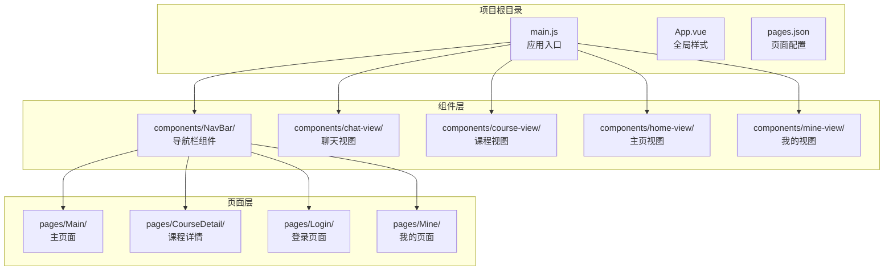
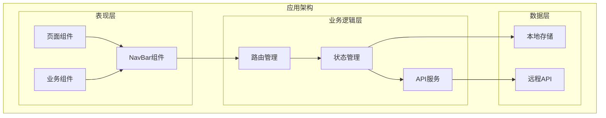
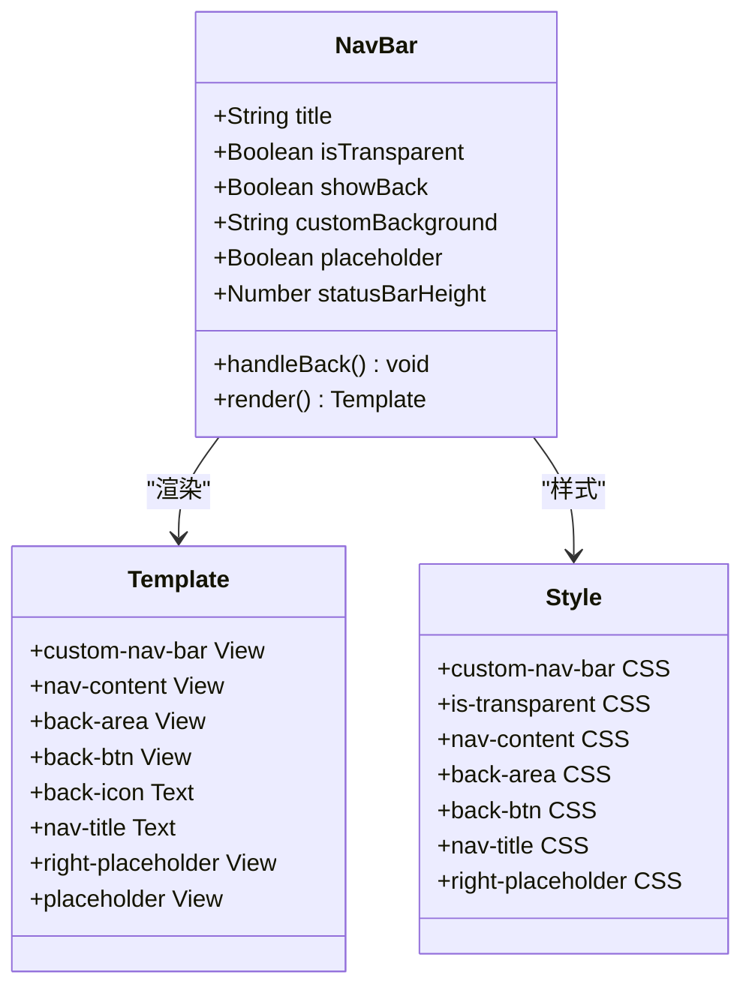
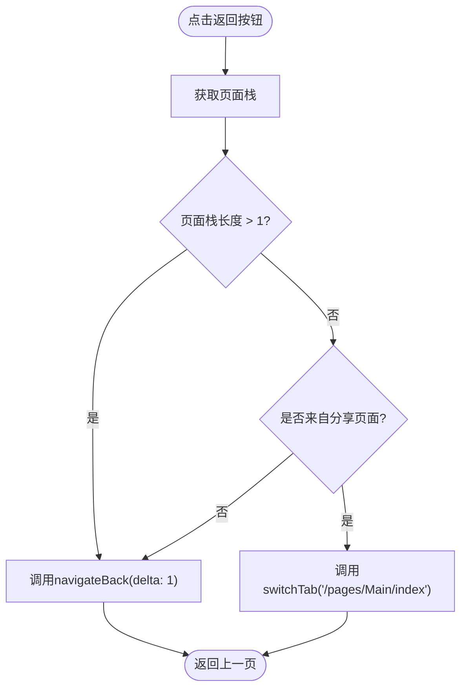
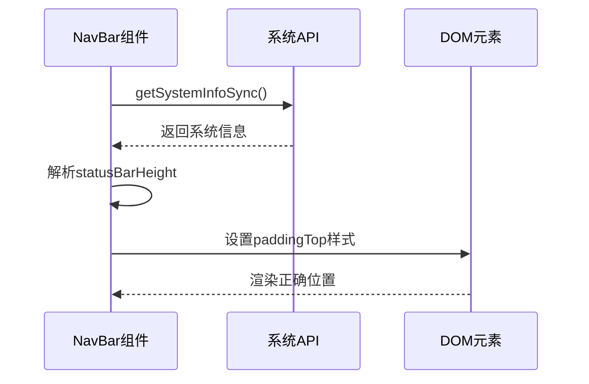
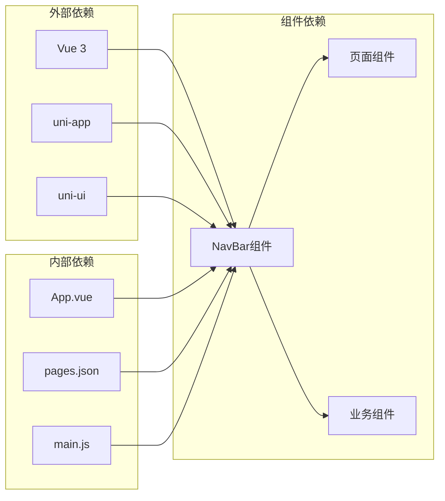
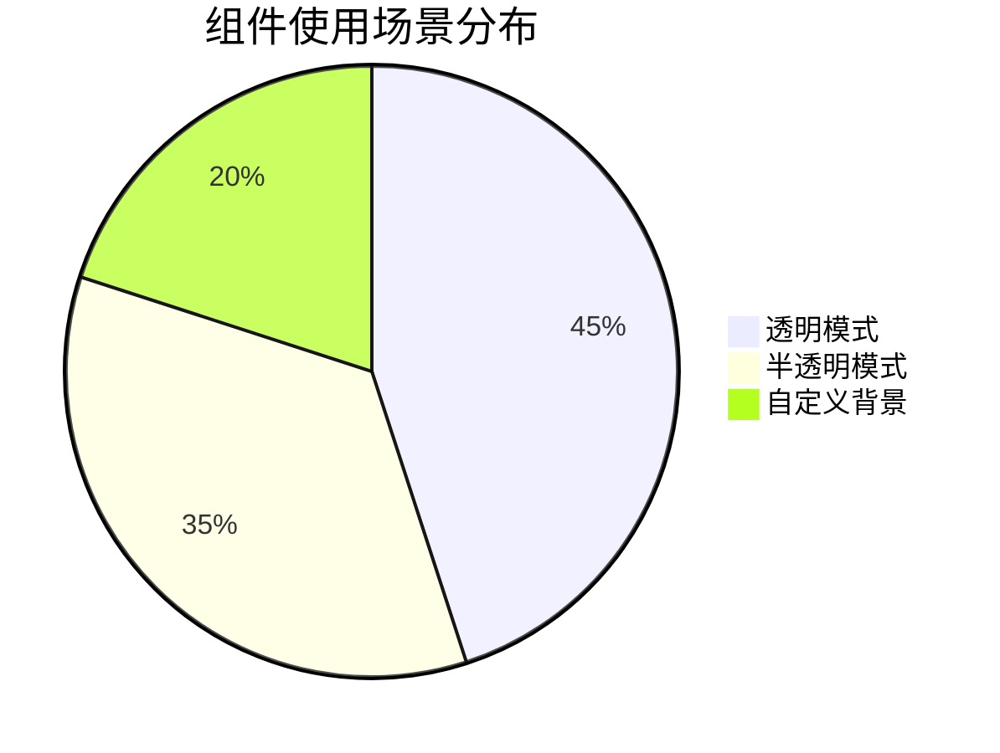

# 基础组件

<cite>
**本文档引用的文件**
- [components/NavBar/index.vue](file://components/NavBar/index.vue)
- [main.js](file://main.js)
- [pages.json](file://pages.json)
- [pages/CourseDetail/index.vue](file://pages/CourseDetail/index.vue)
- [pages/CourseList/index.vue](file://pages/CourseList/index.vue)
- [pages/Mine/profile-edit.vue](file://pages/Mine/profile-edit.vue)
- [pages/Mine/apply-admin/index.vue](file://pages/Mine/apply-admin/index.vue)
- [pages/Mine/apply-admin/list.vue](file://pages/Mine/apply-admin/list.vue)
- [pages/CampEnroll/index.vue](file://pages/CampEnroll/index.vue)
- [App.vue](file://App.vue)
</cite>

## 目录
1. [简介](#简介)
2. [项目结构](#项目结构)
3. [核心组件](#核心组件)
4. [架构概览](#架构概览)
5. [详细组件分析](#详细组件分析)
6. [依赖关系分析](#依赖关系分析)
7. [性能考虑](#性能考虑)
8. [故障排除指南](#故障排除指南)
9. [结论](#结论)
10. [附录](#附录)

## 简介

NavBar（导航栏）是致良知教育项目中的基础UI组件，专为多端应用（H5、小程序、App）设计。该组件提供了统一的导航体验，支持响应式设计、状态管理、事件处理和样式定制。组件采用Vue 3 Composition API实现，具备智能返回逻辑、状态栏适配和跨平台兼容性。

## 项目结构

致良知教育项目采用模块化架构，NavBar组件位于components目录下，通过全局注册的方式在所有页面中可用。

**图表来源**
- [main.js:14-25](file://main.js#L14-L25)
- [components/NavBar/index.vue:1-68](file://components/NavBar/index.vue#L1-L68)

**章节来源**
- [main.js:1-26](file://main.js#L1-L26)
- [pages.json:1-131](file://pages.json#L1-L131)

## 核心组件

### 组件概述

NavBar组件是一个轻量级的导航栏解决方案，具有以下核心特性：

- **响应式设计**：自动适配不同设备的状态栏高度
- **智能返回**：根据页面栈深度智能处理返回逻辑
- **透明模式**：支持覆盖在内容上方的透明导航栏
- **自定义样式**：支持背景色、标题颜色等样式定制
- **跨平台兼容**：统一的API接口，支持多端运行

### 属性配置详解

| 属性名 | 类型 | 默认值 | 描述 |
|--------|------|--------|------|
| title | String | '' | 导航栏标题文本 |
| isTransparent | Boolean | false | 是否启用透明模式（覆盖在内容上方） |
| showBack | Boolean | true | 是否显示返回按钮 |
| customBackground | String | '' | 自定义背景色（优先级高于透明模式） |
| placeholder | Boolean | true | 是否在非透明模式下添加占位元素 |

### 核心功能实现

组件的核心功能通过以下机制实现：

1. **状态栏适配**：动态获取系统状态栏高度，确保导航栏正确定位
2. **智能返回逻辑**：根据页面栈深度决定返回或切换Tab
3. **响应式样式**：根据透明模式动态调整样式类
4. **事件处理**：统一的点击事件处理机制

**章节来源**
- [components/NavBar/index.vue:26-32](file://components/NavBar/index.vue#L26-L32)
- [components/NavBar/index.vue:34-48](file://components/NavBar/index.vue#L34-L48)

## 架构概览

NavBar组件在整个应用架构中扮演着关键角色，作为UI层的基础组件，它与业务逻辑层和数据层都有清晰的边界。

**图表来源**
- [main.js:18-21](file://main.js#L18-L21)
- [pages.json:2-7](file://pages.json#L2-L7)

## 详细组件分析

### 组件结构分析

**图表来源**
- [components/NavBar/index.vue:1-68](file://components/NavBar/index.vue#L1-L68)

### 智能返回逻辑

组件实现了智能的返回处理机制，能够根据不同场景提供合适的导航行为：

**图表来源**
- [components/NavBar/index.vue:39-48](file://components/NavBar/index.vue#L39-L48)

### 状态栏适配机制

组件通过系统API动态获取状态栏高度，确保在不同设备上都能正确显示：

**图表来源**
- [components/NavBar/index.vue:34-37](file://components/NavBar/index.vue#L34-L37)

### 样式系统设计

组件采用了灵活的样式系统，支持多种显示模式：

| 模式 | 特征 | 适用场景 |
|------|------|----------|
| 透明模式 | 背景透明，可覆盖内容 | 需要标题覆盖在图片上的场景 |
| 半透明模式 | 白色背景+毛玻璃效果 | 通用场景，提供良好的可读性 |
| 自定义模式 | 支持自定义背景色 | 品牌化需求，统一视觉风格 |

**章节来源**
- [components/NavBar/index.vue:51-68](file://components/NavBar/index.vue#L51-L68)

## 依赖关系分析

### 组件依赖图

**图表来源**
- [main.js:1-26](file://main.js#L1-L26)
- [package.json:1-6](file://package.json#L1-L6)

### 使用场景分布

NavBar组件在项目中广泛应用于各个页面，根据不同需求采用不同的配置：

**图表来源**
- [pages/CourseDetail/index.vue:4](file://pages/CourseDetail/index.vue#L4)
- [pages/CourseList/index.vue:3](file://pages/CourseList/index.vue#L3)
- [pages/Mine/profile-edit.vue:4](file://pages/Mine/profile-edit.vue#L4)

**章节来源**
- [pages/CourseDetail/index.vue:1-65](file://pages/CourseDetail/index.vue#L1-L65)
- [pages/CourseList/index.vue:1-10](file://pages/CourseList/index.vue#L1-L10)
- [pages/Mine/profile-edit.vue:1-10](file://pages/Mine/profile-edit.vue#L1-L10)

## 性能考虑

### 渲染优化策略

1. **条件渲染**：根据showBack属性动态控制返回按钮的渲染
2. **样式类切换**：通过CSS类名切换而非内联样式的频繁修改
3. **事件处理优化**：使用一次性事件绑定，避免重复绑定

### 内存管理

- **响应式数据**：仅在需要时更新状态
- **生命周期管理**：合理利用组件生命周期钩子
- **资源释放**：避免内存泄漏，特别是在页面切换时

### 跨平台性能

- **API适配**：使用uni-app提供的跨平台API
- **样式兼容**：确保在不同平台上的样式一致性
- **事件处理**：统一的事件处理机制减少平台差异

## 故障排除指南

### 常见问题及解决方案

| 问题类型 | 症状 | 可能原因 | 解决方案 |
|----------|------|----------|----------|
| 导航栏不显示 | 导航栏完全不可见 | isTransparent设置错误 | 检查属性配置，确保showBack设置正确 |
| 返回功能异常 | 点击返回无响应 | 页面栈过浅 | 检查页面栈深度，必要时调整导航策略 |
| 样式错乱 | 导航栏样式不符合预期 | 自定义样式冲突 | 检查CSS优先级，避免样式覆盖 |
| 状态栏适配问题 | 导航栏位置不正确 | 系统信息获取失败 | 检查系统API调用，确保兼容性 |

### 调试技巧

1. **控制台日志**：在关键节点添加console.log输出
2. **属性检查**：验证props传递的正确性
3. **样式检查**：使用开发者工具检查最终渲染的样式
4. **事件监听**：确认事件绑定和解绑的正确性

**章节来源**
- [components/NavBar/index.vue:39-48](file://components/NavBar/index.vue#L39-L48)

## 结论

NavBar组件作为致良知教育项目的基础UI组件，展现了优秀的架构设计和实现质量。组件具备以下优势：

1. **设计理念先进**：采用响应式设计和智能逻辑处理
2. **实现细节完善**：属性配置丰富，事件处理合理
3. **跨平台兼容**：统一的API接口支持多端运行
4. **性能优化到位**：渲染和内存管理策略得当

该组件为整个项目的用户体验提供了坚实的基础，建议在后续开发中继续遵循现有的设计模式和最佳实践。

## 附录

### 最佳实践指南

1. **属性使用规范**
   - 透明模式适用于需要标题覆盖在图片上的场景
   - 半透明模式适合大多数通用场景
   - 自定义背景用于品牌化需求

2. **性能优化建议**
   - 避免频繁修改复杂样式属性
   - 合理使用条件渲染
   - 注意事件处理的性能影响

3. **跨平台开发要点**
   - 使用uni-app提供的跨平台API
   - 测试不同平台的兼容性
   - 关注平台特定的样式差异

### 组件扩展方向

1. **功能增强**
   - 添加更多自定义选项
   - 支持更多的导航模式
   - 增强主题定制能力

2. **性能提升**
   - 实现更精细的渲染优化
   - 减少不必要的计算
   - 优化事件处理机制