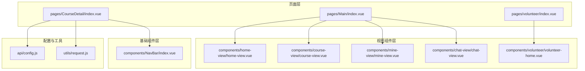
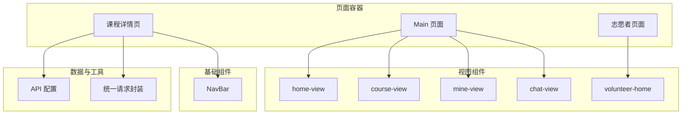
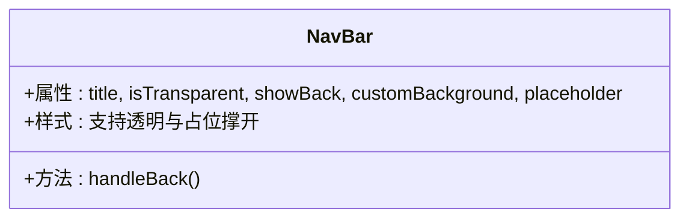
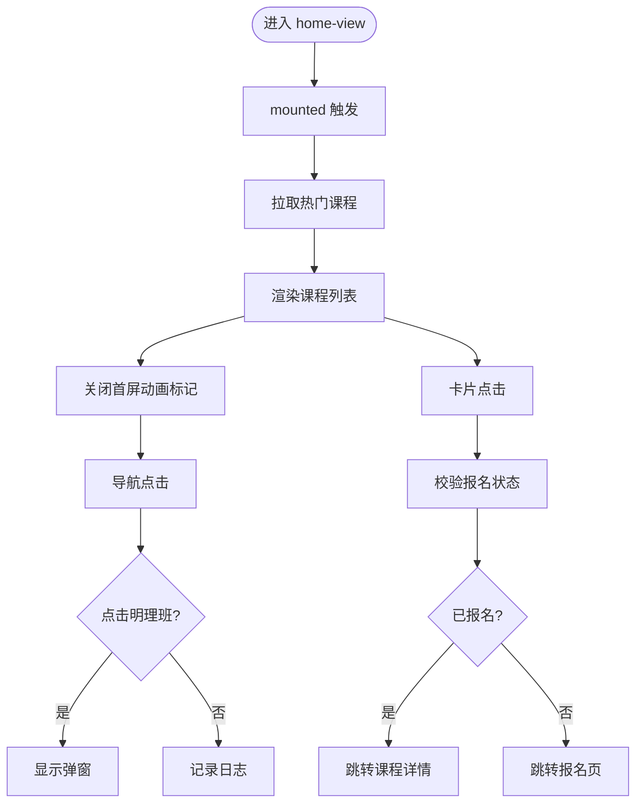
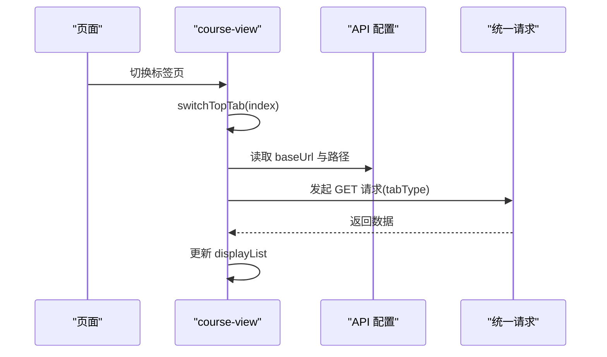
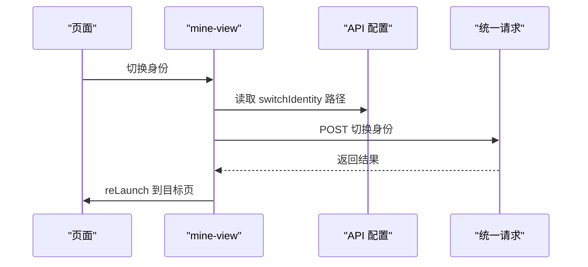
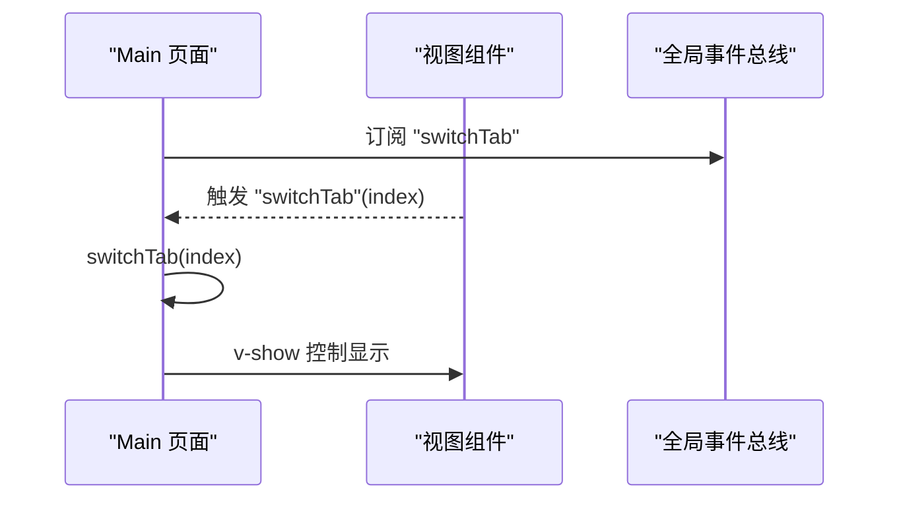
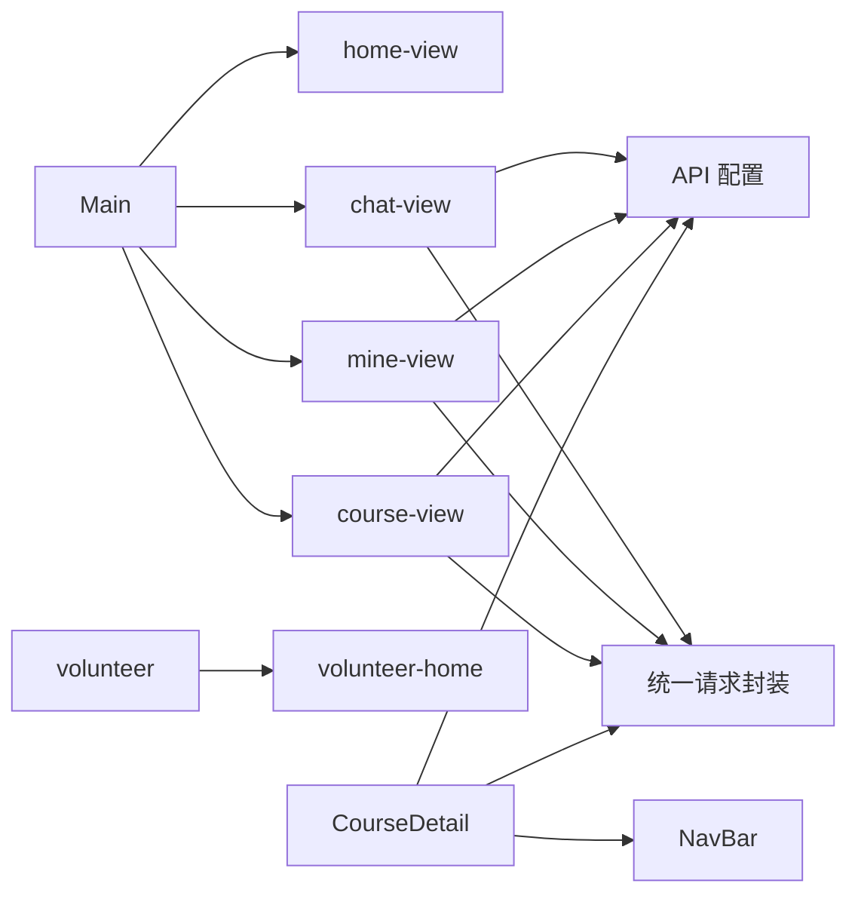

# 组件系统架构

<cite>
**本文引用的文件**
- [App.vue](file://App.vue)
- [main.js](file://main.js)
- [pages.json](file://pages.json)
- [components/NavBar/index.vue](file://components/NavBar/index.vue)
- [components/home-view/home-view.vue](file://components/home-view/home-view.vue)
- [components/course-view/course-view.vue](file://components/course-view/course-view.vue)
- [components/mine-view/mine-view.vue](file://components/mine-view/mine-view.vue)
- [components/chat-view/chat-view.vue](file://components/chat-view/chat-view.vue)
- [components/volunteer/volunteer-home.vue](file://components/volunteer/volunteer-home.vue)
- [pages/Main/index.vue](file://pages/Main/index.vue)
- [pages/volunteer/index.vue](file://pages/volunteer/index.vue)
- [pages/CourseDetail/index.vue](file://pages/CourseDetail/index.vue)
- [api/config.js](file://api/config.js)
- [utils/request.js](file://utils/request.js)
</cite>

## 目录
1. [引言](#引言)
2. [项目结构](#项目结构)
3. [核心组件](#核心组件)
4. [架构总览](#架构总览)
5. [详细组件分析](#详细组件分析)
6. [依赖关系分析](#依赖关系分析)
7. [性能考量](#性能考量)
8. [故障排查指南](#故障排查指南)
9. [结论](#结论)
10. [附录](#附录)

## 引言
本文件面向致良知教育项目，系统性梳理组件化设计策略与架构实践，聚焦以下目标：
- 组件分类体系：基础组件（如 NavBar）、业务组件（视图组件，如 home-view、course-view、mine-view、chat-view、volunteer-home）与页面组件（如 Main、volunteer、CourseDetail）之间的关系与职责边界。
- 组件间通信机制：props 传递、事件处理、全局事件总线（uni.$emit/$on）与路由跳转。
- 生命周期管理、状态共享与数据流向：组件挂载、刷新、卸载与跨组件数据联动。
- 最佳实践与性能优化策略：可复用性、解耦、渲染性能与网络请求统一处理。

## 项目结构
项目采用“页面组件 + 视图组件 + 基础组件”的分层组织方式：
- 页面组件：pages 目录下的页面，负责容器布局、底部导航、路由与全局事件监听。
- 视图组件：components 目录下的业务视图，封装具体业务场景（首页、课程、我的、群聊、志愿者）。
- 基础组件：components/NavBar 等通用 UI 基元。
- 配置与工具：api/config.js 提供 API 基础地址与路径；utils/request.js 提供统一请求封装。

图表来源
- [pages/Main/index.vue:1-224](file://pages/Main/index.vue#L1-L224)
- [pages/volunteer/index.vue:1-210](file://pages/volunteer/index.vue#L1-L210)
- [pages/CourseDetail/index.vue:1-384](file://pages/CourseDetail/index.vue#L1-L384)
- [components/home-view/home-view.vue:1-772](file://components/home-view/home-view.vue#L1-L772)
- [components/course-view/course-view.vue:1-496](file://components/course-view/course-view.vue#L1-L496)
- [components/mine-view/mine-view.vue:1-910](file://components/mine-view/mine-view.vue#L1-L910)
- [components/chat-view/chat-view.vue:1-156](file://components/chat-view/chat-view.vue#L1-L156)
- [components/volunteer/volunteer-home.vue:1-404](file://components/volunteer/volunteer-home.vue#L1-L404)
- [components/NavBar/index.vue:1-68](file://components/NavBar/index.vue#L1-L68)
- [api/config.js:1-60](file://api/config.js#L1-L60)
- [utils/request.js:1-98](file://utils/request.js#L1-L98)

章节来源
- [pages.json:1-131](file://pages.json#L1-L131)
- [main.js:1-26](file://main.js#L1-L26)

## 核心组件
- 基础组件（NavBar）
  - 职责：提供统一的自定义导航栏，支持透明模式、返回逻辑、占位与样式定制。
  - 关键特性：动态计算状态栏高度、智能返回（多页返回或首页 Tab 切换）、可选占位撑开文档流。
- 视图组件（home-view、course-view、mine-view、chat-view、volunteer-home）
  - home-view：首页聚合展示、热门课程拉取、弹窗交互。
  - course-view：课程列表视图，含标签页切换、课程卡片、进度与状态展示、刷新事件订阅。
  - mine-view：个人中心，含身份切换、用户信息拉取、常用服务与菜单、登出流程。
  - chat-view：群聊列表，按需加载、空状态处理、跳转详情。
  - volunteer-home：志愿者首页，含导航宫格、知行打卡、初心墙等。
- 页面组件（Main、volunteer、CourseDetail）
  - Main：底部导航容器，切换 home/course/mine/chat 四个视图，统一处理状态栏占位与全局事件。
  - volunteer：志愿者子应用容器，切换首页/作业/我的/统计四个视图，并转发刷新事件。
  - CourseDetail：课程详情页，引入 NavBar，按标签页切换不同业务模块（课程安排、今日课程、数据看板等）。

章节来源
- [components/NavBar/index.vue:1-68](file://components/NavBar/index.vue#L1-L68)
- [components/home-view/home-view.vue:1-772](file://components/home-view/home-view.vue#L1-L772)
- [components/course-view/course-view.vue:1-496](file://components/course-view/course-view.vue#L1-L496)
- [components/mine-view/mine-view.vue:1-910](file://components/mine-view/mine-view.vue#L1-L910)
- [components/chat-view/chat-view.vue:1-156](file://components/chat-view/chat-view.vue#L1-L156)
- [components/volunteer/volunteer-home.vue:1-404](file://components/volunteer/volunteer-home.vue#L1-L404)
- [pages/Main/index.vue:1-224](file://pages/Main/index.vue#L1-L224)
- [pages/volunteer/index.vue:1-210](file://pages/volunteer/index.vue#L1-L210)
- [pages/CourseDetail/index.vue:1-384](file://pages/CourseDetail/index.vue#L1-L384)

## 架构总览
整体采用“页面容器 + 视图组件 + 基础组件”的组合式架构，页面组件负责布局与导航，视图组件承载业务逻辑与数据，基础组件提供通用能力。数据流通过 props 与全局事件双向联动，API 请求通过统一工具封装。

图表来源
- [pages/Main/index.vue:1-224](file://pages/Main/index.vue#L1-L224)
- [pages/volunteer/index.vue:1-210](file://pages/volunteer/index.vue#L1-L210)
- [pages/CourseDetail/index.vue:1-384](file://pages/CourseDetail/index.vue#L1-L384)
- [components/NavBar/index.vue:1-68](file://components/NavBar/index.vue#L1-L68)
- [api/config.js:1-60](file://api/config.js#L1-L60)
- [utils/request.js:1-98](file://utils/request.js#L1-L98)

## 详细组件分析

### 基础组件：NavBar
- 设计要点
  - 通过 props 接收标题、透明模式、返回按钮显隐、自定义背景与占位开关。
  - 动态读取系统状态栏高度，适配不同机型。
  - 智能返回：多页时返回上一页，单页时兜底跳转首页 Tab。
- 适用场景
  - 课程详情页、业务模块页头部统一导航。

图表来源
- [components/NavBar/index.vue:1-68](file://components/NavBar/index.vue#L1-L68)

章节来源
- [components/NavBar/index.vue:1-68](file://components/NavBar/index.vue#L1-L68)
- [pages/CourseDetail/index.vue:1-65](file://pages/CourseDetail/index.vue#L1-L65)

### 视图组件：home-view
- 数据与状态
  - 首屏加载控制、导航配置、课程列表、弹窗状态。
- 生命周期
  - mounted 中触发热门课程拉取，并在动画结束后关闭首屏加载态。
- 交互与事件
  - 导航点击处理、跳转全部课程、课程卡片点击校验报名状态并跳转详情或报名页。
- 性能
  - 首屏动画延迟控制，避免热切换卡顿。

图表来源
- [components/home-view/home-view.vue:183-261](file://components/home-view/home-view.vue#L183-L261)

章节来源
- [components/home-view/home-view.vue:1-772](file://components/home-view/home-view.vue#L1-L772)

### 视图组件：course-view
- 数据与状态
  - 标签页索引、显示列表、状态栏高度、首屏加载标记。
- 生命周期
  - onMounted 读取系统信息、默认加载“正在学习”，动画结束后关闭首屏加载。
- 事件与刷新
  - 订阅全局刷新事件，按当前标签页重新拉取数据。
- 交互与事件
  - 切换标签页 -> 拉取对应 tabType 数据 -> 更新显示列表。

图表来源
- [components/course-view/course-view.vue:195-219](file://components/course-view/course-view.vue#L195-L219)
- [api/config.js:1-60](file://api/config.js#L1-L60)
- [utils/request.js:1-98](file://utils/request.js#L1-L98)

章节来源
- [components/course-view/course-view.vue:1-496](file://components/course-view/course-view.vue#L1-L496)

### 视图组件：mine-view
- 数据与状态
  - 用户信息、身份标识、统计数据、菜单项集合。
- 生命周期
  - mounted 读取系统信息、拉取本地与远端用户信息、动画结束后关闭首屏加载。
- 事件与交互
  - 身份切换：调用后端接口并 reLaunch 到目标页面。
  - 菜单点击：未登录引导登录；部分菜单携带 path 直接跳转。
  - 登出：统一请求登出接口，清理缓存并回到登录页。
- 注意
  - 代码中存在强制将当前身份锁定为“学员端”的逻辑，需关注业务一致性。

图表来源
- [components/mine-view/mine-view.vue:270-310](file://components/mine-view/mine-view.vue#L270-L310)
- [api/config.js:1-60](file://api/config.js#L1-L60)
- [utils/request.js:1-98](file://utils/request.js#L1-L98)

章节来源
- [components/mine-view/mine-view.vue:1-910](file://components/mine-view/mine-view.vue#L1-L910)

### 视图组件：chat-view
- 数据与状态
  - token、群组列表。
- 生命周期
  - mounted 与 onShow 时均尝试加载群组列表。
- 交互
  - 点击群组 -> 跳转聊天详情页。

章节来源
- [components/chat-view/chat-view.vue:1-156](file://components/chat-view/chat-view.vue#L1-L156)

### 视图组件：volunteer-home
- 数据与状态
  - 导航宫格、今日日期、打卡状态。
- 生命周期
  - mounted 初始化日期与打卡状态。
- 交互
  - 点击宫格 -> 跳转对应页面（含失败兜底提示）。
  - 点击“点击打卡” -> 写入本地存储并禁用按钮。

章节来源
- [components/volunteer/volunteer-home.vue:1-404](file://components/volunteer/volunteer-home.vue#L1-L404)

### 页面组件：Main
- 结构
  - 顶部状态栏占位、内容区按标签页切换 home-view、course-view、mine-view、chat-view。
- 事件
  - onLoad 订阅全局事件“switchTab”，onUnload 解绑。
- 交互
  - 底部导航点击 -> 切换当前标签页。

图表来源
- [pages/Main/index.vue:99-114](file://pages/Main/index.vue#L99-L114)

章节来源
- [pages/Main/index.vue:1-224](file://pages/Main/index.vue#L1-L224)

### 页面组件：volunteer
- 结构
  - 容器内切换 volunteer-home、volunteer-task、volunteer-mine、volunteer-stats。
- 事件
  - onLoad 订阅“switchTab”与“refreshManagementScope”，转发给子视图刷新事件。
- 交互
  - 底部导航点击 -> 切换当前标签页并触发对应刷新事件。

章节来源
- [pages/volunteer/index.vue:1-210](file://pages/volunteer/index.vue#L1-L210)

### 页面组件：CourseDetail
- 结构
  - 引入 NavBar，顶部固定区，滚动区模块化（营期介绍、课程安排、今日课程、课程数据）。
- 数据与状态
  - 当前标签页、课程 ID、课程信息。
- 生命周期
  - onLoad 读取参数并拉取课程信息。
- 交互
  - 标签页切换 -> 展示对应模块。

章节来源
- [pages/CourseDetail/index.vue:1-384](file://pages/CourseDetail/index.vue#L1-L384)

## 依赖关系分析
- 组件依赖
  - 页面组件依赖视图组件（Main 依赖 home-view、course-view、mine-view、chat-view；volunteer 依赖 volunteer-home 等）。
  - 视图组件依赖 API 配置与统一请求封装。
  - 课程详情页依赖 NavBar、API 配置与统一请求封装。
- 事件依赖
  - 页面组件通过 uni.$on/$off 管理全局事件，视图组件通过 uni.$emit 触发刷新或页面切换。
- 配置与工具
  - API 配置集中管理，统一请求封装自动注入 Authorization 与错误处理。

图表来源
- [pages/Main/index.vue:53-60](file://pages/Main/index.vue#L53-L60)
- [pages/volunteer/index.vue:44-57](file://pages/volunteer/index.vue#L44-L57)
- [pages/CourseDetail/index.vue:67-76](file://pages/CourseDetail/index.vue#L67-L76)
- [api/config.js:1-60](file://api/config.js#L1-L60)
- [utils/request.js:1-98](file://utils/request.js#L1-L98)

章节来源
- [pages/Main/index.vue:1-224](file://pages/Main/index.vue#L1-L224)
- [pages/volunteer/index.vue:1-210](file://pages/volunteer/index.vue#L1-L210)
- [pages/CourseDetail/index.vue:1-384](file://pages/CourseDetail/index.vue#L1-L384)
- [api/config.js:1-60](file://api/config.js#L1-L60)
- [utils/request.js:1-98](file://utils/request.js#L1-L98)

## 性能考量
- 首屏动画与热切换
  - 首屏加载态在最长动画完成后关闭，避免热切换时动画抖动。
- 列表渲染
  - 使用 v-for 渲染列表，建议结合 key 与虚拟列表（如需）优化长列表性能。
- 网络请求
  - 统一请求封装处理 401 与错误码，减少重复判断。
- 图标与资源
  - 使用远程图标时注意缓存与体积，必要时替换为本地资源以提升稳定性。

## 故障排查指南
- 登录态失效
  - 统一请求封装检测 401，清除 token 并跳转登录页。
- 页面跳转失败
  - 检查 pages.json 中页面路径配置，确保路径正确且存在。
- 身份切换异常
  - 确认后端接口返回与前端强制身份逻辑的一致性，避免业务冲突。
- 课程列表不刷新
  - 确认页面是否订阅并转发了“refreshCourseList”事件，以及当前标签页是否正确。

章节来源
- [utils/request.js:24-67](file://utils/request.js#L24-L67)
- [pages.json:1-131](file://pages.json#L1-L131)
- [components/mine-view/mine-view.vue:270-310](file://components/mine-view/mine-view.vue#L270-L310)
- [components/course-view/course-view.vue:216-223](file://components/course-view/course-view.vue#L216-L223)

## 结论
本项目通过清晰的组件分层与统一的通信机制，实现了页面容器、视图组件与基础组件的高内聚低耦合。配合统一的 API 配置与请求封装，提升了可维护性与扩展性。建议在后续迭代中进一步完善：
- 统一状态管理（如 Pinia）以降低全局事件耦合。
- 长列表与复杂交互场景的性能优化。
- 页面路径与权限的集中化治理。

## 附录
- 组件分类与职责
  - 基础组件：NavBar（通用导航）
  - 视图组件：home-view、course-view、mine-view、chat-view、volunteer-home（业务场景）
  - 页面组件：Main、volunteer、CourseDetail（容器与路由）
- 通信与数据流
  - props：父传子（如 NavBar 的标题、透明模式）
  - 事件：子触发（如 mine-view 的菜单点击、course-view 的刷新事件）
  - 路由：uni.navigateTo/uni.reLaunch/uni.switchTab
- 最佳实践
  - 组件职责单一、可复用性强
  - 生命周期钩子中只做初始化与清理
  - 统一错误处理与登录态校验
  - 首屏动画与热切换的性能平衡