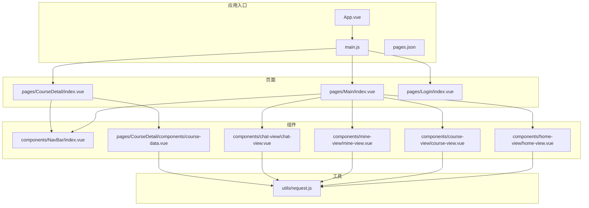
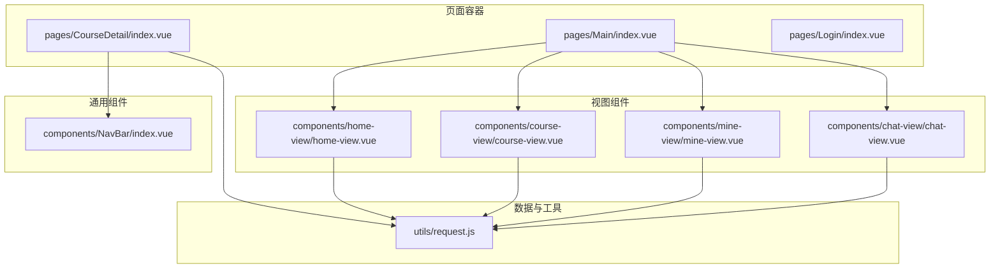
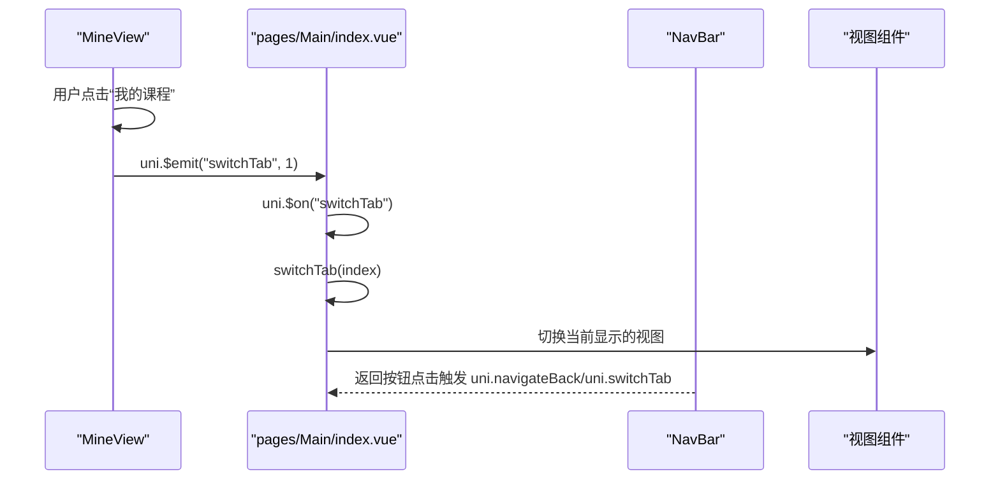
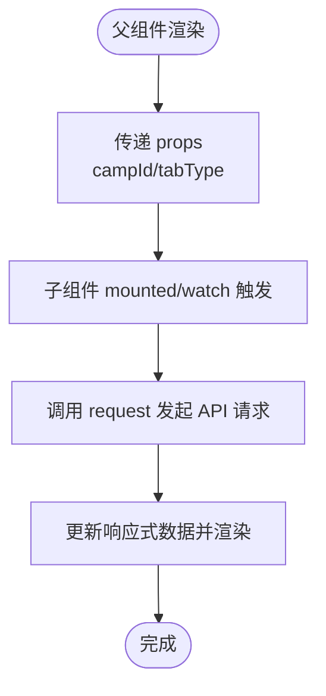
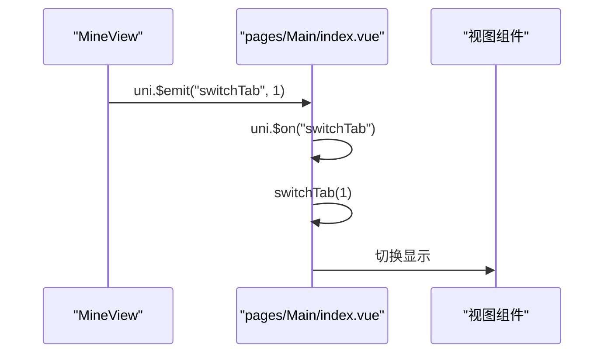
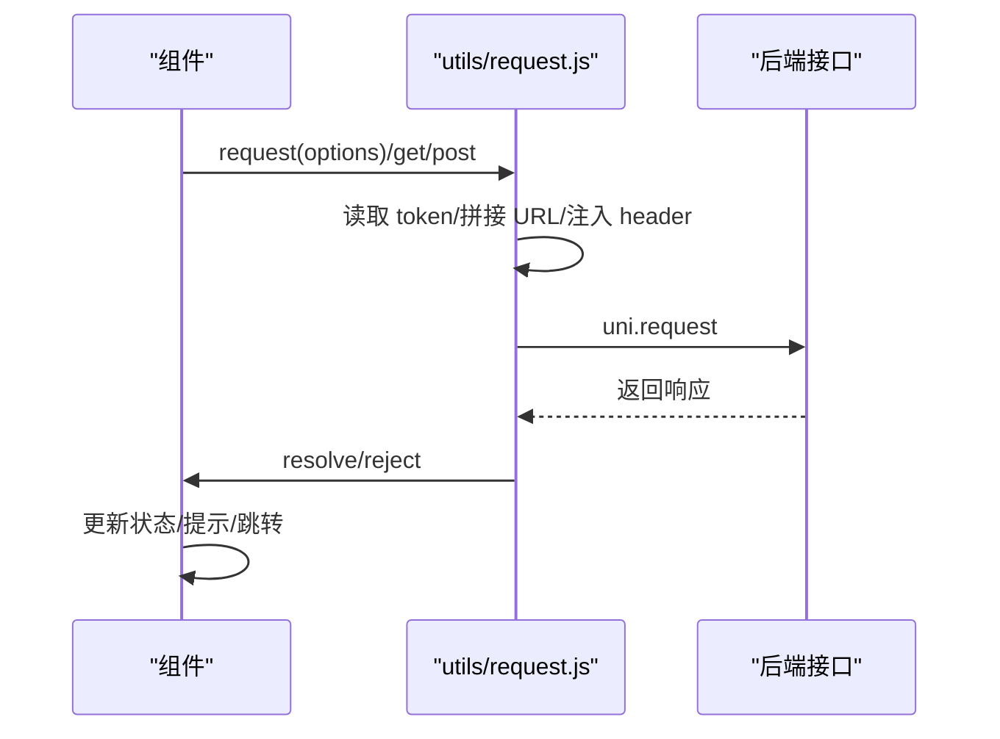
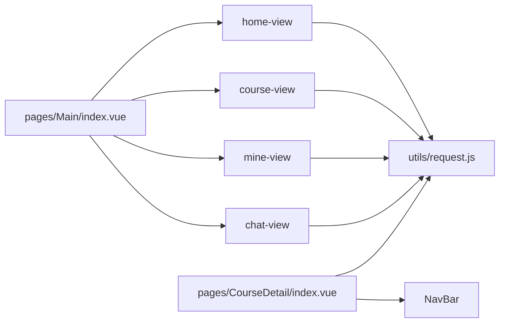

# 组件通信机制

<cite>
**本文引用的文件**
- [App.vue](file://App.vue)
- [main.js](file://main.js)
- [pages.json](file://pages.json)
- [package.json](file://package.json)
- [utils/request.js](file://utils/request.js)
- [components/NavBar/index.vue](file://components/NavBar/index.vue)
- [pages/Main/index.vue](file://pages/Main/index.vue)
- [pages/CourseDetail/index.vue](file://pages/CourseDetail/index.vue)
- [pages/CourseDetail/components/course-data.vue](file://pages/CourseDetail/components/course-data.vue)
- [pages/Login/index.vue](file://pages/Login/index.vue)
- [components/home-view/home-view.vue](file://components/home-view/home-view.vue)
- [components/course-view/course-view.vue](file://components/course-view/course-view.vue)
- [components/mine-view/mine-view.vue](file://components/mine-view/mine-view.vue)
- [components/chat-view/chat-view.vue](file://components/chat-view/chat-view.vue)
</cite>

## 目录
1. [简介](#简介)
2. [项目结构](#项目结构)
3. [核心组件](#核心组件)
4. [架构总览](#架构总览)
5. [详细组件分析](#详细组件分析)
6. [依赖关系分析](#依赖关系分析)
7. [性能考量](#性能考量)
8. [故障排查指南](#故障排查指南)
9. [结论](#结论)
10. [附录](#附录)

## 简介
本文件聚焦“致良知教育”项目的组件通信机制，系统梳理父子组件通信、兄弟组件通信与跨层级通信的实现方式，结合项目现有代码，总结 props 传递、事件发射、全局事件总线、provide/inject 的使用场景，并给出最佳实践、性能优化策略、API 调用与组件通信的集成模式、调试方法与常见问题排查。

## 项目结构
项目采用基于页面与组件的分层组织，页面通过组件组合形成视图，组件之间通过 props、事件与全局事件总线进行通信；API 请求封装在统一工具中，供各组件按需调用。

图表来源
- [main.js:1-26](file://main.js#L1-L26)
- [pages.json:1-131](file://pages.json#L1-L131)
- [components/NavBar/index.vue:1-68](file://components/NavBar/index.vue#L1-L68)
- [pages/Main/index.vue:1-224](file://pages/Main/index.vue#L1-L224)
- [pages/CourseDetail/index.vue:1-384](file://pages/CourseDetail/index.vue#L1-L384)
- [pages/CourseDetail/components/course-data.vue:1-573](file://pages/CourseDetail/components/course-data.vue#L1-L573)
- [pages/Login/index.vue:1-900](file://pages/Login/index.vue#L1-L900)
- [components/home-view/home-view.vue:1-772](file://components/home-view/home-view.vue#L1-L772)
- [components/course-view/course-view.vue:1-496](file://components/course-view/course-view.vue#L1-L496)
- [components/mine-view/mine-view.vue:1-910](file://components/mine-view/mine-view.vue#L1-L910)
- [components/chat-view/chat-view.vue:1-156](file://components/chat-view/chat-view.vue#L1-L156)
- [utils/request.js:1-98](file://utils/request.js#L1-L98)

章节来源
- [main.js:1-26](file://main.js#L1-L26)
- [pages.json:1-131](file://pages.json#L1-L131)

## 核心组件
- 应用入口与全局样式：App.vue 提供全局样式与主题变量；main.js 注册全局组件与运行环境初始化；pages.json 管理页面路由与全局样式。
- 页面级容器：pages/Main/index.vue 作为主容器，聚合多个视图组件并通过全局事件总线实现底部导航切换。
- 课程详情页：pages/CourseDetail/index.vue 作为父组件，向子组件传递 campId 等 props，并通过子组件 course-data.vue 展示数据。
- 通用导航栏：components/NavBar/index.vue 以 props 接收标题、透明度等参数，内部处理返回逻辑。
- API 请求封装：utils/request.js 统一封装请求、鉴权与错误处理，供各组件调用。

章节来源
- [App.vue:1-40](file://App.vue#L1-L40)
- [main.js:1-26](file://main.js#L1-L26)
- [pages.json:1-131](file://pages.json#L1-L131)
- [pages/Main/index.vue:1-224](file://pages/Main/index.vue#L1-L224)
- [pages/CourseDetail/index.vue:1-384](file://pages/CourseDetail/index.vue#L1-L384)
- [pages/CourseDetail/components/course-data.vue:1-573](file://pages/CourseDetail/components/course-data.vue#L1-L573)
- [components/NavBar/index.vue:1-68](file://components/NavBar/index.vue#L1-L68)
- [utils/request.js:1-98](file://utils/request.js#L1-L98)

## 架构总览
项目采用“页面容器 + 组件组合”的架构，页面负责布局与全局事件，组件负责具体业务与数据展示；API 请求通过统一工具完成，避免重复逻辑。

图表来源
- [pages/Main/index.vue:1-224](file://pages/Main/index.vue#L1-L224)
- [pages/CourseDetail/index.vue:1-384](file://pages/CourseDetail/index.vue#L1-L384)
- [pages/Login/index.vue:1-900](file://pages/Login/index.vue#L1-L900)
- [components/home-view/home-view.vue:1-772](file://components/home-view/home-view.vue#L1-L772)
- [components/course-view/course-view.vue:1-496](file://components/course-view/course-view.vue#L1-L496)
- [components/mine-view/mine-view.vue:1-910](file://components/mine-view/mine-view.vue#L1-L910)
- [components/chat-view/chat-view.vue:1-156](file://components/chat-view/chat-view.vue#L1-L156)
- [components/NavBar/index.vue:1-68](file://components/NavBar/index.vue#L1-L68)
- [utils/request.js:1-98](file://utils/request.js#L1-L98)

## 详细组件分析

### 页面容器与全局事件总线
- 主容器 pages/Main/index.vue 通过全局事件总线 uni.$on/uni.$off 订阅与取消订阅“switchTab”事件，实现跨组件的导航切换。
- 优点：解耦页面与视图组件，便于扩展新的视图。
- 注意：生命周期中务必在卸载时移除监听，避免内存泄漏。

图表来源
- [components/mine-view/mine-view.vue:312-338](file://components/mine-view/mine-view.vue#L312-L338)
- [pages/Main/index.vue:99-114](file://pages/Main/index.vue#L99-L114)
- [components/NavBar/index.vue:39-48](file://components/NavBar/index.vue#L39-L48)

章节来源
- [pages/Main/index.vue:99-114](file://pages/Main/index.vue#L99-L114)
- [components/mine-view/mine-view.vue:312-338](file://components/mine-view/mine-view.vue#L312-L338)
- [components/NavBar/index.vue:39-48](file://components/NavBar/index.vue#L39-L48)

### 父子组件通信（props 与事件）
- 课程详情页 pages/CourseDetail/index.vue 作为父组件，向子组件 course-data.vue 传递 campId 等 props，子组件通过 watch 监听 props 变化并发起数据请求。
- 课程列表组件 components/course-view/course-view.vue 通过 props 接收 tabType，用于筛选不同状态的课程列表。
- 通用导航栏 components/NavBar/index.vue 通过 props 接收 title、isTransparent、showBack 等参数，实现灵活的头部展示。

图表来源
- [pages/CourseDetail/index.vue:78-145](file://pages/CourseDetail/index.vue#L78-L145)
- [pages/CourseDetail/components/course-data.vue:107-213](file://pages/CourseDetail/components/course-data.vue#L107-L213)
- [components/course-view/course-view.vue:97-199](file://components/course-view/course-view.vue#L97-L199)
- [components/NavBar/index.vue:26-32](file://components/NavBar/index.vue#L26-L32)

章节来源
- [pages/CourseDetail/index.vue:78-145](file://pages/CourseDetail/index.vue#L78-L145)
- [pages/CourseDetail/components/course-data.vue:107-213](file://pages/CourseDetail/components/course-data.vue#L107-L213)
- [components/course-view/course-view.vue:97-199](file://components/course-view/course-view.vue#L97-L199)
- [components/NavBar/index.vue:26-32](file://components/NavBar/index.vue#L26-L32)

### 兄弟组件通信（通过父组件或全局事件）
- 在“我的”页面 components/mine-view/mine-view.vue 中，当用户点击“我的课程”时，通过 uni.$emit("switchTab", 1) 触发全局事件，由主容器 pages/Main/index.vue 监听并切换当前视图。
- 该模式避免了兄弟组件直接耦合，通过事件桥接实现通信。

图表来源
- [components/mine-view/mine-view.vue:321-323](file://components/mine-view/mine-view.vue#L321-L323)
- [pages/Main/index.vue:105-114](file://pages/Main/index.vue#L105-L114)

章节来源
- [components/mine-view/mine-view.vue:321-323](file://components/mine-view/mine-view.vue#L321-L323)
- [pages/Main/index.vue:105-114](file://pages/Main/index.vue#L105-L114)

### 跨层级通信（全局事件总线与 provide/inject）
- 全局事件总线：pages/Main/index.vue 使用 uni.$on/uni.$off 实现跨层级通信；组件间无需共享状态，仅通过事件名约定即可协作。
- provide/inject：当前项目未使用 provide/inject，若存在深层嵌套且需要共享状态的场景，可考虑引入以减少 props 逐层传递。

章节来源
- [pages/Main/index.vue:105-109](file://pages/Main/index.vue#L105-L109)

### API 调用与组件通信的集成模式
- 统一请求封装：utils/request.js 自动注入 token、拼接完整 URL、处理 401 与 HTTP 错误码，并通过 Promise 返回结果。
- 组件调用：各业务组件通过 uni.request 或封装好的 get/post 方法发起请求，成功后更新本地状态并触发 UI 更新。
- 登录流程：pages/Login/index.vue 在登录成功后写入 token 与用户信息，随后通过页面跳转进入主页面；课程详情页与课程列表页在无 token 时自动跳转登录。

图表来源
- [utils/request.js:7-67](file://utils/request.js#L7-L67)
- [pages/Login/index.vue:196-282](file://pages/Login/index.vue#L196-L282)
- [pages/CourseDetail/index.vue:128-139](file://pages/CourseDetail/index.vue#L128-L139)
- [components/course-view/course-view.vue:160-193](file://components/course-view/course-view.vue#L160-L193)

章节来源
- [utils/request.js:7-67](file://utils/request.js#L7-L67)
- [pages/Login/index.vue:196-282](file://pages/Login/index.vue#L196-L282)
- [pages/CourseDetail/index.vue:128-139](file://pages/CourseDetail/index.vue#L128-L139)
- [components/course-view/course-view.vue:160-193](file://components/course-view/course-view.vue#L160-L193)

## 依赖关系分析
- 组件依赖：页面容器依赖多个视图组件；视图组件依赖通用组件（如 NavBar）与 API 工具。
- 事件依赖：全局事件 uni.$emit/$on/$off 形成跨组件通信的弱依赖。
- 工具依赖：所有业务组件依赖 utils/request.js 进行网络请求。

图表来源
- [pages/Main/index.vue:1-224](file://pages/Main/index.vue#L1-L224)
- [pages/CourseDetail/index.vue:1-384](file://pages/CourseDetail/index.vue#L1-L384)
- [components/home-view/home-view.vue:1-772](file://components/home-view/home-view.vue#L1-L772)
- [components/course-view/course-view.vue:1-496](file://components/course-view/course-view.vue#L1-L496)
- [components/mine-view/mine-view.vue:1-910](file://components/mine-view/mine-view.vue#L1-L910)
- [components/chat-view/chat-view.vue:1-156](file://components/chat-view/chat-view.vue#L1-L156)
- [components/NavBar/index.vue:1-68](file://components/NavBar/index.vue#L1-L68)
- [utils/request.js:1-98](file://utils/request.js#L1-L98)

章节来源
- [pages/Main/index.vue:1-224](file://pages/Main/index.vue#L1-L224)
- [pages/CourseDetail/index.vue:1-384](file://pages/CourseDetail/index.vue#L1-L384)
- [components/home-view/home-view.vue:1-772](file://components/home-view/home-view.vue#L1-L772)
- [components/course-view/course-view.vue:1-496](file://components/course-view/course-view.vue#L1-L496)
- [components/mine-view/mine-view.vue:1-910](file://components/mine-view/mine-view.vue#L1-L910)
- [components/chat-view/chat-view.vue:1-156](file://components/chat-view/chat-view.vue#L1-L156)
- [components/NavBar/index.vue:1-68](file://components/NavBar/index.vue#L1-L68)
- [utils/request.js:1-98](file://utils/request.js#L1-L98)

## 性能考量
- 首屏与动画：多个视图组件使用入场动画，建议在组件挂载后延时关闭动画，减少热切换抖动。
- 列表渲染：课程列表与群组列表采用虚拟滚动容器，建议在数据量增大时启用分页或懒加载。
- 请求节流：同一页面频繁切换时，避免重复发起相同请求；可在组件内增加请求去重与缓存策略。
- 事件清理：全局事件监听需在组件卸载时移除，防止内存泄漏与重复触发。

[本节为通用指导，无需列出章节来源]

## 故障排查指南
- 登录态失效：utils/request.js 对 401 进行统一处理并跳转登录；若页面未跳转，检查事件总线是否正确移除与添加。
- 跳转失败：页面跳转失败时，组件会打印错误日志；检查目标页面路径与 pages.json 配置。
- 数据为空：课程详情与课程列表在无数据时展示空状态，检查后端返回字段与前端解析逻辑。
- 事件未触发：全局事件需确保在正确生命周期注册与注销；检查事件名与参数传递。

章节来源
- [utils/request.js:24-66](file://utils/request.js#L24-L66)
- [pages/Login/index.vue:226-260](file://pages/Login/index.vue#L226-L260)
- [pages/CourseDetail/components/course-data.vue:169-199](file://pages/CourseDetail/components/course-data.vue#L169-L199)
- [components/course-view/course-view.vue:160-193](file://components/course-view/course-view.vue#L160-L193)
- [pages/Main/index.vue:105-109](file://pages/Main/index.vue#L105-L109)

## 结论
项目通过“页面容器 + 组件组合 + 全局事件总线 + 统一请求封装”的方式实现了清晰的组件通信与数据流转。父子组件通过 props 与事件协作，兄弟组件通过全局事件桥接，跨层级通信通过事件总线实现。建议在深层嵌套场景引入 provide/inject 以减少 props 传递成本；同时强化请求去重、事件清理与错误处理，持续提升稳定性与性能。

[本节为总结性内容，无需列出章节来源]

## 附录

### 通信模式与最佳实践清单
- 父子通信
  - 使用 props 传递只读数据，子组件通过 watch 监听变化并发起请求。
  - 子组件通过自定义事件向上反馈状态变化。
- 兄弟通信
  - 通过父组件中转或全局事件总线进行解耦通信。
- 跨层级通信
  - 优先使用全局事件总线；深层状态共享可考虑 provide/inject。
- API 集成
  - 统一使用 utils/request.js；在组件内处理成功/失败回调与 UI 更新。
- 性能优化
  - 控制动画与首屏渲染；对高频请求做去重与缓存；及时清理事件监听。
- 调试与排错
  - 记录关键日志（跳转、事件、请求），核对 pages.json 路由配置与事件名一致性。

[本节为通用指导，无需列出章节来源]