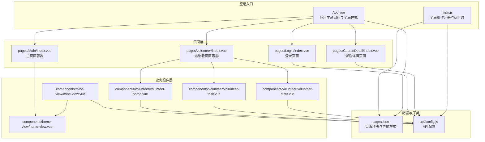
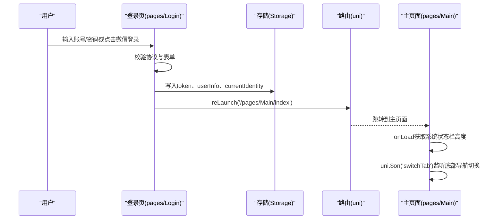
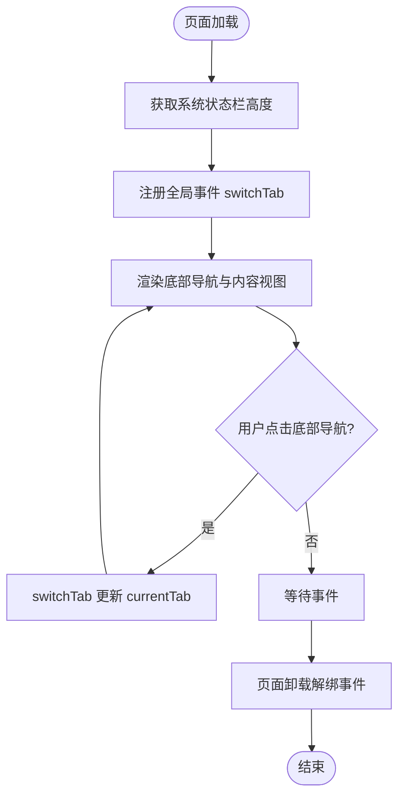
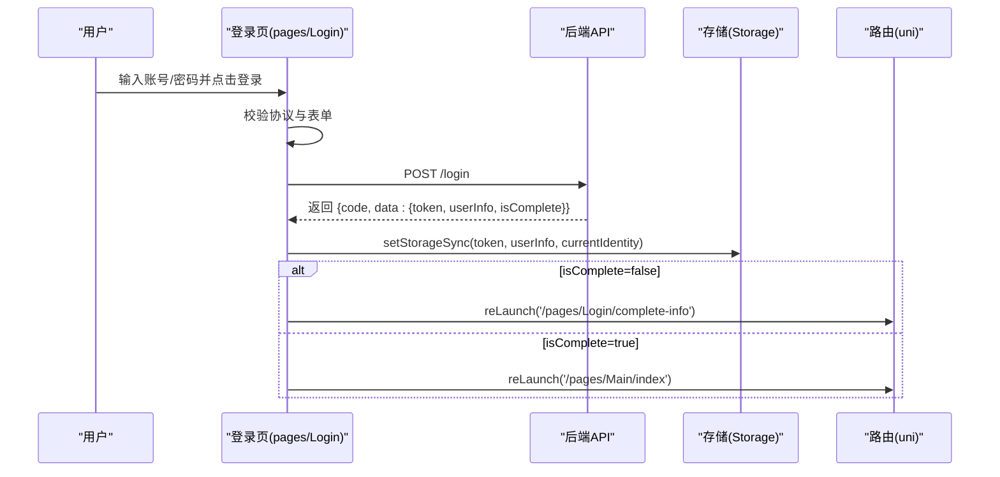
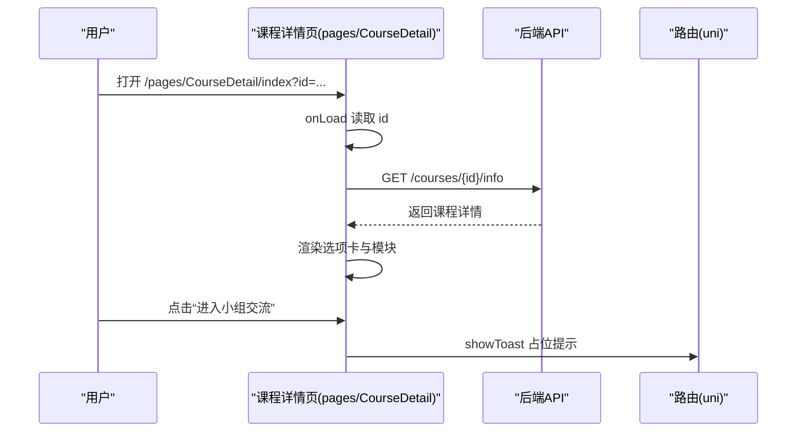
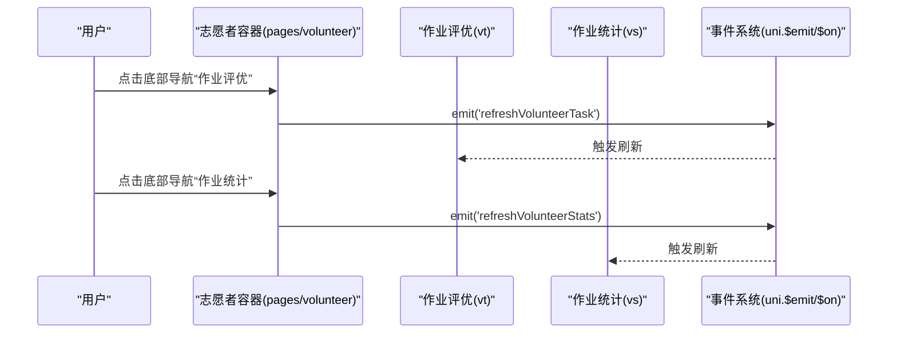
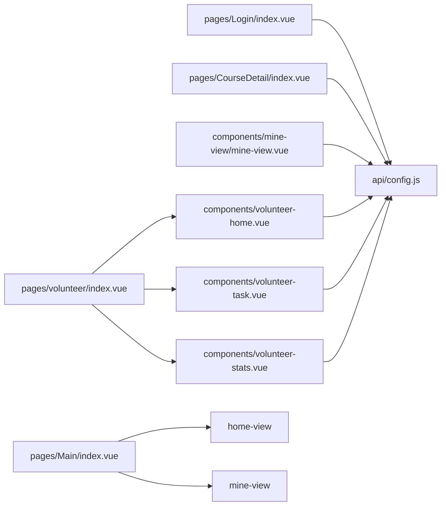

# 页面组件

<cite>
**本文引用的文件**
- [pages.json](file://pages.json)
- [main.js](file://main.js)
- [App.vue](file://App.vue)
- [pages\Main\index.vue](file://pages/Main/index.vue)
- [pages\Login\index.vue](file://pages/Login/index.vue)
- [pages\CourseDetail\index.vue](file://pages\CourseDetail\index.vue)
- [pages\volunteer\index.vue](file://pages\volunteer\index.vue)
- [components\home-view\home-view.vue](file://components\home-view\home-view.vue)
- [components\mine-view\mine-view.vue](file://components\mine-view\mine-view.vue)
- [components\volunteer\volunteer-home.vue](file://components\volunteer\volunteer-home.vue)
- [components\volunteer\volunteer-task.vue](file://components\volunteer\volunteer-task.vue)
- [components\volunteer\volunteer-stats.vue](file://components\volunteer\volunteer-stats.vue)
- [api\config.js](file://api\config.js)
</cite>

## 目录
1. [简介](#简介)
2. [项目结构](#项目结构)
3. [核心组件](#核心组件)
4. [架构总览](#架构总览)
5. [详细组件分析](#详细组件分析)
6. [依赖关系分析](#依赖关系分析)
7. [性能考虑](#性能考虑)
8. [故障排查指南](#故障排查指南)
9. [结论](#结论)
10. [附录](#附录)

## 简介
本文件面向致良知教育项目的页面组件，系统性梳理主页面、课程详情页面、登录页面、个人中心页面与志愿者页面的架构设计与实现模式。内容涵盖路由配置、页面生命周期管理、页面间数据传递、页面与业务组件组合使用、权限控制、状态管理、用户体验优化、SEO优化建议、性能监控与故障排查方法，并提供最佳实践与常见问题解决方案。

## 项目结构
项目采用基于目录的页面组织方式，页面与业务组件分离，页面通过组件组合实现功能模块化。全局样式与应用生命周期在 App.vue 中集中管理；页面注册与导航样式在 pages.json 中统一配置；全局注册与导航栏组件在 main.js 中初始化。

**图表来源**
- [App.vue:1-40](file://App.vue#L1-L40)
- [main.js:14-26](file://main.js#L14-L26)
- [pages.json:1-131](file://pages.json#L1-L131)
- [pages\Main\index.vue:52-116](file://pages\Main\index.vue#L52-L116)
- [pages\Login\index.vue:138-454](file://pages\Login\index.vue#L138-L454)
- [pages\CourseDetail\index.vue:67-146](file://pages\CourseDetail\index.vue#L67-L146)
- [pages\volunteer\index.vue:44-107](file://pages\volunteer\index.vue#L44-L107)
- [components\home-view\home-view.vue:137-263](file://components\home-view\home-view.vue#L137-L263)
- [components\mine-view\mine-view.vue:135-377](file://components\mine-view\mine-view.vue#L135-L377)
- [components\volunteer\volunteer-home.vue:63-149](file://components\volunteer\volunteer-home.vue#L63-L149)
- [components\volunteer\volunteer-task.vue:172-614](file://components\volunteer\volunteer-task.vue#L172-L614)
- [components\volunteer\volunteer-stats.vue:208-400](file://components\volunteer\volunteer-stats.vue#L208-L400)
- [api\config.js:1-60](file://api\config.js#L1-L60)

**章节来源**
- [pages.json:1-131](file://pages.json#L1-L131)
- [main.js:14-26](file://main.js#L14-L26)
- [App.vue:1-40](file://App.vue#L1-L40)

## 核心组件
- 主页面容器：pages/Main/index.vue 作为应用主入口，内部组合 home-view、course-view、mine-view、chat-view 四个业务视图，通过底部导航切换当前视图。
- 登录页面：pages/Login/index.vue 负责账号/密码与微信登录，登录成功后根据用户信息完整性决定跳转至学员端首页或信息补全页。
- 课程详情页面：pages/CourseDetail/index.vue 通过选项卡切换“营期介绍/课程安排/今日课程/课程数据”，并提供进入小组交流占位入口。
- 志愿者页面容器：pages/volunteer/index.vue 作为志愿者端主容器，组合 volunteer-home、volunteer-task、volunteer-mine、volunteer-stats，并通过 uni.$emit/$off 实现跨视图刷新。
- 业务组件：
  - home-view：首页内容与热门课程列表，包含导航与弹窗交互。
  - mine-view：个人中心，含身份切换、用户信息、常用服务与退出登录。
  - volunteer-home：志愿者首页，含功能导航、知行打卡与公益初心墙。
  - volunteer-task：作业评优管理，支持层级列表与优秀作业标记。
  - volunteer-stats：作业统计，按层级展示完成率与明细。

**章节来源**
- [pages\Main\index.vue:52-116](file://pages\Main\index.vue#L52-L116)
- [pages\Login\index.vue:138-454](file://pages\Login\index.vue#L138-L454)
- [pages\CourseDetail\index.vue:67-146](file://pages\CourseDetail\index.vue#L67-L146)
- [pages\volunteer\index.vue:44-107](file://pages\volunteer\index.vue#L44-L107)
- [components\home-view\home-view.vue:137-263](file://components\home-view\home-view.vue#L137-L263)
- [components\mine-view\mine-view.vue:135-377](file://components\mine-view\mine-view.vue#L135-L377)
- [components\volunteer\volunteer-home.vue:63-149](file://components\volunteer\volunteer-home.vue#L63-L149)
- [components\volunteer\volunteer-task.vue:172-614](file://components\volunteer\volunteer-task.vue#L172-L614)
- [components\volunteer\volunteer-stats.vue:208-400](file://components\volunteer\volunteer-stats.vue#L208-L400)

## 架构总览
页面组件采用“页面容器 + 业务组件”的组合模式，页面负责路由、生命周期与状态切换，业务组件负责具体功能渲染与交互。页面间通过 uni.navigateTo/reLaunch/redirectTo 等 API 传递参数与进行跳转；跨页面状态通过 uni.$emit/$on/$off 进行事件通信；全局样式与品牌色在 App.vue 中统一注入。

**图表来源**
- [pages\Login\index.vue:160-282](file://pages\Login\index.vue#L160-L282)
- [pages\Main\index.vue:99-109](file://pages\Main\index.vue#L99-L109)

**章节来源**
- [pages\Login\index.vue:160-282](file://pages\Login\index.vue#L160-L282)
- [pages\Main\index.vue:99-109](file://pages\Main\index.vue#L99-L109)

## 详细组件分析

### 主页面容器（pages/Main/index.vue）
- 设计要点
  - 顶部状态栏占位，适配安全区与沉浸式体验。
  - 底部导航栏采用图标高亮与弹性动画，支持 uni.$on/$off 接收外部切换事件。
  - 内容区域通过 v-show 切换四个业务视图，避免重复挂载。
- 生命周期
  - onLoad 获取系统状态栏高度，设置占位高度。
  - onUnload 解绑事件，避免内存泄漏。
- 数据与方法
  - data：statusBarHeight、currentTab、tabBar。
  - methods：switchTab 切换当前视图。
- 与业务组件组合
  - 组合 home-view、course-view、mine-view、chat-view，形成学员端主界面。

**图表来源**
- [pages\Main\index.vue:99-114](file://pages\Main\index.vue#L99-L114)

**章节来源**
- [pages\Main\index.vue:52-116](file://pages\Main\index.vue#L52-L116)

### 登录页面（pages/Login/index.vue）
- 设计要点
  - 自定义导航样式，适配移动端头部安全区。
  - 支持账号/密码登录与微信一键登录，登录后根据 isComplete 决定跳转。
  - 微信登录流程包含头像与昵称选择弹窗，二次提交后写入缓存并跳转。
- 生命周期与校验
  - onLoad 获取系统状态栏高度。
  - 登录前校验用户协议勾选；表单校验手机号与密码长度。
- API 交互
  - 登录成功后写入 token、userInfo、currentIdentity。
  - reLaunch 跳转至学员端首页或信息补全页。
- 错误处理
  - 网络异常、缓存失败、跳转失败均有 toast 提示与日志输出。

**图表来源**
- [pages\Login\index.vue:196-261](file://pages\Login\index.vue#L196-L261)

**章节来源**
- [pages\Login\index.vue:138-454](file://pages\Login\index.vue#L138-L454)

### 课程详情页面（pages/CourseDetail/index.vue）
- 设计要点
  - 顶部固定区域包含徽章背景、课程标题与参与人数；中间为选项卡切换。
  - 选项卡内容：营期介绍、课程安排、今日课程、课程数据。
  - 提供“进入小组交流”占位入口，便于后续接入。
- 生命周期与数据
  - onLoad 读取路由参数 id，调用 request 获取课程详情。
  - computed/getBadgeBackground/extractCampName 用于视觉呈现与标题提取。
- 与业务组件组合
  - 组合 camp-intro、CourseSchedule、CourseToday、course-data 等子模块。

**图表来源**
- [pages\CourseDetail\index.vue:128-145](file://pages\CourseDetail\index.vue#L128-L145)

**章节来源**
- [pages\CourseDetail\index.vue:67-146](file://pages\CourseDetail\index.vue#L67-L146)

### 志愿者页面容器（pages/volunteer/index.vue）
- 设计要点
  - 作为志愿者端主容器，组合 volunteer-home、volunteer-task、volunteer-mine、volunteer-stats。
  - 通过 uni.$emit/$off 在不同视图间触发刷新，如“作业评优”和“作业统计”。
- 生命周期
  - onLoad 注册 switchTab 与 refreshManagementScope 事件。
  - onUnload 解绑事件。
- 方法
  - switchTab 根据索引切换当前视图，并在特定索引触发对应刷新事件。

**图表来源**
- [pages\volunteer\index.vue:85-104](file://pages\volunteer\index.vue#L85-L104)

**章节来源**
- [pages\volunteer\index.vue:44-107](file://pages\volunteer\index.vue#L44-L107)

### 业务组件：首页（components/home-view/home-view.vue）
- 设计要点
  - 英雄横幅、宫格导航、名言警句、热门课程列表。
  - 首次加载动画控制，mounted 后解除动画延迟。
- 交互与跳转
  - 点击“全部课程”跳转课程列表。
  - 点击课程卡片前调用 checkEnroll 核验身份，再决定跳转详情或报名页。
- 数据与方法
  - data：isFirstLoad、navList、colorMap、courseList、showPopup。
  - methods：fetchHotCourses、goToDetail、goToAllCourses、handleNavClick、closePopup。

**章节来源**
- [components\home-view\home-view.vue:137-263](file://components\home-view\home-view.vue#L137-L263)

### 业务组件：个人中心（components/mine-view/mine-view.vue）
- 设计要点
  - 顶部渐变背景与个人信息卡片，支持头像/昵称编辑。
  - 身份切换：学员端/志愿者端，切换后 reLaunch 对应页面。
  - 常用服务与退出登录。
- 交互与状态
  - mounted 读取本地缓存与远端用户信息，强制锁定当前身份为“学员端”。
  - switchIdentity 调用后端接口并写入缓存，随后 reLaunch。
- 数据与方法
  - data：userInfo、token、currentIdentity、statsList、服务菜单等。
  - methods：getLocalUserInfo、fetchUserInfo、switchIdentity、handleLogout、handleMenuClick。

**章节来源**
- [components\mine-view\mine-view.vue:135-377](file://components\mine-view\mine-view.vue#L135-L377)

### 业务组件：志愿者首页（components/volunteer/volunteer-home.vue）
- 设计要点
  - 志愿者专属英雄横幅与功能导航。
  - 知行打卡：每日一次，本地缓存记录。
- 交互与跳转
  - 导航点击统一走 handleNavClick，支持路径跳转与错误提示。
- 数据与方法
  - data：navList、todayDate、isClocked。
  - methods：initDate、initClockState、handleClock、handleNavClick。

**章节来源**
- [components\volunteer\volunteer-home.vue:63-149](file://components\volunteer\volunteer-home.vue#L63-L149)

### 业务组件：作业评优（components/volunteer/volunteer-task.vue）
- 设计要点
  - 管理范围选择（学班/学委/学组），日期选择。
  - 标签切换“作业列表/优秀作业”，支持层级展开与跳转。
  - 权限控制：小组优秀与大组优秀标记的条件判断。
- 数据与方法
  - data：managementScopes、selectedScope、selectedDate、activeTab、hierarchyData、homeworkList。
  - methods：getManagementScopes、formatScopeData、selectScope、onDateChange、switchTab、getHomeworkHierarchyList、getHomeworkList、toggleSmallGroupExcellent、toggleBigGroupExcellent、formatDateTime。

**章节来源**
- [components\volunteer\volunteer-task.vue:172-614](file://components\volunteer\volunteer-task.vue#L172-L614)

### 业务组件：作业统计（components/volunteer/volunteer-stats.vue）
- 设计要点
  - 顶部标题栏固定，滚动区域展示层级统计。
  - 选择管理范围与日期后，获取层级统计数据并支持展开查看明细。
- 数据与方法
  - data：managementScopes、filteredScopes、selectedScope、selectedDate、hierarchyData、token、isLoading、hasHomework。
  - methods：formatDate、onDateChange、getManagementScopes、formatScopeData、selectScope、getHierarchyStatistics、formatHierarchyData、toggleShowStats、goToDetailList。

**章节来源**
- [components\volunteer\volunteer-stats.vue:208-400](file://components\volunteer\volunteer-stats.vue#L208-L400)

## 依赖关系分析
- 页面与业务组件
  - 主页面容器组合 home-view、course-view、mine-view、chat-view。
  - 志愿者容器组合 volunteer-home、volunteer-task、volunteer-mine、volunteer-stats。
- 页面与路由
  - 登录成功后通过 reLaunch 跳转主页面；课程详情通过 id 参数传递；志愿者页面通过底部导航切换。
- 页面与全局配置
  - API 地址与路径集中于 api/config.js，各页面通过 import 引入统一配置。
- 页面与全局样式
  - App.vue 注入品牌色与全局卡片样式，pages.json 控制导航样式与全局背景。

**图表来源**
- [api\config.js:1-60](file://api\config.js#L1-L60)
- [pages\Login\index.vue:138-139](file://pages\Login\index.vue#L138-L139)
- [pages\CourseDetail\index.vue:70-71](file://pages\CourseDetail\index.vue#L70-L71)
- [components\mine-view\mine-view.vue:136](file://components\mine-view\mine-view.vue#L136)
- [components\volunteer\volunteer-home.vue:63](file://components\volunteer\volunteer-home.vue#L63)
- [components\volunteer\volunteer-task.vue:173](file://components\volunteer\volunteer-task.vue#L173)
- [components\volunteer\volunteer-stats.vue:209](file://components\volunteer\volunteer-stats.vue#L209)

**章节来源**
- [api\config.js:1-60](file://api\config.js#L1-L60)

## 性能考虑
- 首屏与滚动体验
  - 首页与志愿者首页使用入场动画，mounted 后解除动画延迟，保证后续切换流畅。
  - 课程详情页面采用固定顶部与滚动区域分离，减少滚动重绘。
- 网络与缓存
  - 登录成功后写入 token 与 userInfo，避免重复请求；志愿者统计按需加载，减少首屏压力。
- 事件与内存
  - 主页面与志愿者容器在 onUnload 中解绑 uni.$on/$off，防止内存泄漏。
- 图标与资源
  - 使用 OSS 链接图标时注意 CDN 可用性与回退策略，避免阻塞主线程。

[本节为通用指导，无需列出具体文件来源]

## 故障排查指南
- 登录失败
  - 确认协议勾选与表单校验；检查网络异常与缓存写入；查看控制台错误日志。
  - 参考：[pages\Login\index.vue:196-282](file://pages\Login\index.vue#L196-L282)
- 页面跳转异常
  - reLaunch/redirectTo 失败时检查目标页面是否存在与路径拼写；捕获 fail 并提示。
  - 参考：[pages\Login\index.vue:228-260](file://pages\Login\index.vue#L228-L260)
- 课程详情加载失败
  - 检查 id 参数与 API 返回码；确认网络连通性与后端接口可用。
  - 参考：[pages\CourseDetail\index.vue:128-139](file://pages\CourseDetail\index.vue#L128-L139)
- 志愿者作业评优权限问题
  - 检查 dutyType 与 canOperate* 条件；确认已标记“小组优秀”才允许“大组优秀”。
  - 参考：[components\volunteer\volunteer-task.vue:481-499](file://components\volunteer\volunteer-task.vue#L481-L499)
- 志愿者统计无数据
  - 确认管理范围与日期选择；检查 hasHomework 字段与接口返回 list。
  - 参考：[components\volunteer\volunteer-stats.vue:325-363](file://components\volunteer\volunteer-stats.vue#L325-L363)

**章节来源**
- [pages\Login\index.vue:196-282](file://pages\Login\index.vue#L196-L282)
- [pages\CourseDetail\index.vue:128-139](file://pages\CourseDetail\index.vue#L128-L139)
- [components\volunteer\volunteer-task.vue:481-499](file://components\volunteer\volunteer-task.vue#L481-L499)
- [components\volunteer\volunteer-stats.vue:325-363](file://components\volunteer\volunteer-stats.vue#L325-L363)

## 结论
本项目页面组件以“页面容器 + 业务组件”为核心架构，结合统一的路由与生命周期管理、事件通信机制与全局配置，实现了清晰的职责划分与良好的扩展性。通过合理的动画与滚动优化、完善的错误处理与权限控制，提升了用户体验与稳定性。建议在后续迭代中进一步完善 SEO 与性能监控体系，持续优化交互细节与数据加载策略。

[本节为总结性内容，无需列出具体文件来源]

## 附录
- 页面路由与导航样式
  - pages.json 中集中声明页面路径与导航样式，支持自定义导航与全局背景色。
  - 参考：[pages.json:1-131](file://pages.json#L1-L131)
- 全局样式与品牌色
  - App.vue 注入品牌色与全局卡片样式，pages.json 控制全局导航样式。
  - 参考：[App.vue:15-40](file://App.vue#L15-L40)
- 全局组件注册
  - main.js 中全局注册 NavBar 组件，便于页面复用。
  - 参考：[main.js:14-26](file://main.js#L14-L26)

**章节来源**
- [pages.json:1-131](file://pages.json#L1-L131)
- [App.vue:15-40](file://App.vue#L15-L40)
- [main.js:14-26](file://main.js#L14-L26)