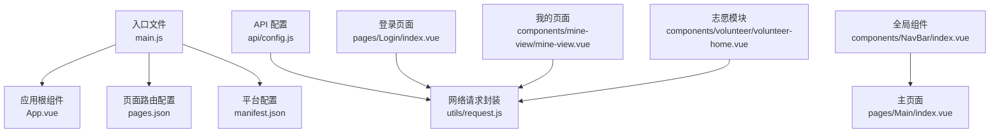
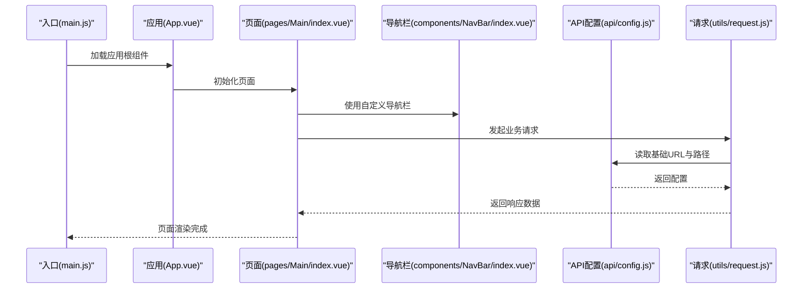
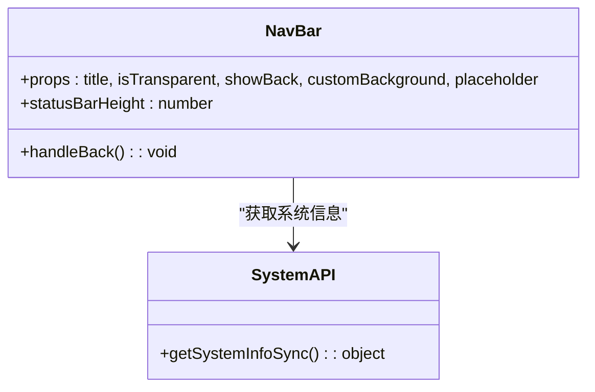
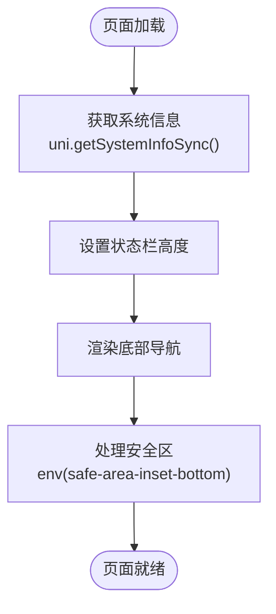
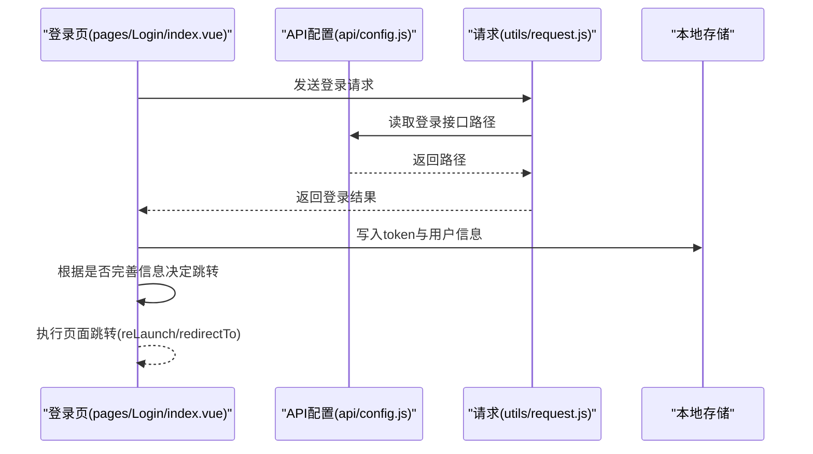
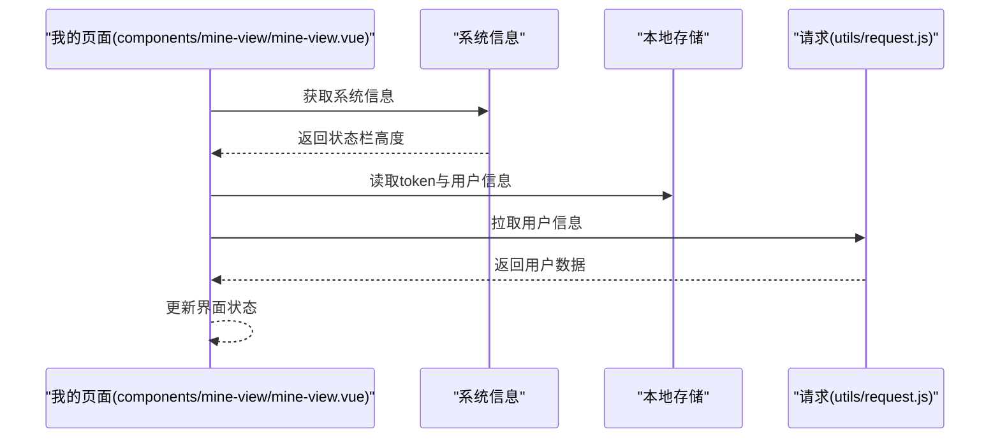
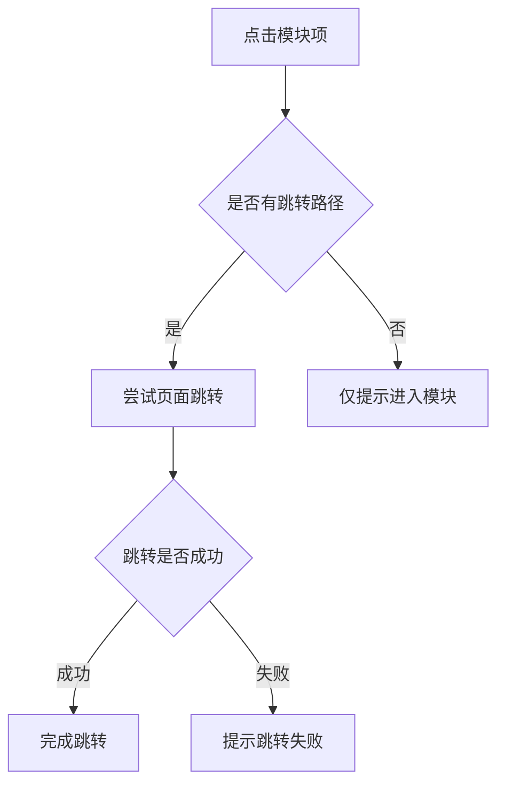
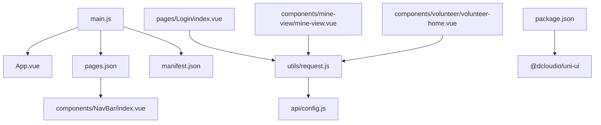

# 跨平台适配架构

<cite>
**本文档引用的文件**
- [App.vue](file://App.vue)
- [main.js](file://main.js)
- [manifest.json](file://manifest.json)
- [pages.json](file://pages.json)
- [package.json](file://package.json)
- [api/config.js](file://api/config.js)
- [utils/request.js](file://utils/request.js)
- [components/NavBar/index.vue](file://components/NavBar/index.vue)
- [pages/Main/index.vue](file://pages/Main/index.vue)
- [pages/Login/index.vue](file://pages/Login/index.vue)
- [components/mine-view/mine-view.vue](file://components/mine-view/mine-view.vue)
- [components/volunteer/volunteer-home.vue](file://components/volunteer/volunteer-home.vue)
</cite>

## 目录
1. [简介](#简介)
2. [项目结构](#项目结构)
3. [核心组件](#核心组件)
4. [架构总览](#架构总览)
5. [详细组件分析](#详细组件分析)
6. [依赖关系分析](#依赖关系分析)
7. [性能考虑](#性能考虑)
8. [故障排除指南](#故障排除指南)
9. [结论](#结论)
10. [附录](#附录)

## 简介
本项目基于 uni-app 构建，目标是实现一套代码在多端运行（微信小程序、H5、APP）。本文档围绕跨平台适配架构展开，系统阐述：
- uni-app 多端适配机制与编译时适配、运行时适配的区别及适用场景
- 不同平台（微信小程序、H5、APP）的差异化处理策略与兼容性方案
- 平台特定 API 调用、UI 组件差异与性能优化方法
- 平台检测机制、条件编译与平台特定配置的实现
- 跨平台测试与调试的最佳实践

## 项目结构
项目采用典型的 uni-app 结构，入口文件、页面路由、全局样式、API 配置与通用工具分布在不同目录中，便于按平台进行差异化配置与适配。

图表来源
- [main.js:1-26](file://main.js#L1-L26)
- [App.vue:1-40](file://App.vue#L1-L40)
- [pages.json:1-131](file://pages.json#L1-L131)
- [manifest.json:1-73](file://manifest.json#L1-L73)
- [api/config.js:1-60](file://api/config.js#L1-L60)
- [utils/request.js:1-98](file://utils/request.js#L1-L98)
- [components/NavBar/index.vue:1-68](file://components/NavBar/index.vue#L1-L68)
- [pages/Main/index.vue:1-224](file://pages/Main/index.vue#L1-L224)
- [pages/Login/index.vue:1-900](file://pages/Login/index.vue#L1-L900)
- [components/mine-view/mine-view.vue:180-219](file://components/mine-view/mine-view.vue#L180-L219)
- [components/volunteer/volunteer-home.vue:137-203](file://components/volunteer/volunteer-home.vue#L137-L203)

章节来源
- [main.js:1-26](file://main.js#L1-L26)
- [pages.json:1-131](file://pages.json#L1-L131)
- [manifest.json:1-73](file://manifest.json#L1-L73)

## 核心组件
- 应用入口与平台适配
  - 入口文件通过条件编译区分 Vue2/Vue3，分别挂载应用或导出 createApp，并在 Vue3 下全局注册自定义组件，保证多端一致的组件可用性。
- 页面路由与导航
  - pages.json 统一声明页面与全局导航样式，部分页面采用自定义导航栏，避免平台差异导致的导航冲突。
- 平台配置
  - manifest.json 针对不同平台（小程序、APP）设置权限、打包配置与特性开关，确保平台能力正确启用。
- API 与网络层
  - api/config.js 统一管理 API 基础地址与路径；utils/request.js 封装请求、鉴权与错误处理，屏蔽平台差异。
- 全局样式与组件
  - App.vue 定义全局主题变量与页面样式，components/NavBar/index.vue 提供跨平台导航栏组件，统一交互体验。

章节来源
- [main.js:1-26](file://main.js#L1-L26)
- [pages.json:1-131](file://pages.json#L1-L131)
- [manifest.json:1-73](file://manifest.json#L1-L73)
- [api/config.js:1-60](file://api/config.js#L1-L60)
- [utils/request.js:1-98](file://utils/request.js#L1-L98)
- [App.vue:1-40](file://App.vue#L1-L40)
- [components/NavBar/index.vue:1-68](file://components/NavBar/index.vue#L1-L68)

## 架构总览
下图展示从入口到页面与 API 的整体调用链路，体现 uni-app 在多端运行时的统一抽象与平台差异处理。

图表来源
- [main.js:1-26](file://main.js#L1-L26)
- [App.vue:1-40](file://App.vue#L1-L40)
- [pages/Main/index.vue:1-224](file://pages/Main/index.vue#L1-L224)
- [components/NavBar/index.vue:1-68](file://components/NavBar/index.vue#L1-L68)
- [api/config.js:1-60](file://api/config.js#L1-L60)
- [utils/request.js:1-98](file://utils/request.js#L1-L98)

## 详细组件分析

### 组件 A：导航栏组件（跨平台统一）
该组件通过 uni.getSystemInfoSync 获取系统信息，计算状态栏高度，提供透明/非透明模式与返回逻辑，满足不同页面的导航需求。

图表来源
- [components/NavBar/index.vue:23-48](file://components/NavBar/index.vue#L23-L48)

章节来源
- [components/NavBar/index.vue:1-68](file://components/NavBar/index.vue#L1-L68)

### 组件 B：主页面（底部导航与安全区）
主页面负责底部导航与内容区域切换，同时处理状态栏高度与安全区适配，确保在不同设备与系统下的视觉一致性。

图表来源
- [pages/Main/index.vue:99-114](file://pages/Main/index.vue#L99-L114)

章节来源
- [pages/Main/index.vue:1-224](file://pages/Main/index.vue#L1-L224)

### 组件 C：登录流程（平台差异与跳转）
登录页面封装账号密码与微信一键登录流程，处理登录成功后的页面跳转与缓存存储，针对不同平台的跳转 API 进行兼容。

图表来源
- [pages/Login/index.vue:196-282](file://pages/Login/index.vue#L196-L282)
- [api/config.js:18-22](file://api/config.js#L18-L22)
- [utils/request.js:24-66](file://utils/request.js#L24-L66)

章节来源
- [pages/Login/index.vue:1-900](file://pages/Login/index.vue#L1-L900)
- [api/config.js:1-60](file://api/config.js#L1-L60)
- [utils/request.js:1-98](file://utils/request.js#L1-L98)

### 组件 D：我的页面（用户信息与平台适配）
我的页面在挂载时获取系统信息并读取本地用户信息，结合请求封装进行用户数据拉取，体现跨平台的数据访问与状态管理。

图表来源
- [components/mine-view/mine-view.vue:189-219](file://components/mine-view/mine-view.vue#L189-L219)
- [utils/request.js:24-66](file://utils/request.js#L24-L66)

章节来源
- [components/mine-view/mine-view.vue:180-219](file://components/mine-view/mine-view.vue#L180-L219)
- [utils/request.js:1-98](file://utils/request.js#L1-L98)

### 组件 E：志愿模块（页面跳转与平台差异）
志愿模块在处理页面跳转时，对无路径的情况进行提示，体现跨平台跳转策略的一致性与容错处理。

图表来源
- [components/volunteer/volunteer-home.vue:137-147](file://components/volunteer/volunteer-home.vue#L137-L147)

章节来源
- [components/volunteer/volunteer-home.vue:137-203](file://components/volunteer/volunteer-home.vue#L137-L203)

## 依赖关系分析
- 入口与平台配置
  - main.js 通过条件编译支持 Vue2/Vue3，manifest.json 配置各平台特性与权限，pages.json 统一页面与导航样式。
- 组件与页面
  - pages/Main/index.vue 依赖 components/NavBar/index.vue；pages/Login/index.vue 依赖 utils/request.js 与 api/config.js。
- 第三方库
  - package.json 引入 @dcloudio/uni-ui，pages.json 中启用 easycom 自动扫描与 uni-ui 组件映射。

图表来源
- [main.js:1-26](file://main.js#L1-L26)
- [App.vue:1-40](file://App.vue#L1-L40)
- [pages.json:1-131](file://pages.json#L1-L131)
- [manifest.json:1-73](file://manifest.json#L1-L73)
- [components/NavBar/index.vue:1-68](file://components/NavBar/index.vue#L1-L68)
- [pages/Login/index.vue:1-900](file://pages/Login/index.vue#L1-L900)
- [utils/request.js:1-98](file://utils/request.js#L1-L98)
- [api/config.js:1-60](file://api/config.js#L1-L60)
- [components/mine-view/mine-view.vue:180-219](file://components/mine-view/mine-view.vue#L180-L219)
- [components/volunteer/volunteer-home.vue:137-203](file://components/volunteer/volunteer-home.vue#L137-L203)
- [package.json:1-6](file://package.json#L1-L6)

章节来源
- [package.json:1-6](file://package.json#L1-L6)
- [pages.json:1-131](file://pages.json#L1-L131)

## 性能考虑
- 图标与资源
  - 主页底部导航使用远程图片链接，建议在生产环境替换为自有 CDN 或本地静态资源，减少跨域与首屏加载时间。
- 动画与渲染
  - 主页底部导航包含弹性与发光动画，建议在低端设备上通过系统信息动态降级或禁用复杂动画，保证流畅度。
- 网络请求
  - 请求封装中统一注入 Authorization 头与错误处理，建议在高频请求场景增加缓存策略与超时控制，降低重复请求成本。
- 安全区适配
  - 使用 env(safe-area-inset-bottom) 处理刘海屏安全区，确保内容不被遮挡；在 APP 与小程序中保持一致的底部留白策略。

## 故障排除指南
- 登录失败与跳转异常
  - 当登录接口返回非 200 或缓存写入失败时，页面会提示错误并中断跳转；检查 API 配置与网络请求封装中的错误分支。
- 页面跳转失败
  - 志愿模块在无路径时仅提示，若出现跳转失败，检查 pages.json 中对应页面路径与页面声明。
- 状态栏高度异常
  - 若状态栏高度显示异常，确认 uni.getSystemInfoSync() 的调用时机与页面初始化顺序，避免在系统信息尚未返回时渲染。
- 平台权限问题
  - APP 打包涉及相机、网络等权限，需在 manifest.json 中按平台配置相应权限，避免运行时报错。

章节来源
- [pages/Login/index.vue:261-282](file://pages/Login/index.vue#L261-L282)
- [components/volunteer/volunteer-home.vue:137-147](file://components/volunteer/volunteer-home.vue#L137-L147)
- [components/NavBar/index.vue:34-37](file://components/NavBar/index.vue#L34-L37)
- [manifest.json:24-41](file://manifest.json#L24-L41)

## 结论
本项目通过统一的入口与配置、规范化的 API 与网络层封装，以及可复用的跨平台组件，实现了在微信小程序、H5 与 APP 上的一致体验。建议在后续迭代中进一步完善平台特定的条件编译与差异化配置，持续优化性能与用户体验。

## 附录

### 平台检测与条件编译
- 条件编译示例
  - Vue 版本选择：通过 VUE3 宏区分 Vue2/Vue3 入口与应用创建方式。
  - 平台宏：uni-ui 内部广泛使用 H5、MP-WEIXIN、APP-NVUE 等宏进行平台差异化处理，项目可参考此模式在自身代码中进行条件编译。
- 实施建议
  - 对于需要平台特定行为的模块，优先使用条件编译进行编译时适配；对于运行时差异，通过 uni.getSystemInfoSync 与平台能力检测进行运行时适配。

章节来源
- [main.js:3-12](file://main.js#L3-L12)
- [main.js:14-25](file://main.js#L14-L25)

### 平台特定配置清单
- 小程序（微信/支付宝/百度/头条）
  - pages.json 中启用 usingComponents，manifest.json 中配置 appid 与 urlCheck。
- APP（5+App）
  - manifest.json 中配置权限、打包与 nvue 编译器版本，确保相机、网络等权限正确生效。
- H5
  - pages.json 中启用 usingComponents，注意浏览器兼容性与第三方组件的按需引入。

章节来源
- [pages.json:52-67](file://pages.json#L52-L67)
- [manifest.json:52-67](file://manifest.json#L52-L67)
- [manifest.json:24-41](file://manifest.json#L24-L41)