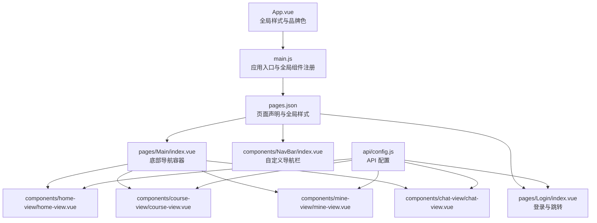
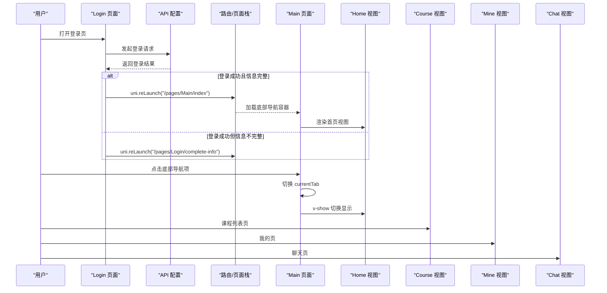
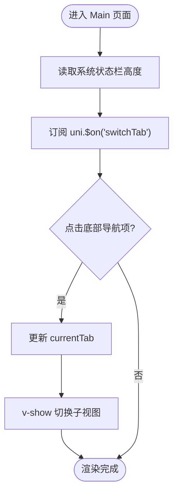
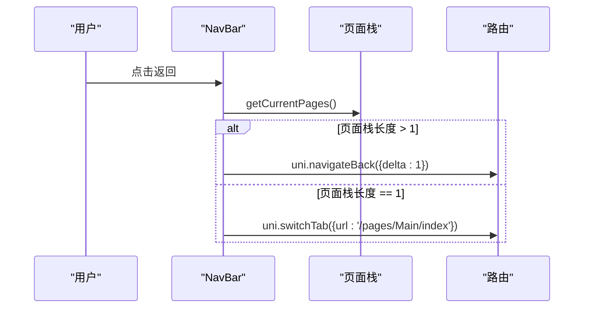
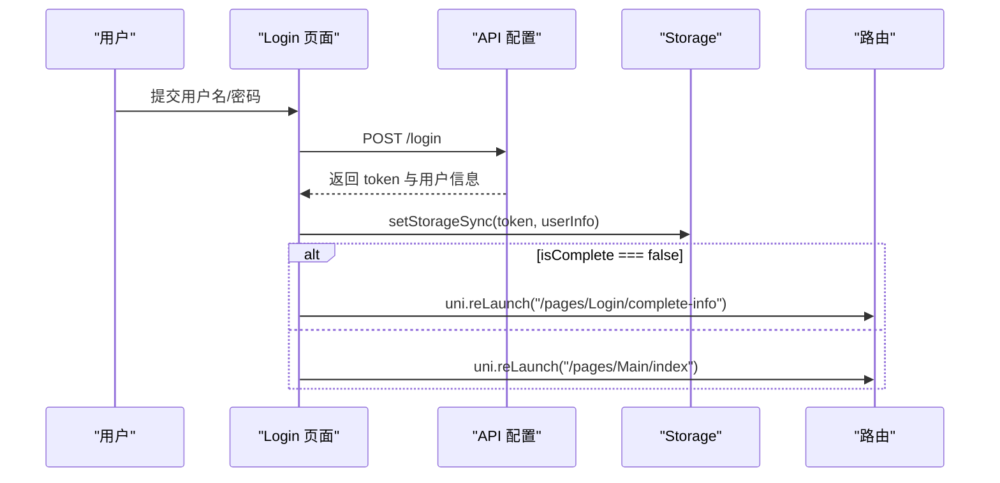
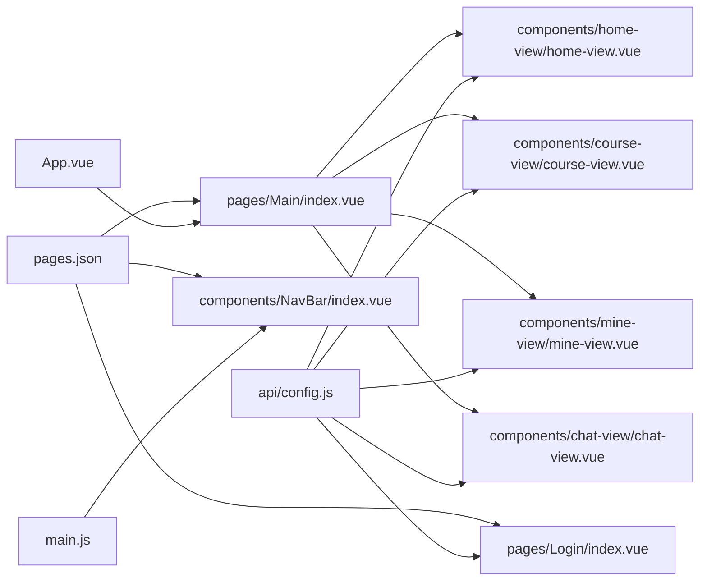

# 路由配置架构

<cite>
**本文引用的文件**
- [pages.json](file://pages.json)
- [App.vue](file://App.vue)
- [main.js](file://main.js)
- [manifest.json](file://manifest.json)
- [pages/Main/index.vue](file://pages/Main/index.vue)
- [components/NavBar/index.vue](file://components/NavBar/index.vue)
- [pages/Login/index.vue](file://pages/Login/index.vue)
- [api/config.js](file://api/config.js)
- [components/home-view/home-view.vue](file://components/home-view/home-view.vue)
- [components/course-view/course-view.vue](file://components/course-view/course-view.vue)
- [components/mine-view/mine-view.vue](file://components/mine-view/mine-view.vue)
- [components/chat-view/chat-view.vue](file://components/chat-view/chat-view.vue)
- [components/volunteer/volunteer-home.vue](file://components/volunteer/volunteer-home.vue)
</cite>

## 目录
1. [简介](#简介)
2. [项目结构](#项目结构)
3. [核心组件](#核心组件)
4. [架构总览](#架构总览)
5. [详细组件分析](#详细组件分析)
6. [依赖关系分析](#依赖关系分析)
7. [性能考虑](#性能考虑)
8. [故障排查指南](#故障排查指南)
9. [结论](#结论)
10. [附录](#附录)

## 简介
本文件面向致良知教育项目，系统性梳理 uni-app 的路由配置与导航机制，围绕以下目标展开：
- 解析 pages.json 的配置语法与页面声明方式
- 阐述页面间导航策略、路由参数传递与页面生命周期管理
- 说明底部导航的实现原理、页面切换动画与状态保持机制
- 提供路由守卫、权限控制与动态路由的实现方案
- 给出路由优化与性能调优建议

## 项目结构
项目采用 uni-app 多端统一框架，页面通过 pages.json 声明式注册，主应用入口在 main.js 中初始化，全局样式与主题在 App.vue 中定义，各业务页面位于 pages/ 与 components/ 下。

图表来源
- [pages.json:1-131](file://pages.json#L1-L131)
- [App.vue:1-40](file://App.vue#L1-L40)
- [main.js:1-26](file://main.js#L1-L26)
- [pages/Main/index.vue:1-224](file://pages/Main/index.vue#L1-L224)
- [components/home-view/home-view.vue:1-200](file://components/home-view/home-view.vue#L1-L200)
- [components/course-view/course-view.vue:1-142](file://components/course-view/course-view.vue#L1-L142)
- [components/mine-view/mine-view.vue:290-362](file://components/mine-view/mine-view.vue#L290-L362)
- [components/chat-view/chat-view.vue:1-51](file://components/chat-view/chat-view.vue#L1-L51)
- [components/NavBar/index.vue:1-68](file://components/NavBar/index.vue#L1-L68)
- [api/config.js:1-60](file://api/config.js#L1-L60)

章节来源
- [pages.json:1-131](file://pages.json#L1-L131)
- [App.vue:1-40](file://App.vue#L1-L40)
- [main.js:1-26](file://main.js#L1-L26)

## 核心组件
- 页面声明与全局样式：pages.json
- 应用入口与全局组件注册：main.js
- 全局样式与品牌色：App.vue
- 底部导航容器：pages/Main/index.vue
- 自定义导航栏：components/NavBar/index.vue
- 登录与跳转：pages/Login/index.vue
- API 配置：api/config.js
- 主页、课程、我的、聊天视图：对应组件

章节来源
- [pages.json:1-131](file://pages.json#L1-L131)
- [main.js:1-26](file://main.js#L1-L26)
- [App.vue:1-40](file://App.vue#L1-L40)
- [pages/Main/index.vue:1-224](file://pages/Main/index.vue#L1-L224)
- [components/NavBar/index.vue:1-68](file://components/NavBar/index.vue#L1-L68)
- [pages/Login/index.vue:1-900](file://pages/Login/index.vue#L1-L900)
- [api/config.js:1-60](file://api/config.js#L1-L60)

## 架构总览
uni-app 的路由体系以 pages.json 为中心，声明页面路径与样式；运行时通过 uni 对象进行页面跳转；App.vue 提供全局样式与品牌色；main.js 负责应用初始化与全局组件注册；业务页面通过组件化组织，配合自定义导航栏与底部导航实现统一体验。

图表来源
- [pages/Login/index.vue:186-260](file://pages/Login/index.vue#L186-L260)
- [pages/Main/index.vue:105-114](file://pages/Main/index.vue#L105-L114)
- [api/config.js:16-56](file://api/config.js#L16-L56)

## 详细组件分析

### 页面声明与样式配置（pages.json）
- 页面声明：通过 pages 数组逐项声明 path 与 style，支持 navigationStyle、navigationBarTitleText、navigationBarBackgroundColor、navigationBarTextStyle、backgroundColor、animationType、animationDuration 等。
- 全局样式：globalStyle 统一设置导航栏与背景色，便于品牌一致性。
- uniIdRouter：预留认证路由能力扩展字段。

章节来源
- [pages.json:1-131](file://pages.json#L1-L131)

### 应用入口与全局组件（main.js、App.vue）
- main.js：在 Vue 3 环境下通过 createApp 创建 SSR 应用，并全局注册 NavBar 组件，确保各页面可直接使用自定义导航栏。
- App.vue：定义全局样式变量与品牌色，强制 page 背景色与卡片样式，提升视觉一致性。

章节来源
- [main.js:1-26](file://main.js#L1-L26)
- [App.vue:1-40](file://App.vue#L1-L40)

### 底部导航容器（pages/Main/index.vue）
- 实现原理：使用 v-show 控制四个子视图的显示，通过 uni.$emit('switchTab', index) 接收来自子组件的消息，实现跨组件的底部导航切换。
- 状态保持：currentTab 记录当前选中项，切换时仅改变显示，不卸载子组件，从而保留内部状态。
- 动画与交互：底部导航项包含图标高亮、文字强调与弹性动画，增强交互体验。

图表来源
- [pages/Main/index.vue:99-114](file://pages/Main/index.vue#L99-L114)

章节来源
- [pages/Main/index.vue:1-224](file://pages/Main/index.vue#L1-L224)

### 自定义导航栏（components/NavBar/index.vue）
- 智能返回逻辑：通过 getCurrentPages() 判断页面栈深度，若大于 1 使用 uni.navigateBack，否则使用 uni.switchTab 回到首页，适配分享场景。
- 透明与占位：支持透明模式与占位元素，避免内容被导航栏遮挡。

图表来源
- [components/NavBar/index.vue:39-48](file://components/NavBar/index.vue#L39-L48)

章节来源
- [components/NavBar/index.vue:1-68](file://components/NavBar/index.vue#L1-L68)

### 登录与跳转（pages/Login/index.vue）
- 登录流程：表单校验、发起登录请求、存储 token 与用户信息、根据 isComplete 决策跳转至首页或信息补全页。
- 跳转策略：登录成功后使用 uni.reLaunch 确保页面栈干净，避免返回键回到登录页。
- 微信登录：通过 uni.login 获取 code，再提交昵称与头像，成功后同样使用 uni.reLaunch。

图表来源
- [pages/Login/index.vue:186-260](file://pages/Login/index.vue#L186-L260)
- [api/config.js:16-32](file://api/config.js#L16-L32)

章节来源
- [pages/Login/index.vue:1-900](file://pages/Login/index.vue#L1-L900)
- [api/config.js:1-60](file://api/config.js#L1-L60)

### 页面间导航策略与参数传递
- 页面栈管理：uni.reLaunch 用于登录成功后的页面栈重建；uni.navigateTo 用于常规页面跳转；uni.navigateBack 用于返回；uni.switchTab 用于底部导航切换。
- 参数传递：通过 uni.navigateTo({ url }) 传递查询参数，例如携带 campId、planId 等；在目标页面通过 onLoad/onLoad/onShow 等生命周期接收。
- 错误处理：在 uni.navigateTo.fail 中区分“页面不存在”等错误类型，给出友好提示。

章节来源
- [pages/Login/index.vue:186-260](file://pages/Login/index.vue#L186-L260)
- [components/mine-view/mine-view.vue:325-337](file://components/mine-view/mine-view.vue#L325-L337)
- [components/volunteer/volunteer-home.vue:127-146](file://components/volunteer/volunteer-home.vue#L127-L146)

### 页面生命周期管理
- App 生命周期：App.vue 定义 onLaunch/onShow/onHide，用于应用级事件处理。
- 页面生命周期：各业务组件在 mounted/onShow 等钩子中进行数据加载与状态恢复，减少首屏抖动。
- 首次加载优化：部分组件通过 isFirstLoad 控制入场动画，动画结束后关闭动画绑定，保证后续切换零延迟。

章节来源
- [App.vue:1-40](file://App.vue#L1-L40)
- [components/home-view/home-view.vue:183-190](file://components/home-view/home-view.vue#L183-L190)
- [components/chat-view/chat-view.vue:42-48](file://components/chat-view/chat-view.vue#L42-L48)

### 页面切换动画与状态保持
- 动画配置：pages.json 中为特定页面配置 animationType 与 animationDuration，实现滑入滑出等过渡效果。
- 状态保持：底部导航通过 v-show 控制子视图显示，避免频繁销毁与重建，保留内部状态；在 onShow 中按需刷新数据。

章节来源
- [pages.json:53-55](file://pages.json#L53-L55)
- [pages/Main/index.vue:105-114](file://pages/Main/index.vue#L105-L114)

### 路由守卫、权限控制与动态路由
- 路由守卫：uni-app 未提供内置路由守卫，可通过在页面 onShow/onLoad 中进行权限判断与拦截，结合 Storage 中的 token 与用户角色进行控制。
- 权限控制：在菜单点击或跳转前检查 token，未登录则引导至登录页；根据用户身份动态决定跳转目标（如学员端/志愿者端）。
- 动态路由：通过 uni.navigateTo({ url }) 动态拼接路径与参数，实现按需跳转；也可结合 uniIdRouter 字段预留认证路由扩展。

章节来源
- [components/mine-view/mine-view.vue:312-343](file://components/mine-view/mine-view.vue#L312-L343)
- [pages/Login/index.vue:186-260](file://pages/Login/index.vue#L186-L260)
- [pages.json:130-131](file://pages.json#L130-L131)

## 依赖关系分析

图表来源
- [pages.json:1-131](file://pages.json#L1-L131)
- [pages/Main/index.vue:1-224](file://pages/Main/index.vue#L1-L224)
- [pages/Login/index.vue:1-900](file://pages/Login/index.vue#L1-L900)
- [components/NavBar/index.vue:1-68](file://components/NavBar/index.vue#L1-L68)
- [components/home-view/home-view.vue:1-200](file://components/home-view/home-view.vue#L1-L200)
- [components/course-view/course-view.vue:1-142](file://components/course-view/course-view.vue#L1-L142)
- [components/mine-view/mine-view.vue:290-362](file://components/mine-view/mine-view.vue#L290-L362)
- [components/chat-view/chat-view.vue:1-51](file://components/chat-view/chat-view.vue#L1-L51)
- [api/config.js:1-60](file://api/config.js#L1-L60)
- [main.js:1-26](file://main.js#L1-L26)
- [App.vue:1-40](file://App.vue#L1-L40)

章节来源
- [pages.json:1-131](file://pages.json#L1-L131)
- [main.js:1-26](file://main.js#L1-L26)
- [App.vue:1-40](file://App.vue#L1-L40)

## 性能考虑
- 首屏与动画：通过 isFirstLoad 控制入场动画，动画结束后关闭动画绑定，降低后续切换成本。
- 页面栈管理：登录成功使用 uni.reLaunch 清理页面栈，避免返回键导致的重复加载。
- 数据懒加载：在 onShow 中按需刷新数据，避免在后台长时间占用资源。
- 图标与资源：底部导航图标采用 CDN 链接，减少本地体积；可在生产环境替换为自有资源。
- 缓存策略：合理使用 Storage 缓存 token 与用户信息，减少重复请求。

章节来源
- [components/home-view/home-view.vue:183-190](file://components/home-view/home-view.vue#L183-L190)
- [pages/Login/index.vue:226-260](file://pages/Login/index.vue#L226-L260)
- [pages/Main/index.vue:105-114](file://pages/Main/index.vue#L105-L114)

## 故障排查指南
- 页面跳转失败
  - 现象：uni.navigateTo.fail，提示“page not found”
  - 处理：检查 pages.json 中是否正确声明目标页面 path；确认 URL 拼写与参数格式
- 登录后无法进入首页
  - 现象：uni.reLaunch 失败或页面栈异常
  - 处理：确认 uni.reLaunch 的 url 正确；检查 Storage 中 token 与用户信息是否写入成功
- 底部导航切换无效
  - 现象：点击底部导航项无响应
  - 处理：确认 uni.$emit('switchTab', index) 是否触发；检查 uni.$on('switchTab') 是否在 onLoad 中注册
- 自定义导航栏返回异常
  - 现象：单页分享进入时返回到首页
  - 处理：确认 getCurrentPages() 返回长度为 1 时走 uni.switchTab 分支

章节来源
- [components/volunteer/volunteer-home.vue:127-146](file://components/volunteer/volunteer-home.vue#L127-L146)
- [pages/Login/index.vue:226-260](file://pages/Login/index.vue#L226-L260)
- [pages/Main/index.vue:105-114](file://pages/Main/index.vue#L105-L114)
- [components/NavBar/index.vue:39-48](file://components/NavBar/index.vue#L39-L48)

## 结论
本项目基于 pages.json 的声明式路由与 uni 对象的导航 API，构建了清晰的页面栈与统一的导航体验。通过底部导航容器的状态保持、自定义导航栏的智能返回、登录页的统一跳转策略以及 API 配置的集中管理，实现了良好的可维护性与用户体验。建议在后续迭代中补充路由守卫与权限拦截逻辑，并持续优化页面切换动画与数据加载策略。

## 附录
- 页面声明示例：参考 pages.json 中的 pages 数组与 globalStyle
- API 配置示例：参考 api/config.js 中的 baseUrl 与 paths
- 页面生命周期示例：参考各业务组件的 mounted/onShow/onLoad

章节来源
- [pages.json:1-131](file://pages.json#L1-L131)
- [api/config.js:1-60](file://api/config.js#L1-L60)