# 信息完善页面

<cite>
**本文档引用的文件**
- [complete-info.vue](file://pages/Login/complete-info.vue)
- [index.vue](file://pages/Login/index.vue)
- [china-area.js](file://pages/Login/china-area.js)
- [config.js](file://api/config.js)
- [pages.json](file://pages.json)
- [login-function-modification.md](file://doc/login-function-modification.md)
- [request.js](file://utils/request.js)
- [profile-edit.vue](file://pages/Mine/profile-edit.vue)
</cite>

## 目录
1. [简介](#简介)
2. [项目结构](#项目结构)
3. [核心组件](#核心组件)
4. [架构概览](#架构概览)
5. [详细组件分析](#详细组件分析)
6. [依赖关系分析](#依赖关系分析)
7. [性能考虑](#性能考虑)
8. [故障排除指南](#故障排除指南)
9. [结论](#结论)

## 简介

信息完善页面是致良知教育项目中的关键功能模块，负责处理用户首次登录或信息不完整时的数据收集和验证。该页面采用Vue.js框架构建，基于UniApp跨平台开发环境，实现了完整的用户信息收集流程，包括个人信息完善、头像上传、区域选择等功能。

该页面的核心价值在于：
- **用户体验优化**：通过渐进式信息收集，避免一次性填写过多信息造成用户负担
- **数据完整性保障**：强制收集必要信息，确保用户档案的完整性
- **业务流程支撑**：为后续的课程报名、证书颁发等业务功能提供基础数据支持
- **系统安全性**：通过Token验证和数据验证机制，确保数据的安全性和准确性

## 项目结构

信息完善页面位于项目的登录模块中，采用模块化的文件组织方式：

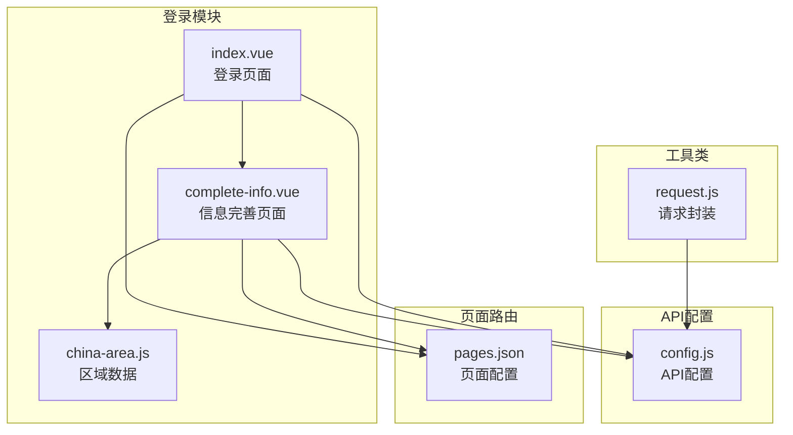

**图表来源**
- [complete-info.vue:1-50](file://pages/Login/complete-info.vue#L1-L50)
- [index.vue:1-50](file://pages/Login/index.vue#L1-L50)
- [config.js:1-30](file://api/config.js#L1-L30)

**章节来源**
- [complete-info.vue:1-100](file://pages/Login/complete-info.vue#L1-L100)
- [pages.json:1-50](file://pages.json#L1-L50)

## 核心组件

信息完善页面由多个核心组件构成，每个组件都有明确的职责分工：

### 主要组件架构

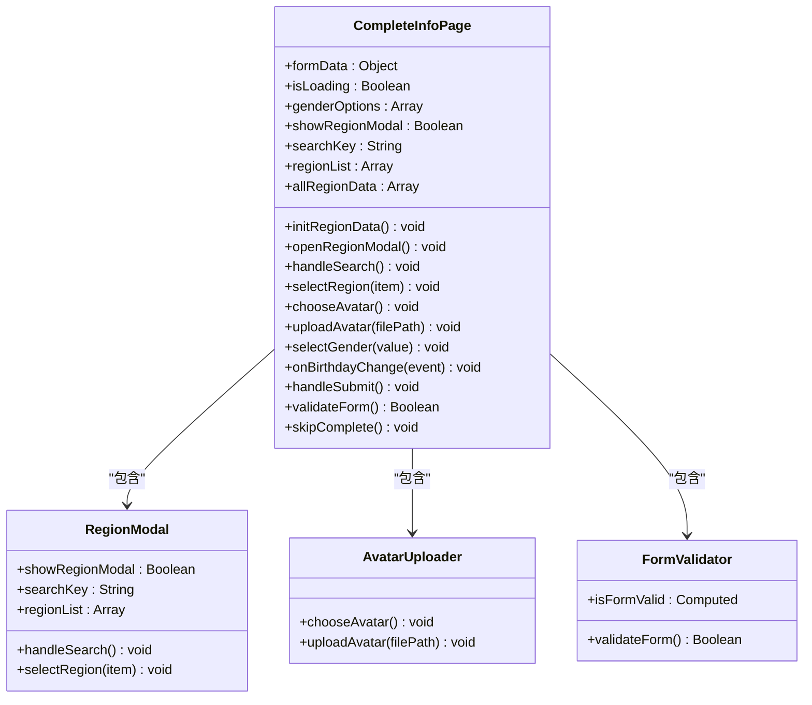

**图表来源**
- [complete-info.vue:143-375](file://pages/Login/complete-info.vue#L143-L375)

### 数据流架构

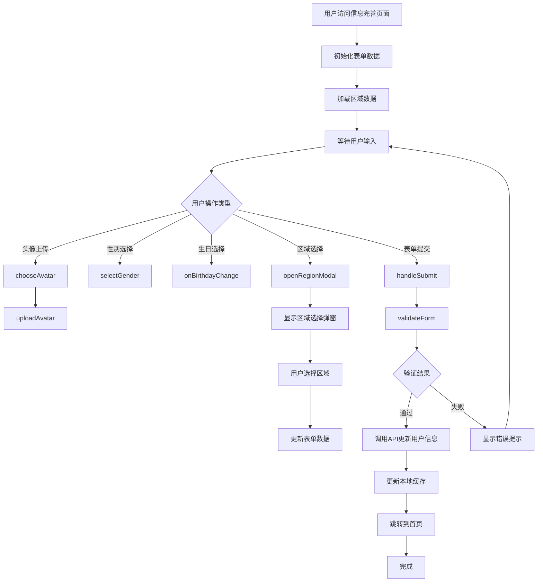

**图表来源**
- [complete-info.vue:296-374](file://pages/Login/complete-info.vue#L296-L374)

**章节来源**
- [complete-info.vue:143-375](file://pages/Login/complete-info.vue#L143-L375)

## 架构概览

信息完善页面采用MVVM架构模式，结合Vue.js的响应式数据绑定和组件化开发理念：

### 整体架构设计

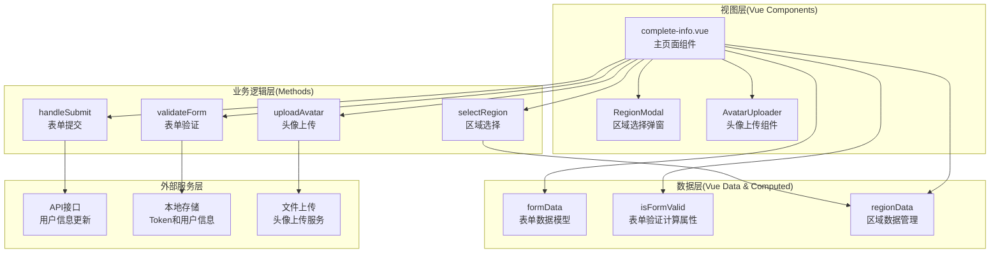

**图表来源**
- [complete-info.vue:138-375](file://pages/Login/complete-info.vue#L138-L375)

### 页面生命周期管理

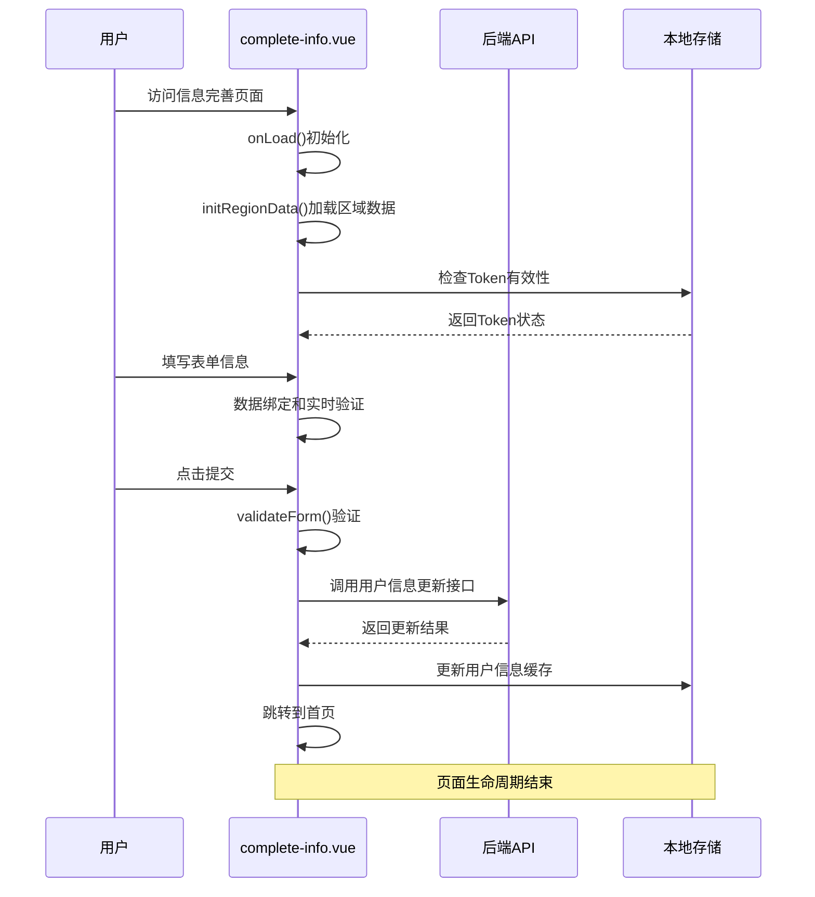

**图表来源**
- [complete-info.vue:168-374](file://pages/Login/complete-info.vue#L168-L374)

**章节来源**
- [complete-info.vue:138-375](file://pages/Login/complete-info.vue#L138-L375)

## 详细组件分析

### 表单设计与数据绑定

信息完善页面采用响应式表单设计，所有用户输入都通过v-model指令实现双向数据绑定：

#### 表单字段设计

| 字段名称 | 类型 | 必填 | 验证规则 | 描述 |
|---------|------|------|----------|------|
| avatar | 图片 | 否 | 文件大小限制 | 用户头像 |
| phone | 文本 | 是 | 11位手机号码 | 联系电话 |
| gender | 数字 | 是 | 0/1/2枚举值 | 性别选择 |
| birthday | 日期 | 是 | 有效日期范围 | 出生日期 |
| region | 文本 | 否 | 中文字符 | 所在地区 |
| profession | 文本 | 否 | 最多50字符 | 职业信息 |

#### 数据绑定实现

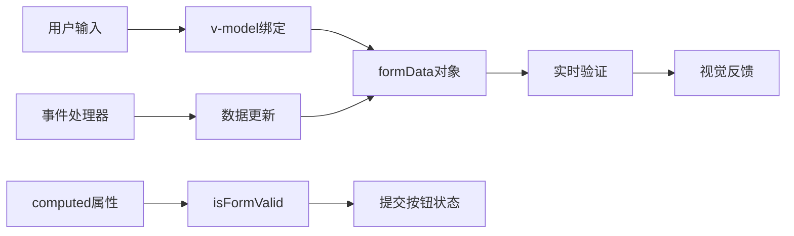

**图表来源**
- [complete-info.vue:146-179](file://pages/Login/complete-info.vue#L146-L179)

**章节来源**
- [complete-info.vue:27-97](file://pages/Login/complete-info.vue#L27-L97)

### 区域选择功能实现

区域选择功能是信息完善页面的重要特性，实现了省市区三级联动的选择逻辑：

#### 区域数据结构

```mermaid
graph TB
subgraph "区域数据源"
A[china-area.js<br/>区域数据文件]
end
subgraph "数据结构"
B[provinceList<br/>省份数组]
C[cityList<br/>城市数组]
end
subgraph "处理逻辑"
D[initRegionData()<br/>数据初始化]
E[openRegionModal()<br/>弹窗显示]
F[handleSearch()<br/>搜索过滤]
G[selectRegion()<br/>区域选择]
end
A --> B
A --> C
B --> D
C --> D
D --> E
E --> F
F --> G
```

**图表来源**
- [china-area.js:1-33](file://pages/Login/china-area.js#L1-L33)
- [complete-info.vue:182-217](file://pages/Login/complete-info.vue#L182-L217)

#### 区域选择流程

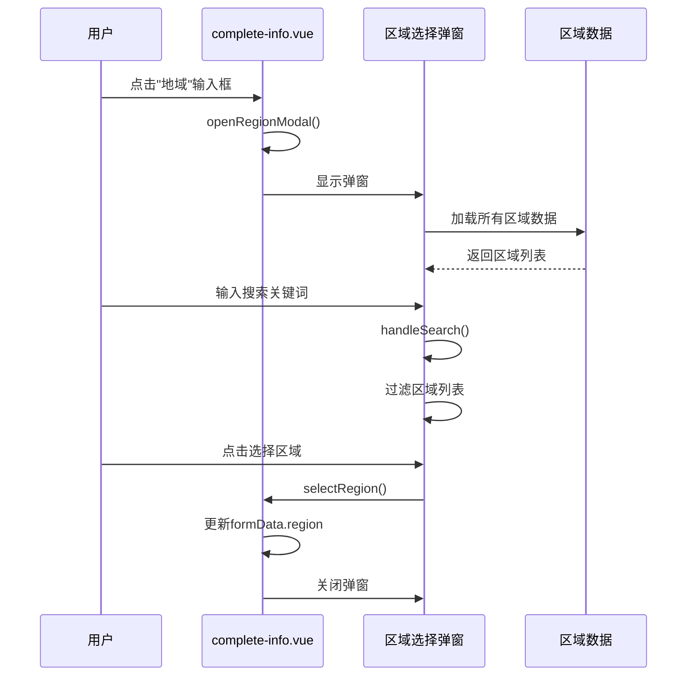

**图表来源**
- [complete-info.vue:194-217](file://pages/Login/complete-info.vue#L194-L217)

**章节来源**
- [china-area.js:1-33](file://pages/Login/china-area.js#L1-L33)
- [complete-info.vue:182-217](file://pages/Login/complete-info.vue#L182-L217)

### 表单验证机制

信息完善页面实现了多层次的表单验证机制，确保数据的准确性和完整性：

#### 验证规则定义

```mermaid
flowchart TD
A[表单提交] --> B[validateForm()]
B --> C{手机号验证}
C --> |为空| D[显示错误提示]
C --> |格式错误| D
C --> |正确| E{性别验证}
E --> |为空| F[显示错误提示]
E --> |正确| G{生日验证}
G --> |为空| H[显示错误提示]
G --> |正确| I[验证通过]
D --> J[阻止提交]
F --> J
H --> J
I --> K[继续处理]
```

**图表来源**
- [complete-info.vue:349-369](file://pages/Login/complete-info.vue#L349-L369)

#### 验证规则详解

| 验证类型 | 规则描述 | 错误提示 | 实现位置 |
|---------|----------|----------|----------|
| 手机号验证 | 11位数字，以1开头 | "请输入正确的手机号" | validateForm() |
| 性别验证 | 0/1/2枚举值 | "请选择性别" | validateForm() |
| 生日验证 | 有效日期 | "请选择生日" | validateForm() |
| 必填字段 | 非空检查 | 自动提示 | computed属性 |

**章节来源**
- [complete-info.vue:349-369](file://pages/Login/complete-info.vue#L349-L369)

### 头像上传功能

头像上传功能提供了灵活的图片选择和上传机制：

#### 上传流程设计

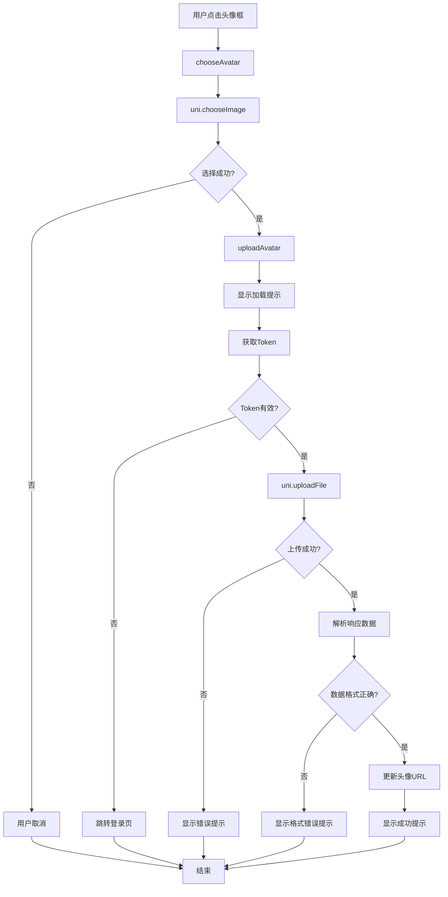

**图表来源**
- [complete-info.vue:220-286](file://pages/Login/complete-info.vue#L220-L286)

**章节来源**
- [complete-info.vue:220-286](file://pages/Login/complete-info.vue#L220-L286)

### 提交处理逻辑

信息完善页面的提交处理逻辑确保了数据的安全传输和用户体验的优化：

#### 提交流程分析

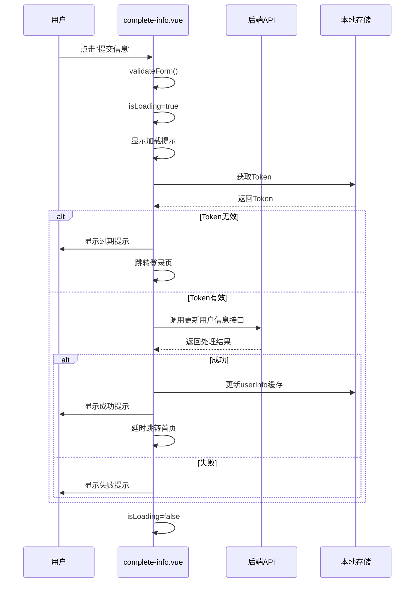

**图表来源**
- [complete-info.vue:296-347](file://pages/Login/complete-info.vue#L296-L347)

**章节来源**
- [complete-info.vue:296-347](file://pages/Login/complete-info.vue#L296-L347)

## 依赖关系分析

信息完善页面与其他系统组件存在密切的依赖关系：

### 外部依赖

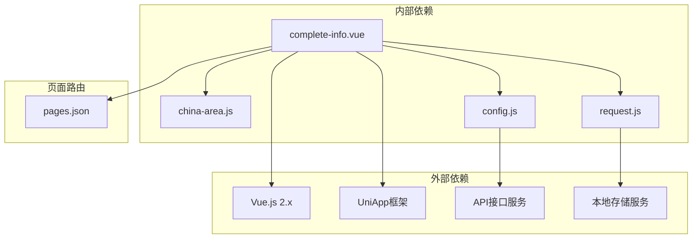

**图表来源**
- [complete-info.vue:139-141](file://pages/Login/complete-info.vue#L139-L141)
- [config.js:8-57](file://api/config.js#L8-L57)

### 组件间通信

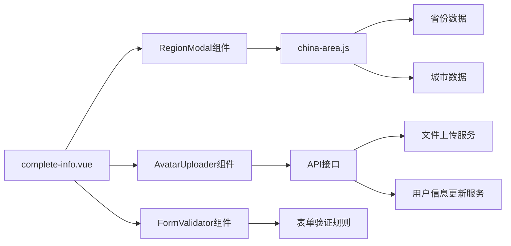

**图表来源**
- [complete-info.vue:140-141](file://pages/Login/complete-info.vue#L140-L141)

**章节来源**
- [complete-info.vue:139-141](file://pages/Login/complete-info.vue#L139-L141)
- [config.js:15-56](file://api/config.js#L15-L56)

## 性能考虑

信息完善页面在设计时充分考虑了性能优化：

### 数据加载优化

- **懒加载策略**：区域数据在用户需要时才加载，减少初始加载时间
- **缓存机制**：使用本地存储缓存Token和用户信息，避免重复请求
- **异步处理**：所有网络请求都采用异步处理，避免阻塞UI线程

### 内存管理

- **组件销毁**：页面卸载时自动清理事件监听器和定时器
- **数据清理**：离开页面时清理临时数据，释放内存空间
- **图片优化**：头像上传前进行压缩处理，减少网络传输量

### 用户体验优化

- **加载状态**：所有异步操作都显示加载状态，提升用户感知速度
- **错误处理**：完善的错误处理机制，提供友好的错误提示
- **响应式设计**：适配不同屏幕尺寸，确保在移动端的良好体验

## 故障排除指南

### 常见问题及解决方案

#### 登录状态异常

**问题现象**：提交信息时提示登录已过期

**可能原因**：
- Token过期或被清除
- 网络请求超时
- 后端服务异常

**解决步骤**：
1. 检查Token是否仍然有效
2. 确认网络连接状态
3. 验证后端API服务可用性
4. 重新登录系统

#### 区域选择异常

**问题现象**：区域选择弹窗无法正常显示或选择无效

**可能原因**：
- 区域数据加载失败
- 搜索功能异常
- 事件绑定问题

**解决步骤**：
1. 检查网络连接状态
2. 验证区域数据文件完整性
3. 查看控制台错误信息
4. 重新加载页面

#### 头像上传失败

**问题现象**：头像上传过程中出现错误

**可能原因**：
- 文件格式不支持
- 文件大小超出限制
- 网络连接异常
- 服务器配置问题

**解决步骤**：
1. 检查文件格式和大小
2. 确认网络连接稳定
3. 验证服务器配置
4. 尝试重新上传

#### 表单验证错误

**问题现象**：表单提交时出现验证错误提示

**可能原因**：
- 必填字段未填写
- 数据格式不符合要求
- 验证逻辑异常

**解决步骤**：
1. 检查必填字段是否完整
2. 验证数据格式正确性
3. 查看具体错误提示
4. 修正输入内容

**章节来源**
- [complete-info.vue:232-286](file://pages/Login/complete-info.vue#L232-L286)
- [complete-info.vue:349-369](file://pages/Login/complete-info.vue#L349-L369)

## 结论

信息完善页面作为致良知教育项目的重要组成部分，通过精心设计的用户界面和完善的后台逻辑，为用户提供了流畅的信息收集体验。该页面不仅满足了基本的功能需求，还在用户体验、数据安全和系统性能等方面做出了全面考虑。

### 主要优势

1. **用户体验优秀**：渐进式信息收集，避免用户负担
2. **数据质量高**：多重验证机制确保数据准确性
3. **系统集成度高**：与整个项目的架构完美融合
4. **扩展性强**：模块化设计便于功能扩展和维护

### 技术亮点

1. **响应式设计**：充分利用Vue.js的响应式特性
2. **异步处理**：完善的异步操作和错误处理机制
3. **本地存储**：合理的本地数据管理策略
4. **跨平台兼容**：基于UniApp的跨平台开发能力

### 改进建议

1. **国际化支持**：考虑添加多语言支持
2. **无障碍访问**：增强无障碍功能
3. **性能监控**：添加性能监控和分析功能
4. **测试覆盖**：增加单元测试和集成测试覆盖率

信息完善页面的成功实施为致良知教育项目奠定了坚实的基础，通过持续的优化和改进，将进一步提升用户满意度和业务效率。