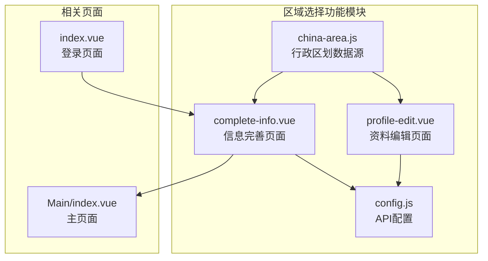
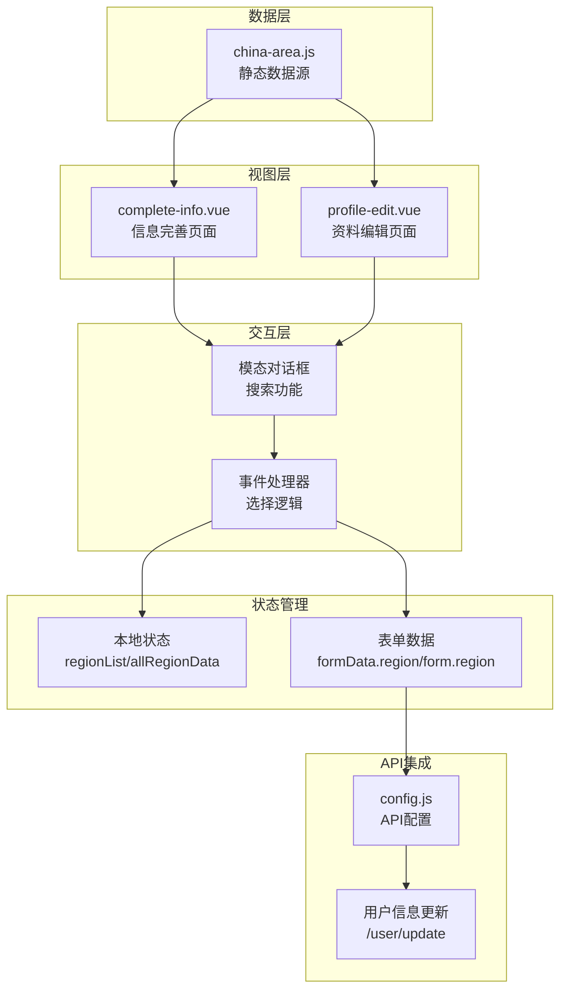
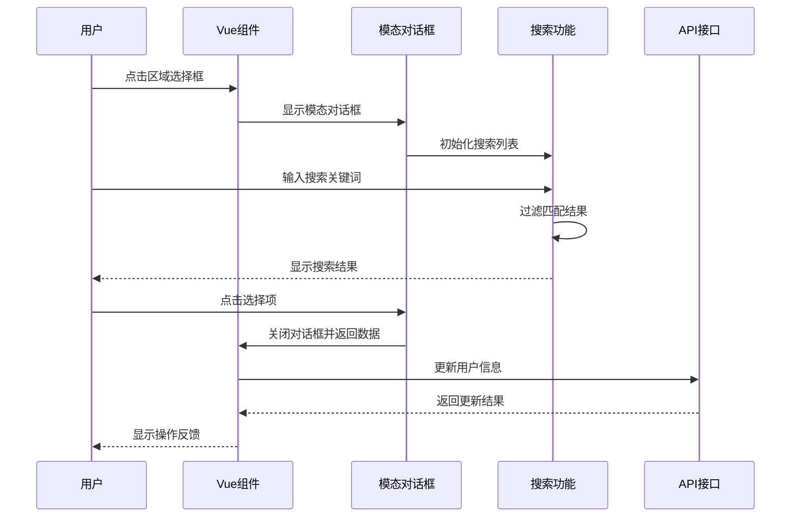
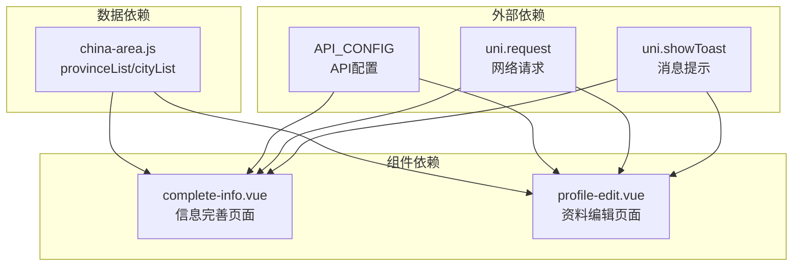
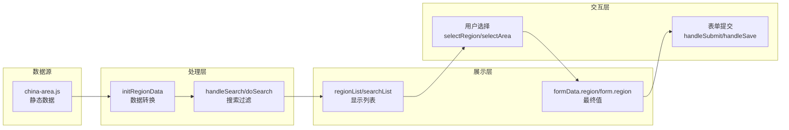

# 区域选择功能

<cite>
**本文档引用的文件**
- [china-area.js](file://pages/Login/china-area.js)
- [complete-info.vue](file://pages/Login/complete-info.vue)
- [profile-edit.vue](file://pages/Mine/profile-edit.vue)
- [config.js](file://api/config.js)
- [index.vue](file://pages/Login/index.vue)
</cite>

## 目录
1. [简介](#简介)
2. [项目结构](#项目结构)
3. [核心组件](#核心组件)
4. [架构概览](#架构概览)
5. [详细组件分析](#详细组件分析)
6. [依赖分析](#依赖分析)
7. [性能考虑](#性能考虑)
8. [故障排除指南](#故障排除指南)
9. [结论](#结论)

## 简介

致良知教育项目的区域选择功能是一个基于中国行政区划数据的三级联动选择器实现。该功能旨在为用户提供便捷的地域信息选择体验，支持省市区县的层级关系选择，并通过弹窗搜索的方式提升用户体验。

本功能主要包含两个核心页面：
- 用户信息完善页面：用于新用户首次登录时的个人信息补充
- 个人资料编辑页面：用于已注册用户的个人信息修改

## 项目结构

区域选择功能在项目中的组织结构如下：



**图表来源**
- [china-area.js:1-33](file://pages/Login/china-area.js#L1-L33)
- [complete-info.vue:138-141](file://pages/Login/complete-info.vue#L138-L141)
- [profile-edit.vue:117-119](file://pages/Mine/profile-edit.vue#L117-L119)

**章节来源**
- [china-area.js:1-33](file://pages/Login/china-area.js#L1-L33)
- [complete-info.vue:138-141](file://pages/Login/complete-info.vue#L138-L141)
- [profile-edit.vue:117-119](file://pages/Mine/profile-edit.vue#L117-L119)

## 核心组件

### 行政区划数据结构

系统采用双数组结构来表示中国行政区划数据：

#### 省级数据结构
- 类型：字符串数组
- 数量：34个省级行政区
- 包含：省、直辖市、自治区、特别行政区

#### 市级数据结构  
- 类型：二维数组
- 结构：与省级数组一一对应
- 每个省对应其下辖的所有地级市、自治州、盟等

#### 数据映射关系


**图表来源**
- [china-area.js:1-33](file://pages/Login/china-area.js#L1-L33)

### 选择器组件架构

系统实现了两种相似的区域选择器组件，分别服务于不同的业务场景：

#### 信息完善页面选择器
- 组件名称：`region-select`
- 触发方式：点击输入框
- 弹窗类型：模态对话框
- 搜索功能：支持按省或市名称搜索

#### 资料编辑页面选择器
- 组件名称：`area-selector`
- 触发方式：点击表单项
- 弹窗类型：模态对话框
- 搜索功能：支持按省或市名称搜索

**章节来源**
- [complete-info.vue:67-76](file://pages/Login/complete-info.vue#L67-L76)
- [profile-edit.vue:54-61](file://pages/Mine/profile-edit.vue#L54-L61)

## 架构概览

区域选择功能的整体架构采用分层设计：



**图表来源**
- [complete-info.vue:182-217](file://pages/Login/complete-info.vue#L182-L217)
- [profile-edit.vue:151-187](file://pages/Mine/profile-edit.vue#L151-L187)

## 详细组件分析

### 数据结构设计

#### 静态数据源分析

系统使用静态JavaScript文件存储行政区划数据，这种设计具有以下特点：

**数据完整性**
- 覆盖全国所有省级行政区
- 包含省会城市、地级市、自治州等各级行政区
- 数据格式标准化，便于后续扩展

**数据一致性**
- 省级与市级数据通过索引位置保持一一对应关系
- 字符串编码统一，避免特殊字符问题
- 数据结构简单明确，易于理解和维护

#### 动态数据转换

系统在运行时将静态数据转换为可直接使用的格式：

```mermaid
flowchart TD
A[provinceList<br/>["北京市","天津市",...]] --> B[initRegionData/initAllArea]
C[cityList<br/>[["北京市"],["石家庄市","唐山市"],...]] --> B
B --> D[生成组合数据<br/>[{province, city}, ...]]
D --> E[allRegionData/allArea]
E --> F[regionList/searchList]
```

**图表来源**
- [complete-info.vue:183-192](file://pages/Login/complete-info.vue#L183-L192)
- [profile-edit.vue:153-162](file://pages/Mine/profile-edit.vue#L153-L162)

**章节来源**
- [china-area.js:1-33](file://pages/Login/china-area.js#L1-L33)
- [complete-info.vue:183-192](file://pages/Login/complete-info.vue#L183-L192)
- [profile-edit.vue:153-162](file://pages/Mine/profile-edit.vue#L153-L162)

### 三级联动选择器实现

#### 用户交互流程



**图表来源**
- [complete-info.vue:194-217](file://pages/Login/complete-info.vue#L194-L217)
- [profile-edit.vue:164-187](file://pages/Mine/profile-edit.vue#L164-L187)

#### 状态管理机制

系统采用Vue的响应式数据绑定来管理选择器状态：

**本地状态管理**
- `showRegionModal/showAreaModal`: 控制模态对话框显示隐藏
- `searchKey`: 搜索关键词输入框
- `regionList/searchList`: 当前显示的区域列表
- `allRegionData/allArea`: 完整的区域数据集合

**表单数据绑定**
- `formData.region/form.region`: 用户选择的最终区域值
- 数据格式：`"省份 城市"` 的字符串形式

**章节来源**
- [complete-info.vue:144-165](file://pages/Login/complete-info.vue#L144-L165)
- [profile-edit.vue:122-135](file://pages/Mine/profile-edit.vue#L122-L135)

### 搜索功能实现

#### 搜索算法设计

系统实现了基于字符串包含的搜索算法：

```mermaid
flowchart TD
A[用户输入搜索关键词] --> B{关键词为空?}
B --> |是| C[恢复完整列表]
B --> |否| D[去除首尾空格]
D --> E[过滤条件<br/>province.includes(key) || city.includes(key)]
E --> F[更新搜索结果列表]
C --> G[显示结果]
F --> G
```

**图表来源**
- [complete-info.vue:202-211](file://pages/Login/complete-info.vue#L202-L211)
- [profile-edit.vue:172-181](file://pages/Mine/profile-edit.vue#L172-L181)

#### 性能优化策略

- **内存优化**：只在需要时创建搜索结果数组
- **渲染优化**：使用Vue的响应式更新机制
- **计算优化**：搜索结果缓存，避免重复计算

**章节来源**
- [complete-info.vue:202-211](file://pages/Login/complete-info.vue#L202-L211)
- [profile-edit.vue:172-181](file://pages/Mine/profile-edit.vue#L172-L181)

### 事件处理机制

#### 选择事件处理

```mermaid
flowchart TD
A[用户点击区域项] --> B[触发selectRegion/selectArea]
B --> C[格式化选择数据<br/>${province} ${city}]
C --> D[更新表单数据<br/>formData.region/form.region]
D --> E[关闭模态对话框]
E --> F[触发表单验证]
F --> G[准备提交数据]
```

**图表来源**
- [complete-info.vue:213-217](file://pages/Login/complete-info.vue#L213-L217)
- [profile-edit.vue:183-187](file://pages/Mine/profile-edit.vue#L183-L187)

#### 错误处理机制

系统实现了多层次的错误处理：

**数据加载错误**
- API请求失败时的提示和重试机制
- 缓存数据读取异常的降级处理

**用户交互错误**
- 输入验证失败的即时反馈
- 网络异常的友好提示

**章节来源**
- [complete-info.vue:296-347](file://pages/Login/complete-info.vue#L296-L347)
- [profile-edit.vue:294-311](file://pages/Mine/profile-edit.vue#L294-L311)

## 依赖分析

### 组件间依赖关系



**图表来源**
- [complete-info.vue:139-141](file://pages/Login/complete-info.vue#L139-L141)
- [profile-edit.vue:117-119](file://pages/Mine/profile-edit.vue#L117-L119)
- [config.js:8-57](file://api/config.js#L8-L57)

### 数据流向分析

系统的数据流遵循单向数据流原则：



**图表来源**
- [complete-info.vue:182-217](file://pages/Login/complete-info.vue#L182-L217)
- [profile-edit.vue:151-187](file://pages/Mine/profile-edit.vue#L151-L187)

**章节来源**
- [china-area.js:1-33](file://pages/Login/china-area.js#L1-L33)
- [complete-info.vue:182-217](file://pages/Login/complete-info.vue#L182-L217)
- [profile-edit.vue:151-187](file://pages/Mine/profile-edit.vue#L151-L187)

## 性能考虑

### 内存使用优化

- **数据压缩**：静态数据采用数组结构，内存占用最小化
- **按需加载**：搜索结果仅在需要时生成和渲染
- **状态清理**：模态对话框关闭时自动清理临时状态

### 渲染性能优化

- **虚拟滚动**：使用`scroll-view`组件优化长列表渲染
- **懒加载**：模态对话框内容按需渲染
- **事件节流**：搜索输入事件的防抖处理

### 网络性能优化

- **批量请求**：用户信息更新采用单次请求完成
- **缓存策略**：本地存储关键配置信息
- **错误重试**：网络异常时的自动重试机制

## 故障排除指南

### 常见问题及解决方案

#### 数据加载失败
**症状**：区域选择器无法显示数据
**原因**：静态数据文件加载失败
**解决方案**：
1. 检查`china-area.js`文件路径是否正确
2. 验证数据格式是否符合预期
3. 确认构建工具配置是否正确

#### 搜索功能异常
**症状**：搜索无结果或结果不准确
**原因**：搜索算法或数据格式问题
**解决方案**：
1. 检查搜索关键词的大小写处理
2. 验证数据中是否包含特殊字符
3. 确认过滤逻辑的正确性

#### 用户信息更新失败
**症状**：选择的区域信息未保存
**原因**：API调用或权限问题
**解决方案**：
1. 检查API配置是否正确
2. 验证用户登录状态
3. 确认网络连接状态

**章节来源**
- [complete-info.vue:296-347](file://pages/Login/complete-info.vue#L296-L347)
- [profile-edit.vue:294-311](file://pages/Mine/profile-edit.vue#L294-L311)

### 调试技巧

#### 开发者工具使用
- 使用浏览器开发者工具监控网络请求
- 检查Vue组件的状态变化
- 监控内存使用情况

#### 日志记录
- 在关键节点添加console.log输出
- 记录用户交互事件
- 监控API响应时间

## 结论

致良知教育项目的区域选择功能通过精心设计的数据结构和用户界面，为用户提供了直观便捷的地域信息选择体验。系统采用了静态数据源与动态处理相结合的设计模式，在保证数据准确性的同时提升了用户体验。

### 主要优势

1. **数据准确性**：基于官方行政区划标准的数据源
2. **用户体验**：简洁直观的选择界面和搜索功能
3. **性能表现**：优化的渲染和内存使用策略
4. **可维护性**：清晰的代码结构和模块化设计

### 改进建议

1. **数据同步**：建立定期更新机制以保持行政区划数据的时效性
2. **国际化支持**：考虑未来可能的多语言需求
3. **无障碍访问**：增强键盘导航和屏幕阅读器支持
4. **性能监控**：添加详细的性能指标监控

该功能为致良知教育项目提供了可靠的用户信息收集基础，为后续的功能扩展和数据分析奠定了良好的数据基础。