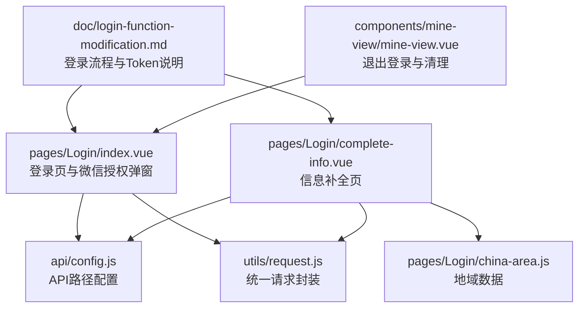
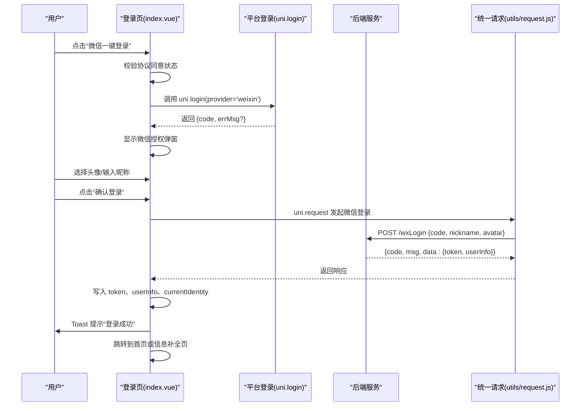
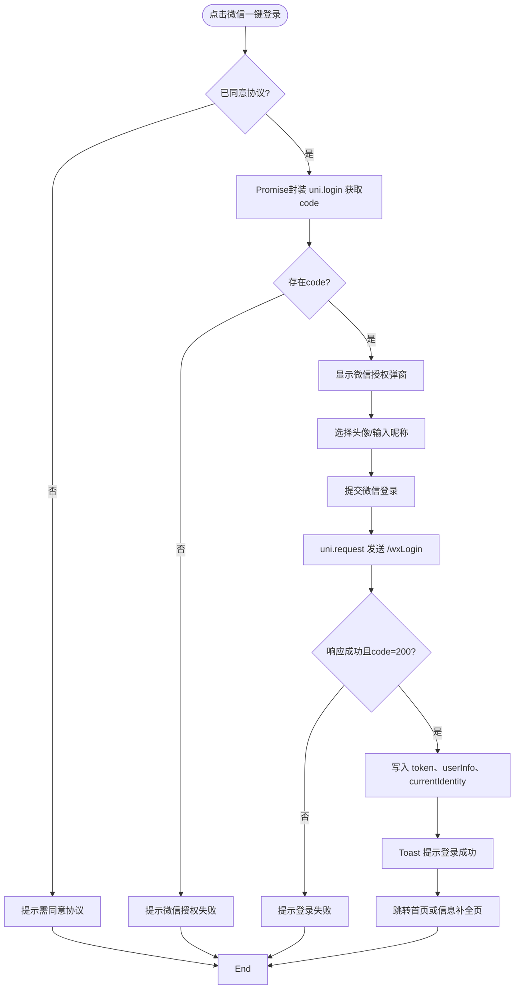
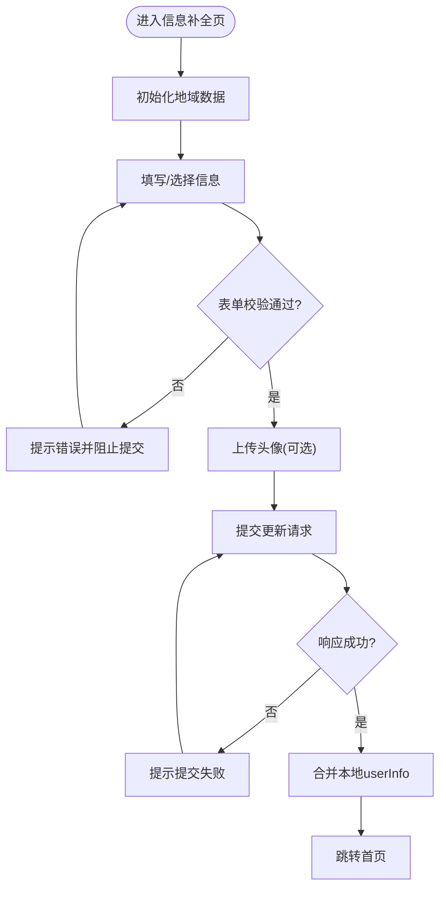
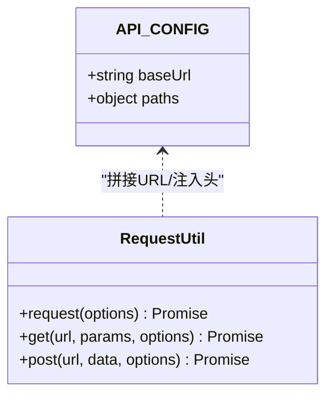
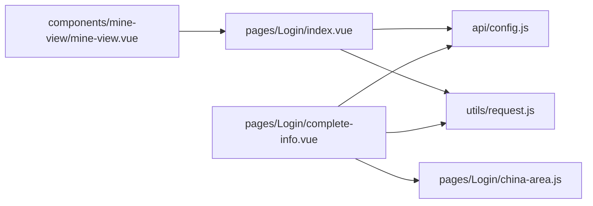

# 微信授权登录

<cite>
**本文引用的文件**
- [pages/Login/index.vue](file://pages/Login/index.vue)
- [pages/Login/complete-info.vue](file://pages/Login/complete-info.vue)
- [utils/request.js](file://utils/request.js)
- [api/config.js](file://api/config.js)
- [pages/Login/china-area.js](file://pages/Login/china-area.js)
- [doc/login-function-modification.md](file://doc/login-function-modification.md)
- [components/mine-view/mine-view.vue](file://components/mine-view/mine-view.vue)
</cite>

## 目录
1. [简介](#简介)
2. [项目结构](#项目结构)
3. [核心组件](#核心组件)
4. [架构总览](#架构总览)
5. [详细组件分析](#详细组件分析)
6. [依赖关系分析](#依赖关系分析)
7. [性能考量](#性能考量)
8. [故障排查指南](#故障排查指南)
9. [结论](#结论)
10. [附录](#附录)

## 简介
本文件面向致良知教育项目的“微信授权登录”功能，提供从触发机制、code获取、异步处理到弹窗设计与实现的全流程说明；并对比微信登录与账号密码登录在Token处理、用户信息存储与页面跳转上的差异与共性。文档包含流程图、类图与序列图，帮助开发者快速理解与维护该功能。

## 项目结构
围绕微信授权登录的关键文件与职责如下：
- 登录入口与微信授权弹窗：pages/Login/index.vue
- 用户信息补全：pages/Login/complete-info.vue
- API配置与路径：api/config.js
- 统一请求封装与Token注入：utils/request.js
- 地域选择数据：pages/Login/china-area.js
- 登录流程与Token存储说明：doc/login-function-modification.md
- 退出登录与本地存储清理：components/mine-view/mine-view.vue

图表来源
- [pages/Login/index.vue:1-136](file://pages/Login/index.vue#L1-L136)
- [api/config.js:1-60](file://api/config.js#L1-L60)
- [utils/request.js:1-98](file://utils/request.js#L1-L98)
- [pages/Login/complete-info.vue:1-136](file://pages/Login/complete-info.vue#L1-L136)
- [pages/Login/china-area.js:1-33](file://pages/Login/china-area.js#L1-L33)
- [doc/login-function-modification.md:1-230](file://doc/login-function-modification.md#L1-L230)
- [components/mine-view/mine-view.vue:360-370](file://components/mine-view/mine-view.vue#L360-L370)

章节来源
- [pages/Login/index.vue:1-136](file://pages/Login/index.vue#L1-L136)
- [api/config.js:1-60](file://api/config.js#L1-L60)
- [utils/request.js:1-98](file://utils/request.js#L1-L98)
- [pages/Login/complete-info.vue:1-136](file://pages/Login/complete-info.vue#L1-L136)
- [pages/Login/china-area.js:1-33](file://pages/Login/china-area.js#L1-L33)
- [doc/login-function-modification.md:1-230](file://doc/login-function-modification.md#L1-L230)
- [components/mine-view/mine-view.vue:360-370](file://components/mine-view/mine-view.vue#L360-L370)

## 核心组件
- 登录页与微信授权弹窗：负责触发微信授权、接收code、展示并收集头像与昵称、发起微信登录请求、处理Token与用户信息存储、页面跳转。
- 信息补全页：在用户首次登录或信息不完整时，引导用户完善手机号、性别、生日、地域、职业等信息，并提交更新。
- API配置：集中管理后端基础URL与各接口路径，便于统一维护。
- 统一请求封装：自动注入Token、处理401未授权、网络异常提示与错误拦截。
- 地域数据：提供省市区数据，支撑地域选择弹窗。
- 文档与退出登录：记录登录流程与Token存储策略，提供退出登录时的本地存储清理。

章节来源
- [pages/Login/index.vue:138-454](file://pages/Login/index.vue#L138-L454)
- [pages/Login/complete-info.vue:138-376](file://pages/Login/complete-info.vue#L138-L376)
- [api/config.js:8-57](file://api/config.js#L8-L57)
- [utils/request.js:7-67](file://utils/request.js#L7-L67)
- [pages/Login/china-area.js:1-33](file://pages/Login/china-area.js#L1-L33)
- [doc/login-function-modification.md:141-158](file://doc/login-function-modification.md#L141-L158)
- [components/mine-view/mine-view.vue:360-370](file://components/mine-view/mine-view.vue#L360-L370)

## 架构总览
微信授权登录的整体流程分为两阶段：
- 触发与code获取：用户点击“微信一键登录”，调用平台登录接口获取code，随后弹出微信授权弹窗。
- 异步登录与跳转：前端携带code与用户选择的头像/昵称向后端发起微信登录请求，接收Token与用户信息，写入本地存储并跳转至首页或信息补全页。

图表来源
- [pages/Login/index.vue:311-430](file://pages/Login/index.vue#L311-L430)
- [utils/request.js:24-67](file://utils/request.js#L24-L67)
- [api/config.js:16-25](file://api/config.js#L16-L25)

## 详细组件分析

### 登录页与微信授权弹窗
- 触发机制：点击“微信一键登录”按钮，先校验是否同意协议，再通过Promise封装的uni.login获取code。
- 弹窗设计：包含头像选择按钮（open-type="chooseAvatar"）、昵称输入框、确认与取消按钮；头像预览与占位提示。
- 异步处理：收集头像与昵称后，调用uni.request向后端发送code、昵称与头像；成功后写入token、userInfo与currentIdentity，并进行页面跳转。
- 错误处理：对网络异常、登录失败、缓存失败等情况进行Toast提示与降级处理。

图表来源
- [pages/Login/index.vue:311-430](file://pages/Login/index.vue#L311-L430)

章节来源
- [pages/Login/index.vue:103-135](file://pages/Login/index.vue#L103-L135)
- [pages/Login/index.vue:311-430](file://pages/Login/index.vue#L311-L430)

### 信息补全页
- 功能目标：在用户首次登录或信息不完整时，引导完善手机号、性别、生日、地域、职业等信息。
- 地域选择：提供弹窗式地域选择器，支持搜索省/市，数据来源于china-area.js。
- 提交流程：校验表单，携带Token调用更新接口，成功后合并本地userInfo并跳转首页。

图表来源
- [pages/Login/complete-info.vue:181-347](file://pages/Login/complete-info.vue#L181-L347)
- [pages/Login/china-area.js:1-33](file://pages/Login/china-area.js#L1-L33)

章节来源
- [pages/Login/complete-info.vue:138-376](file://pages/Login/complete-info.vue#L138-L376)
- [pages/Login/china-area.js:1-33](file://pages/Login/china-area.js#L1-L33)

### API配置与统一请求封装
- API配置：集中管理baseUrl与各接口路径，便于切换开发/生产环境与Mock。
- 统一请求：自动注入Token到Authorization头，处理401未授权（清除token并跳转登录），统一网络异常提示与错误拦截。

图表来源
- [api/config.js:8-57](file://api/config.js#L8-L57)
- [utils/request.js:7-67](file://utils/request.js#L7-L67)

章节来源
- [api/config.js:8-57](file://api/config.js#L8-L57)
- [utils/request.js:7-67](file://utils/request.js#L7-L67)

### 与账号密码登录的对比与共性
- 触发机制：账号密码登录直接提交用户名/密码；微信登录先获取code，再弹窗完善头像/昵称。
- Token处理：两者均在登录成功后写入token与userInfo，并设置currentIdentity；信息补全页均通过Token访问受保护接口。
- 页面跳转：均根据后端返回的完整性标识决定跳转至首页或信息补全页；均采用延迟跳转以提升体验。
- 错误处理：均包含网络异常、登录失败、缓存失败等提示与降级处理。

章节来源
- [pages/Login/index.vue:186-282](file://pages/Login/index.vue#L186-L282)
- [pages/Login/index.vue:342-430](file://pages/Login/index.vue#L342-L430)
- [doc/login-function-modification.md:53-97](file://doc/login-function-modification.md#L53-L97)

## 依赖关系分析
- 登录页依赖API配置与统一请求封装，用于构造请求URL与注入Token。
- 信息补全页同样依赖API配置与统一请求封装，并依赖地域数据。
- 退出登录组件负责清理本地存储，保证安全退出。

图表来源
- [pages/Login/index.vue:139](file://pages/Login/index.vue#L139)
- [pages/Login/complete-info.vue:139](file://pages/Login/complete-info.vue#L139)
- [api/config.js:8-57](file://api/config.js#L8-L57)
- [utils/request.js:7-67](file://utils/request.js#L7-L67)
- [pages/Login/china-area.js:1-33](file://pages/Login/china-area.js#L1-L33)
- [components/mine-view/mine-view.vue:360-370](file://components/mine-view/mine-view.vue#L360-L370)

章节来源
- [pages/Login/index.vue:138-454](file://pages/Login/index.vue#L138-L454)
- [pages/Login/complete-info.vue:138-376](file://pages/Login/complete-info.vue#L138-L376)
- [api/config.js:8-57](file://api/config.js#L8-L57)
- [utils/request.js:7-67](file://utils/request.js#L7-L67)
- [pages/Login/china-area.js:1-33](file://pages/Login/china-area.js#L1-L33)
- [components/mine-view/mine-view.vue:360-370](file://components/mine-view/mine-view.vue#L360-L370)

## 性能考量
- 异步与并发控制：微信登录提交时设置防重复提交标志，避免重复请求导致资源浪费。
- 加载与提示：统一使用加载提示与Toast，减少无效交互与重复点击。
- 跳转延迟：登录成功与信息补全成功后采用延迟跳转，确保用户感知反馈。
- Token注入：统一请求封装自动注入Token，减少重复代码与错误。

章节来源
- [pages/Login/index.vue:351-352](file://pages/Login/index.vue#L351-L352)
- [pages/Login/index.vue:355-356](file://pages/Login/index.vue#L355-L356)
- [utils/request.js:14-17](file://utils/request.js#L14-L17)

## 故障排查指南
- 微信授权失败
  - 症状：提示“微信授权失败”或未返回code。
  - 排查：确认已同意协议；检查平台登录权限与网络；查看uni.login回调错误信息。
  - 相关位置：[pages/Login/index.vue:318-335](file://pages/Login/index.vue#L318-L335)
- 弹窗未显示或头像/昵称为空
  - 症状：点击登录后未出现授权弹窗，或提交时报“请先选择头像/昵称”。
  - 排查：确认弹窗v-if绑定与chooseAvatar事件；检查头像选择与昵称输入逻辑。
  - 相关位置：[pages/Login/index.vue:103-135](file://pages/Login/index.vue#L103-L135)、[pages/Login/index.vue:338-350](file://pages/Login/index.vue#L338-L350)
- 登录成功但未跳转或跳转失败
  - 症状：登录成功提示后未跳转或跳转异常。
  - 排查：检查uni.reLaunch/redirectTo的回调与错误处理；确认页面路径正确。
  - 相关位置：[pages/Login/index.vue:393-411](file://pages/Login/index.vue#L393-L411)
- Token失效或未写入
  - 症状：信息补全页提示“登录已过期，请重新登录”。
  - 排查：确认登录成功后是否写入token；检查统一请求封装的401处理逻辑。
  - 相关位置：[utils/request.js:30-44](file://utils/request.js#L30-L44)、[pages/Login/complete-info.vue:303-310](file://pages/Login/complete-info.vue#L303-L310)
- 退出登录
  - 症状：退出后仍可访问受保护页面。
  - 排查：确认退出时是否移除token、userInfo、currentIdentity并跳转登录页。
  - 相关位置：[components/mine-view/mine-view.vue:360-370](file://components/mine-view/mine-view.vue#L360-L370)

章节来源
- [pages/Login/index.vue:318-335](file://pages/Login/index.vue#L318-L335)
- [pages/Login/index.vue:103-135](file://pages/Login/index.vue#L103-L135)
- [pages/Login/index.vue:393-411](file://pages/Login/index.vue#L393-L411)
- [utils/request.js:30-44](file://utils/request.js#L30-L44)
- [pages/Login/complete-info.vue:303-310](file://pages/Login/complete-info.vue#L303-L310)
- [components/mine-view/mine-view.vue:360-370](file://components/mine-view/mine-view.vue#L360-L370)

## 结论
微信授权登录在本项目中通过“平台登录获取code + 弹窗完善头像/昵称 + 后端换取Token”的模式实现，与账号密码登录共享Token处理、用户信息存储与页面跳转策略。通过统一请求封装与本地存储管理，系统在安全性与用户体验之间取得平衡。建议后续结合后端能力逐步放开微信登录功能，并完善错误监控与埋点，持续优化登录体验。

## 附录
- 代码实现示例（路径）
  - Promise封装与async/await使用：[pages/Login/index.vue:318-335](file://pages/Login/index.vue#L318-L335)、[pages/Login/index.vue:357-366](file://pages/Login/index.vue#L357-L366)
  - 错误处理与降级：[pages/Login/index.vue:334](file://pages/Login/index.vue#L334)、[pages/Login/index.vue:424-429](file://pages/Login/index.vue#L424-L429)
  - Token注入与401处理：[utils/request.js:14-17](file://utils/request.js#L14-L17)、[utils/request.js:30-44](file://utils/request.js#L30-L44)
  - 本地存储与清理：[pages/Login/index.vue:375-381](file://pages/Login/index.vue#L375-L381)、[components/mine-view/mine-view.vue:360-363](file://components/mine-view/mine-view.vue#L360-L363)